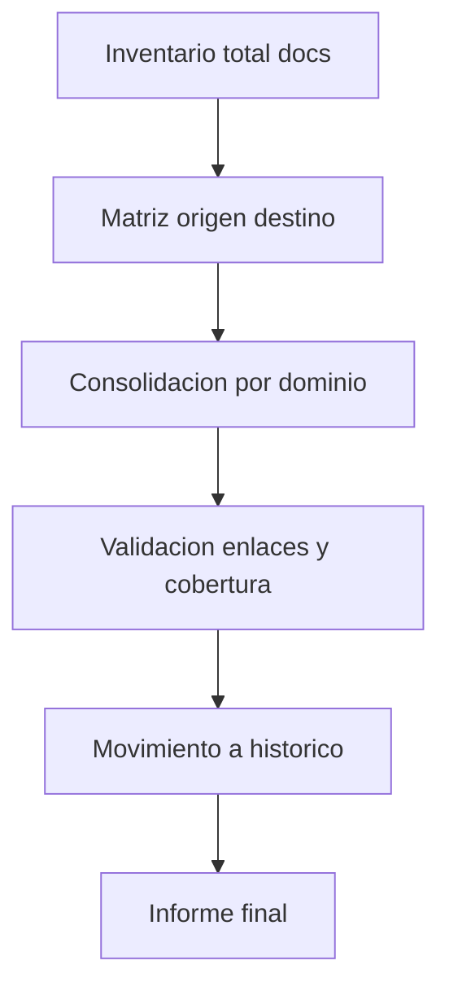

# Consolidacion de Documentacion - Indice de Trabajo

Fecha de corte: 2026-03-10
Alcance fuente: todos los archivos .md bajo docs/

Objetivo general:
- Consolidar documentacion sin perdida de contenido.
- Eliminar duplicados funcionales con trazabilidad auditable.
- Mantener un set de documentos maestros por dominio.

Indice visual:
- 01-inventario/INVENTARIO-FUENTE.md
- 01-inventario/MATRIZ-TRAZABILIDAD.md
- 02-estructura-destino/ESTRUCTURA-DESTINO.md
- 02-estructura-destino/GOBERNANZA-DOCUMENTAL.md
- 02-estructura-destino/DIAGRAMAS-INDICE.md

Reglas operativas:
- No borrar ningun .md sin registro en matriz.
- Ningun archivo sale del alcance.
- Todo cambio de maestro exige actualizar indice y trazabilidad.

## Flujo general de consolidacion

