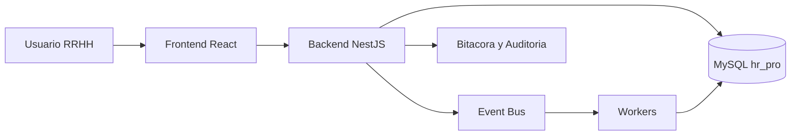

# Indice de Diagramas

Objetivo:
- Centralizar los diagramas de flujo de la documentacion consolidada.
- Facilitar onboarding tecnico y funcional.

Ubicacion de diagramas por dominio:
- 03-reglas/REGLAS-MAESTRAS-CANONICAS.md
- 04-arquitectura/ARQUITECTURA-GOBIERNO-CONSOLIDADO.md
- 05-seguridad-identidad-permisos/SEGURIDAD-IDENTIDAD-PERMISOS-CONSOLIDADO.md
- 06-backend-api-db/BACKEND-API-DB-CONSOLIDADO.md
- 07-frontend-ux/FRONTEND-UX-CONSOLIDADO.md
- 08-planilla/PLANILLA-NOMINA-CONSOLIDADO.md
- 09-acciones-personal/ACCIONES-PERSONAL-INDICE.md
- 10-testing-qa/TESTING-QA-CONSOLIDADO.md
- 11-operacion-automatizaciones/OPERACION-AUTOMATIZACIONES-CONSOLIDADO.md
- 12-backlog-pendientes/BACKLOG-CONSOLIDADO.md

## Mapa rapido del sistema

