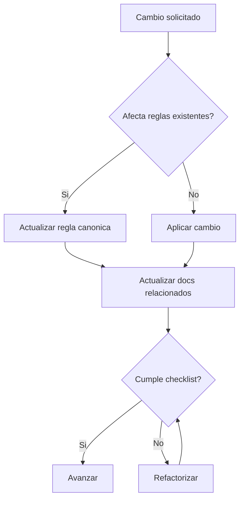
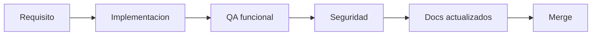

# Reglas Maestras Canonicas

Estado: vigente

Fuentes origen:
- docs/reglas/ReglasImportantes.md
- docs/reglas/ReglaCaracteresEspeciales.md
- docs/reglas/InstruccionesDocumentacionAPI.md

## Reglas globales
- Clean Code, SOLID, DRY, KISS, YAGNI.
- No borrar docs sin trazabilidad.
- Toda regla nueva se refleja en docs y en indice.
- No hardcode de seguridad, permisos ni contratos.

## Flujo de decision de cumplimiento


## Diagrama de calidad antes de merge



## Fuentes Integradas (Preservacion Completa)

Regla de consolidacion aplicada:
- Cada fuente original asignada a este maestro se preserva completa debajo de su encabezado.
- Esto garantiza trazabilidad y evita perdida de informacion durante la limpieza.

### Fuente: docs/reglas/InstruccionesDocumentacionAPI.md

```markdown
# Instrucciones para estandarizar documentacion del frontend

## Objetivo

Aplicar un estilo de documentacion uniforme, visual y mantenible en los archivos de `frontend/src`, usando bloques visuales con `=` en lugar de separadores con guiones.

## Archivo de referencia

Usar `frontend/src/api/accountingAccounts.ts` como **ejemplo base**.

## Reglas de formato

### 1. Encabezados de seccion

Todas las secciones grandes del archivo deben usar:

```
/* =============================================================================
   NOMBRE DE LA SECCION
   ============================================================================= */
```

Ejemplos: `INTERFACES DE DOMINIO`, `API: OPERACIONES CRUD`, `API: CATALOGOS AUXILIARES`.

### 2. Documentacion JSDoc de interfaces y funciones

Cada interfaz, tipo o funcion exportada debe tener bloque JSDoc con delimitadores `=`:

```
/**
 * ============================================================================
 * Nombre del Contrato
 * ============================================================================
 *
 * Descripcion general.
 *
 * Contexto funcional si aplica.
 *
 * @param param1 - Descripcion.
 * @returns Descripcion del retorno.
 *
 * @throws {Error} Cuando falla.
 *
 * ============================================================================
 */
```

### 3. No usar separadores con guiones

Eliminar bloques como:

```
// ---------------------------------------------------------------------------
// Texto
// ---------------------------------------------------------------------------
```

y reemplazarlos por bloques con `=` o JSDoc estructurado.

### 4. Orientacion de comentarios

- **Documentar:** proposito, decisiones de diseno, comportamiento esperado del backend, reglas de negocio.
- **No documentar:** lineas obvias que no aportan contexto (ej. `const qs = params.toString();`).

### 5. Lenguaje

- Espanol tecnico claro y consistente.
- Sin tildes en strings criticos (segun ReglaCaracteresEspeciales): preferir `integracion`, `accion`, `modulo`.

### 6. No modificar logica

El cambio debe ser **solo documentacion**:
- orden visual
- legibilidad
- consistencia
- JSDoc completo

No cambiar nombres de funciones, interfaces o contratos salvo mejora aprobada.

## Checklist de validacion

Antes de dar por terminado:

- [ ] No quedan bloques con `----------`
- [ ] Todas las funciones exportadas tienen JSDoc
- [ ] Todas las interfaces exportadas tienen JSDoc
- [ ] Las propiedades mas relevantes estan comentadas
- [ ] El archivo se puede escanear rapido por secciones
- [ ] No hay comentarios redundantes

## Alcance

Aplicar este estandar a todos los archivos en `frontend/src` que no lo tengan:
- `api/*.ts`
- `lib/*.ts`
- `hooks/*.ts`
- `store/**/*.ts`
- `queries/**/*.ts`
- etc.
```

### Fuente: docs/reglas/ReglaCaracteresEspeciales.md

```markdown
# Regla: No usar símbolos especiales que provocan mojibake

## Propósito

Evitar caracteres Unicode que, con codificación incorrecta (Latin-1, Windows-1252, etc.), se convierten en secuencias corruptas (por ejemplo o con tilde, símbolos lógicos o de caja mal interpretados). Esto genera texto ilegible y dificulta el mantenimiento del proyecto.

## Regla obligatoria

**NO usar** los siguientes tipos de caracteres en código fuente, comentarios, strings de UI ni documentación Markdown del proyecto:

### 1. Símbolos matemáticos o lógicos

| NO usar | Usar en su lugar | Ejemplo |
|-----------|---------------------|---------|
| `≠`       | `!=`                | `sys_empleados != sys_usuarios` |
| `→`       | `->`                     | `Abierta -> Verificada` |
| `↔`       | `-` o `<->`         | `Usuario - Rol - Empresa` |
| `≤` `≥`   | `<=` `>=`           | En código siempre ASCII |

### 2. Caracteres de caja / líneas decorativas

| NO usar | Usar en su lugar |
|-----------|---------------------|
| `─` `═` `│` `┌` `┐` | `-` o `---` |
| Cualquier box-drawing Unicode (U+2500–U+257F) | Guiones `-` |

### 3. Comillas y guiones especiales

| NO usar | Usar en su lugar |
|-----------|---------------------|
| `"` `"` (comillas tipográficas) | `"` `'` ASCII |
| `—` (em dash) | `-` |
| `…` (ellipsis) | `...` |

### 4. Viñetas y listas

| NO usar | Usar en su lugar |
|-----------|---------------------|
| `•` `◦` `‣` | `*` o `-` en Markdown |
| En CSS `content`: preferir `'-'` o `'*'` | Evitar `•` (U+2022) si hay riesgo de encoding |

### 5. Acentos y eñes en strings

**Recomendación:** Usar **solo ASCII** en identificadores, nombres de variables, claves y mensajes que puedan pasar por sistemas con codificación inconsistente.

| NO usar en strings de UI/API | Preferir |
|-------------------------------|-------------|
| `acción`, `Configuración`, `Período` | `accion`, `Configuracion`, `Periodo` |
| `integración`, `aprobación` | `integracion`, `aprobacion` |
| `líneas`, `transacción`, `múltiples` | `lineas`, `transaccion`, `multiples` |

Si el proyecto exige español correcto en UI (con tildes), asegurar que **todos** los archivos estén guardados en **UTF-8** y que el proyecto tenga configuración explícita de codificación en build/tests.

### 6. Escapes Unicode en strings literales

**NO usar** secuencias `\u00XX` para escribir acentos en strings de UI (ej. `l\u00EDneas`, `acci\u00F3n`, `m\u00FAltiples`). Son difíciles de leer y pueden provocar inconsistencias. Usar texto ASCII directo.

| NO usar | Usar |
|---------|------|
| `l\u00EDneas` | `lineas` |
| `acci\u00F3n` | `accion` |
| `m\u00FAltiples` | `multiples` |
| `per\u00EDodo` | `periodo` |
| `transacci\u00F3n` | `transaccion` |

## Resumen de reemplazos seguros

```
≠    →  !=
->   (flecha)
↔    →  -    o  <-> 
─═│  →  -
" "  →  " '
—    →  -
…    →  ...
•    →  *  o  -
```

## Checklist para el ingeniero

Antes de escribir código o documentación:

- [ ] No uso `≠`, `→`, `↔` ni símbolos similares; uso `!=`, `->`, `-`
- [ ] No uso caracteres de caja (box-drawing) en comentarios ni docs
- [ ] No uso comillas tipográficas ni em dash; uso comillas ASCII y guión
- [ ] En strings críticos prefiero ASCII sin tildes; no uso escapes \u00XX para acentos
- [ ] Los archivos están guardados en UTF-8

## Referencia: caracteres que provocaron problemas

En el proyecto se detectaron y corrigieron estos mojibake:

| Mojibake (texto corrupto) | Carácter original | Reemplazo seguro |
|---------------------------|-------------------|------------------|
| `≠`                     | `≠`               | `!=`             |
| `â"€â"€â"€`               | `───`             | `---`            |
| `â•â•â•â•`                 | `════`            | `-----`          |
| `â†"`                     | `↔`               | `-`              |
| `•`                     | `•`               | `*` o `-`        |
| integración (vista como corrupto) | `integración`     | `integracion`    |
| Período (vista como corrupto)     | `Período`         | `Periodo`        |
| distribución (vista como corrupto)| `distribución`    | `distribucion`   |
| `l\u00EDneas`             | `líneas`          | `lineas`         |
| `acci\u00F3n`             | `acción`          | `accion`         |
| `m\u00FAltiples`          | `múltiples`       | `multiples`      |
| `per\u00EDodo`            | `período`         | `periodo`        |
| `transacci\u00F3n`        | `transacción`     | `transaccion`    |

**Causas:** UTF-8 mal interpretado como Latin-1/Windows-1252; o escapes Unicode innecesarios que dificultan lectura.

---

Esta regla debe cumplirse en todo código nuevo y, cuando se toque código existente, corregir los símbolos que la violen.
```

### Fuente: docs/reglas/ReglasImportantes.md

```markdown
# Coding Standards & Clean Code Rules

Este documento define las **reglas obligatorias de desarrollo** del proyecto.

Todo ingeniero debe seguir estas reglas para garantizar que el cdigo sea:

- Legible
- Mantenible
- Escalable
- Fcil de entender por cualquier miembro del equipo

**Antes de hacer commit o Pull Request**, el ingeniero debe revisar este documento y confirmar que su cdigo cumple todas las reglas.

Cada cambio o funcionalidad debe quedar **documentado en la carpeta `docs/`** para mantener la documentacin del proyecto actualizada. Cuando se establezca o modifique una **regla, proceso o cualquier cosa que deba quedar plasmada**, hay que **actualizar todos los documentos** en `docs/` (y donde corresponda) donde sea necesario que esa informacin aparezca. Es **regla obligatoria** y se debe cumplir junto con el resto de este documento.

Si el cdigo no cumple estas reglas, **debe refactorizarse antes de integrarse al repositorio**.

**Cdigo existente:** cuando un ingeniero trabaje en cdigo que ya est en el repositorio, debe **revisarlo** contra este documento. Si **no cumple** lo que aqu se exige, **debe refactorizarlo** para que cumpla, en el mismo cambio o en uno dedicado. El objetivo es **ir limpiando y mejorando el cdigo** de forma continua; no se deja cdigo legacy que viole estas reglas con el pretexto de solo toqu una lnea.

---

## 1. Principios Fundamentales

Todo el cdigo debe seguir los siguientes principios:

- **Clean Code**
- **SOLID**
- **DRY (Don't Repeat Yourself)**
- **KISS (Keep It Simple)**
- **YAGNI (You Aren't Gonna Need It)**

Siempre priorizar:

> **Legibilidad > Complejidad**

Un cdigo que funciona pero es difcil de entender **no se considera cdigo aceptable**.

---

## 2. Cdigo Siempre Comentado

Todo el cdigo debe estar **documentado correctamente**.

No se trata de comentar cada lnea, sino de explicar:

- La intencin
- Las reglas de negocio
- Decisiones tcnicas importantes

Se debe utilizar **JSDoc o comentarios estructurados**.

**Ejemplo:**

```ts
/**
 * Representa una cuenta contable dentro del sistema.
 * Se utiliza para transportar informacin entre la base de datos,
 * servicios de negocio y la UI.
 */
export interface AccountingAccount {
  /** Identificador nico de la cuenta */
  id: number

  /** Empresa propietaria de la cuenta (multiempresa) */
  companyId: number

  /** Nombre descriptivo de la cuenta */
  name: string
}
```

Los comentarios deben explicar:

- **Por qu** existe el cdigo
- **Qu problema** resuelve
- **Reglas de negocio** relevantes

**Evitar** comentarios redundantes como:

```ts
let id: number // nmero
```

---

## 3. Nombres Claros y Descriptivos

Los nombres deben expresar la intencin del cdigo.

**Mal ejemplo:**

```ts
let d
let temp
let data
let x
```

**Buen ejemplo:**

```ts
diasTranscurridos
employeeId
totalPayrollAmount
isEmployeeActive
```

**Reglas:**

- Evitar abreviaturas innecesarias
- Usar nombres del dominio del negocio
- Los booleanos deben leerse como preguntas

**Ejemplos de booleanos:**

- `isActive`
- `hasAccess`
- `canExecute`

---

## 4. Funciones Pequeas y con Responsabilidad nica

Cada funcin debe hacer **una sola cosa** y hacerla bien.

**Reglas:**

- Mximo recomendado: **2030 lneas**
- Si supera ese tamao, dividir la funcin
- No mezclar lgica de negocio con infraestructura

**Mal ejemplo:**

```ts
validarYGuardarUsuario()
procesarYEnviarFactura()
```

**Buen enfoque:**

```ts
validarUsuario()
guardarUsuario()
enviarFactura()
```

---

## 5. Principio SOLID

El cdigo debe respetar **SOLID**.

Especialmente:

### SRP  Single Responsibility Principle

Cada mdulo, clase o funcin debe tener **una nica responsabilidad**.

Si algo cambia por ms de una razn, debe separarse.

**Ejemplo:**

| Incorrecto | Correcto |
|------------|----------|
| `UserService` hace: validar usuario, guardar usuario, enviar email, manejar base de datos | `UserValidator`, `UserRepository`, `EmailService`, `UserService` |

---

## 6. DRY  No Repetir Cdigo

La duplicacin genera deuda tcnica.

Si se detecta lgica repetida:

- Extraer a funcin
- Crear utilidades
- Reutilizar servicios

**Regla:** Si copias y pegas cdigo ms de una vez, debes refactorizar.

---

## 7. Estructura de Archivos

Los archivos deben mantenerse **pequeos y organizados**.

**Recomendaciones:**

- **Ideal:** 100300 lneas
- **Mximo absoluto:** 1000 lneas

Si un archivo supera ese tamao, **debe dividirse** en mltiples archivos.

**Ejemplo de estructura recomendada:**

```
/controllers
/services
/repositories
/models
/dto
/utils
/validators
```

Separar responsabilidades entre:

- Lgica de negocio
- Infraestructura
- Modelos
- Validaciones

---

## 8. Manejo de Errores Limpio

Evitar cdigo anidado excesivamente.

**Mal ejemplo:**

```ts
if (user) {
  if (user.isValid()) {
    if (user.age > 18) {
      // ...
    }
  }
}
```

**Buen ejemplo usando guard clauses:**

```ts
if (!user) return
if (!user.isValid()) return
if (!isAdult(user)) return

// Cdigo principal aqu
```

Esto mantiene el cdigo plano y legible.

---

## 9. Formateo Consistente

Todo el cdigo debe estar **correctamente formateado**.

Se deben usar herramientas como:

- **Prettier**
- **ESLint**

El cdigo debe parecer escrito por una sola persona, aunque participen varios ingenieros.

**Reglas:**

- Indentacin consistente
- Espacios correctos
- Estructura clara
- Sin cdigo muerto

---

## 10. Refactorizacin Continua

El cdigo debe mejorarse constantemente.

Aplicar la **Boy Scout Rule:**

> *"Deja el cdigo un poco ms limpio de como lo encontraste."*

**Revisar el cdigo existente:** cada vez que se modifique un archivo que ya existe en el proyecto, hay que **revisarlo** contra este documento. Si ese cdigo **no cumple** lo que aqu se indica (nombres, tamao de funciones, comentarios, tipado, manejo de errores, etc.), **hay que refactorizarlo** para que cumpla. No se hace solo el cambio mnimo; se aprovecha el contacto con el archivo para **ir limpiando y mejorando** el cdigo hasta alinearlo con estas reglas.

Cada vez que se modifique un archivo:

- Mejorar nombres
- Simplificar lgica
- Separar funciones grandes
- Eliminar duplicacin
- **Si el cdigo existente no cumple este documento, corregirlo hasta que cumpla**

---

## 11. Tipado Fuerte  Evitar `any` y Tipos Implcitos

En TypeScript (y en cualquier lenguaje tipado), el tipo es **documentacin ejecutable**.

**Reglas:**

- **No usar `any`** salvo integracin con libreras sin tipos; preferir `unknown` y acotar.
- Definir interfaces/types para contratos (APIs, DTOs, respuestas).
- Habilitar y respetar `strict` (o equivalente) en el compilador.

**Mal ejemplo:**

```ts
function process(data: any) {
  return data.value * 2
}
```

**Buen ejemplo:**

```ts
interface ProcessInput {
  value: number
}
function process(data: ProcessInput): number {
  return data.value * 2
}
```

---

## 12. Inmutabilidad y Efectos Secundarios

Preferir datos inmutables y funciones puras donde sea posible.

**Reglas:**

- Preferir `const` sobre `let`; evitar reasignaciones innecesarias.
- No mutar argumentos de funcin; devolver nuevos valores en lugar de modificar entradas.
- Reducir efectos secundarios (I/O, mutacin global) a puntos concretos y bien identificados.

**Mal ejemplo:**

```ts
function addItem(cart: Item[]) {
  cart.push(newItem) // muta el argumento
}
```

**Buen ejemplo:**

```ts
function addItem(cart: Item[], newItem: Item): Item[] {
  return [...cart, newItem]
}
```

---

## 13. Argumentos y Parmetros

Mantener las firmas de funciones simples y predecibles.

**Reglas:**

- **Mximo 34 parmetros** por funcin. Si necesitas ms, agrupar en un objeto de opciones.
- Parmetros opcionales al final; usar objetos de opciones en lugar de muchos booleanos.
- Evitar parmetros que cambien el comportamiento de forma radical (flags que convierten la funcin en dos funciones en una).

**Mal ejemplo:**

```ts
function createUser(name: string, email: string, age: number, active: boolean, role: string) {}
```

**Buen ejemplo:**

```ts
interface CreateUserInput {
  name: string
  email: string
  age: number
  active?: boolean
  role?: string
}
function createUser(input: CreateUserInput) {}
```

---

## 14. Un Solo Nivel de Abstraccin por Funcin

Dentro de una misma funcin no mezclar detalles de bajo nivel con lgica de alto nivel.

**Reglas:**

- Una funcin debe operar en **un solo nivel de abstraccin** (por ejemplo: solo qu hace el negocio o solo cmo se accede al disco).
- Extraer los detalles a funciones con nombres que describan ese nivel.

**Mal ejemplo:**

```ts
function processOrder(order: Order) {
  const db = getConnection()
  const row = db.query('SELECT * FROM inventory WHERE id = ?', order.itemId)
  if (row.quantity < order.quantity) throw new Error('Sin stock')
  const total = order.quantity * getPrice(order.itemId)
  sendEmail(order.customerId, `Pedido: ${total}`)
}
```

**Buen ejemplo:**

```ts
function processOrder(order: Order) {
  ensureStockAvailable(order)
  const total = calculateOrderTotal(order)
  notifyCustomer(order.customerId, total)
}
```

---

## 15. Constantes y Configuracin  Sin Nmeros o Cadenas Mgicas

Todo valor con significado de negocio o tcnico debe tener nombre.

**Reglas:**

- Extraer **nmeros y cadenas literales** a constantes con nombre (o en configuracin).
- Agrupar constantes por dominio (errores, lmites, mensajes, cdigos).

**Mal ejemplo:**

```ts
if (user.role === 'ADM') { }
if (items.length > 100) { }
```

**Buen ejemplo:**

```ts
const ROLES = { ADMIN: 'ADM', USER: 'USR' } as const
const MAX_ITEMS_PER_PAGE = 100
if (user.role === ROLES.ADMIN) { }
if (items.length > MAX_ITEMS_PER_PAGE) { }
```

---

## 16. Errores y Excepciones  No Tragarse los Errores

El manejo de errores debe ser explcito y til para depuracin y operacin.

**Reglas:**

- **No usar `catch` vaco**; al menos loguear o re-lanzar con contexto.
- Usar tipos de error especficos (clases o cdigos) en lugar de strings genricos.
- En APIs, devolver cdigos y mensajes coherentes; documentar errores posibles en JSDoc.

**Mal ejemplo:**

```ts
try {
  await saveUser(user)
} catch {
  // silencio
}
```

**Buen ejemplo:**

```ts
try {
  await saveUser(user)
} catch (error) {
  logger.error('Error guardando usuario', { userId: user.id, error })
  throw new UserSaveError('No se pudo guardar el usuario', { cause: error })
}
```

---

## 17. Dependencias Explcitas  Inyeccin y Testabilidad

Las dependencias no deben estar escondidas dentro de la funcin o mdulo.

**Reglas:**

- Pasar **dependencias por parmetro o constructor** (inyeccin de dependencias), no instanciarlas dentro (ej. no `new Repository()` dentro del servicio).
- Facilita tests (mocks) y hace evidente qu usa cada componente.
- En frontend: mismo criterio para APIs, navegacin, etc.

**Mal ejemplo:**

```ts
class UserService {
  createUser(data: CreateUserDTO) {
    const repo = new UserRepository()
    return repo.save(data)
  }
}
```

**Buen ejemplo:**

```ts
class UserService {
  constructor(private readonly userRepository: UserRepository) {}
  createUser(data: CreateUserDTO) {
    return this.userRepository.save(data)
  }
}
```

---

## 18. Cdigo Testeable por Diseo

Si el cdigo es difcil de testear, suele ser una seal de diseo mejorable.

**Reglas:**

- Funciones puras y pequeas son ms fciles de testear.
- Evitar lgica compleja acoplada a frameworks (UI, HTTP); extraer a servicios/funciones que se puedan probar con unit tests.
- Naming de tests: describir comportamiento, no implementacin (ej. debe calcular el total con descuento cuando el usuario es premium).

---

## 19. Complejidad y Legibilidad  Evitar Anidacin y Ramas Excesivas

Mantener la complejidad ciclomtica baja.

**Reglas:**

- Preferir **guard clauses** (salida temprana) en lugar de mltiples niveles de `if/else`.
- Si una funcin tiene muchos `if/else` o `switch`, valorar extraer a funciones o estrategias por tipo/caso.
- Mximo recomendado: **complejidad ciclomtica menor a 10** por funcin (herramientas como ESLint pueden reportarlo).

**Principio de menor asombro:** el cdigo debe comportarse como un lector esperara segn su nombre y contexto.

---

## 20. Documentacin del Proyecto (carpeta `docs/`)

**Regla obligatoria:** cada vez que se implemente o modifique algo en el proyecto, la documentacin debe actualizarse en la carpeta **`docs/`**.

**Qu documentar:**

- **Nuevas funcionalidades o mdulos:** describir qu hace, cmo se usa y dnde est en el cdigo (o enlazar al cdigo).
- **Cambios en APIs (endpoints, contratos):** actualizar o crear documentos de API, ejemplos de request/response.
- **Cambios en flujos de negocio o reglas:** actualizar guas, diagramas o documentos de dominio que correspondan.
- **Nuevas decisiones tcnicas o de arquitectura:** registrarlas en la documentacin tcnica o en ADRs (Architecture Decision Records) si aplica.
- **Configuracin, variables de entorno o despliegue:** mantener actualizado el README o la seccin de setup en `docs/`.

**Dnde va:**

- Todo debe vivir dentro de la carpeta **`docs/`** del repositorio (o subcarpetas como `docs/api/`, `docs/arquitectura/`, `docs/reglas/`, etc.).
- Formato preferido: **Markdown (`.md`)** para que sea legible en el repo y en GitHub/GitLab.

**Cundo:**

- En el **mismo commit o PR** donde se hace el cambio de cdigo. La documentacin no es opcional ni para despus.

**Actualizar todos los docs donde sea necesario:** cuando se agregue o cambie una **regla**, un **proceso**, un **flujo**, una **decisin** o cualquier cosa que **deba quedar plasmada** en el proyecto, el ingeniero debe **actualizar todos los documentos** en `docs/` (y en cualquier otro lugar relevante, por ejemplo README, wikis internas) donde esa informacin deba reflejarse. No basta con tocar un solo archivo: hay que revisar y actualizar **cada doc** que haga referencia al tema o que deba incluir el cambio (ndices, resmenes, guas, reglas, APIs, etc.). El objetivo es que la documentacin quede **consistente y al da** en todos los puntos afectados.

Esta regla forma parte de las reglas de desarrollo del proyecto y **debe cumplirse** junto con todas las dems de este documento.

---

## 21. Checklist antes de hacer Commit o PR

Antes de enviar cdigo al repositorio, el ingeniero debe confirmar:

**Principios y estructura**

- [ ] **Si modifiqu cdigo existente:** lo revis contra este documento y, si no cumpla, lo refactoric para que cumpla (ir limpiando y mejorando el cdigo).
- [ ] El cdigo sigue principios Clean Code (DRY, KISS, YAGNI, SOLID)
- [ ] Las funciones tienen responsabilidad nica y un solo nivel de abstraccin
- [ ] Los nombres son claros y descriptivos (dominio de negocio, booleanos como preguntas)
- [ ] No existe duplicacin de cdigo
- [ ] El archivo no supera 1000 lneas (ideal 100300)
- [ ] Las funciones tienen un nmero razonable de parmetros (mx. 34 o objeto de opciones)

**Calidad y tipos**

- [ ] No se usa `any` sin justificacin; tipos e interfaces definidos donde aplica
- [ ] Se prefieren inmutabilidad y evitar mutar argumentos
- [ ] No hay nmeros o cadenas mgicas; se usan constantes con nombre
- [ ] El manejo de errores es explcito (no catch vaco, errores con contexto)

**Documentacin y formato**

- [ ] El cdigo est comentado correctamente (JSDoc, intencin, reglas de negocio)
- [ ] **La documentacin del proyecto est actualizada en la carpeta `docs/`** (funcionalidades, APIs, flujos o decisiones tcnicas tocadas en el cambio)
- [ ] **Si agregu o cambi una regla, proceso o algo que deba quedar plasmado:** actualic **todos los documentos** en `docs/` (y donde corresponda) donde fuera necesario reflejar ese cambio
- [ ] El cdigo est bien formateado (Prettier, ESLint)
- [ ] Las dependencias estn inyectadas o explcitas (testeable)
- [ ] El cdigo es fcil de entender y de testear para otro ingeniero

**Si alguna regla no se cumple, el cdigo debe refactorizarse antes de hacer merge.**

---

## Regla Final

Antes de finalizar cualquier tarea, el ingeniero debe revisar nuevamente este documento para confirmar que **todas** las reglas se estn cumpliendo, incluida la actualizacin de la documentacin en la carpeta `docs/` y, cuando se haya establecido o modificado una regla o algo que deba quedar plasmado, que **todos los documentos afectados** estn actualizados donde sea necesario.

Estas reglas aplican **tanto al cdigo nuevo como al cdigo existente**. Si se toca cdigo que ya est en el repositorio y no cumple lo que dice este documento, **hay que refactorizarlo** para que cumpla y as ir limpiando y mejorando la base de cdigo.

Todo lo que est en este documento **es regla** y **se debe cumplir**. No hay excepciones sin acuerdo explcito del equipo.

El objetivo de estas reglas es garantizar que el cdigo y la documentacin del proyecto sean:

**limpios, consistentes, mantenibles y profesionales.**

---

## Regla transversal - Acciones de Personal (UI)

Esta regla aplica a TODOS los modulos de Acciones de Personal (Ausencias, Licencias, Incapacidades, Bonificaciones, Horas Extra, Retenciones, Descuentos, Aumentos, Vacaciones).

1. Selector de empresa del modal:
- El modal de crear/editar NO debe heredar ni preseleccionar empresa desde filtros/listados externos.
- Solo se permite autoseleccion si el usuario tiene una unica empresa disponible.

2. Catalogos dependientes (empleados, movimientos, planillas):
- Se cargan solamente con la empresa seleccionada en el formulario del modal.
- Toda comparacion de IDs en frontend debe normalizarse a number para evitar mismatch string/number.

3. Remuneracion por defecto:
- En lineas nuevas de transaccion, `remuneracion` debe iniciar en `false` (No), salvo regla funcional explicita del modulo.
- En fallback de edicion sin lineas, mantener el mismo default `false`.

4. Regla de implementacion cuando falle catalogo visible pero hay datos en BD:
- Verificar primero datos reales en `mysql_hr_pro`.
- Verificar tipo de accion correcto por empresa.
- Revisar filtros de frontend por `idEmpresa`/`idEmpleado` y normalizar tipos.
- No asumir problema de BD sin validar el endpoint y los filtros del modal.

## Regla transversal - Acciones de Personal (Bitacora y validacion de lineas)

Esta extension aplica a TODOS los modulos de Acciones de Personal con lineas de transaccion.

1. Bitacora en create/update:
- El detalle de auditoria debe guardar cambios por linea y por campo.
- Formato recomendado: `Linea N - Campo` (ejemplo: `Linea 1 - Cantidad`, `Linea 1 - Monto`, `Linea 1 - Remuneracion`).
- No limitar la bitacora a solo `monto` o `lineas`; debe incluir campos operativos que expliquen el cambio real.

2. Validacion de linea completa para permitir "Agregar linea":
- Solo deben bloquearse campos realmente obligatorios del modulo.
- En Ausencias, `formula` NO debe bloquear agregar linea cuando la linea viene de datos historicos o formula derivada.
- Campos obligatorios base para Ausencias: `payrollId`, `fechaEfecto`, `movimientoId`, `cantidad > 0`, `monto >= 0`.

3. Regla de mantenimiento:
- Al implementar otro modulo (Licencias, Bonificaciones, etc.), revisar si `isLineComplete` depende de campos no obligatorios.
- Si un campo es calculado/derivado o historicamente puede venir vacio, no usarlo como bloqueo para agregar nueva linea.

4. Bitacora detallada por linea (aplica a Ausencias y Licencias, y replicable al resto):
- En create/update se debe persistir `lineasDetalle` en `payloadAfter` (y en update tambien en `payloadBefore`).
- El comparador de auditoria debe generar cambios por linea/campo con formato `Linea N - Campo`.
- Campos minimos por linea a comparar: periodo de pago, movimiento, tipo (ausencia/licencia), cantidad, monto, remuneracion, fecha efecto y formula.
- Objetivo: que el usuario de bitacora entienda claramente que edito, no solo cambios de monto global.

5. Paridad Incapacidades con Ausencias/Licencias:
- Aplicar normalizacion de IDs del modal (`selectedCompanyIdNum`, `selectedEmployeeIdNum`) para filtros de catalogos y comparaciones.
- El tab de bitacora no debe resetearse a informacion principal al abrir/cambiar tabs.
- `remuneracion` por defecto en lineas nuevas debe iniciar en `false`.
- Validacion de linea completa para "Agregar linea" no debe depender de campos derivados (ej. formula).

6. Validacion de origen de opciones en selects (Acciones de Personal):
- Cada `Select` debe construir `options` desde su catalogo propio (ej. planilla desde `payrollsByCompany`, movimiento desde `filteredMovements`).
- Nunca reutilizar labels de otro catalogo en fallback de "No elegible hoy".
- Si aparece texto incoherente (ej. "Movimiento" en select de planilla), revisar mapeo `value/label` del bloque de opciones antes de depurar backend.

7. Paridad Bonificaciones con Ausencias/Licencias/Incapacidades:
- `remuneracion` por defecto en linea nueva y fallback de edicion sin lineas = `false`.
- Validacion de "linea completa" para agregar nueva linea no debe depender de `formula` (campo derivado).
- En edicion, cada linea debe hidratar `formula` desde detalle para evitar bloqueos/estado inconsistente.
- En payload frontend de create/update de Bonificaciones, incluir `cantidad` siempre.
- En backend de bitacora Bonificaciones, incluir `lineasDetalle` en create/update y comparar por campo con formato `Linea N - Campo`, incluyendo `Tipo bonificacion`.

8. Paridad Horas Extra:
- Aplicar normalizacion de IDs (`selectedCompanyIdNum`, `selectedEmployeeIdNum`) en modal para filtros de empleados, planillas y movimientos.
- El tab Bitacora no debe resetearse a Informacion Principal por efectos secundarios del formulario.
- `remuneracion` por defecto en linea nueva y fallback de edicion sin lineas = `false`.
- Validacion de linea completa para agregar nueva linea: obligatorios reales (`payrollId`, `fechaEfecto`, `movimientoId`, `fechaInicioHoraExtra`, `fechaFinHoraExtra`, `tipoJornadaHorasExtras`, `cantidad > 0`, `monto >= 0`), sin bloquear por `formula`.
- En select de Planilla, etiquetas deben salir del catalogo de planillas (`nombrePlanilla + estado`), nunca de datos de movimiento.
- En backend, create/update de Horas Extra debe publicar `lineasDetalle` en auditoria incluyendo fechas y tipo de jornada por linea.

## Regla transversal - Planillas (Inactivar/Reactivar + Cache)

1. Inactivar planilla solo puede desasociar acciones no finales y moverlas a `PENDING_RRHH` con snapshot de reactivacion.
2. Reactivar planilla debe ser parcial: reasocia solo acciones elegibles; no elegibles se mantienen en `PENDING_RRHH` con motivo.
3. Toda mutacion de planillas (`POST/PUT/PATCH/DELETE`) debe invalidar cache del scope `payroll`.
4. Boton `Refrescar` en listado de planillas debe forzar recarga fresca (`bustApiCache()` + GET con `cb`).
5. Si UI muestra estado anterior luego de mutar, validar primero key de cache y participacion de `cb` en `normalizeQuery`.

6. Reasignacion automatica de huérfanas: al crear/reabrir/reactivar planilla debe ejecutarse reasignacion en lote; ademas debe existir job de reintento periodico (safety net).


## Regla transversal - QA robusto para Planillas y Traslado Interempresa

Cuando se toquen flujos de inactivar/reactivar/trasladar planillas:

1. No cerrar cambio solo con UI; validar SQL before/after en `mysql_hr_pro`.
2. Ejecutar siempre doble validacion:
- prueba unitaria/integration del modulo;
- escenario E2E controlado con datos reales.
3. Marcar resultado por escenario:
- Aprobado (flujo completo)
- Bloqueado funcional (regla de negocio)
- Bloqueado tecnico (bug)
4. Si el execute de traslado falla, no declarar listo `INVALIDATED_BY_TRANSFER`; debe existir evidencia SQL del cambio.
5. Todo hallazgo bloqueante debe quedar en `docs/Test/TEST-EXECUTION-REPORT.md` con causa exacta y estado.

## Regla transversal - Compatibilidad de fechas en Planillas (definitiva)

En comparaciones de compatibilidad entre planillas para reasociacion/reactivacion:

1. Solo validar coincidencia de `Inicio Periodo` y `Fin Periodo`.
2. No usar como bloqueo de compatibilidad: `Fecha Corte`, `Inicio Pago`, `Fin Pago`, `Fecha Pago Programada`.
3. La variacion de ventana de pago por empresa es valida siempre que el periodo de nomina coincida.

## Regla transversal - Traslado interempresa y acciones pendientes

1. No bloquear traslado solo por tipo de accion (`licencia`, `incapacidad`, `aumento`) cuando la accion esta en estado trasladable.
2. Bloquear solo por reglas reales de riesgo:
- estado no trasladable/final,
- incompatibilidad de planilla destino por fechas,
- conflictos de integridad.
3. Toda decision de bloqueo debe mostrar motivo exacto en simulacion para auditoria funcional.

---

## Regla transversal - Generar/Cargar Planilla Regular (obligatoria)

Aplica a: `Gestion Planilla > Planillas > Generar Planilla Regular`.

1. Filtro y seleccion de planilla:
- Mostrar solo planillas de tipo `Regular`.
- No mezclar flujo de traslado interempresas con carga de planilla.

2. Boton de carga:
- `Cargar planilla` construye la tabla de revision (`Tabla de empleados y acciones`).
- No debe ejecutar aplicacion final ni cierre de planilla.

3. Regla de calculo financiero:
- Los totales de planilla (devengado/cargas/renta/neto) se calculan con acciones en estado `APPROVED`.
- Acciones en estados pendientes se muestran para revision, pero no afectan total financiero.

4. Regla de visualizacion de acciones:
- Mostrar todas las acciones elegibles en detalle del empleado con su estado real.
- Formato de `Tipo de Accion` debe ser descriptivo y compatible con legacy:
  - `Categoria (cantidad) - Movimiento - Detalle`.
- Para Ausencias, agregar tipo de ausencia y condicion remunerada/no remunerada cuando exista.

5. Aprobacion desde tabla:
- Si una linea esta en `Pendiente Supervisor`, habilitar accion `Aprobar` desde la tabla.
- Si no aplica accion manual, mostrar `--`.

6. Cargas sociales por empresa:
- Son lineas repetitivas por empresa y deben aparecer por defecto cuando la empresa tenga configuracion activa.
- Si no hay configuracion activa de cargas sociales en BD, el valor esperado es 0 y debe documentarse como dato faltante, no bug de calculo.

7. Consistencia de snapshot:
- Cualquier cambio de filtros/planilla que reconstruya la carga debe rehacer tabla y resumen para evitar datos residuales.
```

