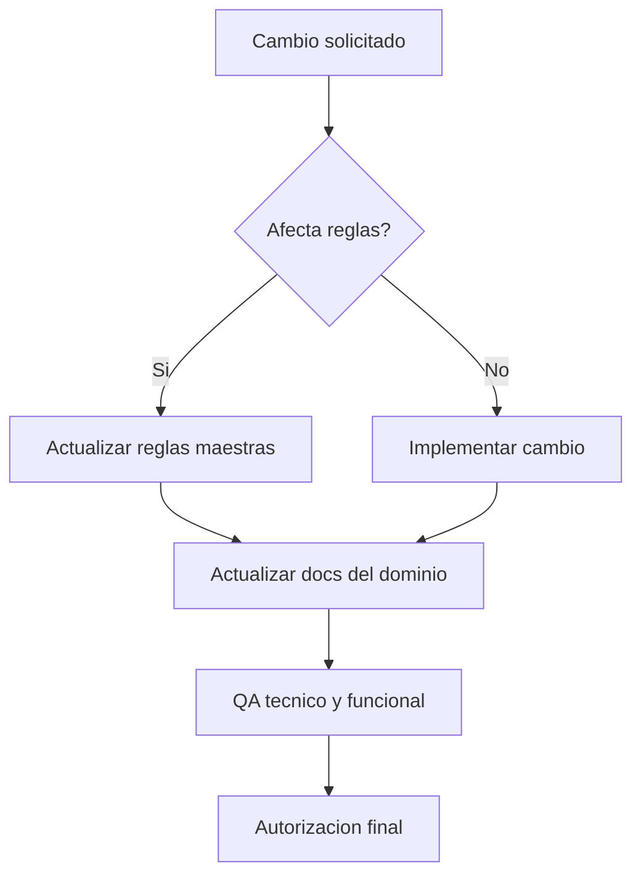

# 🛠️ Reglas Maestras Canonicas

## 🎯 Objetivo
Definir las reglas no negociables para desarrollo, operacion y documentacion.

## 🎯 Reglas globales
- Todo cambio debe quedar documentado en la carpeta `docs/`.
- No se hace deploy de cambios sin validacion funcional y de seguridad.
- No se borra informacion de negocio; se inactiva o invalida con trazabilidad.
- El backend valida permisos siempre, aunque el frontend oculte opciones.
- Toda regla nueva debe actualizar este documento y el indice maestro.

## 🎯 Estandar de calidad de codigo
- Nombres claros y funciones con una sola responsabilidad.
- Sin `any` salvo caso excepcional justificado.
- Sin valores magicos; usar constantes.
- Manejo de errores con contexto.

## 🎯 Regla de documentacion
- La documentacion principal es funcional y entendible para usuario interno.
- Los anexos tecnicos e historicos viven en `99-historico/`.

## 🔄 Flujo de cumplimiento

