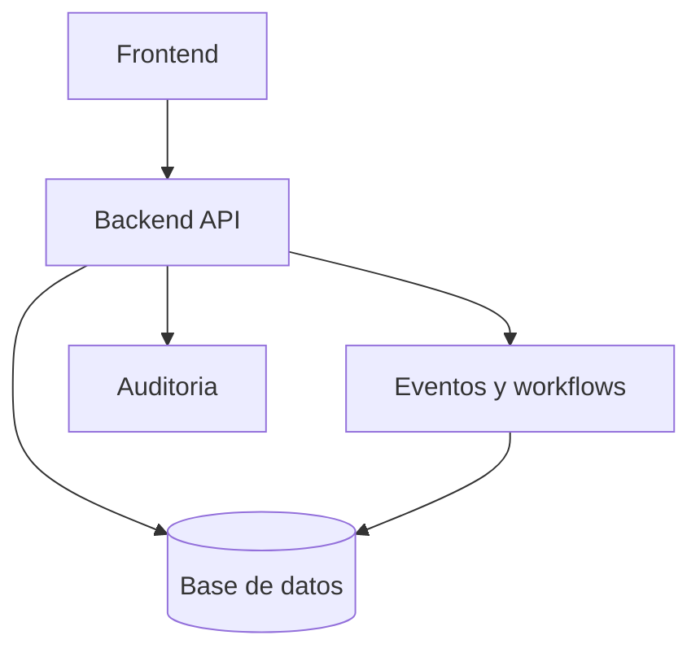

# Arquitectura y Gobierno del Sistema

## Que es KPITAL 360
KPITAL 360 es un sistema enterprise de RRHH y planilla multiempresa.

## Bloques del sistema
- Frontend: experiencia de usuario y validaciones inmediatas.
- Backend: reglas de negocio, seguridad y auditoria.
- Base de datos: fuente de verdad.
- Workflows/automatizaciones: procesos asincronos y de mantenimiento.

## Como se conecta todo

## Regla de gobierno
- Si se modifica un flujo, se actualiza su documento del dominio.
- Si cambia una regla transversal, se actualiza primero `03-reglas`.

## Orden de evolucion recomendado
1. Regla
2. Arquitectura
3. Seguridad
4. Frontend y Backend
5. Planilla/Acciones
6. QA y Operacion
