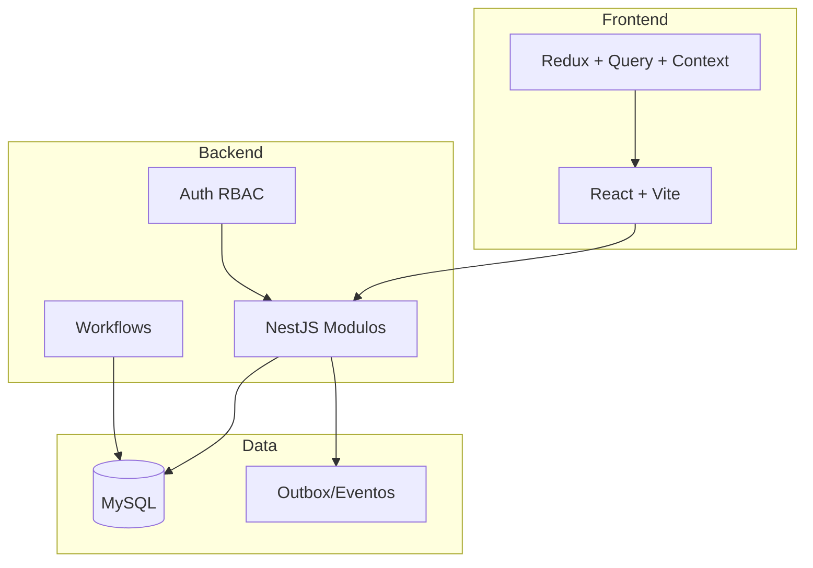
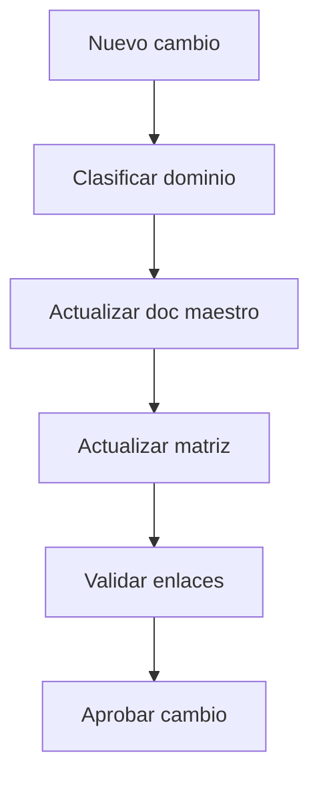

# Arquitectura y Gobierno Consolidado

Estado: vigente

Fuentes origen: 00, 01, 02, 03, 04, 09, 11, 17

## Vista de arquitectura


## Flujo de gobierno de cambios



## Fuentes Integradas (Preservacion Completa)

Regla de consolidacion aplicada:
- Cada fuente original asignada a este maestro se preserva completa debajo de su encabezado.
- Esto garantiza trazabilidad y evita perdida de informacion durante la limpieza.

### Fuente: docs/00-Indice.md

```markdown
# KPITAL 360  ndice de Documentacin

**Proyecto:** KPITAL 360  ERP Multiempresa  
**Autor:** Roberto  Arquitecto Funcional / Senior Engineer  
**ltima actualizacin:** 2026-03-05 (reglas de documentacin: actualizacin transversal de docs)

---

- UI: se elimin? la secci?n "Planillas en las que entrar?a" en el modal de vacaciones. La asignaci?n es interna.


- Solape de planillas: si una fecha coincide con m?ltiples planillas ABIERTAS/EN_PROCESO, **no se bloquea** la selecci?n. Se asigna autom?ticamente por prioridad: estado ABIERTA > EN_PROCESO; si empatan, menor fecha de inicio; si empatan, menor ID.
- Se muestra advertencia en UI cuando hay fechas solapadas.

## Cmo Leer Esta Documentacin

Si sos nuevo en el proyecto, le los documentos **en orden numrico**. Cada uno construye sobre el anterior. No saltes.

Si ya ests en el proyecto y necesits referencia puntual, us esta tabla para ir directo al tema.

---

## Mapa de Documentos

| # | Documento | Qu Contiene | Prerrequisito |
|---|-----------|-------------|---------------|
| 01 | [01-EnfoqueSistema.md](./01-EnfoqueSistema.md) | Visin arquitectnica del sistema completo. Blueprint formal. Bounded contexts, fases, principios, NFRs. **Documento rector.** | Ninguno |
| 02 | [02-ScaffoldingProyecto.md](./02-ScaffoldingProyecto.md) | Decisin de crear dos proyectos desde cero (Frontend + API). Stack tecnolgico. Estructura base. | 01 |
| 03 | [03-ArquitecturaStateManagement.md](./03-ArquitecturaStateManagement.md) | Arquitectura detallada de estado. Redux + TanStack Query + Context. Boundaries, sincronizacin, invalidacin. | 01, 02 |
| 04 | [04-DirectivasStateManagement.md](./04-DirectivasStateManagement.md) | Directiva ejecutable paso a paso de state management. Qu implementar y en qu orden. | 03 |
| 05 | [05-IntegracionAntDesign.md](./05-IntegracionAntDesign.md) | Integracin de Ant Design. **Paleta RRHH (obligatorio)**, tema corporativo, componentes base, reglas de estilo. | 02 |
| 06 | [06-DirectivasHeaderMenu.md](./06-DirectivasHeaderMenu.md) | Header de 2 niveles (logo + usuario / men horizontal). Diseo enterprise, men data-driven. | 03, 05 |
| 08 | [08-EstructuraMenus.md](./08-EstructuraMenus.md) | Catlogo exacto de las opciones de men definidas. Los 4 mens completos. | 06 |
| 09 | [09-EstadoActualProyecto.md](./09-EstadoActualProyecto.md) | **Estado vivo del proyecto.** Inventario de archivos, directivas completadas, qu falta. | Todos |
| 10 | [10-DirectivasSeparacionLoginDashboard.md](./10-DirectivasSeparacionLoginDashboard.md) | Separacin Login/Dashboard. Layouts, guards con cascada, flujos de auth, logout, interceptor 401. | 04 |
| 11 | [11-DirectivasConfiguracionBackend.md](./11-DirectivasConfiguracionBackend.md) | Configuracin backend enterprise. TypeORM + MySQL, bus de eventos, 7 mdulos por bounded context, CORS, migraciones. | 01, 02 |
| 12 | [12-DirectivasIdentidadCrossApp.md](./12-DirectivasIdentidadCrossApp.md) | Identidad nica y navegacin cross-app (KPITAL  TimeWise). SSO por cookie httpOnly. | 01, 11 |
| 13 | [13-ModeladoSysEmpresas.md](./13-ModeladoSysEmpresas.md) | Primera tabla: sys_empresas (root aggregate). Entidad, migracin, CRUD, inactivacin lgica. | 11 |
| 14 | [14-ModeloIdentidadEnterprise.md](./14-ModeloIdentidadEnterprise.md) | Core Identity Schema completo: 7 tablas (usuarios, apps, roles, permisos, tablas puente). FK constraints, ndices, CRUD. | 11, 13 |
| 15 | [15-ModeladoSysUsuarios.md](./15-ModeladoSysUsuarios.md) | Enhance sys_usuarios: columnas enterprise (hardening, bloqueo, estados 1/2/3, password nullable). | 14 |
| 16 | [16-CreacionEmpleadoConAcceso.md](./16-CreacionEmpleadoConAcceso.md) | sys_empleados + flujo transaccional ACID de creacin con acceso a TimeWise/KPITAL. Poltica de sincronizacin de identidad. | 14, 15 |
| 17 | [17-EstandarWorkflows.md](./17-EstandarWorkflows.md) | Estndar enterprise de workflows. Carpetas, convenciones, EmployeeCreationWorkflow, IdentitySyncWorkflow. | 16 |
| 18 | [18-IdentityCoreEnterprise.md](./18-IdentityCoreEnterprise.md) | Identity Core completo: seed, JWT real, guards, permisos dinmicos, conexin frontendbackend, SSO base. | 14, 15, 17 |
| 19 | [19-RedefinicionEmpleadoEnterprise.md](./19-RedefinicionEmpleadoEnterprise.md) | Redefinicin enterprise de sys_empleados + tablas org/nom (departamentos, puestos, periodos pago). Modelo completo con ENUMs, FKs, catlogos. | 16, 17 |
| 20 | [20-MVPContratosEndpoints.md](./20-MVPContratosEndpoints.md) | Contratos MVP: lista oficial de endpoints, permission contract (module:action), Payroll Engine y Personal Actions (esqueleto). Incluye actualizacin operativa de endpoints de planilla (edit/process/snapshot-summary/audit-trail) y filtros por rango. | 18, 19 |
| 21 | [21-TablaMaestraPlanillasYWorkflows.md](./21-TablaMaestraPlanillasYWorkflows.md) | Tabla Maestra nom_calendarios_nomina, polticas workflows (P3 traslado, reopen, multi-periodo), acc_cuotas_accion. Incluye reglas operativas: bitcora obligatoria por transicin/cambio, filtro por traslape de periodo y UX de edicin. | 20 |
| 22 | [22-AuthReport.md](./22-AuthReport.md) | Auditora enterprise Auth: decisiones, matriz de flujos, checklist, evidencia, pendientes. | 18, 10, 12 |
| 23 | [23-ModuloEmpleadosReferencia.md](./23-ModuloEmpleadosReferencia.md) | Mdulo Empleados referencia end-to-end: 4 vistas, backend verificacin, encriptacin PII, frontend estructura, sprints. | 18, 19, 20 |
| 24 | [24-PermisosEnterpriseOperacion.md](./24-PermisosEnterpriseOperacion.md) | Permisos enterprise: KPITAL vs TimeWise, vista Empresas/Roles/Excepciones, flujos operativos, problemas comunes. | 18, 20, 22 |
| 25 | [25-SistemaNotificacionesEnterprise.md](./25-SistemaNotificacionesEnterprise.md) | Sistema de notificaciones en tiempo real: campanita, badge, WebSocket, modelo enterprise (notificacin global + estado por usuario). | 18, 24 |
| 26 | [26-SistemaPermisosReferencia.md](./26-SistemaPermisosReferencia.md) | **Referencia tcnica** del sistema de permisos: tablas, dependencias, flujo de resolucin, diagnstico y scripts. | 18, 24 |
| 27 | [27-DiagramaFlujoEmpleadosYUsuarios.md](./27-DiagramaFlujoEmpleadosYUsuarios.md) | Flujo empleados, roles por app, vista Configuracin Usuarios, jerarqua de supervisin TimeWise (Supervisor Global, Supervisor, Empleado), dropdown supervisor filtrado, cross-empresa. | 16, 19, 24 |
| 28 | [28-PendientesAccion.md](./28-PendientesAccion.md) | Pendientes abiertos y acciones por ejecutar del proyecto. | Todos |
| 29 | [29-EstandarFormatoMoneda.md](./29-EstandarFormatoMoneda.md) | Estndar nico de formato/parseo/validacin monetaria para toda la app (CRC/USD), helper compartido y reglas obligatorias. | 05, 23 |
| 30 | [30-HistorialLaboralEmpleado.md](./30-HistorialLaboralEmpleado.md) | Lgica funcional y tcnica de Historial Laboral en creacin de empleado: acumulados, provisin de aguinaldo, validaciones y persistencia. | 23, 29 |
| 31 | [31-CifradoIdentidadYProvisionamiento.md](./31-CifradoIdentidadYProvisionamiento.md) | Ejecucin operativa de cifrado, sincronizacin empleado-usuario y provisionamiento automtico TimeWise con colas/workers idempotentes. | 23, 30 |
| 32 | [31-ValidacionFormulariosFrontend.md](./31-ValidacionFormulariosFrontend.md) | Validacin unificada de formularios: anti-SQL, textRules, emailRules, optionalNoSqlInjection. Trazabilidad en EmployeeCreateModal y CompaniesManagementPage. | 05, 23, 29 |
| 33 | [32-INFORME-VALIDACION-CIFRADO-IDENTIDAD.md](./32-INFORME-VALIDACION-CIFRADO-IDENTIDAD.md) | Informe tcnico de validacin de cifrado e identidad (Directiva 31). Plan de validacin, evidencia BD, observaciones. | 31 |
| 34 | [34-CasosUsoCriticosPlanillaRRHH.md](./34-CasosUsoCriticosPlanillaRRHH.md) | **Casos de uso crticos Planilla y RRHH (DOC-34 v1.1).** Catlogo UC-01 a UC-31, checklist 21 tems en 4 reas, directivas. Registro de cambios en Seccin 7. | 21, 23, 28 |
| 35 | [35-EstadoDOC34Implementacion.md](./35-EstadoDOC34Implementacion.md) | **Estado DOC-34 vs implementacin:** qu S hay / qu NO hay, checklist 21 tems por rea. Referencia permanente para planillas y RRHH. Alineado con Reporte Comit v2.0. | 34 |
| 36 | [36-ComparativoSistemaVsReporteComiteDOC34.md](./36-ComparativoSistemaVsReporteComiteDOC34.md) | Comparativo sistema actual vs Reporte Ejecutivo Comit DOC-34 v1.0: semforos, implementado vs pendiente. | 34, 35 |
| 37 | [37-ReporteEjecutivoDOC34-ComiteTecnico.md](./37-ReporteEjecutivoDOC34-ComiteTecnico.md) | **Reporte Ejecutivo Comit Tcnico DOC-34 v2.0** (post-auditora): estado global, semforo por rea, decisiones negocio, roadmap por sprint, riesgos. Documento oficial de seguimiento. | 34, 35 |
| 38 | [38-VacacionesAcumuladasEnterprise.md](./38-VacacionesAcumuladasEnterprise.md) | Reglas oficiales enterprise de vacaciones acumuladas: saldo inicial inmutable, provisin mensual por da ancla (1..28), ledger de movimientos, descuento por planilla aplicada, saldo negativo permitido, historial de monto provisionado y control de permisos. | 23, 30, 34 |
| 40 | [40-BlueprintPlanillaV2Compatible.md](./40-BlueprintPlanillaV2Compatible.md) | Blueprint definitivo y ejecutable para Planilla v2: compatibilidad incremental, estados numericos, slot_key/is_active, RBAC payroll y fases de implementacion. Incluye reglas implementadas de bitcora funcional, filtros de rango y persistencia de id_tipo_planilla. | 20, 21, 34 |
| 41 | [41-AuditoriaEnterprise-Consolidado.md](./41-AuditoriaEnterprise-Consolidado.md) | Consolidado de auditoria Rev.1 a Rev.3: hallazgos reportados vs verificados en codigo, veredicto final y condicion operacional previa a go-live. | 09, 28, 40 |
| 42 | [42-AccionesPersonal-Planilla-Fase0Cerrada.md](./42-AccionesPersonal-Planilla-Fase0Cerrada.md) | Acta tecnica consolidada para integrar Acciones de Personal con Planilla sin ruptura: reglas, estados, solape, retroactivos, permisos, trigger anti-delete y fases ejecutables. | 40, 41 |
| 43 | [43-AccionesPersonal-Ausencias-Implementacion-Operativa.md](./43-AccionesPersonal-Ausencias-Implementacion-Operativa.md) | Cierre operativo de Ausencias: persistencia real (header+lineas), tabla `acc_ausencias_lineas`, estado inicial `PENDING_SUPERVISOR`, reglas de planilla elegible, calculo de monto, avance secuencial, invalidacion, bitacora, apertura en cualquier estado (edicion/lectura), filtros por atencion y estabilidad UI de tabs/preloads. | 42 |
| 44 | [44-ContratosAPI-Ausencias-20260228.md](./44-ContratosAPI-Ausencias-20260228.md) | Contrato operativo final de Ausencias: catalogos, create, edit, advance, invalidate y audit-trail, con permisos, reglas por estado y validaciones de payload alineadas al flujo enterprise. | 20, 43 |
| 45 | [45-Handoff-AccionesPersonal-Ausencias.md](./45-Handoff-AccionesPersonal-Ausencias.md) | Handoff operativo para retomar desde cero: estado actual, reglas vigentes, endpoints, permisos, QA minimo, pendientes y roadmap por fases (A->E) con siguiente fase explicita. | 43, 44 |
| 46 | [46-AccionesPersonal-Bonificaciones-Implementacion-Operativa.md](./46-AccionesPersonal-Bonificaciones-Implementacion-Operativa.md) | Cierre operativo de Bonificaciones: vista/modal dedicados, tabla `acc_bonificaciones_lineas`, endpoints, permisos, catlogo de tipo de bonificacin, clculo de monto y evidencia de build/tests. | 42, 43 |
| 47 | [47-AccionesPersonal-HorasExtra-Implementacion-Operativa.md](./47-AccionesPersonal-HorasExtra-Implementacion-Operativa.md) | Cierre operativo de Horas Extra: vista/modal dedicados, tabla `acc_horas_extras_lineas`, fechas inicio/fin por lnea, tipo de jornada 6/7/8, clculo de monto y evidencia de migraciones/build/tests. | 42, 46 |
| 48 | [48-AccionesPersonal-ModeloPorPeriodo-Linea.md](./48-AccionesPersonal-ModeloPorPeriodo-Linea.md) | Decision vigente de bajo riesgo: split por periodo al guardar (1 accion por periodo distinto, mismas lineas juntas por periodo), con `group_id` comun, transaccionalidad y guard de edicion mono-periodo para Ausencias, Licencias, Incapacidades, Bonificaciones, Horas Extra, Retenciones y Descuentos. | 42, 45, 46, 47 |
| 49 | [49-AccionesPersonal-Descuentos-Implementacion-Operativa.md](./49-AccionesPersonal-Descuentos-Implementacion-Operativa.md) | Cierre operativo de Descuentos: vista/modal dedicados, tabla `acc_descuentos_lineas`, split por periodo al guardar, guard de edicion mono-periodo, permisos dedicados y evidencia de migraciones/tests/build. | 42, 48 |
| 50 | [50-Handoff-TrasladoInterempresas-20260309.md](./50-Handoff-TrasladoInterempresas-20260309.md) | Handoff de corte operativo de traslado interempresas: ultimo cambio UI de refresco/cache, pruebas ejecutadas, pendientes, pasos de validacion y reglas aplicadas. | 21, 28, 40 |
---

## Estado del Proyecto

| rea | Estado |
|------|--------|
| Frontend (React + Vite + TS) | Estructura completa. State management, UI, men dinmico, login, guards, router. |
| API (NestJS) | Enterprise: 7 modulos + workflows + auth real (JWT + guards + permisos dinamicos) + hardening Rev.3 (helmet, health, CORS WS restringido). |
| Base de datos | Esquema enterprise en evolucion con migraciones versionadas, FK e indices operativos. PEND-001 ya implementado en regla de inactivacion de empresas. |
| Autenticacin | Login REAL: bcrypt + JWT + cookie httpOnly + JwtAuthGuard + PermissionsGuard. |
| Permisos | Modelo enterprise operativo con resolucion por contexto, catalogo de permisos `payroll:*` y enforcement backend 403 en rutas protegidas. |
| Notificaciones | Sistema enterprise: campanita con badge, notificaciones masivas por rol, estado individual (ledo/eliminado), WebSocket tiempo real. |
| Empleados | sys_empleados redefinida enterprise: 33 columnas, ENUMs, FKs a org/nom catlogos, workflow ACID. |
| Workflows | Infraestructura enterprise. EmployeeCreationWorkflow (ACID) + IdentitySyncWorkflow (event-driven). |
| Pginas/Mdulos | Login + CompanySelection + Dashboard (placeholder). Mdulos de negocio pendientes. |

---

## Navegacin

La aplicacin usa **un nico men horizontal en el header** (sin sidebar/men lateral). Toda la navegacin se hace desde el men superior con dropdowns multinivel.

---

## Reglas de Documentacin

1. **Cada directiva que Roberto da se documenta como un archivo separado en esta carpeta.**
2. **El orden numrico es el orden cronolgico de decisiones.**
3. **Si se agrega un mdulo nuevo o una directiva nueva, se agrega un documento nuevo con el siguiente nmero.**
4. **Nunca se modifica un documento anterior sin documentar el cambio.**
5. **Esta carpeta es la fuente de verdad del "por qu" y el "qu". El cdigo es la fuente de verdad del "cmo".**
6. **Si se establece o cambia una regla, proceso o decisin, actualizar todos los documentos en `docs/` donde esa informacin deba reflejarse (ndices, resmenes, guas, reglas, APIs, etc.).**


---

## Bloque - Testing (corte vigente)

Documentacion de pruebas en `docs/Test/`:
- Estado actual consolidado: Backend `217/217` y Frontend `250/250` (100% en verde).
- `GUIA-TESTING.md`  Guia general e historial por fases
- `TEST-EXECUTION-REPORT.md`  Reporte por fases de ejecucion
- `MANUAL-PRUEBAS.md`  Procedimiento operativo
- `ANALISIS-ESTADO-PROYECTO-FASE4.md`  Calificacion por dimension (10/10)

---

## Nuevo Bloque - Automatizaciones

Se agrego documentacion formal de transferencia en la carpeta `docs/automatizaciones`:

- `01-vision-general.md`
- `02-arquitectura.md`
- `03-modelo-datos.md`
- `04-worker.md`
- `05-reglas-negocio.md`
- `06-monitoreo.md`
- `07-semaforo.md`
- `08-pruebas.md`
- `09-operacion.md`
- `10-seguridad.md`
- `11-limpieza-operativa-db.md`

---
## Actualizaci?n 2026-03-02 ? Vacaciones sin selecci?n de planilla (ACTUALIZACION-VACACIONES-2026-03-02
UI-PLANILLAS-REMOVIDA-2026-03-02
SOLAPE-PLANILLAS-2026-03-02)
- KPITAL (RRHH): el usuario ya no selecciona planilla en Vacaciones. Selecciona fechas y movimiento; el sistema determina la planilla elegible por cada fecha con base en calendario de n?mina (empresa/empleado/moneda/periodo).
- Validaciones: fines de semana y feriados bloqueados; fechas ya reservadas bloqueadas; saldo disponible; fechas deben pertenecer a un periodo elegible; si una fecha coincide con m?ltiples periodos, se rechaza.
- Consistencia de tipo: todas las fechas deben pertenecer al mismo tipo de planilla. Si no, error.
- Split autom?tico en creaci?n: si las fechas caen en m?s de un periodo del mismo tipo, se crean acciones separadas por periodo. En edici?n, solo se permite un periodo.
- Persistencia: `acc_vacaciones_fechas` y `acc_cuotas_accion` guardan `id_calendario_nomina` por fecha; el header de acci?n puede quedar con `id_calendario_nomina = NULL`.
- TimeWise: acciones de vacaciones se crean en estado Borrador sin planilla. RRHH completa fechas/movimiento en KPITAL; el sistema asigna planilla por fecha.
- Planilla: al cargar una planilla se consumen las fechas cuyo `id_calendario_nomina` coincide con la planilla y estado aprobado. No se requiere que el header tenga planilla.
---


## Actualizacion 2026-03-10 - Bloque Planilla Regular

Se actualizo documentacion transversal del bloque `Generar/Cargar Planilla Regular` en:
- `docs/40-BlueprintPlanillaV2Compatible.md` (reglas operativas, formato de tipo de accion, carga de tabla).
- `docs/50-Handoff-TrasladoInterempresas-20260309.md` (continuidad operativa y dependencias).
- `docs/reglas/ReglasImportantes.md` (regla transversal obligatoria para planilla regular).
- `docs/Test/TEST-EXECUTION-REPORT.md` (fase 20).
- `docs/Test/MANUAL-PRUEBAS.md` (escenarios manuales de validacion).
```

### Fuente: docs/01-EnfoqueSistema.md

```markdown
# KPITAL 360  DOCUMENTO DE VISIN ARQUITECTNICA ENTERPRISE

**Versin 3.0**
**Fecha:** 2025-02-21
**Autor:** Roberto  Senior Full Stack Software Engineer / Functional Architect
**Estado:** Aprobado  Blueprint Arquitectnico Formal
**Clasificacin:** Documento interno  Referencia arquitectnica

---

- UI: se elimin? la secci?n "Planillas en las que entrar?a" en el modal de vacaciones. La asignaci?n es interna.


- Solape de planillas: si una fecha coincide con m?ltiples planillas ABIERTAS/EN_PROCESO, **no se bloquea** la selecci?n. Se asigna autom?ticamente por prioridad: estado ABIERTA > EN_PROCESO; si empatan, menor fecha de inicio; si empatan, menor ID.
- Se muestra advertencia en UI cuando hay fechas solapadas.

## Changelog

| Versin | Fecha       | Autor   | Descripcin                                                                 |
|---------|-------------|---------|-----------------------------------------------------------------------------|
| 1.0     |            | Roberto | Visin inicial: multiempresa, planillas, acciones de personal               |
| 2.0     |            | Roberto | Consolidacin: eventos, workflows, roles dinmicos, trazabilidad, escalabilidad |
| 3.0     | 2025-02-21  | Roberto | Blueprint formal: bounded contexts, mapa de dependencias, NFRs medibles, fases de implementacin, estrategia de resiliencia, gobernanza documental |

---

## Gobernanza del Documento

- **Owner:** Roberto (Arquitecto Funcional / Senior Engineer)
- **Aprobadores de cambios:** Owner + Lead tcnico del proyecto
- **Regla de versionado:**
  - **Patch (v3.0.x):** Correcciones menores, clarificaciones, typos
  - **Minor (v3.x.0):** Nuevos NFRs, ajustes a bounded contexts, nuevos contratos
  - **Major (vX.0.0):** Cambios de dominio, redefinicin de fases, cambios estructurales
- **Frecuencia de revisin:** Al inicio de cada fase de implementacin o cuando se identifique un cambio arquitectnico significativo
- **Formato de cambio:** Toda modificacin debe documentarse en el Changelog y, si aplica, en el Decision Log (Seccin 20)

---

## Tabla de Contenidos

1. [Visin General del Sistema](#1-visin-general-del-sistema)
2. [Principios Fundamentales](#2-principios-fundamentales)
3. [Fases de Implementacin](#3-fases-de-implementacin)
4. [Mapa de Dominios  Bounded Contexts](#4-mapa-de-dominios--bounded-contexts)
5. [Mapa de Dependencias (Upstream / Downstream)](#5-mapa-de-dependencias-upstream--downstream)
6. [Modelo Empresarial  Multiempresa](#6-modelo-empresarial--multiempresa)
7. [Planillas (Payroll Engine)](#7-planillas-payroll-engine)
8. [Acciones de Personal](#8-acciones-de-personal)
9. [Movimiento de Empleados entre Empresas](#9-movimiento-de-empleados-entre-empresas)
10. [Reclculo Automtico](#10-reclculo-automtico)
11. [Roles y Permisos Dinmicos](#11-roles-y-permisos-dinmicos)
12. [Mens Dinmicos Basados en Permisos](#12-mens-dinmicos-basados-en-permisos)
13. [Aprobaciones Jerrquicas](#13-aprobaciones-jerrquicas)
14. [Trazabilidad Total](#14-trazabilidad-total)
15. [Base de Datos Enterprise](#15-base-de-datos-enterprise)
16. [Non-Functional Requirements (NFRs)](#16-non-functional-requirements-nfrs)
17. [Estrategia de Resiliencia](#17-estrategia-de-resiliencia)
18. [KPITAL + TimeWise  Contrato de Integracin](#18-kpital--timewise--contrato-de-integracin)
19. [Integracin Futura con NetSuite](#19-integracin-futura-con-netsuite)
20. [Decision Log (ADR-Lite)](#20-decision-log-adr-lite)
21. [Qu NO Define Este Documento](#21-qu-no-define-este-documento)

---

## 1. Visin General del Sistema

KPITAL 360 es un **ERP de planillas multiempresa** diseado para:

- **Autogestin empresarial completa**  el sistema responde automticamente a cambios de negocio.
- **Automatizacin total de procesos**  sin dependencias manuales ocultas.
- **Workflows dinmicos basados en eventos**  todo cambio relevante genera un evento de dominio.
- **Trazabilidad absoluta**  toda operacin es auditable.
- **Escalabilidad empresarial**  diseado para crecer sin degradacin.
- **Integracin futura con sistemas externos** (NetSuite, herramientas corporativas).

El sistema debe comportarse como un **ERP corporativo moderno**:

- Multiempresa real con dominios aislados.
- Colaboracin por roles (tipo GitHub).
- Separacin clara de dominios (bounded contexts).
- Procesamiento asncrono donde se requiera.
- Seguridad fuerte con doble validacin.
- Sin dependencias manuales ocultas.

> **Principio rector:** Este sistema no es un CRUD de planillas. Es un motor de reglas empresariales automatizado. Un ERP real.

---

## 2. Principios Fundamentales

### 2.1 Arquitectura Basada en Eventos

Todo cambio relevante genera un **evento de dominio**.

**Eventos principales del sistema:**

| Dominio             | Evento                    | Descripcin                                      |
|---------------------|---------------------------|--------------------------------------------------|
| Employee Management | `EmployeeCreated`         | Nuevo empleado registrado                        |
| Employee Management | `EmployeeMoved`           | Empleado transferido entre empresas              |
| Employee Management | `EmployeeDeactivated`     | Empleado desactivado                             |
| Personal Actions    | `PersonalActionCreated`   | Nueva accin de personal creada                  |
| Personal Actions    | `PersonalActionApproved`  | Accin aprobada por supervisor/RRHH              |
| Personal Actions    | `PersonalActionRejected`  | Accin rechazada                                 |
| Personal Actions    | `SalaryIncreased`         | Aumento salarial aplicado                        |
| Payroll Engine      | `PayrollOpened`           | Planilla abierta para periodo                    |
| Payroll Engine      | `PayrollVerified`         | Planilla verificada                              |
| Payroll Engine      | `PayrollApplied`          | Planilla aplicada (inmutable)                    |
| Payroll Engine      | `PayrollDeactivated`      | Planilla cancelada/inactivada                    |

Los eventos disparan **workflows automticos**. Nada se recalcula manualmente. Nada depende de lgica dispersa.

### 2.2 Autogestin Total

El sistema debe:

- **Auto-recalcular** cuando cambian condiciones del periodo abierto.
- **Auto-cancelar** acciones pendientes cuando se inactiva una planilla.
- **Auto-mover** acciones cuando un empleado cambia de empresa.
- **Auto-validar** antes de cada transicin de estado.
- **Auto-organizar** flujos de aprobacin segn configuracin de roles.

Cuando ocurre un cambio de negocio, el sistema responde automticamente sin intervencin humana.

### 2.3 Idempotencia como Principio

Todo evento crtico del sistema debe ser **idempotente**: ejecutarse mltiples veces debe producir el mismo resultado que ejecutarse una sola vez. Esto garantiza consistencia ante reintentos, fallos de red, o procesamiento duplicado.

### 2.4 Inmutabilidad de Periodos Aplicados

Una vez que una planilla alcanza el estado **Aplicada**, el periodo es **inmutable**. No se recalculan, no se modifican, no se eliminan registros de periodos aplicados. Cualquier correccin genera una nueva accin en un periodo futuro.

---

## 3. Fases de Implementacin

### Fase 1  MVP Operativo

**Objetivo:** Sistema funcional, coherente y estable.

**Alcance:**

- Multiempresa bsica (creacin, configuracin, asignacin de empleados).
- Planillas con estados completos (Abierta  Verificada  Distribucin  Aplicada  Inactiva).
- Acciones de personal con flujo de aprobacin.
- Permisos dinmicos y mens basados en permisos.
- Reclculo automtico en periodo abierto.
- Trazabilidad mnima obligatoria (creador, modificador, timestamps, estados).
- Roles y permisos configurables.

**Exclusiones de Fase 1:**

- Sin colas distribuidas (procesamiento sncrono aceptable a esta escala).
- Sin integracin NetSuite.
- Sin movimientos masivos automatizados.
- Sin procesamiento asncrono avanzado.

**Criterio de completitud:** El sistema puede abrir, procesar y aplicar una planilla completa para mltiples empresas con acciones aprobadas, sin intervencin manual fuera del flujo definido.

---

### Fase 2  Escalabilidad y Automatizacin Avanzada

**Objetivo:** Robustez operativa y capacidad de escala.

**Alcance:**

- Procesamiento asncrono con colas (Redis / Message Queue).
- Movimientos masivos automatizados de empleados entre empresas.
- Reintentos automticos con poltica exponencial.
- Auditora avanzada (motivo de cambio, versiones anteriores, diff de estados).
- Validaciones automticas complejas pre-transicin de planilla.
- Procesamiento por lotes para operaciones pesadas.
- Optimizacin de queries y stored procedures para volumen.

**Criterio de completitud:** El sistema soporta cierre de mes con picos de carga sin degradacin crtica, y los movimientos masivos se procesan sin intervencin manual.

---

### Fase 3  Integracin y Resiliencia Enterprise

**Objetivo:** Comportamiento enterprise real con integracin externa.

**Alcance:**

- Integracin desacoplada con NetSuite (evento `PayrollApplied`  sincronizacin contable).
- Dead Letter Queues para eventos fallidos.
- Retry policies configurables.
- Sistema de alerting para fallos crticos.
- Mtricas de performance y health checks.
- Dashboard de monitoreo operativo.
- Optimizacin avanzada de performance.

**Criterio de completitud:** El sistema opera de forma autnoma con monitoreo activo, integracin contable funcional, y recuperacin automtica ante fallos transitorios.

---

## 4. Mapa de Dominios  Bounded Contexts

El sistema se organiza en **6 bounded contexts**, cada uno con responsabilidad clara, ownership definido, y contratos explcitos.

### 4.1 Company Management

- **Responsabilidad:** Gestin de empresas, configuracin empresarial, frecuencias de pago.
- **System of Record (SoR) de:** Entidad Empresa.
- **Regla clave:** Cada empresa es un dominio aislado con configuracin independiente.

### 4.2 Employee Management

- **Responsabilidad:** Empleados, movimientos entre empresas, historial laboral, asignacin de supervisor.
- **System of Record (SoR) de:** Entidad Empleado (`sys_empleados`).
- **Regla clave:** El empleado pertenece a una empresa en todo momento. Los movimientos generan eventos y preservan historial.

> **REGLA FUNDAMENTAL  Separacin Identidad vs Negocio:**
>
> | Concepto | Tabla | Bounded Context | Qu representa |
> |----------|-------|----------------|---------------|
> | **Usuario** | `sys_usuarios` | Access Control / Auth | Cuenta digital para autenticarse en el sistema |
> | **Empleado** | `sys_empleados` | Employee Management | Persona contratada por una empresa (datos laborales: salario, puesto, departamento) |
>
> Son entidades **completamente independientes**:
> - Un usuario puede existir sin ser empleado (ej: Admin TI, contador externo).
> - Un empleado puede existir sin usuario (ej: empleado que no usa el sistema).
> - Si un empleado necesita acceso al sistema, se vincula mediante `sys_empleados.id_usuario` (FK opcional).
> - Nunca se mezclan datos de identidad con datos laborales en la misma tabla.

### 4.3 Personal Actions

- **Responsabilidad:** Acciones de personal, flujos de aprobacin, estados de acciones, reglas de negocio internas.
- **System of Record (SoR) de:** Entidad Accin de Personal.
- **Regla clave:** Las acciones siguen un flujo de vida estricto. Solo acciones aprobadas pueden asociarse a planilla.

### 4.4 Payroll Engine

- **Responsabilidad:** Planillas, estados de planilla, aplicacin, reclculo, distribucin de costos.
- **System of Record (SoR) de:** Entidad Planilla.
- **Regla clave:** Planillas aplicadas son inmutables. Solo planillas abiertas permiten reclculo.

### 4.5 Access Control

- **Responsabilidad:** Roles, permisos, mens dinmicos, autenticacin, autorizacin.
- **System of Record (SoR) de:** Roles y Permisos.
- **Regla clave:** Los permisos son dinmicos, configurables en tiempo real, y nunca hardcodeados. Doble validacin: frontend + backend.

### 4.6 Integration Layer

- **Responsabilidad:** Integracin con NetSuite, eventos externos, contratos de salida.
- **Regla clave:** Integracin siempre desacoplada. Nunca bloquea el ERP.

---

## 5. Mapa de Dependencias (Upstream / Downstream)

### Diagrama de Flujo de Dependencias

```

  Company Management  
       (SoR)         

          sync contract
         
       sync contract       
 Employee Management      Access Control   
       (SoR)                                          (SoR)        
                            
          event: EmployeeMoved
          sync contract: employee data
         

  Personal Actions    
       (SoR)         

          event: PersonalActionApproved
          sync contract: approved actions
         

   Payroll Engine     
       (SoR)         

          event: PayrollApplied
         

  Integration Layer   
   (NetSuite, etc.)  

```

### Tabla de Contratos entre Contextos

| Origen (Upstream)    | Destino (Downstream)  | Tipo de Integracin    | Contrato / Evento                          |
|----------------------|-----------------------|------------------------|--------------------------------------------|
| Company Management   | Employee Management   | Sync Contract (read)   | Empresa vlida, configuracin, frecuencia  |
| Employee Management  | Personal Actions      | Sync Contract (read)   | Empleado vlido, supervisor, situacin laboral |
| Employee Management  | Payroll Engine        | Sync Contract (read)   | Asignacin empresa, condiciones del empleado |
| Employee Management  | Payroll Engine        | Event Subscription     | `EmployeeMoved`  reubicacin de acciones  |
| Personal Actions     | Payroll Engine        | Sync Contract (read)   | Acciones aprobadas del periodo              |
| Personal Actions     | Payroll Engine        | Event Subscription     | `PersonalActionApproved`  asociar a planilla |
| Personal Actions     | Payroll Engine        | Event Subscription     | `SalaryIncreased`  reclculo automtico   |
| Payroll Engine       | Integration Layer     | Event Subscription     | `PayrollApplied`  sincronizacin NetSuite |
| Payroll Engine       | Personal Actions      | Event Subscription     | `PayrollDeactivated`  cancelar acciones pendientes |
| Access Control       | Todos los contextos   | Sync Contract (read)   | Permisos del usuario, roles activos        |

### Reglas de Dependencia

- **Ningn downstream puede escribir en el SoR de un upstream.** Ejemplo: Payroll Engine no puede modificar datos del empleado.
- **Los sync contracts son de lectura.** Si un downstream necesita un cambio en un upstream, lo solicita va evento o servicio explcito.
- **Los eventos son el mecanismo preferido para comunicacin cross-context.** Los sync contracts se usan solo para lectura de datos de referencia.

---

## 6. Modelo Empresarial  Multiempresa

### Principio

Una persona de RRHH puede administrar **mltiples empresas** desde una sola interfaz.

### Caractersticas

Cada empresa:

- Tiene empleados propios.
- Tiene planillas independientes.
- Tiene configuracin independiente (deducciones, aportes, reglas).
- Tiene frecuencia de pago distinta (mensual, quincenal, semanal, etc.).
- Opera como un **dominio aislado** pero coexistente.

### Regla Fundamental

Las empresas son **dominios aislados**. No comparten planillas, no comparten acciones, no comparten configuracin. Un empleado pertenece a exactamente una empresa en cada momento.

---

## 7. Planillas (Payroll Engine)

### Pertenencia

Cada planilla pertenece a **una empresa** y cubre **un periodo** especfico.

### Estados Oficiales

```
Abierta  Verificada  Distribucin de Costos  Aplicada
                                                    
                                               Inmutable
          (desde cualquier estado pre-aplicacin)
    Inactiva / Cancelada
```

| Estado               | Descripcin                                                    | Reclculo | Modificable |
|----------------------|----------------------------------------------------------------|-----------|-------------|
| Abierta              | Periodo activo, acepta acciones y reclculos                   |          |            |
| Verificada           | Revisada por RRHH, pendiente distribucin de costos            |          |  (regresa a Abierta si necesita cambios) |
| Distribucin de Costos | Costos asignados a centros de costo                          |          |            |
| Aplicada             | Periodo cerrado, inmutable                                     |          |            |
| Inactiva / Cancelada | Planilla cancelada, acciones pendientes auto-canceladas        |          |            |

### Reglas Crticas

- Solo planillas **Abiertas** pueden recalcular.
- Planillas **Aplicadas** son **inmutables**  no se modifican bajo ninguna circunstancia.
- Planillas **Inactivadas** cancelan automticamente sus acciones pendientes (evento `PayrollDeactivated`).
- No puede existir **ambigedad de periodo**  un empleado no puede tener dos planillas abiertas para el mismo periodo en la misma empresa.

---

## 8. Acciones de Personal

### Naturaleza

Son entidades independientes que siguen un **flujo de vida estricto**. Cada transicin es auditada.

### Tipos de Acciones

| Categora         | Tipos                                        |
|-------------------|----------------------------------------------|
| Ingresos          | Horas extra, bonificaciones, comisiones      |
| Salario           | Aumentos salariales                          |
| Ausencias         | Vacaciones, incapacidades, ausencias         |
| Deducciones       | Deducciones, retenciones, embargos           |

### Flujo de Vida

```
Borrador (opcional)  Pendiente Aprobacin  Aprobada  Asociada a Planilla  Pagada
                                                
                                           Cancelada (desde cualquier estado pre-pago)
```

| Estado                | Descripcin                              | Transiciones Permitidas              |
|-----------------------|------------------------------------------|--------------------------------------|
| Borrador              | Creada pero no enviada                   |  Pendiente Aprobacin,  Cancelada |
| Pendiente Aprobacin  | Enviada para aprobacin                  |  Aprobada,  Cancelada             |
| Aprobada              | Aprobada por supervisor/RRHH             |  Asociada a Planilla,  Cancelada  |
| Asociada a Planilla   | Vinculada a planilla abierta             |  Pagada,  Cancelada               |
| Pagada                | Planilla aplicada, accin ejecutada      | Estado final  inmutable             |
| Cancelada             | Accin cancelada con motivo registrado   | Estado final                         |

### Reglas

- Cada transicin de estado es **auditada** con usuario, timestamp, estado anterior, estado nuevo, y motivo.
- Solo acciones **Aprobadas** pueden asociarse a una planilla.
- Acciones **Pagadas** son inmutables.

---

## 9. Movimiento de Empleados entre Empresas

### Escenario

El movimiento de empleados entre empresas es un **escenario crtico** que debe ejecutarse de forma atmica y auditable.

### Flujo Automtico

Cuando se genera el evento `EmployeeMoved`:

1. Se identifica la planilla activa compatible en la **nueva empresa**.
2. Las acciones **pendientes** (no pagadas) se reubican a la nueva planilla.
3. Se recalculan montos si aplica (diferencias de configuracin entre empresas).
4. Se registra **trazabilidad completa**: empresa origen, empresa destino, acciones movidas, montos anteriores, montos nuevos.
5. **No se pierde historial anterior**  el registro histrico en la empresa origen permanece intacto.
6. Si falla cualquier paso  **rollback automtico completo**.

### Movimientos Masivos (Fase 2+)

El sistema debe soportar movimientos masivos de empleados entre empresas:

- Procesamiento en lotes.
- Transacciones controladas por lote (no una transaccin global).
- Registro individual de xito/fallo por empleado.
- Sin bloqueo del sistema para otros usuarios durante el proceso.

---

## 10. Reclculo Automtico

### Trigger: `SalaryIncreased` (ejemplo principal)

Cuando ocurre un aumento salarial en un periodo abierto:

1. Se dispara evento `SalaryIncreased`.
2. Se detectan acciones del **periodo abierto** que dependen del salario.
3. Se recalculan montos dependientes (horas extra, proporcionales, etc.).
4. Se actualiza la planilla abierta.
5. Se guarda **versin previa** de los montos (auditora de reclculo).
6. Si falla  **rollback automtico** al estado anterior.

### Reglas Inviolables

- **Nunca** se recalculan periodos aplicados.
- El reclculo solo opera sobre planillas en estado **Abierta**.
- Todo reclculo es atmico: se completa totalmente o no se aplica.

---

## 11. Roles y Permisos Dinmicos

### Principio

Sistema de permisos **completamente dinmico**  nunca hardcodeado.

### Capacidades de un Rol

Un rol puede incluir cualquier combinacin de permisos:

| Permiso              | Ejemplo de Accin                         |
|----------------------|-------------------------------------------|
| Crear planillas      | Abrir nuevo periodo                       |
| Editar planillas     | Modificar planilla abierta                |
| Verificar planillas  | Marcar planilla como verificada           |
| Aplicar planillas    | Aplicar planilla (accin irreversible)    |
| Cancelar planillas   | Inactivar planilla                        |
| Crear empleados      | Registrar nuevo empleado                  |
| Editar empleados     | Modificar datos de empleado               |
| Crear acciones       | Crear accin de personal                  |
| Aprobar acciones     | Aprobar accin como supervisor/RRHH       |
| Ver reportes         | Consultar reportes y dashboards           |

### Caractersticas

- Los permisos son **configurables** por empresa.
- Son **modificables en tiempo real** sin reinicio de sistema.
- Soportan **granularidad** a nivel de mdulo y accin.
- Un usuario puede tener **mltiples roles**.

---

## 12. Mens Dinmicos Basados en Permisos

### Flujo

Al iniciar sesin:

1. El backend devuelve los **permisos del usuario** para la empresa activa.
2. El frontend construye el men **dinmicamente** basado en permisos.
3. Si no tiene permiso  **no ve el mdulo**.
4. El backend **valida siempre** cada request (doble seguridad).

### Ejemplos

| Permiso Ausente           | Resultado en UI                    |
|---------------------------|------------------------------------|
| Sin permiso de vacaciones | No ve men de vacaciones           |
| Sin permiso de listar     | No puede consultar listados        |
| Sin permiso de crear      | Botn de crear oculto              |
| Sin permiso de aprobar    | No ve opciones de aprobacin       |

### Regla de Seguridad

**La UI refleja el modelo de seguridad, pero nunca es la nica barrera.** El backend es la fuente de verdad de autorizacin.

---

## 13. Aprobaciones Jerrquicas

### Flujo Tpico

```
Empleado crea accin
       
Supervisor aprueba
       
RRHH valida
       
Entra a planilla
       
Planilla aplicada
       
Accin pagada
```

### Reglas

- Cada transicin requiere **permiso especfico** del rol del usuario.
- El flujo de aprobacin es **configurable** por tipo de accin y por empresa.
- Un supervisor solo puede aprobar acciones de **sus subordinados directos**. Jerarqua de supervisin (Supervisor Global, Supervisor, Empleado) y reglas de asignacin: ver [27-DiagramaFlujoEmpleadosYUsuarios.md](./27-DiagramaFlujoEmpleadosYUsuarios.md).
- RRHH puede validar acciones de **cualquier empleado** segn permisos.

---

## 14. Trazabilidad Total

### Principio

Toda entidad del sistema debe registrar su ciclo de vida completo.

### Campos de Auditora Obligatorios

| Campo               | Descripcin                                    |
|---------------------|------------------------------------------------|
| Usuario creador     | Quin cre el registro                         |
| Usuario modificador | Quin realiz la ltima modificacin           |
| Usuario aprobador   | Quin aprob la transicin (si aplica)         |
| Fecha de creacin   | Timestamp de creacin                          |
| Fecha de modificacin | Timestamp de ltima modificacin             |
| Estado anterior     | Estado previo a la transicin                  |
| Estado nuevo        | Estado posterior a la transicin               |
| Motivo de cambio    | Justificacin textual (obligatorio en estados crticos) |

### Reglas de Auditora

- **Nada es irreversible sin auditora.**
- Los registros de auditora son **inmutables**  no se pueden editar ni eliminar.
- En operaciones crticas (aplicar planilla, cancelar, movimiento de empleado), el motivo de cambio es **obligatorio**.
- El historial de versiones se preserva para entidades crticas (montos de planilla, acciones, salarios).

---

## 15. Base de Datos Enterprise

### Principios de Diseo

| Principio                     | Descripcin                                                    |
|-------------------------------|----------------------------------------------------------------|
| Relaciones normalizadas       | Modelo relacional limpio, sin redundancia innecesaria          |
| Foreign keys estrictas        | Integridad referencial fuerte en todas las relaciones          |
| Transacciones ACID            | Atomicidad, Consistencia, Aislamiento, Durabilidad            |
| Rollbacks controlados         | Toda operacin crtica tiene rollback definido                 |
| Soft delete                   | Cuando aplique, se marca como eliminado sin borrar fsicamente |
| Historial versionado          | Entidades crticas mantienen versiones anteriores              |
| ndices estratgicos          | Optimizacin para queries frecuentes y reportes                |

### Reglas de Procesamiento Masivo

- Los procesos masivos se ejecutan en **transacciones controladas por lote** (no una transaccin global).
- Cada lote tiene registro individual de xito/fallo.
- Los bloqueos en MySQL se minimizan mediante diseo de queries y estrategia de locking.

---

## 16. Non-Functional Requirements (NFRs)

### 16.1 Performance Targets

#### Perfil: Operacin Normal

| Operacin                       | Target        |
|---------------------------------|---------------|
| Creacin de accin de personal  | < 500ms       |
| Apertura de planilla            | < 2s          |
| Reclculo de 100 acciones       | < 5s          |
| Movimiento individual           | < 3s          |
| Consulta de listado (paginado)  | < 1s          |

#### Perfil: Peak Scenario (Cierre de Mes / Quincena)

| Operacin                           | Target        | Nota                                      |
|-------------------------------------|---------------|-------------------------------------------|
| Aplicar planilla (500+ empleados)   | < 30s         | Tolera ms latencia que operaciones CRUD   |
| Reclculo masivo (500+ acciones)    | < 15s         | Procesamiento por lotes                    |
| Movimiento masivo (100 empleados)   | < 10s         | Transacciones por lote, no global          |
| Generacin de reportes              | < 20s         | Puede ser asncrono en Fase 2+            |

### 16.2 Concurrencia

| Perfil           | Usuarios Concurrentes | Procesos Batch Simultneos | Planillas Simultneas |
|------------------|-----------------------|----------------------------|-----------------------|
| Normal Ops       | 100                   | 10                         | 10                    |
| Peak Scenario    | 300500               | 20                         | 1020                 |

### 16.3 Disponibilidad

| Mtrica          | Target Inicial | Target Enterprise (Fase 3) |
|------------------|----------------|----------------------------|
| Disponibilidad   | 99.5%          | 99.9%                      |
| RTO              | < 30 min       | < 15 min                   |
| RPO              | < 5 min        | < 1 min                    |

### 16.4 SLOs Diferenciados

No todas las operaciones tienen el mismo nivel de criticidad:

| Nivel      | Operaciones                                    | Latencia Mxima | Disponibilidad |
|------------|------------------------------------------------|-----------------|----------------|
| Crtico    | Aplicar planilla, reclculo, movimiento masivo | Definido arriba | 99.9%          |
| Alto       | Crear/aprobar acciones, abrir planilla         | < 2s            | 99.5%          |
| Normal     | Consultas, listados, reportes                  | < 5s            | 99%            |
| Bajo       | Configuracin, administracin de roles         | < 10s           | 95%            |

---

## 17. Estrategia de Resiliencia

### Principio

El sistema debe **fallar de forma controlada** y **recuperarse automticamente** cuando sea posible.

### Modelo de Fallo y Recuperacin

#### Eventos Crticos

Todo evento crtico debe:

- **Confirmar procesamiento**  el emisor sabe si el evento fue procesado.
- **Registrar estado**  cada evento tiene estado: pendiente, procesado, fallido.
- **Permitir reintento**  eventos fallidos pueden reprocesarse.

#### Eventos Fallidos

- Se envan a **Dead Letter Queue** (DLQ).
- Generan **alerta** al equipo de operaciones.
- **No bloquean** el flujo principal del sistema.
- Se registra motivo de fallo para diagnstico.

#### Poltica de Reintentos

- Poltica de **backoff exponencial** (1s  2s  4s  8s  ...).
- Nmero mximo de reintentos **configurable** por tipo de evento.
- Despus de agotar reintentos  DLQ + alerta.

#### Idempotencia

- Todos los eventos deben ser **idempotentes**.
- Ejecutarse dos o ms veces nunca produce efectos distintos a ejecutarse una vez.
- Esto es un requisito de diseo, no de implementacin.

### Degradacin Controlada (Graceful Degradation)

| Escenario                        | Comportamiento Esperado                              |
|----------------------------------|------------------------------------------------------|
| Cola de eventos no disponible    | Procesamiento sncrono temporal (Fase 1 behavior)    |
| NetSuite no disponible           | Planilla se aplica normalmente, sync queda en cola   |
| Base de datos degradada          | Solo lectura, operaciones de escritura en cola        |
| Fallo en reclculo               | Rollback automtico, accin queda en estado anterior  |

---

## 18. KPITAL + TimeWise  Contrato de Integracin

### Ecosistema

KPITAL y TimeWise son dos sistemas que comparten infraestructura pero tienen **responsabilidades claramente separadas**.

### Recursos Compartidos

| Recurso        | Compartido | Ownership                |
|----------------|------------|--------------------------|
| Base de datos  |           | Shared infrastructure    |
| Usuarios       |           | Access Control (KPITAL)  |
| Roles          |           | Access Control (KPITAL)  |
| Permisos       |           | Access Control (KPITAL)  |
| Empleados      |           | Employee Management      |

### Responsabilidades

| Sistema   | Puede                                  | No Puede                          |
|-----------|----------------------------------------|-----------------------------------|
| TimeWise  | Crear acciones de personal             | Aplicar planillas                 |
| TimeWise  | Consultar empleados (read-only)        | Modificar datos de empleado       |
| TimeWise  | Generar eventos de asistencia          | Aprobar acciones de planilla      |
| KPITAL    | Procesar planillas                     | Generar datos de asistencia       |
| KPITAL    | Validar acciones recibidas             | Asumir que toda accin es vlida  |
| KPITAL    | Rechazar acciones invlidas de TimeWise |                                 |

### Regla Fundamental

> **Base de datos compartida  responsabilidad compartida.**

Si TimeWise genera una accin invlida  se rechaza en el dominio **Personal Actions** de KPITAL. TimeWise no tiene bypass de validacin.

### Anti-Corruption Layer

KPITAL acta como **anti-corruption layer**: toda accin que ingresa desde TimeWise pasa por las mismas validaciones que una accin creada internamente. No hay "fast path" ni excepciones por origen.

---

## 19. Integracin Futura con NetSuite

### Trigger

Despus de aplicar planilla  evento `PayrollApplied`.

### Flujo

1. `PayrollApplied` se emite.
2. Integration Layer consume el evento.
3. Se transforma la informacin al formato NetSuite.
4. Se enva a NetSuite va API.
5. Se registra confirmacin o fallo.
6. Si falla  cola de reintentos  DLQ si persiste.

### Principios

- Integracin **siempre desacoplada**.
- **Nunca bloquea** el ERP  la planilla se aplica independientemente del estado de NetSuite.
- La informacin contable se sincroniza de forma **eventual** (eventual consistency).
- El estado de sincronizacin es visible y auditable.

---

## 20. Decision Log (ADR-Lite)

| ID     | Decisin                                          | Alternativa Considerada                | Tradeoff                                                    | Impacto                           | Fecha      |
|--------|---------------------------------------------------|----------------------------------------|-------------------------------------------------------------|-----------------------------------|------------|
| ADR-001 | Employee Management es SoR del empleado          | Ownership compartido KPITAL/TimeWise   | Single source of truth vs flexibilidad de TimeWise          | Alto  define boundaries          | 2025-02-21 |
| ADR-002 | Planillas aplicadas son inmutables                | Permitir correcciones retroactivas     | Integridad contable vs facilidad de correccin              | Crtico  base del modelo         | 2025-02-21 |
| ADR-003 | Eventos idempotentes como principio de diseo     | Idempotencia solo donde se necesite    | Esfuerzo de diseo extra vs resiliencia                     | Alto  afecta todo evento         | 2025-02-21 |
| ADR-004 | Fase 1 sin colas distribuidas                     | Implementar colas desde da 1          | Simplicidad inicial vs preparacin para escala              | Medio  afecta timeline           | 2025-02-21 |
| ADR-005 | Anti-corruption layer para acciones de TimeWise   | Trust implcito en datos de TimeWise   | Validacin extra vs performance de ingesta                  | Alto  seguridad de datos         | 2025-02-21 |
| ADR-006 | Permisos dinmicos, nunca hardcodeados            | Permisos estticos por mdulo          | Flexibilidad total vs complejidad de implementacin         | Alto  afecta toda la UI          | 2025-02-21 |
| ADR-007 | SLOs diferenciados por tipo de operacin          | SLO nico para todo el sistema         | Complejidad de monitoreo vs targets realistas               | Medio  afecta infraestructura    | 2025-02-21 |

---

## 21. Qu NO Define Este Documento

Este documento define **visin, principios y direccin**. No define:

- Campos especficos de tablas de base de datos.
- Endpoints de API.
- DTOs o contratos de API.
- Implementacin tcnica exacta (frameworks, libreras).
- Estructura de carpetas del proyecto.
- Configuracin de infraestructura (servidores, instancias).
- Diagramas de secuencia detallados.
- Mockups de interfaz de usuario.

Para cada uno de estos aspectos se generarn documentos tcnicos especficos derivados de esta visin.

---

## Validaciones Automticas Pre-Transicin

Antes de cambiar el estado de una planilla, el sistema ejecuta validaciones automticas:

| Validacin                        | Descripcin                                                  | Bloquea Transicin |
|-----------------------------------|--------------------------------------------------------------|--------------------|
| Acciones pendientes               | No hay acciones en estado intermedio sin resolver             |                   |
| Inconsistencias de monto          | Los montos calculados son coherentes con las reglas           |                   |
| Empleados sin salario             | Todo empleado en planilla tiene salario asignado              |                   |
| Montos negativos                  | No existen montos negativos no justificados                   |                   |
| Aprobacin obligatoria            | Todas las acciones que requieren aprobacin estn aprobadas   |                   |
| Periodo sin ambigedad            | No existe otra planilla para el mismo periodo/empresa         |                   |

El sistema **impide errores humanos** mediante validacin proactiva.

---

## Conclusin

KPITAL 360 no es un CRUD de planillas.

Es un **motor de reglas empresariales automatizado**: un ERP real, multiempresa, basado en eventos, con permisos dinmicos, workflows robustos, trazabilidad total, y diseado para escalar desde un MVP funcional hasta una plataforma enterprise con integracin contable y resiliencia operativa.

Este documento es el **blueprint vivo** que gua todas las decisiones tcnicas del proyecto. Toda implementacin debe ser coherente con los principios aqu definidos, y cualquier desviacin debe documentarse en el Decision Log con justificacin explcita.

---

*Documento generado como referencia arquitectnica formal del proyecto KPITAL 360.*
*Toda modificacin requiere aprobacin del Owner y actualizacin del Changelog.*

---
## Actualizaci?n 2026-03-02 ? Vacaciones sin selecci?n de planilla (ACTUALIZACION-VACACIONES-2026-03-02
UI-PLANILLAS-REMOVIDA-2026-03-02
SOLAPE-PLANILLAS-2026-03-02)
- KPITAL (RRHH): el usuario ya no selecciona planilla en Vacaciones. Selecciona fechas y movimiento; el sistema determina la planilla elegible por cada fecha con base en calendario de n?mina (empresa/empleado/moneda/periodo).
- Validaciones: fines de semana y feriados bloqueados; fechas ya reservadas bloqueadas; saldo disponible; fechas deben pertenecer a un periodo elegible; si una fecha coincide con m?ltiples periodos, se rechaza.
- Consistencia de tipo: todas las fechas deben pertenecer al mismo tipo de planilla. Si no, error.
- Split autom?tico en creaci?n: si las fechas caen en m?s de un periodo del mismo tipo, se crean acciones separadas por periodo. En edici?n, solo se permite un periodo.
- Persistencia: `acc_vacaciones_fechas` y `acc_cuotas_accion` guardan `id_calendario_nomina` por fecha; el header de acci?n puede quedar con `id_calendario_nomina = NULL`.
- TimeWise: acciones de vacaciones se crean en estado Borrador sin planilla. RRHH completa fechas/movimiento en KPITAL; el sistema asigna planilla por fecha.
- Planilla: al cargar una planilla se consumen las fechas cuyo `id_calendario_nomina` coincide con la planilla y estado aprobado. No se requiere que el header tenga planilla.
---
```

### Fuente: docs/02-ScaffoldingProyecto.md

```markdown
# KPITAL 360 — Scaffolding del Proyecto

**Documento:** 02  
**Para:** Cualquier ingeniero que se incorpore  
**De:** Roberto — Arquitecto Funcional / Senior Engineer  
**Prerrequisito:** Haber leído [01-EnfoqueSistema.md](./01-EnfoqueSistema.md)

---

## Contexto

El proyecto KPITAL 360 empezó **completamente desde cero**. No hay código previo, no hay base de datos existente, no hay sistema legacy del que migrar. El documento `01-EnfoqueSistema.md` define la visión arquitectónica, pero no existía ni una línea de código.

---

## Decisión: Dos Proyectos Independientes

Se decidió crear **dos proyectos completamente separados**, cada uno con su propio repositorio, dependencias y ciclo de vida:

| Proyecto | Stack | Carpeta | Puerto |
|----------|-------|---------|--------|
| **Frontend** | React + Vite + TypeScript | `frontend/` | 5173 |
| **API** | NestJS + TypeScript | `api/` | 3000 |

### Por qué dos proyectos separados

1. **Despliegue independiente:** El frontend se puede desplegar como SPA estática sin depender del API.
2. **Equipos independientes:** Un ingeniero puede trabajar en el frontend sin tocar el API y viceversa.
3. **Escalado independiente:** El API puede escalar horizontalmente sin afectar al frontend.
4. **Alineación con 01-EnfoqueSistema.md:** El documento define bounded contexts que se implementan en el API; el frontend es un consumidor.

---

## Frontend — React + Vite + TypeScript

### Generación

```bash
npm create vite@latest frontend -- --template react-ts
```

### Dependencias instaladas

| Paquete | Propósito |
|---------|-----------|
| `react`, `react-dom` | Core de React |
| `@reduxjs/toolkit`, `react-redux` | State management global |
| `@tanstack/react-query` | Server state / data fetching |
| `antd`, `@ant-design/icons` | Framework UI |
| `react-router-dom` | Enrutamiento SPA |

### Estructura base generada

```
frontend/
├── public/
│   └── assets/
│       ├── images/global/LogoLarge.png    # Logo corporativo
│       └── fonts/                          # Íconos (Tabler, Phosphor, Feather, FA, Material)
├── src/
│   ├── store/                # Redux Toolkit (slices, selectors, middleware)
│   ├── queries/              # TanStack Query (hooks por dominio)
│   ├── config/               # Tema, catálogo de menú, íconos
│   ├── components/ui/        # Componentes UI (AppLayout, AppHeader, Sidebar)
│   ├── providers/            # Providers (Redux, TanStack, AntD, Theme, Locale)
│   ├── contexts/             # Context API (Theme, Locale)
│   ├── api/                  # Funciones de llamada al backend (placeholder)
│   ├── selectors/            # Re-exports de selectors
│   ├── App.tsx               # Componente raíz
│   ├── main.tsx              # Entry point
│   └── index.css             # Estilos globales
├── index.html
├── package.json
├── tsconfig.json
└── vite.config.ts
```

---

## API — NestJS

### Generación

```bash
npx @nestjs/cli new api
```

### Estado actual

Scaffolding básico de NestJS. Sin módulos, sin controladores adicionales, sin base de datos configurada. Archivos:

```
api/src/
├── main.ts
├── app.module.ts
├── app.controller.ts
├── app.service.ts
└── app.controller.spec.ts
```

### Pendiente

- Configuración de base de datos (PostgreSQL + Supabase según 01-EnfoqueSistema.md)
- Módulos por bounded context
- Autenticación JWT
- Guards de permisos
- Endpoints CRUD por dominio

---

## Decisiones Técnicas Tomadas en Esta Fase

| Decisión | Justificación |
|----------|---------------|
| Vite en lugar de CRA o Next.js | SPA pura, no necesita SSR. Vite es rápido y ligero. |
| TypeScript obligatorio en ambos proyectos | Seguridad de tipos, autocompletado, refactoring seguro. |
| NestJS en lugar de Express puro | Estructura modular, decoradores, inyección de dependencias. Alineado con bounded contexts. |
| Proyectos en la misma carpeta raíz | Facilita desarrollo local. En producción se despliegan por separado. |

---

## Notas

- **TimeWise** se mencionó en `01-EnfoqueSistema.md` pero fue explícitamente excluido del alcance. Es un sistema diferente.
- El frontend está significativamente más avanzado que el API porque las directivas hasta ahora se han enfocado en la estructura visual y de estado del frontend.
```

### Fuente: docs/03-ArquitecturaStateManagement.md

```markdown
# Arquitectura de State Management  KPITAL 360

**Versin:** 1.0  
**Fecha:** 2025-02-21  
**Estado:** Referencia tcnica  Frontend  
**Relacin:** Complementa [01-EnfoqueSistema.md](./01-EnfoqueSistema.md)

---

## Regla general de separacin

| Tipo de Estado | Herramienta | Ejemplos |
|----------------|-------------|----------|
| **Server state** (datos del backend) | TanStack Query | Empleados, planillas, acciones, listados, reportes |
| **Client state global complejo** | Redux Toolkit | Sesin, permisos, roles, mens dinmicos, empresa activa, flujos de aprobacin en curso |
| **Client state local de baja frecuencia** | Context API | Theme, locale, configuracin de UI |
| **Client state local de componente** | useState / useReducer | Filtros de tabla, modals, formularios en progreso |

---

## Boundaries explcitas (sin ambigedad)

### Va en Redux

- Empresa activa seleccionada
- Permisos del usuario para la empresa activa
- Roles activos
- Mens dinmicos (derivados de permisos)
- Sesin / usuario autenticado
- Flujos de aprobacin en curso (wizard multi-paso que cruza pantallas)
- Estado de navegacin global que afecta mltiples mdulos

### Va en TanStack Query

- Cualquier dato que venga del backend (CRUD, listados, reportes)
- Cache de empleados, planillas, acciones de personal
- Datos de empresas (para selectores, listados)
- Resultados de bsquedas y filtros que dependen del servidor

### Va en Context API

- Theme (claro/oscuro)
- Locale (idioma)
- Configuracin de UI que no afecta lgica de negocio

### Va en useState / useReducer

- Filtros de tabla (antes de enviar al servidor)
- Modals abiertos/cerrados
- Formularios en progreso que no se comparten entre rutas
- Estado de expansin de acordeones, tabs activos

### Regla de decisin rpida

> **Viene del backend?**  TanStack Query  
> **Se comparte entre mltiples rutas/componentes?**  Redux (si es complejo) o Context (si es simple)  
> **Solo vive en un componente?**  useState

---

## Estructura de Redux

### Slices por dominio funcional

```
store/
 slices/
    authSlice.ts        # Sesin, usuario autenticado
    permissionsSlice.ts # Permisos del usuario para empresa activa
    menuSlice.ts        # Mens dinmicos (derivados de permisos)
    activeCompanySlice.ts # Empresa activa seleccionada
 middleware/
    companyChangeListener.ts  # Escucha cambio de empresa  dispara invalidacin
 selectors/
    permissions.selectors.ts  # Selectors derivados: canCreatePayroll, canApproveAction, etc.
    menu.selectors.ts         # Selectors: getVisibleMenuItems (basado en permisos)
 store.ts
 hooks.ts
```

### Reglas de Redux

- **Un slice por dominio funcional.** No un slice por "feature" ni por bounded context del backend. Dominio = responsabilidad cohesiva (auth, permisos, men, empresa activa).
- **Selectors derivados para lgica permisos  mens.** Nunca computar "qu men mostrar" dentro del componente. El selector `getVisibleMenuItems(permissions)` vive en `menu.selectors.ts` y se alimenta de `permissionsSlice`.
- **Middleware listener** para reaccionar a cambios cross-slice (ej: cambio de empresa  reset de contexto, invalidacin de queries).

---

## Estructura de TanStack Query

### Custom hooks por entidad de dominio

```
queries/
 employees/
    useEmployees.ts
    useEmployee.ts
    keys.ts
 payrolls/
    usePayrolls.ts
    usePayroll.ts
    keys.ts
 personal-actions/
    usePersonalActions.ts
    usePersonalAction.ts
    keys.ts
 companies/
    ...
 client.ts
```

### Query keys  empresa activa siempre presente

```typescript
// Patrn obligatorio
['employees', companyId, filters]
['payrolls', companyId, period]
['personal-actions', companyId, status]
```

- **Primer segmento:** entidad de dominio.
- **Segundo segmento:** `companyId` (empresa activa). Si no aplica, usar `'global'` explcitamente.
- **Siguientes segmentos:** filtros, IDs, etc.

### Reglas de TanStack Query

- **Custom hooks por entidad:** `useEmployees()`, `usePayrolls()`, `usePersonalActions()`.
- **Query keys centralizados** en `keys.ts` por dominio. Nunca strings dispersos en componentes.
- **Mutations con `onSuccess`** que invalidan queries relacionados.
- **QueryClient** configurado con defaults: `staleTime`, `retry`, `onError` global.

---

## Regla de sincronizacin Redux  TanStack

| Direccin | Regla |
|-----------|-------|
| **Redux dispara, TanStack reacciona.** | Siempre. Nunca al revs. |
| Cambio de empresa activa (Redux) |  `queryClient.invalidateQueries()` global |
| Permisos cambian (Redux) |  No invalida queries. Los datos siguen vlidos; solo cambia qu se muestra. |
| Datos del servidor |  Nunca se duplican en Redux. Si viene del backend, vive en TanStack. |

### Implementacin del listener

```typescript
// companyChangeListener.ts (middleware)
// Al detectar cambio en activeCompanySlice:
// 1. queryClient.invalidateQueries()  todas las queries
// 2. Opcional: dispatch(resetFilters()) si hay filtros globales por empresa
```

---

## Manejo de estado derivado y permisos

### Principio

> **"Si el usuario no tiene permiso X, el men no muestra Y"** = estado derivado.

### Resolucin

- **Selectors de Redux** computan `getVisibleMenuItems(permissions)`.
- **No** computar en el componente con `useMemo` + permisos.
- **No** middleware que modifica men directamente  el men es derivado de permisos va selector.
- Si se requiere reaccin cross-slice compleja (ej: "al cambiar permisos, cerrar modals de acciones no permitidas"), usar **middleware listener** que despacha acciones, no que muta estado.

### Flujo

```
permissionsSlice (source of truth)
        
menu.selectors.ts  getVisibleMenuItems(state)
        
Componente NavBar usa selector  renderiza solo tems permitidos
```

---

## Poltica de invalidacin

| Evento | Accin |
|--------|--------|
| Cambio de empresa activa | `invalidateQueries()`  todas las queries |
| Mutacin: crear accin de personal | `invalidateQueries({ queryKey: ['personal-actions', companyId] })` |
| Mutacin: aplicar planilla | `invalidateQueries({ queryKey: ['payrolls', companyId] })` + queries de reportes si aplica |
| Logout | `queryClient.clear()` + dispatch logout en Redux |

---

## Orden de implementacin

1. Configurar store Redux con `authSlice` + `permissionsSlice` + `activeCompanySlice`.
2. Implementar `menuSlice` con selectors derivados de permisos.
3. Configurar `QueryClient` con defaults (`staleTime`, `retry`, `error handling` global).
4. Implementar hooks de TanStack por dominio con query keys que incluyan `companyId`.
5. Conectar middleware: cambio de empresa  invalidacin de queries.

---

## Convenciones de archivos

| Elemento | Ubicacin |
|----------|-----------|
| Slices Redux | `store/slices/` |
| Selectors | `store/selectors/` |
| Custom hooks TanStack | `queries/<dominio>/` |
| Query keys | `queries/<dominio>/keys.ts` |
| QueryClient config | `queries/client.ts` |
| Hooks de Redux (typed) | `store/hooks.ts` |

---

## Resumen ejecutivo

Esta arquitectura elimina ambigedad:

- **Qu herramienta usar** para cada tipo de estado.
- **Dnde va cada cosa** (Redux vs TanStack vs Context vs useState).
- **Cmo se conectan** (Redux dispara, TanStack reacciona; invalidacin al cambiar empresa).
- **En qu orden implementar** (auth  permisos  men  QueryClient  hooks  middleware).

Cualquier desviacin debe documentarse y justificarse.
```

### Fuente: docs/04-DirectivasStateManagement.md

```markdown
# KPITAL 360  Directivas de State Management

**Documento:** 04  
**Para:** Ingeniero Frontend  
**De:** Roberto  Arquitecto Funcional / Senior Engineer  
**Proyecto:** KPITAL 360  ERP Multiempresa  
**Prerrequisito:** Haber ledo [01-EnfoqueSistema.md](./01-EnfoqueSistema.md) + [03-ArquitecturaStateManagement.md](./03-ArquitecturaStateManagement.md)  
**Prioridad:** Ejecutar en orden. No saltar pasos.

---

## Qu Pidi Roberto (Textual)

> "Vas a integrar TanStack Query para server state, Redux Toolkit para client state complejo, y Context API para theme e idioma. La separacin tiene que ser precisa: defin las boundaries, la poltica de invalidacin, la estructura de carpetas, y el manejo de estados derivados y middleware. Ejecut en orden."

Roberto evalu la primera versin de la instruccin con un **7.5/10** y proporcion feedback detallado:

1. **Faltaban boundaries precisas** (-1.0): "La empresa activa va en Redux o en Context? Los filtros de tabla son TanStack o useState?"  Sin reglas claras, cada dev toma decisiones distintas.
2. **Faltaba poltica de invalidacin y sincronizacin** (-0.5): "El usuario cambia de empresa activa (Redux)  todos los queries de TanStack deben invalidarse. Cmo?"
3. **Faltaba estructura de carpetas/convenciones** (-0.5): "Un slice por bounded context? Un slice por feature? Dnde viven los custom hooks de TanStack?"
4. **Faltaba manejo de estados derivados y middleware** (-0.5): "Si el usuario no tiene permiso X, el men no muestra Y. Selectors? Middleware?"

---

## Decisin Arquitectnica (No Negociable)

Tres herramientas para manejar estado. No una. Tres.

| Herramienta | Responsabilidad | Ejemplos |
|-------------|-----------------|----------|
| **TanStack Query** | Todo lo que venga del backend | Empleados, planillas, acciones, listados, reportes |
| **Redux Toolkit** | Estado global complejo del cliente | Sesin, permisos, roles, mens dinmicos, empresa activa, flujos de aprobacin |
| **Context API** | Solo theme e idioma | ThemeContext (light/dark), LocaleContext (es/en) |
| **useState / useReducer** | Estado local de componente | Filtros de tabla, modals, formularios en progreso |

### Regla de decisin rpida

> **Viene del backend?**  TanStack Query  
> **Se comparte entre mltiples rutas?**  Redux (si es complejo) o Context (si es simple)  
> **Solo vive en un componente?**  useState

---

## Paso 1  Store Redux (4 slices)

1. **authSlice**  Login, logout, usuario autenticado, token. Logout limpia los dems slices.
2. **activeCompanySlice**  Empresa activa (ID, nombre, frecuencia de pago, moneda). Un usuario puede estar en mltiples empresas.
3. **permissionsSlice**  Permisos del usuario para la empresa activa. Se recargan al cambiar empresa.
4. **menuSlice**  Configuracin maestra del men. La visibilidad se deriva va selectors, no se modifica el men directamente.

### Selectors derivados

- `getVisibleMenuItems(state)`  filtra el men header segn permisos
- `getVisibleSidebarGroups(state)`  filtra el sidebar segn permisos
- `hasPermission(state, permission)`  verificacin puntual
- `canCreatePayroll(state)`, `canApprovePersonalAction(state)`  atajos por mdulo

### Middleware

- `companyChangeListener`  Escucha `setActiveCompany`  recarga permisos + invalida queries de TanStack
- Escucha `logout`  limpia permisos, empresa, `queryClient.clear()`

---

## Paso 2  TanStack Query

- **staleTime:** 5 minutos
- **retry:** 2
- **refetchOnWindowFocus:** activado
- **Error handling global** en `QueryCache.onError`
- Query keys con `companyId` como segundo segmento: `['employees', companyId, filters]`
- Custom hooks por entidad: `useEmployees()`, `usePayrolls()`, `usePersonalActions()`
- Mutations con `onSuccess` que invalidan queries relacionados

---

## Paso 3  Context API

- **ThemeContext**  `toggleTheme()` alterna entre light y dark
- **LocaleContext**  `setLocale('es' | 'en')` cambia idioma

No se pone nada ms en Context. Si crece, se mueve a Redux.

---

## Paso 4  Sincronizacin Redux  TanStack

| Direccin | Regla |
|-----------|-------|
| Redux dispara, TanStack reacciona | **Siempre. Nunca al revs.** |
| Cambio de empresa activa (Redux) |  `queryClient.invalidateQueries()` global |
| Permisos cambian (Redux) |  No invalida queries. Solo cambia qu se muestra. |
| Datos del servidor |  Nunca se duplican en Redux. Si viene del backend, vive en TanStack. |
| Logout |  `queryClient.clear()` + dispatch limpieza de Redux |

---

## Paso 5  Orden de Implementacin (Ejecutado)

| Paso | Qu | Archivo(s) |
|------|-----|-----------|
| 5.1 | Store + authSlice | `store/store.ts`, `store/slices/authSlice.ts` |
| 5.2 | activeCompanySlice | `store/slices/activeCompanySlice.ts` |
| 5.3 | permissionsSlice + selectors | `store/slices/permissionsSlice.ts`, `store/selectors/permissions.selectors.ts` |
| 5.4 | menuSlice + selector | `store/slices/menuSlice.ts`, `store/selectors/menu.selectors.ts` |
| 5.5 | QueryClient + useEmployees | `queries/queryClient.ts`, `queries/employees/` |
| 5.6 | Middleware companyChange | `store/middleware/companyChangeListener.ts` |
| 5.7 | Hooks restantes | `queries/payrolls/`, `queries/personal-actions/`, `queries/companies/` |

---

## Archivos Generados

```
store/
 slices/authSlice.ts
 slices/permissionsSlice.ts
 slices/activeCompanySlice.ts
 slices/menuSlice.ts
 selectors/permissions.selectors.ts
 selectors/menu.selectors.ts
 selectors/sidebar.selectors.ts
 middleware/companyChangeListener.ts
 store.ts
 hooks.ts (useAppDispatch, useAppSelector)
 index.ts

queries/
 queryClient.ts
 employees/ (useEmployees, useEmployee, keys)
 payrolls/ (usePayrolls, usePayroll, keys)
 personal-actions/ (usePersonalActions, usePersonalAction, keys)
 companies/ (useCompanies, keys)

contexts/
 ThemeContext.tsx
 LocaleContext.tsx

providers/
 Providers.tsx (Redux + TanStack + Theme + Locale + AntD)
```

---

**Referencia tcnica detallada:** [03-ArquitecturaStateManagement.md](./03-ArquitecturaStateManagement.md)

---

## Actualizacion Operativa (2026-02-24) - Robustez de Permisos

Regla obligatoria para desarrollo futuro:

1. No recargar permisos si no hubo cambio real de contexto (`app` o `company`).
2. Si una recarga de permisos falla por error transitorio de red/API, no sobrescribir permisos actuales con `[]`.
3. Limpiar permisos solo por eventos de seguridad explicitos: `logout`, `401` final no recuperable, o sesion no autenticada.
4. El frontend controla visibilidad de UI, pero la autorizacion final siempre se valida en backend.
5. El token de sesion no se guarda en Redux/localStorage/sessionStorage; permanece en cookie `httpOnly`.

Riesgo que evita:

- 403 falso positivo despues de restaurar sesion por condiciones de carrera entre requests concurrentes.
```

### Fuente: docs/09-EstadoActualProyecto.md

```markdown
# KPITAL 360 � Estado Actual del Proyecto

**Documento:** 09  
**�ltima actualizaci�n:** 2026-03-06  
**Prop�sito:** Registro vivo del avance. Se actualiza cada vez que se completa una directiva o se hace un cambio significativo.

---

## Resumen Ejecutivo

KPITAL 360 es un ERP multiempresa enfocado en gesti�n de RRHH, planillas y acciones de personal. El proyecto empez� desde cero (sin c�digo, sin BD, sin sistema previo). Se han completado las directivas de arquitectura frontend (state management, UI framework, navegaci�n, login) y la configuraci�n enterprise del backend (7 m�dulos por bounded context, TypeORM, bus de eventos, CORS).

### Actualizaci�n de auditor�a (Rev. 3 - 2026-02-27)

- Veredicto tecnico vigente: **Apto para produccion con condicion operacional**.
- Bloqueantes de codigo cerrados:
  - `E2E_DISABLE_CSRF` limitado a `NODE_ENV=test`.
  - CI corregido a `actions/checkout@v4`.
  - CORS de WebSocket restringido por `SOCKET_ALLOWED_ORIGINS` (fallback seguro por ambiente).
  - `PEND-001` implementado (bloqueo 409 al inactivar empresa con planillas activas/no finales).
  - validaciones frontend corregidas (SQL danger patterns y parseo monetario).
  - `.env.example` saneado con placeholders (sin secretos reales).
- Resultado de pruebas vigente:
  - Backend: **27/27 suites - 217/217 tests pasando**.
  - Frontend: **22/22 suites - 250/250 tests pasando**.
- Condicion operacional pendiente para go-live:
  - **rotacion de secretos en infraestructura** (RDS, Azure/SSO, JWT, Redis si aplica).

### Actualizaci�n de cache API (Rev. 4 - 2026-03-04)

- Cache backend empresarial con TTL fijo **5 minutos**.
- Invalidacion automatica por cualquier cambio (POST/PUT/PATCH/DELETE) en el mismo `scope`.
- Redis opcional: si EDIS_HOST` esta definido, cache compartido entre instancias; si no, cache local por instancia.
- Scopes activos: `personal-actions`, `companies`, `employees`, `catalogs`, `payroll*`, oles`, `permissions`, `apps`, `user-assignments`, `config`, `notifications`, `users`.
- Cache segmentado por empresa (`idEmpresa/companyId`) para evitar invalidaciones globales.
- `CACHE_STRICT_REDIS` disponible para modo enterprise estricto.
- Normalizaci�n de query + user-scope por endpoint.
- Circuit breaker y stampede protection (lock + SWR).
- M�tricas internas disponibles en `GET /api/ops/queues/cache-metrics`.
- Key hashing (SHA-256) + `CACHE_KEY_VERSION` para versionar keys.
- Respuesta no cacheable si `Set-Cookie`, `Cache-Control: no-store/private` o status no-2xx.
- Pendiente infra: Redis HA + eviction policy + Prometheus/Grafana.
- Excepciones por seguridad/tiempo real: `auth`, `health`, `ops/queues`.

### Actualizaci�n planilla (Rev. 5 - 2026-03-05)

- Verificacion de planilla permite `inputs = 0` si la empresa tiene cargas sociales activas configuradas.

### Actualizaci�n art�culos de nomina (Rev. 6 - 2026-03-05)

- DTOs de articulos de nomina cargan correctamente en create/update (evita errores `property ... should not exist`).
- Edicion de articulos incluye cuentas actuales aunque no esten en el listado activo (query `idsCuenta`).
- Cache `payroll-articles` reconoce `idEmpresas` y `idsReferencia`/`idsCuenta` para evitar respuestas incorrectas en filtros y cuentas.
- Validaciones y filtros usan `1=Activo / 0=Inactivo` para articulos y cuentas contables relacionadas.

### Actualizaci�n movimientos de nomina (Rev. 7 - 2026-03-05)

- Normalizaci�n defensiva en payload evita `trim` sobre valores indefinidos al crear movimientos.
- DTOs de movimientos de nomina cargan correctamente en create/update (evita errores `property ... should not exist`).
- Validaciones y filtros usan `1=Activo / 0=Inactivo` para movimientos, clases, proyectos y articulos relacionados.
- En creacion de movimientos se cargan solo articulos/proyectos activos; en edicion se permiten inactivos para ver el estado actual.
- Catalogos base (clases y tipos de accion) siguen la misma regla: activos en creacion, inactivos solo en edicion.
- UI de articulos de nomina muestra estado con `1=Activo / 0=Inactivo` y mantiene filtros consistentes.

### Normalizaci�n estado activo/inactivo (Rev. 8 - 2026-03-06)

- Regla unificada: `1 = Activo`, `0 = Inactivo` en todos los campos `es_inactivo`.
- Frontend actualizado en proyectos, clases, cuentas contables, movimientos y modales de acciones de personal.
- Backend actualizado en clases, cuentas contables, personal-actions e intercompany-transfer.
- BD normalizada (flags + defaults en 1) en:
  - `erp_cuentas_contables.es_inactivo`
  - `nom_articulos_nomina.es_inactivo`
  - `nom_calendarios_nomina.es_inactivo`
  - `nom_cargas_sociales.es_inactivo_carga_social`
  - `nom_movimientos_nomina.es_inactivo_movimiento_nomina`
  - `nom_periodos_pago.es_inactivo`
  - `nom_tipo_articulo_nomina.es_inactivo`
  - `nom_tipos_planilla.es_inactivo_tipo_planilla`
  - `org_clases.es_inactivo`
  - `org_proyectos.es_inactivo`
- Estado actual validado: **todos los registros activos** (sin inactivos residuales).

### Actualizaci�n ausencias (Rev. 9 - 2026-03-06)

- Modal de ausencias ahora recarga empleados y movimientos segun la **empresa seleccionada en el modal**, no solo por el filtro de la tabla.
- Evita listas vacias al cambiar empresa dentro del modal de creacion/edicion.
- La seleccion de empresa en el modal no se resetea al cambiar el filtro externo.

### Datos base acciones de personal (Rev. 10 - 2026-03-06)

- Empresa `id=3`: articulos y movimientos base creados para acciones de personal (monto y % para ingresos; monto para deducciones).

### Listado ausencias (Rev. 11 - 2026-03-06)

- Tabla de ausencias ahora muestra el **monto total** de la accion en la lista.

### Catalogos ausencias (Rev. 12 - 2026-03-06)

- El listado de ausencias carga catalogo de empleados segun la empresa seleccionada en la tabla, evitando mostrar "Empleado #id".

### Refrescar listas y cache buster frontend (Rev. 13 - 2026-03-06)

- Boton **Refrescar** en todas las vistas de listado agrega `cb=timestamp` a los GET (cache buster).
- Se fuerza recarga real del backend aun con cache HTTP/intermedio.
- Aplica a: Acciones de personal (todas), Planillas, Calendario de Planillas, Feriados, Movimientos de Nomina y Articulos de Nomina.
- Cache buster automatico cada 6 minutos a nivel global (frontend) para refrescar datos en background.

### Validacion de movimientos en acciones (Rev. 14 - 2026-03-06)

- Antes de guardar Ausencias y Licencias se valida que el movimiento seleccionado pertenezca a la empresa.
- Evita error backend "movimiento invalido o inactivo" cuando el movimiento no corresponde a la empresa activa.
- Catalogo de movimientos en Ausencias (id 20) y Licencias (id 23) se filtra por tipo de accion para evitar seleccionar movimientos de otro modulo.

### Cache keys payroll-movements/personal-actions (Rev. 15 - 2026-03-06)

- Cache allowlist incluye `idEmpresas`, `includeInactive`, `inactiveOnly` para payroll-movements.
- Cache allowlist incluye `idTipoAccionPersonal` para personal-actions (evita catalogos cruzados).

---

## Principio Arquitect�nico Fundamental

> **sys_usuarios  sys_empleados**  Son bounded contexts distintos.
>
> - `sys_usuarios` (Auth) = cuenta digital para autenticarse. No tiene datos laborales.
> - `sys_empleados` (Employee Management) = persona contratada. Salario, puesto, departamento.
> - Vinculaci�n opcional: `sys_empleados.id_usuario` (FK nullable).
> - No todos los empleados son usuarios. No todos los usuarios son empleados.
>
> Detalle completo: [14-ModeloIdentidadEnterprise.md](./14-ModeloIdentidadEnterprise.md) y [15-ModeladoSysUsuarios.md](./15-ModeladoSysUsuarios.md).

---

## Stack Tecnol�gico

| Capa | Tecnolog�a | Estado |
|------|------------|--------|
| Frontend | React 19 + Vite + TypeScript | Activo |
| State Management | Redux Toolkit + TanStack Query + Context API | Implementado |
| UI Framework | Ant Design 5 + tema corporativo | Implementado |
| Enrutamiento | React Router DOM | Implementado (guards + layouts + router) |
| API Backend | NestJS + TypeScript + TypeORM + EventEmitter + JWT + Passport | Enterprise: 7 m�dulos + workflows + auth real. Guards + permisos din�micos. |
| Base de datos | MySQL en AWS RDS (HRManagementDB_produccion, utf8mb4) | 14 tablas + seed completo. 7 migraciones ejecutadas. Payroll + Personal Actions. |
| Autenticaci�n | **LOGIN REAL**: bcrypt + JWT + cookie httpOnly + JwtAuthGuard + PermissionsGuard + /me + /switch-company. Session restore en frontend. |
| Workflows | EmployeeCreationWorkflow (ACID) + IdentitySyncWorkflow (event-driven) | Infraestructura enterprise en src/workflows/ |

---

## Inventario de Archivos  Frontend (~111 archivos TS/TSX)

### Store (Redux Toolkit)  10 archivos

| Archivo | Prop�sito | Estado |
|---------|-----------|--------|
| `store/store.ts` | Configuraci�n del store Redux | Completo |
| `store/hooks.ts` | `useAppDispatch`, `useAppSelector` tipados | Completo |
| `store/index.ts` | Re-exports | Completo |
| `store/slices/authSlice.ts` | Sesi�n, usuario, token, login/logout | Completo |
| `store/slices/permissionsSlice.ts` | Permisos del usuario para empresa activa | Completo |
| `store/slices/activeCompanySlice.ts` | Empresa activa seleccionada | Completo |
| `store/slices/menuSlice.ts` | Configuraci�n maestra del men� header | Completo |
| `store/selectors/permissions.selectors.ts` | Selectors: `hasPermission`, `canCreate*`, etc. | Completo |
| `store/selectors/menu.selectors.ts` | Selector: `getVisibleMenuItems` filtra men� por permisos | Completo |
| `store/middleware/companyChangeListener.ts` | Cambio empresa  recarga permisos + invalida queries | Completo |

### Queries (TanStack Query)  9 archivos

| Archivo | Prop�sito | Estado |
|---------|-----------|--------|
| `queries/queryClient.ts` | QueryClient global (staleTime 5min, retry 2, onError) | Completo |
| `queries/employees/keys.ts` | Query keys: `['employees', companyId, ...]` | Completo |
| `queries/employees/useEmployees.ts` | Hook listado empleados (GET /employees?idEmpresa=N) | Completo |
| `queries/employees/useEmployee.ts` | Hook detalle empleado (GET /employees/:id) | Completo |
| `queries/payrolls/keys.ts` | Query keys planillas | Completo |
| `queries/payrolls/usePayrolls.ts` | Hook listado planillas (GET /payroll?idEmpresa=N) | Completo |
| `queries/payrolls/usePayroll.ts` | Hook detalle planilla (GET /payroll/:id) | Completo |
| `queries/personal-actions/keys.ts` | Query keys acciones de personal | Completo |
| `queries/personal-actions/usePersonalActions.ts` | Hook listado acciones (GET /personal-actions?idEmpresa=N) | Completo |
| `queries/personal-actions/usePersonalAction.ts` | Hook detalle acci�n (GET /personal-actions/:id) | Completo |
| `queries/companies/keys.ts` | Query keys empresas | Completo |
| `queries/companies/useCompanies.ts` | Hook listado empresas (GET /companies) | Completo |

### Componentes UI  10 archivos

| Archivo | Prop�sito | Estado |
|---------|-----------|--------|
| `components/ui/AppLayout.tsx` | Layout: Header fijo + Content | Completo |
| `components/ui/AppHeader/AppHeader.tsx` | Header 2 niveles (logo+usuario / men�) | Completo |
| `components/ui/AppHeader/Logo.tsx` | Logo corporativo (`LogoLarge.png`, 64px) | Completo |
| `components/ui/AppHeader/HeaderActions.tsx` | Campana notificaciones + Avatar con dropdown Perfil Usuario (nombre, rol, Mi Perfil, Cerrar sesi�n) | Completo |
| `components/ui/AppHeader/MainMenu.tsx` | Men� horizontal data-driven con submen�s | Completo |
| `components/ui/AppHeader/AppHeader.module.css` | Estilos del header | Completo |
| `components/ui/AppHeader/ProfileDropdown.module.css` | Estilos del dropdown Perfil Usuario | Completo |
| `components/ui/AppHeader/index.ts` | Re-exports | Completo |
| `components/ui/KpButton.tsx` | Wrapper AntD Button (extensible) | Completo |
| `components/ui/KpTable.tsx` | Wrapper AntD Table (extensible) | Completo |
| `components/ui/index.ts` | Re-exports de todos los UI components | Completo |

### Configuraci�n  2 archivos

| Archivo | Prop�sito | Estado |
|---------|-----------|--------|
| `config/theme.ts` | Tokens corporativos (colorPrimary `#0d6efd`, Public Sans, etc.) | Completo |
| `config/menuIcons.tsx` | Mapa de �conos AntD por ID de men� | Completo |

### Providers y Contexts  4 archivos

| Archivo | Prop�sito | Estado |
|---------|-----------|--------|
| `providers/Providers.tsx` | Wrapper ra�z: Redux + TanStack + Theme + Locale + AntD | Completo |
| `providers/AntDConfigProvider.tsx` | ConfigProvider din�mico (tema + locale) | Completo |
| `contexts/ThemeContext.tsx` | Light/Dark toggle | Completo |
| `contexts/LocaleContext.tsx` | ES/EN selector | Completo |

### Ra�z  5 archivos

| Archivo | Prop�sito | Estado |
|---------|-----------|--------|
| `App.tsx` | Componente ra�z, conecta store con layout | Completo |
| `main.tsx` | Entry point, monta Providers + BrowserRouter | Completo |
| `index.css` | Reset global + tipograf�a Public Sans | Completo |
| `App.css` | Estilos base de App | Completo |
| `selectors/index.ts` | Re-exports centralizados de selectors | Completo |

### Otros

| Archivo | Prop�sito | Estado |
|---------|-----------|--------|
| `api/permissions.ts` | `fetchPermissionsForCompany()`  POST /auth/switch-company real | Completo |
| `api/companies.ts` | `fetchCompanies()`, `fetchCompany()`  GET /companies | Completo |
| `api/employees.ts` | `fetchEmployees()`, `fetchEmployee()`  GET /employees | Completo |
| `api/payroll.ts` | `fetchPayrolls()`, `fetchPayroll()`  GET /payroll | Completo |
| `api/personalActions.ts` | `fetchPersonalActions()`, `fetchPersonalAction()`  GET /personal-actions | Completo |
| `config/api.ts` | API_URL configurable (VITE_API_URL o localhost:3000) | Completo |
| `hooks/useSessionRestore.ts` | Restaura sesi�n desde cookie httpOnly al cargar app | Completo |
| `lib/formatDate.ts` | `formatDateTime12h()`  formato fecha/hora 12h obligatorio (ver Doc 05) | Completo |

---

## Inventario de Testing (vigente 2026-02-27)

| Capa | Specs/Tests | Pruebas | Estado |
|------|-------------|---------|--------|
| Backend (Jest) | 27 suites | 217/217 | Pasando |
| Frontend (Vitest) | 22 suites | 250/250 | Pasando |
| **Total** | 49 suites | **467/467** | 100% |

Cobertura: auth, employees, companies, workflows, access-control (apps, roles, permissions), payroll, personal-actions, notifications, ops, integration (domain-events), smoke tests. Ver `docs/Test/GUIA-TESTING.md` y `docs/Test/TEST-EXECUTION-REPORT.md`.

---

## Inventario de Archivos  API (~176 archivos TS)

### Ra�z y Configuraci�n

| Archivo | Prop�sito | Estado |
|---------|-----------|--------|
| `src/main.ts` | Bootstrap: CORS, ValidationPipe global, prefijo `/api`, puerto desde env, cookie-parser | Completo |
| `src/app.module.ts` | M�dulo ra�z: ConfigModule + TypeORM + EventEmitter + 7 m�dulos | Completo |
| `src/config/database.config.ts` | Config TypeORM async desde env vars | Completo |
| `src/config/jwt.config.ts` | Config JWT async desde env vars | Completo |
| `src/config/cookie.config.ts` | Config cookie httpOnly (dev/prod din�mico) | Completo |
| `src/common/strategies/jwt.strategy.ts` | Passport JWT Strategy  extrae token de cookie httpOnly | Completo |
| `src/common/guards/jwt-auth.guard.ts` | JwtAuthGuard  valida JWT | Completo |
| `src/common/guards/permissions.guard.ts` | PermissionsGuard  verifica permisos granulares (module:action) | Completo |
| `src/common/decorators/require-permissions.decorator.ts` | @RequirePermissions('payroll:view') | Completo |
| `src/common/decorators/current-user.decorator.ts` | @CurrentUser() extrae userId+email del request | Completo |
| `src/typeorm.config.ts` | Config para CLI de migraciones TypeORM | Completo |
| `.env` | Variables de entorno (AWS RDS) | Completo |
| `.env.example` | Template de variables de entorno | Completo |
| `.gitignore` | Ignora .env, dist, node_modules | Completo |

### Bus de Eventos (common/events)

| Archivo | Prop�sito | Estado |
|---------|-----------|--------|
| `src/common/events/domain-event.interface.ts` | Contrato base de todo evento de dominio | Completo |
| `src/common/events/event-names.ts` | Cat�logo centralizado de nombres de eventos | Completo |

### M�dulos por Bounded Context (7 m�dulos)

| M�dulo | Archivos | Health Check | Eventos Definidos |
|--------|----------|-------------|-------------------|
| auth | module + auth.controller (login/logout/me/switch-company) + auth.service (buildSession/resolvePermissions) + users.controller + users.service + User entity + DTOs + JwtStrategy + JwtModule + PassportModule | `/api/auth/health` |  |
| companies | module + controller + service + Company entity + DTOs + events | `/api/companies/health` | CompanyCreated, CompanyUpdated |
| employees | module + controller + service + Employee entity (33 cols) + Department entity + Position entity + DTOs (enterprise) + events | `/api/employees/health` | EmployeeCreated, EmployeeMoved, EmployeeDeactivated, EmployeeEmailChanged |
| personal-actions | module + controller + service + PersonalAction entity + DTOs + endpoints (list, create, approve, reject, associate-to-payroll) | `/api/personal-actions/health` | PersonalActionCreated, PersonalActionApproved, PersonalActionRejected |
| payroll | module + controller + service + Payroll entity + PayPeriod entity (cat�logo) + DTOs + endpoints (list, create, verify, apply, inactivate) | `/api/payroll/health` | PayrollOpened, PayrollVerified, PayrollApplied, PayrollDeactivated |
| access-control | module + 4 controllers + 4 services + 7 entities + 7 DTOs + events | `/api/roles/health` | RoleAssigned, PermissionsChanged |
| integration | module + events (placeholder Fase 3) |  |  (escucha payroll.applied) |

### Identity Schema  Entidades y CRUD

| Tabla | Entity | DTO | Service | Controller | Migraci�n |
|-------|--------|-----|---------|------------|-----------|
| `sys_empresas` | Company | CreateCompany, UpdateCompany | CompaniesService (CRUD + inactivate/reactivate) | CompaniesController | CreateSysEmpresas  |
| `sys_usuarios` | User | CreateUser, UpdateUser | UsersService (CRUD + inactivate/reactivate/block + bcrypt + hardening) | UsersController | CreateIdentitySchema  + EnhanceSysUsuarios  |
| `sys_apps` | App | CreateApp | AppsService (CRUD + inactivate) | AppsController | CreateIdentitySchema  |
| `sys_usuario_app` | UserApp | AssignUserApp | UserAssignmentService | UserAssignmentController | CreateIdentitySchema  |
| `sys_usuario_empresa` | UserCompany | AssignUserCompany | UserAssignmentService | UserAssignmentController | CreateIdentitySchema  |
| `sys_roles` | Role | CreateRole | RolesService (CRUD + assign/remove permissions) | RolesController | CreateIdentitySchema  |
| `sys_permisos` | Permission | CreatePermission | PermissionsService (CRUD) | PermissionsController | CreateIdentitySchema  |
| `sys_rol_permiso` | RolePermission | AssignRolePermission | RolesService | RolesController | CreateIdentitySchema  |
| `sys_usuario_rol` | UserRole | AssignUserRole | UserAssignmentService | UserAssignmentController | CreateIdentitySchema  |
| `sys_empleados` | Employee | CreateEmployee, UpdateEmployee | EmployeesService (CRUD + inactivate/liquidar + workflow) | EmployeesController | RedefineEmpleadoEnterprise  (33 cols, ENUMs, FKs org/nom) |
| `org_departamentos` | Department |  (cat�logo) |  |  | RedefineEmpleadoEnterprise  |
| `org_puestos` | Position |  (cat�logo) |  |  | RedefineEmpleadoEnterprise  |
| `nom_periodos_pago` | PayPeriod |  (cat�logo, seed: Semanal/Quincenal/Mensual) |  |  | RedefineEmpleadoEnterprise  |
| `nom_calendarios_nomina` | PayrollCalendar | CreatePayrollDto | PayrollService (create, verify, apply, reopen, inactivate) | PayrollController | CreateCalendarioNominaMaestro  |
| `acc_acciones_personal` | PersonalAction | CreatePersonalActionDto | PersonalActionsService (create, approve, reject, associateToCalendar) | PersonalActionsController | CreatePayrollAndPersonalActions  + CreateCalendarioNominaMaestro (id_calendario_nomina) |
| `acc_cuotas_accion` | ActionQuota |  (multi-per�odo) |  |  | CreateCalendarioNominaMaestro  |

### Workflows

| Archivo | Prop�sito | Estado |
|---------|-----------|--------|
| `src/workflows/common/workflow.interface.ts` | Contrato base `WorkflowResult` | Completo |
| `src/workflows/employees/employee-creation.workflow.ts` | Crear empleado + usuario + asignaciones (ACID) | Completo |
| `src/workflows/identity/identity-sync.workflow.ts` | Sincronizar email empleado  usuario (@OnEvent) | Completo |
| `src/workflows/employees/employee-moved.workflow.ts` | Pol�tica P3 traslado empleado (stub) | Stub |
| `src/workflows/payroll/payroll-applied.workflow.ts` | Efectos al aplicar planilla (stub) | Stub |
| `src/workflows/workflows.module.ts` | M�dulo NestJS para todos los workflows | Completo |

### Database

| Archivo | Prop�sito | Estado |
|---------|-----------|--------|
| `src/database/migrations/1708531200000-CreateSysEmpresas.ts` | Tabla root aggregate sys_empresas | Ejecutada  |
| `src/database/migrations/1708531300000-CreateIdentitySchema.ts` | 7 tablas identity + FK + �ndices | Ejecutada  |
| `src/database/migrations/1708531400000-EnhanceSysUsuarios.ts` | ALTER: columnas enterprise (hardening, bloqueo, estados) | Ejecutada  |
| `src/database/migrations/1708531500000-CreateSysEmpleados.ts` | sys_empleados con FK a sys_usuarios y sys_empresas | Ejecutada  |
| `src/database/migrations/1708531600000-SeedIdentityCore.ts` | Seed: empresa demo, 2 apps, 17 permisos, rol ADMIN_SISTEMA, usuario admin, asignaciones | Ejecutada  |
| `src/database/migrations/1708531700000-RedefineEmpleadoEnterprise.ts` | Redefinici�n enterprise: drop sys_empleados vieja, crear org_departamentos + org_puestos + nom_periodos_pago (seed), recrear sys_empleados (33 cols, ENUMs, 10 idx, 6 FKs) | Ejecutada  |
| `src/database/migrations/1708531800000-CreatePayrollAndPersonalActions.ts` | nom_planillas (estados AbiertaVerificadaAplicadaInactiva) + acc_acciones_personal (pendienteaprobada|rechazada, FK a empleado y planilla) | Ejecutada  |
| `src/database/migrations/1708532400000-AddUserPermissionOverrides.ts` | sys_usuario_permiso: overrides ALLOW/DENY por usuario + empresa + app + permiso | Pendiente/Aplicar en DB |
| `src/database/stored-procedures/README.md` | Convenciones de SPs | Completo |

### Cross-App Identity (common)

| Archivo | Prop�sito | Estado |
|---------|-----------|--------|
| `src/common/constants/apps.ts` | PlatformApp enum + ALL_APPS | Completo |
| `src/common/decorators/require-app.decorator.ts` | @RequireApp() decorator | Completo |
| `src/common/guards/app-access.guard.ts` | AppAccessGuard (verifica enabledApps) | Completo |

---

## Men� Definido

Solo existe el **men� horizontal superior** (header). No hay sidebar/men� lateral.

**Opciones top-level:**
1. **Acciones de Personal**  Submen�s completos definidos (Entradas, Salidas, Deducciones, Compensaciones, Incapacidades, Licencias, Ausencias)
2. **Parametros de Planilla**  Activo: Calendario de N�mina (Calendario, Listado de Feriados, D�as de Pago), Art�culos de Nomina, Movimientos de Nomina
3. **Gestion Planilla**  Fuera de alcance actual (oculto en men�)
4. **Configuracion**  Definido con 2 grupos: Seguridad (Roles y Permisos, Usuarios) + Gestion Organizacional (Reglas, Empresas, Empleados, Clases, Proyectos, Cuentas Contables, Departamentos, Puestos)

### 4.x Regla de UX - Bitacora en modales de edicion
- La pesta�a **Bitacora** solo debe mostrarse cuando:
  - El registro existe (modo edicion).
  - El usuario tiene el permiso de bitacora correspondiente.
- Si el permiso no existe, la pesta�a **no se muestra** (no se deja tab vacio).
- El contenido de Bitacora se carga **solo al abrir la pesta�a** (lazy load) para evitar peticiones innecesarias.

Permisos por modulo:
- Clases: `config:clases:audit`
- Proyectos: `config:proyectos:audit`
- Departamentos: `config:departamentos:audit`
- Puestos: `config:puestos:audit`
- Cuentas contables: `config:cuentas-contables:audit`

### 4.x Regla de UX - Selector de empresa en Proyectos
- **Crear Proyecto:** solo permite seleccionar empresas activas.
- **Editar Proyecto:**  
  - Si la empresa actual esta activa, el selector es editable.  
  - Si la empresa actual esta inactiva, se muestra el valor actual como solo lectura con badge Inactiva y se habilita un selector adicional para cambiar a una empresa activa.

### 4.x Cuentas Contables (ERP)
- Modulo completo: crear, listar, editar, inactivar, reactivar y bitacora.
- Permisos: `accounting-account:view`, `accounting-account:create`, `accounting-account:edit`, `accounting-account:inactivate`, `accounting-account:reactivate`, `config:cuentas-contables`, `config:cuentas-contables:audit`.
- Tablas base:
  - `erp_tipo_cuenta` (catalogo de tipos ERP)
  - `nom_tipos_accion_personal` (catalogo acciones personal)
  - `erp_cuentas_contables` (cuentas por empresa)
- Logica actual de tipo de cuenta:
  - UI muestra y selecciona el tipo por `id_externo_erp` (ej. `Gasto (ext:18)`).
  - API recibe ese valor en crear/editar y lo resuelve al `id_tipo_erp` interno activo.
  - Persistencia final en BD: `erp_cuentas_contables.id_tipo_erp` (FK interna).
- Reglas de UX:
  - Selector multi-empresa en listado (igual que Empleados).
  - Si empresa/tipo/accion queda inactivo, se muestra en solo lectura con badge y se habilita selector para cambiar a activo.
  - Preload al abrir edicion y al refrescar listado post crear/editar.

### 4.x Articulos de Nomina (Parametros de Planilla)
**Objetivo:** modulo CRUD enterprise para gestionar articulos de nomina por empresa, con reglas de cuentas contables y bitacora.

**Permisos (todos requeridos segun accion):**
- `payroll-article:view` (listar/ver).
- `payroll-article:create`.
- `payroll-article:edit`.
- `payroll-article:inactivate`.
- `payroll-article:reactivate`.
- `config:payroll-articles:audit` (bitacora).

**Campos (no existe codigo):**
- Empresa (obligatorio).
- Nombre Articulo (obligatorio).
- Tipo Accion Personal (obligatorio) -> `nom_tipos_accion_personal`.
- Tipo Articulo Nomina (obligatorio) -> `nom_tipo_articulo_nomina`.
- Cuenta Gasto (obligatoria).
- Cuenta Pasivo (opcional, solo aplica para Aporte Patronal).
- Descripcion (opcional, default `--` si viene vacia).

**Catalogos requeridos:**
- `nom_tipo_articulo_nomina` con seed:
  - `Ingreso` (id=1)
  - `Deduccion` (id=2)
  - `Gasto Empleado` (id=9)
  - `Aporte Patronal` (id=10)
- `nom_tipos_accion_personal` (existente).
- `erp_cuentas_contables` (existente).

**Reglas de cuentas contables (idsReferencia -> id_tipo_erp):**
- Ingreso -> [18, 19, 17]
- Deduccion -> [12, 13, 14]
- Gasto Empleado -> [18, 19, 12]
- Aporte Patronal -> [18, 19, 13]

**Flujo actual de carga de cuentas (Crear/Editar Articulo):**
- Frontend resuelve `idsReferencia` desde el tipo seleccionado (catalogo fijo).
- Frontend llama: `GET /payroll-articles/accounts?idEmpresa=...&idsReferencia=...`.
- Backend filtra en `erp_cuentas_contables` por:
  - `id_empresa = ?`
  - `id_tipo_erp IN (idsReferencia)`

**Etiquetas dinamicas de cuenta:**
- Ingreso: "Cuenta Gasto".
- Deduccion: "Cuenta Pasivo".
- Gasto Empleado: "Cuenta Costo".
- Aporte Patronal: "Cuenta Gasto" + "Cuenta Pasivo (opcional)".

**Reglas de creacion/edicion (estilo Netsuite/Oracle):**
- Crear: solo opciones activas (empresa, tipo articulo, tipo accion, cuentas).
- Editar: si un catalogo queda inactivo, se muestra el valor actual en solo lectura con badge "Inactivo" y se habilita selector para cambiar a activo.
- Las cuentas solo cargan cuando se selecciona empresa.
- Cuentas filtradas por empresa y por regla de tipo de articulo (idsReferencia).

**Bitacora:**
- Solo se muestra en edicion y con permiso `config:payroll-articles:audit`.
- Carga lazy: solo al abrir la pestaa Bitacora.

**Listado/filtros:**
- Mismo UX de Empresas/Empleados/Cuentas Contables.
- Filtros: Empresa, Nombre, Tipo Articulo, Tipo Accion, Cuenta Principal, Cuenta Pasivo, Estado.
- Selector multi-empresa en listado.

**Pendiente tecnico (estado actual):**
- Crear vista frontend `PayrollArticlesManagementPage.tsx` con el layout estandar.
- Registrar export y ruta `/payroll-params/articulos`.
- Aplicar migracion + seed en `hr_pro`.
- Ejecutar pruebas y actualizar `docs/Test/TEST-EXECUTION-REPORT.md`.

Detalle completo en [08-EstructuraMenus.md](./08-EstructuraMenus.md).

### 4.y Modulo Movimientos de Nomina (Parametros de Planilla)

Estado: Implementado (backend + frontend + BD en `hr_pro`).

**Permisos:**
- `payroll-movement:view`
- `payroll-movement:create`
- `payroll-movement:edit`
- `payroll-movement:inactivate`
- `payroll-movement:reactivate`
- `config:payroll-movements:audit`

**Ruta frontend:**
- `/payroll-params/movimientos`

**Tabla BD:**
- `nom_movimientos_nomina`
  - empresa, articulo nomina, tipo accion personal, clase/proyecto opcionales,
  - tipo de calculo por booleano (`es_monto_fijo_movimiento_nomina`),
  - `monto_fijo_movimiento_nomina` y `porcentaje_movimiento_nomina` guardados como texto para preservar decimales exactos ingresados por usuario.

**Reglas clave:**
- Articulo de nomina se carga por empresa.
- Tipo accion personal se autocompleta desde el articulo seleccionado.
- Si monto fijo: porcentaje debe ser `0`.
- Si porcentaje: monto fijo debe ser `0`.
- Monto y porcentaje no negativos.
- Bitacora visible solo con `config:payroll-movements:audit`.
- En modal Crear/Editar, el boton guardar funciona sin abrir todas las pestaas; la validacion ocurre al submit y posiciona al usuario en la pestaa con error si aplica.

**API del modulo:**
- `GET /api/payroll-movements`
- `GET /api/payroll-movements/:id`
- `POST /api/payroll-movements`
- `PUT /api/payroll-movements/:id`
- `PATCH /api/payroll-movements/:id/inactivate`
- `PATCH /api/payroll-movements/:id/reactivate`
- `GET /api/payroll-movements/:id/audit-trail`
- `GET /api/payroll-movements/articles?idEmpresa=...`
- `GET /api/payroll-movements/personal-action-types`
- `GET /api/payroll-movements/classes`
- `GET /api/payroll-movements/projects?idEmpresa=...`

**Nota de migraciones en entorno actual:**
- La migracion del modulo fue agregada en codigo.
- En la BD `HRManagementDB_produccion` se aplico SQL idempotente directo para este modulo por desalineacion historica del historial de migraciones legacy.

### 4.x Sincronizacion de permisos en tiempo real (Enterprise)
- Objetivo: reflejar cambios de roles/permisos sin refrescar pantalla y sin afectar usuarios no involucrados.
- Backend:
  - Cache de permisos con llave versionada por usuario/contexto:
    - `perm:{userId}:{companyId}:{appCode}:{versionToken}`
  - `versionToken` proviene de `sys_authz_version` (global + usuario).
  - Cambios de permisos en roles:
    - Se detectan usuarios afectados por `id_rol` en `sys_usuario_rol` y `sys_usuario_rol_global`.
    - Se ejecuta `bumpUsers([...afectados])` (no `bumpGlobal`) para invalidacion dirigida.
    - Se emite evento SSE `permissions.changed` solo a usuarios afectados.
  - Cambios de asignaciones/permisos por usuario:
    - `UserAssignmentService` tambien emite `permissions.changed` al usuario afectado.
  - Endpoints de soporte:
    - `GET /api/auth/permissions-stream` (SSE por usuario autenticado).
    - `GET /api/auth/authz-token` (token liviano de version de autorizacion).
    - `GET /api/auth/me` y `POST /api/auth/switch-company` aceptan efreshAuthz=true` para bypass de cache.
- Frontend:
  - Hook realtime abre SSE contra backend usando URL absoluta:
    - `new EventSource(\`${API_URL}/auth/permissions-stream\`, { withCredentials: true })`
  - `API_URL` viene de `frontend/src/config/api.ts` (`VITE_API_URL` o `http://localhost:3000/api`).
  - Al recibir `permissions.changed`:
    - Refresca permisos con bypass de cache (efreshAuthz=true`) en `/auth/switch-company` o `/auth/me`.
    - Actualiza Redux `permissions`.
    - Menu y guards se actualizan en vivo.
  - Respaldo enterprise anti-latencia:
    - Polling liviano de `GET /auth/authz-token` cada ~2.5 segundos.
    - Si cambia el token de version, se fuerza refresh de permisos inmediatamente.
- Fallback UX:
  - Refresco al volver foco/visibilidad para pestaas inactivas.
- Nota de troubleshooting:
  - Si en consola aparece `GET http://localhost:5173/api/auth/permissions-stream 404`, el SSE esta pegando al host de Vite.
  - Solucion aplicada: usar `API_URL` absoluta al backend (no ruta relativa `/api/...`).
- Resultado:
  - Si un usuario pierde `payroll-article:view` estando en `/payroll-params/articulos`, el `PermissionGuard` cambia a 403 automaticamente sin recargar.

---

## Directivas Completadas (Cronol�gico)

| # | Directiva | Documento | Fecha |
|---|-----------|-----------|-------|
| 1 | Lectura y alineaci�n con EnfoqueSistema.md | `01-EnfoqueSistema.md` | 2026-02-21 |
| 2 | Crear 2 proyectos desde cero (React+Vite+TS + NestJS) | `02-ScaffoldingProyecto.md` | 2026-02-21 |
| 3 | Arquitectura de State Management (Redux + TanStack + Context) | `03-ArquitecturaStateManagement.md` | 2026-02-21 |
| 4 | Directivas ejecutables de State Management | `04-DirectivasStateManagement.md` | 2026-02-21 |
| 5 | Integraci�n Ant Design con tema corporativo | `05-IntegracionAntDesign.md` | 2026-02-21 |
| 6 | Header de 2 niveles + men� horizontal din�mico | `06-DirectivasHeaderMenu.md` | 2026-02-21 |
| 7 | Definici�n submen�s Acciones de Personal | `08-EstructuraMenus.md` | 2026-02-21 |
| 8 | Correcci�n: eliminar sidebar (solo men� superior) | Este documento | 2026-02-21 |
| 9 | Definici�n submen�s Parametros de Planilla | `08-EstructuraMenus.md` | 2026-02-21 |
| 10 | Definici�n submen�s Gestion Planilla | `08-EstructuraMenus.md` | 2026-02-21 |
| 11 | Definici�n submen�s Configuracion (Seguridad + Gestion Organizacional) | `08-EstructuraMenus.md` | 2026-02-21 |
| 12 | Separaci�n Login/Dashboard  layouts, guards, router, interceptor, pages | `10-DirectivasSeparacionLoginDashboard.md` | 2026-02-21 |
| 13 | Login visual seg�n mockup (logo, inputs pill, Microsoft SSO, color #20638d) | `10-DirectivasSeparacionLoginDashboard.md` | 2026-02-21 |
| 14 | Configuraci�n backend enterprise (TypeORM+MySQL, EventBus, 7 m�dulos, CORS, migraciones) | `11-DirectivasConfiguracionBackend.md` | 2026-02-21 |
| 15 | Identidad �nica y navegaci�n cross-app (KPITAL  TimeWise). SSO interno. | `12-DirectivasIdentidadCrossApp.md` | 2026-02-21 |
| 16 | Modelado sys_empresas (root aggregate). Entidad + migraci�n + CRUD + inactivaci�n l�gica. | `13-ModeladoSysEmpresas.md` | 2026-02-21 |
| 17 | Core Identity Schema: 7 tablas (usuarios, apps, roles, permisos, puentes). FK, �ndices, CRUD completo. | `14-ModeloIdentidadEnterprise.md` | 2026-02-21 |
| 18 | Enhance sys_usuarios enterprise: username, hardening (failed_attempts, locked_until, last_login_ip), estados 1/2/3, password nullable, motivo inactivaci�n. | `15-ModeladoSysUsuarios.md` | 2026-02-21 |
| 19 | sys_empleados + flujo ACID creaci�n empleado con acceso TimeWise/KPITAL. Pol�tica sincronizaci�n identidad. | `16-CreacionEmpleadoConAcceso.md` | 2026-02-21 |
| 20 | Est�ndar de workflows enterprise. EmployeeCreationWorkflow (ACID) + IdentitySyncWorkflow (event-driven). | `17-EstandarWorkflows.md` | 2026-02-21 |
| 21 | Identity Core Enterprise: seed, JWT real, guards, permisos din�micos, conexi�n frontendbackend, SSO base. | `18-IdentityCoreEnterprise.md` | 2026-02-21 |
| 22 | Redefinici�n enterprise sys_empleados: 33 columnas, ENUMs, FKs a org_departamentos/org_puestos/nom_periodos_pago. id_usuario fuera de DTO. | `19-RedefinicionEmpleadoEnterprise.md` | 2026-02-21 |
| 23 | MVP Contratos: Doc 20 con lista de endpoints, permission contract. Payroll Engine (nom_planillas, estados AbiertaVerificadaAplicadaInactiva). Personal Actions (acc_acciones_personal, approve/reject, v�nculo planilla). TanStack Query conectado a /api reales (employees, companies, payrolls, personal-actions). | `20-MVPContratosEndpoints.md` | 2026-02-21 |
| 24 | Tabla Maestra Planillas (Doc 21): nom_calendarios_nomina reemplaza nom_planillas. Periodo trabajado vs ventana pago. Estados AbiertaEn ProcesoVerificadaAplicadaContabilizada. Reopen VerificadaAbierta. acc_cuotas_accion para multi-per�odo. Pol�tica P3 (bloquear traslado si cuotas sin destino). Workflows: EmployeeMovedWorkflow, PayrollAppliedWorkflow stubs. | `21-TablaMaestraPlanillasYWorkflows.md` | 2026-02-21 |

---

## Qu� Falta (No Construido)

| �rea | Detalle | Prioridad |
|------|---------|-----------|
| ~~Seed inicial~~ | ~~apps, permisos, rol, usuario admin~~ |  Completado |
| ~~Autenticaci�n real (JWT)~~ | ~~Login real, JWT, cookie httpOnly, /me, /switch-company~~ |  Completado |
| ~~Guards reales~~ | ~~JwtAuthGuard, PermissionsGuard, @RequirePermissions~~ |  Completado |
| ~~Conexi�n frontend  backend~~ | ~~Login real, session restore, permisos din�micos~~ |  Completado |
| ~~Rutas/P�ginas~~ | P�ginas Empleados, Empresas, Usuarios construidas. Dashboard, Planillas en avance. |  Parcial |
| ~~Queries reales~~ | ~~Hooks TanStack placeholder~~ |  Conectados: employees, companies, payrolls, personal-actions |
| **Eventos de dominio** | emit() en EmployeesService y workflows. @OnEvent en IdentitySyncWorkflow. Faltan listeners en otros m�dulos. | En progreso |
| ~~M�dulos de negocio~~ | ~~Payroll, Personal Actions: solo health checks~~ |  Payroll y Personal Actions con l�gica y specs |

---

## Changelog de Este Documento

| Fecha | Cambio |
|-------|--------|
| 2026-02-21 | Creaci�n inicial con estado completo del proyecto |
| 2026-02-21 | Agregado Parametros de Planilla al men� definido |
| 2026-02-21 | Agregado Gestion Planilla y Configuracion al men� |
| 2026-02-21 | Implementada separaci�n Login/Dashboard completa |
| 2026-02-21 | Login visual ajustado seg�n mockup de Roberto |
| 2026-02-21 | Renombrados todos los docs con prefijo num�rico consistente |
| 2026-02-21 | Configuraci�n backend enterprise (Doc 11)  7 m�dulos, TypeORM, EventBus, CORS |
| 2026-02-21 | Directiva identidad cross-app (Doc 12)  KPITAL  TimeWise, SSO interno |
| 2026-02-21 | Implementado cross-app en c�digo: activeAppSlice, AppAccessGuard, TokenPayload, app switcher |
| 2026-02-21 | SSO por cookie httpOnly: eliminado token de localStorage/Redux, credentials:'include', backend emite cookie, logout limpia cookie |
| 2026-02-21 | Modelado sys_empresas (Doc 13)  entidad, migraci�n, DTOs, CRUD completo, inactivaci�n l�gica |
| 2026-02-21 | Core Identity Schema (Doc 14)  7 tablas identity: sys_usuarios, sys_apps, sys_usuario_app, sys_usuario_empresa, sys_roles, sys_permisos, sys_rol_permiso, sys_usuario_rol. FK constraints, �ndices, entities, DTOs, services, controllers. Migraci�n ejecutada en RDS. |
| 2026-02-21 | Enhance sys_usuarios (Doc 15)  ALTER TABLE: username, password_updated_at, requires_password_reset, motivo_inactivacion, failed_attempts, locked_until, last_login_ip. Columnas nullable (password_hash, creado_por, modificado_por). Estados 1/2/3. UserStatus enum. Validaciones de negocio enterprise. Migraci�n ejecutada en RDS. |
| 2026-02-21 | Creaci�n empleado con acceso (Doc 16)  sys_empleados con FK a sys_usuarios (nullable) y sys_empresas. Flujo ACID: crear user + employee + app + company en una transacci�n. Pol�tica sync identidad (email change  identity.login_updated). Migraci�n ejecutada en RDS. |
| 2026-02-21 | Est�ndar workflows (Doc 17)  Infraestructura enterprise: src/workflows/ con WorkflowResult interface, EmployeeCreationWorkflow (ACID, queryRunner), IdentitySyncWorkflow (@OnEvent employee.email_changed). M�dulo WorkflowsModule. |
| 2026-02-21 | Identity Core Enterprise (Doc 18)  Seed: empresa demo, 2 apps, 17 permisos, rol ADMIN_SISTEMA, usuario admin. Auth real: bcrypt + JWT + cookie httpOnly + /me + /switch-company. Guards: JwtAuthGuard + PermissionsGuard + @RequirePermissions + @CurrentUser. JWT Strategy. Frontend: useSessionRestore, login real, permisos din�micos, company selection real. |
| 2026-02-21 | Redefinici�n Enterprise sys_empleados (Doc 19)  Drop + recrear sys_empleados con 33 columnas enterprise (ENUMs: g�nero, estado civil, contrato, jornada, moneda). Creadas org_departamentos, org_puestos, nom_periodos_pago (seed: Semanal/Quincenal/Mensual). 10 �ndices + 6 FKs (empresa, usuario, departamento, puesto, supervisor, periodo pago). DTOs sin idUsuario. Employee entity + service + workflow actualizados. |
| 2026-02-21 | MVP Contratos (Doc 20)  Lista oficial endpoints MVP. Permission contract (module:action). Payroll Engine: nom_planillas, estados AbiertaVerificadaAplicadaInactiva. Personal Actions: acc_acciones_personal, approve/reject, associate-to-payroll. TanStack Query conectado a /api reales. |
| 2026-02-21 | Tabla Maestra Planillas (Doc 21)  nom_calendarios_nomina reemplaza nom_planillas. Ventanas periodo trabajado vs pago. Estados: Abierta, En Proceso, Verificada, Aplicada, Contabilizada, Inactiva. Reopen (VerificadaAbierta). acc_cuotas_accion para acciones multi-per�odo. Pol�tica P3 traslado empleado. Workflows: EmployeeMovedWorkflow, PayrollAppliedWorkflow. |
| 2026-02-21 | Dropdown Perfil Usuario en header  Avatar con men�: t�tulo "Perfil Usuario", nombre, rol (p. ej. Administrador de TI), enlace Mi Perfil (/profile), Cerrar sesi�n. performLogout usa API_URL. P�gina ProfilePage. |
| 2026-02-21 | Auth Report (Doc 22)  Auditor�a enterprise de autenticaci�n: decisiones (JWT cookie, logout global), matriz de flujos, checklist, evidencia requerida, pendientes (401 vs 404, PermissionsGuard, CSRF, rate-limit). |
| 2026-02-22 | Directiva 23  M�dulo Empleados referencia end-to-end. 4 vistas (listado, crear, detalle, modals). Encriptaci�n PII en reposo, desencriptaci�n solo si employee:view. Backend verificaci�n, cat�logos, paginaci�n. Sprints 1-5. |
| 2026-02-22 | Ajuste de contratos cat�logos: `/api/catalogs/departments`, `/positions`, `/pay-periods` quedan globales (sin `idEmpresa`). Se documenta `@AllowWithoutCompany()` en `PermissionsGuard` para evitar 403 por contexto de empresa en carga de formularios. |
| 2026-02-22 | RBAC + Overrides por usuario: nueva tabla `sys_usuario_permiso`, resolucion oles + overrides` con precedencia `DENY > ALLOW`, endpoints admin bajo `/api/config/*` y vista frontend para listar permisos administrativos. |
| 2026-02-23 | Hardening de sesi�n/refresh: frontend con timeout en `httpInterceptor` y `tryRefreshSession` para evitar bloqueo en "Verificando sesi�n..."; backend `AuthService.refreshSession` maneja errores transientes de DB (`ECONNRESET`, etc.) y responde `401` controlado para forzar relogin seguro. |
| 2026-02-23 | Correcci�n flujo Microsoft popup: se evita race condition en callback OAuth (`/auth/login?code=...`) que abr�a `/dashboard` dentro de la ventana emergente. Se agreg� detecci�n de callback para saltar `session restore` y redirecci�n de `PublicGuard` durante el handshake `postMessage + close`. |
| 2026-02-23 | **Convenciones UI y bit�cora:** Formato de fecha 12h (AM/PM) documentado en Doc 05  `formatDateTime12h()` en `src/lib/formatDate.ts`. Est�ndar de mensajes de bit�cora documentado en Doc 11  mensajes autosuficientes con antes/despu�s, lenguaje humano, payloadBefore/After. |
| 2026-02-24 | **Empresas  UX y permisos:** Switch unificado para inactivar/reactivar (sin botones separados). Permisos agregados al entrar a p�gina Empresas. Validaci�n de permisos en formulario (crear, editar, inactivar, reactivar). API `GET /companies?inactiveOnly=true` para traer solo inactivas (evitar carga completa). Tabla refresca tras mutaciones. Modales de confirmaci�n con estilo corporativo. Filtros colapsados por defecto. |
| 2026-02-24 | **Men� y paleta:** Opciones de men� requieren permiso; se ocultan si no existe en BD o no est� asignado al usuario (Doc 08, 26). Color corporativo `#20638d` reemplaza celeste en tema, men�, dropdown hover (Doc 05). |
| 2026-02-24 | **Inventario de testing:** Agregada seccion Testing vigente: 321/321 pruebas (Backend 137, Frontend 184), 15 specs + 4 E2E backend, 6 test files frontend. Actualizado conteo API (~176 TS) y Frontend (~111 TS/TSX). |
| 2026-02-25 | **ERP Cuentas Contables:** Modulo completo (CRUD + bitacora), permisos nuevos, selector multi-empresa en listado, reglas de inactivos y preload en edicion. Testing actualizado a 518/518. |
| 2026-02-27 | **Planilla v2 compatible (Directiva 40):** Se oficializa blueprint ejecutable incremental (sin renames destructivos), estados numericos centralizados, unicidad operativa `slot_key + is_active`, seed RBAC `payroll:*` en `hr_pro` como prerequisito, y fases de implementacion con compatibilidad total. |
| 2026-02-27 | **Planilla Fase 1+2 (sin NetSuite):** Implementadas tablas de snapshot/resultados (`nomina_empleados_snapshot`, `nomina_inputs_snapshot`, `nomina_resultados`), endpoint `PATCH /payroll/:id/process`, resumen `GET /payroll/:id/snapshot-summary`, enforcement de `verify` con precondiciones de snapshot y resultados, y seed operativo de `payroll:*` en `hr_pro`. |
| 2026-02-27 | **RBAC Planilla enterprise (3 roles):** Se agrega `payroll:process` independiente de `payroll:edit`, nuevos permisos `view_sensitive/export/calendar/type/pay_period/netsuite:view_log` y matriz aplicada para `OPERADOR_NOMINA`, `GERENTE_NOMINA`, `MASTER` en `mysql_hr_pro`. |
| 2026-02-27 | **Calendario de Planilla (UI):** Se habilita ruta `/payroll-params/calendario/ver` con filtros operativos (empresa, moneda, tipo, estado, periodo), modo `Mensual` y `Timeline`, indicadores de riesgo y panel lateral de detalle con acciones por permisos/estado. |
| 2026-02-27 | **Reglas UX Planilla:** Confirmacion obligatoria antes de `Procesar/Verificar/Aplicar`; bloqueo de `Verificar` cuando no hay movimientos procesados (snapshot de inputs = 0) con mensaje funcional para usuario final. |
| 2026-02-27 | **Modulo Feriados de Planilla:** Se habilita `Listado de Feriados` en menu de Calendario de Nomina con permisos `payroll-holiday:view/create/edit/delete`, tabla `nom_feriados_planilla` y API CRUD (`/api/payroll-holidays`). |
| 2026-02-27 | **Auditoria consolidada (Doc 41):** Se consolida analisis Rev.1->Rev.3 con verificacion en codigo, cierre de bloqueantes de codigo y condicion operacional de rotacion de secretos previa a go-live. |
| 2026-02-27 | **Acta Fase 0 Acciones+Planilla (Doc 42):** Se congela alcance ejecutable con compatibilidad incremental, estados oficiales, regla de solape, politica de retroactivos, blindaje anti-delete y plan por fases para implementacion sin ruptura. |
| 2026-02-27 | **Validacion real Fase 0 (Doc 42.17.1):** Confirmada PK `id_calendario_nomina`, uso actual de `id_calendario_nomina` como consumo en acciones, estados actuales 1..3, ausencia de `hr_action:*` en permisos y decision de no crear `consumed_run_id` en Fase 1. |
| 2026-03-04 | **Traslado interempresas (backend base):** API de simulacion/ejecucion (`/api/payroll/intercompany-transfer`), tabla `sys_empleado_transferencias`, validaciones enterprise (periodo destino obligatorio, inicio de periodo, planilla activa origen) y reasignacion de acciones/lineas por fecha. **Politica:** continuidad por defecto; liquidacion solo en renuncia/despido. **Pendiente:** UI de traslado masivo con simulacion y portabilidad de saldo de vacaciones. |
| 2026-03-04 | **Planilla - resultados extendidos:** `nomina_resultados` con devengado/salario bruto periodo/cargas/impuesto y snapshot JSON completo en `nomina_planilla_snapshot_json` para reportes RRHH y provision de aguinaldo. |
| 2026-03-05 | **Acciones de Personal (UI):** Se sincroniza el filtro superior de Estados con el panel de filtros para evitar doble filtro oculto; al cambiar Estados se limpia el filtro interno de Estado en todas las vistas (Ausencias, Licencias, Incapacidades, Vacaciones, Bonificaciones, Horas Extra, Retenciones, Descuentos, Aumentos). |
| 2026-03-05 | **Configuracin de Usuarios (Excepciones):** Se corrige validacin de DTOs en `/api/config/users/*` (imports reales para ValidationPipe) y se habilita acceso a oles-catalog` con permisos de asignacin de roles de empleados; frontend evita error 403 devolviendo lista vaca cuando el usuario no puede asignar roles. |
| 2026-03-05 | **Traslado interempresas:** Se corrige la validacin de DTOs en `/api/payroll/intercompany-transfer/*` (imports reales para ValidationPipe) para evitar rechazo de propiedades vlidas en simulacin/ejecucin. |
| 2026-03-05 | **Traslado interempresas:** Se corrige query de resultados de planilla para usar `estado_calendario_nomina` (evita error SQL `Unknown column 'p.estado'`). |
| 2026-03-05 | **Traslado interempresas:** Validacin de planilla destino ahora usa fechas de acciones de personal (no fecha efectiva) y se consolida el error con conteo de fechas faltantes. |
| 2026-03-05 | **Traslado interempresas:** Mensajes de bloqueo refinados (planillas activas, acciones bloqueantes y fechas sin planilla destino con resumen legible). |
| 2026-03-05 | **Traslado interempresas (UI):** Se elimina la fecha efectiva del formulario; la simulacin usa fecha del da para registrar el traslado. |
| 2026-03-05 | **Reset de datos (HR_PRO):** Limpieza total de datos operativos (empleados, empresas, acciones, planillas, usuarios y colas) preservando catlogos base (`sys_roles`, `sys_permisos`, `sys_apps`, `nom_periodos_pago`, `nom_tipos_*`, `erp_tipo_cuenta`, `nom_cargas_sociales`, `nom_feriados_planilla`). |
| 2026-03-05 | **Identidad:** Se crea usuario maestro de TI (no empleado) con rol `MASTER` global para administracin del sistema. Credenciales entregadas fuera de la documentacin. |
| 2026-03-05 | **RBAC:** Se asegura que el rol `MASTER` tenga todos los permisos activos asignados en `sys_rol_permiso`. |
| 2026-03-05 | **Usuarios:** Al crear un usuario, se asigna automticamente una empresa activa por defecto para contexto de trabajo (no altera permisos). |
| 2026-03-05 | **Empresas:** Se crea empresa inicial (Rocca Desarrollos Residenciales) y se asigna al usuario maestro para contexto de trabajo. |
| 2026-03-05 | **Empresas:** Se corrige validacin de DTOs en `/api/companies` (imports reales para ValidationPipe) para evitar rechazo de propiedades vlidas al crear/editar. |
| 2026-03-05 | **Clases:** Se corrige validacin de DTOs en `/api/classes` (imports reales para ValidationPipe) para evitar rechazo de propiedades vlidas al crear/editar. |
| 2026-03-05 | **Clases (UI):** Se evita el loop de carga al abrir edici�n (normalizacin de ID y carga nica por modal). |
| 2026-03-05 | **Proyectos:** Se corrige validacin de DTOs en `/api/projects` (imports reales para ValidationPipe) para evitar rechazo de propiedades vlidas al crear/editar. |
| 2026-03-05 | **Proyectos (UI):** Se evita el loop de carga al abrir edici�n (normalizacin de ID y carga nica por modal). |
| 2026-03-05 | **Proyectos (UI):** Listado carga todos los proyectos por defecto; se agrega filtro opcional por empresa sin bloquear la carga inicial. |
| 2026-03-05 | **Proyectos (UI):** El filtro por empresa dispara la recarga inmediata para evitar estados vacos al cambiar de empresa. |
| 2026-03-05 | **Cache:** Las mutaciones invalidan cache por empresa y global para evitar listados vacos cuando se consulta sin filtro de empresa. |
| 2026-03-05 | **Proyectos:** Se alinea la convencin de estado a `1=Activo / 0=Inactivo` en backend y UI. |
| 2026-03-05 | **Departamentos:** Se corrige validacin de DTOs en `/api/departments` (imports reales para ValidationPipe) para evitar rechazo de propiedades vlidas al crear/editar. |
| 2026-03-05 | **Departamentos (UI):** Se evita recarga infinita del detalle al editar para no sobrescribir cambios en el formulario. |
| 2026-03-05 | **Puestos:** Se corrige validacin de DTOs en `/api/positions` (imports reales para ValidationPipe) para evitar rechazo de propiedades vlidas al crear/editar. |
| 2026-03-05 | **Puestos (UI):** Se evita recarga infinita del detalle al editar para no sobrescribir cambios en el formulario. |
| 2026-03-05 | **Cuentas Contables:** Se corrige validacin de DTOs en `/api/accounting-accounts` (imports reales para ValidationPipe) para evitar rechazo de propiedades vlidas al crear/editar. |
| 2026-03-05 | **Empleados:** Se corrige validacin de DTOs en `/api/employees` (imports reales para ValidationPipe) para evitar rechazo de propiedades vlidas al crear/editar. |
| 2026-03-05 | **Empleados (UI):** El botn de guardar se habilita al abrir el modal usando valores iniciales del empleado (sin requerir interaccin con tabs). |
| 2026-03-05 | **Documentacin:** Se actualiza regla para exigir cambios transversales en todos los docs relevantes cuando se modifique una regla/proceso/decisin. |
| 2026-03-05 | **Empleados (Doc 23):** Se documenta el flujo de creacin con acceso a KPITAL y la visibilidad en Gestin de Usuarios (cache TTL). |
| 2026-03-05 | **Usuarios:** Se invalida el cache de `/api/users` cuando se crea un empleado con acceso y se fuerza refresh en frontend al cerrar el modal. |
| 2026-03-05 | **Usuarios (UI):** Se normalizan IDs de empresas en Gestin de Usuarios para evitar desmarques al asignar mltiples empresas. |
| 2026-03-05 | **Permisos (Doc 24):** Se documenta el refresco automtico de Gestin de Usuarios tras crear empleado con acceso. |
| 2026-03-05 | **Empleados:** El rol asignado al crear empleado con acceso se guarda tambin como rol global para reflejarse en Gestin de Usuarios. |
| 2026-03-05 | **Usuarios (UI):** Se agrega estado de carga real en Excepciones y mensaje claro cuando el rol no tiene permisos. |
| 2026-03-05 | **Empleados (Doc 16/31):** Se actualiza el flujo de insercin manual en BD para reflejar el provisionamiento automtico de acceso TimeWise (identity worker) y sus precondiciones. |
| 2026-03-05 | **Usuarios (UI):** Se corrige el estado de carga en Excepciones para evitar spinner infinito al cargar permisos de rol. |
| 2026-03-05 | **Planillas:** Se corrige validacin de DTOs en `/api/payroll` (imports reales para ValidationPipe) para evitar rechazo de propiedades vlidas al abrir planilla. |
| 2026-03-05 | **Planillas (API):** Se normalizan fechas a `YYYY-MM-DD` en respuestas de `/api/payroll` para evitar desfases por zona horaria en la UI. |
| 2026-03-05 | **Planillas:** Se alinea `es_inactivo` a la regla global `1=Activo / 0=Inactivo` y se ajustan filtros/validaciones. |
| 2026-03-05 | **Cache (Planillas):** Se agrega `fechaDesde/fechaHasta/includeInactive/inactiveOnly` a la allowlist del scope `payroll` para evitar respuestas cacheadas desactualizadas. |
| 2026-03-05 | **Cache (Invalidacin):** Se usa `idEmpresa` desde body para invalidar cache de endpoints POST/PUT/PATCH/DELETE que no llevan query. |
| 2026-03-05 | **Planillas (API):** Se expone DTO de respuesta para planillas con fechas normalizadas `YYYY-MM-DD`. |
| 2026-03-05 | **Fechas (TZ):** Se normaliza parseo/serializaci�n de fechas a hora local (date-only) en planillas y acciones personales para evitar desfases de zona horaria. |
| 2026-03-05 | **Planillas:** Se asegura compatibilidad de fechas `DATE` con TypeORM (strings) en procesos internos como clculo quincenal. |
| 2026-03-05 | **Planillas (UI):** Tooltip de Procesar en tabla ahora describe el flujo operativo (prepara la planilla y genera movimientos a pagar). |
| 2026-03-05 | **Planillas (UI):** Tooltip de Inactivar en tabla aclara que retira la planilla del flujo operativo. |
| 2026-03-05 | **Feriados Planilla:** Se corrige validacin de DTOs en `/api/payroll-holidays` (imports reales para ValidationPipe) para evitar rechazo de propiedades vlidas. |
| 2026-03-06 | **Empleados (UI):** Nombres se muestran como **Apellidos  Nombre** en listas, selects y cards. Adems, los selects/listados de empleados se ordenan alfabticamente por apellido. |
| 2026-03-06 | **Tablas (UI):** Todas las tablas del sistema incluyen ordenamiento por columnas usando `useSortableColumns`. |


| 2026-03-06 | **Acciones de Personal (UI):** En creacin no se preselecciona empresa en modales; el usuario debe elegirla para cargar empleados, planillas y movimientos. |
| 2026-03-06 | **Acciones de Personal (UI - modales):** Se estandariza `modalCompanyId` + `onCompanyChange` en Ausencias, Licencias, Incapacidades, Vacaciones, Bonificaciones, Horas Extra, Retenciones, Descuentos y Aumentos. Al cambiar empresa dentro del modal se recargan cat�logos y no se resetea la selecci�n por cambios en filtros externos. |
| 2026-03-08 | **Cuentas Contables (Cache):** Se corrige la allowlist del scope accounting-accounts para incluir idEmpresa e idEmpresas, evitando colisiones de cache entre empresas que podian mostrar listados vacios al cambiar filtro. Tambien se mejora resolveCompanyKey para interpretar idEmpresas cuando llega un solo ID. |
| 2026-03-08 | **Articulos de Nomina (UI):** Se corrige desacople entre filtro de listado y modal (empresa de formulario independiente), carga de cuentas por empresa/tipo, preload de nombre en edicion y normalizacion de etiquetas de cuenta para evitar fallback `Cuenta #id` en primera carga. |
| 2026-03-08 | **Movimientos de Nomina (UI):** Se corrige desacople entre filtro de listado y modal de crear (empresa no preseleccionada por filtro externo), se persiste `idClase` en payload, y se refuerza regla de calculo (`Monto Fijo`/`Porcentaje`) forzando el campo no activo a `0` al cambiar el tipo. |
| 2026-03-08 | **Gestion Planilla (UI - Abrir Planilla):** En crear planilla, empresa ya no se preselecciona desde filtro de tabla (solo en escenario de empresa unica). Se agrega autofill de `Inicio Pago` -> `Fin Pago` y `Fecha Pago Programada` con hardening para mantener `Fecha Pago Programada` dentro de la ventana de pago. |
| 2026-03-08 | **Validacion manual cerrada:** Modulos validados en UI: Puestos, Departamentos, Proyectos, Empleados, Configuracion de Usuario, Cuentas Contables, Articulos de Nomina, Movimientos de Nomina, Feriados y Abrir Planilla (crear/editar/bitacora segun corresponda). Evidencia en `docs/Test/TEST-EXECUTION-REPORT.md`. |
| 2026-03-08 | **Checkpoint remoto estable:** Push en `main` con commits `976eab4` (checkpoint funcional) y `ba41355` (registro documental del checkpoint). |
| 2026-03-08 | **Planillas (Inactivar/Reactivar + Cache):** Se implementa `PATCH /api/payroll/:id/reactivate` con reasociacion parcial de acciones desde snapshot (`acc_planilla_reactivation_items`) y fallback a `PENDING_RRHH` cuando una accion no es elegible. Se ajusta cache interceptor para que `cb` participe en la key y efrescar` fuerce datos frescos sin esperar TTL. |

### Actualizacion worker de identidad (Rev. 9 - 2026-03-09)

- Se corrige error de runtime en worker de automatizacion de empleados: `No metadata for "EmployeeIdentityQueue" was found`.
- Ajuste aplicado en TypeORM: `autoLoadEntities: true` en `api/src/config/database.config.ts`.
- Objetivo: asegurar que entidades registradas en `TypeOrmModule.forFeature(...)` queden cargadas en el datasource activo y evitar fallos de metadata en repositorios de colas.
- Validacion tecnica: `npm run build` en `api` ejecutado correctamente.

### Actualizacion planillas/traslado (Rev. 10 - 2026-03-09)

- Reasociacion automatica de acciones huerfanas ahora exige compatibilidad estricta entre planilla origen del snapshot y planilla candidata: periodo de pago, tipo planilla (id/texto), moneda, inicio/fin de periodo, fecha corte, inicio/fin pago y pago programado.
- Ejecucion de traslado interempresas invalida snapshots pendientes vinculados a acciones trasladadas (
esultado_reactivacion = INVALIDATED_BY_TRANSFER) para evitar reprocesamiento posterior por reactivacion/cron.
- Pruebas backend ejecutadas: payroll.service, intercompany-transfer.service y payroll-orphan-reassignment (16/16).

### Actualizacion E2E controlado planillas/traslado (Rev. 11 - 2026-03-09)

- Se ejecuto validacion robusta con datos reales en `mysql_hr_pro` para dos escenarios enterprise:
  - Escenario A: inactivar planilla -> crear planilla exacta compatible -> reasignacion automatica.
  - Escenario B: inactivar planilla -> traslado interempresa -> invalidacion de snapshots por traslado.
- Evidencia Escenario A (real):
  - Snapshot pendiente despues de inactivar: 9.
  - Reasociados automaticamente (EASSOCIATED_AUTO`): 45.
  - Reasociados por flujo de reactivacion (EASSOCIATED`): 9.
- Evidencia Escenario B (real):
  - La simulacion de traslado ya construye asignaciones de calendario por fecha correctamente.
  - El execute quedo bloqueado por dos causas de negocio/tecnica detectadas:
    1) acciones bloqueantes activas (licencia/incapacidad/aumento);
    2) conflicto de unicidad en ledger de vacaciones (`UQ_vacaciones_ledger_source`) durante traslado.
- Pruebas de modulo ejecutadas y pasando:
  - `payroll.service.spec.ts`
  - `intercompany-transfer.service.spec.ts`
  - `payroll-orphan-reassignment.service.spec.ts`
  - Resultado: 16/16.
- Build API validado en verde.

### Actualizacion compatibilidad de fechas (Rev. 12 - 2026-03-09)

- Regla ajustada por negocio para compatibilidad de planillas en reasociacion/reactivacion:
  - Se valida solo `fecha_inicio_periodo` y `fecha_fin_periodo`.
  - No se bloquea por diferencias en `fecha_corte`, `fecha_inicio_pago`, `fecha_fin_pago`, `fecha_pago_programada`.
- Se mantuvo validacion de empresa/perido de pago/tipo/moneda.
- Prueba de modulo actualizada y ejecutada en verde.

### Actualizacion traslado interempresa (Rev. 13 - 2026-03-09)

- Se removio bloqueo por tipo de accion pendiente en simulacion de traslado (`licencia/incapacidad/aumento`) cuando la accion esta en estado trasladable.
- Se corrigio conflicto tecnico en ledger de vacaciones durante execute de traslado separando source de movimiento:
  - `TRANSFER_OUT` (origen)
  - `TRANSFER_IN` (destino)
- E2E real ejecutado sobre empleado `id=4`:
  - Simulacion: elegible (sin bloqueos)
  - Execute: exitoso (`transferId=3`, estado EXECUTED)
  - Resultado en BD: empleado movido de empresa 1 -> 3, acciones movidas a empresa 3 con calendario 11, snapshots marcados `INVALIDATED_BY_TRANSFER` (6).

### Actualizacion traslado interempresas UI (Rev. 14 - 2026-03-09 01:54:09 -06:00)

- Se corrige refresco post-ejecucion en Traslado interempresas para evitar grilla desactualizada despues de mover empleado.
- Ajustes: invalidacion de cache en execute y en boton Refrescar, remocion inmediata local de empleados ejecutados, recarga diferida para evitar carrera de lectura.
- Archivo tocado: rontend/src/pages/private/payroll-management/IntercompanyTransferPage.tsx.
- Estado de pruebas:
  - Backend/E2E de traslado: documentado y validado en fases previas.
  - QA funcional UI de este ajuste: pendiente de corrida manual final.
- Handoff detallado de este corte: docs/50-Handoff-TrasladoInterempresas-20260309.md.

### Actualizacion UX/UI traslado interempresas (Rev. 15 - 2026-03-09)

- Se mejora la experiencia visual de Traslado interempresas con jerarquia moderna sin romper el design system RRHH.
- Cambios: hero card mas clara, parametros en grid responsive, chips de resumen siempre visibles, grupo de acciones con mejor contraste y tabla con lectura mas limpia.
- Archivos: rontend/src/pages/private/payroll-management/IntercompanyTransferPage.tsx, rontend/src/pages/private/payroll-management/IntercompanyTransferPage.module.css.


- Ajuste UX puntual: en tabla de traslado, columna Periodo muestra etiqueta de catalogo (no solo ID).

## Actualizacion 2026-03-10 - Cargar Planilla Regular

Estado actual del modulo:
- Calculo documentado y validado para columnas: salario base, salario quincenal bruto, devengado dias, cargas sociales, impuesto renta, monto neto y dias.
- Cargas sociales por empresa verificadas en BD (`nom_cargas_sociales`):
  - Se detecto falta de configuracion en empresa 3 y se corrigio con 3 cargas activas.
- Vista de carga mejorada:
  - boton de carga fuera del panel de detalle,
  - colapso automatico del panel al cargar,
  - seleccion por checkbox por empleado,
  - cards de resumen al final de la tabla.

Documentos fuente del corte:
- docs/21-TablaMaestraPlanillasYWorkflows.md
- docs/40-BlueprintPlanillaV2Compatible.md
- docs/50-Handoff-TrasladoInterempresas-20260309.md
- docs/Test/TEST-EXECUTION-REPORT.md

## Actualizacion 2026-03-10 - Generar/Cargar Planilla (acciones pendientes visibles)

Cambios aplicados:
- Backend (`api/src/modules/payroll/payroll.service.ts`):
  - En carga de tabla se incluyen acciones personales en estados operativos: Borrador, Pendiente Supervisor, Pendiente RRHH, Aprobada.
  - Se muestran acciones tanto sin calendario como ya ligadas al calendario actual.
  - Solo acciones Aprobada impactan acumulados monetarios (bruto/deducciones/neto).
  - En snapshot se guarda estado legible por accion y banderas para aprobacion desde UI.
- Frontend (`frontend/src/pages/private/payroll-management/PayrollGeneratePage.tsx`):
  - En detalle por empleado se agrega columna Accion con boton Aprobar para filas en Pendiente Supervisor.
  - Al aprobar, se recarga la tabla de planilla para reflejar estado y totales actualizados.
  - Se respeta permiso `hr_action:approve` para habilitar la aprobacion.

Validacion tecnica ejecutada:
- `api`: build exitoso (`npm run build`).
- `frontend`: build global sigue fallando por errores de tipado preexistentes en modulos no tocados; no se detecto error de sintaxis en los archivos modificados.

### Actualizacion planilla regular y tabla de carga (Rev. 16 - 2026-03-10)

- Se consolida la vista `Generar Planilla Regular` como flujo de carga operativa de tabla (no aplicacion final).
- Se documenta regla de calculo: solo acciones aprobadas impactan totales financieros de planilla.
- Se habilita visualizacion de acciones pendientes en detalle por empleado con estado real y accion de aprobacion cuando aplica.
- Se ajusta formato enriquecido de `Tipo de Accion` para compatibilidad visual con sistema de referencia.
- Se mantiene dependencia de cargas sociales por empresa; sin configuracion activa en BD, Cargas Sociales permanece en 0.
- Se deja trazabilidad en docs 40, 50, reglas y bloque de pruebas/manual.

### Acta de trabajo documentada (Rev. 17 - 2026-03-10)

Se consolida en documentacion el bloque de trabajo de planilla regular con los siguientes ejes:
- Conversacion funcional registrada (que se esperaba de la vista, que no debia hacer, y criterios de UX).
- Analisis tecnico registrado (reglas de inclusion de acciones, calculo financiero, dependencia de cargas sociales por empresa).
- Decisiones oficiales registradas (preview operativo, aprobacion directa en tabla, formato de tipo de accion, semaforo visual).
- Proximo paso registrado (continuidad hacia fase de planilla aplicada).

Documento base de acta:
- `docs/50-Handoff-TrasladoInterempresas-20260309.md` (seccion "Acta de sesion consolidada").
```

### Fuente: docs/11-DirectivasConfiguracionBackend.md

```markdown
# KPITAL 360  Directivas de Configuracin Backend

**Documento:** 11
**Para:** Ingeniero Backend
**De:** Roberto  Arquitecto Funcional / Senior Engineer
**Prerrequisito:** Haber ledo [01-EnfoqueSistema.md](./01-EnfoqueSistema.md) + [02-ScaffoldingProyecto.md](./02-ScaffoldingProyecto.md)
**Prioridad:** Ejecutar en orden. No saltar pasos.

---

## Principio Fundamental

El backend de KPITAL 360 no es un monolito desordenado de controllers. Es una **API modular organizada por bounded contexts**, donde cada dominio tiene su propia carpeta con su mdulo, controller, service y repository. La estructura debe estar lista para recibir entidades, stored procedures, eventos de dominio y endpoints sin refactorear.

Hoy solo vas a configurar. No vas a crear tablas. No vas a crear endpoints de negocio. Vas a dejar el esqueleto limpio, conectado a MySQL, con el bus de eventos preparado, y organizado para que cuando lleguen las entidades sea solo agregarlas.

---

## Stack del Backend

| Tecnologa | Propsito |
|---|---|
| **NestJS** | Framework backend (ya existe scaffolding bsico) |
| **TypeORM** | ORM para CRUD simple, entidades, migraciones |
| **MySQL** (Workbench / RDS) | Base de datos relacional |
| **class-validator + class-transformer** | Validacin de DTOs |
| **@nestjs/config** | Variables de entorno |
| **@nestjs/jwt + @nestjs/passport + passport-jwt** | Autenticacin JWT (configurar, no implementar flujo an) |
| **bcrypt** | Hash de contraseas (instalar, no usar an) |
| **@nestjs/event-emitter** | Bus de eventos de dominio (sncrono local hoy, reemplazable por Redis/RMQ en Fase 2) |

---

## Decisin Arquitectnica: ORM + Stored Procedures (Hbrido)

No es uno u otro. Son complementarios con boundaries claras.

| Tipo de operacin | Herramienta | Ejemplo |
|---|---|---|
| CRUD simple (crear, editar, listar, filtrar) | TypeORM (entities, repositories, QueryBuilder) | Empleados, empresas, usuarios, roles |
| Lgica de negocio compleja, masiva o ACID | Stored Procedures (llamados via `query()`) | Generar planilla, aplicar planilla, reclculo masivo, movimiento entre empresas |
| Validaciones de entrada | DTOs + class-validator | Validar que un email sea vlido, que un monto sea positivo |
| Auditora automtica | Triggers en MySQL | Registrar quin modific qu, cundo |
| Migraciones de esquema | TypeORM migrations | Crear/modificar tablas de forma versionada |
| Comunicacin entre bounded contexts | EventBus (domain events) | PayrollApplied  Integration Layer, EmployeeMoved  Personal Actions |

> **Regla:** Los stored procedures se versionan en una carpeta dedicada dentro del proyecto. No se crean "a mano" en Workbench sin registro.

---

## Decisin Arquitectnica: Bus de Eventos de Dominio

El documento 01-EnfoqueSistema define que KPITAL 360 es un sistema **event-driven**. El backend debe tener desde el da 1 el slot donde viven los eventos, aunque hoy no se usen.

### Cmo funciona hoy (Fase 1)

- El EventBus usa `@nestjs/event-emitter` internamente.
- Es **sncrono y local**  todo ocurre dentro del mismo proceso Node.
- Un servicio emite un evento  los listeners del mismo proceso lo reciben.
- No hay cola, no hay Redis, no hay infraestructura externa.

### Cmo funcionar maana (Fase 2)

- Se reemplaza el transporte interno por Redis o RabbitMQ.
- **Los mdulos que emiten eventos no cambian.** Solo emiten al bus.
- **Los mdulos que escuchan eventos no cambian.** Solo reciben del bus.
- **Lo nico que cambia es el bus.** El transporte pasa de local a distribuido.

### Por qu configurarlo ahora

Si no dejs el slot ahora, cuando llegue Fase 2 vas a tener lgica de negocio acoplada entre mdulos (Service A llama directamente a Service B). Desacoplar eso despus es un refactor doloroso. Dejarlo preparado hoy es una carpeta y una interfaz. Costo: 15 minutos. Ahorro futuro: semanas.

---

## Pasos 112

Ver el documento completo para el detalle de cada paso. Resumen:

1. Instalar dependencias (TypeORM, mysql2, config, jwt, passport, bcrypt, class-validator, event-emitter)
2. Variables de entorno (.env + .env.example + ConfigModule)
3. Configurar TypeORM con MySQL (synchronize: false)
4. Crear base de datos kpital360 en MySQL Workbench
5. Estructura de carpetas por bounded context (7 mdulos)
6. Bus de eventos (interfaz base + catlogo + interfaces por mdulo)
7. main.ts (CORS, ValidationPipe, prefijo /api)
8. AppModule con todos los imports
9. Mdulos placeholder con health checks
10. TypeORM CLI para migraciones
11. Carpeta stored procedures + README convenciones
12. Verificar conexin (10 puntos de verificacin)

---

## Lo Que NO Se Hace en Este Paso

- No crear tablas. Solo la base de datos vaca.
- No crear entidades TypeORM. Las carpetas entities/ quedan vacas.
- No crear DTOs. Las carpetas dto/ quedan vacas.
- No implementar autenticacin JWT. Solo instalar y estructurar.
- No crear stored procedures. Solo la carpeta con convenciones.
- No implementar emisin/escucha de eventos. Solo interfaces y catlogo.
- No conectar frontend al backend. Solo verificar CORS con health check.

---

## Qu Queda Listo Despus de Este Paso

- NestJS conectado a MySQL (kpital360 database)
- TypeORM configurado con synchronize: false y migraciones
- Variables de entorno organizadas (.env + .env.example)
- 7 mdulos por bounded context registrados y respondiendo
- Bus de eventos configurado y listo para usar
- Interfaz base de domain events definida
- Catlogo de nombres de eventos centralizado
- Interfaces de eventos por mdulo definidas
- CORS habilitado para el frontend
- ValidationPipe global activo
- Prefijo /api en todas las rutas
- CLI de TypeORM configurado para migraciones
- Carpeta de stored procedures con convenciones

---

## Conexin con Documentos Anteriores

| Documento | Conexin |
|---|---|
| **01-EnfoqueSistema** | Los 7 mdulos mapean a los 6 bounded contexts + auth. Los eventos vienen de Seccin 2.1. |
| **02-ScaffoldingProyecto** | El API NestJS pasa de scaffolding bsico a estructura enterprise |
| **03/04-StateManagement** | Los hooks de TanStack del frontend apuntarn a /api/{modulo}/ |
| **10-SeparacionLoginDashboard** | El endpoint /api/auth/login es el que el frontend necesita para sacar los mocks |

---

## Estado Actual Implementado (Empresas y Permisos)

### Mdulo Empresas (API)

Controlador: `api/src/modules/companies/companies.controller.ts`

Endpoints protegidos:
- `POST /api/companies`  `company:create`
- `GET /api/companies`  `company:view` (query: `?inactiveOnly=true` para listar solo inactivas; sin param lista solo activas)
- `GET /api/companies/:id`  `company:view`
- `PUT /api/companies/:id`  `company:edit`
- `PATCH /api/companies/:id/inactivate`  `company:inactivate`
- `PATCH /api/companies/:id/reactivate`  `company:reactivate`
- `POST /api/companies/logo/temp`  carga temporal de logo (imagen)
- `POST /api/companies/:id/logo/commit`  confirmacin de logo final por `idEmpresa`
- `GET /api/companies/:id/logo`  stream de logo actual o imagen por defecto

Validaciones de logo activas:
- Solo tipos imagen permitidos.
- Tamao maximo 5MB.
- Al confirmar (`commit`) se renombra y guarda por `idEmpresa` en `uploads/logoEmpresa/`.

### Compatibilidad Legacy de Permisos

Guard: `api/src/common/guards/permissions.guard.ts`

Regla activa:
- Si el endpoint requiere `company:*` y el usuario tiene `company:manage`, se autoriza por compatibilidad.
- Objetivo: no romper ambientes o roles legacy mientras se migra a granularidad.

### Migracin de Catlogo de Permisos

Migracin: `api/src/database/migrations/1708533400000-SyncPermissionCatalogAndCompanyGranular.ts`

Objetivo:
- Sincronizar catlogo de permisos enterprise actual.
- Insertar permisos granulares de empresas (`company:view`, `company:create`, `company:edit`, `company:inactivate`, `company:reactivate`).
- Mantener `company:manage` (legacy).
- Asignar permisos de empresa a `MASTER`, `ADMIN_SISTEMA` y a roles que ya tenan `company:manage`.

### Nota Operativa

Si una BD ya existente no refleja estos permisos, ejecutar migraciones pendientes o aplicar el seed idempotente equivalente antes de validar UI.

---

*Este documento es el paso 1 del backend. Se configura, se organiza, se prepara el bus de eventos, se verifica conexin, y se deja listo.*

---

## Estandar de encoding Backend (obligatorio)

- Todos los archivos de pi/src deben guardarse en UTF-8 sin BOM.
- No se permiten mensajes de error con mojibake (C, , , , etc.).
- Para mensajes operativos y de negocio, priorizar texto estable y legible en cualquier entorno.
- Antes de release, ejecutar barrido de caracteres corruptos en pi/src.

---

## Auditoria operacional asincrona (nuevo)

Implementacion enterprise agregada para acciones de configuracion sin bloquear el flujo del usuario:

- Tabla dedicada: sys_auditoria_acciones (migration 1708533500000-CreateSysAuditoriaAcciones.ts).
- Outbox existente: sys_domain_events.
- Publicador: AuditOutboxService publica eventos udit.*.
- Worker: AuditWorkerService consume eventos ggregate_type='audit' en segundo plano y persiste en sys_auditoria_acciones.

Principios:

- El request principal NO espera la escritura final de bitacora.
- Si falla auditoria, no rompe la operacion de negocio.
- Se registra actor, entidad, accion, descripcion y payload before/after en JSON.

### Actualizacion 2026-02-24

- Permiso nuevo de configuracion para auditoria de empresas:
  - `config:companies:audit`
  - Migracion: `1708533600000-AddCompanyAuditPermission.ts`
- Endpoint nuevo:
  - `GET /api/companies/:id/audit-trail?limit=N`
  - Requiere `config:companies:audit` y valida acceso por empresa asignada.
- Endpoint de bitacora de usuario ya operativo:
  - `GET /api/config/users/:id/audit-trail?limit=N`

### Estndar de mensajes de bitcora (2026-02-23)

Los mensajes de auditora deben ser **autosuficientes** y **legibles** para RRHH, TI y directivos. Inspirado en NetSuite.

| Regla | Descripcin |
|-------|-------------|
| Incluir antes/despus | En operaciones de reemplazo (empresas, roles, permisos), siempre incluir estado anterior y estado nuevo en `descripcion` y en `payloadBefore`/`payloadAfter`. |
| Lenguaje humano | No usar cdigos tcnicos en la descripcin legible. Usar etiquetas como "Asignacin de empresas modificada" en lugar de "replace_companies". |
| Verbos claros | Usar "modificada", "asignada", "revocada", "actualizada". Evitar jerga tcnica. |
| Formato descripcion | `{Accin} para {afectado}. Antes: {estado anterior}. Despus: {estado nuevo}.` |
| payloadBefore/payloadAfter | Siempre enviar ambos en operaciones de reemplazo para auditora tcnica. |

**Ejemplo correcto:**
```
descripcion: "Asignacin de empresas modificada para Ana Mara Garca Lpez (ID 2). Antes: Empresa test 1. Despus: Rocca Master Company, Rocca Subsidiaria, Empresa test 2."
payloadBefore: { idUsuario, companyIds: [...] }
payloadAfter: { idUsuario, companyIds: [...] }
```

**Mapeo modulo+accion  etiqueta legible (frontend):** Ver `UsersManagementPage.tsx` funcin `getAuditActionLabel()`.

---

## Cache API (nuevo  2026-03-04)

Se implement un cache empresarial con TTL fijo de **5 minutos** y **invalida automticamente** cuando hay cambios (POST/PUT/PATCH/DELETE).  
Objetivo: acelerar listados y catlogos sin perder consistencia.

### Comportamiento

- **TTL**: 5 minutos.
- **Justificacin TTL**: los datos cacheados son catlogos/listados administrativos; la consistencia real depende de invalidacin en mutaciones, no del tiempo.
- **Invalidacin**: cualquier cambio en el mismo `scope` invalida el cache.
- **Keying**: considera `url`, `params`, `query` y `userId` (evita fugas de datos entre usuarios).
- **Scope por empresa**: el cache se segmenta por `idEmpresa/companyId` para evitar invalidaciones globales.
- **Invalidacin por body**: en POST/PUT/PATCH/DELETE se detecta `idEmpresa` tambin en `body` para invalidar el scope correcto cuando el endpoint no usa query params.
- **Normalizacin de query**: solo parmetros allowlist por scope + orden determinstico.  
  Ejemplo planilla (`scope=payroll`): `idEmpresa`, `includeInactive`, `inactiveOnly`, `fechaDesde`, `fechaHasta`, `estado`, `page`, `size`, `sort`.
- **User scope**: `userId` solo en endpoints con payload dependiente del usuario (ej: `notifications`) para maximizar hit-rate sin comprometer seguridad.
- **Fallback**: si no hay Redis, usa memoria local del API.

### Redis (opcional recomendado)

Si `REDIS_HOST` est configurado, el cache es **compartido** entre instancias (enterprise).  
Si no, el cache es **por instancia** (dev / single node).

Env vars:
- `REDIS_HOST`
- `REDIS_PORT` (default 6379)
- `REDIS_PASSWORD` (opcional)
- `CACHE_STRICT_REDIS` (true/false). Si `true`, falla si Redis cae (modo enterprise estricto).
- `CACHE_ENV_PREFIX` (prod/stg).
- `CACHE_KEY_VERSION` (v1/v2).
- `CACHE_REDIS_TIMEOUT_MS` (default 75ms).
- `CACHE_BREAKER_THRESHOLD` (default 5).
- `CACHE_BREAKER_RESET_MS` (default 10000ms).
- `CACHE_SWR_ENABLED` (default true).

### Scopes activos (ejemplos)

- `personal-actions`
- `companies`
- `employees`
- `catalogs`
- `payroll`, `payroll-articles`, `payroll-movements`, `payroll-holidays`
- `roles`, `permissions`, `apps`, `user-assignments`, `config`
- `notifications`
- `users`

### Excepciones (no cachear)

Por seguridad y frescura de datos **NO se cachean**:
- `auth` (tokens, login, refresh)
- `health` (estado vivo)
- `ops/queues` (colas en tiempo real)

### Protecciones enterprise agregadas

- **Circuit breaker**: si Redis falla repetidamente, se bypass el cache por una ventana corta.
- **Stampede protection**: lock por key (Redis) + espera corta o stale-while-revalidate.
- **Mtricas internas**: hit/miss/set/error/invalidation/bypass/breaker (ver `GET /api/ops/queues/cache-metrics`).
- **Degradacin segura**: si Redis cae o el breaker se abre, el sistema contina sin cache.

### Infra requerida para 100% enterprise (pendiente operativo)

- **Redis HA** (Cluster/Sentinel/Managed service) habilitado en prod.
- **Eviction policy** definida y documentada (recomendado `allkeys-lfu`) + `maxmemory`.
- **Observabilidad externa**: exportar mtricas a Prometheus/Grafana (hit/miss/error/breaker/latencia).

### Actualizacion cache (2026-03-08) - Refresco forzado en Planillas

- Se confirma regla: toda mutacion (`POST/PUT/PATCH/DELETE`) invalida cache del scope correspondiente.
- Se agrega soporte de `cb` (cache-buster) en la key de cache para GET cuando frontend requiere lectura fresca inmediata.
- Regla UX: boton `Refrescar` debe ejecutar `bustApiCache()` y luego recargar el listado para evitar estado visual stale.

```

### Fuente: docs/17-EstandarWorkflows.md

```markdown
# DIRECTIVA 17 — Estándar de Workflows Enterprise

## Objetivo

Definir una estructura formal para todos los flujos de trabajo del sistema, evitando:

- Lógica mezclada en services
- Condicionales escondidos en controllers
- Efectos secundarios invisibles
- Acoplamiento entre módulos

---

## Principio Arquitectónico

Un workflow:

- **Orquesta** acciones entre múltiples módulos
- **Reacciona** a eventos del dominio
- **No contiene** lógica de negocio primaria
- **No reemplaza** services
- **No accede** directamente a la base de datos sin justificación (excepto transacciones ACID)

> Un workflow es **ORQUESTADOR**, no **EJECUTOR**.

---

## Estructura de Carpetas

```
src/
└── workflows/
    ├── common/
    │   ├── workflow.interface.ts    ← Contrato base (WorkflowResult)
    │   └── index.ts
    ├── employees/
    │   ├── employee-creation.workflow.ts
    │   └── index.ts
    ├── identity/
    │   ├── identity-sync.workflow.ts
    │   └── index.ts
    └── workflows.module.ts          ← Módulo NestJS que registra todos
```

---

## Convenciones Obligatorias

### Nombres

Formato: `{dominio}-{accion}.workflow.ts`

Ejemplos:
- `employee-creation.workflow.ts`
- `identity-sync.workflow.ts`
- `payroll-apply.workflow.ts`
- `role-assignment.workflow.ts`

### Responsabilidades

Un workflow **DEBE:**
- Recibir un evento o ser invocado por un service
- Validar reglas de orquestación
- Llamar a servicios o usar EntityManager (para ACID)
- Manejar transacciones si aplica
- Registrar auditoría
- Disparar nuevos eventos post-commit

Un workflow **NO DEBE:**
- Tener validaciones de DTO
- Tomar decisiones de negocio internas del dominio
- Ser llamado directamente por controllers

---

## Separación de Responsabilidades

| Capa | Responsabilidad |
|------|----------------|
| **Controller** | Recibe request, valida DTO |
| **Service** | Lógica de negocio del dominio |
| **EventBus** | Publica evento |
| **Workflow** | Orquesta acciones cruzadas |
| **Repository** | Persistencia |

**Nunca mezclar.**

---

## Workflows Implementados

### 1. EmployeeCreationWorkflow

| Aspecto | Detalle |
|---------|---------|
| **Propósito** | Crear empleado + usuario + asignaciones en transacción ACID |
| **Disparado por** | `EmployeesService.create()` (cuando `crearAccesoTimewise/Kpital = true`) |
| **Servicios/Repos** | Usa `queryRunner.manager` directamente (ACID requiere una sola conexión) |
| **Eventos emitidos** | `employee.created` (post-commit) |
| **Fallos** | Email duplicado, app no encontrada → rollback total |

### 2. IdentitySyncWorkflow

| Aspecto | Detalle |
|---------|---------|
| **Propósito** | Sincronizar email de empleado con login de usuario |
| **Disparado por** | Evento `employee.email_changed` |
| **Servicios/Repos** | `Repository<User>` (operación simple, no requiere multi-tabla) |
| **Eventos emitidos** | `identity.login_updated` |
| **Fallos** | Email ya existe en sys_usuarios → log de error, no actualiza |

---

## Regla de Oro

Si una acción afecta:

- Más de un módulo
- Más de una tabla root
- Más de un bounded context

→ **Debe ser workflow.**

Si afecta solo su propio dominio → es lógica de **service**.

---

## Reglas de Seguridad

- Todo workflow debe dejar **auditoría**
- Todo cambio de identidad **invalida sesión** (futuro)
- Todo cambio cross-domain debe ser **transaccional**
- Si falla una parte crítica → **rollback completo**
- No puede existir **estado inconsistente**

---

## Interacción con Event Bus

```
Service ejecuta operación
       ↓
Service emite evento (DOMAIN_EVENTS.*)
       ↓
Workflow escucha @OnEvent()
       ↓
Workflow orquesta acciones cross-domain
       ↓
Workflow emite nuevos eventos (post-commit)
```

---

## Estado después de esta directiva

| Componente | Estado |
|-----------|--------|
| Empresa root | ✅ |
| Usuarios enterprise | ✅ |
| Empleados con acceso | ✅ |
| Identidad sincronizable | ✅ |
| Estructura workflow | ✅ |
```

