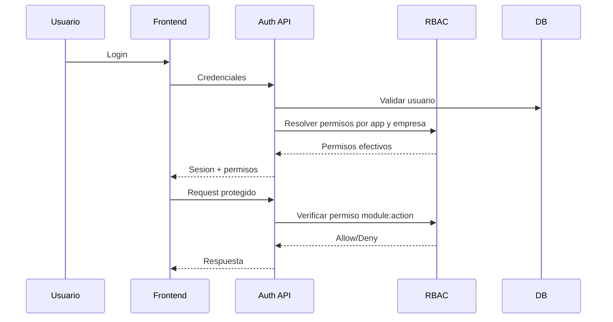
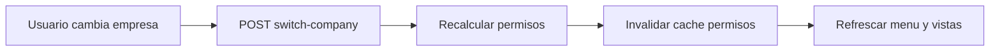

# Seguridad Identidad Permisos Consolidado

Estado: vigente

Fuentes origen: 12, 14, 15, 18, 22, 24, 25, 26, 31, 32

## Flujo de autenticacion y autorizacion


## Flujo de cambio de empresa



## Fuentes Integradas (Preservacion Completa)

Regla de consolidacion aplicada:
- Cada fuente original asignada a este maestro se preserva completa debajo de su encabezado.
- Esto garantiza trazabilidad y evita perdida de informacion durante la limpieza.

### Fuente: docs/12-DirectivasIdentidadCrossApp.md

```markdown
# KPITAL 360 — Directivas de Identidad Única y Navegación Cross-App

**Documento:** 12  
**Para:** Todo el equipo (Frontend + Backend)  
**De:** Roberto — Arquitecto Funcional / Senior Engineer  
**Prerrequisito:** Haber leído [01-EnfoqueSistema.md](./01-EnfoqueSistema.md) + [11-DirectivasConfiguracionBackend.md](./11-DirectivasConfiguracionBackend.md)  
**Prioridad:** Directiva conceptual. Define el modelo de identidad de toda la plataforma.

---

## 1. Principio Rector

KPITAL 360 y TimeWise **no son dos sistemas distintos**.  
Son dos aplicaciones sobre una misma plataforma con:

- Identidad única
- Base de datos compartida
- Autenticación centralizada
- Roles y permisos scopeados por aplicación y empresa
- **El usuario existe una sola vez.**

---

## 2. Modelo Conceptual de Identidad

Separar mentalmente cinco cosas:

| Concepto | Qué es |
|----------|--------|
| **User** (Identidad) | La cuenta que se autentica. |
| **App** (Producto) | KPITAL o TimeWise. |
| **Company** (Empresa) | Contexto empresarial activo. |
| **Role** (Rol) | Definido por app y empresa. |
| **Employee** (Representación laboral) | Entidad del dominio de RRHH. |

---

## 3. Regla de Autenticación

Existe un **único servicio de autenticación**.

El usuario:
- Se autentica **una sola vez**.
- Recibe un token válido para **toda la plataforma**.
- Ese token es aceptado por **ambas aplicaciones**.

**No existen dos logins.**  
**No existen dos tokens distintos.**  

Es un modelo de **SSO interno**.

---

## 4. Cambio entre Aplicaciones (KPITAL → TimeWise)

Cuando el usuario presiona "Ir a TimeWise":

- **No** se vuelve a autenticar.
- **No** se vuelve a pedir contraseña.
- **No** se crea una nueva sesión.
- Solo se **cambia el contexto de aplicación activa**.

### Condición obligatoria:

El usuario debe tener acceso habilitado a esa aplicación.  
El token debe estar vigente.

### El sistema valida:

1. Token válido
2. Usuario activo
3. Acceso permitido a esa app

Si se cumple → **acceso directo**.

---

## 5. Control de Acceso por Aplicación

No todos los empleados pueden entrar a KPITAL.  
El acceso a una aplicación es un **permiso independiente**.

Un usuario puede:

| App | Acceso |
|-----|--------|
| KPITAL | Sí / No |
| TimeWise | Sí / No |

Eso es **independiente del rol laboral**.

---

## 6. Multiempresa

Un usuario puede:
- Estar vinculado a **múltiples empresas**.
- Tener **roles distintos por empresa y por aplicación**.
- Operar planillas en Empresa A (KPITAL).
- Ser supervisor en Empresa B (TimeWise).
- Ser solo empleado en Empresa C.
- Tener varios roles a la vez (ej: Empleado + Supervisor en TimeWise). Jerarquía completa (Supervisor Global, Supervisor, Empleado): [27-DiagramaFlujoEmpleadosYUsuarios.md](./27-DiagramaFlujoEmpleadosYUsuarios.md).

Los permisos siempre están definidos por:

> **User + App + Company + Role**

Nunca solo por User.

**Importante:** KPITAL y TimeWise tienen permisos independientes. Ser Admin en KPITAL no implica ser Admin en TimeWise. Ver `24-PermisosEnterpriseOperacion.md` para el detalle de configuración.

---

## 7. Token y Seguridad (Conceptual)

El token representa:
- Identidad del usuario
- Aplicaciones habilitadas
- Empresas accesibles
- Rol actual activo (o lista de roles)

El cambio de empresa o aplicación:
- **No emite un nuevo login**
- Solo actualiza el contexto
- **Siempre revalida permisos en backend**

---

## 8. Regla Enterprise Fundamental

> **La identidad es única.**  
> **La autorización es contextual.**  
> **Nunca mezclar.**

---

## 9. Separación Obligatoria

- KPITAL **no puede** asumir permisos de TimeWise.
- TimeWise **no puede** asumir permisos de KPITAL.

Cada aplicación valida:
1. App activa
2. Empresa activa
3. Permisos específicos

---

## 10. Qué Debe Entender el Ingeniero

- Está construyendo una **plataforma multi-app**, no un sistema único.
- La autenticación es **centralizada**.
- La autorización es **distribuida por contexto**.
- El cambio de app es un **cambio de contexto**, no un nuevo login.
- La seguridad **nunca depende del frontend**.
- **Todo se valida en backend.**

---

## 11. Frase Clave

> Un usuario autentica una sola vez.  
> Las aplicaciones habilitan acceso.  
> Las empresas delimitan contexto.  
> Los roles conceden capacidades.  
> Los permisos autorizan acciones.

---

## 12. Arquitectura de SSO por Cookie Compartida

### Dominios de la plataforma

| Entorno | KPITAL 360 | TimeWise |
|---------|------------|----------|
| Producción | `https://kpital360.com` | `https://timewise.kpital360.com` |
| Desarrollo | `http://localhost:5173` | `http://localhost:5174` |

**Dominio raíz común:** `kpital360.com` → SSO limpio con cookies compartidas.

### Cómo funciona

El backend emite el JWT como cookie httpOnly:

```
Set-Cookie: platform_token=<jwt>
  Domain=.kpital360.com
  HttpOnly
  Secure
  SameSite=None
  Path=/
```

`kpital360.com` y `timewise.kpital360.com` comparten la misma cookie automáticamente.

### Flujo real

1. Usuario entra a `https://kpital360.com` → hace login
2. Backend responde con cookie httpOnly válida para `.kpital360.com`
3. Usuario hace click en "Ir a TimeWise"
4. Se abre `https://timewise.kpital360.com`
5. El navegador envía la misma cookie automáticamente
6. Backend valida cookie → usuario autenticado. Sin segundo login.

### Seguridad

- Cookie **HttpOnly** → JavaScript no puede leerla
- Cookie **Secure** → solo HTTPS en producción
- Cookie **firmada** con JWT_SECRET
- **Nunca guardar JWT en localStorage** → rompe seguridad enterprise

### Desarrollo local

En dev: cookies con `Domain=localhost`, `SameSite=Lax`, `Secure=false`. Frontend usa `credentials: 'include'` en todas las peticiones.

### Consecuencias en código

| Capa | Cambio |
|------|--------|
| **Backend** | CORS con `credentials: true`. Emite cookie httpOnly en login. Lee cookie en cada request. |
| **Frontend** | `fetch` con `credentials: 'include'`. No guarda token en localStorage ni Redux. |
| **authSlice** | Mantiene `user` e `isAuthenticated`, pero NO el token (es httpOnly). |
| **Interceptor** | `credentials: 'include'` en vez de header Authorization. |
| **"Ir a TimeWise"** | Simple redirect al subdominio. La cookie viaja sola. |

---

## Impacto en Arquitectura (Implementado)

| Área | Estado |
|------|--------|
| **authSlice (Redux)** | `enabledApps` + `companyIds` en User. Token no se expone a JS. |
| **activeAppSlice (Redux)** | Nuevo slice para app activa (KPITAL/TIMEWISE). |
| **permissionsSlice** | Scoped por `appId + companyId`. |
| **PrivateGuard** | Cascada: auth → app access → permisos → empresa. |
| **Middleware** | Reacciona a `setActiveApp` (limpia permisos, invalida queries). |
| **AppAccessGuard (Backend)** | `@RequireApp()` decorador + guard que valida `enabledApps`. |
| **TokenPayload (Backend)** | JWT lleva `enabledApps[]` + `companyIds[]`. |
| **Cookie SSO** | Backend emite cookie httpOnly. Frontend usa `credentials: 'include'`. |
| **App Switcher** | Botón en header para cambiar entre KPITAL ↔ TimeWise. |

---

## Conexión con Documentos Anteriores

| Documento | Conexión |
|-----------|----------|
| **01-EnfoqueSistema** | Define bounded contexts dentro de KPITAL; esta directiva eleva la visión a plataforma multi-app |
| **10-SeparacionLoginDashboard** | El login se evoluciona a SSO por cookie compartida |
| **11-ConfiguracionBackend** | El módulo auth emite cookie httpOnly + valida en cada request |

---

*Directiva implementada en código. SSO por cookie httpOnly activo en frontend y backend.*
```

### Fuente: docs/14-ModeloIdentidadEnterprise.md

```markdown
# DIRECTIVA 14 — MODELO DE IDENTIDAD ENTERPRISE

## Objetivo

Diseñar e implementar el Core Identity Model que permite:

- Un solo login para KPITAL y TimeWise
- Usuarios con acceso a múltiples empresas
- Usuarios con múltiples roles por empresa
- Permisos dinámicos y atómicos
- Cross-app SSO
- Escalabilidad sin refactor

Este modelo es la base de **todo** el sistema.

---

## Principio Arquitectónico

Separar claramente:

| Concepto | Responsabilidad |
|----------|----------------|
| **Identidad** | Quién es el usuario |
| **Aplicación** | Dónde puede entrar |
| **Empresa** | En qué contexto opera |
| **Rol** | Qué puede hacer |
| **Permiso** | Acción granular atómica |

Nada se mezcla. Nada se acopla.

---

## Modelo Relacional Definitivo

### 1. `sys_usuarios` — Root de Autenticación

Representa a la persona digital. Login, password hash, estado, datos base.

**No contiene empresa. No contiene permisos. No contiene rol. No contiene datos laborales.**

> **sys_usuarios ≠ sys_empleados** — Son entidades de bounded contexts distintos.
> `sys_usuarios` = identidad digital (quién puede autenticarse).
> `sys_empleados` = registro laboral (salario, puesto, departamento, fecha ingreso).
> Un usuario puede existir sin ser empleado (Admin TI, contador externo).
> Un empleado puede existir sin usuario (empleado sin acceso al sistema).
> Vinculación opcional: `sys_empleados.id_usuario` (FK nullable).

| Campo | Tipo | Restricción |
|-------|------|-------------|
| `id_usuario` | INT | PK, auto-increment |
| `email_usuario` | VARCHAR(150) | UNIQUE, NOT NULL |
| `password_hash_usuario` | VARCHAR(255) | NOT NULL |
| `nombre_usuario` | VARCHAR(100) | NOT NULL |
| `apellido_usuario` | VARCHAR(100) | NOT NULL |
| `telefono_usuario` | VARCHAR(30) | NULLABLE |
| `avatar_url_usuario` | VARCHAR(500) | NULLABLE |
| `estado_usuario` | TINYINT(1) | DEFAULT 1 |
| `ultimo_login_usuario` | DATETIME | NULLABLE |
| `fecha_creacion_usuario` | DATETIME | DEFAULT CURRENT_TIMESTAMP |
| `fecha_modificacion_usuario` | DATETIME | ON UPDATE CURRENT_TIMESTAMP |
| `fecha_inactivacion_usuario` | DATETIME | NULLABLE |
| `creado_por_usuario` | INT | NOT NULL |
| `modificado_por_usuario` | INT | NOT NULL |

**Índices:** `email_usuario` (UNIQUE), `estado_usuario`

---

### 2. `sys_apps` — Catálogo de Aplicaciones

Aplicaciones del ecosistema: KPITAL, TIMEWISE. Permite escalar sin rediseñar.

| Campo | Tipo | Restricción |
|-------|------|-------------|
| `id_app` | INT | PK, auto-increment |
| `codigo_app` | VARCHAR(20) | UNIQUE, NOT NULL |
| `nombre_app` | VARCHAR(100) | NOT NULL |
| `descripcion_app` | VARCHAR(300) | NULLABLE |
| `url_app` | VARCHAR(300) | NULLABLE |
| `icono_app` | VARCHAR(100) | NULLABLE |
| `estado_app` | TINYINT(1) | DEFAULT 1 |
| `fecha_creacion_app` | DATETIME | DEFAULT CURRENT_TIMESTAMP |
| `fecha_modificacion_app` | DATETIME | ON UPDATE CURRENT_TIMESTAMP |

**Índices:** `codigo_app` (UNIQUE), `estado_app`

---

### 3. `sys_usuario_app` — Tabla Puente: Usuario ↔ App

Define si un usuario puede ingresar a una app. Aquí NO hay empresa. Solo acceso a la app.

**Crítico:** Sin fila activa para una app, `enabledApps` queda vacío y el usuario recibe "Sin acceso a esta aplicación". El backend puede auto-asignar KPITAL al guardar empresas si el usuario no tenía app (`ensureUserHasKpitalApp`).

| Campo | Tipo | Restricción |
|-------|------|-------------|
| `id_usuario_app` | INT | PK, auto-increment |
| `id_usuario` | INT | FK → sys_usuarios |
| `id_app` | INT | FK → sys_apps |
| `estado_usuario_app` | TINYINT(1) | DEFAULT 1 |
| `fecha_asignacion_usuario_app` | DATETIME | DEFAULT CURRENT_TIMESTAMP |

**Índices:** UNIQUE(`id_usuario`, `id_app`)

---

### 4. `sys_usuario_empresa` — Tabla Puente: Usuario ↔ Empresa

Define en qué empresas puede operar un usuario. Fundamento multiempresa.

| Campo | Tipo | Restricción |
|-------|------|-------------|
| `id_usuario_empresa` | INT | PK, auto-increment |
| `id_usuario` | INT | FK → sys_usuarios |
| `id_empresa` | INT | FK → sys_empresas |
| `estado_usuario_empresa` | TINYINT(1) | DEFAULT 1 |
| `fecha_asignacion_usuario_empresa` | DATETIME | DEFAULT CURRENT_TIMESTAMP |

**Índices:** UNIQUE(`id_usuario`, `id_empresa`)

---

### 5. `sys_roles` — Roles Abstractos

Roles globales del sistema. Un rol no tiene empresa, no tiene app. Es abstracto.

| Campo | Tipo | Restricción |
|-------|------|-------------|
| `id_rol` | INT | PK, auto-increment |
| `codigo_rol` | VARCHAR(50) | UNIQUE, NOT NULL |
| `nombre_rol` | VARCHAR(100) | NOT NULL |
| `descripcion_rol` | VARCHAR(300) | NULLABLE |
| `estado_rol` | TINYINT(1) | DEFAULT 1 |
| `fecha_creacion_rol` | DATETIME | DEFAULT CURRENT_TIMESTAMP |
| `fecha_modificacion_rol` | DATETIME | ON UPDATE CURRENT_TIMESTAMP |
| `creado_por_rol` | INT | NOT NULL |
| `modificado_por_rol` | INT | NOT NULL |

**Índices:** `codigo_rol` (UNIQUE), `estado_rol`

---

### 6. `sys_permisos` — Permisos Atómicos

Acciones puras: `employees.list`, `payroll.approve`, `company.edit`. No saben de empresa ni de usuario.

| Campo | Tipo | Restricción |
|-------|------|-------------|
| `id_permiso` | INT | PK, auto-increment |
| `codigo_permiso` | VARCHAR(100) | UNIQUE, NOT NULL |
| `nombre_permiso` | VARCHAR(150) | NOT NULL |
| `descripcion_permiso` | VARCHAR(300) | NULLABLE |
| `modulo_permiso` | VARCHAR(50) | NOT NULL |
| `estado_permiso` | TINYINT(1) | DEFAULT 1 |
| `fecha_creacion_permiso` | DATETIME | DEFAULT CURRENT_TIMESTAMP |

**Índices:** `codigo_permiso` (UNIQUE), `modulo_permiso`, `estado_permiso`

---

### 7. `sys_rol_permiso` — Tabla Puente: Rol ↔ Permiso

Define qué puede hacer cada rol. No depende de usuario ni de empresa.

| Campo | Tipo | Restricción |
|-------|------|-------------|
| `id_rol_permiso` | INT | PK, auto-increment |
| `id_rol` | INT | FK → sys_roles |
| `id_permiso` | INT | FK → sys_permisos |
| `fecha_asignacion_rol_permiso` | DATETIME | DEFAULT CURRENT_TIMESTAMP |

**Índices:** UNIQUE(`id_rol`, `id_permiso`)

---

### 8. `sys_usuario_rol` — **Tabla Core del Modelo**

La tabla más importante. Relación: **Usuario ↔ Rol ↔ Empresa ↔ App**. Define el scope real.

| Campo | Tipo | Restricción |
|-------|------|-------------|
| `id_usuario_rol` | INT | PK, auto-increment |
| `id_usuario` | INT | FK → sys_usuarios |
| `id_rol` | INT | FK → sys_roles |
| `id_empresa` | INT | FK → sys_empresas |
| `id_app` | INT | FK → sys_apps |
| `estado_usuario_rol` | TINYINT(1) | DEFAULT 1 |
| `fecha_asignacion_usuario_rol` | DATETIME | DEFAULT CURRENT_TIMESTAMP |
| `fecha_modificacion_usuario_rol` | DATETIME | ON UPDATE CURRENT_TIMESTAMP |
| `creado_por_usuario_rol` | INT | NOT NULL |
| `modificado_por_usuario_rol` | INT | NOT NULL |

**Índices:** UNIQUE(`id_usuario`, `id_rol`, `id_empresa`, `id_app`), `id_empresa`, `id_app`

**Permite:**
- Un usuario puede ser ADMIN en KPITAL para Empresa A
- El mismo usuario puede ser EMPLEADO en TIMEWISE para Empresa B
- El mismo usuario puede tener múltiples roles en una misma empresa

**Tablas extendidas (ver `26-SistemaPermisosReferencia.md`):**
- `sys_usuario_rol_global` — roles que aplican a todas las empresas del usuario
- `sys_usuario_permiso` — overrides DENY/ALLOW por contexto
- `sys_usuario_permiso_global` — denegación global de permisos por app

---

## Flujo de Login (Conceptual — no implementado aún)

1. Usuario se autentica (email + password)
2. Se valida `estado_usuario = 1`
3. Se cargan: apps permitidas, empresas asociadas, roles por empresa
4. Frontend selecciona: app activa, empresa activa
5. Token se genera con: `userId`, `appId`, `companyId`, roles activos
6. No se recalculan permisos en cada request — se validan vía guard con token

---

## Multiempresa Real

- Un usuario puede gestionar Empresa A y Empresa B
- Tener roles distintos en cada una
- Cambiar contexto sin perder sesión
- Empresa activa en token o header
- Nunca se mezcla información entre empresas

---

## Cross-App SSO

- Login vive en dominio raíz: `kpital360.com`
- Cookie httpOnly con `Domain=.kpital360.com`
- TimeWise valida token desde backend central
- No existen dos bases de usuarios
- Identidad es única

---

## Seguridad Enterprise

- ❌ No hay DELETE físico en usuarios, roles, ni permisos
- ✅ Todo es inactivación lógica
- ✅ Auditoría obligatoria desde Fase 1
- ✅ Integridad referencial con FK constraints

---

## Orden de Implementación

1. `sys_usuarios` — root de autenticación
2. `sys_apps` — catálogo de aplicaciones
3. `sys_usuario_app` — puente usuario ↔ app
4. `sys_usuario_empresa` — puente usuario ↔ empresa
5. `sys_roles` — roles abstractos
6. `sys_permisos` — permisos atómicos
7. `sys_rol_permiso` — puente rol ↔ permiso
8. `sys_usuario_rol` — tabla core (usuario ↔ rol ↔ empresa ↔ app)

---

## Organización en Código

| Entidad | Módulo NestJS |
|---------|--------------|
| `sys_usuarios` (User) | `auth` |
| `sys_apps` (App) | `access-control` |
| `sys_usuario_app` (UserApp) | `access-control` |
| `sys_usuario_empresa` (UserCompany) | `access-control` |
| `sys_roles` (Role) | `access-control` |
| `sys_permisos` (Permission) | `access-control` |
| `sys_rol_permiso` (RolePermission) | `access-control` |
| `sys_usuario_rol` (UserRole) | `access-control` |

---

## Lo que NO se hace en esta directiva

- ❌ No se implementa JWT real
- ❌ No se implementa login real
- ❌ No se implementan guards reales
- ❌ No se conecta frontend
- ❌ No se toca employees, payroll, personal-actions

---

## Estado del Proyecto después de esto

| Componente | Estado |
|-----------|--------|
| Infraestructura | ✅ |
| Empresa root (`sys_empresas`) | ✅ |
| Identidad completa | ✅ |
| Base lista para negocio | ✅ |

Siguiente paso: Seed inicial → Login real → JWT → Guards
```

### Fuente: docs/15-ModeladoSysUsuarios.md

```markdown
# DIRECTIVA 15  MODELADO ENTERPRISE sys_usuarios

## Objetivo

Evolucionar `sys_usuarios` de tabla bsica a tabla enterprise completa que soporte:

- No borrado fsico (solo inactivacin)
- Auditora desde Fase 1
- Seguridad y trazabilidad (intentos fallidos, bloqueo temporal, IP de login)
- Compatibilidad futura con O365 / OAuth (password nullable)
- Estados claros: ACTIVO / INACTIVO / BLOQUEADO

---

## Reglas No Negociables

1. **Nunca se borra un usuario** (soft-disable).
2. **Email es nico global**, siempre normalizado a minsculas sin espacios.
3. **Contrasea solo hash**, nunca plaintext. Password es **nullable** (futuro SSO-only).
4. Un usuario **puede existir sin empresa/roles** (eso vive en tablas puente).
5. **Auditora obligatoria desde el da 1**.

---

## Estructura Definitiva  sys_usuarios

### Identidad

| Campo | Tipo | Restriccin |
|-------|------|-------------|
| `id_usuario` | INT | PK, auto-increment |
| `email_usuario` | VARCHAR(150) | UNIQUE, NOT NULL |
| `username_usuario` | VARCHAR(50) | UNIQUE, NULLABLE |
| `nombre_usuario` | VARCHAR(100) | NOT NULL |
| `apellido_usuario` | VARCHAR(100) | NOT NULL |
| `telefono_usuario` | VARCHAR(30) | NULLABLE |
| `avatar_url_usuario` | VARCHAR(500) | NULLABLE |

### Seguridad / Auth

| Campo | Tipo | Restriccin |
|-------|------|-------------|
| `password_hash_usuario` | VARCHAR(255) | **NULLABLE** (futuro SSO-only) |
| `password_updated_at_usuario` | DATETIME | NULLABLE |
| `requires_password_reset_usuario` | TINYINT(1) | DEFAULT 0 |

### Estado Enterprise

| Campo | Tipo | Restriccin |
|-------|------|-------------|
| `estado_usuario` | TINYINT(1) | DEFAULT 1 (ACTIVO) |
| `fecha_inactivacion_usuario` | DATETIME | NULLABLE |
| `motivo_inactivacion_usuario` | VARCHAR(300) | NULLABLE |

### Control de Acceso / Hardening

| Campo | Tipo | Restriccin |
|-------|------|-------------|
| `failed_attempts_usuario` | INT | DEFAULT 0 |
| `locked_until_usuario` | DATETIME | NULLABLE |
| `ultimo_login_usuario` | DATETIME | NULLABLE |
| `last_login_ip_usuario` | VARCHAR(45) | NULLABLE (IPv6) |

### Auditora

| Campo | Tipo | Restriccin |
|-------|------|-------------|
| `fecha_creacion_usuario` | DATETIME | DEFAULT CURRENT_TIMESTAMP |
| `fecha_modificacion_usuario` | DATETIME | ON UPDATE CURRENT_TIMESTAMP |
| `creado_por_usuario` | INT | **NULLABLE** |
| `modificado_por_usuario` | INT | **NULLABLE** |

---

## ndices / Constraints

| ndice | Columna(s) | Tipo |
|--------|-----------|------|
| `IDX_usuario_email` | `email_usuario` | UNIQUE |
| `IDX_usuario_username` | `username_usuario` | UNIQUE |
| `IDX_usuario_estado` | `estado_usuario` | INDEX |
| `IDX_usuario_ultimo_login` | `ultimo_login_usuario` | INDEX |

---

## Estados Permitidos (Catlogo)

| Valor | Nombre | Descripcin |
|-------|--------|-------------|
| **1** | ACTIVO | Puede autenticarse y operar normalmente |
| **2** | INACTIVO | No puede autenticarse, no rompe integridad |
| **3** | BLOQUEADO | Demasiados intentos fallidos o bloqueo manual por admin |

**Reglas:**
- INACTIVO/BLOQUEADO **no eliminan** relaciones con empresas/roles. Solo impiden login.
- El enum vive en `auth/constants/user-status.enum.ts`.

---

## Contrato con Tablas Puente

`sys_usuarios` **NO tiene:**
- Empresa activa
- Roles
- Permisos
- Apps
- **Datos laborales** (salario, puesto, departamento, fecha de ingreso)

Eso vive en:
- `sys_usuario_app`  acceso a aplicaciones
- `sys_usuario_empresa`  pertenencia a empresas
- `sys_usuario_rol`  roles scoped por empresa + app

---

## Separacin Fundamental: Usuario  Empleado

| Concepto | Tabla | Bounded Context | Qu representa |
|----------|-------|----------------|---------------|
| **Usuario** | `sys_usuarios` | Auth / Access Control | Cuenta digital para autenticarse |
| **Empleado** | `sys_empleados` (futuro) | Employee Management | Persona contratada (datos laborales de RRHH) |

**Reglas:**
- No todos los empleados entran al sistema (empleado sin acceso digital).
- No todos los usuarios son empleados (admin TI, contador externo, auditor).
- Un usuario puede administrar mltiples empleados sin ser empleado l mismo.
- Si un empleado necesita acceso, se crea un registro en `sys_usuarios` y se vincula con `sys_empleados.id_usuario` (FK opcional, nullable).
- **Nunca se mezclan datos de identidad con datos laborales en la misma tabla.**

| Caso | sys_usuarios | sys_empleados |
|------|:----------:|:----------:|
| Admin TI | Si | No |
| RRHH con planilla | Si | Si |
| Empleado sin acceso digital | No | Si |
| Contador externo | Si | No |
| Empleado que usa TimeWise | Si | Si |

---

## Validaciones de Negocio

1. Email siempre en minscula y sin espacios (`normalizeEmail`)
2. No permitir ACTIVO sin email vlido
3. Si `locked_until_usuario > NOW()`  login denegado aunque est ACTIVO
4. Si `estado_usuario != ACTIVO`  login denegado
5. Al superar 5 intentos fallidos  bloqueo automtico por 15 minutos
6. Al reactivar  se limpian `failedAttempts`, `lockedUntil`, `motivoInactivacion`

---

## Implementacin en Cdigo

### Entity: `auth/entities/user.entity.ts`
- Todas las columnas mapeadas con TypeORM decorators
- Enum `UserStatus` importado para defaults

### DTOs
- `CreateUserDto`: email (required), password (optional para futuro SSO), username (optional), nombre, apellido
- `UpdateUserDto`: todos opcionales para patch parcial

### Service: `auth/users.service.ts`
- `create()`  normaliza email, hash bcrypt, verifica unicidad email+username
- `findAll()`  filtra por ACTIVO por defecto
- `findByEmail()` / `findByUsername()`  normalizacin automtica
- `inactivate()`  estado=2, registra motivo y fecha
- `reactivate()`  estado=1, limpia bloqueo y motivo
- `block()`  estado=3, registra motivo
- `validateForLogin()`  verifica estado, lock temporal, retorna user con hash
- `registerFailedAttempt()`  incrementa contador, auto-bloquea a los 5 intentos
- `registerSuccessfulLogin()`  limpia contador, registra IP y timestamp

### Controller: `auth/users.controller.ts`
- `GET /api/users/health`
- `POST /api/users`  crear
- `GET /api/users`  listar (con `?includeInactive=true`)
- `GET /api/users/:id`  detalle
- `PUT /api/users/:id`  actualizar
- `PATCH /api/users/:id/inactivate`  inactivar (con motivo)
- `PATCH /api/users/:id/reactivate`  reactivar
- `PATCH /api/users/:id/block`  bloquear (con motivo)

---

## Migracin

| Archivo | Propsito |
|---------|-----------|
| `1708531200000-CreateSysEmpresas` | Tabla empresas (Directiva 13) |
| `1708531300000-CreateIdentitySchema` | 7 tablas identity base (Directiva 14) |
| `1708531400000-EnhanceSysUsuarios` | ALTER TABLE: columnas enterprise (Directiva 15) |

---

## Qu NO se hace todava

-  O365, refresh tokens, SSO real
-  Flujo de login completo con JWT
-  Endpoints finales de autenticacin
- Solo: tabla mejorada + migracin + entity + DTOs + CRUD enterprise (sin delete)
```

### Fuente: docs/18-IdentityCoreEnterprise.md

```markdown
# DIRECTIVA 18  Identity Core Enterprise (Fase 1 Completa)

## Objetivo

Cerrar el Identity Core completo: seed, autenticacin real con JWT, guards, permisos dinmicos desde backend, conexin frontendbackend, y base para SSO cross-app.

Sin este bloque, no existe multiempresa real, ni men por permisos real, ni SSO KPITALTimeWise.

---

## Componentes Implementados

### 1. Seed Inicial (Migracin)

Datos base insertados en RDS:

| Dato | Detalle |
|------|---------|
| Empresa demo | KPITAL Corp (cdula 3-101-999999, prefijo KC) |
| Apps | `kpital` (KPITAL 360) + `timewise` (TimeWise) |
| 17 permisos | payroll:*, employee:*, personal-action:*, company:manage, report:view, config:* |
| Rol | ADMIN_SISTEMA (todos los permisos) |
| Usuario admin | roberto@kpital360.com / Admin2026! (bcrypt hash) |
| Asignaciones | admin  ambas apps, empresa KC, rol ADMIN_SISTEMA en KPITAL+TIMEWISE |

Archivo: `migrations/1708531600000-SeedIdentityCore.ts`

### 2. Autenticacin Real (Backend)

| Endpoint | Mtodo | Descripcin |
|----------|--------|-------------|
| `/api/auth/login` | POST | Valida email+password (bcrypt), genera JWT, emite cookie httpOnly |
| `/api/auth/logout` | POST | Limpia cookie |
| `/api/auth/me` | GET | `@UseGuards(JwtAuthGuard)`  Retorna sesin: user+companies+enabledApps+permissions |
| `/api/auth/switch-company` | POST | `@UseGuards(JwtAuthGuard)`  Resuelve permisos para nueva empresa+app |

**AuthService** implementa:
- Login con bcrypt validation + failed attempts + account locking
- `buildSession()`  construye sesin completa (user, apps, companies, permissions)
- `resolvePermissions()`  cadena completa: usuario  roles (por empresa+app)  permisos del rol  overrides por usuario (`ALLOW/DENY`)  permisos efectivos

**JWT Payload (mnimo):**
```json
{ "sub": 1, "email": "roberto@kpital360.com", "type": "access" }
```

Permisos NO van en el JWT  se resuelven en cada request o en /me y /switch-company.

### 2.1 RBAC + Overrides (extension enterprise)

- Tabla de overrides: `sys_usuario_permiso` (scope: usuario + empresa + app + permiso).
- `ALLOW` agrega permiso puntual.
- `DENY` revoca permiso puntual aunque venga por rol.
- Regla no negociable: `DENY > ALLOW`.
- **Crtico:** Sin fila en `sys_usuario_app` para la app, `enabledApps` queda vaco y el usuario recibe "Sin acceso a esta aplicacin".

Esto habilita casos como:
- rol base con `employee:create` y sin `employee:edit`,
- override `ALLOW employee:edit` para un usuario puntual,
- override `DENY employee:create` para bloquear creacion aunque el rol lo tenga.

### 3. Guards y Decoradores

| Componente | Archivo | Uso |
|-----------|---------|-----|
| `JwtAuthGuard` | `common/guards/jwt-auth.guard.ts` | `@UseGuards(JwtAuthGuard)`  valida JWT de cookie |
| `PermissionsGuard` | `common/guards/permissions.guard.ts` | Verifica permisos granulares vs `req.user.permissions` |
| `@RequirePermissions()` | `common/decorators/require-permissions.decorator.ts` | `@RequirePermissions('payroll:view')` |
| `@CurrentUser()` | `common/decorators/current-user.decorator.ts` | Extrae `{ userId, email }` del request |
| `AppAccessGuard` | `common/guards/app-access.guard.ts` | Verifica acceso a app (ya existente) |
| `@RequireApp()` | `common/decorators/require-app.decorator.ts` | Marca endpoint como exclusivo de app (ya existente) |

### 4. JWT Strategy (Passport)

- Extrae JWT de cookie httpOnly (`platform_token`)
- Valida firma, expiracin, y `type: 'access'`
- Inyecta `{ userId, email }` en `request.user`

### 5. Frontend  Conexin Real

| Componente | Cambio |
|-----------|--------|
| `httpInterceptor.ts` | Usa `API_URL` configurable, paths relativos  URL completa |
| `config/api.ts` | `VITE_API_URL` o default `http://localhost:3000/api` |
| `authSlice.ts` | Agregado: `companies[]`, `sessionLoading`, `setSessionLoaded` |
| `permissionsSlice.ts` | Permisos vacos por defecto (NUNCA hardcoded) |
| `useSessionRestore.ts` | Hook: al cargar app  `GET /me`  restaura sesin desde cookie |
| `App.tsx` | Usa `useSessionRestore()`, muestra spinner mientras verifica |
| `LoginPage.tsx` | Login real  auto-selecciona empresa si solo 1, carga permisos |
| `CompanySelectionPage.tsx` | Empresas reales desde Redux (del login), `POST /switch-company` |
| `api/permissions.ts` | `POST /auth/switch-company` real (no mock) |
| `companyChangeListener.ts` | Pasa `appCode` al cargar permisos |

---

## Flujo Completo de Autenticacin

```
1. Usuario abre app
    useSessionRestore  GET /auth/me
        Cookie vlida  setCredentials + restaurar empresa + permisos
        Sin cookie  sessionLoading=false  muestra login

2. Login
    POST /auth/login (email, password)
        Backend: validateForLogin  bcrypt.compare  JWT  cookie
        Frontend: setCredentials + empresas
            1 empresa  auto-selecciona + POST /switch-company  dashboard
            N empresas  /select-company

3. Seleccin de empresa
    POST /auth/switch-company (companyId, appCode)
        Backend: resolvePermissions  permisos atmicos
        Frontend: setPermissions + setActiveCompany  dashboard

4. Cambio de empresa (desde dashboard)
    Middleware companyChangeListener
        POST /auth/switch-company  nuevos permisos
        invalidateQueries (TanStack)

5. Logout
    performLogout  POST /auth/logout (limpia cookie)
        dispatch logout  clearPermissions + clearCompany + queryClient.clear()
```

---

## Contrato de Permisos (API)

### GET /auth/me?companyId=X&appCode=kpital

```json
{
  "authenticated": true,
  "user": {
    "id": "1",
    "email": "roberto@kpital360.com",
    "name": "Roberto Carlos Zuniga Altamirano",
    "enabledApps": ["kpital", "timewise"],
    "companyIds": ["1"]
  },
  "companies": [{ "id": 1, "nombre": "KPITAL Corp", "codigo": "KC" }],
  "permissions": ["payroll:view", "employee:view", ...],
  "roles": ["ADMIN_SISTEMA"]
}
```

### POST /auth/switch-company

Request: `{ "companyId": 1, "appCode": "kpital" }`

Response:
```json
{
  "companyId": 1,
  "appCode": "kpital",
  "permissions": ["payroll:view", ...],
  "roles": ["ADMIN_SISTEMA"]
}
```

`permissions[]` ya viene con el resultado final de `roles + overrides`.

---

## SSO Cross-App (Base Lista)

La infraestructura soporta SSO desde ya:
- Cookie `platform_token` con `Domain=.kpital360.com` (produccin)
- Mismo JWT vlido para KPITAL y TimeWise
- `enabledApps` en la sesin define a qu apps tiene acceso
- `resolvePermissions()` acepta `appCode` para diferenciar permisos por app
- Botn "Ir a TimeWise" = redirect simple (la cookie ya viaja)

---

## Qu Queda Cerrado

| rea | Estado |
|------|--------|
| Multiempresa a nivel de permisos |  Real (desde BD) |
| Men dinmico "de verdad" |  Backend responde permisos reales |
| Login real funcionando |  bcrypt + JWT + cookie httpOnly |
| Contexto de empresa activo |  switch-company + localStorage |
| Base para SSO KPITALTimeWise |  Cookie compartida por dominio |
| Workflows de identidad |  IdentitySyncWorkflow + EmployeeCreationWorkflow |
| Guards enterprise |  JwtAuthGuard + PermissionsGuard + AppAccessGuard |
| Restauracin de sesin |  useSessionRestore (cookie  /me) |
```

### Fuente: docs/22-AuthReport.md

```markdown
# KPITAL 360 - Auth Report (Enterprise) - Cierre de Hardening

**Documento:** 22  
**Fecha:** 2026-02-23  
**Objetivo:** Registrar el hardening ejecutado para llevar Auth/Core a nivel enterprise operativo (guards globales, refresh rotatorio, CSRF, rate-limit, auditoria, locking en payroll y outbox de eventos).

---

## 0) Resumen Ejecutivo

Implementado en esta fase:

1. Guardrails globales de seguridad en API (`JWT + CSRF + Permissions`).
2. Refresh token rotatorio con revocacion y persistencia hash en DB.
3. Proteccion CSRF por header/cookie (double submit).
4. Rate limit por IP en endpoints de autenticacion.
5. Auditoria de auth con eventos estructurados.
6. Locking optimista en `payroll apply`.
7. Outbox base (`sys_domain_events`) con persistencia de eventos clave.

Build status:

1. `api` compila OK.
2. `frontend` compila OK.

---

## 1) Cambios Implementados (Codigo)

## 1.1 Seguridad transversal global

1. `APP_GUARD` global en `AppModule`:
   - `JwtAuthGuard`
   - `CsrfGuard`
   - `PermissionsGuard`
2. Decoradores nuevos:
   - `@Public()`
   - `@SkipCsrf()`
3. Endpoints publicos definidos explicitamente (auth/login, auth/validate, auth/microsoft/exchange, health).

## 1.2 Permisos backend obligatorios

Se agrego `@RequirePermissions(...)` en controladores sensibles:

1. `employees`
2. `payroll`
3. `personal-actions`
4. `companies`
5. `users`
6. `roles`
7. `permissions`
8. `apps`
9. `user-assignments`

Se reemplazo `userId=1` hardcoded por `@CurrentUser()` en operaciones mutantes.

## 1.3 Sesion enterprise (refresh rotatorio)

1. Nueva entidad: `RefreshSession` (`sys_refresh_sessions`).
2. `AuthService` ahora emite:
   - access token (cookie `platform_token`)
   - refresh token (cookie `platform_refresh_token`)
   - csrf token (cookie `platform_csrf_token`)
3. Endpoint nuevo: `POST /api/auth/refresh`.
4. Rotacion implementada por `jti` + hash bcrypt de refresh en DB.
5. Logout revoca refresh activo y limpia cookies de access/refresh/csrf.

## 1.4 CSRF posture

1. Guard CSRF activo para `POST/PUT/PATCH/DELETE`.
2. Validacion de `x-csrf-token` contra cookie `platform_csrf_token`.
3. Frontend envia header CSRF automatico en mutaciones (`httpInterceptor`).
4. `performLogout` actualizado para enviar header CSRF.

## 1.5 Rate limit en auth

Throttle en memoria por IP para:

1. `POST /auth/login`
2. `POST /auth/validate`
3. `POST /auth/microsoft/exchange`
4. `POST /auth/refresh`

## 1.6 Auditoria de seguridad

1. Servicio `AuthAuditService` para eventos:
   - `login_success`
   - `login_failed`
   - `refresh_used`
   - `logout`
   - `switch_company`
   - `microsoft_validate_failed`
2. Registro estructurado en logs + persistencia en outbox (`sys_domain_events`).

## 1.7 Payroll: concurrencia y eventos

1. `nom_calendarios_nomina` ahora tiene `version_lock_calendario_nomina`.
2. `apply` usa control optimista (`WHERE version` + update atomico).
3. Conflicto concurrente retorna `409`.
4. Eventos de payroll se registran en outbox con `idempotency_key`.

## 1.8 Outbox base

1. Tabla `sys_domain_events` creada.
2. Servicio `DomainEventsService` para persistir eventos de dominio.
3. Integrado en auth y payroll.

## 1.9 RBAC + Overrides por usuario (hardening de autorizacion)

1. Nueva tabla `sys_usuario_permiso` para overrides por contexto (`user + company + app`).
2. `resolvePermissions()` actualizado:
   - base por roles del contexto,
   - aplica overrides de usuario,
   - `DENY` tiene precedencia sobre `ALLOW`.
3. Endpoints administrativos enterprise agregados bajo `/api/config/*`:
   - gestion de roles,
   - reemplazo de permisos por rol,
   - reemplazo de roles por usuario/contexto,
   - reemplazo y consulta de overrides por usuario/contexto.

## 1.10 Robustez de sesion ante fallas transientes (frontend + backend)

1. Frontend:
   - `httpInterceptor` ahora usa timeout en requests (`fetchWithTimeout`).
   - `tryRefreshSession()` maneja timeout/error de red y responde `false` sin colgar la app.
   - Resultado: evita quedarse indefinidamente en "Verificando sesion...".
2. Backend:
   - `AuthService.refreshSession()` captura errores transientes de DB/driver (`ECONNRESET`, `PROTOCOL_CONNECTION_LOST`, `ETIMEDOUT`, etc.).
   - En esos casos responde `401` controlado (`Sesion expirada o no valida`) en lugar de error no controlado.
3. Efecto operativo:
   - Si hay corte transiente contra MySQL/RDS durante refresh, el cliente fuerza relogin seguro (`/auth/login?expired=true&from=...`).
   - Se prioriza fail-closed para acceso enterprise.

## 1.11 Correccion de flujo Microsoft popup (callback race condition)

1. Problema:
   - En callback OAuth (`/auth/login?code=...`), `useSessionRestore`/`PublicGuard` podian redirigir a `/dashboard` dentro del popup antes de ejecutar `postMessage + window.close`.
   - Resultado: popup quedaba abierto y la ventana principal quedaba en "Validando con Microsoft...".
2. Ajuste aplicado:
   - Deteccion explicita de callback Microsoft en frontend (`isMicrosoftOAuthCallbackInProgress`).
   - `App.tsx`: no bloquea router con spinner en callback OAuth.
   - `useSessionRestore`: omite restore para callback OAuth y libera `sessionLoading`.
   - `PublicGuard`: no redirige a dashboard durante callback OAuth.
3. Resultado:
   - El popup completa handshake (`postMessage`) y se cierra como comportamiento esperado.

---

## 2) Migraciones Nuevas

Agregar al despliegue:

1. `1708532200000-AddSecurityAndOutboxTables.ts`
2. `1708532400000-AddUserPermissionOverrides.ts`

Esta migracion crea:

1. `sys_refresh_sessions`
2. `sys_domain_events`
3. `version_lock_calendario_nomina` en `nom_calendarios_nomina`

Y adicionalmente:

1. `sys_usuario_permiso` (overrides ALLOW/DENY por usuario/contexto)

---

## 3) Auditoria Final de Seguridad (Estado)

| Control | Estado | Evidencia |
|---|---|---|
| Guards globales por defecto | Cumple | `APP_GUARD` en `AppModule` |
| Endpoints sensibles con permisos | Cumple (fase 1) | `@RequirePermissions` aplicado en modulos de negocio/config |
| Refresh token rotatorio | Cumple | `sys_refresh_sessions` + `/auth/refresh` + rotacion jti |
| Revocacion de sesion | Cumple | `logout` revoca refresh y limpia cookies |
| CSRF formal | Cumple | `CsrfGuard` + header `x-csrf-token` |
| Rate limit auth | Cumple (fase 1) | `AuthRateLimitService` por IP |
| Auditoria eventos auth | Cumple (fase 1) | `AuthAuditService` + logs + outbox |
| Locking optimista payroll apply | Cumple | `version_lock` + `409` en conflicto |
| Outbox persistente | Cumple (base) | `sys_domain_events` + `DomainEventsService` |

---

## 4) Riesgo Residual (Para Fase 2)

1. Rate limit actual es en memoria (recomendado migrar a Redis distribuido).
2. `PermissionsGuard` requiere `companyId` explicito para permisos contextuales, excepto endpoints marcados con `@AllowWithoutCompany()` (catalogos globales en Fase 1).
3. Outbox esta persistido, pero falta publicador asincrono (worker) para dispatch externo.
4. Falta paquete de evidencia QA visual final (capturas Network/cookies/matriz de respuestas) para cierre documental completo.

---

## 5) Evidencia Tecnica Minima Ejecutada

1. Build API: OK.
2. Build Frontend: OK.
3. Flujo de login Microsoft y avatar persistente previamente validado.
4. Interceptor frontend actualizado para CSRF + refresh automatico ante `401`.
5. Interceptor frontend actualizado con timeout en request y refresh.
6. Refresh backend actualizado para mapear errores transientes de DB a `401` controlado.

---

## 6) Conclusion

Con esta implementacion, el nucleo de hardening solicitado quedo aplicado en codigo y documentado. El sistema pasa de arquitectura enterprise conceptual a una postura de seguridad enterprise operativa de fase 1.

## 7) Anexo - Correccion de estabilidad en restauracion de permisos (2026-02-24)

1. Problema detectado:
   - En restauracion de sesion, acciones de contexto podian disparar recargas redundantes de permisos.
   - Si una llamada fallaba o llegaba tarde, podia sobrescribir el estado con permisos vacios y provocar 403 falso positivo.
2. Correccion aplicada en frontend:
   - Middleware de contexto ignora eventos sin cambio real (`app` y `company`).
   - Fallos transitorios en recarga de permisos ya no pisan permisos vigentes.
3. Validacion de seguridad:
   - No se agrego persistencia sensible en navegador.
   - JWT continua en cookie `httpOnly`.
   - Autorizacion final permanece en backend con guards.
4. Resultado esperado:
   - El usuario no pierde acceso visual por condiciones de carrera cuando la sesion sigue siendo valida.
```

### Fuente: docs/24-PermisosEnterpriseOperacion.md

```markdown
# 24  Permisos Enterprise Operacin

**ltima actualizacin:** 2026-02-22  
**Referencia tcnica completa:** `26-SistemaPermisosReferencia.md`

## Objetivo

Operar permisos enterprise con resolucin efectiva por contexto:

- `usuario + empresa + app`
- permisos atmicos `module:action`
- enforcement real en backend (403 cuando falta permiso)

---

## Cmo Funciona el Sistema (Resumen)

1. **Usuario** se autentica.
2. **App asignada** (`sys_usuario_app`): Define a qu apps puede entrar. Sin KPITAL asignado  "Sin acceso a esta aplicacin".
3. **Empresas asignadas** (`sys_usuario_empresa`): Define en qu empresas opera. Sin empresas  no hay contexto para roles.
4. **Roles** (`sys_usuario_rol` + `sys_usuario_rol_global`): Definen los permisos base desde `sys_rol_permiso`.
5. **Excepciones** (`sys_usuario_permiso` + `sys_usuario_permiso_global`): DENY quita permisos; ALLOW aade. **DENY siempre gana.**

**Permisos efectivos** = Permisos de roles  DENY + ALLOW

Detalle tcnico de tablas, flujo y diagnstico: ver `26-SistemaPermisosReferencia.md`.

---

## KPITAL y TimeWise son Aplicaciones Distintas

| Aplicacin | Qu gestiona | Ejemplos de permisos |
|------------|--------------|----------------------|
| **KPITAL 360** | Planillas, empleados, empresas, acciones de personal, reportes, config | `payroll:view`, `employee:create`, `company:manage`, `config:roles` |
| **TimeWise** | Asistencia, tiempo, distribucin de costos | `timewise:distribucion-costo-create` |

- Ser Admin en KPITAL **no implica** ser Admin en TimeWise.
- Cada app tiene su propio conjunto de permisos.

---

## Vista de Configuracin (Usuarios > Configurar)

**Filtro de quin aparece:** Solo staff KPITAL (cualquier rol) y usuarios con rol Supervisor (o superior) en TimeWise. No aparecen empleados puros (solo TimeWise + rol Empleado). Ver [27-DiagramaFlujoEmpleadosYUsuarios.md](./27-DiagramaFlujoEmpleadosYUsuarios.md).

**Visibilidad de pestaas:** Las pestaas Roles, Usuarios y Permisos se muestran solo si el usuario tiene el permiso correspondiente (`config:roles`, `config:users`, `config:permissions`).

La ventana tiene **tres pestaas** y un selector de aplicacin:

**Selector de Aplicacin:** Solo muestra las apps que el usuario tiene asignadas. Si no tiene ninguna, puede asignarlas desde ah (requiere `config:users:assign-apps`). Estados de carga mientras se cargan apps y roles.

### 1. Empresas

- Solo las empresas **marcadas** se asignan al usuario. Si est desmarcada, el usuario no ve nada de esa empresa.
- **Permiso:** `config:users:assign-companies`. Sin l, se muestra mensaje y controles deshabilitados.
- **Guardar empresas**  `replaceUserCompanies`  `sys_usuario_empresa`

### 2. Roles

- **Roles globales:** Se aplican a **todas** las empresas del usuario (para la app seleccionada). Solo se muestran roles de la app seleccionada.
- **Permiso:** `config:users:assign-roles`. Sin l, controles deshabilitados.
- **Guardar roles globales**  `replaceUserGlobalRoles`  `sys_usuario_rol_global`
- Al guardar, se cambia a Excepciones y se actualiza la lista sin refrescar.
- Requiere al menos una empresa asignada; si no, los roles no tienen efecto.
- **Creacin de empleado con acceso:** si se asigna rol al crear, tambin se registra en `sys_usuario_rol_global`.

### 3. Excepciones

- Permisos que el usuario **NO** debe tener en ninguna empresa (para la app seleccionada). El selector de rol solo muestra los roles asignados al usuario.
- **Permiso:** `config:users:deny-permissions`. Sin l, controles deshabilitados.
- **Guardar**  `replaceUserGlobalPermissionDenials`  `sys_usuario_permiso_global`
- Si el rol no tiene permisos, la UI muestra El rol no tiene permisos asignados.
- La carga de permisos del rol siempre finaliza (success/error) y no deja el spinner infinito.

---

## Reglas Base

- Formato de permiso: `module:action` en minsculas.
- Seguridad administrable con permisos base: `config:permissions`, `config:roles`, `config:users`.
- **Permisos granulares** (para acciones concretas en el drawer de usuarios):
  - `config:users:assign-companies`  Asignar empresas
  - `config:users:assign-apps`  Asignar aplicaciones (KPITAL, TimeWise)
  - `config:users:assign-roles`  Asignar roles globales y por contexto
  - `config:users:deny-permissions`  Denegar permisos globalmente (excepciones)
- Con solo `config:users` se puede ver el drawer y los datos, pero no modificar; cada accin requiere su permiso especfico.
- Permisos efectivos desde: `GET /api/auth/me`, `POST /api/auth/switch-company`.
- Frontend refleja permisos; backend decide autorizacin final (403 si falta permiso).

---

## Flujo Operativo: Dar Acceso a un Usuario

1. **Empresas:** Configurar > Usuarios > Configurar > Empresas  marcar empresas  Guardar.
2. **Roles:** Seleccionar app (KPITAL o TimeWise)  Roles  marcar rol (ej. Master Administrator)  Guardar roles globales.
3. **Excepciones:** Solo marcar permisos que el usuario **no** debe tener; dejar vaco si debe tener todo lo del rol.
4. Usuario hace **logout + login** o **refresh** para que se recarguen los permisos.

---

## Cundo Se Reflejan los Cambios

- Al **volver a iniciar sesin**.
- Al **restaurar sesin** (refresh, nueva pestaa) si la cookie es vlida.
- Al **crear empleado con acceso**: Gestin de Usuarios se refresca automticamente y el cache de usuarios se invalida.

No se aplican de forma instantnea sin recargar.

---

## Problemas Comunes

| Sntoma | Causa probable | Solucin |
|---------|----------------|----------|
| "Sin acceso a esta aplicacin" | Sin fila en `sys_usuario_app` para KPITAL | Asignar app; o ejecutar `npm run script:fix-users-app` |
| Men vaco (no ve Permisos, Roles, Usuarios) | DENY activo en `sys_usuario_permiso` para config:* | Eliminar o desactivar esas excepciones; o ejecutar `npm run script:limpiar-ana` y reconfigurar |
| Men vaco | Rol sin permisos en `sys_rol_permiso` | Configuracin > Roles  asignar permisos al rol MASTER |
| Men vaco | Sin empresas asignadas | Pestaa Empresas  marcar al menos una  Guardar |
| Men vaco | Sin roles asignados | Pestaa Roles  marcar rol  Guardar roles globales |

Para diagnstico detallado: `26-SistemaPermisosReferencia.md` y scripts en `api/scripts/`.

---

## Endpoints Relevantes

- `GET /api/auth/me?appCode=`  sesin y permisos
- `PUT /api/config/users/:id/companies`  empresas
- `PUT /api/config/users/:id/global-roles`  roles globales
- `PUT /api/config/users/:id/global-permission-denials`  excepciones
- `PUT /api/config/roles/:id/permissions`  permisos del rol

Lista completa en `26-SistemaPermisosReferencia.md`.
```

### Fuente: docs/25-SistemaNotificacionesEnterprise.md

```markdown
# 25 — Sistema de Notificaciones Enterprise en Tiempo Real

**Fecha:** 2026-02-21  
**Estado:** Implementado

---

## Resumen

Sistema de notificaciones enterprise con modelo masivo por rol, estado individual por usuario (leído/eliminado), campanita con badge en el header, y entrega en tiempo real vía WebSocket.

---

## Modelo de Base de Datos

### 1. Tabla `sys_notificaciones` (evento global)

| Columna | Tipo | Descripción |
|---------|------|-------------|
| id_notificacion | int PK | Identificador |
| tipo_notificacion | varchar(60) | PERMISSIONS_CHANGED, PAYROLL_APPLIED, etc. |
| titulo_notificacion | varchar(200) | Título |
| mensaje_notificacion | text | Cuerpo opcional |
| payload_notificacion | json | Metadata opcional |
| scope_notificacion | varchar(20) | ROLE, USER, COMPANY, APP, GLOBAL |
| id_app | int nullable | App (KPITAL/TIMEWISE) si aplica |
| id_empresa | int nullable | Empresa si aplica |
| creado_por_notificacion | int | Usuario que creó |
| fecha_creacion_notificacion | datetime | Timestamp |
| fecha_expira_notificacion | datetime nullable | Opcional |
| estado_notificacion | tinyint | 1=activa |

### 2. Tabla `sys_notificacion_usuarios` (estado por destinatario)

| Columna | Tipo | Descripción |
|---------|------|-------------|
| id_notificacion_usuario | int PK | Identificador |
| id_notificacion | int FK | Referencia a sys_notificaciones |
| id_usuario_destino | int FK | Usuario destinatario |
| estado_notificacion_usuario | varchar(20) | UNREAD, READ, DELETED |
| fecha_entregada_notificacion_usuario | datetime | Cuándo se generó |
| fecha_leida_notificacion_usuario | datetime nullable | |
| fecha_eliminada_notificacion_usuario | datetime nullable | |

**Regla enterprise:** 1 notificación → N filas (una por usuario). Cada usuario gestiona su estado de forma independiente.

---

## Endpoints REST

| Método | Ruta | Descripción |
|--------|------|-------------|
| GET | /notifications | Lista notificaciones (status=unread\|all, appCode, companyId) |
| GET | /notifications/unread-count | Contador de no leídas |
| POST | /notifications/:id/read | Marcar como leída |
| POST | /notifications/:id/delete | Marcar como eliminada (soft) |
| POST | /notifications/read-all | Marcar todas como leídas |

---

## WebSocket (Socket.IO)

- **Path:** /socket.io  
- **Autenticación:** Cookie `platform_token` (JWT)  
- **Eventos emitidos al cliente:**
  - `notification:new` — Nueva notificación
  - `notification:count-update` — Actualizar contador
  - `notification:list-update` — Refrescar lista  

El frontend se suscribe al conectar y recibe eventos en tiempo real para actualizar badge y lista sin refresh.

---

## Disparo Automático

Se dispara notificación `PERMISSIONS_CHANGED` cuando:

1. **Matriz de Roles** (`PUT /config/roles/:id/permissions`): Se notifica a todos los usuarios que tienen ese rol (scope ROLE).
2. **Roles por Usuario** (`PUT /config/users/:id/roles`): Se notifica al usuario afectado (scope USER).

---

## Criterios de Aceptación

- [x] Notificación a rol X → todos los usuarios con rol X la ven (UNREAD)
- [x] Usuario A marca leído → desaparece del contador de A; usuario B sigue igual
- [x] Usuario A elimina → ya no la ve; usuario B sí
- [x] Badge de campanita actualizado correctamente
- [x] Tiempo real: al crear notificación, aparece sin refresh
- [x] Mensaje "Tiene un nuevo mensaje, revise en la campanita" implícito en el título

---

## Archivos Principales

- **API:** `api/src/modules/notifications/`
- **Migración:** `api/src/database/migrations/1708532600000-CreateSysNotificaciones.ts`
- **Frontend:** `frontend/src/components/ui/AppHeader/NotificationBell.tsx`
- **Hook WebSocket:** `frontend/src/hooks/useNotificationSocket.ts`
```

### Fuente: docs/26-SistemaPermisosReferencia.md

```markdown
# 26  Sistema de Permisos: Referencia Tcnica Completa

**ltima actualizacin:** 2026-02-22  
**Objetivo:** Documentar cmo funciona el sistema de permisos de KPITAL 360, todas las tablas involucradas, el flujo de resolucin y los puntos de fallo conocidos.

Referencias: `24-PermisosEnterpriseOperacion.md`, `18-IdentityCoreEnterprise.md`, `14-ModeloIdentidadEnterprise.md`, `27-DiagramaFlujoEmpleadosYUsuarios.md` (roles TimeWise, jerarqua supervisin, filtro Config Usuarios).

---

## 1. Enfoque del Sistema

El sistema usa **RBAC (Role-Based Access Control)** con dos fuentes de roles y dos capas de excepciones:

1. **Roles por contexto** (`sys_usuario_rol`): Usuario + Empresa + App  Rol  
2. **Roles globales** (`sys_usuario_rol_global`): Usuario + App  Rol (aplica a todas las empresas del usuario)  
3. **Overrides por contexto** (`sys_usuario_permiso`): DENY/ALLOW puntual por Usuario + Empresa + App + Permiso  
4. **Denegacin global** (`sys_usuario_permiso_global`): Quitar permiso en todas las empresas para ese usuario + app  

**Regla de resolucin:**  
**Permisos efectivos** = Permisos de roles  DENY overrides  Global deny + ALLOW overrides  

**DENY siempre gana sobre ALLOW.**

---

## 2. Tablas del Sistema de Permisos

### 2.1 Cadena de Dependencias (orden crtico)

Para que un usuario **vea opciones en el men** y pueda operar, se requiere la siguiente cadena. Si falta cualquiera, el usuario no ve nada o recibe 403.

| Orden | Tabla | Propsito | Efecto si falta |
|-------|-------|-----------|-----------------|
| 1 | `sys_usuario_app` | Apps a las que tiene acceso el usuario | `enabledApps = []`  pantalla "Sin acceso a esta aplicacin" (403) |
| 2 | `sys_usuario_empresa` | Empresas en las que opera | Sin empresas  `permissions = []`, `roles = []` |
| 3 | `sys_usuario_rol` o `sys_usuario_rol_global` | Roles asignados | Sin roles  `basePermissions = []` |
| 4 | `sys_rol_permiso` | Permisos del rol | Rol sin permisos  `basePermissions = []` |
| 5 | `sys_usuario_permiso` | Overrides DENY/ALLOW por contexto | DENY activo elimina permisos del conjunto efectivo |
| 6 | `sys_usuario_permiso_global` | Denegacin global | Permiso bloqueado en todas las empresas |

### 2.2 Descripcin por Tabla

| Tabla | Alcance | Qu guarda |
|-------|---------|------------|
| `sys_usuarios` | Root | Usuario (email, nombre, password hash). No contiene permisos ni roles. |
| `sys_apps` | Catlogo | Aplicaciones: `kpital`, `timewise`. |
| `sys_usuario_app` | Usuario  App | Si el usuario puede entrar a esa app. **Crtico:** sin fila para KPITAL, `enabledApps` queda vaco. |
| `sys_usuario_empresa` | Usuario  Empresa | Empresas en las que opera el usuario. Solo las marcadas; desmarcada = no ve nada de esa empresa. |
| `sys_roles` | Catlogo | Roles: MASTER, RRHH, etc. |
| `sys_permisos` | Catlogo | Permisos atmicos: `config:permissions`, `config:roles`, `employee:create`, etc. |
| `sys_rol_permiso` | Rol  Permiso | Matriz: qu permisos tiene cada rol. Se configura en **Configuracin > Roles**. |
| `sys_usuario_rol` | Usuario  Rol  Empresa  App | Rol asignado por empresa y app. |
| `sys_usuario_rol_global` | Usuario  Rol  App | Rol que aplica a **todas** las empresas del usuario. |
| `sys_usuario_permiso` | Usuario  Empresa  App  Permiso | Override DENY o ALLOW puntual. **Estado=1** = activo. |
| `sys_usuario_permiso_global` | Usuario  App  Permiso | Denegacin global: el permiso nunca aplica para ese usuario en esa app. |

### 2.3 Diferencia Entre Overrides

| Tabla | Alcance | Ejemplo |
|-------|---------|---------|
| `sys_usuario_permiso` | Por empresa + app | "En Empresa A, para KPITAL, denegar employee:create" |
| `sys_usuario_permiso_global` | Por app (todas las empresas) | "En KPITAL, denegar config:users en todas las empresas" |

Ambas se aplican. Si existe DENY en cualquiera de las dos, el permiso se elimina del conjunto efectivo.

---

## 3. Vista de Configuracin (Usuarios > Configurar)

La ventana de configuracin de un usuario tiene tres pestaas y un selector de aplicacin. Las pestaas **Roles**, **Usuarios** y **Permisos** del encabezado se muestran solo si el usuario tiene el permiso correspondiente (`config:roles`, `config:users`, `config:permissions`).

### 3.1 Selector de Aplicacin

- **Aplicacin:** Solo muestra las apps asignadas al usuario (`sys_usuario_app`). KPITAL 360 o TimeWise.
- Define el contexto para Roles y Excepciones.
- **Usuario sin apps:** Se muestra un formulario para asignar aplicaciones (requiere `config:users:assign-apps`). Si el usuario tiene apps, puede agregar ms desde "Agregar ms aplicaciones" (tambin requiere `config:users:assign-apps`).
- Estados de carga: Spinner mientras se cargan las apps del usuario.

### 3.2 Pestaa Empresas

- **Qu hace:** Asigna empresas (`sys_usuario_empresa`).  
- **API:** `PUT /api/config/users/:id/companies` (`replaceUserCompanies`).  
- **Permiso requerido:** `config:users:assign-companies` (adems de `config:users` para abrir el drawer).
- **Regla:** Solo las empresas marcadas. Si est desmarcada, el usuario no ve nada de esa empresa.
- Si el usuario no tiene permiso, se muestra mensaje compacto indicando el permiso requerido y los controles quedan deshabilitados.

Al guardar empresas, el backend puede auto-asignar la app KPITAL si el usuario tena empresas pero no app (`ensureUserHasKpitalApp`).

### 3.3 Pestaa Roles

- **Qu hace:** Asigna roles globales (`sys_usuario_rol_global`). Solo muestra roles de la app seleccionada.
- **API:** `PUT /api/config/users/:id/global-roles` (`replaceUserGlobalRoles`).  
- **Permiso requerido:** `config:users:assign-roles`.
- **Regla:** Los roles se aplican a **todas** las empresas del usuario (para la app seleccionada).
- **Requisito:** El usuario debe tener al menos una empresa asignada; si no, los roles no tienen efecto.
- Al guardar roles, la vista cambia automticamente a Excepciones y actualiza la lista de roles sin refrescar.

### 3.4 Pestaa Excepciones

- **Qu hace:** Denegaciones globales (`sys_usuario_permiso_global`).  
- **API:** `PUT /api/config/users/:id/global-permission-denials` (`replaceUserGlobalPermissionDenials`).  
- **Permiso requerido:** `config:users:deny-permissions`.
- **Regla:** Los permisos marcados **NO** se aplicarn en ninguna empresa para esa app. El selector de rol solo muestra los roles asignados al usuario (de la pestaa Roles).
- Si el usuario no tiene permiso, se muestra mensaje compacto indicando el permiso requerido y los controles quedan deshabilitados.

**Importante:** La pestaa Excepciones solo escribe en `sys_usuario_permiso_global`. Los registros en `sys_usuario_permiso` pueden venir de flujos anteriores u otras configuraciones; si existen DENY activos ah, tambin bloquean permisos.

---

## 4. Flujo de Resolucin de Permisos

```
1. Usuario autenticado
    GET /auth/me?appCode=kpital
        getEnabledApps()      sys_usuario_app
        getUserCompanies()    sys_usuario_empresa
        resolvePermissionsAcrossCompanies()
            Para cada empresa del usuario:
                resolvePermissions(userId, companyId, appCode)
                    userRoleRepo         sys_usuario_rol (roles por contexto)
                    userRoleGlobalRepo   sys_usuario_rol_global (roles globales)
                    rolePermRepo         sys_rol_permiso (permisos del rol)
                    userPermOverrideRepo  sys_usuario_permiso (DENY/ALLOW por contexto)
                    userPermGlobalDenyRepo  sys_usuario_permiso_global (denegacin global)
                    Permisos efectivos = base  DENY + ALLOW
```

### 4.1 Orden de Aplicacin en `resolvePermissions`

1. Obtener roles: `sys_usuario_rol`  `sys_usuario_rol_global` (menos exclusions).  
2. Obtener permisos base: `sys_rol_permiso` para esos roles.  
3. Aplicar DENY de `sys_usuario_permiso` (por contexto).  
4. Aplicar ALLOW de `sys_usuario_permiso`.  
5. Aplicar DENY de `sys_usuario_permiso_global`.  

---

## 5. Cundo Se Reflejan los Cambios

Los permisos efectivos se recargan al:

1. **Volver a iniciar sesin** (logout + login).  
2. **Restaurar sesin** (refresh, nueva pestaa) si se usa cookie vlida y `GET /auth/me`.  

No se aplican de forma instantnea sin recargar; la sesin actual conserva los permisos anteriores hasta uno de estos eventos.

---

## 6. Diagnstico y Solucin de Problemas

### 6.1 El usuario no ve opciones del men (Permisos, Roles, Usuarios, etc.)

| Causa | Tabla | Solucin |
|-------|-------|----------|
| Sin app asignada | `sys_usuario_app` | Asignar KPITAL en la vista o ejecutar `npm run script:fix-users-app` |
| Sin empresas | `sys_usuario_empresa` | Marcar empresas en pestaa Empresas y guardar |
| Sin roles | `sys_usuario_rol` o `sys_usuario_rol_global` | Asignar rol MASTER u otro en pestaa Roles |
| Rol sin permisos | `sys_rol_permiso` | En Configuracin > Roles, asignar permisos al rol |
| DENY activo bloqueando config | `sys_usuario_permiso` | Desactivar o eliminar filas con `estado=1` y permisos 19,20,21 (config:*) |
| Denegacin global | `sys_usuario_permiso_global` | Revisar pestaa Excepciones y desmarcar permisos de config |

### 6.2 Scripts de Diagnstico

- `api/scripts/diagnostico-asignaciones-usuario.sql`  Consultas para revisar asignaciones.  
- `api/scripts/diagnose-user-permissions.sql`  Diagnstico por email de usuario.  
- `api/scripts/limpiar-ana-reset-config.sql` / `npm run script:limpiar-ana`  Limpiar configuracin de un usuario para reconfigurar desde cero.  

### 6.3 Permisos de Configuracin

**Permisos base** (para ver pestaas y acceder a las secciones):

- `config:permissions`  Ver y gestionar catlogo de permisos  
- `config:roles`  Ver y gestionar roles  
- `config:users`  Ver y gestionar usuarios (abrir drawer, ver datos)

**Permisos granulares** (para realizar acciones concretas en el drawer de usuarios):

| Permiso | Accin | Endpoints |
|---------|--------|-----------|
| `config:users:assign-companies` | Asignar/desasignar empresas | `PUT /config/users/:id/companies`, POST/PATCH companies |
| `config:users:assign-apps` | Asignar/revocar apps (KPITAL, TimeWise) | `POST /user-assignments/apps`, PATCH revoke |
| `config:users:assign-roles` | Asignar roles globales y por contexto | `PUT /config/users/:id/global-roles`, PUT roles, PUT role-exclusions |
| `config:users:deny-permissions` | Denegar permisos globalmente (excepciones) | `PUT /config/users/:id/global-permission-denials` |

Permisos granulares adicionales (configuracion de empresas):

| Permiso | Accion | Endpoints |
|---------|--------|-----------|
| `config:companies:audit` | Ver bitacora de empresa en modal Editar Empresa | `GET /companies/:id/audit-trail` |

Si un usuario tiene `config:users` pero no `config:users:assign-companies`, puede abrir el drawer y ver empresas, pero no modificarlas. El frontend muestra mensaje compacto con el permiso requerido y deshabilita los controles.

**Visibilidad de pestaas:** Las pestaas Roles, Usuarios y Permisos en las pginas de Configuracin se muestran solo si el usuario tiene el permiso correspondiente (`config:roles`, `config:users`, `config:permissions`).

**Visibilidad de opciones de men:** Cada opcin del men (Configuracin > Seguridad, Configuracin > Gestin Organizacional, etc.) tiene un `requiredPermission`. Si el permiso **no existe en la BD** o **no est asignado al usuario autenticado**, la opcin se **oculta**. Ej.: Reglas de Distribucin usa `config:reglas-distribucion`; si ese permiso no existe en `sys_permisos` o no est asignado al rol del usuario, la opcin no aparece. Ver doc 08 (Estructura de Mens).

---

## 7. Endpoints Relevantes

| Endpoint | Descripcin |
|----------|-------------|
| `GET /api/auth/me?appCode=` | Sesin completa: user, companies, enabledApps, permissions, roles |
| `POST /api/auth/switch-company` | Cambia empresa activa y devuelve permisos para nuevo contexto |
| `GET /api/config/users/:id/roles-summary?appCode=` | Resumen: globales, contexto, exclusions, overrides |
| `PUT /api/config/users/:id/companies` | Reemplazo total de empresas |
| `PUT /api/config/users/:id/global-roles` | Reemplazo total de roles globales |
| `PUT /api/config/users/:id/global-permission-denials` | Reemplazo total de denegaciones globales |
| `PUT /api/config/roles/:id/permissions` | Reemplazo total de permisos del rol |
| `GET /api/config/users/:id/audit-trail` | Bitacora de cambios de configuracion por usuario |
| `GET /api/companies/:id/audit-trail` | Bitacora de cambios por empresa (incluye diff de campos cuando aplica) |

---

## 8. Diagrama de Dependencias

```
sys_usuarios
     sys_usuario_app           enabledApps (acceso a la app)
     sys_usuario_empresa       companies (en qu empresas opera)
     sys_usuario_rol           roles por empresa+app
     sys_usuario_rol_global    roles globales por app
     sys_usuario_permiso       overrides DENY/ALLOW por contexto
     sys_usuario_permiso_global  denegaciones globales

sys_roles  sys_rol_permiso  sys_permisos
                
                 permisos base que otorgan los roles
```

---

## 9. Conclusin

El sistema de permisos est alineado con un modelo RBAC enterprise estilo NetSuite:

- Roles globales y por contexto.  
- Overrides por usuario (DENY/ALLOW) por contexto.  
- Denegacin global por app.  

La documentacin operativa de flujos y pantallas est en `24-PermisosEnterpriseOperacion.md`. Este documento (26) es la referencia tcnica para implementacin y diagnstico.

---

## Regla operativa de acceso a empresas (nuevo)

- El acceso efectivo a empresas se resuelve por sys_usuario_empresa.
- No se debe exponer ni permitir mutacion de empresas fuera del set asignado al usuario autenticado.
- Esta validacion se aplica en backend (fuente de verdad), no solo en frontend.

---

## 10. Incidente Documentado (2026-02-24) - 403 Intermitente en Configuracion

Escenario observado:

1. Usuario con sesion previa entra a `/configuration/users`.
2. La pantalla carga inicialmente con datos correctos.
3. Segundos despues aparece `Acceso denegado` para `config:users`.
4. Re-login corrige temporalmente.

Causa raiz:

- Requests concurrentes de restauracion/cambio de contexto podian resolver en distinto orden.
- Una respuesta tardia o fallo transitorio podia pisar permisos efectivos a `[]` en frontend.

Decision de arquitectura:

1. No ejecutar recargas de permisos cuando no hay cambio real de contexto.
2. No vaciar permisos en frontend por fallos transitorios.
3. Mantener backend como fuente unica de autorizacion.

Implicacion para futuros sistemas:

- El flujo de sesion/permisos debe disenarse como "last valid state wins" ante errores transitorios.
- Las politicas fail-closed aplican a backend; en frontend se evita degradacion falsa de UI por condiciones de carrera.

---

## 11. Incidente Documentado (2026-03-01) - Opcion visible por rol adicional

Escenario observado:

1. Se removio `hr-action-incapacidades:view` del rol `GERENTE_NOMINA`.
2. En UI, la opcion `Incapacidades` seguia visible.

Causa raiz confirmada:

1. El usuario tenia otro rol global activo (`OPERADOR_NOMINA`) que si incluia `hr-action-incapacidades:view`.
2. La resolucion de permisos usa union de roles efectivos (contextuales + globales), luego aplica denies.

Regla operativa obligatoria:

1. Antes de reportar "menu muestra opcion sin permiso", validar todos los roles efectivos del usuario.
2. Quitar permiso de un solo rol no implica ocultar menu si otro rol aun lo otorga.

Checklist de revision previa (manual de usuario tecnico):

1. Revisar `sys_rol_permiso` del rol editado.
2. Revisar `sys_usuario_rol` del usuario (empresa + app).
3. Revisar `sys_usuario_rol_global` del usuario (global por app).
4. Revisar `sys_usuario_permiso` (ALLOW/DENY por contexto).
5. Revisar `sys_usuario_permiso_global` (DENY global por app).
6. Forzar refresco de permisos (`refreshAuthz=true`) o relogin para validar estado real.

SQL rapido recomendado:

```sql
-- Roles globales del usuario
SELECT urg.id_usuario, urg.id_app, a.codigo_app, urg.id_rol, r.codigo_rol, r.nombre_rol
FROM sys_usuario_rol_global urg
JOIN sys_roles r ON r.id_rol = urg.id_rol
JOIN sys_apps a ON a.id_app = urg.id_app
WHERE urg.id_usuario = :userId AND urg.estado_usuario_rol_global = 1;

-- Roles por contexto del usuario
SELECT ur.id_usuario, ur.id_empresa, ur.id_app, ur.id_rol, r.codigo_rol, r.nombre_rol
FROM sys_usuario_rol ur
JOIN sys_roles r ON r.id_rol = ur.id_rol
WHERE ur.id_usuario = :userId AND ur.estado_usuario_rol = 1;

-- Permisos potenciales por roles globales para incapacidades
SELECT DISTINCT p.codigo_permiso
FROM sys_usuario_rol_global urg
JOIN sys_rol_permiso rp ON rp.id_rol = urg.id_rol
JOIN sys_permisos p ON p.id_permiso = rp.id_permiso
WHERE urg.id_usuario = :userId
  AND urg.id_app = :appId
  AND urg.estado_usuario_rol_global = 1
  AND p.codigo_permiso LIKE 'hr-action-incapacidades:%';
```

```

### Fuente: docs/31-CifradoIdentidadYProvisionamiento.md

```markdown
# DIRECTIVA 31 - Cifrado, Identidad y Provisionamiento Automatico

**Documento:** 31  
**Fecha:** 2026-02-24  
**Objetivo:** Definir la ejecucion operativa de cifrado de datos sensibles de empleados, sincronizacion de identidad (empleado-usuario) y provisionamiento automatico para inserciones manuales.

---

## Alcance

Este documento cubre:

1. Cifrado de datos sensibles en `sys_empleados` y provisiones.
2. Sincronizacion transaccional de campos compartidos entre `sys_empleados` y `sys_usuarios`.
3. Provisionamiento automatico de acceso TimeWise para empleados creados fuera del API.
4. Colas y workers con control de errores, idempotencia y recuperacion de huérfanos.

---

## Politica de permisos

1. Nuevo permiso: `employee:view-sensitive`.
2. Edicion de empleado: requiere `employee:edit` y `employee:view-sensitive`.
3. Visualizacion sin permiso sensible: API devuelve `null` en campos sensibles; la UI muestra `--`.

---

## Campos compartidos Empleado-Usuario

Campos sincronizados:

- `email_empleado` <-> `email_usuario`
- `nombre_empleado` <-> `nombre_usuario`
- `apellido1_empleado` <-> `apellido_usuario`

Regla:

- Source of truth operativo: `sys_empleados`.
- La actualizacion de identidad se ejecuta en la misma transaccion del update de empleado.
- Si falla la actualizacion de `sys_usuarios`, se hace rollback completo.

---

## Provisionamiento automatico TimeWise (insercion manual)

Aplica a registros:

- `estado_empleado = 1`
- `id_usuario IS NULL`
- `email`, `nombre`, `apellido1` existen

Accion automatica:

1. Crear `sys_usuarios`.
2. Vincular `sys_empleados.id_usuario`.
3. Crear `sys_usuario_app` con app TimeWise.
4. Crear `sys_usuario_rol` con rol `EMPLEADO_TIMEWISE`.
5. Crear `sys_usuario_empresa` para la empresa del empleado.

Notas:

- No se asigna acceso a KPITAL en este flujo.
- Requiere app `timewise` activa y rol `EMPLEADO_TIMEWISE` activo.

Si falta configuracion de app/rol default:

- marcar `ERROR_CONFIG` (sin retry automatico)
- registrar alerta operativa.

---

## Colas y workers

Se separan responsabilidades:

1. `identity queue` (provisionamiento de usuario/app/rol)
2. `encrypt queue` (cifrado de datos sensibles)

Prioridad oficial:

1. Identity worker
2. Encrypt worker

Justificacion:

- reduce errores de dependencia en login/unique/hash
- minimiza reprocesos y drift de identidad.

---

## Addendum operativo (obligatorio)

### 1) Estados terminales de cola (sin retries ciegos)

Estados terminales:

- `ERROR_PERM`
- `ERROR_CONFIG`
- `ERROR_DUPLICATE`
- `ERROR_FATAL`

Regla:

- estos estados no reintentan automaticamente.
- requieren correccion o intervencion operativa.

### 2) Idempotencia y recuperacion de trabajos huerfanos

Control obligatorio:

- `dedupe_key` unica por `(id_empleado, tipo_tarea)` o equivalente.
- campos de lock: `locked_by`, `locked_at`, `attempts`, `next_retry_at`.

Recuperacion:

- si un job queda `PROCESSING` y supera TTL, vuelve a `PENDING`.
- el evento de liberacion queda auditado.

### 3) Anti-loop

- Los workers no deben reencolar su propio update.
- Se valida bandera/version de cifrado antes de encolar.

---

## SLA operativo base

- Lote sugerido: 200 registros/ciclo.
- Frecuencia sugerida: 30 segundos.
- Meta:
  - 100 registros: < 2 minutos
  - 400 registros: < 8 minutos
- Reintentos: maximo 5 con backoff exponencial.

---

## Backfill inicial

1. Encolar empleados con `id_usuario IS NULL` en cola de identidad.
2. Ejecutar identity worker hasta vaciar.
3. Encolar empleados/provisiones con bandera de cifrado en `0`.
4. Ejecutar encrypt worker hasta vaciar.
5. Emitir reporte:
   - `DONE`, `ERROR`, `stuck`, tiempos, top errores.

---

## Seguridad y auditoria

1. Nunca loggear plaintext de campos sensibles.
2. Auditar:
   - sync de identidad
   - provisionamiento automatico
   - accesos de desencriptacion
3. Soportar versionado de cifrado:
   - `enc:vN`
   - `kid` para rotacion de llave.

```

### Fuente: docs/32-INFORME-VALIDACION-CIFRADO-IDENTIDAD.md

```markdown
# INFORME TÉCNICO — Validación Cifrado e Identidad (Directiva 31)

**Fecha:** 2026-02-24  
**Alcance:** Plan de validación completo (10 pruebas + stress test) según instrucciones

---

## 1. Resumen Ejecutivo

| # | Prueba | Resultado | Observaciones |
|---|--------|-----------|---------------|
| 1 | Flujo normal (creación vía API/UI) | **ANÁLISIS CÓDIGO OK** | BD prod vacía; flujo implementado |
| 2 | Insert manual SQL → workers | **ANÁLISIS CÓDIGO OK** | Worker encola, procesa identity+encrypt |
| 3 | Duplicado de email | **GAP** | Implementación reutiliza usuario; especificación espera ERROR_DUPLICATE |
| 4 | ERROR_CONFIG (TimeWise/rol desactivado) | **OK** | `QueueTerminalError` con ERROR_CONFIG |
| 5 | Permisos field-level | **OK** | `employee:edit` + `employee:view-sensitive` requeridos para salario |
| 6 | Anti-loop cifrado | **OK** | `INSERT IGNORE` + dedupe_key previene re-encolar |
| 7 | Recuperación lock (TTL) | **OK** | releaseStuckJobs 10 min |
| 8 | Rotación de clave (enc:v1→v2) | **PARCIAL** | Estructura lista; rotación no implementada |
| 9 | Empleado inactivo manual | **OK** | Solo `estado=1` y `idUsuario IS NULL` se encolan |
| 10 | Stress test 400 inserts | **NO EJECUTADO** | Requiere datos de prueba |

---

## 2. Evidencia de Base de Datos (BD PROD)

**Contexto:** BD `HRManagementDB_produccion` consultada vía MCP.

### 2.1 Estado actual

```sql
-- Empleados totales
SELECT COUNT(*) as total FROM sys_empleados;
-- Resultado: 0

-- Activos sin usuario (huérfanos)
SELECT COUNT(*) FROM sys_empleados WHERE estado_empleado=1 AND id_usuario IS NULL;
-- Resultado: 0

-- Plaintext en sensibles
SELECT COUNT(*) FROM sys_empleados 
WHERE (datos_encriptados_empleado = 0 OR datos_encriptados_empleado IS NULL) 
  AND email_empleado NOT LIKE 'enc:v%';
-- Resultado: 0 (ningún registro con plaintext)
```

### 2.2 Colas (identity / encrypt)

```sql
SELECT estado_queue, COUNT(*) as cnt 
FROM sys_empleado_identity_queue 
GROUP BY estado_queue;
-- Sin filas (colas vacías)

SELECT estado_queue, COUNT(*) as cnt 
FROM sys_empleado_encrypt_queue 
GROUP BY estado_queue;
-- Sin filas (colas vacías)
```

### 2.3 Configuración mínima verificada

- `sys_apps`: timewise activa
- `sys_roles`: EMPLEADO_TIMEWISE (id_rol=8, id_app=timewise)
- `sys_empresas`: 4 empresas

---

## 3. Consultas SQL de Verificación (Para ejecutar tras pruebas)

```sql
-- Conteo por estado en colas
SELECT 'identity' as cola, estado_queue, COUNT(*) as cnt 
FROM sys_empleado_identity_queue GROUP BY estado_queue
UNION ALL
SELECT 'encrypt', estado_queue, COUNT(*) 
FROM sys_empleado_encrypt_queue GROUP BY estado_queue;

-- Empleados con sensibles en plaintext (debe ser 0)
SELECT id_empleado, email_empleado, cedula_empleado, salario_base_empleado
FROM sys_empleados 
WHERE (datos_encriptados_empleado = 0 OR datos_encriptados_empleado IS NULL)
   OR (email_empleado NOT LIKE 'enc:v%' AND email_empleado IS NOT NULL);

-- Empleados activos con id_usuario NULL (solo inactivos pueden tenerlo)
SELECT id_empleado, estado_empleado, id_usuario 
FROM sys_empleados 
WHERE estado_empleado = 1 AND id_usuario IS NULL;

-- Duplicados de hash
SELECT cedula_hash_empleado, COUNT(*) 
FROM sys_empleados 
WHERE cedula_hash_empleado IS NOT NULL 
GROUP BY cedula_hash_empleado HAVING COUNT(*) > 1;

SELECT email_hash_empleado, COUNT(*) 
FROM sys_empleados 
WHERE email_hash_empleado IS NOT NULL 
GROUP BY email_hash_empleado HAVING COUNT(*) > 1;

-- PROCESSING sin locked_at o TTL vencido (>10 min)
SELECT id_identity_queue, id_empleado, estado_queue, locked_at_queue
FROM sys_empleado_identity_queue 
WHERE estado_queue = 'PROCESSING' 
  AND (locked_at_queue IS NULL OR locked_at_queue < DATE_SUB(NOW(), INTERVAL 10 MINUTE));
```

---

## 4. Observaciones Técnicas

### 4.1 Prueba 3 — Duplicado de email

**Especificación:** Insert manual con email ya existente en `sys_usuarios` → task en `ERROR_DUPLICATE`.

**Implementación actual:** El worker reutiliza el usuario existente y vincula el empleado (`employee.idUsuario = user.id`), marcando la tarea como `DONE`. No se lanza `ERROR_DUPLICATE`.

**Recomendación:** Definir política:
- **Opción A:** Cambiar especificación para aceptar vinculación a usuario existente (idempotente).
- **Opción B:** Lanzar `QueueTerminalError(..., ERROR_DUPLICATE)` cuando el email ya existe en `sys_usuarios` y el empleado viene de insert manual (p.ej. distinguir por origen).

### 4.2 releaseStuckJobs — nombre de columna

El worker usa `estado_queue` y `locked_at_queue` en el `WHERE`. Las entidades TypeORM mapean correctamente; la consulta funciona.

### 4.3 Rotación de clave (enc:v1 → enc:v2)

- `EmployeeSensitiveDataService` usa prefijo `enc:v1` y `getEncryptedVersion()` retorna `'v1'`.
- No hay job/worker para recifrar registros legacy a una nueva versión.
- La lectura con `isEncrypted()` y `decrypt()` soporta el formato actual; añadir v2 requeriría lógica de migración.

---

## 5. Métricas Stress Test (400 inserts)

**Estado:** No ejecutado (BD prod sin empleados de prueba).

**Parámetros SLA (doc 31):**
- Meta: 400 registros en < 8 minutos
- Lote sugerido: 200 registros/ciclo
- Ciclo: 30 segundos
- Worker: batch 25 identity + 50 encrypt por tick, tick cada 5 s

**Estimación:** Con ~75 jobs/tick y ciclo de 5 s, 400 registros ≈ 6–7 minutos en condiciones normales.

---

## 6. Veredicto

| Aspecto | Estado |
|---------|--------|
| Cifrado en creación vía API | OK |
| Provisionamiento TimeWise (manual) | OK |
| Estados terminales (ERROR_CONFIG, etc.) | OK |
| Anti-loop y dedupe | OK |
| Recuperación de locks | OK |
| Permisos field-level | OK |
| Duplicado email (ERROR_DUPLICATE) | GAP vs especificación |
| Rotación de clave | Parcial (estructura, sin migración) |
| Stress test | Pendiente de ejecución con datos |

**Aprobación condicional:** El sistema cumple el flujo principal y las garantías operativas. Se recomienda resolver el GAP de duplicado de email y ejecutar el stress test con datos reales antes de marcar como totalmente aprobado.

---

## 7. Cómo ejecutar las pruebas

### Requisitos

1. **API con worker en marcha** (el worker procesa las colas cada ~5 s):
   ```bash
   cd api && npm run start:dev
   ```
2. Variables de entorno de BD (o `.env` en `api/`): `DB_HOST`, `DB_PORT`, `DB_USERNAME`, `DB_PASSWORD`, `DB_DATABASE`.

### Scripts npm (desde `api/`)

| Comando | Descripción |
|--------|-------------|
| `npm run script:validacion-cifrado` | Ejecuta pruebas 2, 3 y 9 (inserts manuales) y muestra verificación de colas/empleados |
| `npm run script:validacion-cifrado:stress` | Inserta 400 empleados manuales (stress test); luego hay que esperar workers &lt; 8 min |

### Opciones por argumento

```bash
# Solo prueba 2 (insert manual para worker)
npx ts-node -r tsconfig-paths/register scripts/run-validacion-cifrado-identidad.ts --prueba=2

# Solo prueba 3 (email duplicado)
npx ts-node -r tsconfig-paths/register scripts/run-validacion-cifrado-identidad.ts --prueba=3

# Solo prueba 9 (empleado inactivo)
npx ts-node -r tsconfig-paths/register scripts/run-validacion-cifrado-identidad.ts --prueba=9

# Stress con N inserts (ej. 100)
npx ts-node -r tsconfig-paths/register scripts/run-validacion-cifrado-identidad.ts --stress=100
```

### SQL manual

En `api/scripts/validacion-cifrado-identidad.sql` hay ejemplos de `INSERT` manual y todas las consultas de verificación. Útil para ejecutar en cliente MySQL o MCP sin usar el script TS.
```

