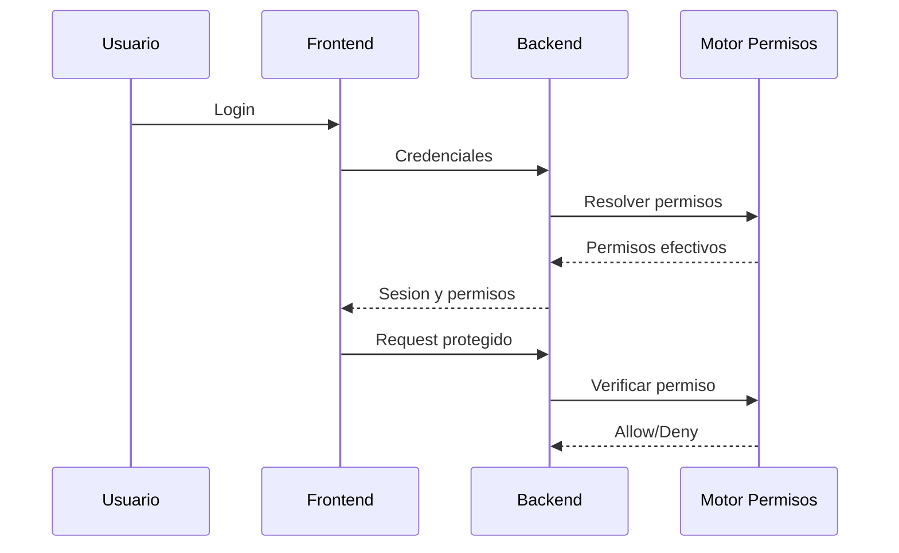

# Seguridad, Identidad y Permisos

## Objetivo
Explicar como entra un usuario, que puede ver y como se controla el acceso por empresa y aplicacion.

## Flujo de acceso
1. Usuario inicia sesion.
2. Sistema valida identidad.
3. Sistema calcula permisos por app y empresa.
4. Frontend muestra solo opciones permitidas.
5. Backend vuelve a validar cada solicitud.

## Reglas clave
- Denegar siempre gana sobre permitir (DENY > ALLOW).
- Sin permiso, no hay acceso aunque exista ruta visible.
- Cambio de empresa obliga recalculo de permisos.

## Que pasa si...
- No tiene empresa asignada: no puede operar modulos por empresa.
- Le quitan un permiso: pierde acceso despues de refresco de sesion/permisos.
- Token invalido o vencido: sesion cerrada y reingreso.
