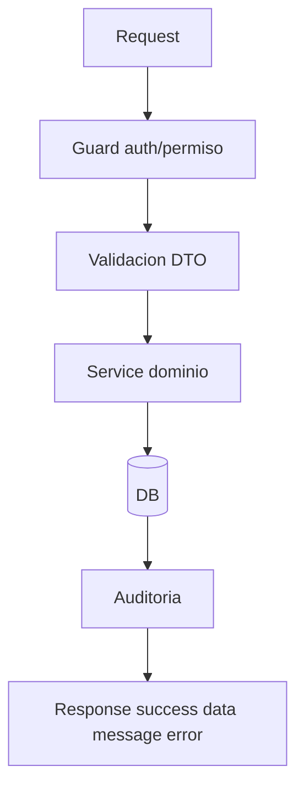
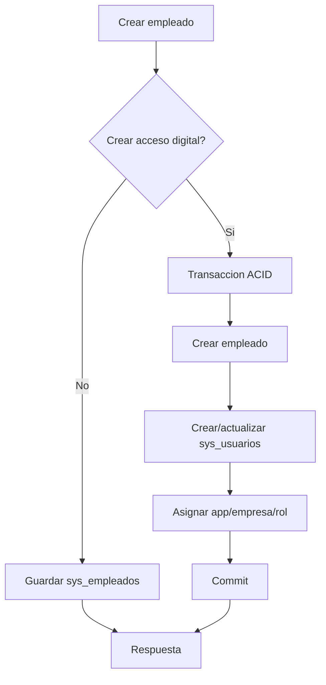

# Backend API DB Consolidado

Estado: vigente

Fuentes origen: 13, 16, 19, 20, 23, 27, 30, 33 + pendientes tecnicos

## Flujo API estandar


## Flujo de creacion empleado con acceso



## Fuentes Integradas (Preservacion Completa)

Regla de consolidacion aplicada:
- Cada fuente original asignada a este maestro se preserva completa debajo de su encabezado.
- Esto garantiza trazabilidad y evita perdida de informacion durante la limpieza.

### Fuente: docs/13-ModeladoSysEmpresas.md

```markdown
# KPITAL 360  Modelado Tabla sys_empresas

**Documento:** 13  
**Para:** Ingeniero Backend + DBA  
**De:** Roberto  Arquitecto Funcional / Senior Engineer  
**Prerrequisito:** Haber ledo [01-EnfoqueSistema.md](./01-EnfoqueSistema.md) + [11-DirectivasConfiguracionBackend.md](./11-DirectivasConfiguracionBackend.md)  
**Prioridad:** Primera tabla del sistema. Root aggregate.

---

## Principio

La empresa es el **root aggregate** del sistema.  
Sin empresa no existen: usuarios operativos, planillas, acciones de personal, roles scopeados, permisos por empresa.

- No se puede borrar fsicamente
- No se puede romper integridad
- No se puede perder trazabilidad
- **Solo se puede inactivar**

---

## Estructura Definitiva  sys_empresas

### PK

- `id_empresa`  INT, auto incremental, primary key

### Campos de negocio

| Campo | Tipo | Restriccin |
|-------|------|-------------|
| `nombre_empresa` | VARCHAR(200) | NOT NULL |
| `nombre_legal_empresa` | VARCHAR(300) | NOT NULL |
| `cedula_empresa` | VARCHAR(50) | UNIQUE, NOT NULL |
| `actividad_economica_empresa` | VARCHAR(300) | NULL |
| `prefijo_empresa` | VARCHAR(10) | UNIQUE, NOT NULL |
| `id_externo_empresa` | VARCHAR(100) | UNIQUE, NULL (referencia NetSuite) |
| `direccion_exacta_empresa` | TEXT | NULL |
| `telefono_empresa` | VARCHAR(30) | NULL |
| `email_empresa` | VARCHAR(150) | NULL |
| `codigo_postal_empresa` | VARCHAR(20) | NULL |

### Estado Enterprise

| Campo | Tipo | Valor |
|-------|------|-------|
| `estado_empresa` | TINYINT(1) | 1 = Activa, 0 = Inactiva |

### Auditora obligatoria (Fase 1)

| Campo | Tipo | Restriccin |
|-------|------|-------------|
| `fecha_creacion_empresa` | DATETIME | NOT NULL, DEFAULT NOW() |
| `fecha_modificacion_empresa` | DATETIME | NOT NULL, ON UPDATE NOW() |
| `fecha_inactivacion_empresa` | DATETIME | NULL |
| `creado_por_empresa` | INT | NOT NULL (userId) |
| `modificado_por_empresa` | INT | NOT NULL (userId) |

---

## Reglas Enterprise

- **NO** existe DELETE fsico
- **NO** existe CASCADE DELETE
- **NO** existe "hard delete"
- **S** inactivacin lgica solamente
- **S** integridad referencial siempre activa
- **S** ndices en: `cedula_empresa`, `prefijo_empresa`, `id_externo_empresa`, `estado_empresa`

---

## Comportamiento de Negocio

**Inactivar empresa:**
- `estado_empresa = 0`
- `fecha_inactivacion_empresa = NOW()`
- `modificado_por_empresa = userId`

**Reactivar empresa:**
- `estado_empresa = 1`
- `fecha_inactivacion_empresa = NULL`

---

## Justificacin Arquitectnica

Esto permite:
- Mantener histrico de planillas pasadas
- Mantener histrico de empleados
- Mantener histrico contable
- No romper relaciones
- Evitar corrupcin de datos

NetSuite, SAP, Oracle  todos funcionan as. Nadie borra empresas.

---

## Implementacion Actual (Enterprise)

### Backend en uso

- Servicio: `api/src/modules/companies/companies.service.ts`
- Controlador: `api/src/modules/companies/companies.controller.ts`
- Entidad: `api/src/modules/companies/entities/company.entity.ts`

Reglas activas:
- No existe delete fisico para empresas.
- Inactivacion y reactivacion son cambios de estado logico.
- Validaciones de unicidad para `cedula_empresa` y `prefijo_empresa`.

### Permisos de Empresas

Permisos granulares activos en diseno:
- `company:view`
- `company:create`
- `company:edit`
- `company:inactivate`
- `company:reactivate`

Compatibilidad:
- `company:manage` se mantiene como permiso legacy que cubre `company:*`.

### UI de Configuracion de Empresas

Pantalla: `frontend/src/pages/private/configuration/CompaniesManagementPage.tsx`

Capacidades implementadas:
- Listar empresas (activas o inactivas; no ambas a la vez para optimizar carga).
- Buscar por nombre, cedula o prefijo.
- Crear empresa.
- Editar empresa.
- Inactivar/reactivar empresa mediante un **Switch unificado** en el header del modal (no botones separados).

Reglas de carga y filtrado:
- **Toggle "Mostrar inactivas"**: Si OFF, el API trae solo activas (`GET /companies`). Si ON, trae solo inactivas (`GET /companies?inactiveOnly=true`). Nunca carga ambas a la vez.
- **Permisos**: Al entrar a la pagina Empresas, se cargan permisos **agregados** (todas las empresas) para habilitar Inactivar/Reactivar aunque el usuario tenga empresa distinta seleccionada.

Validacion de permisos en formulario:
- Crear, editar, inactivar y reactivar validan permiso antes de ejecutar. Botones y Switch deshabilitados si falta permiso.

Regla de actualizacion de tabla (obligatorio):
- Tras **cualquier accion** que modifique datos (crear, editar, inactivar, reactivar), la tabla debe **refrescar** para mostrar el listado actualizado.
- Implementacion: llamar a `loadCompanies()` despues de cada mutacion exitosa.

Nota:
- El logo empresarial ya esta implementado sin agregar columna en `sys_empresas`.
- Se usa storage en filesystem con flujo temporal + commit:
  - Temporal: `uploads/logoEmpresa/temp`
  - Final: `uploads/logoEmpresa/{idEmpresa}.{ext}`
- Si no existe logo de la empresa, el API entrega imagen por defecto (`LogoSmall.png`).
- En edicion, si solo se actualizan campos de texto y no se adjunta nueva imagen, el logo actual se conserva.
- Validaciones activas de logo: solo tipo imagen, maximo 5MB.

### Endpoints de logo (implementados)

- `POST /api/companies/logo/temp` (subida temporal)
- `POST /api/companies/:id/logo/commit` (asignacion final por id de empresa)
- `GET /api/companies/:id/logo` (devuelve logo de empresa o default)

---

## Lo que NO se hace ahora

- No se crean relaciones an
- No se crea usuario an
- No se crea rol an
- No se crea planilla an
- **Primero se consolida el aggregate raz**

---

## Qu sigue despus de esta tabla

| Orden | Tabla | Propsito |
|-------|-------|-----------|
| 1 | `sys_empresas` | **Esta tabla**  root aggregate |
| 2 | `sys_usuarios` | Identidad nica de la plataforma |
| 3 | `sys_apps` | Catlogo de aplicaciones (KPITAL, TimeWise) |
| 4 | `sys_usuario_empresa` | Relacin M:M usuario  empresa |
| 5 | `sys_roles` | Roles por app + empresa |
| 6 | `sys_permisos` | Permisos granulares |
| 7 | `sys_usuario_rol` | Asignacin rol a usuario |
| 8 | `sys_rol_permiso` | Permisos por rol |

Ese es el **core identity schema**.

---

*Primer paso de modelado serio. Consolida el aggregate raz antes de cualquier otra tabla.*

---

## Reglas enterprise activas en Empresas (nuevo)

1. Visibilidad por asignacion de empresa:
- GET /api/companies lista solo empresas asignadas al usuario autenticado (sys_usuario_empresa activa).
- GET /api/companies/:id, PUT, PATCH inactivate/reactivate, GET logo, POST logo/commit validan acceso por asignacion; si no existe retorna 403.

2. Autoasignacion de MASTER al crear empresa:
- Al crear empresa, en transaccion se asigna automaticamente la nueva empresa a usuarios con rol MASTER activo.
- Esto evita excepciones de seguridad y mantiene el mismo modelo de control para todos los usuarios.

3. Bitacora de empresas:
- Crear, editar, inactivar, reactivar y commit de logo publican eventos de auditoria udit.*.

## Actualizacion 2026-02-24 - Bitacora de Empresa en Edicion

- Se agrego endpoint de consulta de bitacora por empresa:
  - `GET /api/companies/:id/audit-trail?limit=N`
  - Permiso requerido: `config:companies:audit`
- El endpoint valida acceso por empresa asignada antes de devolver historial.
- La respuesta incluye:
  - quien lo hizo (`actorNombre`, `actorEmail`, `actorUserId`)
  - cuando (`fechaCreacion`)
  - detalle (`descripcion`)
  - diff de campos (`cambios[]` con `campo`, `antes`, `despues`) cuando existe `payload_before/payload_after`.

Regla UI:
- La pestaa `Bitacora` aparece solo en modo edicion de empresa.
- La pestaa `Bitacora` se muestra solo si el usuario autenticado tiene `config:companies:audit`.
- El detalle completo de cambios se ve en hover (tooltip) para mantener tabla compacta.

```

### Fuente: docs/16-CreacionEmpleadoConAcceso.md

```markdown
# DIRECTIVA 16  Creacin de Empleado con Acceso a TimeWise (Enterprise)

## Objetivo

Cuando RRHH crea un empleado, el sistema puede crear tambin su identidad de login para TimeWise (y opcionalmente KPITAL), sin mezclar dominios y sin romper integridad.

---

## Principio de Diseo

- **Empleado** (`sys_empleados`) = entidad laboral (planilla/RRHH).
- **Usuario** (`sys_usuarios`) = identidad digital (login).
- Un empleado **puede o no** tener usuario.
- El acceso a TimeWise depende de: usuario + app habilitada + empresa asignada.

---

## Regla de Negocio

En el alta de empleado se define explcitamente:

| Flag | Efecto |
|------|--------|
| `crearAccesoTimewise = true` | Crea usuario + asigna app TIMEWISE + asigna empresa + **asigna rol** (Empleado, Supervisor o Supervisor Global) |
| `crearAccesoKpital = true` | Adems asigna app KPITAL + **asigna rol KPITAL** (requiere permiso `employee:assign-kpital-role` del creador) |
| Ambos `false` | Solo crea empleado, `id_usuario = NULL` |

**Asignacin de roles:** Ver [27-DiagramaFlujoEmpleadosYUsuarios.md](./27-DiagramaFlujoEmpleadosYUsuarios.md) para el flujo completo de seleccin de roles por app.

---

## Flujo Enterprise (ACID)

### Caso A  Empleado SIN acceso digital

1. Crear registro en `sys_empleados`
2. `sys_empleados.id_usuario = NULL`
3. No se crean roles/permisos/apps

**Empleado creado manualmente en la BD:** Si se inserta solo el registro en `sys_empleados` (por script o SQL directo), el **worker de identidad** detecta el empleado y **provisiona automticamente** el acceso **TimeWise** con rol `EMPLEADO_TIMEWISE`. Esto ocurre si:
- `estado_empleado = 1`
- `id_usuario IS NULL`
- `email`, `nombre`, `apellido1` existen
- App `timewise` y rol `EMPLEADO_TIMEWISE` estn activos

El worker crea `sys_usuarios`, `sys_usuario_app`, `sys_usuario_empresa`, `sys_usuario_rol` y luego vincula `sys_empleados.id_usuario`.  
No se asigna KPITAL por esta va. KPITAL solo se asigna en el flujo de creacin con acceso (Caso B) y con permiso explcito del creador.

### Caso B  Empleado CON acceso (transaccin nica)

Todo ocurre en **UNA transaccin** va `queryRunner`:

1. Crear `sys_usuarios` (email nico, estado ACTIVO, password hash con `requiresPasswordReset = 1`)
2. Crear `sys_empleados` enlazando `id_usuario`
3. Asignar app: insertar en `sys_usuario_app` (TIMEWISE y/o KPITAL)
4. Asignar empresa: insertar en `sys_usuario_empresa`
5. **Asignar roles:** insertar en `sys_usuario_rol` por cada app (id_usuario, id_rol, id_empresa, id_app). DTO incluye `idRolTimewise` y opcionalmente `idRolKpital` (si creador tiene permiso).
6. **COMMIT**

Si falla **cualquier paso**  **ROLLBACK total**. No puede existir empleado "a medias".

---

## Tabla sys_empleados

| Campo | Tipo | Restriccin |
|-------|------|-------------|
| `id_empleado` | INT | PK, auto-increment |
| `id_usuario` | INT | **FK nullable**  sys_usuarios |
| `id_empresa` | INT | FK NOT NULL  sys_empresas |
| `codigo_empleado` | VARCHAR(20) | UNIQUE por empresa |
| `nombre_empleado` | VARCHAR(100) | NOT NULL |
| `apellido1_empleado` | VARCHAR(100) | NOT NULL |
| `apellido2_empleado` | VARCHAR(100) | NULLABLE |
| `email_empleado` | VARCHAR(150) | NOT NULL |
| `telefono_empleado` | VARCHAR(30) | NULLABLE |
| `fecha_ingreso_empleado` | DATE | NOT NULL |
| `fecha_salida_empleado` | DATE | NULLABLE |
| `puesto_empleado` | VARCHAR(150) | NULLABLE |
| `departamento_empleado` | VARCHAR(150) | NULLABLE |
| `salario_base_empleado` | DECIMAL(12,2) | NULLABLE |
| `tipo_contrato_empleado` | VARCHAR(50) | NULLABLE |
| `estado_empleado` | TINYINT(1) | DEFAULT 1 (ACTIVO) |
| Auditora | fecha_creacion, fecha_modificacion, fecha_inactivacion, creado_por, modificado_por |

**ndices:** `id_usuario`, `id_empresa`, UNIQUE(`id_empresa`, `codigo_empleado`), `email_empleado`, `estado_empleado`

**FK:** `FK_empleado_usuario`  sys_usuarios (RESTRICT), `FK_empleado_empresa`  sys_empresas (RESTRICT)

---

## Reglas de Seguridad

- Si `sys_usuarios.estado_usuario != ACTIVO`  no login en ningn sistema
- Si `sys_usuario_app(TIMEWISE)` inactivo  no login en TimeWise aunque el usuario exista
- Acceso a KPITAL es permiso especial, no automtico por ser empleado

---

## Poltica de Sincronizacin de Identidad

**Regla oficial:** `email_empleado` es fuente de verdad del login.

Si cambia el email del empleado y tiene usuario vinculado:

1. `EmployeesService.update()` detecta cambio de email + `idUsuario != null`
2. Emite evento `employee.email_changed`
3. `IdentitySyncWorkflow` escucha y:
   - Valida unicidad del nuevo email en `sys_usuarios`
   - Actualiza `sys_usuarios.email`
   - Registra auditora (before/after)
   - Emite `identity.login_updated`

---

## DTO  Campos de Acceso Digital (CreateEmployeeDto)

- `crearAccesoTimewise`, `crearAccesoKpital`, `passwordInicial`
- `idRolTimewise` (obligatorio si crearAccesoTimewise): rol Empleado, Supervisor o Supervisor Global
- `idRolKpital` (opcional si crearAccesoKpital): requiere que el creador tenga permiso `employee:assign-kpital-role`

Ver Doc 19 y Doc 27 para detalles.

---

## Implementacin

| Componente | Archivo |
| Entity | `employees/entities/employee.entity.ts` |
| DTOs | `employees/dto/create-employee.dto.ts`, `update-employee.dto.ts` |
| Service | `employees/employees.service.ts` |
| Controller | `employees/employees.controller.ts` |
| Workflow creacin | `workflows/employees/employee-creation.workflow.ts` |
| Workflow identity | `workflows/identity/identity-sync.workflow.ts` |
| Migracin | `1708531500000-CreateSysEmpleados.ts` |

---

## Endpoints

| Mtodo | Ruta | Descripcin |
|--------|------|-------------|
| POST | `/api/employees` | Crear (con o sin acceso digital) |
| GET | `/api/employees?idEmpresa=X` | Listar por empresa |
| GET | `/api/employees/:id` | Detalle |
| PUT | `/api/employees/:id` | Actualizar (dispara identity sync si email cambia) |
| PATCH | `/api/employees/:id/inactivate` | Inactivar |
| PATCH | `/api/employees/:id/liquidar` | Liquidar (estado=3, fecha salida) |
```

### Fuente: docs/19-RedefinicionEmpleadoEnterprise.md

```markdown
# DIRECTIVA 19  Redefinicin Enterprise de sys_empleados + Tablas Org/Nom

## Objetivo

Redefinir completamente el modelo de empleado para alinearlo con estndar enterprise:

- Separacin total de identidad (sys_usuarios) vs negocio (sys_empleados).
- Campos estandarizados con sufijo `_empleado`.
- Relaciones organizacionales normalizadas (FK a catlogos).
- Creacin de tablas `org_departamentos`, `org_puestos`, `nom_periodos_pago`.
- `id_usuario` gestionado por workflow, NO por DTO.

---

- UI: se elimin? la secci?n "Planillas en las que entrar?a" en el modal de vacaciones. La asignaci?n es interna.


- Solape de planillas: si una fecha coincide con m?ltiples planillas ABIERTAS/EN_PROCESO, **no se bloquea** la selecci?n. Se asigna autom?ticamente por prioridad: estado ABIERTA > EN_PROCESO; si empatan, menor fecha de inicio; si empatan, menor ID.
- Se muestra advertencia en UI cuando hay fechas solapadas.

## 1) Decisin de Dominio (NO negociable)

| Regla | Descripcin |
|-------|-------------|
| **1 empresa a la vez** | Empleado pertenece a 1 sola empresa. Multiempresa simultnea aplica a sys_usuarios, no a sys_empleados |
| **Email = login** | `email_empleado` es fuente de verdad del login cuando el empleado tiene acceso |
| **FK opcional** | `id_usuario` es nullable. Un empleado puede existir sin usuario digital |
| **Separacin estricta** | sys_usuarios  sys_empleados. Se vinculan por FK, nunca se fusionan |

---

## 2) Modelo Definitivo  sys_empleados

Columnas ordenadas de ms importante a menos importante:

### Identidad

| Columna | Tipo | Restriccin |
|---------|------|-------------|
| `id_empleado` | INT AI | PK |
| `id_empresa` | INT | FK  sys_empresas (NOT NULL) |
| `codigo_empleado` | VARCHAR(45) | UNIQUE por empresa (id_empresa + codigo_empleado) |
| `cedula_empleado` | VARCHAR(30) | UNIQUE global |
| `nombre_empleado` | VARCHAR(100) | NOT NULL |
| `apellido1_empleado` | VARCHAR(100) | NOT NULL |
| `apellido2_empleado` | VARCHAR(100) | Nullable |

### Datos Personales

| Columna | Tipo | Restriccin |
|---------|------|-------------|
| `genero_empleado` | ENUM('Masculino','Femenino','Otro') | Nullable |
| `estado_civil_empleado` | ENUM('Soltero','Casado','Divorciado','Viudo','Unin Libre') | Nullable |
| `cantidad_hijos_empleado` | INT | Default 0 |
| `telefono_empleado` | VARCHAR(30) | Nullable |
| `direccion_empleado` | TEXT | Nullable |

### Contacto / Login

| Columna | Tipo | Restriccin |
|---------|------|-------------|
| `email_empleado` | VARCHAR(150) | UNIQUE global. Source of truth para login |

### Relaciones Organizacionales

| Columna | Tipo | Restriccin |
|---------|------|-------------|
| `id_departamento` | INT | FK  org_departamentos (nullable) |
| `id_puesto` | INT | FK  org_puestos (nullable) |
| `id_supervisor_empleado` | INT | FK  sys_empleados (self-reference, nullable). **Cross-empresa permitido:** el supervisor puede ser empleado de otra empresa (ej: holdings, cuando el supervisor original renunci). Ver Doc 27. |

### Contrato / Pago

| Columna | Tipo | Restriccin |
|---------|------|-------------|
| `fecha_ingreso_empleado` | DATE | NOT NULL |
| `fecha_salida_empleado` | DATE | Nullable |
| `motivo_salida_empleado` | TEXT | Nullable |
| `tipo_contrato_empleado` | ENUM('Indefinido','Plazo Fijo','Por Servicios Profesionales') | Nullable |
| `jornada_empleado` | ENUM('Tiempo Completo','Medio Tiempo','Por Horas') | Nullable |
| `id_periodos_pago` | INT | FK  nom_periodos_pago (nullable) |
| `salario_base_empleado` | DECIMAL(12,2) | Nullable |
| `moneda_salario_empleado` | ENUM('CRC','USD') | Default 'CRC' |
| `numero_ccss_empleado` | VARCHAR(30) | Nullable |
| `cuenta_banco_empleado` | VARCHAR(50) | Nullable |

### Acumulados HR

| Columna | Tipo | Restriccin |
|---------|------|-------------|
| `vacaciones_acumuladas_empleado` | VARCHAR(200) | Nullable |
| `cesantia_acumulada_empleado` | VARCHAR(200) | Nullable |

### Vnculo Identidad (NO en DTO)

| Columna | Tipo | Restriccin |
|---------|------|-------------|
| `id_usuario` | INT | FK  sys_usuarios (nullable). Gestionado por EmployeeCreationWorkflow |

### Estado + Auditora

| Columna | Tipo | Restriccin |
|---------|------|-------------|
| `estado_empleado` | TINYINT(1) | 1=Activo, 0=Inactivo. NO delete fsico |
| `fecha_creacion_empleado` | DATETIME | Auto |
| `fecha_modificacion_empleado` | DATETIME | Auto onUpdate |
| `creado_por_empleado` | INT | Nullable |
| `modificado_por_empleado` | INT | Nullable |

---

## 3) ndices y Constraints

| Nombre | Tipo | Columnas |
|--------|------|----------|
| `UQ_empleado_codigo_empresa` | UNIQUE | (id_empresa, codigo_empleado) |
| `IDX_empleado_cedula` | UNIQUE | cedula_empleado |
| `IDX_empleado_email` | UNIQUE | email_empleado |
| `IDX_empleado_empresa` | INDEX | id_empresa |
| `IDX_empleado_usuario` | INDEX | id_usuario |
| `IDX_empleado_departamento` | INDEX | id_departamento |
| `IDX_empleado_puesto` | INDEX | id_puesto |
| `IDX_empleado_supervisor` | INDEX | id_supervisor_empleado |
| `IDX_empleado_periodo_pago` | INDEX | id_periodos_pago |
| `IDX_empleado_estado` | INDEX | estado_empleado |

### Foreign Keys

| FK | Origen | Destino | ON DELETE |
|----|--------|---------|-----------|
| `FK_empleado_empresa` | id_empresa | sys_empresas.id_empresa | RESTRICT |
| `FK_empleado_usuario` | id_usuario | sys_usuarios.id_usuario | RESTRICT |
| `FK_empleado_departamento` | id_departamento | org_departamentos.id_departamento | RESTRICT |
| `FK_empleado_puesto` | id_puesto | org_puestos.id_puesto | RESTRICT |
| `FK_empleado_supervisor` | id_supervisor_empleado | sys_empleados.id_empleado | RESTRICT |
| `FK_empleado_periodo_pago` | id_periodos_pago | nom_periodos_pago.id_periodos_pago | RESTRICT |

---

## 4) Tablas de Catlogo Creadas

### org_departamentos

| Columna | Tipo | Descripcin |
|---------|------|-------------|
| `id_departamento` | INT PK AI | |
| `nombre_departamento` | VARCHAR(100) | |
| `id_externo_departamento` | VARCHAR(45) | Referencia NetSuite / sistemas externos |
| `estado_departamento` | TINYINT(1) | 1=Activo, 0=Inactivo |
| `fecha_creacion_departamento` | DATETIME | Auto |
| `fecha_modificacion_departamento` | DATETIME | Auto onUpdate |
| `creado_por_departamento` | INT | Nullable |
| `modificado_por_departamento` | INT | Nullable |

### org_puestos

| Columna | Tipo | Descripcin |
|---------|------|-------------|
| `id_puesto` | INT PK AI | |
| `nombre_puesto` | VARCHAR(100) | |
| `descripcion_puesto` | TEXT | Nullable |
| `estado_puesto` | TINYINT(1) | 1=Activo, 0=Inactivo |
| `fecha_creacion_puesto` | DATETIME | Auto |
| `fecha_modificacion_puesto` | DATETIME | Auto onUpdate |

### nom_periodos_pago

| Columna | Tipo | Descripcin |
|---------|------|-------------|
| `id_periodos_pago` | INT PK AI | |
| `nombre_periodo_pago` | VARCHAR(50) | Semanal, Quincenal, Mensual |
| `dias_periodo_pago` | INT | 7, 15, 30 |
| `es_inactivo` | TINYINT(1) | 1=Activo, 0=Inactivo |
| `fecha_creacion_periodo_pago` | DATETIME | Auto |
| `fecha_modificacion_periodo_pago` | DATETIME | Auto onUpdate |

**Seed incluido:** Semanal (7), Quincenal (15), Mensual (30).

---

## 5) Regla Multi-moneda

- Por ahora: 1 moneda base por empleado (`moneda_salario_empleado`).
- Si un empleado necesita clculos en distintas monedas, eso se modela en tabla hija `nom_empleado_salarios` (futuro, cuando se implemente Payroll Engine).
- Decisin postergada: no mezclar en sys_empleados.

---

## 6) DTO  Lo que cambi

### CreateEmployeeDto

- **NO incluye** `idUsuario` (gestionado por workflow).
- **Incluye flags**: `crearAccesoTimewise`, `crearAccesoKpital`, `passwordInicial`.
- **Incluye roles** (cuando hay acceso): `idRolTimewise` (si crearAccesoTimewise), `idRolKpital` (si crearAccesoKpital y creador tiene permiso `employee:assign-kpital-role`).
- **idSupervisor:** dropdown filtrado a empleados con rol Supervisor o Supervisor Global en TimeWise (ver Doc 27). Cross-empresa permitido.
- Todos los campos enterprise alineados al modelo de tabla.
- Enums tipados: `GeneroEmpleado`, `EstadoCivilEmpleado`, `TipoContratoEmpleado`, `JornadaEmpleado`, `MonedaSalarioEmpleado`.

### UpdateEmployeeDto

- **NO incluye** `idUsuario`, `idEmpresa`, `codigo` (inmutables post-creacin).
- Todos los campos opcionales.

---

## 7) Eventos / Workflows

| Evento | Cundo | Workflow |
|--------|--------|----------|
| `employee.created` | Al crear empleado | EmployeeCreationWorkflow (si hay acceso digital) |
| `employee.email_changed` | Al actualizar email de empleado con usuario vinculado | IdentitySyncWorkflow |

---

## 8) Archivos Implementados

| Archivo | Descripcin |
|---------|-------------|
| `api/src/modules/employees/entities/employee.entity.ts` | Entidad redefinida con modelo enterprise completo |
| `api/src/modules/employees/entities/department.entity.ts` | Entidad org_departamentos |
| `api/src/modules/employees/entities/position.entity.ts` | Entidad org_puestos |
| `api/src/modules/employees/entities/index.ts` | Barrel exports |
| `api/src/modules/payroll/entities/pay-period.entity.ts` | Entidad nom_periodos_pago |
| `api/src/modules/employees/dto/create-employee.dto.ts` | DTO enterprise sin idUsuario |
| `api/src/modules/employees/dto/update-employee.dto.ts` | DTO update enterprise |
| `api/src/modules/employees/employees.service.ts` | Service con validaciones enterprise |
| `api/src/modules/employees/employees.controller.ts` | Controller CRUD + inactivar + liquidar |
| `api/src/modules/employees/employees.module.ts` | Module con Department, Position |
| `api/src/modules/payroll/payroll.module.ts` | Module con PayPeriod |
| `api/src/workflows/employees/employee-creation.workflow.ts` | Workflow actualizado al nuevo modelo |
| `api/src/database/migrations/1708531700000-RedefineEmpleadoEnterprise.ts` | Migracin: drop + recreate + tablas org/nom + seed |

---

## 9) Migracin Ejecutada

- **Nombre:** `RedefineEmpleadoEnterprise1708531700000`
- **Estado:** Ejecutada en RDS 
- **Acciones:**
  1. Cre `org_departamentos` con ndices
  2. Cre `org_puestos` con ndices
  3. Cre `nom_periodos_pago` con seed (Semanal, Quincenal, Mensual)
  4. Drop `sys_empleados` vieja
  5. Recre `sys_empleados` con 33 columnas enterprise
  6. 10 ndices + 6 foreign keys

---
## Actualizaci?n 2026-03-02 ? Vacaciones sin selecci?n de planilla (ACTUALIZACION-VACACIONES-2026-03-02
UI-PLANILLAS-REMOVIDA-2026-03-02
SOLAPE-PLANILLAS-2026-03-02)
- KPITAL (RRHH): el usuario ya no selecciona planilla en Vacaciones. Selecciona fechas y movimiento; el sistema determina la planilla elegible por cada fecha con base en calendario de n?mina (empresa/empleado/moneda/periodo).
- Validaciones: fines de semana y feriados bloqueados; fechas ya reservadas bloqueadas; saldo disponible; fechas deben pertenecer a un periodo elegible; si una fecha coincide con m?ltiples periodos, se rechaza.
- Consistencia de tipo: todas las fechas deben pertenecer al mismo tipo de planilla. Si no, error.
- Split autom?tico en creaci?n: si las fechas caen en m?s de un periodo del mismo tipo, se crean acciones separadas por periodo. En edici?n, solo se permite un periodo.
- Persistencia: `acc_vacaciones_fechas` y `acc_cuotas_accion` guardan `id_calendario_nomina` por fecha; el header de acci?n puede quedar con `id_calendario_nomina = NULL`.
- TimeWise: acciones de vacaciones se crean en estado Borrador sin planilla. RRHH completa fechas/movimiento en KPITAL; el sistema asigna planilla por fecha.
- Planilla: al cargar una planilla se consumen las fechas cuyo `id_calendario_nomina` coincide con la planilla y estado aprobado. No se requiere que el header tenga planilla.
---
```

### Fuente: docs/20-MVPContratosEndpoints.md

```markdown
# DIRECTIVA 20  Contratos del MVP (Fase 1)

## Objetivo

Definir el contrato oficial de endpoints mnimos para Fase 1 y el formato exacto del permission contract (`module:action`), para que frontend y backend estn alineados sin ambigedad.

---

## 1. Lista Oficial de Endpoints MVP

### Auth (ya implementados)

| Mtodo | Ruta | Descripcin | Auth |
|--------|------|-------------|------|
| POST | `/api/auth/login` | Login (email + password). Devuelve user + companies. Cookie httpOnly. | No |
| GET | `/api/auth/me` | Sesin actual. user, enabledApps, companies, permissions (si companyId+appCode). | Cookie |
| POST | `/api/auth/switch-company` | Cambiar contexto. Body: `{ companyId, appCode }`. Devuelve permissions + roles. | Cookie |
| POST | `/api/auth/logout` | Limpiar cookie. | Cookie |
| GET | `/api/auth/permissions-stream` | SSE por usuario autenticado. Emite `permissions.changed` cuando cambia authz. | Cookie |
| GET | `/api/auth/authz-token` | Token liviano de version de autorizacion para polling de respaldo. | Cookie |

### Companies

| Mtodo | Ruta | Descripcin | Auth | Permiso |
|--------|------|-------------|------|---------|
| GET | `/api/companies` | Listar empresas (activas por defecto). Query: `?includeInactive=true` opcional. | Cookie | company:manage |
| GET | `/api/companies/:id` | Detalle de una empresa. | Cookie | company:manage |
| POST | `/api/companies` | Crear empresa. | Cookie | company:manage |
| PUT | `/api/companies/:id` | Actualizar empresa. | Cookie | company:manage |
| PATCH | `/api/companies/:id/inactivate` | Inactivar empresa. | Cookie | company:manage |
| PATCH | `/api/companies/:id/reactivate` | Reactivar empresa. | Cookie | company:manage |

### Employees (ya implementados)

| Mtodo | Ruta | Descripcin | Auth | Permiso |
|--------|------|-------------|------|---------|
| GET | `/api/employees?idEmpresa=N` | Listar empleados de empresa. Query: `?includeInactive=true` opcional. | Cookie | employee:view |
| GET | `/api/employees/:id` | Detalle empleado. | Cookie | employee:view |
| POST | `/api/employees` | Crear empleado (body: CreateEmployeeDto). | Cookie | employee:create |
| PUT | `/api/employees/:id` | Actualizar empleado. | Cookie | employee:edit |
| PATCH | `/api/employees/:id/inactivate` | Inactivar empleado. | Cookie | employee:edit |
| PATCH | `/api/employees/:id/liquidar` | Liquidar empleado. | Cookie | employee:edit |

### Catalogs (ya implementados)

| Metodo | Ruta | Descripcion | Auth | Permiso |
|--------|------|-------------|------|---------|
| GET | `/api/catalogs/departments` | Catalogo global de departamentos activos. | Cookie | employee:view |
| GET | `/api/catalogs/positions` | Catalogo global de puestos activos. | Cookie | employee:view |
| GET | `/api/catalogs/pay-periods` | Catalogo global de periodos de pago activos. | Cookie | employee:view |

### Config Access (RBAC enterprise)

| Metodo | Ruta | Descripcion | Auth | Permiso |
|--------|------|-------------|------|---------|
| GET | `/api/config/permissions` | Lista catalogo de permisos (`module:action`). Query: `modulo`, `includeInactive`. | Cookie | config:permissions |
| GET | `/api/config/roles` | Lista roles del sistema. Query: `includeInactive`. | Cookie | config:roles |
| POST | `/api/config/roles` | Crear rol. | Cookie | config:roles |
| PATCH | `/api/config/roles/:id` | Editar metadata de rol (nombre/descripcion). | Cookie | config:roles |
| PUT | `/api/config/roles/:id/permissions` | Reemplazo total de permisos del rol por codigos. Body: `{ permissions: string[] }`. | Cookie | config:roles |
| PUT | `/api/config/users/:id/roles` | Reemplazo total de roles de usuario por contexto. Body: `{ companyId, appCode, roleIds[] }`. | Cookie | config:roles |
| PUT | `/api/config/users/:id/permissions` | Reemplazo total de overrides por usuario/contexto. Body: `{ companyId, appCode, allow[], deny[] }`. | Cookie | config:permissions |
| GET | `/api/config/users/:id/permissions` | Consulta overrides activos del usuario por contexto. Query: `companyId`, `appCode`. | Cookie | config:permissions |

### Payroll (esqueleto MVP)

| Mtodo | Ruta | Descripcin | Auth | Permiso |
|--------|------|-------------|------|---------|
| GET | `/api/payroll?idEmpresa=N` | Listar planillas de empresa. | Cookie | payroll:view |
| GET | `/api/payroll/:id` | Detalle planilla. | Cookie | payroll:view |
| POST | `/api/payroll` | Abrir planilla (calendario nmina). Body: idEmpresa, idPeriodoPago, periodoInicio, periodoFin, fechaInicioPago, fechaFinPago, [tipoPlanilla], [moneda]. | Cookie | payroll:create |
| PATCH | `/api/payroll/:id/reopen` | Reabrir planilla Verificada  Abierta. Body: `{ motivo }`. | Cookie | payroll:edit |
| PATCH | `/api/payroll/:id/verify` | Verificar planilla (Abierta  Verificada). | Cookie | payroll:verify |
| PATCH | `/api/payroll/:id/apply` | Aplicar planilla (Verificada  Aplicada, inmutabilidad). | Cookie | payroll:apply |
| PATCH | `/api/payroll/:id/inactivate` | Inactivar planilla. | Cookie | payroll:cancel |

### Payroll Movements (Parametros de Planilla)

| Mtodo | Ruta | Descripcin | Auth | Permiso |
|--------|------|-------------|------|---------|
| GET | `/api/payroll-movements?idEmpresa=N&idEmpresas=1,2` | Listar movimientos de nomina (filtro empresa / multiempresa). | Cookie | payroll-movement:view |
| GET | `/api/payroll-movements/:id` | Detalle de movimiento de nomina. | Cookie | payroll-movement:view |
| POST | `/api/payroll-movements` | Crear movimiento de nomina. | Cookie | payroll-movement:create |
| PUT | `/api/payroll-movements/:id` | Editar movimiento de nomina. | Cookie | payroll-movement:edit |
| PATCH | `/api/payroll-movements/:id/inactivate` | Inactivar movimiento de nomina. | Cookie | payroll-movement:inactivate |
| PATCH | `/api/payroll-movements/:id/reactivate` | Reactivar movimiento de nomina. | Cookie | payroll-movement:reactivate |
| GET | `/api/payroll-movements/:id/audit-trail` | Bitacora del movimiento. | Cookie | config:payroll-movements:audit |
| GET | `/api/payroll-movements/articles?idEmpresa=N` | Articulos de nomina por empresa para formulario. | Cookie | payroll-movement:view |
| GET | `/api/payroll-movements/personal-action-types` | Catalogo tipos de accion personal. | Cookie | payroll-movement:view |
| GET | `/api/payroll-movements/classes` | Catalogo de clases. | Cookie | payroll-movement:view |
| GET | `/api/payroll-movements/projects?idEmpresa=N` | Catalogo de proyectos por empresa. | Cookie | payroll-movement:view |

### Payroll Holidays (Listado de Feriados)

| Mtodo | Ruta | Descripcin | Auth | Permiso |
|--------|------|-------------|------|---------|
| GET | `/api/payroll-holidays` | Listar feriados de planilla. | Cookie | payroll-holiday:view |
| GET | `/api/payroll-holidays/:id` | Detalle de feriado. | Cookie | payroll-holiday:view |
| POST | `/api/payroll-holidays` | Crear feriado. | Cookie | payroll-holiday:create |
| PATCH | `/api/payroll-holidays/:id` | Editar feriado. | Cookie | payroll-holiday:edit |
| DELETE | `/api/payroll-holidays/:id` | Eliminar feriado. | Cookie | payroll-holiday:delete |

### Personal Actions (esqueleto MVP)

| Mtodo | Ruta | Descripcin | Auth | Permiso |
|--------|------|-------------|------|---------|
| GET | `/api/personal-actions?idEmpresa=N` | Listar acciones de personal. | Cookie | personal-action:view |
| GET | `/api/personal-actions/:id` | Detalle accin. | Cookie | personal-action:view |
| POST | `/api/personal-actions` | Crear accin (pendiente). | Cookie | personal-action:create |
| PATCH | `/api/personal-actions/:id/approve` | Aprobar accin. Emite `personal-action.approved`. | Cookie | personal-action:approve |
| PATCH | `/api/personal-actions/:id/reject` | Rechazar accin. Body: `{ motivo }`. | Cookie | personal-action:approve |
| PATCH | `/api/personal-actions/:id/associate-to-payroll` | Asociar accin aprobada a planilla. Body: `{ idPlanilla }`. | Cookie | personal-action:view |

---

## 2. Permission Contract  Formato Exacto

### Estructura: `module:action`

- **Formato:** `{module}:{action}`
- **Separador:** dos puntos (`:`)
- **Case:** minsculas, sin espacios.

### Catlogo Oficial (sys_permisos)

| Cdigo | Mdulo | Accin | Descripcin |
|--------|--------|--------|-------------|
| `payroll:view` | payroll | view | Ver planillas |
| `payroll:create` | payroll | create | Crear/abrir planilla |
| `payroll:edit` | payroll | edit | Editar planilla (solo si Abierta) |
| `payroll:verify` | payroll | verify | Verificar planilla |
| `payroll:apply` | payroll | apply | Aplicar planilla (inmutabilidad) |
| `payroll:cancel` | payroll | cancel | Cancelar/inactivar planilla |
| `payroll-movement:view` | payroll-movement | view | Ver movimientos de nomina |
| `payroll-movement:create` | payroll-movement | create | Crear movimientos de nomina |
| `payroll-movement:edit` | payroll-movement | edit | Editar movimientos de nomina |
| `payroll-movement:inactivate` | payroll-movement | inactivate | Inactivar movimientos de nomina |
| `payroll-movement:reactivate` | payroll-movement | reactivate | Reactivar movimientos de nomina |
| `payroll-holiday:view` | payroll-holiday | view | Ver/listar feriados de planilla |
| `payroll-holiday:create` | payroll-holiday | create | Crear feriados de planilla |
| `payroll-holiday:edit` | payroll-holiday | edit | Editar feriados de planilla |
| `payroll-holiday:delete` | payroll-holiday | delete | Eliminar feriados de planilla |
| `employee:view` | employee | view | Ver empleados |
| `employee:create` | employee | create | Crear empleado |
| `employee:edit` | employee | edit | Editar empleado |
| `personal-action:view` | personal-action | view | Ver acciones de personal |
| `personal-action:create` | personal-action | create | Crear accin |
| `personal-action:approve` | personal-action | approve | Aprobar/rechazar accin |
| `company:manage` | company | manage | Gestionar empresas |
| `report:view` | report | view | Ver reportes |
| `config:users` | config | users | Gestionar usuarios |
| `config:roles` | config | roles | Gestionar roles |
| `config:permissions` | config | permissions | Gestionar permisos |
| `config:payroll-movements:audit` | config | audit | Ver bitacora de movimientos de nomina |

### Agrupacin por Empresa

Los permisos se resuelven **por contexto (User + Company + App)**:

- `POST /auth/switch-company` con `{ companyId, appCode }` devuelve el array de cdigos efectivos para ese contexto.
- El frontend filtra men con `permissions.includes(requiredPermission)`.
- Si el usuario no tiene acceso a la empresa, no recibe permisos de esa empresa.

**Regla:** Un permiso existe solo en el contexto donde el usuario tiene rol que lo incluye, para la empresa activa y la app activa.

### Excepcion controlada (sin companyId)

Para endpoints marcados explicitamente en backend con `@AllowWithoutCompany()`, el `PermissionsGuard` permite validar solo autenticacion + permiso declarado sin exigir `companyId/idEmpresa` en query/body.

Caso vigente en Fase 1: `CatalogsController` (`/api/catalogs/departments`, `/positions`, `/pay-periods`).

### RBAC + Overrides por usuario (Fase 1.1)

Modelo de resolucion:

1. Base por roles del contexto (`user + company + app`).
2. Aplicar overrides directos de usuario del mismo contexto.
3. Precedencia final: `DENY` gana sobre `ALLOW`.

Regla de persistencia:

- Roles siguen siendo la fuente principal.
- Overrides son excepciones auditables (alta granularidad por usuario).

---

## 3. Base URL

- **Desarrollo:** `http://localhost:3000/api`
- **Produccin:** Variable `VITE_API_URL` (ej: `https://api.kpital360.com/api`)

Todas las rutas son relativas al prefijo `/api`.

---

## Actualizacion 2026-02-27 - Planilla v2 Compatible

- Este documento mantiene el contrato MVP vigente.
- La definicion oficial para evolucion enterprise compatible de planilla queda en:
  - `docs/40-BlueprintPlanillaV2Compatible.md`
- Para implementacion inmediata de permisos y operacion en `hr_pro`, se debe aplicar seed RBAC de:
  - `payroll:view`
  - `payroll:create`
  - `payroll:verify`
  - `payroll:apply`
  - `payroll:cancel`
- Permisos planificados para integracion NetSuite en Fase 4:
  - `payroll:send_netsuite`
  - `payroll:retry_netsuite`

### Avance implementado sin NetSuite (2026-02-27)

Endpoints agregados en modulo `payroll`:
- `PATCH /api/payroll/:id/process`
  - Transicion `Abierta -> En Proceso`.
  - Genera snapshots (`nomina_empleados_snapshot`, `nomina_inputs_snapshot`).
  - Liga acciones aprobadas al run.
  - Calcula resultados base por empleado (`nomina_resultados`).
- `GET /api/payroll/:id/snapshot-summary`
  - Retorna conteos y sumatorias de corrida.

Permisos usados:
- `payroll:process` para `process`.
- `payroll:view` para `snapshot-summary`.

Nota:
- Integracion NetSuite queda explicitamente fuera de este avance.

### Actualizacion operativa adicional (2026-02-27)

Endpoints de planilla activos en API:
- `GET /api/payroll?idEmpresa=N&includeInactive=bool&fechaDesde=YYYY-MM-DD&fechaHasta=YYYY-MM-DD`
- `GET /api/payroll/:id`
- `POST /api/payroll`
- `PATCH /api/payroll/:id` (editar)
- `PATCH /api/payroll/:id/process`
- `PATCH /api/payroll/:id/verify`
- `PATCH /api/payroll/:id/apply`
- `PATCH /api/payroll/:id/reopen`
- `PATCH /api/payroll/:id/inactivate`
- `GET /api/payroll/:id/snapshot-summary`
- `GET /api/payroll/:id/audit-trail`

Reglas adicionales documentadas:
- Filtro de fechas de listado por traslape de periodo (no solo por inicio o fin exacto).
- Bitacora de planilla con diffs de negocio (`payload_before/payload_after`) en `sys_auditoria_acciones`.
- `id_tipo_planilla` debe persistirse; frontend envia `idTipoPlanilla` y backend resuelve fallback por `tipoPlanilla`.
- `verify` responde `400` si la planilla no tiene snapshot de inputs/resultados (regla de negocio, no error tecnico).

Frontend (rutas operativas de planilla):
- `/payroll-params/calendario/dias-pago` (listado y operacion de planillas)
- `/payroll-params/calendario/ver` (calendario operativo mensual/timeline)

## Actualizacion 2026-03-08 - Payroll inactivate/reactivate

- Nuevo endpoint operativo: `PATCH /api/payroll/:id/reactivate`.
- Permiso requerido: `payroll:cancel`.
- Comportamiento esperado: reactivar planilla inactiva a estado Abierta y ejecutar reasociacion parcial de acciones elegibles.
- Listado de planillas soporta filtro multi-estado en query (`estado=1&estado=2...`) y rango por `fechaDesde/fechaHasta`.

```

### Fuente: docs/23-ModuloEmpleadosReferencia.md

```markdown
# DIRECTIVA 23  Mdulo Empleados: Referencia End-to-End

**Documento:** 23  
**Para:** Ingeniero Frontend + Backend  
**De:** Roberto  Arquitecto Funcional / Senior Engineer  
**Prerrequisito:** Haber ledo [19-RedefinicionEmpleadoEnterprise.md](./19-RedefinicionEmpleadoEnterprise.md) + [20-MVPContratosEndpoints.md](./20-MVPContratosEndpoints.md) + [18-IdentityCoreEnterprise.md](./18-IdentityCoreEnterprise.md) + [27-DiagramaFlujoEmpleadosYUsuarios.md](./27-DiagramaFlujoEmpleadosYUsuarios.md)  
**Prioridad:** Este es el paso ms importante del proyecto. Ejecutar en orden estricto.

---

- UI: se elimin? la secci?n "Planillas en las que entrar?a" en el modal de vacaciones. La asignaci?n es interna.


- Solape de planillas: si una fecha coincide con m?ltiples planillas ABIERTAS/EN_PROCESO, **no se bloquea** la selecci?n. Se asigna autom?ticamente por prioridad: estado ABIERTA > EN_PROCESO; si empatan, menor fecha de inicio; si empatan, menor ID.
- Se muestra advertencia en UI cuando hay fechas solapadas.

## Principio Fundamental

> **Este mdulo es el mdulo referencia.** Todo mdulo futuro (Planillas, Acciones de Personal, Configuracin) se construir siguiendo exactamente el mismo patrn que Empleados. Si Empleados queda bien, el ERP se acelera. Si queda mal, todo se arrastra.

Empleados es el primer mdulo que conecta **todo el stack end-to-end**:

- Frontend (pgina real con Ant Design)
-  TanStack Query (hooks reales)
-  HTTP con cookie httpOnly + CSRF
-  Backend (NestJS controller + service + entity)
-  Base de datos (sys_empleados con 33 columnas, FKs, ndices)
-  Guards (JwtAuthGuard + PermissionsGuard)
-  Permisos reales (`employee:view`, `employee:create`, `employee:edit`)
-  Workflows (EmployeeCreationWorkflow con acceso digital)
-  Eventos de dominio (`employee.created`)

Si este flujo funciona de punta a punta, la arquitectura de 22 documentos queda **validada en produccin**.

---

## Formato de Cdigo de Empleado  Regla Obligatoria

> **Al crear un empleado, el `codigo_empleado` se almacena con formato:** `KPid-{id_empleado}-{codigo}`

### Ejemplo

- Usuario ingresa cdigo: `EMP001`
- Backend inserta empleado  obtiene `id_empleado = 5`
- Se guarda en BD: `KPid-5-EMP001`

### Reglas

| Momento | Comportamiento |
|---------|----------------|
| **Formulario frontend** | Usuario ingresa solo el cdigo base (ej. `EMP001`, `CONT-2025`) |
| **POST /api/employees** | Body incluye `codigo: "EMP001"` |
| **Backend al guardar** | Concatena `KPid-{id}-{codigo}` tras el insert (id obtenido) |
| **Respuesta API** | Devuelve `codigo_empleado: "KPid-5-EMP001"` |
| **Edicin** | `codigo_empleado` es **inmutable** (doc 23: campo no editable tras creacin) |

El cdigo base sigue siendo nico por empresa. La validacin verifica que no exista otro empleado con el mismo cdigo base (ya sea en formato legacy o `KPid-*-{codigo}`).

**Nota:** La columna `codigo_empleado` tiene `varchar(45)`. El prefijo `KPid-{id}-` ocupa ~12 caracteres (id hasta 8 dgitos). Se recomienda que el cdigo base no supere ~30 caracteres para no exceder el lmite.

---

## Encriptacin de Datos Sensibles (PII)  Regla Obligatoria

> **Los datos sensibles del empleado deben estar encriptados en reposo.** Solo se desencriptan cuando el usuario tiene permiso `employee:view` y la informacin se enva al frontend para visualizacin.

### Alcance

| Dato | Encriptar en BD | Desencriptar al leer |
|------|-----------------|----------------------|
| `nombre_empleado` |  | Solo si `employee:view` |
| `apellido1_empleado`, `apellido2_empleado` |  | Solo si `employee:view` |
| `cedula_empleado` |  | Solo si `employee:view` |
| `email_empleado` |  (o ndice hash para bsqueda) | Solo si `employee:view` |
| `telefono_empleado` |  | Solo si `employee:view` |
| `direccion_empleado` |  | Solo si `employee:view` |
| `salario_base_empleado` |  | Solo si `employee:view` |
| `numero_ccss_empleado` |  | Solo si `employee:view` |
| `cuenta_banco_empleado` |  | Solo si `employee:view` |
| `motivo_salida_empleado` |  | Solo si `employee:view` |
| `codigo_empleado` | Opcional (no PII) |  |
| FKs, IDs, estados, fechas |  No encriptar |  |

### Flujo

1. **Al crear/actualizar:** Backend recibe datos en claro  encripta campos sensibles con AES-256 (clave desde `ENCRYPTION_KEY` env)  guarda en BD.
2. **Al leer:** Backend valida `@RequirePermissions('employee:view')`  si autorizado, lee de BD (datos encriptados)  desencripta en memoria  devuelve JSON en claro al frontend.
3. **Frontend:** Recibe datos ya desencriptados. No maneja claves ni desencriptacin. Solo visualiza.
4. **Sin permiso:** Si el usuario no tiene `employee:view`, el endpoint responde 403 antes de leer. Nunca se desencripta.

### Implementacin Backend

- Servicio `EncryptionService` con `encrypt(text)`, `decrypt(ciphertext)`.
- `EmployeesService`: antes de `save()`  encriptar campos sensibles; antes de `return`  desencriptar.
- Tabla puede usar `VARBINARY` o `TEXT` para almacenar ciphertext (o `VARCHAR` con B64).
- Para bsqueda por email/cdula: considerar ndice con hash (SHA-256) del valor para lookup sin desencriptar, o bsqueda por filtro en aplicacin (menos eficiente).

### Consideraciones

- Migracin de datos existentes: script para encriptar datos legacy.
- Backup/restore: los backups contienen datos encriptados. La clave debe estar segura.

---

## Qu Se Construye (Scope Exacto)

### Frontend  Vistas y Flujo

| Vista | Ruta | Permiso | Qu hace |
|-------|------|---------|----------|
| **Listado** | `/employees` | `employee:view` | Tabla con filtros, paginacin, bsqueda, estados. Botn "Nuevo Empleado" abre modal de creacin |
| **Crear** | (modal desde listado) | `employee:create` | Modal `EmployeeCreateModal` con formulario completo (con o sin acceso digital). **Selectores de rol por app** (TimeWise: Empleado/Supervisor/Supervisor Global; KPITAL: si creador tiene permiso). **Dropdown Supervisor** segn regla abajo (sin filtro por empresa). Ver Doc 27. No hay ruta `/employees/new` |
| **Detalle/Editar** | `/employees/:id` | `employee:view` / `employee:edit` | Ver y editar empleado existente |
| **Confirmaciones** | (modals) | `employee:edit` | Inactivar, liquidar con confirmacin y motivo |

**Men:** Empleados aparece en **Configuracin  Gestin Organizacional** (no en nivel superior).

### Regla: Lista de supervisores sin filtro por empresa (2026-02-24)

**Estipulacin:** El selector de Supervisor en crear/editar empleado **no** filtra por empresa.

- **Endpoint:** `GET /api/employees/supervisors` (sin query `idEmpresa`).
- **Criterio:** Se listan todos los empleados con rol **Supervisor TimeWise**, **Supervisor Global TimeWise** o **Master** en TimeWise, de **cualquier empresa** a la que el usuario tenga acceso.
- **Motivo:** Las subsidiarias pertenecen al mismo dueo; un supervisor de otra empresa puede asumir el rol temporalmente. Solo se muestran roles por encima de Empleado.
- **Seguridad:** Solo se incluyen empleados de empresas en `sys_usuario_empresa` del usuario; se respeta `employee:view-sensitive` por empresa del empleado para desencriptar nombre/apellidos.

### Extensin 2026-02-24 - Histrico Laboral en creacin

Se agrega en `EmployeeCreateModal` la pestaa `Histrico Laboral` con:

1. Acumulados monetarios (`vacacionesAcumuladas`, `cesantiaAcumulada`).
2. Tabla dinmica de `provisionesAguinaldo` por empresa.
3. Validaciones de fechas no futuras y consistencia inicio/fin.
4. Persistencia relacionada en tabla `sys_empleado_provision_aguinaldo`.

Documentacin especfica:

- `docs/30-HistorialLaboralEmpleado.md`

Estndar de moneda obligatorio para este flujo:

- `docs/29-EstandarFormatoMoneda.md`
- `docs/31-CifradoIdentidadYProvisionamiento.md`

Validacin de formularios (texto, email, anti-SQL):

- `docs/31-ValidacionFormulariosFrontend.md`

**Reglas de validacin aplicadas:** textRules, emailRules, optionalNoSqlInjection en campos de texto. Salario base: mayor a 0 (valor por defecto 0; al crear debe indicar error si es 0). Comportamiento de tabs y bitcora: ver seccin **UX  Modales de Empleado (Tabs y Bitcora)** ms abajo.

### Backend  Ya existe, verificar y ajustar

| Componente | Estado | Accin |
|-----------|--------|--------|
| Entity (`employee.entity.ts`) |  Completo (33 columnas) | Verificar que mapea 1:1 con BD |
| DTOs (`create-employee.dto.ts`, `update-employee.dto.ts`) |  Existe | Verificar validaciones completas |
| Service (`employees.service.ts`) |  Existe | Verificar: paginacin, filtros, includeInactive + encriptacin |
| Controller (`employees.controller.ts`) |  Existe | Verificar: @RequirePermissions en cada endpoint |
| Workflow (`employee-creation.workflow.ts`) |  Existe | Verificar: ACID funciona con BD real |
| Catlogos (departamentos, puestos, periodos pago) |  Tablas + seed | Verificar: endpoints de consulta disponibles |

---

## FASE A  Backend: Verificacin y Ajustes (Primero)

Antes de tocar el frontend, el backend debe estar devolviendo datos reales correctamente.

### A.1  Verificar Endpoints Existentes

Probar con Postman/Insomnia (o curl) cada endpoint. Todos requieren cookie de sesin.

| # | Test | Endpoint | Esperado |
|---|------|----------|----------|
| 1 | Login | `POST /api/auth/login` | Cookie + user data |
| 2 | Sesin | `GET /api/auth/me?companyId=1&appCode=kpital` | User + permissions + companies |
| 3 | Listar empleados | `GET /api/employees?idEmpresa=1` | Array (puede estar vaco) |
| 4 | Listar con inactivos | `GET /api/employees?idEmpresa=1&includeInactive=true` | Array incluyendo inactivos |
| 5 | Crear empleado (sin acceso) | `POST /api/employees` con body mnimo | 201 + empleado creado |
| 6 | Crear empleado (con acceso TW) | `POST /api/employees` con `crearAccesoTimewise=true` y `idRolTimewise` | 201 + empleado + usuario + app + rol asignados |
| 7 | Detalle | `GET /api/employees/:id` | Empleado con relaciones (departamento, puesto, periodo pago) |
| 8 | Actualizar | `PUT /api/employees/:id` | 200 + empleado actualizado |
| 9 | Inactivar | `PATCH /api/employees/:id/inactivate` | 200 + estado=0 |
| 10 | Liquidar | `PATCH /api/employees/:id/liquidar` | 200 + estado cambiado + fecha_salida |
| 11 | Sin permiso | Intentar crear sin `employee:create` | 403 Forbidden |

**Si algn test falla  arreglar antes de seguir al frontend.**

### A.1.1  Crear empleado con acceso a KPITAL (sin nombres)

Cuando `crearAccesoKpital=true` en `POST /api/employees`, el backend ejecuta el flujo transaccional completo:

1. **Usuario (`sys_usuarios`)**  
   - Se crea el usuario con `email` normalizado (lowercase + trim).  
   - `estado_usuario = 1` (activo).

2. **Acceso a app (`sys_usuario_app`)**  
   - Se asigna `id_app` correspondiente a `kpital`.

3. **Empresa de trabajo (`sys_usuario_empresa`)**  
   - Se asigna la empresa seleccionada en la creacin del empleado.

4. **Rol KPITAL (`sys_usuario_rol`)**  
   - Se asigna `idRolKpital` con `id_app=kpital` y `id_empresa` correspondiente.
   - Se asigna además el rol global en `sys_usuario_rol_global` para reflejarse en Gestión de Usuarios.

5. **Empleado (`sys_empleados`)**  
   - Se crea el empleado con `id_usuario` asociado y datos sensibles encriptados.

**Nota de visibilidad en Gestin de Usuarios:**  
La vista consulta `GET /api/users` con cache; al crear un empleado con acceso digital se invalida ese cache y el frontend dispara un refresh automtico, por lo que el usuario debe aparecer de inmediato.  
Esta visibilidad no depende del nombre del empleado, sino de la existencia en `sys_usuarios` y su asignacin a `kpital` + empresa.

### A.2  Endpoints de Catlogos (Necesarios para Formularios)

El formulario de crear/editar empleado necesita llenar selects con datos reales. Verificar o crear:

| Endpoint | Mtodo | Respuesta | Mdulo |
|----------|--------|-----------|--------|
| `/api/catalogs/departments` | GET | Array de departamentos activos (catalogo global) | employees o companies |
| `/api/catalogs/positions` | GET | Array de puestos activos | employees o companies |
| `/api/catalogs/pay-periods` | GET | Array de periodos de pago activos | payroll |
| `/api/catalogs/companies` | GET | Array de empresas del usuario | companies (ya existe) |

**Decisin:** Los catlogos pueden vivir en un controller dedicado (`CatalogsController`) o dentro del mdulo correspondiente. Lo importante es que existan y devuelvan datos.

**Regla:** Los selects del frontend NUNCA se llenan con datos hardcodeados. Siempre del backend. Los ENUMs (gnero, estado civil, tipo contrato, jornada, moneda) s pueden estar en el frontend como constantes porque son valores fijos definidos en el doc 19.

**Nota de seguridad (2026-02-22):** Estos tres endpoints de catalogos se exponen como globales y no requieren `idEmpresa` en query. En backend estan marcados con `@AllowWithoutCompany()` para evitar `403` por contexto de empresa en cargas de formulario.

### A.3  Respuesta del Listado: Formato Estndar

El endpoint `GET /api/employees?idEmpresa=N` debe devolver un formato paginado estndar que el frontend pueda consumir directamente con Ant Design Table:

```json
{
  "data": [...],
  "total": 150,
  "page": 1,
  "pageSize": 20
}
```

Parmetros de query soportados:

| Param | Tipo | Default | Descripcin |
|-------|------|---------|-------------|
| `idEmpresa` | number | **requerido** | Empresa activa |
| `page` | number | 1 | Pgina actual |
| `pageSize` | number | 20 | Registros por pgina |
| `search` | string |  | Bsqueda por nombre, apellido, cdigo, cdula |
| `estado` | number | 1 (activos) | Filtrar por estado. `includeInactive=true` para todos |
| `idDepartamento` | number |  | Filtrar por departamento |
| `idPuesto` | number |  | Filtrar por puesto |
| `sort` | string | `nombre_empleado` | Campo de ordenamiento |
| `order` | string | `ASC` | Direccin: ASC o DESC |

### A.4  Respuesta del Detalle: Relaciones Incluidas

El endpoint `GET /api/employees/:id` debe devolver el empleado con sus relaciones resueltas (no solo IDs):

```json
{
  "id_empleado": 1,
  "codigo_empleado": "EMP-001",
  "nombre_empleado": "Juan",
  "apellido1_empleado": "Prez",
  "departamento": { "id_departamento": 3, "nombre_departamento": "Contabilidad" },
  "puesto": { "id_puesto": 7, "nombre_puesto": "Contador Senior" },
  "periodoPago": { "id_periodos_pago": 2, "nombre_periodo_pago": "Quincenal" },
  "supervisor": { "id_empleado": 5, "nombre_empleado": "Mara", "apellido1_empleado": "Lpez" },
  "tieneAccesoDigital": true,
  "estado_empleado": 1,
  ...
}
```

**Regla:** El frontend no hace JOINs. El backend devuelve datos ya resueltos. Los datos sensibles llegan desencriptados si el usuario tiene `employee:view`.

### A.5  Validacin Empresa al Crear Empleado (Multiempresa)

El empleado siempre requiere `idEmpresa` (sys_empleados.id_empresa es NOT NULL). El backend **NO confa en la UI**:

1. **CreateEmployeeDto:** `idEmpresa` obligatorio para creacin.
2. **EmployeesService.create(currentUser, dto):** Antes de crear, verificar acceso:
   - Query a `sys_usuario_empresa` donde `id_usuario = userId`, `id_empresa = dto.idEmpresa`, `estado_usuario_empresa = 1`.
   - Si no existe  `403 Forbidden`.
   - Si existe  proceder con creacin normal.

**Criterio de seguridad:** Esta validacin es obligatoria aunque el frontend filtre bien.

---

## FASE B  Frontend: Estructura de Archivos

### B.1  Archivos del Mdulo

```
src/
 pages/
    private/
        employees/
            EmployeesListPage.tsx        # Listado principal (abre modal de creacin)
            EmployeeDetailPage.tsx       # Detalle + edicin
            components/
               EmployeeCreateModal.tsx  # Modal de creacin (NO pgina separada); estilos en UsersManagementPage.module.css
               EmployeesTable.tsx       # Tabla Ant Design (recibe datos, no fetcha)
               EmployeeForm.tsx         # Formulario compartido (editar)
               EmployeeFilters.tsx      # Barra de filtros
               EmployeeStatusBadge.tsx  # Badge visual de estado
               EmployeeActions.tsx      # Botones de accin con modals
            constants/
                employee-enums.ts        # ENUMs locales

 queries/
    employees/
        keys.ts
        useEmployees.ts
        useEmployee.ts
        useCreateEmployee.ts             # NUEVO
        useUpdateEmployee.ts             # NUEVO
        useInactivateEmployee.ts         # NUEVO
        useLiquidateEmployee.ts          # NUEVO

 queries/
    catalogs/
        keys.ts                          # NUEVO
        useDepartments.ts                # NUEVO
        usePositions.ts                  # NUEVO
        usePayPeriods.ts                 # NUEVO
```

### B.2  Rutas en AppRouter

| Ruta | Componente | Guard | Permiso |
|------|-----------|-------|---------|
| `/employees` | `EmployeesListPage` | PrivateGuard | `employee:view` |
| `/employees/:id` | `EmployeeDetailPage` | PrivateGuard | `employee:view` |

**Nota:** No existe ruta `/employees/new`. La creacin se realiza desde un modal abierto desde el listado (botn "Nuevo Empleado").

---

## FASE C  Frontend: Implementacin por Vista

### C.1  Listado de Empleados (`EmployeesListPage.tsx`)

**Columnas:** Cdigo, Cdula, Nombre completo, Email, Departamento, Puesto, Estado, Acciones.

**Comportamientos:** Estado vaco, loading (Skeleton), error con reintentar, bsqueda con debounce 400ms, paginacin backend, botn crear solo con `employee:create`.

### C.2  Crear Empleado (`EmployeeCreateModal.tsx`)

**Ubicacin:** Modal que se abre desde `EmployeesListPage` al hacer clic en "Nuevo Empleado". No es una pgina separada.

**Secciones (tabs):** Informacin Personal, Informacin de Contacto, Informacin Laboral, Informacin Financiera, Autogestin, Histrico Laboral.

**Campo Empresa:**
- **Fuente:** `auth.companies` (viene en sesin `/auth/me`). No se usa endpoint nuevo.
- **Si `companies.length === 1`:** Mostrar `Input` deshabilitado con el nombre de la empresa. En submit enviar `idEmpresa = companies[0].id`.
- **Si `companies.length >= 2`:** Mostrar `Select` con esas empresas. Valor por defecto: empresa activa (Redux `activeCompany.company?.id`) si est en la lista; si no, `companies[0].id`. En submit enviar `idEmpresa = selectedCompanyId`. El cambio en el selector no afecta la empresa activa global.
- **Post-submit:** No cambiar empresa activa. Cerrar modal, invalidar lista y permanecer en el listado (empleados de la empresa activa).

**Selects del backend:** Departamento, Puesto, Periodo de Pago (catalogos globales, no filtrados por empresa en el request).  
**Regla de limpieza de BD:** Departamento, Puesto y Periodo de Pago **no se borran** en limpieza operativa porque son catlogos nicos de referencia (ver `docs/automatizaciones/11-limpieza-operativa-db.md`  se conservan `org_departamentos`, `org_puestos`, `nom_periodos_pago`).  
**ENUMs locales:** Gnero, Estado Civil, Tipo Contrato, Jornada, Moneda, Tiene Cnyuge.

**Al guardar:** Mutation POST  cerrar modal  invalidar lista  mostrar notificacin de xito.

### C.3  Detalle y Edicin (`EmployeeDetailPage.tsx`)

**Modos:** Vista (Descriptions) y Edicin (Form). Campos inmutables: id_empleado, id_empresa, codigo_empleado. Modals: Inactivar (motivo), Liquidar (fecha salida + motivo), Reactivar.

---

## FASE D  Hooks de TanStack Query (Mutations)

| Hook | Mtodo | Endpoint |
|------|--------|----------|
| `useCreateEmployee` | POST | `/api/employees` |
| `useUpdateEmployee` | PUT | `/api/employees/:id` |
| `useInactivateEmployee` | PATCH | `/api/employees/:id/inactivate` |
| `useLiquidateEmployee` | PATCH | `/api/employees/:id/liquidar` |

---

## FASE E  Reglas de UX Enterprise

| Permiso | Efecto en UI |
|---------|--------------|
| `employee:view` | Puede ver listado y detalle (backend enva datos desencriptados) |
| `employee:create` | Ve botn "+ Nuevo Empleado" y ruta `/employees/new` |
| `employee:edit` | Ve botones Editar, Inactivar, Liquidar |
| Sin permiso | Men no muestra Empleados. URL directa  redirect dashboard |

### UX  Modales de Empleado (Tabs y Bitcora)

**Objetivo:** Documentar cmo se manejan los tabs y la bitcora en los modales de Crear y Editar empleado para mantener consistencia y evitar regresiones.

#### Tabs en los modales

- **Componentes afectados:** `EmployeeCreateModal`, `EmployeeEditModal`.
- **Clase CSS:** `employeeModalTabsScroll` (junto con `tabsWrapper`, `companyModalTabs`) en `UsersManagementPage.module.css`.
- **Comportamiento:**
  - **Wrap a dos lneas:** Los tabs **no** usan scroll horizontal. La lista de tabs tiene `flex-wrap: wrap`: si no caben en una sola fila, pasan a una segunda lnea. As **todos los tabs estn siempre visibles** y no se pierden al navegar.
  - No se usa scroll programtico ni `scrollIntoView`. El `onChange` del `Tabs` solo actualiza el estado (`setActiveTabKey`).
  - No hay flechas de overflow ni dropdown "ms"; al hacer wrap, no hay overflow.
- **Tabs en Crear:** Informacin Personal, Informacin de Contacto, Informacin Laboral, Informacin Financiera, Autogestin, Histrico Laboral.
- **Tabs en Editar:** Los mismos anteriores ms **Bitcora** (tab independiente, al mismo nivel que Histrico Laboral). El tab Bitcora solo se muestra cuando hay `employeeId` (empleado cargado).

#### Bitcora (solo modal Editar)

- **Ubicacin:** Tab propio **"Bitcora"**, a la par de "Histrico Laboral" (no dentro de l).
- **Permiso:** `config:employees:audit`. Si el usuario no tiene el permiso, el tab se muestra igual pero el contenido es el mensaje: "No tiene permiso para ver la bitcora de este empleado."
- **Contenido:** Tabla con historial de cambios del empleado (quin, cundo, accin, detalle). Carga **diferida**: los datos se piden al abrir el tab Bitcora (`GET /employees/:id/audit-trail`).
- **Backend:** Permiso insertado/asignado por migracin `1708534500000-AddEmployeeAuditPermission.ts` (roles MASTER, ADMIN_SISTEMA). Endpoint protegido con `@RequirePermissions('config:employees:audit')`.

#### Resumen de reglas para implementacin

| Tema | Regla |
|------|--------|
| Tabs | Wrap en 2 lneas; sin scroll horizontal; sin ref ni scroll programtico en los modales. |
| Bitcora | Tab separado en Editar; visible siempre (con mensaje si no hay permiso); carga al abrir el tab. |
| Estilos | `employeeModalTabsScroll` con `overflow: visible`, `flex-wrap: wrap` en la lista de tabs. |

---

## FASE F  Orden de Ejecucin (Sprints)

**Sprint 1  Backend:** Verificar endpoints, paginacin, filtros, catlogos, @RequirePermissions, **encriptacin/desencriptacin**.  
**Sprint 2  Listado:** Rutas, EmployeesListPage, tabla, filtros, paginacin, estados.  
**Sprint 3  Crear:** EmployeeForm, hooks catlogos, mutation crear, validaciones, acceso digital.  
**Sprint 4  Detalle + Edicin:** Vista/edicin, mutations update/inactivate/liquidate, modals.  
**Sprint 5  Pulido:** Flujo end-to-end, permisos, cambio empresa, CSRF.

---

## Base de Datos  Seed para Pruebas Multiempresa

Para probar el selector de empresa y la validacin 403:

1. **Insertar 4 empresas nuevas:** Beta, Gamma, Delta, Omega (prefijos EB, EG, ED, EO).
2. **Asignar solo 2 (EB, EG) al usuario admin** en `sys_usuario_empresa`.

Migracin: `1708532300000-SeedEmpresasMultiempresaPrueba.ts`.

---

## Pruebas QA (Multiempresa)

1. Loguearse con el admin.
2. Confirmar `auth.companies.length >= 2`.
3. Abrir "Crear Empleado": debe aparecer **Select** con solo empresas asignadas (demo + EB + EG). Valor por defecto = empresa activa.
4. Crear empleado en EB sin cambiar empresa activa: debe crear OK. Volver al listado y seguir viendo empleados de la empresa activa.
5. Probar request manual (Postman/DevTools) con `idEmpresa` de empresa no asignada (ej. ED): debe responder **403 Forbidden**.
6. Probar `GET /api/catalogs/departments` sin `idEmpresa`: debe responder **200** si existe sesion y permiso `employee:view`.

---

## Lo Que NO Se Hace en Este Mdulo

 Importacin masiva  
 CRUD de departamentos/puestos (solo selects)  
 Reportes ni exportacin Excel  
 Optimizacin mobile (desktop 1280px+)

---

## Conexin con Documentos Anteriores

| Documento | Conexin |
|-----------|----------|
| 19-RedefinicionEmpleadoEnterprise | Entity 33 columnas, ENUMs, FKs |
| 18-IdentityCoreEnterprise | @RequirePermissions, JwtAuthGuard |
| 16-CreacionEmpleadoConAcceso | Workflow ACID, seccin Acceso Digital |
| 22-AuthReport | CSRF, guards |

---

*Este mdulo es el punto de inflexin del proyecto. Pasa de "arquitectura documentada" a "sistema funcional".*

---
## Actualizaci?n 2026-03-02 ? Vacaciones sin selecci?n de planilla (ACTUALIZACION-VACACIONES-2026-03-02
UI-PLANILLAS-REMOVIDA-2026-03-02
SOLAPE-PLANILLAS-2026-03-02)
- KPITAL (RRHH): el usuario ya no selecciona planilla en Vacaciones. Selecciona fechas y movimiento; el sistema determina la planilla elegible por cada fecha con base en calendario de n?mina (empresa/empleado/moneda/periodo).
- Validaciones: fines de semana y feriados bloqueados; fechas ya reservadas bloqueadas; saldo disponible; fechas deben pertenecer a un periodo elegible; si una fecha coincide con m?ltiples periodos, se rechaza.
- Consistencia de tipo: todas las fechas deben pertenecer al mismo tipo de planilla. Si no, error.
- Split autom?tico en creaci?n: si las fechas caen en m?s de un periodo del mismo tipo, se crean acciones separadas por periodo. En edici?n, solo se permite un periodo.
- Persistencia: `acc_vacaciones_fechas` y `acc_cuotas_accion` guardan `id_calendario_nomina` por fecha; el header de acci?n puede quedar con `id_calendario_nomina = NULL`.
- TimeWise: acciones de vacaciones se crean en estado Borrador sin planilla. RRHH completa fechas/movimiento en KPITAL; el sistema asigna planilla por fecha.
- Planilla: al cargar una planilla se consumen las fechas cuyo `id_calendario_nomina` coincide con la planilla y estado aprobado. No se requiere que el header tenga planilla.
---
```

### Fuente: docs/27-DiagramaFlujoEmpleadosYUsuarios.md

```markdown
# DOC 27  Diagrama: Flujo Empleados, Roles y Vista Configuracin

**Objetivo:** Documentar visualmente el modelo de identidad, creacin de empleados con roles, y quin aparece en Configuracin  Usuarios.

**Contexto:** KPITAL y TimeWise son apps distintas que comparten la misma BD. Un solo login para ambas. Los empleados se crean solo desde KPITAL.

---

- UI: se elimin? la secci?n "Planillas en las que entrar?a" en el modal de vacaciones. La asignaci?n es interna.


- Solape de planillas: si una fecha coincide con m?ltiples planillas ABIERTAS/EN_PROCESO, **no se bloquea** la selecci?n. Se asigna autom?ticamente por prioridad: estado ABIERTA > EN_PROCESO; si empatan, menor fecha de inicio; si empatan, menor ID.
- Se muestra advertencia en UI cuando hay fechas solapadas.

## 1. Arquitectura General


```

                           MISMA BASE DE DATOS                                
  sys_usuarios | sys_empleados | sys_usuario_app | sys_usuario_rol | ...     

                                              
                                              
                                              
      
        KPITAL                         TimeWise            
  (ERP Planilla / RRHH)           (Asistencia / Autoserv.) 
      
  Crear empleados                Marcar asistencia       
  Planillas                      Ver vacaciones          
  Configuracin usuarios         Ausencias               
  Solo staff RRHH/admin          Registro de tiempo      
      

   CREACIN DE EMPLEADOS: solo desde KPITAL (nunca desde TimeWise)
   UN LOGIN: mismo email/password para ambas apps
```

---

## 2. Quin Crea Empleados

```
                    Quin puede crear empleados?
                                    
                                    
              
                Usuarios con acceso a KPITAL           
                (staff administrativo: RRHH, admins)   
              
                                    
                                      POST /api/employees
                                    
              
                EmployeeCreationWorkflow               
                (solo desde KPITAL, nunca TimeWise)    
              
```

---

## 3. Creacin de Empleado  Flujo con Roles

```

  FORMULARIO CREAR EMPLEADO (KPITAL)                                              

                                                                                  
  [ ] Crear acceso a TimeWise       Si : muestra selector "Rol TimeWise"      
                                        Roles disponibles: Empleado, Supervisor   
                                                                                  
  [ ] Crear acceso a KPITAL         Si : requiere permiso "employee:assign-   
                                        kpital-role" del creador                  
                                        Muestra selector "Rol KPITAL"             
                                        Roles: segn catlogo sys_roles (app KPITAL)
                                                                                  
  Si ambos : puede tener Empleado (TW) + Admin (KPITAL) en la misma persona      
  Ej: Ana de RRHH = Admin KPITAL + Empleado TimeWise (tambin marca asistencia)   
                                                                                  

                                    
                                    

  WORKFLOW (transaccin nica)                                                    

  1. Crear sys_usuarios                                                           
  2. Crear sys_empleados (id_usuario vinculado)                                   
  3. sys_usuario_app (TimeWise y/o KPITAL)                                        
  4. sys_usuario_empresa                                                          
  5. sys_usuario_rol (NUEVO)  por cada app seleccionada, insertar rol elegido    
      TimeWise + rol Empleado   1 fila (id_usuario, id_rol, id_empresa, id_app) 
      TimeWise + rol Supervisor 1 fila                                          
      KPITAL + rol X            1 fila (si creador tiene permiso)               

```

---

## 4. Roles por App (Separados)

```
TimeWise:
          
 EMPLEADO              SUPERVISOR             SUPERVISOR_GLOBAL        
 Solo autoservicio      Empleado + ms         Ver/aprobar todo,        
 (vacaciones,          (gestiona otros,       supervisa supervisores   
  asistencia)           ver reportes)         y empleados              
          
                                                            
         Son 3 ROLES distintos
                   Si quitas Supervisor  queda Empleado

KPITAL:
          
 MASTER                RRHH                   Otros roles...   
 Admin total           Planilla, emp.         (crear segn     
                                               necesidades)    
          
```

**Regla:** Una persona puede tener rol Empleado (TimeWise) + rol Admin (KPITAL). Si le quitas KPITAL, sigue siendo Empleado en TimeWise.

---

## 5. Vista Configuracin  Usuarios  Quin Aparece

```
                    TODOS los sys_usuarios
                              
                                FILTRO (no mostrar "empleados puros")
                              

  Aparece en Configuracin  Usuarios?                                           

                                                                                  
   S aparece:                                                                  
      Tiene acceso a KPITAL (cualquier rol)  gestionan planilla                 
      Tiene acceso a TimeWise Y rol Supervisor (o superior)                      
                                                                                  
   NO aparece:                                                                  
      Solo TimeWise + rol Empleado  son empleados operativos, no se configuran  
       desde aqu (su perfil se gestiona va Empleados, no va Config Usuarios)   
                                                                                  

  Columna adicional sugerida: "Aplicaciones"  KPITAL | TimeWise | Ambas          

```

---

## 6. Diagrama de Casos

```
                    CREAR EMPLEADO
                          
          
                                        
                                        
   Sin acceso       Solo TW           TW + KPITAL
   digital          (Empleado o       (combo roles)
   (id_usuario      Supervisor)
   = NULL)
                                        
                                        
   No login         Login TW          Login ambas
   No aparece       Aparece solo      Aparece en
   en Config        en Config si      Config (staff)
   Usuarios         es Supervisor
```

---

## 7. Permisos del Creador al Asignar Roles KPITAL

```
Creador (usuario autenticado en KPITAL)
         
           Quiere asignar rol KPITAL al nuevo empleado
         
Tiene permiso employee:assign-kpital-role?
         
    
             
   S        NO
             
             
 Muestra    No muestra selector de roles KPITAL
 selector   Solo puede asignar TimeWise (Empleado/Supervisor)
 roles
 KPITAL
```

---

## 8. Resumen de Reglas (ver seccin 11 para reglas completas)

Reglas principales: ver **[11. Resumen de Reglas (Actualizado)](#11-resumen-de-reglas-actualizado)**.

---

## 9. Estado Actual vs. Propuesto

| Aspecto | Actual | Propuesto |
|---------|--------|-----------|
| Asignacin de roles al crear empleado |  No existe |  Selector de roles por app |
| Workflow inserta en sys_usuario_rol |  No |  S |
| Filtro en Config  Usuarios | Muestra todos | Filtra empleados puros (solo TW+Empleado) |
| Permiso para asignar rol KPITAL |  No existe |  employee:assign-kpital-role |
| Roles TimeWise en BD | SUPERVISOR_TIMEWISE (script) | EMPLEADO_TIMEWISE + SUPERVISOR_TIMEWISE + SUPERVISOR_GLOBAL_TIMEWISE (seed/migracin) |
| Dropdown supervisor | Muestra todos los empleados | Solo empleados con rol Supervisor o Supervisor Global en TimeWise |
| Supervisor cross-empresa | Modelo permite (FK sin restriccin) | Documentado y permitido (ej: supervisor renunci, asignar de otra empresa) |

---

## 10. Jerarqua de Supervisin en TimeWise

### 10.1 Niveles

| Nivel | Rol en TimeWise | Descripcin | Permisos |
|-------|-----------------|-------------|----------|
| **Supervisor Global** | `SUPERVISOR_GLOBAL_TIMEWISE` | Rol con permisos extra. Puede supervisar supervisores y empleados. Ver todo, aprobar todo. | Ver/aprobar asistencia, vacaciones, ausencias de cualquier empleado o supervisor bajo su alcance |
| **Supervisor** | `SUPERVISOR_TIMEWISE` | Supervisa empleados. Puede tener otro supervisor (incl. otro supervisor o supervisor global). | Gestionar empleados a su cargo; no tiene alcance sobre otros supervisores salvo si es su supervisor directo |
| **Empleado** | `EMPLEADO_TIMEWISE` | Sin permisos sobre otros. Solo autoservicio. | Marcar asistencia, ver vacaciones propias, ausencias propias |

**Regla:** Supervisor Global es un **rol** con permisos extra, no solo posicin en organigrama. Se asigna en sys_usuario_rol.

### 10.2 Asignacin de Supervisor (id_supervisor_empleado)

Se asigna al crear o editar empleado, en el formulario (Seccin Organizacin).

**Filtro del dropdown "Supervisor":**

| Regla | Descripcin |
|-------|-------------|
| **Solo Supervisores** | Solo se muestran empleados que tengan rol `SUPERVISOR_TIMEWISE` o `SUPERVISOR_GLOBAL_TIMEWISE` en TimeWise para esa empresa |
| **No empleados** | Los empleados con solo rol Empleado NO aparecen  no tienen permisos que afecten a otros empleados |
| **Cross-empresa permitido** | El supervisor puede ser empleado de **otra empresa** (ej: holdings, matriz, cuando el supervisor original renunci y se asigna uno de otra empresa del grupo) |

### 10.3 Diagrama de Jerarqua

```
                    SUPERVISOR GLOBAL (rol)
                              
              
                                            
        Roberto (sup)    Alex (sup)      Mara (sup)
        id_supervisor    id_supervisor   id_supervisor
        = null o Global  = Roberto       = Global
                             
                              Pedro (empleado)
               Juan (empleado)
```

### 10.4 Supervisor Cross-Empresa

| Caso | Permitido | Nota |
|------|-----------|------|
| Empleado Empresa A, supervisor Empresa A |  | Caso tpico |
| Empleado Empresa A, supervisor Empresa B |  | Holdings, matriz. Ej: supervisor renunci en A, se asigna uno de B |
| FK id_supervisor_empleado | Sin restriccin de empresa | Apunta a sys_empleados.id_empleado; no valida misma empresa |

---

## 11. Resumen de Reglas (Actualizado)

| # | Regla |
|---|-------|
| 1 | Empleados solo se crean desde KPITAL. Quien crea debe tener acceso a KPITAL. |
| 2 | Al crear con acceso: elegir app(s) + rol(es) por app. TimeWise: Empleado, Supervisor o Supervisor Global. KPITAL: segn catlogo + permiso del creador. |
| 3 | Empleado y Supervisor son roles distintos. Supervisor = Empleado + ms permisos. Supervisor Global = rol con permisos extra (ver/aprobar todo en alcance). |
| 4 | Configuracin  Usuarios: solo staff KPITAL y supervisores TimeWise. No empleados puros (solo TW + Empleado). |
| 5 | Un usuario puede ser Admin KPITAL y Empleado TimeWise a la vez. Cada rol es independiente por app. |
| 6 | Dropdown "Supervisor": solo empleados con rol Supervisor o Supervisor Global en TimeWise. No empleados. |
| 7 | Supervisor puede ser de otra empresa (cross-empresa permitido). |

---

## 12. Pendientes / Integracin Futura

| Tema | Nota |
|------|------|
| **employee:liquidate** | Accin de personal (renuncia/despido). Se define cuando se implemente el mdulo de Acciones de Personal. No es permiso employee puro. |
| **Permisos TimeWise** | `timewise:view-team`, `timewise:approve-requests`, `timewise:view-reports`, etc. Se definen cuando se implemente la lgica completa de TimeWise. |
| **Catlogos** | Acceso a departamentos, puestos, periodos. Por ahora se consume va employee:create. Revisar si se requiere permiso explcito catalog:* ms adelante. |

---
## Actualizaci?n 2026-03-02 ? Vacaciones sin selecci?n de planilla (ACTUALIZACION-VACACIONES-2026-03-02
UI-PLANILLAS-REMOVIDA-2026-03-02
SOLAPE-PLANILLAS-2026-03-02)
- KPITAL (RRHH): el usuario ya no selecciona planilla en Vacaciones. Selecciona fechas y movimiento; el sistema determina la planilla elegible por cada fecha con base en calendario de n?mina (empresa/empleado/moneda/periodo).
- Validaciones: fines de semana y feriados bloqueados; fechas ya reservadas bloqueadas; saldo disponible; fechas deben pertenecer a un periodo elegible; si una fecha coincide con m?ltiples periodos, se rechaza.
- Consistencia de tipo: todas las fechas deben pertenecer al mismo tipo de planilla. Si no, error.
- Split autom?tico en creaci?n: si las fechas caen en m?s de un periodo del mismo tipo, se crean acciones separadas por periodo. En edici?n, solo se permite un periodo.
- Persistencia: `acc_vacaciones_fechas` y `acc_cuotas_accion` guardan `id_calendario_nomina` por fecha; el header de acci?n puede quedar con `id_calendario_nomina = NULL`.
- TimeWise: acciones de vacaciones se crean en estado Borrador sin planilla. RRHH completa fechas/movimiento en KPITAL; el sistema asigna planilla por fecha.
- Planilla: al cargar una planilla se consumen las fechas cuyo `id_calendario_nomina` coincide con la planilla y estado aprobado. No se requiere que el header tenga planilla.
---
```

### Fuente: docs/30-HistorialLaboralEmpleado.md

```markdown
# DIRECTIVA 30 - Historial Laboral de Empleado (Creacion)

**Documento:** 30  
**Fecha:** 2026-02-24  
**Objetivo:** Formalizar la logica funcional, validaciones y persistencia del bloque `Historico Laboral` al crear empleado.

---

- UI: se elimin? la secci?n "Planillas en las que entrar?a" en el modal de vacaciones. La asignaci?n es interna.


- Solape de planillas: si una fecha coincide con m?ltiples planillas ABIERTAS/EN_PROCESO, **no se bloquea** la selecci?n. Se asigna autom?ticamente por prioridad: estado ABIERTA > EN_PROCESO; si empatan, menor fecha de inicio; si empatan, menor ID.
- Se muestra advertencia en UI cuando hay fechas solapadas.

## Alcance funcional

En la creacion de empleado se habilita el bloque `Historico Laboral` con:

1. `Vacaciones Acumuladas` (moneda, >= 0)
2. `Cesantia Acumulada` (moneda, >= 0)
3. Tabla `Provision de Aguinaldo del Empleado` con multiples filas

Campos por fila de provisiones:

- Empresa
- Monto Provisionado
- Fecha Inicio Laboral
- Fecha Fin Laboral
- Registro de Empresa
- Estado
- Acciones

---

## Reglas de negocio (frontend)

1. `Vacaciones Acumuladas`: monto, 0 o mayor.
2. `Cesantia Acumulada`: monto, 0 o mayor.
3. `Monto Provisionado`: monto, 0 o mayor.
4. Fecha inicio y fecha fin no pueden ser futuras.
5. Fecha fin (si existe) no puede ser menor a fecha inicio.
6. `Registro de Empresa` por defecto: `Traslado de empresa`.
7. `Estado` por defecto: `Pendiente`.
8. El selector de empresa en la tabla de historial no permite escoger la misma empresa seleccionada en Informacion Laboral del empleado.
9. El selector de empresa para historial carga todas las empresas, activas e inactivas.

---

## Reglas de negocio (backend)

Validaciones de seguridad en backend (fuente final):

1. Acumulados no negativos (`vacacionesAcumuladas`, `cesantiaAcumulada`).
2. Provisiones de aguinaldo:
   - Empresa requerida.
   - Monto no negativo.
   - Fecha inicio valida y no futura.
   - Fecha fin no futura.
   - Fecha fin >= fecha inicio.

Si una validacion falla, se responde `400 Bad Request`.

---

## Persistencia

### Empleado (tabla existente)

Se persiste en `sys_empleados`:

- `vacaciones_acumuladas_empleado`
- `cesantia_acumulada_empleado`

### Nueva tabla relacionada

Se crea `sys_empleado_provision_aguinaldo` para historial por fila:

- FK a `sys_empleados` (`id_empleado`)
- FK a `sys_empresas` (`id_empresa`)
- monto, fechas, comentario (`registro_empresa`), estado y auditoria

Migracion:

- `api/src/database/migrations/1708533700000-CreateEmployeeAguinaldoProvisionHistory.ts`

Entidad:

- `api/src/modules/employees/entities/employee-aguinaldo-provision.entity.ts`

---

## Flujos cubiertos

La persistencia se ejecuta en ambos caminos:

1. Creacion sin acceso digital (`EmployeesService.create`)
2. Creacion con acceso digital (`EmployeeCreationWorkflow`)

En ambos casos se guardan acumulados y provisiones si fueron enviadas.

---

## Archivos clave

Backend:

- `api/src/modules/employees/dto/create-employee.dto.ts`
- `api/src/modules/employees/dto/create-employee-aguinaldo-provision.dto.ts`
- `api/src/modules/employees/employees.service.ts`
- `api/src/workflows/employees/employee-creation.workflow.ts`
- `api/src/modules/employees/employees.module.ts`

Frontend:

- `frontend/src/pages/private/employees/components/EmployeeCreateModal.tsx`
- `frontend/src/api/employees.ts`
- `frontend/src/api/companies.ts`
- `frontend/src/queries/companies/useAllCompaniesForHistory.ts`

---

## Dependencia de estandar monetario

Este flujo debe usar el estandar definido en:

- `docs/29-EstandarFormatoMoneda.md`

**Smbolo CRC:** Se usa la abreviatura `"CRC"` en lugar del smbolo coln para evitar problemas de encoding. Formato visual: `"CRC 0.00"`.

---

## Estilos (alineados con CompaniesManagementPage)

La seccin "Provisin de Aguinaldo del Empleado" usa las clases de `UsersManagementPage.module.css`:

| Clase | Uso |
|-------|-----|
| `historicoProvisionBlock` | Tarjeta blanca (sectionCard-like): fondo #fff, border-radius 12px, padding 20px 24px |
| `historicoTableWrap` | Contenedor de tabla con bordes y sombra (configTable-like) |
| `historicoTableHeader` | Encabezados: fondo #f2f4f6, uppercase, letter-spacing |
| `historicoTableRow` | Filas con bordes, filas alternadas y hover |
| `historicoAddBtn` | Botn "+ Agregar Registro" con estilo btnPrimary |
| `sectionTitle`, `sectionDescription` | Ttulo y descripcin de la seccin |

---
## Actualizaci?n 2026-03-02 ? Vacaciones sin selecci?n de planilla (ACTUALIZACION-VACACIONES-2026-03-02
UI-PLANILLAS-REMOVIDA-2026-03-02
SOLAPE-PLANILLAS-2026-03-02)
- KPITAL (RRHH): el usuario ya no selecciona planilla en Vacaciones. Selecciona fechas y movimiento; el sistema determina la planilla elegible por cada fecha con base en calendario de n?mina (empresa/empleado/moneda/periodo).
- Validaciones: fines de semana y feriados bloqueados; fechas ya reservadas bloqueadas; saldo disponible; fechas deben pertenecer a un periodo elegible; si una fecha coincide con m?ltiples periodos, se rechaza.
- Consistencia de tipo: todas las fechas deben pertenecer al mismo tipo de planilla. Si no, error.
- Split autom?tico en creaci?n: si las fechas caen en m?s de un periodo del mismo tipo, se crean acciones separadas por periodo. En edici?n, solo se permite un periodo.
- Persistencia: `acc_vacaciones_fechas` y `acc_cuotas_accion` guardan `id_calendario_nomina` por fecha; el header de acci?n puede quedar con `id_calendario_nomina = NULL`.
- TimeWise: acciones de vacaciones se crean en estado Borrador sin planilla. RRHH completa fechas/movimiento en KPITAL; el sistema asigna planilla por fecha.
- Planilla: al cargar una planilla se consumen las fechas cuyo `id_calendario_nomina` coincide con la planilla y estado aprobado. No se requiere que el header tenga planilla.
---
## Actualizacion 2026-03-04 - Fuente de provision de aguinaldo

- La provision de aguinaldo se calcula con base en resultados de planilla por empleado (`nomina_resultados`).
- El devengado monetario se obtiene desde `salario_bruto_periodo_resultado` y acciones aplicadas (total bruto).
- El detalle por planilla queda en `nomina_planilla_snapshot_json` para auditoria.
- En traslados interempresas, el saldo a provisionar se toma del historico de planillas (no del dato manual).
- En cada planilla aplicada se registra una provision automatica por empleado:
  - `monto_provisionado = total_bruto / 12`
  - `fecha_inicio_laboral = fecha_inicio_periodo`
  - `fecha_fin_laboral = fecha_fin_periodo`
  - `registro_empresa = "Planilla aplicada #<id_planilla>"`

## Actualizacion 2026-03-04 - Traslado interempresas (continuidad)

- En traslado con continuidad se crea una fila en `sys_empleado_provision_aguinaldo` para la **empresa origen**:
  - `monto_provisionado = SUM(total_bruto_resultado) / 12` hasta `fecha_efectiva`.
  - `fecha_inicio_laboral = fecha_ingreso_empleado`.
  - `fecha_fin_laboral = fecha_efectiva`.
  - `registro_empresa = "Traslado de empresa"`.
  - `estado = Pendiente`.
```

### Fuente: docs/33-ChecklistModuloEmpleados.md

```markdown
# Checklist  Mdulo Empleados (doc vs implementacin)

**Objetivo:** Verificar que no falten validaciones ni comportamientos estipulados en la documentacin.  
**Docs de referencia:** 23, 19, 16, 27, 28, 29, 30, 31, 31-Cifrado, 08, 20.

---

- UI: se elimin? la secci?n "Planillas en las que entrar?a" en el modal de vacaciones. La asignaci?n es interna.


- Solape de planillas: si una fecha coincide con m?ltiples planillas ABIERTAS/EN_PROCESO, **no se bloquea** la selecci?n. Se asigna autom?ticamente por prioridad: estado ABIERTA > EN_PROCESO; si empatan, menor fecha de inicio; si empatan, menor ID.
- Se muestra advertencia en UI cuando hay fechas solapadas.

## 1. Cdigo de empleado (Doc 23)

| Estipulacin | Implementado | Dnde verificar |
|--------------|--------------|------------------|
| Usuario ingresa solo cdigo base (ej. EMP001) |  | Create: campo "Cdigo" enva `codigo` en body |
| Backend guarda como `KPid-{id}-{codigo}` |  | Backend EmployeesService/create |
| Cdigo base nico por empresa (validacin backend) |  | Backend |
| Cdigo base max ~30 caracteres recomendado (columna 45) |  | textRules max 45 en Create |
| **Edicin: cdigo inmutable (no editable)** |  | EmployeeEditModal: campo codigo con `disabled` |

---

## 2. Validacin de formularios  Doc 31 (formValidation.ts)

| Campo | Regla doc | Create | Edit |
|-------|-----------|--------|------|
| nombre | textRules, required, max 100 |  |  |
| apellido1 | textRules, required, max 100 |  |  |
| apellido2 | textRules, max 100 |  |  |
| cedula | textRules, required, max 30 |  |  |
| email | emailRules(true) |  |  |
| telefono | optionalNoSqlInjection |  |  |
| direccion | optionalNoSqlInjection |  |  |
| codigoPostal | optionalNoSqlInjection |  Create | N/A (no en edit) |
| codigo | textRules, required, max 45 |  |  (disabled) |
| numeroCcss | optionalNoSqlInjection |  |  |
| cuentaBanco | optionalNoSqlInjection |  |  |
| passwordInicial | textRules min 8, max 128 (solo crear) |  | N/A |
| registroEmpresa (historial) | textRules max 500 |  | N/A |

**Regla doc:** No duplicar validadores inline; usar solo `textRules`, `emailRules`, `optionalNoSqlInjection` desde `formValidation.ts`.

---

## 3. Moneda y montos  Doc 29 (currencyFormat.ts)

| Estipulacin | Create | Edit |
|--------------|--------|------|
| Usar `formatCurrencyInput`, `parseCurrencyInput`, `getCurrencySymbol` |  |  |
| Salario base: **mayor a 0** (doc: "al crear debe indicar error si es 0") |  validator + min 0.01 |  validator + min 0.01 |
| Vacaciones/cesanta: >= 0 |  |  |
| Monto provisionado (historial): >= 0 |  | N/A |
| Tope mximo `MAX_MONEY_AMOUNT` en inputs |  |  |
| Smbolo segn moneda (CRC / USD) |  |  |

---

## 4. Histrico laboral (Doc 30)  solo creacin

| Regla | Implementado | Dnde |
|-------|--------------|--------|
| Vacaciones acumuladas >= 0 |  | CreateModal |
| Cesanta acumulada >= 0 |  | CreateModal |
| Monto provisionado >= 0 |  | CreateModal |
| Fecha inicio/fin no futuras |  | disabledFutureDate |
| Fecha fin >= fecha inicio |  | validator en Form.Item |
| Registro de empresa por defecto "Traslado de empresa" |  | placeholder / initialValue |
| Estado por defecto "Pendiente" |  | initialValue 1 |
| **Empresa en historial  empresa laboral del empleado** |  | validator + filter en options |
| **Selector historial: todas las empresas (activas e inactivas)** |  | useAllCompaniesForHistory + includeInactive |

---

## 5. Listado (Doc 23 C.1)

| Estipulacin | Implementado |
|--------------|--------------|
| Columnas: Cdigo, Cdula, Nombre completo, Email, Departamento, Puesto, Estado, Acciones |  EmployeesTable |
| Bsqueda con debounce 400 ms |  EmployeeFilters |
| Paginacin backend |  |
| Botn "Nuevo Empleado" solo con `employee:create` |  |
| No existe ruta `/employees/new`; creacin por modal |  |

---

## 6. Supervisores (Doc 23 + regla 2026-02-24)

| Estipulacin | Implementado |
|--------------|--------------|
| GET /employees/supervisors sin idEmpresa |  |
| Lista: Supervisor / Supervisor Global / Master, todas las empresas del usuario |  Backend |
| Frontend: useSupervisors() sin companyId |  |

---

## 7. Campos inmutables en edicin (Doc 23)

| Campo | Estipulacin | Implementado |
|-------|--------------|--------------|
| id_empleado | No editable | No se muestra como input |
| id_empresa | No editable | Mostrado, no editable |
| codigo_empleado | Inmutable tras creacin |  Input disabled |
| fecha_ingreso | No se enva en PUT |  Solo lectura en form |

---

## 8. Permisos y UX (Doc 23 FASE E)

| Permiso | Efecto esperado | Verificar |
|---------|-----------------|-----------|
| employee:view | Ver listado y detalle |  |
| employee:create | Botn "+ Nuevo Empleado" (no ruta /employees/new) |  |
| employee:edit | Editar, Inactivar, Liquidar, Reactivar |  |
| Sin permiso | Men no muestra Empleados; URL directa  redirect | Revisar men y guards |

---

## 9. Datos sensibles (Doc 31-Cifrado)

| Estipulacin | Implementado | Nota |
|--------------|--------------|------|
| Backend: sin `employee:view-sensitive` devuelve null en PII |  Backend | - |
| **UI: cuando API devuelve null en sensibles, mostrar `--`** |  Revisar | Lista y detalle: si nombre/cedula/email son null, hoy se puede ver vaco o "null"; doc pide mostrar `--` |

---

## 10. Men (Doc 08)

| Estipulacin | Verificar |
|--------------|-----------|
| Empleados bajo **Configuracin  Gestin Organizacional** | Revisar `menuSlice` / estructura men |

---

## 11. Pendientes de accin (Doc 28)

| ID | Estipulacin | Estado |
|----|--------------|--------|
| PEND-002 | No permitir inactivar empleado si tiene acciones de personal bloqueantes (409 + mensaje) | Pendiente |

---

## Resumen de posibles gaps

1. **UI datos sensibles:** Si el usuario no tiene `employee:view-sensitive`, la API devuelve null en nombre, apellidos, cdula, email, etc. La doc pide que la UI muestre `--` en esos casos. Revisar en:
   - `EmployeesTable` (columnas nombre, cdula, email)
   - `EmployeeDetailPage` (Descriptions)
   - Cualquier vista que muestre esos campos

2. **PEND-002:** Validacin en backend para no inactivar si hay acciones de personal bloqueantes; frontend mostrar mensaje cuando responda 409.

3. **Men:** Confirmar que "Empleados" est bajo Configuracin  Gestin Organizacional segn doc 08.

---

*ltima revisin: 2026-02-24. Actualizar este checklist cuando se implementen gaps o cambien estipulaciones en los docs.*

---
## Actualizaci?n 2026-03-02 ? Vacaciones sin selecci?n de planilla (ACTUALIZACION-VACACIONES-2026-03-02
UI-PLANILLAS-REMOVIDA-2026-03-02
SOLAPE-PLANILLAS-2026-03-02)
- KPITAL (RRHH): el usuario ya no selecciona planilla en Vacaciones. Selecciona fechas y movimiento; el sistema determina la planilla elegible por cada fecha con base en calendario de n?mina (empresa/empleado/moneda/periodo).
- Validaciones: fines de semana y feriados bloqueados; fechas ya reservadas bloqueadas; saldo disponible; fechas deben pertenecer a un periodo elegible; si una fecha coincide con m?ltiples periodos, se rechaza.
- Consistencia de tipo: todas las fechas deben pertenecer al mismo tipo de planilla. Si no, error.
- Split autom?tico en creaci?n: si las fechas caen en m?s de un periodo del mismo tipo, se crean acciones separadas por periodo. En edici?n, solo se permite un periodo.
- Persistencia: `acc_vacaciones_fechas` y `acc_cuotas_accion` guardan `id_calendario_nomina` por fecha; el header de acci?n puede quedar con `id_calendario_nomina = NULL`.
- TimeWise: acciones de vacaciones se crean en estado Borrador sin planilla. RRHH completa fechas/movimiento en KPITAL; el sistema asigna planilla por fecha.
- Planilla: al cargar una planilla se consumen las fechas cuyo `id_calendario_nomina` coincide con la planilla y estado aprobado. No se requiere que el header tenga planilla.
---
```

