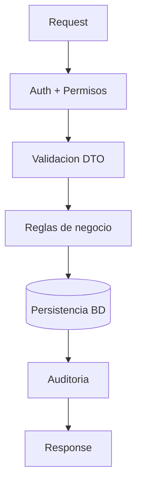

# 🛠️ Backend, API y Base de Datos

## 🎯 Objetivo
Definir como se ejecuta una operacion desde API hasta persistencia.

## 🔄 Flujo estandar de una operacion
1. Entra request.
2. Guard de seguridad valida sesion y permiso.
3. DTO valida formato de datos.
4. Service aplica reglas de negocio.
5. Se persiste en BD.
6. Se registra auditoria.
7. Se responde en formato estandar.

## 🎯 Reglas de datos
- Sin `SELECT *` en consultas criticas.
- FK e indices en columnas de cruce.
- No modificar datos aplicados de planilla.

## 🎯 Que pasa si...
- Datos invalidos: error 400/422 con mensaje claro.
- Recurso no existe: 404.
- Conflicto de negocio: 409.
- Error interno: 500 sin exponer detalle sensible.

