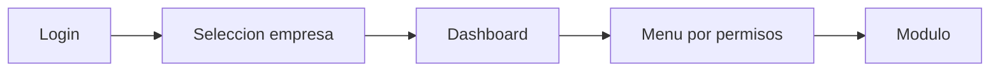
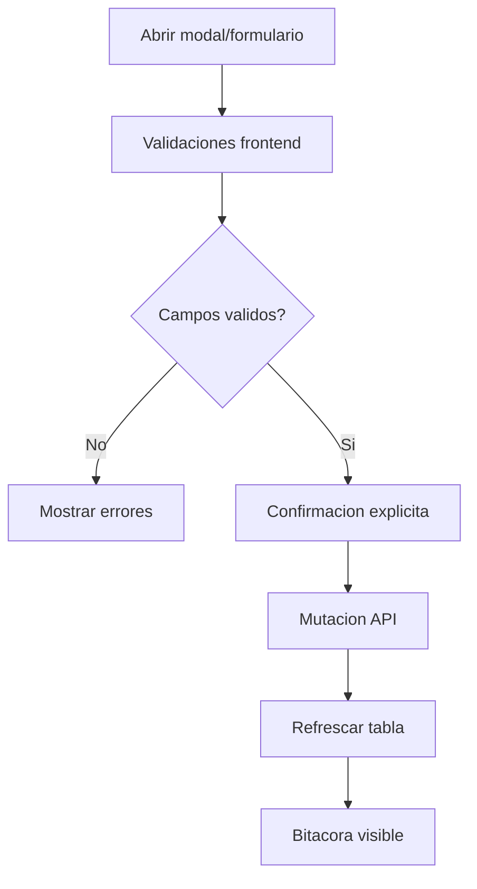

# Frontend UX Consolidado

Estado: vigente

Fuentes origen: 05, 06, 08, 10, 29, 31-validacion, GUIA_DE_USUARIO

## Flujo de navegacion privada


## Flujo de formulario estandar



## Fuentes Integradas (Preservacion Completa)

Regla de consolidacion aplicada:
- Cada fuente original asignada a este maestro se preserva completa debajo de su encabezado.
- Esto garantiza trazabilidad y evita perdida de informacion durante la limpieza.

### Fuente: docs/05-IntegracionAntDesign.md

```markdown
# KPITAL 360  Integracin de Ant Design

**Documento:** 05  
**Para:** Ingeniero Frontend  
**De:** Roberto  Arquitecto Funcional / Senior Engineer  
**Prerrequisito:** Haber ledo [02-ScaffoldingProyecto.md](./02-ScaffoldingProyecto.md)  
**ltima actualizacin:** 2026-02-23 (Validacin formularios, estilos Histrico Laboral, tabs scroll, smbolo CRC)

---

## ndice rpido

| Seccin | Contenido |
|---------|-----------|
| [Ubicacin del CSS](#ubicacin-del-css-obligatorio) | Archivo de estilos compartidos y cmo importarlo |
| [Formularios y Modales](#formularios-y-modales-patrn-oficial) | Patrn obligatorio para modales de creacin/edicin |
| [Tabla y Filtros](#tabla-y-filtros-patrn-oficial-de-listados) | Patrn obligatorio, clases CSS, estructura, ejemplo de uso |
| [Clases CSS obligatorias](#clases-css-obligatorias-usersmanagementpagemodulecss) | Lista de clases con ubicacin en el archivo |
| [Paleta RRHH](#paleta-rrhh-valores-vigentes) | Colores corporativos (no inventar) |
| [Referencia de implementacin](#referencia-de-implementacin) | Pginas y archivos a consultar |
| [Nomenclatura](#nomenclatura-y-convenciones) | Prefijos, patrones de nombres, textos estndar |
| [Formato de fecha y hora](#formato-de-fecha-y-hora-obligatorio) | Formato 12h (AM/PM), locale es-ES |
| [Formato de moneda](#formato-de-moneda-obligatorio) | Regla nica para inputs monetarios CRC/USD |

---

## Nomenclatura y convenciones

> **Toda la app debe seguir estas convenciones** para mantener coherencia entre pginas y mdulos.

### Prefijos de clases CSS

| Prefijo | Uso | Ejemplos |
|---------|-----|----------|
| `company*` | Modales, formularios y confirmaciones de entidades (empresas, empleados, etc.) | `companyModal`, `companyFormGrid`, `companyConfirmModal` |
| `config*` | Tablas de configuracin/listados | `configTable` |
| `pane*` | Paneles de filtro expandibles | `paneCard`, `paneOptionsBox` |

### Orden de nombres de empleados

- **Todos los selects, listas y tablas de empleados deben ordenarse alfabticamente** por **Apellidos  Nombre**.
- El formato visual obligatorio es: **`Apellido1 Apellido2 Nombre`** (si no hay `apellido2`, se omite).

### Ordenamiento en tablas

- **Todas las tablas del sistema** deben permitir ordenar por columna (como en Empresas).
| `tag*` | Etiquetas de estado | `tagActivo`, `tagInactivo` |
| `btn*` | Botones (si se necesita clase propia) | `btnPrimary`, `btnSecondary` |
| `infoBanner` + `*Type` | Banners informativos | `infoType`, `warningType`, `dangerType` |

Para nuevas entidades (ej. Proveedores, Sucursales), reutilizar las mismas clases (`companyModal`, `companyFormContent`, etc.); no crear `providerModal` o similares salvo que el patrn sea realmente distinto.

### Patrn de nombres de pginas

- Pginas de listado/CRUD: `{Entidad}ManagementPage` (ej. `CompaniesManagementPage`, `UsersManagementPage`).
- Modales de creacin: `{Entidad}CreateModal` o integrado en la pgina con `openModal` / `setOpenModal`.

### Textos estndar de UI

| Contexto | Texto a usar |
|----------|--------------|
| Botn cerrar/cancelar | `Cancelar` |
| Confirmacin crear | `Confirmar creacin de {entidad}`, `Est seguro de crear esta {entidad}?`, `S, crear` |
| Confirmacin actualizar | `Confirmar actualizacin`, `Desea guardar los cambios?`, `S, guardar` |
| Botn crear | `Crear {Entidad}` (ej. `Crear Empresa`) |
| Botn guardar cambios | `Guardar cambios` |
| Estado | `Activo` / `Inactivo` |

### Modales de confirmacin

Usar siempre `companyConfirmModal`, `companyConfirmOk`, `companyConfirmCancel` con `modal.confirm`. Ver clase en *Clases CSS obligatorias > Modales de confirmacin*.

### Formato de fecha y hora (obligatorio)

Toda fecha y hora mostrada al usuario (bitcora, fechas de creacin/actualizacin, etc.) debe usar el formato de **12 horas (AM/PM)** para consistencia corporativa.

| Regla | Valor |
|-------|-------|
| Funcin a usar | `formatDateTime12h()` de `src/lib/formatDate.ts` |
| Locale | `es-ES` |
| Formato hora | 12 horas (AM/PM) |
| Ejemplo | `23/02/2026, 10:30 a. m.` |

**No usar** `toLocaleString()` sin opciones, `new Date().toLocaleString()`, ni formateadores que devuelvan 24h.

```ts
import { formatDateTime12h } from '../../../lib/formatDate';

// Correcto
<span>{formatDateTime12h(row.fechaCreacion)}</span>

// Incorrecto
<span>{row.fechaCreacion ? new Date(row.fechaCreacion).toLocaleString() : '-'}</span>
```

Referencia implementada: `UsersManagementPage.tsx`, `CompaniesManagementPage.tsx`, `PermissionsAdminListPage.tsx`.

### Formato de moneda (obligatorio)

Toda entrada monetaria visual en formularios debe usar el helper compartido:

- `frontend/src/lib/currencyFormat.ts`

Reglas obligatorias:

1. Simbolo dinamico por moneda (`CRC => "CRC"`, `USD => "$"`). Ver doc 29 para nota de encoding.
2. Formato visual con 2 decimales.
3. Parser robusto para evitar inflado de ceros al blur/focus.
4. Tope maximo unificado: `MAX_MONEY_AMOUNT`.
5. Prohibido duplicar formatter/parser inline en componentes.

Referencia detallada:

- `docs/29-EstandarFormatoMoneda.md`

**Validacin de formularios (campos de texto, email, anti-SQL):**

- `docs/31-ValidacionFormulariosFrontend.md`

---

## Directivas de Estilo RRHH (Obligatorio)

> **Este es el nico estilo a seguir en KPITAL 360.** Cualquier nueva pgina o componente debe respetar estas directivas.

KPITAL 360 es un sistema de **recursos humanos**. La interfaz debe reflejar:

- **Seriedad**  Sin colores fuertes ni llamativos
- **Confort**  Espacios cmodos, legibilidad clara
- **Profesionalidad**  Sensacin corporativa, no SaaS juvenil
- **Identificable**  Jerarqua visual clara sin saturacin excesiva

Se utilizan colores **poco saturados, tonos slate y grises neutros**. Referencia implementada: `UsersManagementPage.tsx` y su mdulo CSS.

---

## Paleta RRHH (Valores vigentes)

> **ltima actualizacin:** Ajustes aplicados  verde Activo ms visible (`#b8d9c4`), danger ms identificable (borde `#c99a9a`). Usar exclusivamente estos valores.

### Acentos principales (slate / azul corporativo)

| Uso | Color | Hex |
|-----|-------|-----|
| Men activo, subrayado seleccionado, links principales, tema Ant Design | Azul corporativo | `#20638d` |
| Hover en opciones del men (dropdown) | Fondo suave | `rgba(32, 99, 141, 0.08)` |
| Acciones, links secundarios, focus | Slate principal | `#5a6c7d` |
| Hover de botones y links | Slate oscuro | `#4a5c6d` |
| Avatar de usuario en Drawer | Gris-azul | `#6b7c8c` |

### Texto

| Uso | Color | Hex |
|-----|-------|-----|
| Ttulos, texto principal | Gris oscuro | `#3d4f5c` |
| Encabezados de tabla | Gris medio | `#4a5a68` |
| Texto secundario, subttulos | Gris suave | `#6b7a85` |

### Etiquetas de estado

| Estado | Fondo | Texto |
|--------|-------|-------|
| Activo | `#b8d9c4` | `#3d5a45` |
| Inactivo | `#f0f2f4` | `#6b7a85` |

### Botones

| Tipo | Fondo | Borde | Texto |
|------|-------|-------|-------|
| Principal | `#5a6c7d` |  | `#fff` |
| Secundario | `#fff` | `#d8dde4` | `#5a6b7a` |

### Fondos y bordes

| Uso | Color | Hex |
|-----|-------|-----|
| Fondo de pgina | Gris muy claro | `#f7f8fa`, `#f5f7f9` |
| Bordes | Gris sutil | `#e8ecf0`, `#e0e4e8`, `#e4e8ec` |
| Encabezado tabla | Gris claro | `#f2f4f6` |
| Hover filas | Gris muy sutil | `#f8f9fa` |

### Errores / advertencias / danger (suaves pero identificables)

| Uso | Color | Hex |
|-----|-------|-----|
| Fondo banner danger | `#e4cdcd` | Rojo suave |
| Fondo lista danger | `#ecd8d8` | Rojo muy suave |
| Borde danger | `#c99a9a` | Rojo pastel |
| Texto danger | `#4d2e2e` | Marrn-gris oscuro |

### Iconos de banners informativos (suaves, no fuertes)

| Tipo | Color | Hex |
|------|-------|-----|
| Info | Verde apagado | `#5a7a6a` |
| Warning | Naranja suave | `#b8860b` |
| Danger | Rojo suave | `#a85c5c` |

---

## Qu Pidi Roberto (Textual)

> "Vas a integrar Ant Design para toda la UI. Primero, instala las dependencias de AntD y asegrate de que se carguen sus estilos globales. Luego, aplica el tema de Ant Design a nivel de toda la app, personalizando variables si es necesario (por ejemplo, colores corporativos). Usa los componentes base de AntD, como botones, tablas, formularios y modales, pero siempre dentro de un patrn coherente. Si necesits personalizar o extender componentes, usa clases CSS o componentes envueltos. No generes lgica compleja en los componentes, mantn la lgica en Redux o en los hooks. As, AntD ser la base visual, pero la arquitectura de estado sigue siendo la que definimos (Redux Toolkit y TanStack Query). Ejecuta esto en orden: primero configura AntD, luego los slices, y despus los hooks de TanStack. Si hay dudas, revisa la documentacin oficial de AntD y ajusta las variables de tema segn la identidad corporativa."

---

## Decisiones Tomadas

### Ant Design 5

Se eligi Ant Design versin 5 como framework UI completo para toda la aplicacin. No se mezcla con otro framework de componentes (no Bootstrap, no Material UI, no Tailwind para componentes).

### Tema Corporativo (alineado a Paleta RRHH)

Se defini un tema corporativo en `src/config/theme.ts` con los siguientes tokens. **Deben mantenerse coherentes con la Paleta RRHH**:

| Token | Valor | Propsito |
|-------|-------|-----------|
| `colorPrimary` | `#5a6c7d` | Slate corporativo RRHH (no azul fuerte) |
| `borderRadius` | `6` a `12` | Bordes suaves (812px para cards) |
| `fontFamily` | `"Public Sans"` | Tipografa corporativa (Google Fonts) |
| `fontSize` | `14` | Tamao base legible |
| `colorBgContainer` | `#ffffff` | Fondo de contenedores blanco |
| `colorText` | `#3d4f5c` | Texto principal gris oscuro |
| `controlHeight` | `36` | Altura de controles coherente |

### ConfigProvider Dinmico

`AntDConfigProvider.tsx` envuelve toda la app y sincroniza:
- **Tema claro/oscuro**  Lee de `ThemeContext`. Dark mode usa `theme.darkAlgorithm`.
- **Locale**  Lee de `LocaleContext`. Cambia entre `esES` y `enUS` de Ant Design.

---

## Ubicacin del CSS (Obligatorio)

> **Archivo nico de estilos compartidos para pginas de configuracin.**

| Archivo | Ubicacin | Uso |
|---------|-----------|-----|
| **Mdulo CSS de referencia** | `frontend/src/pages/private/configuration/UsersManagementPage.module.css` | Tablas, filtros, cards, etiquetas, botones, banners, tabs |

**Cmo usar:** importar como CSS Module en tu pgina:
```tsx
import styles from './UsersManagementPage.module.css';

// Aplicar clases: className={styles.configTable}
```

**Regla:** No duplicar estilos. Nuevas pginas de configuracin o listados deben importar este mdulo y usar sus clases. Si falta una clase, agregarla aqu.

---

## Formularios y Modales (Patrn Oficial)

> **Todos los formularios de creacin/edicin en modales deben seguir este patrn.** Garantiza coherencia visual y UX en toda la app.

### Dnde est la referencia

| Tipo | Archivo |
|------|---------|
| **Implementacin** | `frontend/src/pages/private/configuration/CompaniesManagementPage.tsx` |
| **Estilos** | `frontend/src/pages/private/configuration/UsersManagementPage.module.css` |
| **Referencia alternativa** | `frontend/src/pages/private/employees/components/EmployeeCreateModal.tsx`  Usa el mismo patrn y estilos que Empresas (companyModal*, companyFormGrid, etc.). |

### Estructura obligatoria del modal

1. **Header del modal**
   - Fondo `#f5f7fa`, borde inferior `2px solid #e0e6ed`
   - Izquierda: icono en recuadro (`companyModalHeaderIcon`, 40x40px, fondo `#f0f9ff`, icono `#5a6c7d`) + ttulo
   - Derecha: bloque Activo/Inactivo (`companyModalEstadoPaper`) + botn cerrar (X)
   - **Orden:** Ttulo | Activo | Cerrar. No superponer elementos.

2. **Tabs con iconos**
   - Cada pestaa debe llevar icono a la izquierda del texto (ej. `BankOutlined`, `EnvironmentOutlined`)
   - Pestaa activa: texto e icono `#5a6c7d`, indicador de subrayado 3px
   - Pestaas inactivas: texto e icono `#64748b`

3. **rea de logo (si aplica)**
   - Layout grid: columna izquierda (placeholder ~90px) + columna derecha (info + botn Cargar)
   - Placeholder: 90x90px, borde punteado `#cbd5e1`, icono gris `#cbd5e1`
   - Contenedor: fondo `#f8fafc`, borde punteado `#e0e6ed`, hover con `#5a6c7d`

4. **Campos del formulario**
   - Espaciado compacto: `gutter={[12, 12]}` en `Row`, `margin-bottom: 12px` en `Form.Item`
   - Distribucin por fila segn referencia:
     - Fila 1: 2 campos (`Col span={12}` cada uno)
     - Filas 2 y 3: 3 campos (`Col span={8}` cada uno)
   - Inputs: border-radius 8px, hover/focus con borde `#5a6c7d`

5. **Footer**
   - Fondo `#f5f7fa`, borde superior `2px solid #e0e6ed`
   - Botones alineados a la derecha: Cancelar (secundario) + Crear/Guardar (principal `#5a6c7d`)
   - `footer={null}` en Modal, footer custom dentro del contenido

### Clases CSS para modales (UsersManagementPage.module.css)

| Clase | Uso |
|-------|-----|
| `.companyModal` | Contenedor del modal (border-radius, sombra) |
| `.companyModalHeader` | Flex del ttulo + icono |
| `.companyModalHeaderIcon` | Recuadro del icono (40x40px) |
| `.companyModalHeaderRight` | Contenedor Activo + cerrar |
| `.companyModalEstadoPaper` | Paper del switch Activo/Inactivo |
| `.companyModalCloseBtn` | Botn X para cerrar |
| `.companyModalTabs` | Tabs con indicador y colores |
| `.companyModalFooter` | Footer con fondo y borde |
| `.companyModalBtnCancel` | Botn Cancelar |
| `.companyModalBtnSubmit` | Botn principal Crear/Guardar |
| `.companyFormContent` | Contenedor del formulario (inputs, labels) |
| `.companyFormGrid` | Grid de campos (espaciado compacto) |
| `.logoUploadArea` | rea de carga de logo |
| `.logoUploadPlaceholder` | Recuadro placeholder 90x90px |
| `.logoUploadInfo`, `.logoUploadTitle`, `.logoUploadDesc` | Info del logo |

### Reglas funcionales

- **Solo campos en BD:** No incluir pestaas o campos que no existan en el modelo/API.
- **Validaciones:** Usar `formValidation.ts` (textRules, emailRules, optionalNoSqlInjection) para campos de texto y email. Ver `docs/31-ValidacionFormulariosFrontend.md`. Campos requeridos con `*`, mensajes claros en `rules`.
- **Estado visual:** Switch Activo/Inactivo solo informativo en header (edicin de estado va Inactivar/Reactivar en el cuerpo).
- **Botn primario de submit:** Debe iniciar deshabilitado y habilitarse solo cuando los campos requeridos tengan valor vlido (trim y reglas de formato). Esta regla aplica a todos los formularios nuevos y existentes.
- **Acciones crticas:** Crear y Guardar cambios deben pasar por confirmacin explcita (`modal.confirm`) antes de ejecutar mutaciones.

### Ejemplo de uso

```tsx
<Modal
  className={styles.companyModal}
  closable={false}
  footer={null}
  title={(
    <Flex justify="space-between" align="center" style={{ width: '100%' }}>
      <div className={styles.companyModalHeader}>
        <div className={styles.companyModalHeaderIcon}>
          <BankOutlined />
        </div>
        <span>Crear Nueva Entidad</span>
      </div>
      <Flex align="center" gap={12} className={styles.companyModalHeaderRight}>
        <div className={styles.companyModalEstadoPaper}>
          <span>Activo</span>
          <Switch checked disabled />
        </div>
        <Button type="text" icon={<CloseOutlined />} onClick={onClose} className={styles.companyModalCloseBtn} />
      </Flex>
    </Flex>
  )}
>
  <Form className={styles.companyFormContent}>
    <Tabs className={`${styles.tabsWrapper} ${styles.companyModalTabs}`} items={tabItems} />
    <div className={styles.companyModalFooter}>
      <Button onClick={onClose} className={styles.companyModalBtnCancel}>Cancelar</Button>
      <Button type="primary" className={styles.companyModalBtnSubmit}>Crear</Button>
    </div>
  </Form>
</Modal>
```

---

## Referencia de Implementacin

| Pgina | Archivo | Qu ver como referencia |
|--------|---------|-------------------------|
| **Empresas** | `CompaniesManagementPage.tsx` | Tabla, filtros expandibles, **modal de creacin/edicin** (patrn formularios) |
| **Empleados** | `EmployeeCreateModal.tsx` | Modal de creacin con el mismo patrn que Empresas (header, tabs, footer, Paleta RRHH) |
| **Usuarios** | `UsersManagementPage.tsx` | Drawer, etiquetas, botones, tabs |
| **Permisos** | `PermissionsAdminListPage.tsx` | Encabezado, banner informativo, bsqueda |
| **Roles** | `RolesManagementPage.tsx` | Selector de aplicacin, matriz de permisos |

Todas las pginas anteriores importan `UsersManagementPage.module.css` y aplican la Paleta RRHH.

### Nota de UX para Empresas

- La pantalla `Configuracin > Empresas` **no** muestra tabs de navegacin cruzada en su encabezado.
- Empresas es un mdulo dedicado: ttulo, subttulo y acciones del mdulo.
- El modal usa tabs internos (`Informacin Principal`, `Direccin`). Solo incluir pestaas con campos existentes en BD.

### Actualizacin de tabla tras mutaciones (obligatorio)

Tras **cualquier accin** que modifique datos en listados (crear, editar, inactivar, reactivar, etc.), la tabla **debe refrescar** para mostrar los datos actualizados. Esto aplica a Empresas y a cualquier otro listado similar (empleados, usuarios, etc.). Implementacin: invocar la funcin de recarga del listado despus de cada mutacin exitosa.

---

## Tabla y Filtros (Patrn Oficial de Listados)

> **Usar siempre este patrn** para listados en configuracin y mdulos administrativos.

### Dnde est la referencia

| Tipo | Archivo | Clases CSS |
|------|---------|------------|
| **Implementacin** | `frontend/src/pages/private/configuration/CompaniesManagementPage.tsx` |  |
| **Estilos** | `frontend/src/pages/private/configuration/UsersManagementPage.module.css` | `.configTable`, `.companiesTable`, `.filtersCollapse`, `.paneCard`, `.paneOptionsBox`, etc. |

### Estructura obligatoria del listado

1. **Encabezado**  Ttulo de seccin (ej. "Registros de Empresas"), icono de filtro, selector "entries per page", toggle "Mostrar inactivas".
2. **Seccin Filtros**  Dentro de `Collapse` con header "Filtros". **Colapsada por defecto** (`filtersExpanded` inicial en `false`); el usuario la expande al hacer clic.
3. **Bsqueda global**  Input "Search" + botones "Collapse All", "Show All", "Limpiar Todo".
4. **Panes de filtro**  Una tarjeta por campo (`paneCard`), con input, botn buscar, limpiar, expandir/colapsar.
5. **Lista de opciones**  Al expandir, `paneOptionsBox` con `Checkbox.Group` y `Badge` de conteo.
6. **Tabla**  Clases `configTable` + `companiesTable`.
7. **Separacin**  `margin-bottom: 24px` entre filtros y tabla (`.filtersCollapse`).

### Clases CSS para tabla y filtros

| Clase | Uso | Ubicacin en CSS |
|-------|-----|------------------|
| `.configTable` | Tabla base (encabezados, celdas, bordes) | `UsersManagementPage.module.css` |
| `.companiesTable` | Refuerzo para tablas de empresas/listados | Mismo archivo |
| `.filtersCollapse` | Collapse de filtros + `margin-bottom: 24px` | Mismo archivo |
| `.paneCard` | Tarjeta de cada filtro (borde, padding, fondo) | Mismo archivo |
| `.paneOptionsBox` | Contenedor de checkboxes al expandir filtro | Mismo archivo |
| `.filterLabel` | Etiqueta de campo de filtro | Mismo archivo |
| `.filterInput` | Input de filtro con bordes | Mismo archivo |
| `.searchInput` | Bsqueda global | Mismo archivo |
| `.registrosTitle` | Ttulo "Registros de X" | Mismo archivo |
| `.registrosFilterIcon` | Icono de filtro junto al ttulo | Mismo archivo |

### Estilos de tabla (aplicados por `.configTable` y `.companiesTable`)

| Elemento | Estilo |
|----------|--------|
| Contenedor | Borde `1px solid #e8ecf0`, border-radius 8px, box-shadow sutil |
| Encabezados | Fondo `#f2f4f6`, color `#4a5a68`, font-weight 600, uppercase, padding 16px 12px, borde inferior 2px |
| Celdas | Borde `#e8ecf0`, padding 14px 12px, color texto `#3d4f5c` |
| Filas alternadas | Pares: `#f9fafb`, impares: blanco |
| Hover fila | Fondo `#f8f9fa`, transition 0.2s |
| Esquinas | Primera/ltima celda de encabezado y ltima fila con border-radius 8px |
| Paginacin | Botones border-radius 6px, activo borde/texto `#5a6c7d` |

### Reglas funcionales de filtros

- Bsqueda global + filtros por campo (AND entre filtros activos).
- Cada filtro expandible/colapsable y limpiable individualmente.
- Controles globales: "Collapse All", "Show All", "Limpiar Todo".
- Conteos por opcin (`Badge`) recalculados segn filtros activos.
- 4-6 panes de filtro por campos clave (nombre, cdigo, estado, email, etc.).

### Ejemplo de uso

```tsx
import styles from './UsersManagementPage.module.css';

// Tabla
<Table
  className={`${styles.configTable} ${styles.companiesTable}`}
  columns={columns}
  dataSource={data}
  pagination={{ showTotal: (t, r) => `Mostrando ${r[0]} a ${r[1]} de ${t} registros` }}
/>

// Filtros
<Collapse className={styles.filtersCollapse}>
  <Collapse.Panel header="Filtros" key="filtros">
    <div className={styles.paneCard}>
      {/* input + botones + paneOptionsBox al expandir */}
    </div>
  </Collapse.Panel>
</Collapse>
```

### Clases CSS obligatorias (UsersManagementPage.module.css)

**Archivo:** `frontend/src/pages/private/configuration/UsersManagementPage.module.css`

#### Tabla y filtros (ver seccin *Tabla y Filtros* arriba)
| Clase | Uso |
|-------|-----|
| `.configTable` | Tabla: bordes, encabezados, filas alternadas, hover |
| `.companiesTable` | Refuerzo para tablas de listado |
| `.filtersCollapse` | Seccin filtros colapsable + separacin con tabla |
| `.paneCard` | Tarjeta de cada filtro por campo |
| `.paneOptionsBox` | Lista de opciones (checkboxes) al expandir |
| `.filterLabel`, `.filterInput`, `.searchInput` | Inputs de filtro |
| `.registrosTitle`, `.registrosFilterIcon` | Encabezado de listado |

#### Etiquetas, botones y banners
| Clase | Uso | Valores principales |
|-------|-----|---------------------|
| `.tagActivo` | Etiqueta estado Activo | fondo `#b8d9c4`, texto `#3d5a45` |
| `.tagInactivo` | Etiqueta estado Inactivo | fondo `#f0f2f4`, texto `#6b7a85` |
| `.exceptionListBox` | Lista danger | fondo `#ecd8d8`, borde `#c99a9a` |
| `.btnPrimary` | Botn principal | fondo `#5a6c7d` |
| `.btnSecondary` | Botn secundario | borde `#d8dde4`, texto `#5a6b7a` |
| `.infoBanner` + `.infoType` (Alert) | Mensajes informativos | Ver *Banners informativos* |
| `.infoBanner` + `.warningType` / `.dangerType` | Advertencias / errores | Ver *Banners informativos* |

#### Tabs y selectores
| Clase | Uso |
|-------|-----|
| `.pageTabs` / `.pageTab` / `.pageTabActive` | Tabs de pgina (Roles, Usuarios, Permisos) |
| `.tabsWrapper` | Tabs en Drawer o modal |
| `.appSelector` | Selector de aplicacin (KPITAL/TimeWise) |

#### Modales y formularios (ver seccin *Formularios y Modales*)
| Clase | Uso |
|-------|-----|
| `.companyModal`, `.companyModalHeader`, `.companyModalHeaderIcon` | Modal, header, icono |
| `.companyModalHeaderRight`, `.companyModalEstadoPaper`, `.companyModalCloseBtn` | Activo, switch, cerrar |
| `.companyModalTabs`, `.companyModalFooter`, `.companyModalBtnCancel`, `.companyModalBtnSubmit` | Tabs, footer, botones |
| `.companyFormContent`, `.companyFormGrid` | Formulario, grid de campos |
| `.logoUploadArea`, `.logoUploadPlaceholder`, `.logoUploadInfo` | rea de logo |
| `.employeeModalTabsScroll` | Tabs con scroll horizontal (empleados): muestra nombres completos, oculta men "Ms" y nav-operations, padding-right para evitar corte visual al scroll |
| `.historicoProvisionBlock`, `.historicoTableWrap`, `.historicoTableHeader`, `.historicoTableRow`, `.historicoAddBtn` | Seccin Provisin de Aguinaldo: tarjeta blanca estilo sectionCard, tabla estilo configTable, botn principal |

#### Modales de confirmacin
| Clase | Uso |
|-------|-----|
| `.companyConfirmModal` | Modal de confirmacin centrado, ancho 420px, estilo Paleta RRHH |
| `.companyConfirmOk`, `.companyConfirmCancel` | Botones S/Cancelar |

**Ejemplo:** `modal.confirm({ rootClassName: styles.companyConfirmModal, icon: <QuestionCircleOutlined style={{ color: '#5a6c7d', fontSize: 40 }} />, centered: true, width: 420, okButtonProps: { className: styles.companyConfirmOk }, cancelButtonProps: { className: styles.companyConfirmCancel } })`

**Regla:** Usar estas clases en *todos* los modales de confirmacin (crear, editar, inactivar, reactivar, etc.). No inventar colores ni duplicar estilos. El icono debe ser `QuestionCircleOutlined` color `#5a6c7d`; no usar el icono amarillo de advertencia por defecto.

---

### Tabs estilo control segmentado (Obligatorio)

Para secciones como **Empresas, Roles, Excepciones, Acciones** y **Roles, Usuarios, Permisos**:

| Elemento | Estilo |
|----------|--------|
| Contenedor | Fondo `#f5f5f5`, padding 46px, border-radius 810px, sombra sutil |
| Pestaa activa | Fondo blanco, texto `#333333`, font-weight 600, sombra `0 1px 3px rgba(0,0,0,0.06)`, `transform: scale(1.02)` |
| Pestaa inactiva | Sin fondo, texto `#777777`, font-weight 400 |
| Transicin | `cubic-bezier(0.34, 1.56, 0.64, 1)` para efecto burbuja |
| Contenido al cambiar pestaa | Animacin `tabPaneFadeIn` (opacidad + translateY 4px) |

**Uso:** 
- Pgina: `className={styles.pageTabs}` con `pageTab` + `pageTabActive`
- Drawer: envolver `Tabs` en `className={styles.tabsWrapper}`

---

### Banners informativos (Obligatorio)

Todo mensaje informativo (Para qu sirve, Inactivar vs Bloquear, Denegar permisos globalmente, Sin empresas asignadas, etc.) debe usar:

**Clase:** `className={\`${styles.infoBanner} ${styles.infoType}\`}` (o `warningType` / `dangerType`)

| Propiedad | Valor |
|-----------|-------|
| Fondo | Blanco `#ffffff` |
| Borde | `1px solid #e8ecf0` |
| Padding | `10px 14px` |
| Margin-bottom | `8px` |
| Ttulo | `#3d4f5c`, 13px, font-weight 600 |
| Descripcin | `#6b7a85`, 12px, line-height 1.45 |

**Iconos suaves (no fuertes):**

| Tipo | Clase | Color icono |
|------|-------|-------------|
| Informacin | `infoType` | Verde apagado `#5a7a6a` |
| Advertencia | `warningType` | Naranja suave `#b8860b` |
| Error/Danger | `dangerType` | Rojo suave `#a85c5c` |

**Ejemplo:**
```tsx
<Alert
  className={`${styles.infoBanner} ${styles.infoType}`}
  type="info"
  showIcon
  message="Para qu sirve"
  description="Define en cules empresas puede operar el usuario."
/>
```

**Regla:** Mantener banners compactos, limpios y con iconos suaves. Evitar colores fuertes.

---

## Reglas de Uso de Ant Design

### Qu S hacer

1. **Usar componentes base de AntD directamente:** `Button`, `Table`, `Form`, `Modal`, `Select`, `Input`, `DatePicker`, `Tabs`, `Card`, `Badge`, `Avatar`, `Tag`, `Space`, `Typography`, `Layout`, `Menu`.
2. **Para formularios y modales de creacin/edicin:** Usar el patrn de `CompaniesManagementPage.tsx` (modal) y las clases `companyModal*`, `companyFormContent`, `companyFormGrid`, `logoUploadArea` de `UsersManagementPage.module.css`. Ver seccin *Formularios y Modales*.
3. **Para tablas y filtros:** Usar el patrn de `CompaniesManagementPage.tsx` y las clases `configTable`, `companiesTable`, `filtersCollapse`, `paneCard`, `paneOptionsBox` de `UsersManagementPage.module.css`. Ver seccin *Tabla y Filtros*.
4. **Usar CSS Modules (`.module.css`)** para estilos especficos. Importar `UsersManagementPage.module.css` en pginas de configuracin.
5. **Usar exclusivamente la Paleta RRHH** para colores. No inventar colores fuera de ella.
6. **Consultar** `frontend/src/pages/private/configuration/UsersManagementPage.module.css` para clases y valores hex.
7. **Usar tabs estilo control segmentado** para Empresas, Roles, Excepciones, Acciones y para Roles, Usuarios, Permisos.
8. **Usar banners informativos compactos** (`infoBanner` + `infoType`/`warningType`/`dangerType`) para mensajes de gua o advertencia.
9. **Seguir la nomenclatura documentada** en *Nomenclatura y convenciones* para clases, pginas y textos.

### Qu NO hacer

1. **No usar colores fuertes ni llamativos.** Evitar azul brillante (`#1677ff`), verde fuerte (`#52c41a`), rojos saturados. En banners informativos, usar iconos suaves (ver seccin *Iconos de banners informativos*).
2. **No poner lgica de negocio en componentes UI.** Un `KpTable` no decide qu datos mostrar. Recibe datos procesados.
3. **No mezclar frameworks.** Si AntD tiene un `Select`, no uses `react-select`. Si AntD tiene un `Modal`, no hagas uno custom con CSS.
4. **No crear modales o formularios con estilos distintos.** Seguir el patrn documentado en *Formularios y Modales* para mantener coherencia.
5. **No sobreescribir estilos globales de AntD con `!important`.** Usar tokens del tema o CSS Modules.
6. **No hardcodear colores fuera de la Paleta RRHH.** Usar los hex documentados en este documento.

---

## Iconos

Se integraron mltiples bibliotecas de conos para flexibilidad:

| Biblioteca | Uso | Carga |
|-----------|-----|-------|
| **Ant Design Icons** (`@ant-design/icons`) | Header, botones, acciones | Import directo en JS |
| **Tabler Icons** | Sidebar | CSS font (`tabler-icons.min.css`) |
| **Phosphor Icons** | Complementario | CSS font (`phosphor/duotone/style.css`) |
| **Feather Icons** | Complementario | CSS font (`feather.css`) |
| **Font Awesome** | Complementario | CSS font (`fontawesome.css`) |
| **Material Icons** | Complementario | CSS font (`material.css`) |

Los CSS de fuentes de conos se cargan desde `public/assets/fonts/` en `index.html`.

---

## Tipografa

**Google Fonts: Public Sans**  Cargada desde CDN en `index.html`:

```html
<link href="https://fonts.googleapis.com/css2?family=Public+Sans:wght@400;500;600;700&display=swap" rel="stylesheet" />
```

Aplicada globalmente en `index.css` y en el tema de AntD (`fontFamily`).

---

## Archivos Generados

| Archivo | Propsito |
|---------|-----------|
| `src/config/theme.ts` | Tokens corporativos KPITAL (colores, tipografa, radios) |
| `src/providers/AntDConfigProvider.tsx` | ConfigProvider dinmico (tema + locale) |
| `src/components/ui/KpButton.tsx` | Wrapper de Button (extensible) |
| `src/components/ui/KpTable.tsx` | Wrapper de Table (paginacin por defecto) |

---

## Orden de Ejecucin (Cumplido)

1. Instalar `antd` + `@ant-design/icons`
2. Crear `theme.ts` con tokens corporativos
3. Crear `AntDConfigProvider.tsx` conectado a Theme y Locale contexts
4. Integrar en `Providers.tsx` como wrapper
5. Crear componentes envueltos (`KpButton`, `KpTable`)
6. Migrar layout a componentes AntD (`Layout`, `Menu`, etc.)

---

## Estandar de encoding Frontend (obligatorio)

- Todos los archivos de rontend/src deben guardarse en UTF-8 sin BOM.
- No se permiten cadenas mojibake en UI (C, , , , etc.).
- Si un entorno presenta problemas con acentos, usar texto sin tilde como fallback funcional.
- Antes de merge, ejecutar barrido de caracteres corruptos en rontend/src.
```

### Fuente: docs/06-DirectivasHeaderMenu.md

```markdown
# KPITAL 360 — Directivas del Header + Menú Principal

**Documento:** 06  
**Para:** Ingeniero Frontend  
**De:** Roberto — Arquitecto Funcional / Senior Engineer  
**Prerrequisito:** Haber leído [04-DirectivasStateManagement.md](./04-DirectivasStateManagement.md) + [05-IntegracionAntDesign.md](./05-IntegracionAntDesign.md)

---

## Qué Pidió Roberto (Textual)

> "Construir el header exactamente como el mock: Barra superior blanca, limpia, corporativa. Logo + nombre del sistema a la izquierda. Menú horizontal principal debajo del logo. Íconos + texto en cada opción del menú. Dropdown en cada opción principal. A la derecha: campana con badge y avatar de usuario. Diseño minimalista, serio y empresarial. No estoy definiendo las opciones del menú todavía. Solo la estructura."

Roberto proporcionó un mockup de referencia visual y dio instrucciones de diseño enterprise específicas.

---

## Estructura Obligatoria: Header de 2 Niveles

### Nivel 1 (Superior)

| Izquierda | Derecha |
|-----------|---------|
| Logo corporativo (`LogoLarge.png`) | Campana de notificaciones con Badge + Avatar de usuario |

- Logo: imagen real desde `/assets/images/global/LogoLarge.png`, altura 64px
- Notificaciones: `Badge` de AntD con contador, color verde (`#52c41a`)
- Avatar: `Avatar` de AntD con inicial del nombre

### Nivel 2 (Inferior)

Menú horizontal principal con dropdowns.

- Cada opción del menú top-level puede tener `children` (submenú dropdown)
- Los submenús pueden tener hijos anidados (multi-nivel)
- Ícono + texto en cada opción
- Hover sutil, activo con línea inferior

---

## Reglas de Diseño Enterprise

| Regla | Detalle |
|-------|---------|
| Fondo | Blanco (`#fff`), borde inferior `1px solid #f0f0f0` |
| Altura | Compacta — no más de lo necesario |
| Tipografía | Public Sans, limpia, sin bold excesivo |
| Sombras | Sin sombras exageradas. Máximo `box-shadow: 0 1px 2px rgba(0,0,0,0.03)` |
| Colores | Sin colores llamativos. Azul corporativo solo para activo. |
| Hover | Sutil — cambio de color de texto, no de fondo |
| Activo | Línea inferior azul + color de texto azul |
| Sensación | Corporativo, serio. No SaaS juvenil. No dashboard de startup. |

---

## Regla Arquitectónica (No Negociable)

> **El menú no se hardcodea. Se construye desde una estructura de datos (array/objeto).**

El menú es **data-driven**:

1. La configuración vive en Redux (`menuSlice.ts`)
2. Un selector (`getVisibleMenuItems`) filtra por permisos
3. El componente `MainMenu` recibe la lista ya filtrada y la renderiza
4. El componente **no** filtra. Solo renderiza lo que le llega.

### Soporte requerido

- Submenús multinivel (dropdown dentro de dropdown)
- Permisos por opción (`requiredPermission`)
- Íconos mapeados por ID (`menuIcons.tsx`)
- Detección de opción activa por ruta actual (`useLocation`)
- `useMemo` para evitar recálculos innecesarios

---

## Logo

Roberto proporcionó la imagen del logo corporativo. Se colocó en:

```
frontend/public/assets/images/global/LogoLarge.png
```

Se ajustó la altura del logo iterativamente hasta llegar a **64px** para que coincidiera con el mockup de referencia.

---

## Componentes Generados

| Componente | Archivo | Responsabilidad |
|-----------|---------|-----------------|
| `AppHeader` | `components/ui/AppHeader/AppHeader.tsx` | Compone los 2 niveles del header |
| `Logo` | `components/ui/AppHeader/Logo.tsx` | Renderiza el logo corporativo |
| `HeaderActions` | `components/ui/AppHeader/HeaderActions.tsx` | Notificaciones + Avatar |
| `MainMenu` | `components/ui/AppHeader/MainMenu.tsx` | Menú horizontal data-driven con submenús |
| Estilos | `components/ui/AppHeader/AppHeader.module.css` | CSS Module del header completo |

---

## No Hacer

- **No hardcodear** opciones de menú en JSX
- **No mezclar** layout con lógica de negocio
- **No usar sidebar** para el menú principal (el sidebar es el catálogo de módulos, ver documento 07)
- **No diseñar** de forma improvisada — seguir el mock
- **No usar** estilos inline excesivos — CSS Modules
```

### Fuente: docs/08-EstructuraMenus.md

```markdown
# KPITAL 360  Estructura de Mens Definida

**Documento:** 08  
**Para:** Ingeniero Frontend  
**De:** Roberto  Arquitecto Funcional / Senior Engineer  
**Prerrequisito:** Haber ledo [06-DirectivasHeaderMenu.md](./06-DirectivasHeaderMenu.md)

---

- UI: se elimin? la secci?n "Planillas en las que entrar?a" en el modal de vacaciones. La asignaci?n es interna.


- Solape de planillas: si una fecha coincide con m?ltiples planillas ABIERTAS/EN_PROCESO, **no se bloquea** la selecci?n. Se asigna autom?ticamente por prioridad: estado ABIERTA > EN_PROCESO; si empatan, menor fecha de inicio; si empatan, menor ID.
- Se muestra advertencia en UI cuando hay fechas solapadas.

## Contexto

Roberto fue definiendo las opciones del men de forma incremental a travs de directivas. Este documento consolida **exactamente qu opciones existen**, con su estructura de submens tal como qued definida.

**Solo existe un men: el men horizontal superior (header).** No hay sidebar ni men lateral.

---

## Men Horizontal Principal (Header  Nivel 2)

Vive en `store/slices/menuSlice.ts`. Estructura jerrquica con submens multinivel (dropdowns).

---

### Acciones de Personal

Permiso requerido: `personal-action:view`

```
Acciones de Personal
 Entradas de Personal
 Salidas de Personal
    Despidos
    Renuncias
 Deducciones
    Retenciones
    Descuentos
 Compensaciones
    Aumentos
    Bonificaciones
    Horas Extras
    Vacaciones
 Incapacidades
 Licencias y Permisos
 Ausencias
```

### Parametros de Planilla

Permiso requerido: por opcion

```
Parametros de Planilla
 Parametros Iniciales
     Calendario de Nmina >
        Calendario
        Listado de Feriados
        Listado de Das de Pago de Planilla
     Artculos de Nomina
     Movimientos de Nomina
```

Permisos por opcion:
- Articulos de Nomina: `payroll-article:view`
- Movimientos de Nomina: `payroll-movement:view`
- Calendario: `payroll:calendar:view`
- Listado de Feriados: `payroll-holiday:view`
- Listado de Dias de Pago de Planilla: `payroll:view`

### Gestion Planilla

Actualmente **fuera de alcance** y oculto en menu.  
La apertura/listado/operacion de planillas se trabaja desde:
- `Parametros de Planilla > Calendario de Nmina > Listado de Das de Pago de Planilla`
- `Parametros de Planilla > Calendario de Nmina > Calendario`

### Configuracion

Cada opcin tiene su propio permiso. Si el permiso no existe en la BD o no est asignado al usuario autenticado, la opcin se **oculta**.

```
Configuracion
 [Seguridad]
    Permisos         config:permissions
    Roles            config:roles
    Usuarios         config:users

 [Gestion de Organizacional]
     Reglas de Distribucin   config:reglas-distribucion
     Empresas                 company:view
     Empleados                employee:view
     Clases                   config:clases
     Proyectos                config:proyectos
     Cuentas Contables        config:cuentas-contables
     Departamentos            config:departamentos
     Puestos                  config:puestos
```

**Regla:** Las opciones sin permiso definido en BD (ej. `config:clases`, `config:proyectos`) permanecen ocultas hasta que el permiso se cree y se asigne a roles.

---

## Regla de visibilidad por permisos

**Toda opcin de men debe tener `requiredPermission`.** El selector `getVisibleMenuItems` filtra segn los permisos del usuario autenticado:

- Si el permiso **no existe en la BD**: nadie lo tiene  la opcin queda oculta.
- Si el permiso **existe pero no est asignado** al usuario (va roles/overrides): la opcin queda oculta.
- Solo se muestra cuando el permiso existe en `sys_permisos` y el usuario lo tiene asignado.

Las opciones que an no tienen permiso creado en BD (ej. Reglas de Distribucin, Clases, Proyectos) permanecen ocultas hasta que se defina el permiso y se asigne a roles en Configuracin > Roles.

---

## Historial de Definiciones

| Directiva | Qu Defini Roberto |
|-----------|---------------------|
| Primera | Estructura del header con 4 opciones principales y placeholders |
| Segunda | Submen "Acciones de Personal" completo: Entradas, Salidas, Deducciones, Compensaciones, Incapacidades, Licencias, Ausencias |
| Tercera | Sub-submen "Salidas de Personal"  Despidos, Renuncias |
| Cuarta | Sub-submen "Deducciones"  Retenciones, Descuentos |
| Quinta | Sub-submen "Compensaciones"  Aumentos, Bonificaciones, Horas Extras, Vacaciones |
| Sexta | "Parametros de Planilla": Calendario de Nmina (Calendario, Das de Pago), Artculos de Nomina, Movimientos de Nomina |
| Sptima | "Gestion Planilla" se difiere; opciones ocultas por alcance actual |
| Octava | "Configuracion" completo: Seguridad (Roles y Permisos con sub, Usuarios) + Gestion Organizacional (Reglas, Empresas, Empleados, Clases, Proyectos, Cuentas, Departamentos, Puestos) |

---

## Pendiente de Definir

| Elemento | Estado |
|----------|--------|
| (Todos los mens estn definidos) |  |

Cuando Roberto defina estas opciones, se agregan en `menuSlice.ts` reemplazando los placeholders.

---
## Actualizaci?n 2026-03-02 ? Vacaciones sin selecci?n de planilla (ACTUALIZACION-VACACIONES-2026-03-02
UI-PLANILLAS-REMOVIDA-2026-03-02
SOLAPE-PLANILLAS-2026-03-02)
- KPITAL (RRHH): el usuario ya no selecciona planilla en Vacaciones. Selecciona fechas y movimiento; el sistema determina la planilla elegible por cada fecha con base en calendario de n?mina (empresa/empleado/moneda/periodo).
- Validaciones: fines de semana y feriados bloqueados; fechas ya reservadas bloqueadas; saldo disponible; fechas deben pertenecer a un periodo elegible; si una fecha coincide con m?ltiples periodos, se rechaza.
- Consistencia de tipo: todas las fechas deben pertenecer al mismo tipo de planilla. Si no, error.
- Split autom?tico en creaci?n: si las fechas caen en m?s de un periodo del mismo tipo, se crean acciones separadas por periodo. En edici?n, solo se permite un periodo.
- Persistencia: `acc_vacaciones_fechas` y `acc_cuotas_accion` guardan `id_calendario_nomina` por fecha; el header de acci?n puede quedar con `id_calendario_nomina = NULL`.
- TimeWise: acciones de vacaciones se crean en estado Borrador sin planilla. RRHH completa fechas/movimiento en KPITAL; el sistema asigna planilla por fecha.
- Planilla: al cargar una planilla se consumen las fechas cuyo `id_calendario_nomina` coincide con la planilla y estado aprobado. No se requiere que el header tenga planilla.
---
```

### Fuente: docs/10-DirectivasSeparacionLoginDashboard.md

```markdown
# KPITAL 360  Directivas de Separacin Login / Dashboard

**Documento:** 10  
**Para:** Ingeniero Frontend  
**De:** Roberto  Arquitecto Funcional / Senior Engineer  
**Prerrequisito:** Haber ledo [04-DirectivasStateManagement.md](./04-DirectivasStateManagement.md)  
**Prioridad:** Ejecutar en orden. No saltar pasos.

---

## Qu Pidi Roberto (Principio Fundamental)

> "El Login y el Dashboard son dos aplicaciones distintas que comparten el mismo proyecto. No comparten layout, no comparten navegacin, no comparten estructura visual. El usuario entra por una puerta (Login) y cuando se autentica, pasa a otro mundo (Dashboard). Son dos experiencias completamente separadas."

> "El Login es el lobby del edificio. El Dashboard es el piso de oficinas."

---

## Arquitectura de Dos Mundos

### Public Layout (Login)

- Sin header, sin men, sin navegacin
- Pantalla limpia: logo, formulario, nada ms
- No consume Redux, no sabe que el dashboard existe
- Futuro: forgot-password, primer ingreso, cuenta bloqueada

### Private Layout (Dashboard)

- Header con men dinmico (construido desde permisos)
- rea de contenido donde se renderizan los mdulos
- Acceso completo al store de Redux
- **No se renderiza JAMS si el usuario no est autenticado**

---

## Guards de Ruta (Cascada Enterprise)

### PublicGuard

Ya autenticado?  Redirigir a Dashboard. No mostrar login.

### PrivateGuard  Cascada de 3 pasos

```
Autenticado?  Permisos cargados?  Empresa seleccionada?  Dashboard
       No               No                     No
   /login           Loading...          /select-company
```

No se renderiza el dashboard hasta que las 3 condiciones se cumplan.

---

## Flujos Implementados

### Login

1. Usuario ingresa credenciales en `/login`
2. Backend devuelve token + datos  localStorage + authSlice
3. Si tiene empresa guardada  auto-seleccionar  dashboard
4. Si no  pantalla de seleccin de empresa
5. Si haba URL guardada (redirected from)  ir ah

### Seleccin de empresa

- Post-login, pre-dashboard
- Lista de empresas accesibles
- Al seleccionar  setActiveCompany + cargar permisos  dashboard
- Si solo tiene 1 empresa  auto-seleccionar (futuro)

### Logout (Orquestado)

Un solo punto de ejecucin (`performLogout`):
1. `dispatch(logout())`  middleware limpia permisos + empresa + queryClient
2. `clearStorage()`  elimina token + companyId de localStorage
3. Redirigir a `/login`

### Token expirado (401)

- `httpInterceptor` detecta 401 en cualquier request
- Ejecuta mismo flujo de logout
- Guarda URL actual para re-login
- Redirige a `/login`

---

## Persistencia

| Dato | Se persiste | Dnde |
|------|-------------|-------|
| Token | Si | localStorage |
| Company ID | Si | localStorage |
| Permisos | **NO**  siempre del backend |  |
| Men | **NO**  derivado de permisos |  |
| Datos TanStack | **NO**  se refetchean |  |

---

## Estructura de Archivos Generados

```
src/
 layouts/
    PublicLayout.tsx          # Layout limpio para login
    PrivateLayout.tsx         # Layout con header + content
    index.ts
 guards/
    PublicGuard.tsx           # Redirige si autenticado
    PrivateGuard.tsx          # Cascada: auth  permisos  empresa
    index.ts
 pages/
    public/
       LoginPage.tsx         # Formulario de login
    private/
       DashboardPage.tsx     # Pgina principal (placeholder)
    CompanySelectionPage.tsx  # Seleccin de empresa (intermedia)
 router/
    AppRouter.tsx             # Config de rutas pblicas/privadas
 lib/
    storage.ts                # Claves y helpers de localStorage
    auth.ts                   # performLogout orquestado
 interceptors/
    httpInterceptor.ts        # Interceptor 401 global
```

---

## Anti-Patterns Que Se Evitaron

| Anti-pattern | Qu se hizo en cambio |
|-------------|----------------------|
| Un solo layout con `if(auth)` | Dos layouts completamente separados |
| Dashboard antes de tener permisos | Cascada en PrivateGuard |
| Permisos en localStorage | Siempre del backend |
| Logout parcial | `performLogout()` orquestado |
| Lgica dispersa en componentes | Un flujo controlado en guards + router |

---

## Conexin con State Management

| Momento | Redux | TanStack |
|---------|-------|----------|
| Login exitoso | `authSlice.setCredentials()` | Nada todava |
| Empresa seleccionada | `activeCompanySlice.setCompany()` | Nada todava |
| Permisos cargados | `permissionsSlice.setPermissions()` | Nada todava |
| Dashboard renderiza | Men se construye (selectors) | Queries empiezan |
| Cambio de empresa | Redux actualiza + permisos | `invalidateQueries()` |
| Logout | Todos los slices limpios | `queryClient.clear()` |
| 401 | Mismo que logout | Mismo que logout |

---

*Este documento complementa las Directivas de State Management.*
```

### Fuente: docs/29-EstandarFormatoMoneda.md

```markdown
# DIRECTIVA 29 - Estandar de Formato Moneda

**Documento:** 29  
**Fecha:** 2026-02-24  
**Objetivo:** Definir una sola fuente de verdad para formato, parseo y validacion de montos monetarios en toda la app (frontend).

---

- UI: se elimin? la secci?n "Planillas en las que entrar?a" en el modal de vacaciones. La asignaci?n es interna.


- Solape de planillas: si una fecha coincide con m?ltiples planillas ABIERTAS/EN_PROCESO, **no se bloquea** la selecci?n. Se asigna autom?ticamente por prioridad: estado ABIERTA > EN_PROCESO; si empatan, menor fecha de inicio; si empatan, menor ID.
- Se muestra advertencia en UI cuando hay fechas solapadas.

## Regla principal

Todo monto monetario en inputs de UI debe usar el helper compartido:

- `frontend/src/lib/currencyFormat.ts`

No se permite duplicar formatter/parser en componentes.

---

## Helper oficial

Archivo: `frontend/src/lib/currencyFormat.ts`

Funciones oficiales:

- `MAX_MONEY_AMOUNT = 999999999999.99`
- `getCurrencySymbol(currency)` -> `CRC => "CRC"`, `USD => "$"`
- `formatCurrencyInput(value, currencyOrSymbol)`
- `parseCurrencyInput(value)`
- `isMoneyOverMax(value)`

**Nota de encoding:** Para CRC se usa la abreviatura `"CRC"` (en lugar del smbolo coln) para evitar problemas de codificacin en distintos entornos. El formato visual es `"CRC 0.00"`.

---

## Comportamiento obligatorio

1. El simbolo visual se toma de la moneda seleccionada por el usuario.
2. `CRC` muestra `"CRC"` (abreviatura; evita problemas de encoding del smbolo coln).
3. `USD` muestra `$`.
4. El formato visual usa separadores y 2 decimales.
5. El parser limpia simbolos y separadores sin inflar ceros al blur/focus.
6. Todo input monetario aplica tope maximo `MAX_MONEY_AMOUNT`.

---

## Validaciones estandar

Reglas base:

- Montos no numericos -> invalidos.
- Montos negativos -> invalidos.
- Montos mayores a `MAX_MONEY_AMOUNT` -> invalidos.

Reglas de negocio por campo:

- `salarioBase`: debe ser mayor a 0.
- `vacacionesAcumuladas`: 0 o mayor.
- `cesantiaAcumulada`: 0 o mayor.
- `montoProvisionado`: 0 o mayor.

---

## Uso actual (referencia)

Implementado en:

- `frontend/src/pages/private/employees/components/EmployeeCreateModal.tsx`
- `frontend/src/pages/private/employees/components/EmployeeForm.tsx`

---

## Checklist para nuevos desarrollos

Si agregas un nuevo campo monetario:

1. Importar funciones desde `currencyFormat.ts`.
2. No escribir formatter/parser inline nuevo.
3. Aplicar `max={MAX_MONEY_AMOUNT}`.
4. Aplicar validacion de negocio (>= 0 o > 0 segun el caso).
5. Confirmar simbolo dinamico por moneda del formulario.

---

## Nota de arquitectura

Esta directiva normaliza el formato monetario en frontend. El backend sigue siendo la fuente final de validacion y debe mantener sus propias reglas de integridad.

---
## Actualizaci?n 2026-03-02 ? Vacaciones sin selecci?n de planilla (ACTUALIZACION-VACACIONES-2026-03-02
UI-PLANILLAS-REMOVIDA-2026-03-02
SOLAPE-PLANILLAS-2026-03-02)
- KPITAL (RRHH): el usuario ya no selecciona planilla en Vacaciones. Selecciona fechas y movimiento; el sistema determina la planilla elegible por cada fecha con base en calendario de n?mina (empresa/empleado/moneda/periodo).
- Validaciones: fines de semana y feriados bloqueados; fechas ya reservadas bloqueadas; saldo disponible; fechas deben pertenecer a un periodo elegible; si una fecha coincide con m?ltiples periodos, se rechaza.
- Consistencia de tipo: todas las fechas deben pertenecer al mismo tipo de planilla. Si no, error.
- Split autom?tico en creaci?n: si las fechas caen en m?s de un periodo del mismo tipo, se crean acciones separadas por periodo. En edici?n, solo se permite un periodo.
- Persistencia: `acc_vacaciones_fechas` y `acc_cuotas_accion` guardan `id_calendario_nomina` por fecha; el header de acci?n puede quedar con `id_calendario_nomina = NULL`.
- TimeWise: acciones de vacaciones se crean en estado Borrador sin planilla. RRHH completa fechas/movimiento en KPITAL; el sistema asigna planilla por fecha.
- Planilla: al cargar una planilla se consumen las fechas cuyo `id_calendario_nomina` coincide con la planilla y estado aprobado. No se requiere que el header tenga planilla.
---
```

### Fuente: docs/31-ValidacionFormulariosFrontend.md

```markdown
# DIRECTIVA 31  Validacin de Formularios (Frontend)

**Documento:** 31  
**Fecha:** 2026-02-23  
**Objetivo:** Definir la lgica de validacin unificada para campos de texto en formularios: anti-inyeccin SQL, longitud, email y tipos.

**Prerrequisito:** [05-IntegracionAntDesign.md](./05-IntegracionAntDesign.md), [29-EstandarFormatoMoneda.md](./29-EstandarFormatoMoneda.md)

---

## Regla principal

Todo campo de texto en formularios (Ant Design Form) debe usar las reglas compartidas de `formValidation.ts`. No se permite duplicar validadores inline ni reglas de longitud/SQL en componentes.

---

## Archivo oficial

**Ubicacin:** `frontend/src/lib/formValidation.ts`

**Dependencia:** `validator` (npm) para `isEmail`, `isLength`.

---

## Funciones y lgica

### 1. Deteccin de inyeccin SQL

| Funcin | Uso | Comportamiento |
|---------|-----|----------------|
| `hasSqlInjectionAttempt(value)` | Diagnstico / tests | Retorna `true` si detecta patrones peligrosos (comillas, `;`, `--`, `/*`, `*/`, palabras reservadas: union, select, insert, update, delete, drop, exec, script) |
| `noSqlInjection(_, value)` | Validador Ant Design | Rechaza con "Caracteres o patrones no permitidos" si `hasSqlInjectionAttempt` es true |
| `optionalNoSqlInjection(_, value)` | Validador para campos opcionales | Si el valor est vaco  pasa. Si tiene valor  aplica `noSqlInjection` |

**Nota de seguridad:** La proteccin real est en el backend (consultas parametrizadas). Esto es una capa extra en frontend para evitar envo de intentos obvios.

### 2. Reglas de texto

| Funcin | Uso | Parmetros | Comportamiento |
|---------|-----|------------|----------------|
| `textRules(options)` | Campos de texto requeridos u opcionales | `{ required?: boolean; min?: number; max?: number }` | Combina: required, longitud (validator.isLength) y noSqlInjection. Campos vacos en opcionales pasan. |
| `emailRules(required)` | Campo email | `required: boolean` | Si required: mensaje "Correo requerido". Valida formato con validator.isEmail y anti-SQL. |

### 3. Ejemplos de uso

```tsx
import { textRules, emailRules, optionalNoSqlInjection } from '../../../lib/formValidation';

// Campo requerido, max 100 caracteres
<Form.Item name="nombre" rules={textRules({ required: true, max: 100 })}>
  <Input maxLength={100} />
</Form.Item>

// Email requerido
<Form.Item name="email" rules={emailRules(true)}>
  <Input type="email" />
</Form.Item>

// Email opcional (si se llena, debe ser formato vlido)
<Form.Item name="email" rules={emailRules(false)}>
  <Input type="email" />
</Form.Item>

// Campo opcional, solo validar anti-SQL
<Form.Item name="direccion" rules={[{ validator: optionalNoSqlInjection }]}>
  <Input />
</Form.Item>
```

---

## Trazabilidad: dnde se aplica

| Componente | Campos con validacin | Tipo |
|------------|------------------------|------|
| `EmployeeCreateModal.tsx` | nombre, apellido1, cedula, email, telefono, direccion, codigoPostal, codigo, numeroCcss, cuentaBanco, passwordInicial, registroEmpresa | textRules, emailRules, optionalNoSqlInjection |
| `CompaniesManagementPage.tsx` | nombre, nombreLegal, cedula, actividadEconomica, prefijo, idExterno, email, telefono, direccionExacta, codigoPostal | textRules, emailRules, optionalNoSqlInjection |

---

## Checklist para nuevos desarrollos

Si agregas un nuevo formulario o campo de texto:

1. Importar desde `formValidation.ts` (no crear reglas inline para longitud o email).
2. Usar `textRules` para campos de texto con longitud conocida.
3. Usar `emailRules` para campos de correo.
4. Usar `optionalNoSqlInjection` para campos opcionales de texto libre.
5. Mantener validaciones de negocio especficas (ej. salario > 0) como validadores separados, pero combinar con las reglas de este mdulo cuando aplique.

---

## Relacin con otros estndares

- **Moneda:** Ver `docs/29-EstandarFormatoMoneda.md`  salario, montos provisionados, etc.
- **Estilos:** Ver `docs/05-IntegracionAntDesign.md`  clases de formulario (companyFormGrid, etc.).
```

### Fuente: docs/GUIA_DE_USUARIO.md

```markdown
# KPITAL 360  Gua de Usuario
### Manual para el equipo de Recursos Humanos
**Versin 1.0  Febrero 2026**

---

- UI: se elimin? la secci?n "Planillas en las que entrar?a" en el modal de vacaciones. La asignaci?n es interna.


- Solape de planillas: si una fecha coincide con m?ltiples planillas ABIERTAS/EN_PROCESO, **no se bloquea** la selecci?n. Se asigna autom?ticamente por prioridad: estado ABIERTA > EN_PROCESO; si empatan, menor fecha de inicio; si empatan, menor ID.
- Se muestra advertencia en UI cuando hay fechas solapadas.

## Contenido

1. [Qu es KPITAL 360?](#1-qu-es-kpital-360)
2. [Acceso al Sistema (Login)](#2-acceso-al-sistema-login)
3. [Cmo navegar el sistema](#3-cmo-navegar-el-sistema)
4. [Mdulo: Empleados](#4-mdulo-empleados)
5. [Mdulo: Acciones de Personal](#5-mdulo-acciones-de-personal)
6. [Mdulo: Ausencias](#6-mdulo-ausencias)
7. [Mdulo: Planilla / Nmina](#7-mdulo-planilla--nmina)
8. [Mdulo: Artculos de Nmina](#8-mdulo-artculos-de-nmina)
9. [Mdulo: Movimientos de Nmina](#9-mdulo-movimientos-de-nmina)
10. [Configuracin del Sistema](#10-configuracin-del-sistema)
    - [Empresas](#101-empresas)
    - [Departamentos](#102-departamentos)
    - [Puestos](#103-puestos)
    - [Clases de Empleado](#104-clases-de-empleado)
    - [Proyectos](#105-proyectos)
    - [Cuentas Contables](#106-cuentas-contables)
    - [Usuarios](#107-usuarios)
    - [Roles](#108-roles)
    - [Permisos](#109-permisos)
11. [Vacaciones y Saldos](#11-vacaciones-y-saldos)
12. [Historial y Bitcora (Auditora)](#12-historial-y-bitcora-auditora)
13. [Permisos por Rol  Referencia Rpida](#13-permisos-por-rol--referencia-rpida)
14. [Preguntas Frecuentes](#14-preguntas-frecuentes)

---

## 1. Qu es KPITAL 360?

KPITAL 360 es el sistema centralizado de gestin de **Recursos Humanos y Planilla** de la organizacin. Desde aqu usted puede:

- Registrar y administrar empleados
- Gestionar planillas (nminas) mensuales o quincenales
- Procesar ausencias, vacaciones, incapacidades y licencias
- Llevar el historial completo de cambios de cada colaborador
- Administrar permisos y accesos por usuario

El sistema est diseado para que **todo quede registrado automticamente**. No se eliminan datos; en su lugar, todo se inactiva o invalida dejando rastro completo.

> **Importante:** Lo que usted puede ver y hacer en el sistema depende de los permisos que tenga asignados. Si no ve alguna opcin del men, es porque no tiene acceso a esa funcin. Contacte al administrador del sistema para solicitar acceso.

---

## 2. Acceso al Sistema (Login)

### Cmo ingresar

1. Abra su navegador web (Google Chrome recomendado).
2. Ingrese la direccin del sistema que le proporcion el administrador.
3. Ver la pantalla de inicio de sesin:

```

           KPITAL 360                
                                     
   Correo electrnico:               
   [______________________________]  
                                     
   Contrasea:                       
   [______________________________]  
                                     
         [ Iniciar Sesin ]          

```

4. Escriba su **correo electrnico** y su **contrasea**.
5. Haga clic en **Iniciar Sesin**.

### Primer ingreso

Si es la primera vez que accede, el administrador del sistema le habr enviado sus credenciales de acceso por correo. Se le pedir que cambie su contrasea al ingresar por primera vez.

### Olvid mi contrasea?

Contacte al administrador del sistema para que restablezca su contrasea. No hay opcin de recuperacin automtica por seguridad.

### Cambio de empresa (si administra varias empresas)

Si su usuario tiene acceso a ms de una empresa, ver un **selector de empresa** en la parte superior de la pantalla. Haga clic en el nombre de la empresa actual para cambiar a otra.

> Solo ver informacin de la empresa que tenga seleccionada en ese momento.

---

## 3. Cmo navegar el sistema

### El men principal

El men est ubicado en la **barra superior** de la pantalla (no hay barra lateral). Las opciones que vea dependen de sus permisos.

```

  [LOGO]  Acciones de Personal   Parmetros de Planilla   Config       

```

| Seccin del men | Para qu sirve? |
|---|---|
| **Acciones de Personal** | Gestionar ingresos, salidas, ausencias, vacaciones, incapacidades, licencias, deducciones y ms |
| **Parmetros de Planilla** | Configurar el calendario de planilla, artculos y movimientos de nmina |
| **Configuracin** | Administrar empresas, empleados, departamentos, usuarios, roles y permisos |

### El cono de campana ()

Muestra notificaciones del sistema (acciones pendientes de aprobacin, alertas, etc.).

### El cono de usuario ()

Haga clic en su avatar o nombre de usuario en la esquina superior derecha para:
- Ver su perfil
- Cerrar sesin

### Cmo cerrar sesin

Haga clic en su nombre de usuario (parte superior derecha)  seleccione **Cerrar Sesin**.

> **Buena prctica:** Siempre cierre sesin cuando termine de trabajar, especialmente si usa una computadora compartida.

---

## 4. Mdulo: Empleados

**Dnde est?** Men  **Configuracin**  **Gestin Organizacional**  **Empleados**

### Qu puedo hacer aqu?

Registrar nuevos colaboradores, consultar su informacin, editarla e inactivarlos cuando corresponda.

### Ver la lista de empleados

Al entrar al mdulo ver una tabla con todos los empleados activos. Puede filtrar por:

| Filtro | Descripcin |
|---|---|
| **Nombre** | Bsqueda por nombre o apellido |
| **Cdigo** | Cdigo interno del empleado (ej: KPid-5-001) |
| **Estado** | Activo, Inactivo, En Licencia, Desvinculado |
| **Departamento** | Filtrar por rea de la empresa |

### Crear un nuevo empleado

1. Haga clic en el botn **"+ Nuevo Empleado"**.
2. Se abrir un formulario con varias pestaas. Complete cada una:

#### Pestaa 1: Informacin Personal

| Campo | Descripcin | Obligatorio |
|---|---|---|
| Nombre | Primer nombre del colaborador | S |
| Apellidos | Apellidos completos | S |
| Gnero | Masculino / Femenino / Otro | S |
| Cdula | Nmero de identificacin | S |
| Estado Civil | Soltero, Casado, etc. | No |
| Fecha de Nacimiento | Da/Mes/Ao | No |

#### Pestaa 2: Contacto

| Campo | Descripcin | Obligatorio |
|---|---|---|
| Correo electrnico | Email personal del colaborador | S |
| Telfono | Nmero de contacto | No |
| Direccin | Domicilio del colaborador | No |

#### Pestaa 3: Informacin Laboral

| Campo | Descripcin | Obligatorio |
|---|---|---|
| Puesto | Cargo que ocupa | S |
| Departamento | rea a la que pertenece | S |
| Fecha de Ingreso | Da en que inici labores | S |
| Supervisor | Quin lo supervisa directamente | No |
| Salario | Monto del salario base | S |
| Tipo de Contrato | Permanente, Temporal, etc. | S |
| Moneda | Colones / Dlares | S |
| Jornada | Completa, Parcial, etc. | S |

#### Pestaa 4: Informacin Financiera

| Campo | Descripcin | Obligatorio |
|---|---|---|
| Nmero de cuenta bancaria | Cuenta para depsito del salario | No |
| Nmero CCSS | Nmero de seguro social | No |
| Mtodo de pago | Depsito, Cheque, Efectivo | S |

#### Pestaa 5: Acceso Digital

Aqu puede otorgarle acceso al sistema KPITAL al empleado si corresponde, y asignarle un rol.

#### Pestaa 6: Historia Laboral

| Campo | Descripcin |
|---|---|
| Das iniciales de vacaciones | Saldo de vacaciones con que inicia |
| Acumulacin de cesanta | Si aplica acumulacin desde el inicio |

3. Haga clic en **Guardar**.

El sistema asignar automticamente un cdigo nico al empleado.

### Ver o editar un empleado

1. Haga clic sobre el nombre o fila del empleado en la lista.
2. Se abrir su ficha completa.
3. Si tiene permiso de edicin, ver el botn **Editar**. Haga los cambios y guarde.

### Inactivar un empleado

Cuando un colaborador se desvincula de la empresa:

1. Abra la ficha del empleado.
2. Haga clic en **Inactivar** o **Liquidar** segn el caso.
3. El sistema pedir una razn (motivo de salida).
4. Confirme. El empleado quedar en estado **Desvinculado** pero su historial se conserva siempre.

> **Nota:** No es posible eliminar empleados del sistema. Solo se inactivan. Esto es por seguridad y trazabilidad.

### Estados de un empleado

| Estado | Significado |
|---|---|
| **Activo** | Trabajando normalmente |
| **Inactivo** | No est trabajando pero no ha sido desvinculado formalmente |
| **En Licencia** | En permiso temporal (maternidad, mdico, etc.) |
| **Desvinculado** | Ya no trabaja en la empresa |

---

## 5. Mdulo: Acciones de Personal

**Dnde est?** Men  **Acciones de Personal**

### Qu son las Acciones de Personal?

Son los eventos o solicitudes que afectan al colaborador durante su relacin laboral. Pueden ser:

| Tipo de Accin | Ejemplos |
|---|---|
| **Ingresos** | Horas extra, bonificaciones, comisiones |
| **Salarios** | Aumentos de salario |
| **Ausencias** | Vacaciones, incapacidades, permisos sin goce |
| **Deducciones** | Retenciones, descuentos por prstamos |
| **Licencias** | Licencias por maternidad, paternidad, estudio |
| **Incapacidades** | Subsidios por enfermedad o accidente |
| **Entradas** | Contratacin de un nuevo colaborador |
| **Salidas** | Despidos o renuncias |

### Ciclo de vida de una Accin de Personal

Toda accin pasa por los siguientes estados:

```
Pendiente Supervisor  Aprobada  Asociada a Planilla  Pagada
                     Rechazada / Invalidada
```

| Estado | Significado |
|---|---|
| **Pendiente Supervisor** | Creada, esperando aprobacin del supervisor |
| **Aprobada** | Supervisor (y/o RRHH) aprob la accin |
| **Asociada a Planilla** | Vinculada a una planilla abierta, lista para pago |
| **Pagada** | La planilla fue aplicada, la accin fue ejecutada |
| **Invalidada** | Cancelada (no se elimina, queda en historial) |

### Crear una Accin de Personal

1. En el submen de **Acciones de Personal**, seleccione el tipo de accin.
2. Haga clic en **"+ Nueva Accin"**.
3. Seleccione el empleado.
4. Complete los campos segn el tipo de accin.
5. Guarde. La accin queda en estado **Pendiente Supervisor**.

### Aprobar o Rechazar una Accin

Si tiene permiso de aprobacin:

1. Localice la accin en la lista (estado: **Pendiente Supervisor**).
2. Haga clic sobre ella para abrirla.
3. Haga clic en **Aprobar** o **Rechazar**.
4. Si rechaza, el sistema pedir indicar el motivo.

> **Importante:** Solo las acciones **Aprobadas** pueden vincularse a una planilla para ser pagadas.

---

## 6. Mdulo: Ausencias

**Dnde est?** Men  **Acciones de Personal**  **Ausencias**

### Qu son las Ausencias?

Son los das que un colaborador no trabaja por alguna razn: vacaciones, incapacidad, permiso sin goce, etc.

### Registrar una Ausencia

1. Haga clic en **"+ Nueva Ausencia"**.
2. Complete el formulario:

| Campo | Descripcin | Obligatorio |
|---|---|---|
| Empleado | Seleccione el colaborador | S |
| Perodo de Planilla | A qu planilla aplica esta ausencia | S |
| Tipo de Ausencia | Vacaciones, Incapacidad, Permiso, etc. | S |
| Fecha(s) | Das que cubre la ausencia | S |
| Cantidad de das | Nmero de das a ausencias | S |
| Monto | Si aplica (ej: subsidio de incapacidad) | Depende |
| Observacin | Notas adicionales (opcional) | No |

3. Puede agregar **varias lneas** si la ausencia abarca mltiples fechas o tipos diferentes.
4. Guarde. La ausencia queda **Pendiente de Supervisor**.

### Flujo de aprobacin de Ausencias

```
Creada  Pendiente Supervisor  Aprobada por Supervisor  Aprobada por RRHH  Pagada
```

| Paso | Quin acta? |
|---|---|
| Creacin | RRHH o el propio colaborador (si tiene acceso) |
| Aprobacin del Supervisor | El supervisor directo del colaborador |
| Aprobacin RRHH | El rea de Recursos Humanos |
| Pago | Se ejecuta automticamente al aplicar la planilla |

### Ver ausencias existentes

La lista de ausencias muestra filtros por:
- Estado (Pendiente, Aprobada, Pagada, Invalidada)
- Empleado
- Perodo de planilla

Haga clic en cualquier ausencia para ver su detalle completo.

---

## 7. Mdulo: Planilla / Nmina

**Dnde est?** Men  **Parmetros de Planilla**  **Parmetros Iniciales**  **Das de Pago**

### Qu es una Planilla?

Es el perodo de pago de la empresa. Cada planilla agrupa todos los salarios, deducciones, bonificaciones y pagos que se ejecutan en ese perodo.

### Estados de una Planilla

Las planillas siguen un flujo **estricto e irreversible**:

```
Abierta  Verificada  Distribucin de Costos  Aplicada
         Inactiva (cancelada en cualquier punto previo a Aplicada)
```

| Estado | Qu significa? | Se puede editar? |
|---|---|---|
| **Abierta** | En proceso, aceptando cambios | S |
| **Verificada** | RRHH revis y aprob | Solo campos menores |
| **Distribucin de Costos** | Costos asignados a centros de costo | No |
| **Aplicada** | Cerrada y pagada | **No  jams** |
| **Inactiva** | Cancelada antes de aplicarse | No |

> **Muy importante:** Una planilla **Aplicada** no puede modificarse bajo ningn concepto. Es el registro oficial de pago. Cualquier correccin se hace en la siguiente planilla.

### Abrir una nueva Planilla

1. Haga clic en **"+ Nueva Planilla"**.
2. Complete:

| Campo | Descripcin |
|---|---|
| Empresa | La empresa a la que pertenece esta planilla |
| Tipo de perodo | Mensual, Quincenal, Semanal, etc. |
| Fecha de inicio | Primer da del perodo |
| Fecha de fin | ltimo da del perodo |

3. El sistema validar que no exista otra planilla para el mismo perodo.
4. Guarde. La planilla queda en estado **Abierta**.

### Proceso completo de cierre de planilla

Siga estos pasos **en orden**:

#### Paso 1: Verificar la Planilla
- Revise que todos los empleados estn correctos.
- Confirme las acciones de personal aprobadas y asociadas.
- Haga clic en **Verificar**. Estado cambia a: **Verificada**.

#### Paso 2: Distribucin de Costos (si aplica)
- Si su empresa usa centros de costo, asigne los gastos a cada uno.
- Haga clic en confirmar distribucin.

#### Paso 3: Procesar
- El sistema genera un resumen (snapshot) con los totales por empleado.
- Revise los montos.
- Haga clic en **Procesar**.

#### Paso 4: Aplicar la Planilla 
- **Esto es irreversible.**
- Al aplicar, el sistema:
  - Cierra el perodo definitivamente.
  - Marca todas las acciones de personal asociadas como **Pagadas**.
  - Descuenta los das de vacaciones usados.
  - Genera el registro histrico permanente.
- Haga clic en **Aplicar** y confirme.

### Ver el calendario de planillas

En **Das de Pago** tambin puede ver una vista de **Calendario** que muestra todos los perodos del ao en formato visual para identificar fcilmente los perodos activos, cerrados y futuros.

---

## 8. Mdulo: Artculos de Nmina

**Dnde est?** Men  **Parmetros de Planilla**  **Parmetros Iniciales**  **Artculos de Nmina**

### Qu son los Artculos de Nmina?

Son los componentes que forman la planilla de cada empleado. Cada ingreso, deduccin o beneficio est definido como un artculo.

### Tipos de Artculos

| Tipo | Descripcin | Ejemplo |
|---|---|---|
| **Ingreso** | Dinero que recibe el empleado | Salario base, horas extra, bonificacin |
| **Deduccin** | Dinero que se descuenta al empleado | Cuota de seguro, embargo judicial |
| **Gasto Empleado** | Beneficio que paga el empleado | Cuota del plan de salud |
| **Aporte Patronal** | Beneficio que paga la empresa | Aporte CCSS patronal |

### Crear un Artculo de Nmina

1. Haga clic en **"+ Nuevo Artculo"**.
2. Complete:

| Campo | Descripcin |
|---|---|
| Nombre | Nombre descriptivo del artculo (ej: "Horas Extra 50%") |
| Tipo | Ingreso, Deduccin, Gasto Empleado, Aporte Patronal |
| Tipo de Accin de Personal | Con qu tipo de accin se relaciona |
| Cuenta contable asociada | Si maneja contabilidad, la cuenta GL |

3. Guarde.

### Inactivar o reactivar un Artculo

Si un artculo ya no se usa, puede inactivarlo para que no aparezca en nuevas planillas. No se elimina; queda en historial.

---

## 9. Mdulo: Movimientos de Nmina

**Dnde est?** Men  **Parmetros de Planilla**  **Parmetros Iniciales**  **Movimientos de Nmina**

### Qu son los Movimientos de Nmina?

Son ajustes **temporales o nicos** que se aplican a uno o ms empleados en un perodo especfico. A diferencia de los artculos (que son permanentes), los movimientos son puntuales.

### Ejemplos de uso

- Pagar una bonificacin nica a un empleado este mes.
- Aplicar un descuento especial por prstamo en un perodo especfico.
- Agregar un ajuste salarial temporal.

### Crear un Movimiento

1. Haga clic en **"+ Nuevo Movimiento"**.
2. Seleccione:
   - Empleado(s) afectados
   - Artculo de nmina que aplica
   - Perodo de planilla
   - Monto
3. Guarde.

> Los movimientos solo pueden aplicarse si la planilla est en estado **Abierta**. Una vez verificada o aplicada, no se pueden agregar ms movimientos.

---

## 10. Configuracin del Sistema

**Dnde est?** Men  **Configuracin**

Esta seccin es para administradores del sistema o personal de RRHH con permisos elevados.

---

### 10.1 Empresas

**Dnde est?** Configuracin  **Gestin Organizacional**  **Empresas**

Aqu se registran y administran las empresas del grupo. Cada empresa tiene su propia configuracin, empleados y planillas.

#### Datos de una Empresa

| Campo | Descripcin |
|---|---|
| Nombre | Nombre legal de la empresa |
| Identificacin Legal | Cdula jurdica o nmero fiscal |
| Moneda | Moneda principal de pago |
| Frecuencia de pago | Mensual, Quincenal, Semanal |
| Estado | Activa / Inactiva |

> **Nota:** No se puede inactivar una empresa que tenga planillas abiertas o en proceso. Primero cierre las planillas.

---

### 10.2 Departamentos

**Dnde est?** Configuracin  **Gestin Organizacional**  **Departamentos**

Los departamentos son las reas organizativas de la empresa (ej: Finanzas, Operaciones, Tecnologa).

- Pueden tener jerarquas (departamento padre e hijo).
- Se asignan a los empleados.
- Se usan para filtrar reportes.

Para crear uno: clic en **"+ Nuevo Departamento"**, escriba el nombre y, si aplica, el departamento padre. Guarde.

---

### 10.3 Puestos

**Dnde est?** Configuracin  **Gestin Organizacional**  **Puestos**

Los puestos son los cargos o ttulos de trabajo (ej: Analista de RRHH, Gerente de Ventas, Asistente Administrativo).

- Se asignan a los empleados al crearlos o editarlos.
- Ayudan a organizar y filtrar el personal.

---

### 10.4 Clases de Empleado

**Dnde est?** Configuracin  **Gestin Organizacional**  **Clases**

Las clases son categoras de empleados (ej: Permanente, Temporal, Por Proyecto). Se usan principalmente en los clculos de planilla.

---

### 10.5 Proyectos

**Dnde est?** Configuracin  **Gestin Organizacional**  **Proyectos**

Si su empresa distribuye costos por proyectos o centros de costo, aqu se registran. Los proyectos permiten asignar gastos de nmina a diferentes reas o proyectos especficos.

---

### 10.6 Cuentas Contables

**Dnde est?** Configuracin  **Gestin Organizacional**  **Cuentas Contables**

Son las cuentas del plan contable de la empresa. Se usan para vincular los artculos de nmina con la contabilidad. Solo necesita administrarlas si su empresa integra planilla con contabilidad.

| Tipo de Cuenta | Descripcin |
|---|---|
| Ingreso | Cuentas de ingresos al empleado |
| Gasto | Cuentas de gastos de la empresa |
| Pasivo | Cuentas de obligaciones por pagar |

---

### 10.7 Usuarios

**Dnde est?** Configuracin  **Seguridad**  **Usuarios**

Aqu se administran las cuentas de acceso al sistema de todas las personas que usan KPITAL 360.

#### Ver y buscar usuarios

La lista muestra todos los usuarios registrados. Puede buscar por nombre o correo.

#### Configurar un usuario

Haga clic sobre el usuario. Se abre un panel lateral con pestaas:

**Pestaa: Empresas**
Aqu selecciona a qu empresas tiene acceso este usuario. Solo ver datos de las empresas que tenga asignadas.

**Pestaa: Roles**
Asigne uno o ms roles al usuario. Los roles definen qu puede hacer en el sistema.

**Pestaa: Excepciones Globales**
Si necesita bloquear un permiso especfico para este usuario (aunque su rol lo permita), se hace aqu. Tambin puede conceder permisos puntuales que su rol no tiene.

> Los cambios de permisos y roles se aplican en la prxima vez que el usuario inicie sesin.

---

### 10.8 Roles

**Dnde est?** Configuracin  **Seguridad**  **Roles**

Un rol es un conjunto de permisos agrupados. En lugar de asignar permisos uno a uno, se crea un rol (ej: "Coordinador de RRHH") y se le asigna a los usuarios.

#### Roles predefinidos del sistema

| Rol | Quin lo usa? | Nivel de acceso |
|---|---|---|
| **MASTER** | Superadministrador tcnico | Acceso total al sistema |
| **ADMIN_SISTEMA** | Administrador del sistema | Gestin de configuracin completa |
| **RRHH** | Personal de Recursos Humanos | Empleados, planilla y acciones de personal |

#### Crear un rol personalizado

1. Haga clic en **"+ Nuevo Rol"**.
2. Escriba el nombre del rol (ej: "Supervisor de rea").
3. Seleccione los permisos que tendr.
4. Guarde y asigne el rol a los usuarios correspondientes.

---

### 10.9 Permisos

**Dnde est?** Configuracin  **Seguridad**  **Permisos**

Esta seccin muestra el catlogo completo de permisos disponibles en el sistema. Cada permiso habilita una accin especfica.

El formato de los permisos es: **`mdulo:accin`**

Ejemplos:
- `employee:view`  Ver empleados
- `employee:create`  Crear empleados
- `payroll:apply`  Aplicar planillas

No es necesario gestionar permisos individuales si usa roles bien configurados. Solo use esta seccin para casos excepcionales.

---

## 11. Vacaciones y Saldos

### Cmo funciona el sistema de vacaciones?

KPITAL 360 lleva un registro automtico del **saldo de vacaciones** de cada empleado:

| Evento | Efecto en el saldo |
|---|---|
| Creacin del empleado | Se carga el saldo inicial definido al crear |
| Cada mes (aniversario) | Se acredita automticamente +1 da (o proporcional) |
| Ausencia por vacaciones pagada | Se descuenta del saldo |

### Ver el saldo de vacaciones de un empleado

1. Abra la ficha del empleado (Configuracin  Empleados).
2. En la pestaa de **Historia Laboral** o seccin de **Vacaciones**, ver:
   - Saldo actual disponible
   - Historial de acumulaciones y consumos

### Puede el saldo quedar en negativo?

S. El sistema permite saldo negativo (por ejemplo, si el empleado tom vacaciones anticipadas). Ese saldo se recuperar con las acumulaciones futuras.

### Qu pasa si se aplica la planilla con una ausencia de vacaciones?

Al **Aplicar** la planilla, el sistema descuenta automticamente los das de vacaciones de la ausencia del saldo del empleado. No es necesario hacerlo manualmente.

---

## 12. Historial y Bitcora (Auditora)

### Qu es la Bitcora?

La bitcora es el registro histrico de **todos los cambios** que se han hecho en el sistema. Cada modificacin guarda:

| Informacin registrada | Ejemplo |
|---|---|
| Quin hizo el cambio? | Mara Garca |
| Cundo? | 15/02/2026 a las 10:34 a.m. |
| Qu cambi? | Salario: 800,000  900,000 |
| Por qu? | Aumento anual segn poltica salarial |

### Cmo ver la bitcora?

En la mayora de las fichas (empleados, planillas, acciones de personal) hay una pestaa o seccin llamada **"Bitcora"** o **"Historial"**. Haga clic para ver todos los cambios registrados.

### Se puede borrar la bitcora?

No. La bitcora es **permanente e inmutable**. Ningn usuario puede borrar registros histricos.

---

## 13. Permisos por Rol  Referencia Rpida

La siguiente tabla muestra las acciones tpicas y qu rol las puede realizar:

| Accin | Supervisor | RRHH | Administrador | MASTER |
|---|---|---|---|---|
| Ver lista de empleados |  |  |  |  |
| Crear empleados |  |  |  |  |
| Editar empleados |  |  |  |  |
| Inactivar empleados |  |  |  |  |
| Ver acciones de personal |  |  |  |  |
| Crear acciones de personal |  |  |  |  |
| Aprobar acciones de personal |  |  |  |  |
| Ver planillas |  |  |  |  |
| Abrir una planilla |  |  |  |  |
| Verificar planilla |  |  |  |  |
| Aplicar (cerrar) planilla |  |  |  |  |
| Ver ausencias |  |  |  |  |
| Crear ausencias |  |  |  |  |
| Aprobar ausencias |  |  |  |  |
| Gestionar usuarios |  |  |  |  |
| Gestionar roles |  |  |  |  |
| Gestionar empresas |  |  |  |  |
| Ver bitcora de empleados |  |  |  |  |
| Ver bitcora de planilla |  |  |  |  |
| Gestionar artculos de nmina |  |  |  |  |
| Gestionar movimientos de nmina |  |  |  |  |
| Configurar departamentos y puestos |  |  |  |  |

>  = Puede hacerlo (con el rol correcto) |  = No puede hacerlo con ese rol base

**Nota:** Los permisos pueden personalizarse. Esta tabla muestra configuraciones tpicas. Si necesita acceso a una funcin especfica, contacte al administrador del sistema.

---

## 14. Preguntas Frecuentes

### Por qu no veo una opcin en el men?

Si no ve una opcin del men, es porque su usuario no tiene el permiso necesario para esa funcin. Contacte al administrador del sistema y solicite que le asigne el permiso o rol correspondiente.

---

### Puedo eliminar un empleado del sistema?

No. Los empleados nunca se eliminan. Solo se inactivan o se marcan como desvinculados. Esto es para mantener el historial laboral completo y cumplir con los requisitos legales.

---

### Puedo modificar una planilla ya aplicada?

No. Las planillas aplicadas son **definitivas e inmutables**. Si hubo un error, la correccin se debe hacer en la siguiente planilla mediante una accin de personal (ajuste, bonificacin, deduccin).

---

### Qu pasa si se aplica una planilla con un error?

Contacte al administrador. La solucin es registrar una accin de personal de ajuste en la siguiente planilla (un ingreso para compensar un pago de menos, o una deduccin para recuperar un pago de ms).

---

### Cmo s qu planilla est abierta actualmente?

Vaya a **Parmetros de Planilla  Das de Pago**. Las planillas en estado **Abierta** son las que estn activas y pueden recibir cambios.

---

### Qu hago si el sistema me muestra un error de "Acceso denegado"?

Significa que intenta realizar una accin para la cual no tiene permiso. Anote qu estaba haciendo y contacte al administrador del sistema para que revise sus permisos.

---

### Con qu frecuencia se acumulan las vacaciones?

Las vacaciones se acumulan automticamente cada mes, en el da de aniversario del empleado. No necesita hacer nada manualmente; el sistema lo hace solo al aplicar las planillas.

---

### Puedo tener acceso a varias empresas?

S. Si el administrador le asigna acceso a varias empresas, podr cambiar entre ellas con el selector de empresa en la parte superior de la pantalla. Los datos de cada empresa son independientes.

---

### Los cambios de permisos son inmediatos?

No exactamente. Si el administrador modifica sus permisos, deber **cerrar sesin y volver a entrar** para que los cambios surtan efecto.

---

### Quin puede ver la informacin de salarios?

Solo los usuarios con el permiso `employee:view` pueden ver la informacin de empleados. Los salarios y datos sensibles (cdulas, cuentas bancarias) estn **cifrados** en el sistema y solo se muestran a quienes tienen el acceso autorizado.

---

*Gua de Usuario  KPITAL 360 | Recursos Humanos*
*Para soporte tcnico, contacte al administrador del sistema.*
*Versin 1.0  Febrero 2026*

---
## Actualizaci?n 2026-03-02 ? Vacaciones sin selecci?n de planilla (ACTUALIZACION-VACACIONES-2026-03-02
UI-PLANILLAS-REMOVIDA-2026-03-02
SOLAPE-PLANILLAS-2026-03-02)
- KPITAL (RRHH): el usuario ya no selecciona planilla en Vacaciones. Selecciona fechas y movimiento; el sistema determina la planilla elegible por cada fecha con base en calendario de n?mina (empresa/empleado/moneda/periodo).
- Validaciones: fines de semana y feriados bloqueados; fechas ya reservadas bloqueadas; saldo disponible; fechas deben pertenecer a un periodo elegible; si una fecha coincide con m?ltiples periodos, se rechaza.
- Consistencia de tipo: todas las fechas deben pertenecer al mismo tipo de planilla. Si no, error.
- Split autom?tico en creaci?n: si las fechas caen en m?s de un periodo del mismo tipo, se crean acciones separadas por periodo. En edici?n, solo se permite un periodo.
- Persistencia: `acc_vacaciones_fechas` y `acc_cuotas_accion` guardan `id_calendario_nomina` por fecha; el header de acci?n puede quedar con `id_calendario_nomina = NULL`.
- TimeWise: acciones de vacaciones se crean en estado Borrador sin planilla. RRHH completa fechas/movimiento en KPITAL; el sistema asigna planilla por fecha.
- Planilla: al cargar una planilla se consumen las fechas cuyo `id_calendario_nomina` coincide con la planilla y estado aprobado. No se requiere que el header tenga planilla.
---
```

