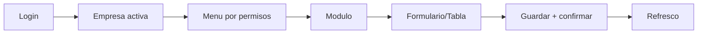

# 🛠️ Frontend y UX

## 🎯 Objetivo
Que la interfaz sea clara, consistente y segura para operacion diaria de RRHH.

## 🔄 Flujo de uso base
1. Login
2. Seleccion de empresa
3. Menu segun permisos
4. Modulo seleccionado
5. Operacion con confirmacion
6. Refresco de listado y bitacora

## 🎯 Reglas UX
- Campos obligatorios claros.
- Boton principal deshabilitado hasta validar formulario.
- Errores visibles y accionables.
- Confirmacion en acciones criticas.

## 🎯 Que pasa si...
- Usuario hace doble clic: backend debe proteger contra duplicados.
- API falla: mostrar error claro y no perder estado util.
- No hay datos: mostrar estado vacio orientado a accion.

