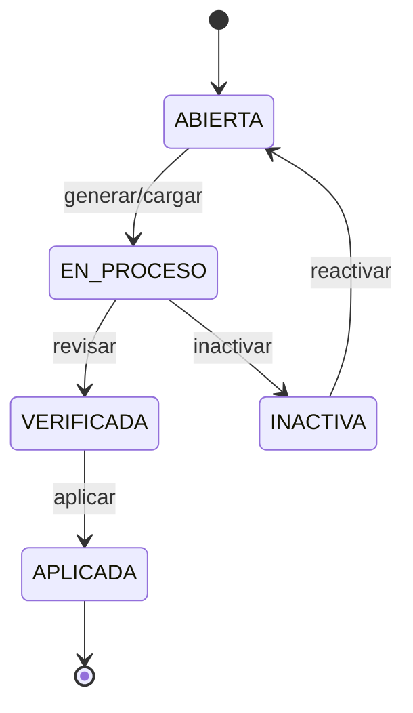
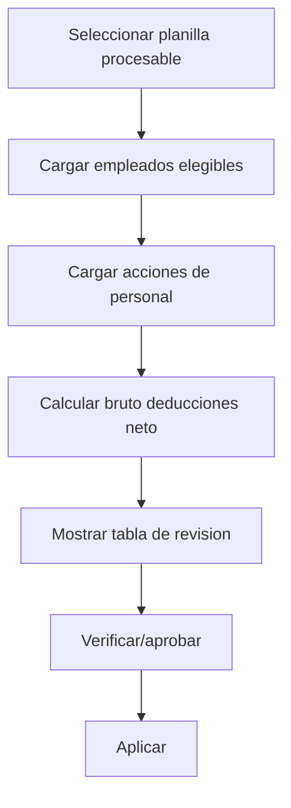
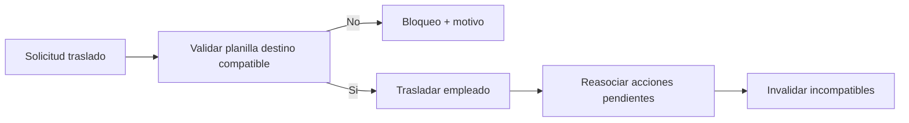

# Planilla Nomina Consolidado

Estado: vigente

Fuentes origen: 21, 34, 35, 36, 37, 38, 39, 40, 41, 42, 50

## Ciclo de vida de planilla


## Flujo generar/cargar planilla regular


## Flujo traslado interempresa y planilla



## Fuentes Integradas (Preservacion Completa)

Regla de consolidacion aplicada:
- Cada fuente original asignada a este maestro se preserva completa debajo de su encabezado.
- Esto garantiza trazabilidad y evita perdida de informacion durante la limpieza.

### Fuente: docs/21-TablaMaestraPlanillasYWorkflows.md

```markdown
# DIRECTIVA 21 — Tabla Maestra de Planillas + Políticas de Workflows Críticos

## Objetivo

Definir la tabla maestra (calendario) que gobierna qué planillas existen, y las políticas enterprise para casos borde: reapertura, acciones multi-período, traslado de empleado, cambio de período de pago, etc. Todo gobernado por workflows/eventos.

---

## 1. Tabla Maestra de Planillas — nom_calendarios_nomina

### Propósito

Esta tabla **NO** es el detalle de pagos. Es el **calendario oficial** que define:

- Qué planillas existen
- Para qué empresa
- Para qué periodo
- Qué tipo de planilla (regular, aguinaldo, liquidación, extraordinaria)
- En qué moneda se ejecuta
- Qué empleados califican (por id_periodos_pago + moneda)

**Regla:** Las acciones de personal no "escogen planilla" manualmente; se enrutan solas a la planilla abierta del periodo compatible.

### Campos Obligatorios

| Columna | Tipo | Descripción |
|---------|------|-------------|
| `id_calendario_nomina` | INT PK AI | |
| `id_empresa` | INT FK | → sys_empresas |
| `id_periodos_pago` | INT FK | → nom_periodos_pago (obligatorio) |
| `tipo_planilla` | ENUM/VARCHAR | Regular, Aguinaldo, Liquidación, Extraordinaria |
| `fecha_inicio_periodo` | DATE | Inicio periodo trabajado |
| `fecha_fin_periodo` | DATE | Fin periodo trabajado |
| `fecha_inicio_pago` | DATE | Inicio ventana de pago |
| `fecha_fin_pago` | DATE | Fin ventana de pago |
| `moneda_calendario_nomina` | ENUM | CRC, USD (obligatorio) |
| `estado_calendario_nomina` | TINYINT | Ver estados abajo |
| `es_inactivo` | TINYINT | 1=Activo, 0=Inactivo |
| `descripcion_evento_calendario_nomina` | TEXT | Opcional |
| `etiqueta_color_calendario_nomina` | VARCHAR(20) | Para UI calendario |
| `prioridad_calendario_nomina` | INT | Opcional, orden ejecución |
| `fecha_creacion`, `fecha_modificacion` | DATETIME | Auditoría |
| `creado_por`, `modificado_por` | INT | Auditoría |

**Regla:** Periodo ≠ Pago. El calendario permite mostrar "periodo trabajado" y "ventana de pago" por separado.  
**Regla (TZ):** Fechas de planilla se tratan como **date-only** (`YYYY-MM-DD`) en **hora local** para evitar desfases por zona horaria.

### Estados de Planilla (estado_calendario_nomina)

| Valor | Nombre | Editable | Reabre |
|-------|--------|----------|--------|
| 1 | Abierta | Sí | — |
| 2 | En Proceso | Sí (controlado) | — |
| 3 | Verificada | No (puede devolver a Abierta) | Sí |
| 4 | Aplicada | No | **NO** (inmutable) |
| 5 | Contabilizada | No | **NO** (final contable) |
| 6 | Notificada | No | Opcional |
| 0 | Inactiva | — | Soft disable, no rompe integridad |

### Unicidad

No puede existir más de una planilla **Abierta/En Proceso/Verificada** para:

- misma empresa
- mismo periodo (fecha_inicio_periodo, fecha_fin_periodo)
- misma moneda
- mismo tipo_planilla
- mismo id_periodos_pago

Sí pueden existir muchas planillas históricas (Aplicadas, etc.).

### Tipos de Planilla (Costa Rica)

Catálogo controlado:

- **Regular** — Planilla ordinaria
- **Aguinaldo** — Aguinaldo
- **Liquidación** — Incluye cesantía/preaviso
- **Extraordinaria** — Bonos puntuales, ajustes

---

## 2. Acciones de Personal Multi-Período

### Modelo

Una "Acción" tiene:

1. **Definición** — La intención (préstamo, deducción recurrente, subsidio)
2. **Schedule** — Distribución por períodos: qué períodos afecta y cuánto en cada uno
3. **Cuotas** — Instancias por período (tabla `acc_cuotas_accion`)

### Modos de UX

- **Modo A (Programación):** "Desde período X hasta período Y" + frecuencia + monto total / cuotas
- **Modo B (Selección explícita):** Checkboxes de períodos concretos (casos raros)

En ambos, el resultado es un schedule que genera **cuotas** por período.

### Estados de Cuota

| Estado | Descripción |
|--------|-------------|
| BORRADOR | En creación |
| PENDIENTE_APROBACION | Esperando aprobación |
| APROBADA | Aprobada, esperando planilla compatible |
| PROGRAMADA | Multi-período, pendiente de asignar a planillas |
| ASOCIADA | Asociada a planilla Abierta |
| PAGADA | Incluida en planilla Aplicada (final) |
| CANCELADA | Cancelada con motivo |
| BLOQUEADA_INCOMPATIBLE | Empresa/moneda/período no compatible |

### Evento: personal-action.scheduled

Al crear una acción multi-período:

- Se validan períodos futuros generados o generables
- Se crean cuotas por período (estado PROGRAMADA)
- Se emite `personal-action.scheduled`

**QA:** No crea cuotas en períodos Aplicados. No permite schedule que cruce empresa distinta. Idempotencia.

---

## 3. Reapertura de Período Cerrado

### Regla Enterprise

- **Aplicada / Contabilizada** = INMUTABLES. No se reabren.
- **Verificada** → puede devolverse a **Abierta** (reapertura controlada).

### Workflow: PayrollReopened

Cuando planilla pasa Verificada → Abierta:

1. Emitir evento `payroll.reopened`
2. Ejecutar recálculo controlado (solo sobre esa planilla)
3. Re-habilitar asociación de acciones/cuotas pendientes compatibles
4. **Motivo obligatorio** + auditoría

**QA:** No permite reapertura si está Aplicada/Contabilizada. Reapertura no duplica acciones.

---

## 4. Empleado Movido a Otra Empresa — Política P3 (Bloquear)

### Política Escogida: **P3 — Bloquear hasta resolver**

No se permite mover empleado si tiene cuotas/acciones activas sin planilla destino compatible. Se obliga a RRHH a decidir.

**Alternativas no escogidas:**
- P1: Auto-crear planilla destino (solo si negocio permite autogeneración)
- P2: Reprogramar al siguiente período válido

### Evento: employee.moved

Dispara **EmployeeMovedWorkflow**.

### Reglas

**4.1 Qué se mueve:** Solo entidades NO finales (Borrador, Pendiente, Aprobada, Asociada a planilla Abierta).

**4.2 Criterio de compatibilidad destino:** Debe existir planilla en empresa destino con:
- mismo id_periodos_pago
- misma moneda
- tipo_planilla compatible

**4.3 Si NO existe planilla destino compatible:** BLOQUEAR traslado. El sistema explica qué cuotas/acciones impiden el movimiento. RRHH debe resolver antes de mover.

**4.4 Regla de fecha efectiva:** Traslado **solo al inicio de periodo**. No se permite mitad de periodo.

**4.4.1 Politica de continuidad:** Por defecto es **continuidad**. Liquidacion solo aplica en escenarios de **renuncia/despido**.

**4.5 Acciones pendientes bloqueantes:** Definir lista (ej. licencias/incapacidades/aumentos pendientes). Recurrentes de ley no bloquean.

**4.6 Política por estado (acordada):**
- Se trasladan: DRAFT, PENDING_SUPERVISOR, PENDING_RRHH, APPROVED.
- No se trasladan: CONSUMED, INVALIDATED, CANCELLED, EXPIRED, REJECTED.

### 4.6.1 Politica por tipo de accion (portabilidad)

**Regla base:** todas las acciones de personal **no consumidas** se trasladan y se recalculan por calendario destino.

**Excepciones operativas:**
- Acciones de ley recurrentes (CCSS/IVM/Impuesto): **no se trasladan**. Se recalculan en la empresa destino en la planilla correspondiente.
- Si negocio define que una accion es **no portable**, debe marcarse en el workflow y quedar documentado por tipo/movimiento.

**Matriz base (default PORTABLE):**
- Ausencias: PORTABLE (por fecha efectiva/rango).
- Licencias: PORTABLE (por rango).
- Incapacidades: PORTABLE (por rango).
- Vacaciones: PORTABLE en continuidad; **liquidacion** si traslado con cierre (ver politica de continuidad).
- Horas extra: PORTABLE si fecha >= traslado.
- Bonificaciones: PORTABLE (si no existe regla de empresa contraria).
- Aumentos: PORTABLE (se aplica en planilla destino segun fecha efectiva).
- Retenciones/Descuentos: PORTABLE si son personales; si son internas de empresa, REQUIERE definicion de negocio.

**4.7 Si un rango cruza traslado:** recalcular por calendario destino (solo futuros).

**4.8 Simulación previa:** obligatoria antes de ejecutar (impacto movidas/invalidas/recalculadas).

**4.9 Auditoría:** registrar traslado con origen/destino, fecha efectiva, usuario y resumen técnico.

### Implementación base (2026-03-04)

- API de simulación y ejecución: `/api/payroll/intercompany-transfer/simulate` y `/api/payroll/intercompany-transfer/execute`.
- Tabla de auditoría: `sys_empleado_transferencias` (estado, resumen JSON, actor, fechas).
- Validaciones activas: periodo destino obligatorio, inicio de periodo, planilla origen en estados bloqueantes, reasignación de acciones/lineas por fecha.
- Pendiente: portabilidad de saldo de vacaciones (ver `docs/28-PendientesAccion.md` PEND-004).

**4.10 Nada se pierde sin motivo.** Si se cancela algo, debe ser con motivo y trazabilidad.

---

## 5. Cierre del Período (Planilla Aplicada)

### Workflow: PayrollApplied

Cuando planilla pasa a Aplicada:

1. Todas las cuotas/acciones asociadas pasan a **Pagada**
2. Cuotas pendientes que apuntaban a ese período: si no entraron, quedan "Pendiente no ejecutada" con motivo (auditoría)
3. Bloquear edición de planilla, cuotas pagadas, cálculos

**QA:** Ninguna cuota pagada se puede editar. Correcciones → ajuste en período futuro.

---

## 6. Cambio de Período de Pago del Empleado

### Evento: employee.pay_period_changed

**Workflow PayPeriodChangedWorkflow:**

- Cuotas futuras: reprogramar al nuevo calendario (si política lo permite) o bloquear hasta decisión
- Cuotas ya asociadas a planilla abierta: revalidar compatibilidad; si no compatible → desasociar, estado "Pendiente" con motivo

**QA:** No duplicar cuotas. No dejar cuotas sin estado.

---

## 7. Cambio de Moneda del Empleado

- Cuota se paga en la moneda definida en la cuota
- Si cambia moneda del empleado: no reescribir histórico
- Cuotas futuras: política por definir (Fase 2)
- Si hay mismatch: cuota queda "Pendiente por incompatibilidad" con motivo

---

## 8. Cambio de Email del Empleado

Ya implementado: **IdentitySyncWorkflow** escucha `employee.email_changed`.

---

## 9. Catálogo de Eventos Confirmados

| Evento | Cuándo |
|--------|--------|
| `payroll.opened` | Planilla creada (Abierta) |
| `payroll.verified` | Planilla verificada |
| `payroll.applied` | Planilla aplicada (inmutable) |
| `payroll.reopened` | Planilla Verificada → Abierta |
| `payroll.deactivated` | Planilla inactivada |
| `employee.moved` | Empleado trasladado a otra empresa |
| `employee.pay_period_changed` | Cambió período de pago del empleado |
| `employee.email_changed` | Cambió email (→ IdentitySyncWorkflow) |
| `personal-action.created` | Acción creada |
| `personal-action.approved` | Acción aprobada |
| `personal-action.rejected` | Acción rechazada |
| `personal-action.scheduled` | Acción multi-período programada |
| `personal-action.canceled` | Acción/cuota cancelada |

---

## 10. Matriz de Estados (QA)

### Por Cuota/Acción

- Borrador, Pendiente aprobación, Aprobada, Programada, Asociada a planilla Abierta
- Pagada (final), Cancelada (final con motivo), Bloqueada por incompatibilidad

### Por Planilla Calendario

- Abierta, En Proceso, Verificada
- Aplicada (final), Contabilizada (final)
- Inactiva (soft)

---

## Actualizacion 2026-02-27 - Compatibilidad v2 ejecutable

Se aprueba evolucion incremental sin reemplazo destructivo del esquema actual.

Lineamientos:
- Mantener `nom_calendarios_nomina` y su naming actual en Fase 1.
- Agregar nuevas capacidades por migracion incremental (`ALTER`) sin renames duros.
- Centralizar mapping de estados numericos como fuente de verdad.
- Implementar unicidad operativa con `slot_key + is_active` para permitir historicos.
- Seedear permisos `payroll:*` en `hr_pro` antes de habilitar flujo completo.

Referencia canonica:
- `docs/40-BlueprintPlanillaV2Compatible.md`

### Implementado (sin NetSuite)

- Tablas de corrida:
  - `nomina_empleados_snapshot`
  - `nomina_inputs_snapshot`
  - `nomina_resultados`
- Flujo operativo en API:
  - `process`: `Abierta -> En Proceso` con snapshot + ligue de acciones aprobadas + resultados base.
  - `verify`: requiere snapshot y resultados; inputs o cargas sociales configuradas para permitir `En Proceso -> Verificada`.
- Se mantiene inmutabilidad de `Aplicada`.

Pendiente fuera de este bloque:
- Envio/reintento NetSuite.

## Actualizacion operativa 2026-02-27 (bitacora + filtros + UX)

### Bitacora obligatoria de planilla

Regla formal:
- Toda transicion o cambio de datos de planilla debe auditarse en `sys_auditoria_acciones`.
- No se acepta bitacora solo tecnica para planilla.

Acciones auditadas:
- create
- update
- process
- verify
- apply
- reopen
- inactivate

Consulta:
- `GET /api/payroll/:id/audit-trail`

Salida esperada:
- actor
- fecha
- descripcion
- cambios por campo (`antes` / `despues`)

### Filtro de listado por rango de fechas

Se adopta filtro por traslape de periodo:
- `fecha_fin_periodo >= fechaDesde`
- `fecha_inicio_periodo <= fechaHasta`

Parametros:
- `fechaDesde`
- `fechaHasta`
- `idEmpresa`
- `includeInactive`

Default UI:
- `hoy - 1 mes` a `hoy + 1 mes`

### Edicion de planilla (regla UX)

- El modal de edicion debe abrir inmediatamente.
- Mientras llega detalle remoto debe mostrar preload.
- La cabecera de nombre generado no debe vaciarse en edicion.

### Calendario operativo de planilla (regla UX)

- Vista mensual y vista timeline para lectura operativa.
- Filtros obligatorios: empresa, moneda, tipo de planilla, estado, periodo de pago.
- En vista mensual:
  - mostrar inicio de periodo y fecha de pago (no repetir la planilla en todos los dias del rango).
  - si no hay datos, mantener calendario visible y mostrar aviso informativo.
- Panel lateral de detalle con:
  - datos funcionales en espanol (sin terminos tecnicos internos).
  - acciones `Procesar`, `Verificar`, `Aplicar` segun estado y permisos.
  - confirmacion obligatoria antes de ejecutar cada accion.
  - `Verificar` bloqueado si no existen movimientos procesados y no hay cargas sociales configuradas (snapshot inputs = 0 y cargas sociales = 0).

## Actualizacion 2026-03-08 - Flujo operativo de Inactivar/Reactivar planilla

### Inactivar planilla
- No permite inactivar estados finales contables (Aplicada/Contabilizada).
- Desasocia acciones no finales (`DRAFT`, `PENDING_SUPERVISOR`, `PENDING_RRHH`, `APPROVED`).
- Las acciones desasociadas pasan a `PENDING_RRHH`.
- Se persiste snapshot por accion en `acc_planilla_reactivation_items` para reactivacion posterior.

### Reactivar planilla
- Solo aplica para planilla en estado Inactiva.
- La planilla vuelve a estado Abierta.
- Reactivacion parcial: reasocia acciones elegibles; no elegibles se mantienen `PENDING_RRHH` con motivo.

### Consistencia de datos en UI
- Mutaciones invalidan cache server-side.
- `Refrescar` usa cache-buster (`cb`) para forzar datos nuevos sin esperar TTL.

- Disparadores automaticos de reasignacion: `payroll.create`, `payroll.reopen`, `payroll.reactivate`.
- Safety net operativo: job programado cada 5 minutos que intenta reasignar huérfanas pendientes de snapshot a planillas operativas elegibles.


### Nombre de Planilla con Consecutivo (2026-03-09)
- Regla: al crear planilla, el nombre se persiste con sufijo consecutivo de 4 digitos: BASE-0001, BASE-0002, etc.
- Implementacion: consecutivo basado en id_calendario_nomina para evitar colisiones en concurrencia.
- Si el nombre enviado ya termina en -dddd, se normaliza la base y se vuelve a generar el sufijo oficial.

## Actualizacion 2026-03-09 - Reasociacion estricta e invalidacion por traslado

- Los snapshots de reactivacion (cc_planilla_reactivation_items) solo pueden reasociarse automaticamente cuando la planilla destino coincide exactamente con la planilla origen del snapshot en: periodo de pago, tipo de planilla, moneda, periodo nomina, fecha corte, ventana de pago y fecha de pago programada.
- Al ejecutar traslado interempresas, los snapshots pendientes de las acciones trasladadas se marcan como INVALIDATED_BY_TRANSFER para que no vuelvan a entrar en flujo de reactivacion de la planilla anterior.
- Si no existe planilla exacta compatible, la accion se mantiene en PENDING_RRHH para resolucion manual de RRHH.

## Actualizacion 2026-03-09 - Validacion robusta E2E (datos reales)

### Escenario A validado (inactivar -> planilla exacta -> reasignar)
- Resultado: funcional y consistente.
- Al inactivar, las acciones no finales quedan desasociadas y con snapshot pendiente.
- Al existir planilla exacta compatible, la reasignacion automatica recupera las acciones huerfanas.

### Escenario B validado (inactivar -> traslado -> invalidar snapshot)
- Resultado: parcialmente validado.
- Simulacion de traslado: ya identifica y asigna planillas destino por fecha cuando hay cobertura.
- Execute: no completa si existen acciones bloqueantes o si ocurre conflicto tecnico en ledger de vacaciones.

### Criterios operativos para que B complete
1. El empleado no debe tener acciones bloqueantes en estados activos de bloqueo.
2. Debe existir planilla destino compatible para todas las fechas requeridas.
3. El flujo de traslado no debe colisionar en la tabla de ledger de vacaciones.

### Regla de QA para reproduccion enterprise
- Antes de afirmar "traslado completo", validar en SQL:
  - estado final de transferencia;
  - empresa del empleado;
  - `id_calendario_nomina` en acciones trasladadas;
  - snapshots en `acc_planilla_reactivation_items` (`INVALIDATED_BY_TRANSFER` cuando aplica).

## Actualizacion 2026-03-09 - Criterio final de fechas para compatibilidad

Regla operativa confirmada por negocio:
- Para compatibilidad de planilla en reasociacion/reactivacion, solo se validan fechas de periodo:
  - `Inicio Periodo`
  - `Fin Periodo`

No bloquean compatibilidad por variacion entre empresas:
- `Fecha Corte`
- `Inicio Pago`
- `Fin Pago`
- `Fecha Pago Programada`

Se mantienen como obligatorios de compatibilidad:
- empresa objetivo,
- periodo de pago,
- tipo de planilla,
- moneda,
- inicio/fin de periodo.

## Actualizacion 2026-03-09 - Politica de bloqueo por tipo de accion (ajuste)

Regla vigente:
- No se bloquea traslado por tipo de accion (`licencia`, `incapacidad`, `aumento`) si la accion esta en estado trasladable.
- El bloqueo se decide por:
  1) estados finales/no trasladables,
  2) falta de planilla destino para fechas requeridas,
  3) validaciones estructurales del traslado.

Objetivo:
- Permitir continuidad operativa enterprise y evitar bloqueo innecesario de traslados cuando las acciones pendientes son trasladables por diseno.

## Actualizacion 2026-03-09 22:36:56 -06:00 - Menu y permiso Generar Planilla

Se incorpora control dedicado para generacion de planilla en Gestion Planilla:
- Menu habilitado: Planillas > Generar Planilla.
- Se ocultan otras acciones de ese submenu para este flujo.
- Permiso nuevo: payroll:generate.
- Ruta dedicada: /payroll-management/planillas/generar.
- Vista inicial: placeholder con encabezado "Generar Planilla" para continuar construccion funcional.

## Actualizacion 2026-03-09 22:45:09 -06:00 - Ajuste final de navegacion Gestion Planilla

Regla vigente de navegacion:
- En Gestion Planilla deben coexistir dos opciones:
  1. Planillas > Generar Planilla (flujo de generacion).
  2. Traslado Interempresas (flujo de traslado).

No son el mismo flujo ni una opcion reemplaza a la otra.

Permisos operativos:
- payroll:generate controla Generar Planilla.
- payroll:intercompany-transfer controla Traslado Interempresas.

Nota operativa:
- Si no aparece Gestion Planilla tras deploy, validar migraciones y existencia de payroll:generate en BD.

## Actualizacion 2026-03-09 22:50:09 -06:00 - Vista Generar Planilla (fase inicial)

Se habilita flujo inicial en Gestion Planilla > Planillas > Generar Planilla:
- Campo Empresa (fuente de verdad del filtro).
- Campo Moneda.
- Lista de planillas cargada por empresa seleccionada.
- Moneda aplicada como filtro en la vista.

Regla aplicada:
- La carga depende de los campos del propio formulario/vista (empresa, moneda), no de filtros externos de otras pantallas.

Alcance actual:
- Fase de consulta y preparacion operativa para generar.
- Pendiente siguiente fase: formulario completo de apertura de planilla + validaciones de creacion.

## Actualizacion 2026-03-09 23:09:00 -06:00 - Generar Planilla: solo planillas procesables

Ajuste funcional en la vista Generar Planilla:
- Planillas por Empresa y Moneda se mantiene como Select.
- Solo se listan planillas en estado Abierta (estado 1), porque el endpoint de proceso permite procesar exclusivamente planillas en ese estado.
- Se excluyen inactivas y cualquier estado no procesable.

Regla vigente:
- Si el objetivo es **Procesar**, el estado aplicable es unicamente **Abierta**.

## Actualizacion 2026-03-09 23:20:00 -06:00 - Generar Planilla: filtro por tipo de periodo

Ajuste en la vista Generar Planilla:
- Se agrega selector Tipo de periodo de pago (catalogo pay-periods).
- El listado de planillas (Select) ahora se filtra por:
  - Empresa
  - Moneda
  - Tipo de periodo de pago
  - Estado Abierta
- En cada opcion de planilla se muestra explicitamente el nombre del periodo de pago (ejemplo: Quincenal).

Objetivo:
- Evitar ambiguedad cuando existan multiples planillas abiertas por diferentes periodos de pago.

## Actualizacion 2026-03-09 23:35:00 -06:00 - Generar Planilla: panel de detalle de seleccion

Mejora UX en Generar Planilla:
- Al seleccionar una planilla en el Select, se muestra un panel de detalle debajo con:
  - Empresa
  - Tipo de periodo de pago
  - Moneda
  - Fecha inicio/fin de periodo
  - Inicio/fin de pago
  - Fecha pago programada
  - Tipo de planilla
  - Estado visual

Regla de limpieza de seleccion:
- Si cambia Empresa, Moneda, Tipo de periodo o se pulsa Refrescar, se limpia la planilla seleccionada y su panel.
- Si la planilla seleccionada deja de cumplir filtros, tambien se limpia automaticamente.

## Actualizacion 2026-03-09 23:48:00 -06:00 - Generar Planilla Regular (alcance actual)

Ajuste de nomenclatura y alcance de la vista:
- Menu actualizado a Generar Planilla Regular.
- Titulo de vista actualizado a Generar Planilla Regular.
- El selector de planillas filtra unicamente planillas de tipo Regular.
- Se mantiene filtro de estado Abierta para compatibilidad con proceso.

Nota de alcance:
- Liquidacion, Aguinaldo y otras variantes se trabajaran en vistas separadas.

## Actualizacion 2026-03-10 00:05:00 -06:00 - Panel de detalle completo en Generar Planilla Regular

Se corrige y amplifica el detalle de planilla seleccionada:
- Fuente de detalle: GET /payroll/:id al seleccionar planilla.
- Se corrige lectura de fechas de periodo usando echaInicioPeriodo y echaFinPeriodo.
- El panel expone campos operativos y tecnicos disponibles desde BD/API (ids, estado, flags, fechas de creacion/modificacion, version, referencia externa, slot, descripcion de evento, etc.).

Regla de consistencia UX:
- Al cambiar filtros (empresa, moneda, periodo) o refrescar, se limpia la seleccion y su detalle para evitar datos cruzados.

## Actualizacion 2026-03-10 00:20:00 -06:00 - Detalle de planilla simplificado para usuario

Ajuste UX en Generar Planilla Regular:
- Se reemplaza el panel tecnico amplio por un resumen funcional rapido.
- Se muestran unicamente campos clave para identificacion y operacion de la planilla:
  - Empresa
  - Tipo de periodo
  - Moneda
  - Fecha inicio/fin periodo
  - Fecha corte
  - Fecha inicio/fin pago
  - Fecha pago programada
  - Tipo planilla
  - Estado

Se mantiene internamente la carga por GET /payroll/:id para consistencia de datos.

## Actualizacion 2026-03-10 00:55:00 -06:00 - Flujo Cargar Planilla Regular

Se actualiza la vista operativa para enfocarla en carga previa a revision:
- Texto funcional de la vista: Cargar Planilla Regular.
- Boton nuevo: Cargar planilla (sobre planilla seleccionada).
- Al ejecutar, se llama al proceso backend de planilla para cargar empleados y acciones de personal elegibles.
- Despues de cargar, se consulta y muestra resumen (snapshot-summary) con indicadores clave:
  - Empleados cargados
  - Acciones ligadas
  - Inputs generados
  - Total bruto / deducciones / neto

Regla UX aplicada:
- Si cambian filtros (empresa, moneda, periodo) o se refresca, se limpia seleccion, detalle y resumen para evitar mezcla de contexto.

## Actualizacion 2026-03-10 01:25:00 -06:00 - Cargar Planilla Regular: conservar seleccion post-carga

Correccion aplicada al flujo de Cargar Planilla Regular:
- La vista ahora considera estados operativos Abierta y En Proceso para mantener visible la planilla luego de ejecutar Cargar planilla.
- Se evita que la seleccion se limpie automaticamente al cambiar el estado desde Abierta hacia En Proceso.
- Se actualiza el texto del selector para reflejar correctamente los estados visibles.

Objetivo:
- Mantener continuidad del flujo operativo (cargar -> revisar) sin perder la planilla seleccionada tras la carga.

## Actualizacion 2026-03-10 01:40:00 -06:00 - Cargar Planilla Regular: sin modal ni resumen numerico

Ajuste UX del boton de carga:
- Se elimina modal de confirmacion al pulsar Cargar planilla.
- La accion ejecuta precarga directa con estado loading en el boton.
- Se elimina bloque de resumen numerico post-carga (Empleados cargados, Acciones ligadas, Inputs, Totales).

Criterio funcional aplicado:
- Esta vista queda enfocada en disparar precarga para construir tabla de revision, sin mostrar resumen intermedio en ese bloque.

## Actualizacion 2026-03-10 02:10:00 -06:00 - Cargar Planilla: genera tabla de revision (no resumen)

Cambio funcional en Gestion Planilla > Cargar Planilla Regular:
- El boton Cargar planilla ahora ejecuta flujo de carga de tabla operativa por empleado.
- Se elimina en la vista el bloque de resumen numerico (empleados/acciones/totales) como salida principal.
- Se renderiza tabla con columnas de revision salarial y deducciones por empleado, con detalle expandible de acciones.

Alineacion con legacy:
- Patron equivalente a GenerarPlanillas_lista.jsx: el boton dispara carga y luego muestra componente/tabla de detalle.
- Patron de calculo alineado a Planilla_empleados_cargar.js (devengado, cargas sociales, renta, neto y detalle de acciones).

Endpoints nuevos de soporte:
- PATCH /payroll/:id/load-table  -> carga/genera snapshot de tabla para vista de revision.
- GET /payroll/:id/snapshot-table -> retorna tabla cargada (empleados + acciones).

Regla de estado operativa para carga:
- Carga permitida en estados Abierta o En Proceso.
- Mensaje actualizado para evitar semantica de "procesar" en esta vista.

## Actualizacion 2026-03-10 02:45:00 -06:00 - Cargar Planilla: datos sensibles en tabla de empleados

Correccion aplicada para evitar mostrar valores cifrados (enc:v1:...) en el listado de empleados:
- Backend (GET /payroll/:id/snapshot-table):
  - Se desencriptan nombre y apellidos cuando el usuario tiene permiso sensible.
  - Permisos evaluados por empresa de la planilla: payroll:view_sensitive (principal) y compatibilidad con employee:view-sensitive.
  - Si no tiene permiso sensible, no se exponen nombres desencriptados y se mantiene fallback no sensible (Empleado #ID).
- Frontend (Cargar Planilla Regular):
  - Columnas monetarias y de devengado se enmascaran como *** cuando el usuario no tiene payroll:view_sensitive.

Objetivo:
- Mantener consistencia con la regla transversal del sistema: usuario con permiso sensible ve datos completos; sin permiso sensible ve datos protegidos.

## Actualizacion 2026-03-10 03:20:00 -06:00 - Correccion de calculo y detalle en tabla de Cargar Planilla

Se corrige inconsistencia donde la tabla mostraba montos en 0.00 y detalle vacio:
- salario_base_empleado venia cifrado y se estaba parseando directo a Number, provocando 0.00.
- Ahora el calculo de planilla desencripta salario base antes de convertir a monto.
- El snapshot de tabla ahora incluye tambien deducciones generadas por planilla (CCSS e impuesto renta) dentro de cciones, no solo acciones de personal aprobadas.
- Se normaliza 	ipoSigno para clasificar correctamente deducciones de CCSS/renta como -.

Resultado esperado:
- Columnas Salario Base, Salario Quincenal Bruto, Cargas Sociales, Impuesto Renta, Monto Neto dejan de salir en 0 cuando hay salario/cargas en BD.
- Detalle de acciones de personal muestra al menos CCSS/renta generadas en corrida aunque no existan acciones de personal adicionales.

## 2026-03-10 - Ajuste UI Cargar Planilla Regular

- Se agrego seleccion por checkbox por empleado en la tabla principal de "Tabla de empleados y acciones".
- Se agregaron dos tarjetas de resumen al final de la tabla:
  - Informacion de Empleados (total, verificados, pendientes).
  - Totales Monetarios (devengado, cargas, renta, neto total).
- El boton "Cargar planilla" se movio fuera del bloque "Detalle de la planilla".
- Al cargar la tabla exitosamente, el panel "Detalle de la planilla" se colapsa automaticamente para priorizar la visualizacion de la tabla.

## 13. Formula operativa de tabla "Tabla de empleados y acciones" (vigente)

Campos visibles en la tabla:
- Salario Base
- Salario Quincenal Bruto
- Devengado (dias)
- Cargas Sociales
- Impuesto Renta
- Monto Neto
- Dias

Reglas de calculo (compatibles con legacy `Planilla_empleados_cargar.js`):

1) Salario Base
- Fuente: salario base del empleado en su empresa actual.
- Se muestra en moneda de la corrida.

2) Salario Quincenal Bruto
- Si periodo de pago es Quincenal: `salario_base / 2`.
- Si periodo de pago es Mensual: `salario_base`.
- Si empleado ingreso dentro del periodo, se recalcula proporcional por dias.

3) Devengado (dias)
- Base de dias:
  - Quincenal: 15
  - Mensual: 30
- Se resta por acciones no remuneradas que descuentan dias (ausencias/licencias sin goce, vacaciones, incapacidades segun regla).
- Nunca baja de 0.

4) Cargas Sociales
- Se calculan sobre el devengado del periodo.
- Formula: `monto_carga = devengado * porcentaje_carga` por cada carga activa de la empresa.
- Total Cargas Sociales = suma de todas las cargas configuradas.
- Regla enterprise: las cargas sociales son de empresa (recurrentes), no dependen de que exista accion personal manual.

5) Impuesto Renta
- Mensual: tramo progresivo definido por regla de negocio.
- Quincenal: se aplica cuando corresponde a segunda quincena (fecha fin del periodo en rango de segunda quincena), con logica de acumulacion definida en backend.
- Si no aplica por periodo/tramo, valor = 0.

6) Monto Neto
- Formula: `neto = devengado - cargas_sociales - impuesto_renta - deducciones - retenciones`.

7) Dias
- Se muestra el total final de dias devengados para el calculo del empleado.

Regla de precision:
- Calculo interno con precision controlada.
- Presentacion en UI con formato monetario local y redondeo de visualizacion.

## 14. Reglas de carga de datos para el detalle por empleado

Cuando se carga una planilla:
- Si una accion personal cumple reglas de inclusion (estado, fecha efectiva, empresa, planilla), debe aparecer en "Detalle de acciones de personal".
- Las cargas sociales tambien se reflejan como detalle por empleado cuando la empresa tiene `nom_cargas_sociales` activas.

Diagnostico operativo documentado:
- Si la empresa no tiene registros en `nom_cargas_sociales`, la tabla mostrara cargas en 0.
- Si no hay acciones asociadas al calendario, el detalle por empleado mostrara "No hay datos".

## 15. Cambios UI aplicados en Cargar Planilla Regular (2026-03-10)

Cambios confirmados:
1. Boton "Cargar planilla" movido fuera del panel de detalle (fuera del collapse completo).
2. Al cargar tabla exitosamente, el panel de detalle se colapsa automaticamente para priorizar la tabla.
3. Tabla principal con checkbox por empleado (seleccion por fila).
4. Se agregan 2 tarjetas al final de la tabla:
   - Informacion de Empleados.
   - Totales Monetarios.

Resumenes visibles agregados:
- Total Empleados.
- Empleados Verificados.
- Pendientes de Verificar.
- Devengado (Quincenal).
- Cargas Sociales.
- Impuesto Renta.
- Monto Neto Total.

Nota:
- El resumen monetario respeta permiso sensible (`payroll:view_sensitive`): sin permiso, la UI enmascara valores.
```

### Fuente: docs/34-CasosUsoCriticosPlanillaRRHH.md

```markdown
# KPITAL 360  DOC-34  
# Casos de Uso Crticos de Planilla y RRHH

**Catlogo de Validaciones, Riesgos y Checklist de Auditora para Integracin de Planillas**  
**Versin 1.1 | Febrero 2026 | Uso Interno**

---

- UI: se elimin? la secci?n "Planillas en las que entrar?a" en el modal de vacaciones. La asignaci?n es interna.


- Solape de planillas: si una fecha coincide con m?ltiples planillas ABIERTAS/EN_PROCESO, **no se bloquea** la selecci?n. Se asigna autom?ticamente por prioridad: estado ABIERTA > EN_PROCESO; si empatan, menor fecha de inicio; si empatan, menor ID.
- Se muestra advertencia en UI cuando hay fechas solapadas.

## Propsito de este documento

Este documento cataloga todos los casos de uso crticos que deben validarse antes y durante la implementacin del mdulo de Planillas y Acciones de Personal en KPITAL 360. Sirve como gua de anlisis para el ingeniero responsable, como referencia de riesgos arquitectnicos, y como lista de verificacin permanente para futuras integraciones.

---

## 1. Contexto y alcance

KPITAL 360 opera sobre un modelo de bounded contexts donde **Employee Management** es el Sistema de Registro (SoR) del empleado. Las planillas tienen estados inmutables una vez aplicadas, y las acciones de personal pasan por flujos de aprobacin antes de asociarse a una planilla. Este documento aborda los puntos de colisin entre la gestin del empleado (ya implementada) y la futura gestin de planillas y acciones de personal.

**Regla fundamental:** Una planilla en estado **APLICADA** es inmutable. Nunca se modifica. Cualquier correccin posterior se maneja como accin de personal en la siguiente planilla.

- **Estados de planilla:** Abierta  Verificada  Distribucin  Aplicada (inmutable)  Inactiva  
- **Estados de accin de personal:** Borrador  Pendiente aprobacin  Aprobada  Asociada a planilla  Pagada / Cancelada  

---

## 2. Catlogo de casos de uso crticos

(Ver tabla completa en versin interna. Resumen por categora:)

- **2.1 Inactivacin y liquidacin de empleados:** UC-01 a UC-04 (planillas abiertas, acciones pendientes, liquidacin con planilla en distribucin, exclusin en planilla siguiente).
- **2.2 Cambio de empresa (traslado):** UC-05 a UC-08 (planilla abierta origen, acciones pendientes, periodo de pago distinto, provisin aguinaldo).
- **2.3 Cambio de salario y reclculo:** UC-09 a UC-13 (aumento en planilla abierta, mltiples planillas abiertas, planilla verificada, salario vigente por periodo, retroactivo).
- **2.4 Modificacin de datos crticos del empleado:** UC-14 a UC-17 (periodo de pago, CCSS, cuenta bancaria, tipo contrato).
- **2.5 Integridad multiempresa y acceso:** UC-18 a UC-21 (inactivar empresa con planillas activas, acceso por empresa, supervisor cross-empresa, empleado ve solo su planilla).
- **2.6 Consistencia de clculos legales (Costa Rica):** UC-22 a UC-27 (CCSS, renta, proporcional, aguinaldo, cesanta, vacaciones).
- **2.7 Auditora e idempotencia:** UC-28 a UC-31 (evento duplicado, correccin planilla aplicada, auditora aprobador, rollback planilla abierta).

---

## 3. Manejo de reclculo por cambio de salario

Cuando un empleado tiene varias planillas abiertas y se aprueba un aumento: recalcular todas las planillas en estado **Abierta** del empleado en esa empresa; planillas **Verificada** segn poltica (devolver a Abierta con auditora); **Aplicada** no se toca.

**Requerimiento arquitectnico:** Tabla **emp_historial_salarios** como fuente de verdad del salario vigente por fecha. El motor de planilla no debe usar solo el campo salario actual de sys_empleados.

---

## 4. Checklist de auditora para el ingeniero

- **4.1 Base de datos:** Historial de salarios, UNIQUE codigo por empresa, UNIQUE planilla operativa, proteccin fsica planilla aplicada, auditora de cambios de estado, historial periodo de pago.
- **4.2 API/Backend:** 409 en inactivar empleado (planillas/acciones), 409 en traslado, validacin id_empresa, motor usa historial salarial, handlers idempotentes, permisos por empresa.

## 6. Resultados por empleado (reporte RRHH)

### Necesidad operativa

RRHH requiere:
- Totales por planilla (bruto, neto, cargas sociales, impuesto renta, devengado).
- Detalle por empleado con acciones de personal para auditora.

### Lineamiento actual

1. Persistir resultados **normalizados** por empleado en `nomina_resultados` (campos adicionales).
2. Persistir **snapshot JSON** completo por planilla para trazabilidad.
3. Devengado real se usa como base de provisin de aguinaldo y traslados interempresas.
- **4.3 Lgica de negocio:** Definir estados bloqueantes (PEND-002), poltica planilla Verificada + SalaryIncreased, tramos renta configurables, rubros gravables, jornada parcial.
- **4.4 Frontend:** Mostrar detalle en 409, campos sensibles como '--', advertencia en acciones que afectan salario, estados de planilla visibles y acciones deshabilitadas segn estado.

---

## 5. Directivas arquitectnicas

- **Regla 1:** Inmutabilidad de planilla aplicada.  
- **Regla 2:** Historial salarial como fuente de verdad.  
- **Regla 3:** Validacin siempre en backend.  
- **Regla 4:** Idempotencia en eventos crticos.  
- **Regla 5:** Auditora completa e inmutable.  

Transiciones prohibidas: desde APLICADA a cualquier otro estado; VERIFICADA  ABIERTA sin auditora; saltar a APLICADA sin secuencia.

---

## 6. Resumen ejecutivo

- 31 casos de uso en 7 categoras; 17 crticos.  
- **21 tems** de verificacin en checklist de auditora (4 reas: 4.1 DB 6, 4.2 API 6, 4.3 Negocio 5, 4.4 Frontend 4); 5 decisiones de negocio pendientes.  
- Acciones inmediatas: crear tabla emp_historial_salarios; definir polticas con negocio; 409 en inactivar empleado/empresa ya implementados (ver DOC-35 y Reporte Comit); auditar BD; referenciar este documento en DOC-00.  

**Nota para el siguiente ingeniero:** Este documento es vivo. Cada nuevo caso de uso debe agregarse con ID correlativo (UC-32, UC-33) antes de implementar.

---

## 7. Registro de cambios

| Versin | Fecha | Cambio |
|---------|--------|--------|
| 1.0 | Feb 2026 | Versin inicial. Catlogo UC-01 a UC-31, checklist, directivas. |
| 1.1 | 24 Feb 2026 | Correccin: resumen ejecutivo actualizado de "24 tems" a **21 tems** de verificacin en 4 reas (conteo real: 4.1=6, 4.2=6, 4.3=5, 4.4=4). Referencia a implementacin 409 en DOC-35. |

---

*Documento completo (tablas UC-01 a UC-31 y checklist detallado) se mantiene como referencia interna. ndice general: docs/00-Indice.md. Estado de implementacin: docs/35-EstadoDOC34Implementacion.md. Reporte ejecutivo Comit: docs/37-ReporteEjecutivoDOC34-ComiteTecnico.md.*

---
## Actualizaci?n 2026-03-04 ? Reglas enterprise adicionales (TimeWise + Traslados)

- TimeWise: el empleado no selecciona periodo de pago; el sistema asigna planilla por fechas + calendario + corte.
- Licencias largas generan acciones por periodo (no se reutiliza una sola acci?n).
- Aumentos: fecha efectiva definida por supervisor/RRHH; se aplica en planilla correspondiente.
- Horas extra: asignaci?n por fecha real y corte de planilla.
- Traslado masivo: validaci?n batch + revalidaci?n final; ejecuci?n por job backend; reubicaci?n de acciones futuras por fecha efectiva.
- Bloqueo obligatorio si **no existen periodos en empresa destino**.
- Traslado **solo al inicio de periodo** (no mitad de periodo).
- Acciones recurrentes de ley no bloquean.
- Politica por tipo de accion (portabilidad) definida en DOC-42 y DOC-21.
- Simulacion previa obligatoria antes de ejecutar.

---
## Actualizaci?n 2026-03-02 ? Vacaciones sin selecci?n de planilla (ACTUALIZACION-VACACIONES-2026-03-02
UI-PLANILLAS-REMOVIDA-2026-03-02
SOLAPE-PLANILLAS-2026-03-02)
- KPITAL (RRHH): el usuario ya no selecciona planilla en Vacaciones. Selecciona fechas y movimiento; el sistema determina la planilla elegible por cada fecha con base en calendario de n?mina (empresa/empleado/moneda/periodo).
- Validaciones: fines de semana y feriados bloqueados; fechas ya reservadas bloqueadas; saldo disponible; fechas deben pertenecer a un periodo elegible; si una fecha coincide con m?ltiples periodos, se rechaza.
- Consistencia de tipo: todas las fechas deben pertenecer al mismo tipo de planilla. Si no, error.
- Split autom?tico en creaci?n: si las fechas caen en m?s de un periodo del mismo tipo, se crean acciones separadas por periodo. En edici?n, solo se permite un periodo.
- Persistencia: `acc_vacaciones_fechas` y `acc_cuotas_accion` guardan `id_calendario_nomina` por fecha; el header de acci?n puede quedar con `id_calendario_nomina = NULL`.
- TimeWise: acciones de vacaciones se crean en estado Borrador sin planilla. RRHH completa fechas/movimiento en KPITAL; el sistema asigna planilla por fecha.
- Planilla: al cargar una planilla se consumen las fechas cuyo `id_calendario_nomina` coincide con la planilla y estado aprobado. No se requiere que el header tenga planilla.
---
## Actualizacion 2026-03-04 - Resultados por planilla (Implementado)

- `nomina_resultados` extendida con devengado/salario bruto periodo/cargas/impuesto.
- Tabla nueva `nomina_planilla_snapshot_json` con snapshot JSON completo por planilla.
- La base de devengado sirve para provisiones de aguinaldo y traslados interempresas.
- Bloqueo operativo: si el empleado esta verificado en una planilla, no se permiten nuevas acciones que apunten a esa planilla hasta desmarcar verificacion.
- CCSS e impuesto de renta se calculan en `process` y quedan visibles antes de verificar.
- Verificacion permitida con `inputs = 0` si la empresa tiene cargas sociales activas configuradas.
```

### Fuente: docs/35-EstadoDOC34Implementacion.md

```markdown
# Estado DOC-34 vs implementacin

**Objetivo:** Dejar claro qu existe hoy, qu se puede validar ya en cdigo, y qu an no tiene validacin. Referencia para auditora y para el ingeniero. **Alineado con Reporte Ejecutivo Comit DOC-34 v2.0** (docs/37-ReporteEjecutivoDOC34-ComiteTecnico.md).

---

- UI: se elimin? la secci?n "Planillas en las que entrar?a" en el modal de vacaciones. La asignaci?n es interna.


- Solape de planillas: si una fecha coincide con m?ltiples planillas ABIERTAS/EN_PROCESO, **no se bloquea** la selecci?n. Se asigna autom?ticamente por prioridad: estado ABIERTA > EN_PROCESO; si empatan, menor fecha de inicio; si empatan, menor ID.
- Se muestra advertencia en UI cuando hay fechas solapadas.

## Resumen rpido: Lo que S hay / Lo que NO hay

| rea | S hay (implementado) | NO hay (pendiente) |
|------|------------------------|---------------------|
| **API / Backend** | 409 en inactivar empleado (UC-01 planillas, UC-02 acciones). 409 en inactivar empresa (UC-18). Detalle en body (planillas/acciones). | 409 en liquidar (UC-03/04). Validacin id_empresa en endpoints planilla (UC-19, UC-21). Motor con historial salarial. Handlers idempotentes. Permisos payroll por empresa. |
| **Frontend** | Detalle del 409 al inactivar empleado (hook, lista planillas/acciones). Detalle del 409 al inactivar empresa (mensaje + lista planillas). | Advertencia de reclculo en formularios de acciones de personal. Estados visuales de planilla y acciones deshabilitadas por estado. Campos sensibles '--' en revisin. |
| **Empleados (SoR)** | Mdulo funcional. Bloqueos 409 de inactivacin (UC-01, UC-02) completados. | Validaciones en liquidar (UC-03/04). Confirmacin men. |
| **Base de datos** | Tablas `nom_calendarios_nomina`, `acc_acciones_personal`. | Tabla `emp_historial_salarios`. UNIQUE planilla operativa. Proteccin fsica planilla aplicada. Auditora cambios estado. Historial periodo de pago. UNIQUE (id_empresa, codigo_empleado) si no existe. |
| **Lgica de negocio** |  | 5 decisiones pendientes (UC-02 Borrador, UC-11, UC-23, UC-17, UC-03). |
| **Reclculo / Clculos CR** |  | Motor reclculo (UC-09 a UC-13). Clculos legales CR (UC-22 a UC-27). Auditora e idempotencia (UC-28 a UC-31). |

---

## Checklist DOC-34 (21 tems)  Estado por tem

- **4.1 Base de datos (6):** 0/6. Ninguno completado; `emp_historial_salarios` es prerequisito.
- **4.2 API / Backend (6):** 3/6. Completados: 409 inactivar empleado (planillas + acciones), 409 inactivar empresa, frontend muestra detalle 409. Pendientes: validacin id_empresa planilla, motor con historial salarial, handlers idempotentes, permisos payroll por empresa.
- **4.3 Lgica de negocio (5):** 0/5. Todas las polticas pendientes de definicin con negocio.
- **4.4 Frontend (4):** 2/4. Completados: mostrar detalle en 409 (inactivar empleado e inactivar empresa). En revisin: campos sensibles '--'. Pendientes: advertencia reclculo salarial, estados visuales planilla.

---

## Qu existe ahora (estado actual del cdigo)

- **Empleados:** `PATCH /employees/:id/inactivate` valida antes de inactivar: si hay planillas activas (Abierta/En proceso/Verificada) en la empresa del empleado o acciones de personal en PENDIENTE/APROBADA sin asociar a planilla  responde **409** con `code` y detalle (`planillas` o `acciones`). `PATCH /employees/:id/liquidar` existe pero an no aplica estas validaciones (UC-03/04 pendientes).
- **Empresas:** `PATCH /companies/:id/inactivate` valida: si la empresa tiene planillas en Abierta/En proceso/Verificada  **409** con `code: 'PLANILLAS_ACTIVAS'` y array `planillas`.
- **Tablas:** `nom_calendarios_nomina` (planillas maestras con estado), `acc_acciones_personal` (id_empleado, id_calendario_nomina, estado). No existe tabla de detalle empleado X en planilla Y (se asume por empresa + periodo). No existe `emp_historial_salarios`.
- **Frontend:** Al recibir 409 al inactivar empleado, el hook muestra notificacin con mensaje y detalle de planillas o acciones bloqueantes. Al inactivar empresa, la pgina muestra el mensaje del backend y la lista de planillas activas (#id).

---

## Qu se puede validar ya (y se implementa)

| ID  | Caso | Qu validar | Dnde |
|-----|------|-------------|--------|
| UC-01 | Inactivar empleado con planilla abierta | Hay planillas en estado Abierta/En Proceso/Verificada para la **empresa del empleado**. Si s  409. (Hoy no hay detalle empleado en planilla; se usa criterio conservador: cualquier planilla activa de la empresa bloquea.) | `EmployeesService.inactivate()` |
| UC-02 | Inactivar empleado con acciones pendientes | Hay acciones de personal del empleado en estado PENDIENTE o APROBADA **sin asociar** a planilla (id_calendario_nomina null). Si s  409 con detalle de acciones. | `EmployeesService.inactivate()` |
| UC-18 | Inactivar empresa con planillas activas | Hay planillas en estado Abierta/En Proceso/Verificada para esa empresa. Si s  409 con detalle. | `CompaniesService.inactivate()` |
| Frontend | Mostrar motivo del 409 | Cuando la API devuelve 409, mostrar mensaje y, si viene en el body, detalle (planillas o acciones bloqueantes). | Pantallas/flujos de inactivar empleado e inactivar empresa |

---

## Qu no existe o no se puede validar an

| ID  | Caso | Motivo |
|-----|------|--------|
| UC-03, UC-04 | Liquidar con planilla en distribucin / exclusin en planilla siguiente | Requiere lgica de planilla en distribucin y de generacin de planilla siguiente; mdulo de planillas no cerrado. |
| UC-05 a UC-08 | Traslado interempresas | Workflow EmployeeMoved y reglas de reubicacin de acciones no implementados. |
| UC-09 a UC-13 | Recalculo por salario | Falta tabla `emp_historial_salarios` y motor de reclculo. Salario vigente por periodo no se puede resolver sin historial. |
| UC-14 a UC-17 | Cambio periodo de pago, CCSS, cuenta, tipo contrato con planilla abierta | Requiere consulta planilla abierta que incluye al empleado. Con detalle de planilla por empleado se podra bloquear o advertir. |
| UC-19 a UC-21 | Acceso planilla por empresa / supervisor / empleado solo su planilla | Endpoints de planilla y permisos por contexto an por cerrar. |
| UC-22 a UC-27 | Clculos legales (CCSS, renta, proporcional, aguinaldo, cesanta, vacaciones) | Motor de clculo de planilla no implementado. |
| UC-28 a UC-31 | Idempotencia eventos, correccin planilla aplicada, auditora, rollback | Dependen de eventos y flujos de planilla. |
| Checklist 4.1 | Historial salarial, UNIQUE planilla operativa, etc. | Varios tems pendientes; tabla `emp_historial_salarios` es prerequisito. |

---

## Resumen

- **Implementado a partir de esta referencia:** 409 en inactivar empleado (planillas activas en empresa + acciones pendientes o aprobadas sin asociar), 409 en inactivar empresa (planillas activas), y frontend que muestre el motivo/detalle cuando la API responda 409.
- **Sigue pendiente:** Todo lo que depende de motor de planillas, historial salarial, detalle empleadoplanilla, eventos de reclculo y polticas de negocio por definir (PEND-002, UC-11, tramos renta, etc.). Se ir cubriendo segn avance el mdulo de planillas y DOC-34.

---

*Actualizado con Reporte Ejecutivo Comit DOC-34 v2.0 (24 Feb 2026). Este documento es la referencia de "qu hay / qu no" para planillas y RRHH; debe tenerse en cuenta en todo avance del mdulo. Reporte Comit: docs/37-ReporteEjecutivoDOC34-ComiteTecnico.md.*

---
## Actualizaci?n 2026-03-02 ? Vacaciones sin selecci?n de planilla (ACTUALIZACION-VACACIONES-2026-03-02
UI-PLANILLAS-REMOVIDA-2026-03-02
SOLAPE-PLANILLAS-2026-03-02)
- KPITAL (RRHH): el usuario ya no selecciona planilla en Vacaciones. Selecciona fechas y movimiento; el sistema determina la planilla elegible por cada fecha con base en calendario de n?mina (empresa/empleado/moneda/periodo).
- Validaciones: fines de semana y feriados bloqueados; fechas ya reservadas bloqueadas; saldo disponible; fechas deben pertenecer a un periodo elegible; si una fecha coincide con m?ltiples periodos, se rechaza.
- Consistencia de tipo: todas las fechas deben pertenecer al mismo tipo de planilla. Si no, error.
- Split autom?tico en creaci?n: si las fechas caen en m?s de un periodo del mismo tipo, se crean acciones separadas por periodo. En edici?n, solo se permite un periodo.
- Persistencia: `acc_vacaciones_fechas` y `acc_cuotas_accion` guardan `id_calendario_nomina` por fecha; el header de acci?n puede quedar con `id_calendario_nomina = NULL`.
- TimeWise: acciones de vacaciones se crean en estado Borrador sin planilla. RRHH completa fechas/movimiento en KPITAL; el sistema asigna planilla por fecha.
- Planilla: al cargar una planilla se consumen las fechas cuyo `id_calendario_nomina` coincide con la planilla y estado aprobado. No se requiere que el header tenga planilla.
---
```

### Fuente: docs/36-ComparativoSistemaVsReporteComiteDOC34.md

```markdown
# Comparativo: Sistema actual vs Reporte Ejecutivo Comité Técnico DOC-34

**Referencia:** Reporte Ejecutivo de Estado DOC-34 · Módulo Planillas y RRHH · v1.0 · 24 Febrero 2026  
**Objetivo:** Ajustar el semáforo y el avance del reporte con lo que **sí está implementado** en el código a la fecha.

---

## 1. Resumen ejecutivo comparado

| Métrica | Reporte Comité (24 feb) | Sistema actual (post-implementación) |
|--------|--------------------------|--------------------------------------|
| Casos de uso totales | 31 en 7 categorías | Igual |
| Casos CRÍTICOS | 17 todos pendientes | **3 críticos ya implementados:** UC-01, UC-02, UC-18 |
| Checklist | 20/21 pendiente, 1 en revisión | **API 3/6** (409 empleado x2 + 409 empresa). **Frontend 2/4** (modales/detalle 409 para inactivar empleado e inactivar empresa). Resto igual |
| Decisiones negocio | 5 sin definir | Igual; siguen pendientes |

**Corrección de inconsistencia DOC-34:** El reporte pide corregir el checklist de 24 a **21 ítems** en 4 áreas (4.1=6, 4.2=6, 4.3=5, 4.4=4). Conviene actualizar DOC-34 v1.1 con ese conteo.

---

## 2. Semáforo por área — actualizado

Criterio: **ROJO** = bloquea avance; **AMARILLO** = en progreso o dependiente; **VERDE** = implementado y verificado.

| Área | Reporte Comité | Sistema actual | Comentario |
|------|----------------|----------------|------------|
| **Base de Datos** | 🔴 0/6 | 🔴 0/6 | Sin cambios. `emp_historial_salarios` no existe; resto del checklist DB pendiente. |
| **API / Backend** | 🔴 0/6 | 🟡 **3/6** | **Hecho:** 409 en `PATCH /employees/:id/inactivate` (UC-01, UC-02), 409 en `PATCH /companies/:id/inactivate` (UC-18). **Pendiente:** permisos multiempresa planilla (UC-19), motor por historial salarial, endpoints planilla, idempotencia eventos. |
| **Lógica de Negocio** | 🔴 0/5 | 🔴 0/5 | Las 5 políticas siguen sin definir (UC-02 Borrador, UC-11, UC-23, UC-17, UC-03). |
| **Frontend** | 🟡 1/4 | 🟡 **2/4** | **Hecho:** detalle del 409 al inactivar empleado (hook + mensaje y lista planillas/acciones); detalle del 409 al inactivar empresa (mensaje + lista planillas). **Pendiente:** advertencias de recálculo en formularios de acciones de personal; estados visuales de planilla y deshabilitar acciones por estado. |
| **Empleados (SoR)** | 🟡 "Pendiente: bloqueos 409" | 🟡 **Funcional + 409** | Módulo funcional; **bloqueos 409 de inactivación (UC-01, UC-02) implementados.** Pendiente: liquidar con validaciones UC-03/04 y confirmación de menú si aplica. |
| **Recálculo salarial** | 🔴 0% | 🔴 0% | Sin `emp_historial_salarios` y sin motor; UC-09 a UC-13 pendientes. |
| **Cálculos legales CR** | 🔴 0% | 🔴 0% | Sin cambios. |

---

## 3. Qué dice el reporte vs qué hay en código

- **"Sin validaciones 409 en inactivación"**  
  **Real:** Sí existen. Inactivar empleado devuelve 409 si hay planillas activas en la empresa o acciones pendientes/aprobadas sin asociar. Inactivar empresa devuelve 409 si hay planillas activas, con detalle en el body.

- **"UC-01, UC-02, UC-18 sin implementar"**  
  **Real:** Implementados en backend. UC-01 (planillas abiertas por empresa), UC-02 (acciones PENDIENTE/APROBADA sin `id_calendario_nomina`), UC-18 (planillas activas por empresa).

- **"Faltan modales de error 409"**  
  **Real:** El frontend muestra el motivo del 409 y, cuando viene en la respuesta, la lista de planillas o acciones bloqueantes (empleados: hook; empresas: página de configuración).

- **"PEND-001 en proceso" (inactivar empresa con planillas activas)**  
  **Real:** Completado: validación 409 en `CompaniesService.inactivate()` y mensaje/detalle en frontend.

---

## 4. Lo que sigue igual que en el reporte

- **Decisiones de negocio:** Las 5 (UC-02, UC-11, UC-23, UC-17, UC-03) siguen pendientes; impacto tal como en el reporte.
- **Riesgos críticos:** Los 4 riesgos del reporte se mantienen (historial salarial, acceso multiempresa planilla, cálculos legales actualizados, política planilla Verificada).
- **Roadmap por sprint:** Sigue siendo válido. Sprint 0 (decisiones + corrección DOC-34), Sprint 1 (historial salarial + 409 liquidar si se añade) ya tienen parte de Sprint 1 hecha (409 inactivar empleado y empresa).
- **Checklist 4.1 y 4.3:** Sin cambios. 4.2 y 4.4 avanzan según la tabla de semáforo anterior.

---

## 5. Acciones recomendadas (actualizadas)

1. **Comité:** Usar este comparativo para no duplicar esfuerzo: 409 de inactivación (UC-01, UC-02, UC-18) y detalle en frontend ya están hechos.
2. **DOC-34 v1.1:** Corregir "24 ítems" a **"21 ítems de verificación en 4 áreas"** en el resumen ejecutivo.
3. **DOC-35:** Mantenerlo como referencia de estado; la sección "Qué existe ahora" ya refleja las validaciones 409 y el manejo frontend.
4. **Siguiente prioridad técnica:** Cerrar decisiones de negocio, crear `emp_historial_salarios` y, en paralelo, auditar checklist DB y permisos multiempresa (UC-19, UC-21).

---

*Documento de comparación sistema actual vs Reporte Comité DOC-34. Actualizado a partir del estado del código y de docs/35-EstadoDOC34Implementacion.md.*
```

### Fuente: docs/37-ReporteEjecutivoDOC34-ComiteTecnico.md

```markdown
# KPITAL 360  Comit Tcnico  
# Reporte Ejecutivo de Estado  
# DOC-34  Mdulo Planillas y RRHH

**Versin 2.0 | 24 de Febrero, 2026 | Actualizacin post-auditora**

---

- UI: se elimin? la secci?n "Planillas en las que entrar?a" en el modal de vacaciones. La asignaci?n es interna.


- Solape de planillas: si una fecha coincide con m?ltiples planillas ABIERTAS/EN_PROCESO, **no se bloquea** la selecci?n. Se asigna autom?ticamente por prioridad: estado ABIERTA > EN_PROCESO; si empatan, menor fecha de inicio; si empatan, menor ID.
- Se muestra advertencia en UI cuando hay fechas solapadas.

## ESTADO GLOBAL DEL PROYECTO  
###  ROJO  ACCIN REQUERIDA

---

## 1. Resumen Ejecutivo

Al 24 de febrero de 2026, el mdulo de **Empleados** est completamente funcional incluyendo los bloqueos de integridad: **UC-01** (inactivar empleado con planillas activas), **UC-02** (inactivar empleado con acciones pendientes) y **UC-18** (inactivar empresa con planillas activas) estn implementados con respuestas **409** y detalle visible en frontend. El estado global sigue en **ROJO** porque los bloqueadores crticos restantes son de mayor envergadura: `emp_historial_salarios` no existe, las 5 decisiones de negocio estn abiertas, el motor de clculos legales CR no ha iniciado, y los controles de acceso multiempresa en planillas estn pendientes.

| Mtrica | Valor |
|--------|--------|
| **Casos de Uso Totales** | 31 en 7 categoras |
| **Casos CRTICOS** | 17 (3 implementados, 14 pendientes) |
| **Checklist Pendiente** | 18/21 (2 completados, 1 en revisin) |
| **Decisiones Negocio** | 5 sin definir |

---

## 2. Semforo por rea

Cada rea se evala en tres dimensiones: estado de implementacin, avance sobre checklist y dependencias crticas sin resolver. Los cambios respecto al reporte v1.0 del 24 Feb aparecen en **negrita** en las columnas afectadas: API/Backend pas de  a  y Empleados confirm bloqueos 409 como completados.

| rea | Semforo | Avance | Descripcin del estado | Bloqueador principal |
|------|----------|--------|------------------------|----------------------|
| **Base de Datos** |  ROJO | 0 / 6 | Ninguna verificacin DB completada. `emp_historial_salarios` no existe. Sin restriccin UNIQUE en planillas. | emp_historial_salarios crtico |
| **API / Backend** |  AMARILLO | **3 / 6** | **UC-01** (inactivar empleado con planillas), **UC-02** (inactivar empleado con acciones), **UC-18** (inactivar empresa) implementados con 409 y detalle en frontend. Pendientes: permisos multiempresa en planilla, motor de clculos, manejo de eventos. | UC-19, UC-21, motor planilla pendientes |
| **Lgica de Negocio** |  ROJO | 0 / 5 | Cinco polticas sin definir con stakeholders. Sin cierre de UC-02, UC-11 ni UC-23 el motor de planilla no se puede disear. | Reunin con negocio pendiente |
| **Frontend** |  AMARILLO | **2 / 4** | **Detalle 409 implementado** para inactivar empleado e inactivar empresa (lista de planillas/acciones bloqueantes). Campo sensibles '--' en revisin. Pendientes: advertencia de reclculo salarial y estados visuales de planilla. | Dependencia de API |
| **Empleados (SoR)** |  AMARILLO | Funcional | Mdulo implementado y funcional. **Bloqueos 409 de inactivacin completados (UC-01 y UC-02).** Pendiente: confirmacin de men y campos sensibles. | UC-01, UC-02 completados |
| **Reclculo Salarial** |  ROJO | 0 % | Sin `emp_historial_salarios` el reclculo es imposible. UC-09 a UC-13 completamente pendientes. | Tabla historial salarial |
| **Clculos Legales CR** |  ROJO | 0 % | CCSS, renta, cesanta, aguinaldo, vacaciones: ningn clculo implementado ni validado. | Diseo motor planilla pendiente |

**Criterio del semforo:** ROJO = bloquea avance o tiene dependencia crtica sin resolver. AMARILLO = en progreso con riesgos menores o dependencia de otra rea. VERDE = implementado y verificado.

---

## 3. Correccin de Inconsistencia en DOC-34

El resumen ejecutivo de DOC-34 indicaba "24 tems de checklist en 4 reas". El conteo real por seccin es **21 tems**. Esta inconsistencia se corrige en DOC-34 v1.1.

| Seccin Checklist | Indicaba DOC-34 | Conteo Real | Correccin |
|-------------------|-----------------|-------------|------------|
| 4.1 Base de Datos | 6 tems | 6 tems |  |
| 4.2 API / Backend | 6 tems | 6 tems |  |
| 4.3 Lgica de Negocio | 5 tems | 5 tems |  |
| 4.4 Frontend | 7 tems (24-17) | **4 tems** | Corregir: total 21 |
| **TOTAL** | 24 (enunciado) | **21** (suma real) | Actualizar resumen a 21 tems / 4 reas |

**Accin realizada:** DOC-34 actualizado a v1.1: "21 tems de verificacin en 4 reas"; registro de cambios en Seccin 7.

---

## 4. Decisiones de Negocio Pendientes

Las siguientes decisiones no pueden ser tomadas por el equipo tcnico de forma unilateral. Requieren confirmacin de stakeholders o responsables de negocio.

| UC | Pregunta para negocio | Impacto si no se define | Owner sugerido |
|----|------------------------|--------------------------|----------------|
| UC-02 | Un empleado con acciones de personal en estado **Borrador** bloquea su inactivacin? | Sin esta definicin no se puede cerrar el 409 de inactivacin (actualmente Borrador no se considera bloqueante). Riesgo de inconsistencia. | Gerente RRHH |
| UC-11 | Si llega un aumento salarial y la planilla ya est en estado **Verificada**: se devuelve automticamente a Abierta o se notifica para decisin manual? | Recalcular automtico puede generar sorpresas; decisin manual genera cuellos de botella. | Gerente Finanzas |
| UC-23 | Los tramos de renta del MHCP: se configuran manualmente por administrador en tabla de BD o se actualizan por integracin con MHCP? | Si estn hardcodeados y cambian por decreto, el sistema requiere deployment. Riesgo de clculo incorrecto. | CTO / Legal |
| UC-17 | Al cambiar tipo de contrato (tiempo completo  medio tiempo) con planilla abierta: se recalcula automticamente o se requiere aprobacin? | Afecta CCSS, renta y beneficios proporcionales. | Gerente RRHH |
| UC-03 | Planilla en estado **Distribucin** con empleado a liquidar: se cancela la distribucin o se espera que la planilla pase a Aplicada? | La distribucin puede haber iniciado proceso de pago bancario. Cancelar tiene costo operativo. | Gerente Finanzas |

---

## 5. Roadmap Recomendado por Sprint

Orden de ejecucin sugerido (sprints de 2 semanas). Dependencias deben respetarse.

| # | Sprint | UC(s) | Tarea | Responsable |
|---|--------|-------|--------|-------------|
| 1 | Sprint 0 |  | Cerrar las 5 decisiones de negocio pendientes con stakeholders. | Analista + Negocio |
| 2 | Sprint 0 |  |  **COMPLETADO.** DOC-34 actualizado a v1.1: conteo de checklist 2421 tems, registro de cambios en Seccin 7. | Lder Tcnico |
| 3 | Sprint 1 | UC-12 | Disear y crear tabla `emp_historial_salarios` con migracin. Adaptar CREATE/UPDATE de empleado para registrar historial salarial. | Backend / DB |
| 4 | Sprint 1 | UC-01, UC-02 |  **COMPLETADO.** Validaciones 409 en `EmployeesService.inactivate()`. Bloqueo por planillas activas y por acciones de personal pendientes. Frontend muestra detalle va hook. | Backend |
| 5 | Sprint 1 | UC-18 |  **COMPLETADO.** Validacin 409 en `CompaniesService.inactivate()`. Frontend muestra motivo y lista de planillas bloqueantes en pgina de configuracin. | Backend |
| 6 | Sprint 2 | UC-19, UC-21 | Implementar y auditar validacin de `id_empresa` en todos los endpoints de planilla. Permisos `payroll:view` por empresa. | Backend / Seguridad |
| 7 | Sprint 2 | UC-05, UC-06 | Implementar validaciones de bloqueo en workflow EmployeeMoved ante planillas activas y acciones pendientes. | Backend |
| 8 | Sprint 2 | DB 4.1 | Ejecutar checklist auditora DB completo. Documentar gaps en DOC-35. | Backend / DB |
| 9 | Sprint 3 | UC-09, UC-10 | Implementar motor de reclculo por evento SalaryIncreased sobre planillas en estado Abierta. | Backend |
| 10 | Sprint 3 | UC-22 a UC-27 | Disear e implementar motor de clculos legales CR: CCSS, renta (tabla configurable), cesanta, aguinaldo, vacaciones. | Backend / Legal |
| 11 | Sprint 4 | UC-29, UC-30, UC-31 | Implementar auditora inmutable de cambios de estado y operaciones crticas. | Backend |
| 12 | Sprint 4 | UC-28 | Implementar idempotencia en handlers de eventos crticos. | Backend |
| 13 | Sprint 4 | Frontend 4.4 | Modales 409 (ya parcial), estados visuales de planilla, advertencias de reclculo. | Frontend |

---

## 6. Riesgos Crticos sin Mitigar

| Riesgo | Nivel | Descripcin |
|--------|-------|-------------|
| **Motor de planilla sin base de historial salarial** | CRTICO | Sin `emp_historial_salarios`, los clculos usaran el salario actual para todos los periodos histricos. Planillas incorrectas retroactivas; costo de correccin muy alto. |
| **Acceso multiempresa sin validacin backend** | CRTICO | Usuario de Empresa A podra acceder a planillas de Empresa B si el backend no valida contexto de empresa en cada endpoint. Riesgo de fuga de informacin salarial. |
| **Clculos legales CR desactualizados** | ALTO | Tarifas CCSS y tramos de renta cambian por decreto. Hardcodeados sin mecanismo de actualizacin  planillas incorrectas y posible exposicin a multas MHCP. |
| **Planilla Verificada sin poltica de reclculo** | ALTO | Aumento salarial impactando planilla ya Verificada: (a) recalcular silenciosamente altera lo revisado, (b) ignorar paga con salario incorrecto. Ambos problemticos. |

---

*KPITAL 360  Reporte Ejecutivo DOC-34  v2.0  24 Febrero 2026  Uso Interno Comit Tcnico*

*Estado de implementacin detallado: docs/35-EstadoDOC34Implementacion.md. Catlogo de casos de uso: docs/34-CasosUsoCriticosPlanillaRRHH.md.*

---
## Actualizaci?n 2026-03-02 ? Vacaciones sin selecci?n de planilla (ACTUALIZACION-VACACIONES-2026-03-02
UI-PLANILLAS-REMOVIDA-2026-03-02
SOLAPE-PLANILLAS-2026-03-02)
- KPITAL (RRHH): el usuario ya no selecciona planilla en Vacaciones. Selecciona fechas y movimiento; el sistema determina la planilla elegible por cada fecha con base en calendario de n?mina (empresa/empleado/moneda/periodo).
- Validaciones: fines de semana y feriados bloqueados; fechas ya reservadas bloqueadas; saldo disponible; fechas deben pertenecer a un periodo elegible; si una fecha coincide con m?ltiples periodos, se rechaza.
- Consistencia de tipo: todas las fechas deben pertenecer al mismo tipo de planilla. Si no, error.
- Split autom?tico en creaci?n: si las fechas caen en m?s de un periodo del mismo tipo, se crean acciones separadas por periodo. En edici?n, solo se permite un periodo.
- Persistencia: `acc_vacaciones_fechas` y `acc_cuotas_accion` guardan `id_calendario_nomina` por fecha; el header de acci?n puede quedar con `id_calendario_nomina = NULL`.
- TimeWise: acciones de vacaciones se crean en estado Borrador sin planilla. RRHH completa fechas/movimiento en KPITAL; el sistema asigna planilla por fecha.
- Planilla: al cargar una planilla se consumen las fechas cuyo `id_calendario_nomina` coincide con la planilla y estado aprobado. No se requiere que el header tenga planilla.
---
```

### Fuente: docs/38-VacacionesAcumuladasEnterprise.md

```markdown
# 38 - Vacaciones Acumuladas Enterprise

## Objetivo
Definir reglas oficiales de vacaciones acumuladas para KPITAL 360 con trazabilidad total, sin ediciones destructivas y con provisión mensual automática por empleado.

## Reglas de Negocio Aprobadas

### 1) Saldo inicial inmutable
- En crear empleado se registra `dias_iniciales` (entero, >= 0).
- Si el valor es `0`, igual se crea la cuenta de vacaciones del empleado.
- El saldo inicial no se vuelve a editar por usuarios operativos.

### 2) Fecha de ingreso y día ancla
- Fecha de ingreso permitida solo del día `1` al `28`.
- Esta misma regla aplica en crear y editar.
- Fecha de ingreso no editable para usuarios normales.
- Excepción: usuario Master puede cambiarla.
- Si Master la cambia, no se recalcula historial; solo cambia el próximo día de provisión.

### 3) Provisión mensual de días
- Se provisiona `+1` día por cada mes cumplido.
- Cada empleado provisiona en su propio día ancla mensual (derivado de fecha de ingreso).
- La provisión se ejecuta al cierre del día ancla (zona `America/Costa_Rica`).
- Si entró hoy, espera al siguiente mes cumplido (sin prorrateo).

### 4) Saldo negativo permitido
- Se permite saldo negativo.
- Ejemplo: saldo `-4`; próxima provisión lo lleva a `-3`, luego `-2`, `-1`, `0`, `1`, etc.

### 5) Sin tope de acumulación
- No existe límite máximo de días acumulados.

### 6) Estado laboral y salida
- Empleados inactivos no provisionan.
- Si existe fecha de salida, no provisiona más después de esa fecha.
- Si la salida cae el mismo día ancla, sí provisiona ese día al cierre.

### 7) Descuento por acciones de personal
- Crear/aprobar acción no descuenta saldo.
- El descuento ocurre cuando la planilla asociada llega a estado final aplicado/listo.
- Si una acción no llega a planilla aplicada, no impacta vacaciones.

### 8) Reversa y auditoría
- El historial es inmutable (ledger).
- Si una acción aplicada se anula, no se borra el movimiento previo.
- Se crea un movimiento inverso para compensar y mantener trazabilidad.

### 9) Permisos especiales
- Ajustes manuales de días requieren permiso especial.
- Sin permiso, no se puede agregar/restar por fuera del flujo normal.

## Modelo Enterprise

### A. Cuenta de vacaciones (por empleado)
- Guarda metadatos: empleado, días iniciales, día ancla, fecha ancla, bloqueo inicial.

### B. Ledger de vacaciones (movimientos)
- Cada cambio se registra como movimiento: inicial, provisión, consumo, reversa, ajuste.
- Saldo disponible = suma de `dias_delta` del ledger.

### C. Historial de provisión monetaria
- Por cada provisión de `+1` día se guarda monto provisionado y fórmula aplicada.

## Fórmulas de monto provisionado (referencia aprobada)
- Mensual: `salario_base / 30`
- Quincenal: `(salario_base / 2) / 15`
- Semanal: `salario_base / 7`
- Bisemanal: `salario_base / 14`
- Diario: `salario_base`
- Trimestral: `salario_base / 90`
- Semestral: `salario_base / 180`
- Anual: `salario_base / 365`
- Redondeo: 2 decimales.

## Integridad y Concurrencia
- Idempotencia mensual obligatoria para no duplicar provisiones.
- Operaciones de provisión/consumo en transacción.
- Nunca borrar movimientos de vacaciones para corregir errores.

## Resumen operativo
- El campo de vacaciones en crear empleado define días iniciales, no dinero.
- El sistema suma `+1` mensual por mes cumplido.
- Las vacaciones ejecutadas por planilla aplicada restan días.
- Todo queda auditado en historial infinito por empleado.

---

- UI: se elimin? la secci?n "Planillas en las que entrar?a" en el modal de vacaciones. La asignaci?n es interna.


- Solape de planillas: si una fecha coincide con m?ltiples planillas ABIERTAS/EN_PROCESO, **no se bloquea** la selecci?n. Se asigna autom?ticamente por prioridad: estado ABIERTA > EN_PROCESO; si empatan, menor fecha de inicio; si empatan, menor ID.
- Se muestra advertencia en UI cuando hay fechas solapadas.
## Actualizaci?n 2026-03-02 ? Vacaciones sin selecci?n de planilla (ACTUALIZACION-VACACIONES-2026-03-02
UI-PLANILLAS-REMOVIDA-2026-03-02
SOLAPE-PLANILLAS-2026-03-02)
- KPITAL (RRHH): el usuario ya no selecciona planilla en Vacaciones. Selecciona fechas y movimiento; el sistema determina la planilla elegible por cada fecha con base en calendario de n?mina (empresa/empleado/moneda/periodo).
- Validaciones: fines de semana y feriados bloqueados; fechas ya reservadas bloqueadas; saldo disponible; fechas deben pertenecer a un periodo elegible; si una fecha coincide con m?ltiples periodos, se rechaza.
- Consistencia de tipo: todas las fechas deben pertenecer al mismo tipo de planilla. Si no, error.
- Split autom?tico en creaci?n: si las fechas caen en m?s de un periodo del mismo tipo, se crean acciones separadas por periodo. En edici?n, solo se permite un periodo.
- Persistencia: `acc_vacaciones_fechas` y `acc_cuotas_accion` guardan `id_calendario_nomina` por fecha; el header de acci?n puede quedar con `id_calendario_nomina = NULL`.
- TimeWise: acciones de vacaciones se crean en estado Borrador sin planilla. RRHH completa fechas/movimiento en KPITAL; el sistema asigna planilla por fecha.
- Planilla: al cargar una planilla se consumen las fechas cuyo `id_calendario_nomina` coincide con la planilla y estado aprobado. No se requiere que el header tenga planilla.
---
```

### Fuente: docs/39-ArticulosNominaEnterprise.md

```markdown
# Articulos de Nomina  Guia Operativa (Enterprise)

**Documento:** 39
**Ultima actualizacion:** 2026-02-27
**Proposito:** Guia completa para implementar y validar el modulo Articulos de Nomina. Incluye reglas, validaciones, UX, BD, permisos, endpoints y pendientes.

---

## 1. Alcance

Modulo en **Parametros de Planilla** para gestionar Articulos de Nomina por empresa. Debe seguir la misma UX y logica que Empresas/Empleados/Clases/Proyectos/Cuentas Contables.

Incluye:
- Listar con filtros y multi-empresa.
- Crear.
- Editar.
- Inactivar.
- Reactivar.
- Bitacora (audit trail).

---

## 2. Permisos (obligatorios)

- `payroll-article:view` (listar/ver).
- `payroll-article:create`.
- `payroll-article:edit`.
- `payroll-article:inactivate`.
- `payroll-article:reactivate`.
- `config:payroll-articles:audit` (bitacora).

Regla: la vista, menu y acciones deben ocultarse si no existe el permiso (misma logica que Empleados/Empresas).

---

## 3. Campos

**No existe campo codigo.** Solo se usan estos:

- Empresa (obligatorio).
- Nombre Articulo (obligatorio).
- Tipo Accion Personal (obligatorio).
- Tipo Articulo de Nomina (obligatorio).
- Cuenta Gasto (obligatoria).
- Cuenta Pasivo (opcional, solo para Aporte Patronal).
- Descripcion (opcional, default `--` si viene vacia).

---

## 4. Catalogos y Tablas

### 4.1. nom_tipo_articulo_nomina (crear si no existe)
Seed obligatorio:
- `Ingreso` (id=1)
- `Deduccion` (id=2)
- `Gasto Empleado` (id=9)
- `Aporte Patronal` (id=10)

### 4.2. nom_tipos_accion_personal (existente)
Usar tabla existente.

### 4.3. erp_cuentas_contables (existente)
Usar tabla existente.

---

## 5. Reglas de Negocio

### 5.1. Regla de empresa
- Crear: solo empresas activas.
- Editar: si la empresa actual esta inactiva, se muestra en solo lectura con badge **Inactivo** y se habilita selector para cambiar a empresa activa (estilo Netsuite/Oracle).

### 5.2. Regla de tipo articulo
- Crear: solo tipos activos.
- Editar: si el tipo esta inactivo, se muestra en solo lectura con badge **Inactivo** y se habilita selector para cambiar a activo.

### 5.3. Regla de tipo accion personal
- Crear: solo tipos activos.
- Editar: si el tipo esta inactivo, se muestra en solo lectura con badge **Inactivo** y se habilita selector para cambiar a activo.

### 5.4. Cuentas contables (filtro por tipo)
`Tipo Articulo Nomina` usa un catalogo fijo en frontend (`idsReferencia`) y ese arreglo se envia al API para filtrar cuentas por empresa.

Filtro por `id_tipo_erp` segun `idsReferencia`:

- Ingreso -> [18, 19, 17]
- Deduccion -> [12, 13, 14]
- Gasto Empleado -> [18, 19, 12]
- Aporte Patronal -> [18, 19, 13]

Flujo actual:
- Frontend selecciona tipo (1, 2, 9, 10).
- Frontend resuelve `idsReferencia` desde `PAYROLL_ARTICLE_TYPE_META`.
- Frontend llama `GET /payroll-articles/accounts?idEmpresa=...&idsReferencia=...`.
- Backend filtra `erp_cuentas_contables.id_tipo_erp IN (idsReferencia)`.

### 5.5. Etiquetas dinamicas de cuenta
- Ingreso: **Cuenta Gasto**
- Deduccion: **Cuenta Pasivo**
- Gasto Empleado: **Cuenta Costo**
- Aporte Patronal: **Cuenta Gasto** + **Cuenta Pasivo (opcional)**

### 5.6. Regla Aporte Patronal
- `Cuenta Gasto` obligatoria.
- `Cuenta Pasivo` opcional.

### 5.7. Descripcion default
- Si no se envia, guardar `--`.

---

## 6. UX / Frontend

### 6.1. Listado
- UX identico a Empresas/Empleados/Cuentas Contables.
- Filtros por:
  - Empresa
  - Nombre
  - Tipo Articulo
  - Tipo Accion
  - Cuenta Principal
  - Cuenta Pasivo
  - Estado
- Multi-empresa (igual que Cuentas Contables).

### 6.2. Crear
- Solo opciones activas en todos los selects.
- Cuentas contables no se cargan hasta que se selecciona empresa.
- Cuentas filtradas por empresa + `idsReferencia` del tipo de articulo.

### 6.3. Editar
- Regla Netsuite/Oracle:
  - Si empresa/tipo/cuenta/accion esta inactiva, se muestra solo lectura con badge y un selector para cambiar a activo.
- Preload obligatorio al abrir modal (igual que Cuentas Contables).

### 6.4. Bitacora
- Solo visible si existe permiso `config:payroll-articles:audit`.
- Solo se carga al abrir la pestaa Bitacora (lazy load).

---

## 7. API / Backend

Endpoints requeridos:
- `GET /payroll-articles`
- `POST /payroll-articles`
- `PUT /payroll-articles/:id`
- `PATCH /payroll-articles/:id/inactivate`
- `PATCH /payroll-articles/:id/reactivate`
- `GET /payroll-articles/:id/audit-trail`
- `GET /payroll-articles/types`
- `GET /payroll-articles/personal-action-types`
- `GET /payroll-articles/accounts?idEmpresa=&idsReferencia=18,19,17`
- `GET /payroll-articles/accounts?idEmpresa=&idsReferencia=18,19,17&idsCuenta=1,2` (incluye cuentas actuales en edicion)

Reglas de backend:
- Validar empresa activa.
- Validar tipo articulo activo.
- Validar tipo accion activo.
- Validar cuenta contable por empresa + `id_tipo_erp` permitido para el tipo seleccionado.
- No permitir cuenta pasivo si el tipo no la permite.

### 7.1. Actualizacion de permisos sin refresh (tiempo real)
- Seguridad y UX enterprise para rutas protegidas de Articulos de Nomina:
  - Backend emite SSE `permissions.changed` a usuarios afectados cuando cambian roles/permisos.
  - Frontend se conecta a `GET /api/auth/permissions-stream` usando `API_URL` absoluta del backend.
  - Frontend refresca permisos con `refreshAuthz=true` y actualiza Redux sin recargar pagina.
  - Frontend incluye respaldo con polling de `GET /auth/authz-token` (aprox. 2.5s) para detectar cambios aun si SSE se corta.
  - `PermissionGuard` reevalua en vivo.
- Caso esperado:
  - Si un usuario pierde `payroll-article:view` mientras esta en `/payroll-params/articulos`, la vista cambia automaticamente a:
    - `Acceso denegado`
    - `No tiene el permiso requerido para: payroll-article:view`
- Troubleshooting conocido:
  - Error `GET http://localhost:5173/api/auth/permissions-stream 404` indica que SSE se esta llamando con ruta relativa.
  - Debe usarse `new EventSource(\`${API_URL}/auth/permissions-stream\`, { withCredentials: true })`.

---

## 8. Base de Datos

### 8.1. Tablas nuevas
- `nom_tipo_articulo_nomina`
- `nom_articulos_nomina`

### 8.2. Relaciones
- `nom_articulos_nomina.id_empresa` -> `sys_empresas.id_empresa`
- `nom_articulos_nomina.id_tipo_articulo_nomina` -> `nom_tipo_articulo_nomina.id_tipo_articulo_nomina`
- `nom_articulos_nomina.id_tipo_accion_personal` -> `nom_tipos_accion_personal.id_tipo_accion_personal`
- `nom_articulos_nomina.id_cuenta_gasto` -> `erp_cuentas_contables.id_cuenta_contable`
- `nom_articulos_nomina.id_cuenta_pasivo` -> `erp_cuentas_contables.id_cuenta_contable`

---

## 9. Estado actual (implementado)

1. Vista `PayrollArticlesManagementPage.tsx` implementada.
2. Modal de crear/editar implementado con preload y reglas de inactivos.
3. Carga de cuentas implementada por `idsReferencia`.
4. Endpoint de cuentas actualizado para recibir `idsReferencia`.
5. Bitacora habilitada por permiso `config:payroll-articles:audit`.

---

## 10. Pruebas requeridas

### 10.1. Creacion
- Ingreso con Cuenta Gasto valida.
- Deduccion con Cuenta Pasivo.
- Gasto Empleado con Cuenta Costo.
- Aporte Patronal con Cuenta Gasto y Pasivo opcional.

### 10.2. Validaciones
- Intentar usar cuenta de otra empresa (debe bloquear).
- Intentar usar cuenta con `id_tipo_erp` no permitido (debe bloquear).
- Intentar usar cuenta inactiva (debe bloquear).
- Intentar usar pasivo en tipo que no aplica (debe bloquear).

### 10.3. Edicion
- Editar articulo con empresa inactiva y cambiar a activa.
- Editar articulo con tipo inactivo y cambiar a activo.
- Editar articulo con cuenta inactiva y cambiar a activa.

### 10.4. Bitacora
- Verifica que solo cargue al abrir tab.
- Validar registro en bitacora por crear/editar/inactivar/reactivar.

---

## 11. Documentacion y reporte

- Actualizar `docs/09-EstadoActualProyecto.md` con resumen del modulo.
- Actualizar `docs/Test/TEST-EXECUTION-REPORT.md` con fase y evidencia.

---

## 12. Estilo de implementacion

- Seguir naming y layout de modulos existentes (Empresas/Empleados/Cuentas Contables).
- No agregar validaciones diferentes a las ya establecidas.
- No introducir campos nuevos ni cambiar reglas.

---

## 13. Checklist rapido

- [x] Vista creada y exportada.
- [x] Ruta agregada.
- [x] Permisos creados y asignados.
- [x] CRUD funcionando con validaciones.
- [x] Bitacora funcionando.
- [ ] Tests ejecutados y documentados.

---

## 14. Movimientos de Nomina (nuevo modulo)

### 14.1. Alcance
- Ruta: `/payroll-params/movimientos`.
- CRUD completo: listar, crear, editar, inactivar, reactivar.
- Bitacora por registro (lazy load en tab de bitacora).
- Filtro por empresa (multiempresa en listado).
- UX alineada al patron de Articulos/Empleados: header, seccion filtros colapsable, tabla y modal con tabs.

### 14.2. Permisos
- `payroll-movement:view`
- `payroll-movement:create`
- `payroll-movement:edit`
- `payroll-movement:inactivate`
- `payroll-movement:reactivate`
- `config:payroll-movements:audit`

Regla: sin permiso no se muestra menu/acciones/vista, igual que en modulos existentes.

### 14.3. Tabla y campos (BD)
Tabla: `nom_movimientos_nomina`

Columnas:
- `id_movimiento_nomina` (PK)
- `id_empresa_movimiento_nomina` (FK -> `sys_empresas.id_empresa`)
- `nombre_movimiento_nomina`
- `id_articulo_nomina_movimiento_nomina` (FK -> `nom_articulos_nomina.id_articulo_nomina`)
- `id_tipo_accion_personal_movimiento_nomina` (FK -> `nom_tipos_accion_personal.id_tipo_accion_personal`)
- `id_clase_movimiento_nomina` (FK nullable -> `org_clases.id_clase`)
- `id_proyecto_movimiento_nomina` (FK nullable -> `org_proyectos.id_proyecto`)
- `descripcion_movimiento_nomina`
- `es_monto_fijo_movimiento_nomina` (tinyint 1/0)
- `monto_fijo_movimiento_nomina` (varchar, guarda exactamente lo que escribe el usuario)
- `porcentaje_movimiento_nomina` (varchar, guarda exactamente lo que escribe el usuario)
- `formula_ayuda_movimiento_nomina`
- `es_inactivo_movimiento_nomina`
- `fecha_creacion_movimiento_nomina`
- `fecha_modificacion_movimiento_nomina`

### 14.4. Reglas de negocio
- Flujo de formulario:
  - Primero empresa.
  - Luego articulo de nomina (se carga por empresa; bloqueado sin empresa).
  - Al elegir articulo, se autocompleta tipo accion personal desde el articulo.
  - Clase y proyecto son opcionales.
- Validaciones:
  - Monto y porcentaje no pueden ser negativos.
  - Si `es_monto_fijo_movimiento_nomina=1`:
    - `porcentaje_movimiento_nomina` debe ser `0`.
  - Si `es_monto_fijo_movimiento_nomina=0`:
    - `monto_fijo_movimiento_nomina` debe ser `0`.
  - El valor decimal se guarda textual (varchar), sin redondeos forzados.
- Integridad:
  - Articulo debe pertenecer a la empresa seleccionada.
  - Tipo accion debe coincidir con el tipo accion del articulo.
  - Proyecto debe pertenecer a la empresa seleccionada.
  - No permitir seleccionar registros inactivos en crear (y en editar aplicar patron de reemplazo cuando corresponda).

### 14.5. Endpoints
- `GET /payroll-movements`
- `GET /payroll-movements/:id`
- `POST /payroll-movements`
- `PUT /payroll-movements/:id`
- `PATCH /payroll-movements/:id/inactivate`
- `PATCH /payroll-movements/:id/reactivate`
- `GET /payroll-movements/:id/audit-trail`
- `GET /payroll-movements/articles?idEmpresa=...`
- `GET /payroll-movements/personal-action-types`
- `GET /payroll-movements/classes`
- `GET /payroll-movements/projects?idEmpresa=...`

### 14.6. Estado actual
- Backend implementado (modulo, servicio, controlador, DTOs, entidad).
- Frontend implementado (API client, ruta, pagina, filtros, modal, bitacora).
- Permisos creados y asignados a rol `MASTER`.
- UX de guardado ajustada:
  - En Editar/Crear Movimiento, el boton de guardar no depende de navegar por todas las pestaas.
  - El boton se habilita por permiso (`create`/`edit`) y la validacion se ejecuta al enviar.
  - Si falta un campo requerido, el formulario muestra error y cambia automaticamente a la pestaa correspondiente.
- Nota operativa de migraciones:
  - El archivo de migracion existe en codigo.
  - En `hr_pro` se aplico SQL idempotente directo por desalineacion historica de migraciones legacy.


## 15. Actualizacion 2026-03-08 (cierre operativo UI)

### 15.1. Articulos de Nomina - ajustes validados
- En crear modal, la empresa del formulario queda desacoplada del filtro de empresa del listado.
- Solo se autoselecciona empresa cuando el usuario tiene una unica empresa.
- Cuentas contables no se cargan hasta seleccionar Empresa + Tipo de Articulo en el formulario.
- En editar modal se corrige preload del campo `nombre`.
- Etiquetas de cuenta normalizadas para evitar fallback `Cuenta #id` por mismatch de tipo.

### 15.2. Movimientos de Nomina - reglas finales UX/negocio
- Mismo desacople listado/modal para selector de empresa en crear.
- Persistencia de `idClase` incluida en payload create/update.
- Regla de calculo reforzada:
  - Si tipo calculo = Monto fijo -> `porcentaje = 0`.
  - Si tipo calculo = Porcentaje -> `montoFijo = 0`.
  - Cambio de switch actualiza inmediatamente ambos campos en UI.
- Validacion funcional mantiene requerido el campo activo segun tipo de calculo.

### 15.3. Estado de pruebas
- Articulos de Nomina: crear, editar y bitacora OK.
- Movimientos de Nomina: crear, editar y bitacora OK.
- Evidencia consolidada en `docs/Test/TEST-EXECUTION-REPORT.md`.
```

### Fuente: docs/40-BlueprintPlanillaV2Compatible.md

```markdown
# DIRECTIVA 40 - Blueprint Planilla v2 Ejecutable (Compatible)

**Ultima actualizacion:** 2026-02-27 (actualizada con reglas operativas implementadas)  
**Estado:** Aprobado para implementacion por fases (sin cambios destructivos)  
**Alcance:** Apertura/ejecucion de planilla enterprise CR, multiempresa, multi-moneda, con integracion NetSuite e idempotencia.

---

## 1. Veredicto tecnico

- Arquitectura core de planilla: alineada a nivel enterprise.
- Ejecucion: condicionada a compatibilidad con esquema actual.
- Riesgo principal: habilitacion operativa (RBAC seeds + wiring UI + migraciones incrementales).
- Estado de auditoria Rev. 3 (2026-02-27): **apto para produccion con condicion operacional**.

Condicion operacional obligatoria antes de go-live:
- rotar secretos de infraestructura (RDS, Azure/SSO, JWT, Redis si aplica),
- validar despliegue con esos nuevos secretos,
- confirmar que no existan secretos reales en archivos versionados.

Referencia de ejecucion para Acciones de Personal + Planilla:
- Ver [42-AccionesPersonal-Planilla-Fase0Cerrada.md](./42-AccionesPersonal-Planilla-Fase0Cerrada.md) (acta consolidada con reglas, compatibilidad y fases).

---

## 2. Principios no negociables

- Post `APLICADA`: inmutable.
- Una corrida = una moneda.
- Aislamiento estricto por empresa/contexto.
- Snapshot reproducible por corrida.
- Integracion NetSuite idempotente con log request/response.
- No romper naming ni contratos existentes en Fase 1.

---

## 3. Compatibilidad obligatoria con esquema actual

La tabla principal existente es `nom_calendarios_nomina` y se mantiene.

Reglas:
- No hacer reemplazo duro ni renames en Fase 1.
- Agregar columnas/tablas nuevas por `ALTER` incremental.
- Mantener endpoints existentes operativos durante transicion.
- Resolver diferencias de naming en capa backend (mapping DTO/entidad/serializer).

---

## 4. Estados de planilla (source of truth unico)

Decision vigente para compatibilidad: **persistir estados numericos**.

Catalogo objetivo v2:
- `1` = ABIERTA
- `2` = EN_PROCESO
- `3` = VERIFICADA
- `4` = APLICADA
- `5` = ENVIADA_NETSUITE
- `6` = ERROR_ENVIO_NETSUITE
- `7` = INACTIVA

Regla:
- DB guarda entero.
- API/UI pueden exponer texto derivado.
- Mapping centralizado unico (sin mezclar con ENUM string en DB).

Nota de transicion:
- Si existe mapping legacy en codigo, se migra de forma controlada en capa de dominio.

---

## 5. Unicidad operativa sin bloquear historicos

MySQL no soporta indices parciales equivalentes a Postgres.

Patron aprobado:
- `slot_key` (derivado de empresa + periodo + tipo + moneda)
- `is_active` (1 para corridas operativas, 0 para historicas)
- `UNIQUE(slot_key, is_active)`

Resultado:
- Solo una corrida operativa por slot.
- Historicos multiples permitidos sin colision.

---

## 6. Modelo funcional objetivo (incremental)

### 6.1 Tabla principal: `nom_calendarios_nomina`

Mantener columnas actuales y asegurar estas capacidades:
- `id_periodos_pago` FK a `nom_periodos_pago`
- tipo de planilla (via FK a catalogo nuevo)
- nombre de planilla
- rango de periodo y fechas de corte/pago
- moneda
- estado numerico
- `version_lock`
- referencia NetSuite
- `slot_key` + `is_active`

### 6.2 Catalogo nuevo: `nom_tipos_planilla`

- `id_tipo_planilla` PK
- `codigo` (`REGULAR`, `AGUINALDO`, `LIQUIDACION`, `EXTRAORDINARIA`)
- `nombre`
- `color_hex`
- `es_inactivo`
- auditoria de fechas

### 6.3 Snapshot y resultados

- `nomina_empleados_snapshot`
- `nomina_inputs_snapshot`
- `nomina_resultados`

Precision recomendada:
- almacenamiento final: `DECIMAL(18,2)` o `DECIMAL(18,4)` segun concepto.
- calculo interno con mayor precision y redondeo controlado por regla de negocio.

### 6.4 NetSuite logging

Tabla `nomina_netsuite_log` con:
- payload request/response
- http status
- retry_count
- error_message
- timestamps

Idempotencia obligatoria por llave de corrida/envio.

---

## 7. Integracion con Acciones de Personal

Una accion entra a corrida si cumple:
- estado aprobada
- fecha efectiva en periodo
- aprobacion <= cutoff de corrida

Al consumirse:
- se liga a `id_nomina` / `id_calendario_nomina`
- se bloquea edicion de la accion consumida

Politica retroactivos:
- corrida aplicada nunca se reescribe
- ajustes por retro u off-cycle

---

## 8. RBAC minimo (bloqueante de go-live)

Permisos minimos requeridos:
- `payroll:view`
- `payroll:create`
- `payroll:verify`
- `payroll:apply`
- `payroll:send_netsuite`
- `payroll:retry_netsuite`

Condicion previa:
- seed en `mysql_hr_pro` + asignacion a roles reales + pruebas 403/200.

### Matriz actual aplicada (3 roles)

- `OPERADOR_NOMINA`:
  - `payroll:view`
  - `payroll:create`
  - `payroll:process`
  - `payroll:calendar:view`
  - `payroll:type:view`
  - `payroll:pay_period:view`

- `GERENTE_NOMINA`:
  - Todo lo de operador +
  - `payroll:verify`
  - `payroll:edit` (reopen controlado)
  - `payroll:view_sensitive`
  - `payroll:netsuite:view_log`

- `MASTER`:
  - Todo lo de gerente +
  - `payroll:apply`
  - `payroll:cancel`
  - `payroll:export`
  - `payroll:send_netsuite` (permiso creado, integracion pausada)
  - `payroll:retry_netsuite` (permiso creado, integracion pausada)
  - `payroll:calendar:manage`
  - `payroll:type:manage`
  - `payroll:pay_period:manage`

---

## 9. Fases de implementacion

### Fase 0 - Descubrimiento
- inventario DDL actual (`nom_calendarios_nomina`, acciones, permisos)
- confirmar mapping de estados y `version_lock`

### Fase 1 - DB compatible
- `ALTER` incremental sobre `nom_calendarios_nomina`
- crear `nom_tipos_planilla`
- crear `slot_key` + `is_active` + unique
- seed RBAC de payroll

### Fase 2 - Backend compatible
- mapping central estados int->texto
- snapshot + transaccion de corrida
- enforcement de reglas de transicion

### Fase 3 - Frontend
- rutas/guards/menus segun permisos reales
- apertura/verificacion/aplicacion con validaciones

### Fase 4 - NetSuite + E2E
- envio idempotente
- retry controlado
- pruebas end-to-end con roles y multiempresa

---

## 10. Definition of Done (v2)

- esquema incremental aplicado sin romper contratos existentes
- RBAC payroll completo sembrado y asignado
- unicidad operativa activa (`slot_key + is_active`)
- estados centralizados y consistentes
- snapshot funcional y auditable
- integracion NetSuite con idempotencia y logs
- pruebas E2E de apertura->verificacion->aplicacion->envio

### Estado de ejecucion actual (2026-02-27)

- Implementado:
  - Fase 1 (DB compatible base + RBAC `payroll:*` en `hr_pro`).
  - Fase 2 parcial (snapshot de corrida + `process` + resumen de corrida + verify con precondiciones).
  - Fase 3 parcial (listado de planillas con filtros operativos de empresa, inactivas y rango de fechas).
  - Bitacora funcional de planilla en `sys_auditoria_acciones` para cambios de negocio.
- No implementado en este bloque:
  - Fase NetSuite (`send/retry`) por decision de alcance actual.

### Estado de calidad y pruebas (corte vigente)

- Backend: `27/27` suites, `217/217` tests pasando.
- Frontend: `22/22` suites, `250/250` tests pasando.
- Bloqueantes de codigo cerrados en este ciclo:
  - hardening CSRF para test-only,
  - CORS WebSocket con lista permitida,
  - saneamiento de `.env.example`,
  - cierre de `PEND-001`,
  - correcciones en validaciones frontend.

---

## 11. Reglas operativas implementadas (obligatorias)

### 11.1 Bitacora de planilla (regla no negociable)

Toda accion que cambie datos o estado de planilla debe quedar auditada con:
- `payload_before`
- `payload_after`
- `descripcion`
- actor y fecha

Acciones auditadas:
- `create`
- `update`
- `process`
- `verify`
- `apply`
- `reopen`
- `inactivate`

Endpoint de consulta:
- `GET /api/payroll/:id/audit-trail?limit=N`

Regla UX:
- La pestana `Bitacora` en editar planilla debe mostrar diffs por campo (`antes/despues`), no solo metadata tecnica.

### 11.2 Filtros de listado de planillas

Contrato activo del listado:
- Empresa (obligatorio en UI)
- Mostrar inactivas
- Rango de fechas (`fechaDesde`, `fechaHasta`)

Backend:
- `GET /api/payroll?idEmpresa=N&includeInactive=bool&fechaDesde=YYYY-MM-DD&fechaHasta=YYYY-MM-DD`
- Filtro por traslape de periodo:
  - `fecha_fin_periodo >= fechaDesde`
  - `fecha_inicio_periodo <= fechaHasta`

Default frontend:
- Desde `hoy - 1 mes`
- Hasta `hoy + 1 mes`

### 11.3 Regla de UX en editar planilla

- El modal de edicion abre de inmediato.
- Mientras carga detalle remoto, muestra preload (`Spin`) en contenido.
- Debe mostrar nombre de planilla existente desde apertura (sin quedar en "Pendiente...").

### 11.4 Tipo planilla y FK

Regla de persistencia:
- `id_tipo_planilla` no debe quedar `NULL` cuando existe tipo de planilla seleccionado.
- Frontend envia `idTipoPlanilla`.
- Backend resuelve fallback por `tipoPlanilla` cuando el id no llegue.

### 11.5 Calendario de planilla (estado implementado)

- Ruta activa: `/payroll-params/calendario/ver` con permiso `payroll:calendar:view`.
- Ruta activa de listado/operacion: `/payroll-params/calendario/dias-pago` con permiso `payroll:view`.
- Ruta activa de feriados: `/payroll-params/calendario/feriados` con permiso `payroll-holiday:view`.
- `Gestion Planilla` se mantiene fuera de alcance actual (oculto).
- Calendario incluye:
  - vista `Mensual` y `Timeline`,
  - filtros por empresa/moneda/tipo/estado/periodo,
  - indicadores de riesgo operativos,
  - panel de detalle con acciones por RBAC.
- Regla de seguridad UX:
  - confirmacion antes de `Procesar`, `Verificar` y `Aplicar`.
  - `Verificar` se bloquea si no hay snapshot de inputs.

## 11. Calculo operativo de montos en tabla de carga (vigente)

Se oficializa este contrato de calculo para la vista de carga de planilla regular:

Campos y formulas:
- `salario_base`: dato base del empleado.
- `salario_bruto_periodo`:
  - quincenal: `salario_base / 2`
  - mensual: `salario_base`
  - proporcional si ingreso dentro del periodo.
- `devengado_dias`: dias finales aplicados al calculo del periodo.
- `cargas_sociales_resultado`: suma de cargas activas de empresa (`nom_cargas_sociales`) aplicadas al devengado.
- `impuesto_renta_resultado`: calculo por tramo y regla de quincena/mensual segun calendario.
- `total_neto_resultado`: `total_bruto - cargas_sociales - impuesto_renta - deducciones`.

Reglas enterprise asociadas:
1. Cargas sociales son configuracion de empresa y se aplican por defecto a todos los empleados elegibles de la corrida.
2. Si empresa no tiene `nom_cargas_sociales`, resultado de cargas sera 0 hasta configurar catalogo.
3. Acciones personales y cargas se guardan en snapshot de planilla para trazabilidad de detalle por fila.

## 12. Operacion UI Cargar Planilla Regular (vigente)

- El boton de carga vive fuera del panel de detalle para separar:
  1) configuracion/seleccion,
  2) ejecucion de carga.
- Tras cargar exitosamente:
  - se colapsa el panel de detalle,
  - se muestra tabla de empleados y acciones,
  - se muestran tarjetas de resumen al final de la tabla.
- La tabla usa seleccion por checkbox por empleado para operaciones posteriores.

## Actualizacion 2026-03-10 - Semaforo visual en detalle de acciones

- En la vista de Generar/Cargar Planilla Regular se aplico semaforo visual por fila en el detalle de acciones.
- Regla aplicada:
  - Acciones no aprobadas (`Pendiente Supervisor`, `Pendiente RRHH`, etc.) se muestran en rojo.
  - Acciones aprobadas se muestran en verde.
  - `Carga Social` se considera aprobada por defecto para visualizacion y se muestra en verde.
- El estado de la tabla principal de empleados no se altero; el semaforo aplica solo a la subtabla de `Detalle de acciones de personal`.
- Se elimino el uso de `index` en `rowKey` de la subtabla (AntD deprecado) y se paso a llave compuesta estable por empleado + atributos de accion para evitar warnings y claves duplicadas.
- Ajuste de compatibilidad con sistema de referencia (2026-03-10):
  - En tabla de carga, columna `Devengado` muestra monto (`totalBruto`) y no cantidad de dias.
  - `Dias` se mantiene como columna separada (`devengadoDias`).

---

## 12. Actualizacion operativa - Cargar Planilla Regular (2026-03-10)

Alcance implementado:
- La opcion funcional queda como "Generar Planilla Regular" y el flujo operativo real es "Cargar Planilla" para vista previa de tabla.
- La pantalla muestra solo planillas de tipo Regular y estados operativos de trabajo.
- Al seleccionar planilla, se renderiza resumen rapido de periodo/empresa/moneda/estado.
- El boton de carga construye la "Tabla de empleados y acciones" y colapsa el panel de detalle para foco operativo.

Reglas de carga de tabla:
1. Empleados por empresa y contexto de planilla.
2. Acciones de personal visibles en detalle por empleado para estados:
   - Borrador
   - Pendiente Supervisor
   - Pendiente RRHH
   - Aprobada
3. Regla financiera se mantiene:
   - Solo acciones Aprobadas impactan el calculo financiero de planilla (bruto, deducciones, neto).
   - Acciones no aprobadas se muestran en detalle con su estado, pero no se consumen para total financiero.
4. Cargas sociales por empresa:
   - Si la empresa tiene configuracion activa en nom_cargas_sociales, se inyectan lineas repetitivas por empleado.
   - Se consideran deduccion y se reflejan en Cargas Sociales.
5. Impuesto renta:
   - Se calcula por periodo con la regla vigente del motor y se refleja en columna dedicada.

Formato de "Tipo de Accion" (compatibilidad visual legacy):
- Se enriquecio el texto para detalle de acciones con formato:
  - Categoria (cantidad) - Movimiento - Detalle
- Ejemplos:
  - Ausencias (3) - PA Ausencias-% - No Justificada - Remunerada
  - Horas Extras (2 hrs) - BC Hora Extra Diurna
  - Retenciones (2) - Retencion 10% BRK
- Para Ausencias se agrega etiqueta de tipo y remuneracion cuando aplique.

Regla UI de aprobacion en tabla:
- Se agrega columna "Accion" en detalle por empleado.
- Si la linea esta en Pendiente Supervisor, se habilita boton "Aprobar" (atajo de RRHH).
- Si no aplica aprobacion manual (cargas sociales/impuesto), se muestra "--".

Regla de color por estado en detalle:
- Lineas no aprobadas: visual de riesgo (rojo).
- Lineas aprobadas o repetitivas operativas (carga social): visual de aprobado (verde).

Campos mostrados en resumen de planilla (minimo operativo):
- Empresa
- Tipo de periodo
- Moneda
- Fecha inicio periodo
- Fecha fin periodo
- Fecha corte
- Fecha inicio pago
- Fecha fin pago
- Fecha pago programada
- Tipo planilla
- Estado

Trazabilidad tecnica:
- API: `api/src/modules/payroll/payroll.service.ts`
- Frontend: `frontend/src/pages/private/payroll-management/PayrollGeneratePage.tsx`
- Contrato frontend API: `frontend/src/api/payroll.ts`

Estado:
- Compilacion backend validada en este corte.
- Flujo de tabla y formato de tipo de accion alineado al comportamiento esperado del usuario.
```

### Fuente: docs/41-AuditoriaEnterprise-Consolidado.md

```markdown
# 41 - Auditoria Enterprise Consolidada (Rev. 1 -> Rev. 3)

**Fecha:** 2026-02-27  
**Objetivo:** Dejar evidencia consolidada para auditoria externa sobre lo analizado, lo verificado en codigo y el estado real actual.

---

## 1. Contexto

Durante esta fase se revisaron varios reportes de auditoria con conclusiones diferentes (incluyendo hallazgos desactualizados).  
Este documento unifica el resultado final con base en evidencia tecnica del repositorio y pruebas vigentes.

---

## 2. Veredicto Consolidado

- Estado tecnico actual: **Apto para produccion con condicion operacional**.
- Nota consolidada de madurez: **8.2/10** (alineada con revision final corregida).
- Condicion previa a go-live: **rotacion de secretos en infraestructura** (RDS, Azure/SSO, JWT, Redis si aplica).

---

## 3. Hallazgos Reportados vs Estado Verificado

### 3.1 Hallazgos inicialmente reportados como bloqueantes

1. "Sin CI/CD"  
2. "Sin logging con correlation ID"  
3. "Sin helmet/health"  
4. "PEND-001 no implementado"

### 3.2 Estado verificado en codigo (actual)

1. **CI existente**: workflows separados para unit/integration y E2E:
   - `.github/workflows/ci-tests.yml`
   - `.github/workflows/ci-e2e.yml`
2. **Logging operativo** con correlation id:
   - `api/src/common/interceptors/logging.interceptor.ts`
3. **Hardening base habilitado**:
   - `helmet()` en `api/src/main.ts`
   - health endpoint en `api/src/modules/health/*`
4. **PEND-001 cerrado**:
   - regla implementada para bloqueo `409` al inactivar empresa con planillas bloqueantes
   - backlog actualizado en `docs/28-PendientesAccion.md`

Conclusion: esos 4 puntos quedaron corregidos o estaban ya implementados y fueron confirmados.

---

## 4. Pendientes Reales (no ocultos)

Estos puntos siguen siendo mejoras reales de madurez enterprise:

1. **Swagger/OpenAPI** en runtime (pendiente).
2. **Observabilidad completa** (`/metrics`, Prometheus/Grafana) pendiente.
3. **Logging estructurado JSON** (p. ej. Winston/Pino) pendiente.
4. **CD (deploy automatizado)** pendiente; hoy hay CI, no CD.
5. **Code splitting frontend** (React.lazy/rutas) pendiente.
6. **Rotacion de secretos** en plataformas (operacional, fuera de repo).

---

## 5. Evidencia de Pruebas y Calidad

### 5.1 Resultado de pruebas vigente (corte Rev.3)

- Backend: **27/27 suites - 217/217 tests**.
- Frontend: **22/22 suites - 250/250 tests**.
- Total: **467/467**.

Referencia:
- `docs/Test/GUIA-TESTING.md`
- `docs/Test/TEST-EXECUTION-REPORT.md` (Fase 16).

### 5.2 Resultado de hardening y correcciones del ciclo

- Ajuste de seguridad CSRF para test-only.
- Correccion de workflows CI (`checkout@v4`).
- Ajustes de validacion frontend (inyeccion/parseo moneda).
- Saneamiento de `.env.example` con placeholders.

---

## 6. Recomendacion al Proximo Auditor

Para evitar falsos positivos por documentos historicos:

1. Tomar como fuente principal:
   - `docs/09-EstadoActualProyecto.md`
   - `docs/40-BlueprintPlanillaV2Compatible.md`
   - `docs/Test/GUIA-TESTING.md`
   - `docs/Test/TEST-EXECUTION-REPORT.md`
2. Verificar contra codigo, no solo contra `docs/PENDING/*` o snapshots anteriores.
3. Separar claramente:
   - **bloqueante de codigo**
   - **pendiente de madurez**
   - **condicion operacional de infraestructura**.

---

## 7. Cierre Ejecutivo

La base de arquitectura, seguridad y flujos de negocio es de nivel senior/enterprise.  
El proyecto no esta bloqueado por defectos estructurales de codigo en este corte.  
El siguiente salto para elevar la nota es operabilidad (OpenAPI, metrics, logging estructurado, CD) y ejecutar rotacion de secretos antes del go-live.

```

### Fuente: docs/42-AccionesPersonal-Planilla-Fase0Cerrada.md

```markdown
# 42 - Acciones de Personal + Planilla (Fase 0 Cerrada)

**Fecha:** 2026-02-27  
**Estado:** Aprobado para ejecucion por fases (compatibilidad incremental obligatoria)  
**Objetivo:** Consolidar reglas, alcance, decisiones y plan de ejecucion para integrar Acciones de Personal con Planilla sin romper el sistema actual.

---

- UI: se elimin? la secci?n "Planillas en las que entrar?a" en el modal de vacaciones. La asignaci?n es interna.


- Solape de planillas: si una fecha coincide con m?ltiples planillas ABIERTAS/EN_PROCESO, **no se bloquea** la selecci?n. Se asigna autom?ticamente por prioridad: estado ABIERTA > EN_PROCESO; si empatan, menor fecha de inicio; si empatan, menor ID.
- Se muestra advertencia en UI cuando hay fechas solapadas.

## 1. Alcance funcional consolidado

- Accion de Personal = evento de negocio desacoplado.
- Planilla = motor que consume acciones aprobadas elegibles.
- Snapshot = evidencia historica de lo consumido.
- Post-apply = inmutabilidad de corrida.
- Retroactivo = ajuste en corrida vigente; nunca se reescribe planilla aplicada.
- No existe borrado fisico de acciones.
- Todo cambio de estado queda auditado.

---

## 2. Principios de compatibilidad (no negociables)

1. No se hace reemplazo de tablas legacy en Fase 1.
2. Migraciones solo incrementales (`ALTER TABLE ... ADD ...`).
3. No usar `DROP` ni `RENAME` en el primer bloque.
4. Source of truth de estados numericos centralizado en backend.
5. Integridad protegida en dos capas: servicio + base de datos.

---

## 3. Modelo de datos objetivo (adaptado al sistema actual)

### 3.1 Tabla maestra de acciones (tabla existente)

Se mantiene tabla existente de acciones (ej. `acc_acciones_personal`) y se agregan campos faltantes:

- `consumed_run_id BIGINT NULL`
- `version_lock INT DEFAULT 1`
- `invalidated_at DATETIME NULL`
- `invalidated_reason VARCHAR(255) NULL`
- `expired_at DATETIME NULL`
- `expired_reason VARCHAR(255) NULL`
- `cancelled_at DATETIME NULL`
- `cancel_reason VARCHAR(255) NULL`
- `group_id VARCHAR(50) NULL`

Indices obligatorios:

- `idx_accion_lookup (id_empresa, id_empleado, estado)`
- `idx_accion_effective (effective_start_date, effective_end_date)`
- `idx_accion_consumed (consumed_run_id)`

FK operativa:

- `consumed_run_id` apunta a PK real de `nom_calendarios_nomina` (confirmar nombre exacto en Fase 1: `id_calendario_nomina` o `id_nomina`).

### 3.2 Tabla hija de ausencia (si no existe equivalente)

Tabla recomendada (1:1 con accion):

- `id_accion` (PK y FK a maestra)
- `movement_id`
- `tipo_ausencia`
- `es_remunerada`
- `cantidad_dias DECIMAL(5,2)`
- `monto_calculado DECIMAL(15,6)` (precision de calculo interno)

Regla de precision:

- Calculo interno con 6 decimales.
- Redondeo a 2 decimales solo en snapshot/resultado final.

---

## 4. Estados oficiales (catalogo numerico)

Catalogo aprobado para centralizar en backend:

- `1 = DRAFT`
- `2 = PENDING_SUPERVISOR`
- `3 = PENDING_RRHH`
- `4 = APPROVED`
- `5 = CONSUMED`
- `6 = CANCELLED`
- `7 = INVALIDATED`
- `8 = EXPIRED`
- `9 = REJECTED`

Regla:

- En codigo se usa enum/constante (no numeros "quemados").
- En DB se persiste valor numerico.

---

## 5. Flujo de aprobacion

### Desde RRHH

`DRAFT -> PENDING_SUPERVISOR -> PENDING_RRHH -> APPROVED`

### Desde TimeWise (futuro, no implementado en este bloque)

`TIMEWISE -> PENDING_SUPERVISOR -> PENDING_RRHH -> APPROVED`

Regla:

- Empleado no define movimiento, moneda ni periodo de corrida.

---

## 6. Elegibilidad para consumo en planilla

Criterios de seleccion en `EN_PROCESO`:

- `estado = APPROVED`
- misma empresa de corrida
- misma moneda de corrida
- `approved_at <= cutoff`
- `consumed_run_id IS NULL`
- solape real con periodo de corrida

Regla de solape (obligatoria):

`(A.start <= P.end) AND (COALESCE(A.end, A.start) >= P.start)`

No usar `BETWEEN` como criterio unico de solape.

---

## 7. Politica de retroactivos

Si una accion cumple:

- `effective_date < periodo actual`
- `approved_at > cutoff anterior`
- `consumed_run_id IS NULL`

entonces entra como retroactivo en corrida vigente.

En snapshot debe persistir:

- `is_retro = true`
- `original_period` (ej. `2024-02`)

Regla:

- Nunca modificar planilla pasada aplicada.

---

## 8. Recalculo obligatorio

En `nom_calendarios_nomina`:

- `requires_recalculation BOOLEAN DEFAULT 0`
- `last_snapshot_at DATETIME NULL`

Cuando:

- corrida `EN_PROCESO`,
- ya existe snapshot,
- entra nueva accion elegible,

se marca `requires_recalculation = 1` y se bloquea `APPLY` hasta reprocesar.

---

## 8.1 Resultados de planilla (gap y estrategia enterprise)

### Estado actual

- `nomina_empleados_snapshot`: foto del empleado (salario base, jornada, moneda).
- `nomina_inputs_snapshot`: movimientos/inputs por empleado.
- `nomina_resultados`: totales por empleado (bruto, deducciones, neto).

### Gap identificado (2026-03-04)

No se persisten aún los campos necesarios para:

- `devengado_dias` / `devengado_horas`
- `salario_bruto_periodo`
- `cargas_sociales` por empleado
- `impuesto_renta` por empleado

### Estrategia propuesta (Enterprise CR)

1. **Persistencia normalizada para reportes rápidos**  
   Guardar los campos anteriores en `nomina_resultados` para permitir sumatorias por planilla sin recalcular.

2. **Snapshot JSON completo para auditoría**  
   Persistir JSON con empleado + acciones + montos finales por planilla.

3. **Devengado real como base de aguinaldo**  
   - Quincenal/mensual: salario proporcional según días trabajados + ajustes.  
   - Semanal/bisemanal (por hora): horas efectivas * tarifa + extras.  

Resultado: reportes rápidos, trazabilidad completa y base correcta para provisión de aguinaldo y traslados.

---

## 8.1.1 Actualizacion (2026-03-04)

Esta actualizacion **sustituye** la lectura de "gap" en la seccion 8.1.

### Estado actual

- `nomina_empleados_snapshot`: foto del empleado (salario base, jornada, moneda).
- `nomina_inputs_snapshot`: movimientos/inputs por empleado, incluyendo cargas sociales e impuesto renta.
- `nomina_resultados`: totales por empleado con `salario_bruto_periodo`, `devengado_dias/devengado_horas`, `cargas_sociales_resultado`, `impuesto_renta_resultado`.

### Calculo legal (procesamiento)

- **Cargas sociales (CCSS)**: se calcula por empresa desde `nom_cargas_sociales` y se aplica sobre `total_bruto`.
- **Impuesto de renta**: calculo con tramos CR + creditos por hijo y conyuge; en quincenal solo se aplica en segunda quincena (acumula primera).

---

## 8.2 Bloqueo por empleado verificado

- Si un empleado esta **verificado** en una planilla, **no se permite agregar ni editar** acciones de personal que apunten a esa planilla.
- Para permitir cambios, primero se debe **desmarcar** la verificacion del empleado en esa planilla.

---

## 9. Invalidacion y expiracion

### Invalidacion automatica

Ejemplos:

- Renuncia: accion con fecha efectiva posterior a fecha de salida -> `INVALIDATED`.
- Cambio de empresa: accion con empresa distinta a la actual del empleado -> `INVALIDATED`.

### Expiracion automatica

Job nocturno:

- `effective_end_date < today`
- estado `APPROVED`
- `consumed_run_id IS NULL`

-> transicion a `EXPIRED`.

---

## 10. Politica de solapamiento de acciones

En tipos de accion:

- `overlap_policy = EXCLUSIVE | STACKABLE`

Para ausencia: `EXCLUSIVE` por defecto.

Validacion obligatoria antes de aprobar.

---

## 11. Integridad anti-delete

Decision aprobada: **servicio + trigger**.

1. Servicio:
- no exponer borrado fisico de acciones en API.

2. Trigger DB (`BEFORE DELETE`):
- rechazar delete si estado > `DRAFT` o si `consumed_run_id IS NOT NULL`.

Objetivo:

- proteger integridad incluso ante scripts directos en base.

---

## 12. Permisos (Fase 1 vs Fase 2)

### Fase 1 (obligatorios)

- `hr_action:view`
- `hr_action:create`
- `hr_action:approve`
- `hr_action:cancel`

### Fase 2 (granularidad avanzada)

- `hr_action:approve_supervisor`
- `hr_action:approve_rrhh`
- `hr_action:invalidate`
- `hr_action:reject`
- `hr_action:view_sensitive`

Regla:

- Mantener formato tecnico actual `modulo:accion`.
- Seed en `mysql_hr_pro` con asignacion por rol.

---

## 13. UI y contrato funcional

Creacion RRHH:

1. seleccionar empresa,
2. seleccionar empleado,
3. opcionalmente seleccionar planilla como helper para autocompletar moneda/periodo,
4. crear lineas con `group_id`,
5. enviar a aprobacion.

Regla:

- el helper de planilla no persiste `id_planilla` en accion.
- si cambia helper de planilla, frontend debe recalcular/limpiar datos derivados.

---

## 13.1 TimeWise: asignacion automatica de planilla (regla enterprise)

Regla base:

1. El empleado **NO selecciona** periodo de pago.
2. El sistema asigna automaticamente la planilla segun:
   - fechas de la accion (fecha efectiva o rango),
   - calendario de planillas de la empresa,
   - reglas de corte (cutoff) y estado de planilla.

Casos clave:

- **Vacaciones / ausencias con fechas**: se parte el rango por periodos y se generan acciones/lineas por planilla.
- **Licencias largas** (ej. maternidad): se generan **acciones por periodo** (no se reutiliza una sola accion).
- **Aumentos**: la **fecha efectiva** la define supervisor/RRHH; se aplica en la planilla que contiene esa fecha.
- **Horas extra**: se registran con fecha real; se asignan por corte:
  - si la fecha cae fuera del corte actual, se van a la **siguiente planilla**.

---

## 13.2 Traslado masivo de empleados entre empresas (regla enterprise)

1. El traslado es **backend-driven** (job/worker) y no depende del frontend.
2. Validacion en dos fases:
   - **Pre-validacion batch** (UI): feedback inmediato por empleado.
   - **Revalidacion final** (backend): evita condiciones de carrera.
3. Bloqueos obligatorios:
   - Planilla del empleado en estado **EN_PROCESO / CALCULATED / READY_TO_APPLY**.
   - **Acciones pendientes bloqueantes** (segun politica).
   - **No existen periodos/planillas en empresa destino**.
4. Regla de fecha efectiva:
   - Traslado **solo al inicio de periodo** (no se permite mitad de periodo).
5. Acciones recurrentes del sistema (CCSS/IVM/impuestos):
   - **No bloquean** traslado.
6. Politica por estado (acordada):
   - **Se trasladan:** DRAFT, PENDING_SUPERVISOR, PENDING_RRHH, APPROVED.
   - **No se trasladan:** CONSUMED, INVALIDATED, CANCELLED, EXPIRED, REJECTED.
6.1 Politica por tipo de accion (portabilidad):
   - Regla base: toda accion **no consumida** se traslada y se recalcula por calendario destino.
   - Excepcion: acciones de ley recurrentes (CCSS/IVM/Impuesto) **no se trasladan**; se recalculan en destino.
   - Matriz base (default PORTABLE):
     - Ausencias: PORTABLE (por fecha efectiva/rango).
     - Licencias: PORTABLE (por rango).
     - Incapacidades: PORTABLE (por rango).
     - Vacaciones: PORTABLE en continuidad; **liquidacion** si traslado con cierre.
     - Horas extra: PORTABLE si fecha >= traslado.
     - Bonificaciones: PORTABLE (si no hay regla empresa contraria).
     - Aumentos: PORTABLE (aplica en planilla destino segun fecha efectiva).
     - Retenciones/Descuentos: PORTABLE si son personales; si son internas de empresa, REQUIERE definicion.
7. Reubicacion de acciones futuras:
   - Se mueven las acciones **no consumidas** con fecha >= fecha efectiva.
   - Se reasignan a planillas destino por calendario/fecha.
   - Si un rango cruza traslado, se **recalcula por calendario destino**.
8. Si existen multiples planillas abiertas del mismo periodo:
   - aplica prioridad: **ABIERTA > EN_PROCESO > menor fecha inicio > menor ID**.
9. Simulacion previa:
   - **Obligatoria** en enterprise (impacto: movidas/invalidas/recalculadas).
10. Auditoria:
   - Registrar traslado con origen/destino, fecha efectiva, usuario y resumen tecnico.

---

## 14. Snapshot (campos minimos)

En items de snapshot de planilla guardar:

- `id_accion`
- `tipo_accion`
- `movement_id`
- `unidades`
- `monto_base`
- `monto_final`
- `is_retro`

---

## 15. Fases de implementacion (ejecutable)

### Fase 1 - Base de datos y permisos

- ALTER incremental de tabla maestra de acciones.
- crear tabla hija de ausencia (si aplica).
- agregar indices y FK de consumo.
- seed permisos Fase 1.
- trigger anti-delete.

### Fase 2 - Motor de estados y validaciones

- transiciones de estados.
- solape por politica (`EXCLUSIVE`/`STACKABLE`).
- validaciones previas a aprobacion.

### Fase 3 - Integracion con planilla

- elegibilidad por empresa/moneda/cutoff/solape.
- snapshot de acciones consumidas.
- retroactivos.
- flag `requires_recalculation`.

### Fase 4 - Jobs de control

- expiracion automatica.
- invalidacion automatica por reglas de negocio.

### Fase 5 - UI y pruebas

- bandeja RRHH/Supervisor.
- formularios y helper de planilla.
- pruebas unitarias + integracion + E2E de flujo critico.

---

## 16. Pendientes de cierre antes de ejecutar Fase 1

1. Confirmar PK real de planilla para FK `consumed_run_id`.
2. Confirmar mapping exacto de estados actuales en tabla legacy.
3. Confirmar estrategia de prorrateo final (dias/monto) en casos de solape multi-periodo.

Sin estos 3 puntos cerrados, no se inicia migracion.

---

## 17. Garantias de auditoria esperadas

- no hay doble consumo de acciones,
- no hay cambios en corridas aplicadas,
- retroactivos trazables,
- bitacora completa por accion y corrida,
- integridad de datos protegida en capa API y DB.

---

## 17.1 Validacion real de Fase 0 (mysql_hr_pro + codigo)

**Corte:** 2026-02-27  
**Objetivo:** evitar repetir discovery tecnico antes de implementar.

Hallazgos confirmados:

1. PK real de planilla:
   - tabla `nom_calendarios_nomina`
   - PK = `id_calendario_nomina`
2. Tabla de acciones actual:
   - `acc_acciones_personal` ya tiene `id_calendario_nomina` (FK a planilla)
   - hoy no tiene campos extendidos (`version_lock`, `invalidated_*`, `expired_*`, etc.)
3. Estados actuales en backend:
   - `1 = PENDIENTE`
   - `2 = APROBADA`
   - `3 = RECHAZADA`
4. Regla de consumo actual:
   - planilla consume acciones `APROBADA`
   - exige `id_calendario_nomina IS NULL`
   - al consumir setea `id_calendario_nomina = id_calendario_nomina de corrida`
5. Permisos:
   - existen `payroll:*`
   - no existen `hr_action:*` en `sys_permisos` (pendiente de seed Fase 1)
6. Datos:
   - `acc_acciones_personal` sin registros al momento del corte (tabla vacia).

Decisiones de compatibilidad derivadas:

1. No crear columna nueva `consumed_run_id` en Fase 1.
2. Reusar `id_calendario_nomina` como referencia de consumo de corrida.
3. Migrar logica de solape de `BETWEEN` a interseccion real de intervalos.
4. Antes de codificar Fase 2, congelar catalogo final de estados (1..3 actual vs 1..9 objetivo) en una sola fuente backend.

### Acta formal de naming (cierre)

Decision oficial:

1. El vinculo de consumo de acciones queda en `acc_acciones_personal.id_calendario_nomina`.
2. Este campo reemplaza funcionalmente el concepto `consumed_run_id` para mantener compatibilidad con el esquema activo (`mysql_hr_pro`).
3. El indice operativo oficial es `IDX_accion_consumed` sobre `id_calendario_nomina`.
4. Regla de inmutabilidad:
   - solo se setea durante `APPLY` de planilla,
   - despues de aplicado no se reutiliza para otra corrida.
5. Criterio de lectura del documento:
   - donde aparezca `consumed_run_id` en secciones historicas, debe leerse como alias conceptual de `id_calendario_nomina`.

### Cierre tecnico ejecutado (2026-03-01)

Estado de implementacion del cierre de riesgo critico:

1. `APPLY` consume acciones:
   - al aplicar planilla, acciones aprobadas ligadas pasan a `CONSUMED (5)`.
2. `APPLY` bloqueado por recalculo:
   - si `requires_recalculation_calendario_nomina = 1`, backend responde `400`.
3. Higiene automatica:
   - job nocturno de expiracion para acciones aprobadas no consumidas con fin de efecto vencido.
4. Validacion de cierre:
   - pruebas DoD + unitarias en verde (`24/24`).

---

## 18. Plan de ejecucion diaria (operativo)

### Dia 1 - Cierre tecnico y DB Fase 1

1. Cerrar prerequisitos bloqueantes:
   - PK real de planilla (`id_calendario_nomina` vs `id_nomina`).
   - mapping real de estados actuales en tabla de acciones.
   - politica final de prorrateo en solapes.
2. Ejecutar migracion incremental:
   - `ALTER TABLE` de acciones para columnas nuevas.
   - crear indice `idx_accion_consumed`.
   - crear FK `consumed_run_id` a planilla.
   - crear/ajustar tabla hija de ausencia.
3. Sembrar permisos Fase 1:
   - `hr_action:view`, `hr_action:create`, `hr_action:approve`, `hr_action:cancel`.
4. Implementar trigger `BEFORE DELETE` de blindaje.
5. Validar estructura final con `DESCRIBE` y `SHOW CREATE TABLE`.

### Dia 2 - Backend de estados y consumo

1. Implementar enum/constante central de estados (source of truth unico).
2. Implementar transiciones de estado permitidas.
3. Implementar elegibilidad de consumo en planilla:
   - empresa, moneda, cutoff, no consumida, solape.
4. Implementar regla de solape oficial:
   - `(A.start <= P.end) AND (COALESCE(A.end, A.start) >= P.start)`.
5. Implementar retroactivos con trazabilidad:
   - `is_retro` y `original_period` en snapshot.
6. Implementar `requires_recalculation` y bloqueo de `APPLY` si aplica.

### Dia 3 - Snapshot y QA tecnica

1. Persistir snapshot de items de accion:
   - `id_accion`, `movement_id`, `unidades`, `monto_base`, `monto_final`, `is_retro`.
2. Implementar prorrateo de solapes multi-periodo.
3. Implementar invalidacion/expiracion automatica.
4. Ejecutar pruebas minimas:
   - no doble consumo,
   - no edicion post-apply,
   - trigger anti-delete activo,
   - retroactivo trazable.
5. Ejecutar test unitarios/integracion de flujo critico.

### Dia 4 - Frontend operativo minimo

1. Bandeja RRHH/Supervisor con permisos Fase 1.
2. Formulario de creacion con helper de planilla (sin persistir `id_planilla`).
3. Limpiar campos derivados cuando cambie helper de planilla.
4. Validar estados, errores funcionales y confirmaciones UX.
5. Prueba manual por rol con evidencia.

### Criterio de salida a Fase 2

1. Migracion aplicada sin romper endpoints legacy.
2. Consumo y snapshot operativos con solape correcto.
3. Retroactivos trazables.
4. Anti-delete activo en servicio y DB.
5. Permisos Fase 1 operativos en API/UI.

---

## 19. Bitacora de ejecucion (avance real)

### 2026-02-27 - Ejecucion Dia 1 completada en `mysql_hr_pro`

Aplicado:

1. Estructura incremental en `acc_acciones_personal`:
   - `group_id_accion`
   - `origen_accion`
   - `moneda_accion`
   - `fecha_inicio_efecto_accion`
   - `fecha_fin_efecto_accion`
   - `version_lock_accion`
   - `invalidated_at_accion`
   - `invalidated_reason_accion`
   - `expired_at_accion`
   - `expired_reason_accion`
   - `cancelled_at_accion`
   - `cancel_reason_accion`
2. Backfill inicial:
   - `fecha_inicio_efecto_accion` y `fecha_fin_efecto_accion` desde `fecha_efecto_accion`.
3. Indices agregados:
   - `IDX_accion_lookup_v2`
   - `IDX_accion_effective_range_v2`
   - `IDX_accion_group_v2`
   - `IDX_accion_consumed` (sobre `id_calendario_nomina`)
4. Trigger anti-delete activo:
   - `TRG_acc_acciones_personal_no_delete`.
5. Permisos fase 1 sembrados:
   - `hr_action:view`
   - `hr_action:create`
   - `hr_action:approve`
   - `hr_action:cancel`
6. Asignacion por rol aplicada:
   - `OPERADOR_NOMINA`: `view`, `create`
   - `GERENTE_NOMINA`: `view`, `create`, `approve`, `cancel`
   - `MASTER`: `view`, `create`, `approve`, `cancel`

Nota operativa:

- La ejecucion `npm run migration:run` local fallo por conectividad de red (`EACCES` a host remoto).
- La aplicacion en BD se ejecuto directamente sobre `mysql_hr_pro` con validacion posterior de estructura, indices, trigger y permisos.

### 2026-02-27 - Ejecucion Dia 2 completada en backend

Aplicado:

1. Estados de acciones ampliados en dominio:
   - catalogo objetivo 1..9 con alias legacy para compatibilidad.
2. Servicios de acciones ajustados:
   - `create` inicia en `DRAFT`.
   - `approve` acepta estados pendientes y transiciona a `APPROVED` (4).
   - `reject` transiciona a `REJECTED` (9).
   - `associateToPayroll` acepta aprobada nueva y aprobada legacy.
3. Consumo en `PayrollService.process` actualizado:
   - filtro de acciones aprobadas por lista (`APPROVED + legacy`).
   - reemplazo de `BETWEEN` por interseccion real:
     - `COALESCE(start) <= periodo_fin`
     - `COALESCE(end,start) >= periodo_inicio`
4. Integracion colateral:
   - `EmployeeVacationService` actualizado para acciones aprobadas (nuevo/legacy).
   - `EmployeesService` ajustado en estados bloqueantes de inactivacion.
5. Permisos API de acciones:
   - controlador `personal-actions` migrado a `hr_action:*`.

Validacion:

- Build API: OK.
- Suite completa API: `27/27` y `217/217` en verde.

### 2026-02-27 - Ejecucion Dia 3 completada (snapshot + retro + recalculo)

Aplicado en backend:

1. Snapshot de inputs enriquecido:
   - `movement_id_input`
   - `tipo_accion_input`
   - `unidades_input`
   - `monto_base_input`
   - `monto_final_input`
   - `is_retro_input`
   - `original_period_input`
2. `PayrollService.process` actualizado:
   - calculo de solape por interseccion para unidades.
   - prorrateo basico de monto por dias solapados.
   - metadatos retro (`is_retro`, `original_period`) en snapshot.
3. Flags de planilla:
   - `requires_recalculation_calendario_nomina`
   - `last_snapshot_at_calendario_nomina`
4. Trigger de recalculo en aprobacion:
   - al aprobar accion elegible durante corrida `EN_PROCESO` con snapshot previo, se marca `requires_recalculation = 1`.
5. Compatibilidad:
   - estados nuevos + alias legacy en dominio de acciones.
   - consumo de planilla soporta aprobadas nuevo/legacy.

Aplicado en base `mysql_hr_pro`:

1. Columnas nuevas en `nom_calendarios_nomina`:
   - `requires_recalculation_calendario_nomina`
   - `last_snapshot_at_calendario_nomina`
2. Columnas nuevas en `nomina_inputs_snapshot`:
   - `movement_id_input`
   - `tipo_accion_input`
   - `unidades_input`
   - `monto_base_input`
   - `monto_final_input`
   - `is_retro_input`
   - `original_period_input`
3. Indice nuevo:
   - `IDX_input_retro_v2 (id_nomina, is_retro_input)`

Validacion:

- Build API: OK.
- Tests API: `27/27` suites, `217/217` tests en verde.

### 2026-02-28 - Ejecucion Dia 4 completada (UI minima Acciones de Personal)

Aplicado en frontend:

1. Nueva vista operativa:
   - Ruta: `/personal-actions`
   - Componente: `PersonalActionsPage`
   - Funciones incluidas:
     - Listado por empresa.
     - Filtros por estado y busqueda.
     - Creacion de accion (`hr_action:create`).
     - Aprobacion/Rechazo para estados pendientes (`hr_action:approve`).
2. API frontend extendida (`personalActions.ts`):
   - `createPersonalAction`
   - `approvePersonalAction`
   - `rejectPersonalAction`
   - manejo unificado de errores API.
3. Permisos actualizados a nomenclatura nueva:
   - `personal-action:*` -> `hr_action:*` en:
     - menu principal
     - selectors de permisos
     - guard/ruta de Acciones de Personal.
4. Menu ajustado para fase actual:
   - `Acciones de Personal` queda como entrada unica (sin subrutas no implementadas).
5. Roles/permisos en UI de configuracion:
   - `RolesManagementPage` reconoce modulo `hr_action` y etiqueta en espanol.

Validacion:

- Build frontend: OK (`npm run build`).
- Tests frontend puntuales: OK
  - `src/api/payroll-personal-actions.test.ts`
  - `src/store/slices/menuSlice.test.ts`
  - Resultado: `2/2` suites, `11/11` tests en verde.

Notas:

- La vista queda alineada al plan de compatibilidad Fase 1 (sin romper endpoints existentes).
- El selector de planilla en creacion se mantiene como helper visual (no asocia run en esta fase).

### 2026-02-28 - Ajuste adicional: vistas separadas por accion (menu completo)

Aplicado:

1. Se restauro la estructura completa del menu `Acciones de Personal` con subopciones:
   - Entradas de Personal
   - Salidas de Personal -> Despidos, Renuncias
   - Deducciones -> Retenciones, Descuentos
   - Compensaciones -> Aumentos, Bonificaciones, Horas Extras, Vacaciones
   - Incapacidades
   - Licencias y Permisos
   - Ausencias
2. Cada opcion queda en su propia ruta y vista separada (reutilizando componente base con `fixedTipoAccion`).
3. Cada ruta fue protegida con permiso `view` especifico por accion.
4. Se sembraron permisos por accion en `mysql_hr_pro` (12 modulos * 7 acciones = 84 permisos):
   - acciones por modulo: `view`, `create`, `edit`, `inactivate`, `reactivate`, `approve`, `cancel`.
5. Asignacion por rol realizada:
   - `OPERADOR_NOMINA`: `view/create/edit` (36 permisos)
   - `GERENTE_NOMINA`: set completo (84 permisos)
   - `MASTER`: set completo (84 permisos)

Validacion:

- `npx tsc -b`: OK.
- Tests puntuales frontend en verde:
  - `menuSlice.test.ts`
  - `payroll-personal-actions.test.ts`

### 2026-02-28 - Inicio modulo propio de Ausencias (carpeta separada)

Aplicado:

1. Se crea carpeta propia de Ausencias:
   - `frontend/src/pages/private/personal-actions/ausencias/`
2. Se crea vista propia:
   - `AbsencesPage.tsx`
   - lista de ausencias + filtros + modal de crear/editar.
3. Se crea modal propio de Ausencias:
   - `AbsenceTransactionModal.tsx`
   - encabezado (empresa, empleado, observacion)
   - lineas de transaccion (N lineas):
     - planilla (periodo)
     - fecha efecto autollenada por planilla
     - movimiento (filtrado por empresa y tipo accion ausencia cuando existe catalogo)
     - tipo de ausencia (justificada/no justificada)
     - cantidad (decimal)
     - monto (decimal, no negativo)
     - remuneracion (switch)
     - formula (texto)
     - agregar/eliminar linea
4. Comportamiento de inactivos en UI:
   - movimientos inactivos visibles con etiqueta `Inactivo`
   - bloqueados para seleccion nueva, permitidos solo si ya estaban elegidos.
5. Ruta `/personal-actions/ausencias` migrada para usar `AbsencesPage` (ya no usa pagina generica).

Estado funcional:

- Este bloque queda intencionalmente en modo `UI-only` para Ausencias.
- Guardado real (header + lineas) se implementa en siguiente bloque de backend/servicio.

Validacion:

- `npx tsc -b`: OK
- `npm run build`: OK

### 2026-02-28 - Reglas transversales (obligatorias) para TODAS las Acciones de Personal

Estas reglas quedan como estandar de implementacion para cada modulo de accion futura
(Entradas, Despidos, Renuncias, Retenciones, Descuentos, Aumentos, Bonificaciones,
Horas Extras, Vacaciones, Incapacidades, Licencias y Ausencias).

1. Estructura de UI por accion:
   - Cada accion debe tener carpeta propia, pagina propia y modal propio.
   - No se permite mezclar todas las acciones en una sola vista generica.
   - Cada accion debe tener sus permisos propios (`view/create/edit/...`) por modulo.

2. Dependencias de formulario:
   - Sin empresa seleccionada NO se muestra selector de empleado.
   - Sin empresa + empleado NO se muestra seccion de lineas de transaccion.
   - El orden de dependencias en linea debe respetarse (planilla -> movimiento -> campos derivados).

3. Carga de planillas (match exacto):
   - Debe filtrar por:
     - empresa seleccionada
     - periodo de pago del empleado
     - moneda del empleado
   - En el select de planilla se muestra solo el nombre de planilla.

4. Carga de movimientos por accion:
   - Se consume endpoint por accion enviando:
     - `idEmpresa`
     - `idTipoAccionPersonal`
   - El backend filtra por:
     - `id_empresa_movimiento_nomina`
     - `id_tipo_accion_personal_movimiento_nomina`
   - No depender de permisos de otro modulo (ej. no exigir `payroll-movement:view`
     para formularios de Acciones de Personal).

5. Regla de inactivos:
   - Por defecto solo se listan movimientos activos.
   - Si una linea ya tiene un movimiento inactivo (edicion), debe mostrarse visible
     y bloqueado con etiqueta `Inactivo`.
   - No se permite seleccionar nuevos inactivos.

6. Validacion de lineas:
   - No se puede agregar una nueva linea si la linea actual no esta completa.
   - No se puede crear/guardar la accion si existe al menos una linea incompleta.
   - Estas validaciones deben vivir en UI y repetirse en backend en fase funcional.

7. Reglas de campos numericos (base):
   - `Cantidad`: entero, no negativo, sin decimales (si una accion requiere decimal,
     se documenta explicitamente en su modulo).
   - `Monto`: no negativo, formato monetario visible, con moneda del empleado.

8. Multi-linea y trazabilidad:
   - Cada accion puede tener N lineas de transaccion.
   - Debe quedar preparada la estructura para `group_id` por lote de lineas
     dentro de una misma accion.

9. Estado del desarrollo por fases:
   - Fase actual: UI-first (estructura, reglas, dependencias, permisos).
   - Fase siguiente: guardado funcional (header + lineas) y validaciones de backend.

### 2026-02-28 - Reglas enterprise consolidadas para catalogo de Planilla (aplica a TODAS las Acciones)

Estas reglas quedan obligatorias para cualquier accion que use `Periodo de pago (Planilla)`
en crear/editar (Ausencias y siguientes modulos):

1. Fuente de verdad del catalogo:
   - No usar listado general de planillas en frontend.
   - Usar endpoint de catalogo elegible por accion:
     - `GET /personal-actions/absence-payrolls?idEmpresa=&idEmpleado=` (implementado en Ausencias).
   - Para siguientes acciones, mantener el mismo patron por accion (`{accion}-payrolls`).

2. Validaciones de elegibilidad de planilla (backend):
   - `id_empresa = empresa seleccionada`.
   - `id_periodos_pago = idPeriodoPago del empleado`.
   - `moneda_calendario_nomina = monedaSalario del empleado`.
   - `es_inactivo = 1`.
   - `estado_calendario_nomina IN (1,2)`:
     - `1 = ABIERTA`
     - `2 = EN_PROCESO`
   - **Fechas date-only:** entradas y salidas en `YYYY-MM-DD` usando hora local.
   - `fecha_fin_pago >= CURDATE()` (ventana de pago vigente).

3. Estados excluidos del select (no deben aparecer):
   - `0 = INACTIVA`
   - `3 = VERIFICADA`
   - `4 = APLICADA`
   - `5 = CONTABILIZADA`
   - `6 = NOTIFICADA`

4. Comportamiento UX del select:
   - Mostrar `NombrePlanilla (Estado)` para evitar errores operativos.
   - Ejemplo: `CB-IIQC-15032026-CRC (Abierta)`.
   - Si no hay planillas elegibles, mostrar mensaje funcional (no tecnico).

5. Regla de cierre de periodo (objetivo de negocio):
   - Si una planilla ya no es operable por estado/regla de negocio, no debe ser seleccionable.
   - No se debe permitir agregar nuevas acciones a periodos cerrados.

6. Defensa en profundidad:
   - Estas validaciones deben existir en backend (obligatorio).
   - Frontend puede aplicar filtro adicional defensivo, pero no reemplaza backend.

7. Permiso de datos sensibles del empleado:
   - Permiso oficial: `employee:view-sensitive`.
   - Si el usuario NO lo tiene:
     - ocultar/mascarar cedula, email y montos sensibles del empleado (`***`).
   - Si SI lo tiene:
     - mostrar datos desencriptados segun reglas del modulo de empleados.
   - Esta regla aplica transversalmente a todos los modales de Acciones de Personal.

8. Estado de implementacion actual (Ausencias):
   - Implementado endpoint `absence-payrolls` con elegibilidad enterprise.
   - Implementado enmascaramiento por `employee:view-sensitive`.
   - Implementado label de estado en el select de planilla.

9. Estandar de visualizacion en select de Empleado (transversal):
   - El label del empleado debe mostrarse en este orden:
     - `Apellido1 Apellido2 Nombre (Codigo)`
   - No usar orden `Nombre Apellido`.
   - Este formato aplica a todos los modales/paginas de Acciones de Personal.

10. Regla transversal de calculo de monto por linea (Acciones con monto):
   - El monto debe recalcularse automaticamente al cambiar:
     - movimiento
     - cantidad
     - tipo de ausencia / tipo equivalente de la accion
   - No debe depender de edicion manual del campo monto cuando la accion es calculada.

11. Prioridad de calculo (patron oficial):
   - Si tipo = `JUSTIFICADA`:
     - `monto = 0`
     - `formula = "Ausencia justificada"`
   - Si tipo = `NO_JUSTIFICADA`:
     - Si movimiento tiene `esMontoFijo = 1` y `montoFijo > 0`:
       - `monto = montoFijo * cantidad`
       - `formula = "Monto fijo: montoFijo  cantidad"`
     - Si no es monto fijo y `porcentaje > 0`:
       - `base = salarioBaseEmpleado`
       - si empleado es quincenal (`idPeriodoPago = 9`): `base = salarioBaseEmpleado / 2`
       - `monto = base * (porcentaje/100) * cantidad`
       - `formula = "base  porcentaje%  cantidad"`
     - Si no hay configuracion de movimiento:
       - `monto = 0`
       - `formula = "Sin configuracin de clculo"`

12. Regla de visibilidad de formula con permiso sensible:
   - Permiso: `employee:view-sensitive`.
   - Si NO tiene permiso y la formula incluye salario/base del empleado:
     - mostrar base enmascarada: `***`.
     - ejemplo: `***  5%  2`.
   - Si SI tiene permiso:
     - mostrar formula completa con base real.

### 2026-03-01 - Consolidacion de modulos operativos (corte de trazabilidad)

Estado consolidado al cierre de esta iteracion:

1. Modulos de Acciones de Personal ya implementados con patron operativo:
   - Ausencias
   - Licencias y Permisos
   - Incapacidades
   - Bonificaciones
   - Horas Extra
   - Retenciones
   - Descuentos
2. Regla de ejecucion vigente:
   - split por periodo al crear (una accion por periodo distinto),
   - misma accion para multiples lineas del mismo periodo.
3. Deducciones ya cubiertas:
   - Retenciones y Descuentos con tablas de lineas dedicadas,
   - permisos por modulo,
   - avance de estado + invalidacion + bitacora.
4. Evidencia tecnica asociada:
   - migraciones seguras aplicadas sin pendientes,
   - pruebas de servicio de acciones en verde,
   - build backend/frontend en verde.
5. Documentos de referencia obligatoria para continuidad:
   - `45-Handoff-AccionesPersonal-Ausencias.md`
   - `48-AccionesPersonal-ModeloPorPeriodo-Linea.md`
   - `49-AccionesPersonal-Descuentos-Implementacion-Operativa.md`

---
## Actualizaci?n 2026-03-02 ? Vacaciones sin selecci?n de planilla (ACTUALIZACION-VACACIONES-2026-03-02
UI-PLANILLAS-REMOVIDA-2026-03-02
SOLAPE-PLANILLAS-2026-03-02)
- KPITAL (RRHH): el usuario ya no selecciona planilla en Vacaciones. Selecciona fechas y movimiento; el sistema determina la planilla elegible por cada fecha con base en calendario de n?mina (empresa/empleado/moneda/periodo).
- Validaciones: fines de semana y feriados bloqueados; fechas ya reservadas bloqueadas; saldo disponible; fechas deben pertenecer a un periodo elegible; si una fecha coincide con m?ltiples periodos, se rechaza.
- Consistencia de tipo: todas las fechas deben pertenecer al mismo tipo de planilla. Si no, error.
- Split autom?tico en creaci?n: si las fechas caen en m?s de un periodo del mismo tipo, se crean acciones separadas por periodo. En edici?n, solo se permite un periodo.
- Persistencia: `acc_vacaciones_fechas` y `acc_cuotas_accion` guardan `id_calendario_nomina` por fecha; el header de acci?n puede quedar con `id_calendario_nomina = NULL`.
- TimeWise: acciones de vacaciones se crean en estado Borrador sin planilla. RRHH completa fechas/movimiento en KPITAL; el sistema asigna planilla por fecha.
- Planilla: al cargar una planilla se consumen las fechas cuyo `id_calendario_nomina` coincide con la planilla y estado aprobado. No se requiere que el header tenga planilla.
---
## Actualizacion 2026-03-04 - TimeWise + Traslados masivos (reglas consolidadas)

- TimeWise: el empleado no selecciona planilla. El sistema asigna por fechas + calendario + corte.
- Licencias largas se descomponen en acciones por periodo (no se reutiliza la misma accion).
- Aumentos: fecha efectiva la define supervisor/RRHH; empleado no define periodo.
- Horas extra: asignacion por fecha real y corte de planilla.
- Traslados masivos: validacion batch + revalidacion final; ejecucion por job en backend; reubicacion de acciones futuras por fecha efectiva.

---
## Actualizacion 2026-03-04 - Resultados y snapshot JSON (Implementado)

- `nomina_resultados` extendida con:
  - `salario_bruto_periodo_resultado`
  - `devengado_dias_resultado`
  - `devengado_horas_resultado`
  - `cargas_sociales_resultado`
  - `impuesto_renta_resultado`
- Nueva tabla `nomina_planilla_snapshot_json` con snapshot JSON completo por planilla.
- El snapshot incluye totales por planilla + detalle por empleado + acciones aplicadas.
- Devengado se calcula desde salario base prorrateado por `dias_periodo_pago` (quincenal/mensual) o horas estimadas (por horas).
- Aguinaldo: al aplicar planilla se registra provision por empleado con `total_bruto / 12` usando fechas del periodo.

---
## Actualizacion 2026-03-05 - Normalizacion de fechas en API de Planilla (Implementado)

- Respuestas de `/api/payroll` devuelven fechas en formato `YYYY-MM-DD` para evitar desfases por zona horaria en la UI.
```

### Fuente: docs/50-Handoff-TrasladoInterempresas-20260309.md

```markdown
# 50 - Handoff Traslado Interempresas (2026-03-09)

## 1) Corte del handoff
- Fecha: 2026-03-09
- Hora local: 01:54:09 (UTC-06:00)
- Entorno: `mysql_hr_pro`
- Alcance del corte: traslado interempresas, refresco UI post-ejecucion, estado de pruebas y pendientes.

## 2) Ultimo cambio aplicado
Se corrigio el comportamiento de la pantalla `Traslado interempresas` cuando el execute movia empleados pero la grilla no se refrescaba de inmediato.

Archivo modificado:
- `frontend/src/pages/private/payroll-management/IntercompanyTransferPage.tsx`

Ajustes aplicados:
1. Invalidacion explicita de cache (`bustApiCache`) despues de ejecutar traslado.
2. Invalidacion explicita de cache en boton `Refrescar`.
3. Remocion inmediata del grid local de empleados con estado `EXECUTED`.
4. Recarga diferida de empleados (`300ms`) para evitar carrera de lectura post-commit.

## 3) Resultado actual
- El traslado puede ejecutar y persistir correctamente en BD.
- La pantalla ya no debe quedar mostrando empleado trasladado como si siguiera en origen.
- Se reduce el escenario inconsistente donde aparece al mismo tiempo:
  - "Empleado ya pertenece a empresa destino"
  - "Planillas activas en empresa origen"

## 4) Pruebas ejecutadas (ultimo tramo)
Pruebas ya registradas en `docs/Test/TEST-EXECUTION-REPORT.md` (Fases 48, 49, 50):
1. Unit/Integration API de payroll y traslado.
2. E2E real con BD: simulacion y execute de traslado, verificacion SQL before/after.
3. Validacion documental del fix UI de refresco y cache.

## 5) Pruebas pendientes de seguir
Pendientes de QA funcional manual en UI (tras este ultimo fix):
1. Simular traslado de 1 empleado apto y ejecutar.
2. Confirmar que desaparece del grid sin recargar pagina manualmente.
3. Confirmar que al presionar `Refrescar` no reaparece en origen.
4. Volver a simular en origen y validar que no salga el empleado ya trasladado.
5. Validar en empresa destino que el empleado aparece en listado esperado.
6. Validar al menos 1 accion de personal en destino con periodo reasignado.

## 6) Como probar (paso a paso, sin codigo)
1. Abrir `Traslado interempresas` en empresa origen.
2. Seleccionar periodo de pago.
3. Seleccionar empleado y empresa destino.
4. Ejecutar `Simular seleccionados`.
5. Si queda apto, ejecutar `Ejecutar traslado`.
6. Verificar mensaje de exito.
7. Verificar refresco automatico del grid (el empleado no debe quedar visible en origen).
8. Presionar `Refrescar` y confirmar consistencia.
9. Ir a modulos de acciones personales y revisar que la data del empleado este alineada al destino.

## 7) Como validar en BD
Validar al menos estos puntos:
1. Empresa actual del empleado en `sys_empleados`.
2. Registro de transferencia ejecutada en `sys_empleado_transferencias`.
3. Reasignacion de `id_empresa` e `id_calendario_nomina` en acciones de personal movidas.
4. Snapshots de reactivacion invalidados por traslado (`INVALIDATED_BY_TRANSFER`) cuando aplique.

## 8) Reglas aplicadas en este corte
Reglas de `docs/reglas/ReglasImportantes.md` aplicadas:
1. Documentar todo cambio en `docs/` en el mismo ciclo de trabajo.
2. Mantener paridad de comportamiento entre modulos y no romper reglas transversales.
3. Evitar suposiciones: validar con BD real cuando hay duda operacional.
4. Dejar trazabilidad de pruebas, pendientes y criterios de validacion.

## 9) Pendientes funcionales declarados
Se mantiene pendiente de terminar:
1. Accion personal `Despido`.
2. Accion personal `Renuncia`.

## 10) Referencias de evidencia
- `docs/Test/TEST-EXECUTION-REPORT.md`
- `docs/Test/GUIA-TESTING.md`
- `docs/09-EstadoActualProyecto.md`
- `docs/28-PendientesAccion.md`
## 11) Actualizacion final - 2026-03-09 22:22:58 -06:00
Alcance:
- Correccion de mensaje UX para falta de planilla destino en traslado interempresas.

Cambio aplicado:
- Backend: api/src/modules/payroll/intercompany-transfer.service.ts
- Metodo ajustado: formatMissingDestinationDatesMessage
- Comportamiento:
  1. Si falta una sola fecha: No existe planilla destino para la fecha YYYY-MM-DD.
  2. Si faltan multiples fechas: No existe planilla destino para cubrir el rango AAAA-MM-DD a AAAA-MM-DD, con detalle resumido de faltantes.

Validacion tecnica:
- Comando ejecutado: cd api && npm.cmd run build
- Resultado: OK (sin errores de compilacion).

Estado para continuar:
- Listo para continuar con modulo de planillas y siguiente bloque funcional.

## 12) Actualizacion de navegacion y permisos - 2026-03-09 22:45:09 -06:00

Se deja documentado ajuste final de menu en frontend:
- Gestion Planilla muestra:
  1. Planillas > Generar Planilla.
  2. Traslado Interempresas como opcion separada.

Incidencia resuelta:
- Menu no visible por falta de permiso payroll:generate en BD.
- Se ejecuto migracion y se confirmo alta/asignacion del permiso.

## 13) Actualizacion operativa de planilla - 2026-03-10

Alcance nuevo documentado:
1. Se verifico calculo de campos de tabla de planilla en entorno real.
2. Se confirmo que cargas sociales dependen de configuracion por empresa.
3. Se insertaron cargas sociales faltantes para `Constructora BRK` (`id_empresa=3`) en `nom_cargas_sociales`.
4. Se validaron resultados en tabla para empleado con formula completa:
   - bruto quincenal,
   - cargas,
   - renta,
   - neto.
5. Se ajusto UX de pantalla "Cargar Planilla Regular":
   - boton de carga fuera del panel de detalle,
   - colapso automatico del panel al cargar,
   - checkbox por empleado,
   - cards de resumen al final de la tabla.

Evidencia de datos (resumen):
- Empresa 3 no tenia cargas sociales configuradas al inicio (causa de cargas=0).
- Se crearon 3 cargas activas (IVM, Salud/Maternidad, Banco Popular).
- Luego la corrida mostro cargas calculadas y neto ajustado correctamente.

## 14) Actualizacion carga de acciones en tabla de planilla - 2026-03-10 02:10:04 -06:00

Alcance:
1. Se ajusto backend de load-table para mostrar en detalle de empleado las acciones de personal en estados: Borrador, Pendiente Supervisor, Pendiente RRHH y Aprobada.
2. Se mantiene regla financiera: los montos de planilla (bruto/deducciones/neto) se calculan solo con acciones aprobadas.
3. Se preserva orden de detalle solicitado: primero acciones de personal, luego cargas sociales e impuesto renta.
4. Se expone estado real por linea (estado, estadoCodigo) y bandera canApprove para habilitar boton de aprobacion desde la UI.

Archivo actualizado:
- `api/src/modules/payroll/payroll.service.ts`

Validacion tecnica:
- Comando: cd api && npm.cmd run build
- Resultado: OK (compila sin errores).


## 15) Actualizacion planilla regular y tabla operativa - 2026-03-10 03:10:00 -06:00

Se documenta continuidad del bloque funcional posterior al traslado interempresas:

1. Vista de planilla regular ajustada para uso operativo real (carga de tabla por planilla seleccionada).
2. Formato de detalle de acciones enriquecido en "Tipo de Accion" con patron legacy:
   - Categoria (cantidad) - Movimiento - detalle.
3. Se mantiene criterio de calculo:
   - Totales financieros solo con acciones aprobadas.
   - Visual de detalle incluye pendientes para revision/decision.
4. Se habilita accion de aprobacion directa desde tabla para lineas en Pendiente Supervisor.
5. Se confirma dependencias de cargas sociales por empresa:
   - Si no existen cargas activas en nom_cargas_sociales, Cargas Sociales queda en 0.

Nota operativa:
- El estado de tabla y resumen puede requerir recarga de planilla (boton Cargar planilla) despues de cambios de configuracion/cargas para reconstruir snapshot visual.

## 16) Acta de sesion consolidada - 2026-03-10 03:35:00 -06:00

### 16.1 Que hablamos (resumen ejecutivo)
1. Se confirmo que la vista de `Generar Planilla Regular` debe funcionar como carga operativa de tabla, no como aplicacion final.
2. Se pidio alinear la UX con el sistema de referencia (legacy) para legibilidad y operacion RRHH.
3. Se definio que el detalle de acciones debe mostrar estados reales y permitir aprobacion directa cuando aplique.
4. Se discutio y ratifico que el calculo financiero no debe contaminarse con acciones no aprobadas.

### 16.2 Que analizamos (tecnico-funcional)
1. Flujo de datos API -> snapshot -> frontend para carga de tabla.
2. Regla de inclusion de acciones por estado para vista de revision.
3. Diferencia entre:
   - visibilidad operativa (mostrar pendientes), y
   - impacto financiero (solo aprobadas).
4. Dependencia de cargas sociales por empresa (`nom_cargas_sociales`) como precondicion de calculo de deducciones recurrentes.
5. Formato de `Tipo de Accion` para compatibilidad visual con legacy y lectura rapida por usuario.

### 16.3 Decisiones tomadas
1. Mantener `Cargar planilla` como previsualizacion operativa.
2. Mostrar acciones en estados Borrador/Pendiente Supervisor/Pendiente RRHH/Aprobada.
3. Mantener formula financiera estricta con acciones `APPROVED`.
4. Permitir accion `Aprobar` desde tabla para estados `Pendiente Supervisor`.
5. Aplicar semaforo visual de estado en detalle por linea.
6. Estandarizar formato enriquecido de `Tipo de Accion`.

### 16.4 Resultado actual del bloque
1. Tabla de empleados y acciones funcional para revision.
2. Detalle por empleado con estados y accion operativa.
3. Calculo visible de salario/cargas/renta/neto con regla financiera vigente.
4. Documentacion transversal actualizada en blueprint, reglas, pruebas, indice, estado y pendientes.

### 16.5 Que sigue (siguiente bloque acordado)
1. Continuar fase de planilla aplicada (de preview/verificacion hacia aplicacion final).
2. Reforzar escenarios de QA funcional en empresas con catalogos completos e incompletos.
3. Mantener trazabilidad de cambios en docs/test por fase antes de cerrar cada bloque.

### 16.6 Como validar que este bloque quedo estable
1. Cargar planilla regular y expandir detalle de al menos 1 empleado.
2. Verificar formato de `Tipo de Accion` y estado por linea.
3. Aprobar una linea pendiente de supervisor desde tabla.
4. Recargar planilla y confirmar consistencia visual/financiera.
5. Confirmar que cargas sociales aparecen solo si existe configuracion activa en empresa.
```

