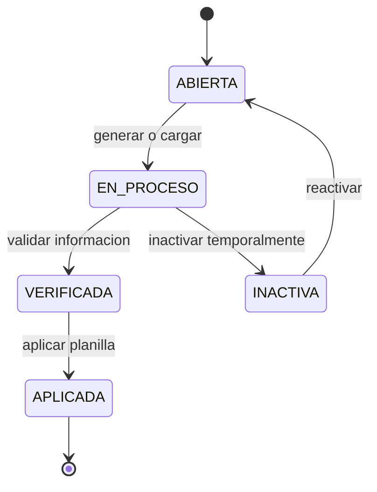
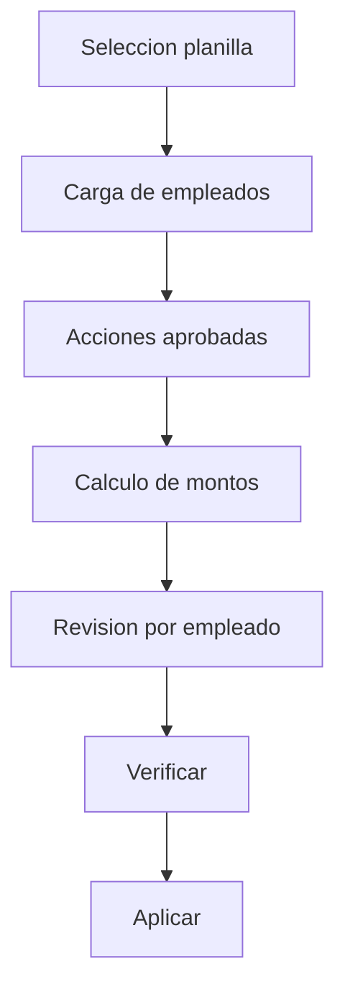
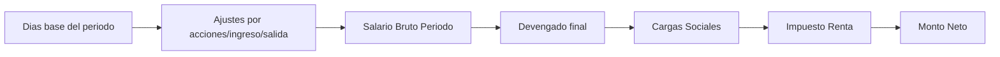

# 🛠️ Planilla y Nomina - Manual Operativo

## 🎯 Objetivo
Explicar el ciclo completo de una planilla: estados, orden de ejecucion y comportamiento ante casos especiales.

## 🔄 Ciclo de vida oficial de planilla
Estados operativos:
- ABIERTA
- EN_PROCESO
- VERIFICADA
- APLICADA
- INACTIVA

## 🎯 Orden recomendado de ejecucion
1. Seleccionar planilla procesable.
2. Cargar empleados elegibles.
3. Cargar acciones de personal dentro del rango de fechas (pendientes y aprobadas).
4. Calcular bruto, deducciones y neto.
5. Revisar tabla por empleado.
6. Verificar planilla.
7. Aplicar planilla.

## 🔄 Flujo operativo

## 🎯 Reglas criticas
- Planilla APLICADA es inmutable.
- Solo acciones aprobadas afectan calculo financiero.
- Inactivar planilla no elimina historial.
- Al recalcular tabla, las acciones aprobadas deben considerarse tanto:
  - sin calendario ligado (`idCalendarioNomina IS NULL`)
  - como ligadas al calendario actual (`idCalendarioNomina = planilla_actual`)
- En la vista de planilla se muestran acciones dentro de rango con estado:
  - `Pendiente Supervisor`
  - `Pendiente RRHH`
  - `Aprobada`

## 🎯 Que pasa si...
- Planilla inactiva con acciones pendientes: quedan en estado pendiente o invalidadas segun regla de compatibilidad.
- Traslado interempresa: se valida planilla destino compatible; si no hay, se bloquea traslado.
- Error detectado despues de aplicar: se corrige en planilla futura mediante accion de personal.
- Aprueba una accion y no cambia la fila del empleado: ejecutar recarga de tabla de planilla; debe recomputar bruto/devengado/cargas/renta/neto con la accion ya aprobada.

## 🎯 Como leer resultados
- Bruto: salario base + ingresos aplicables.
- Deducciones: retenciones y descuentos validos.
- Neto: bruto - deducciones.

## 🧮 Formula canonica de calculo (por empleado)

| Campo | Regla canonica |
|---|---|
| `Salario Base` | Valor de ficha de empleado. |
| `Dias` | Dias del periodo, ajustados por ingreso en periodo, renuncia/despido y acciones que restan dias (ausencia/licencia no remunerada, incapacidad, vacaciones). |
| `Salario Quincenal Bruto` | Salario base proporcional por dias laborados del periodo. |
| `Devengado` | Salario quincenal bruto + ingresos de acciones aprobadas (aumento, bonificacion, hora extra, incapacidad CCSS, licencia remunerada, vacaciones recalculadas). |
| `Cargas Sociales` | Calculadas sobre bruto/devengado con porcentajes activos de la empresa. |
| `Impuesto Renta` | Tramos + creditos fiscales (`hijos`, `conyuge`). En quincenal aplica en segunda quincena. |
| `Monto Neto` | Devengado - Cargas Sociales - Impuesto Renta - deducciones/retenciones aprobadas. |

