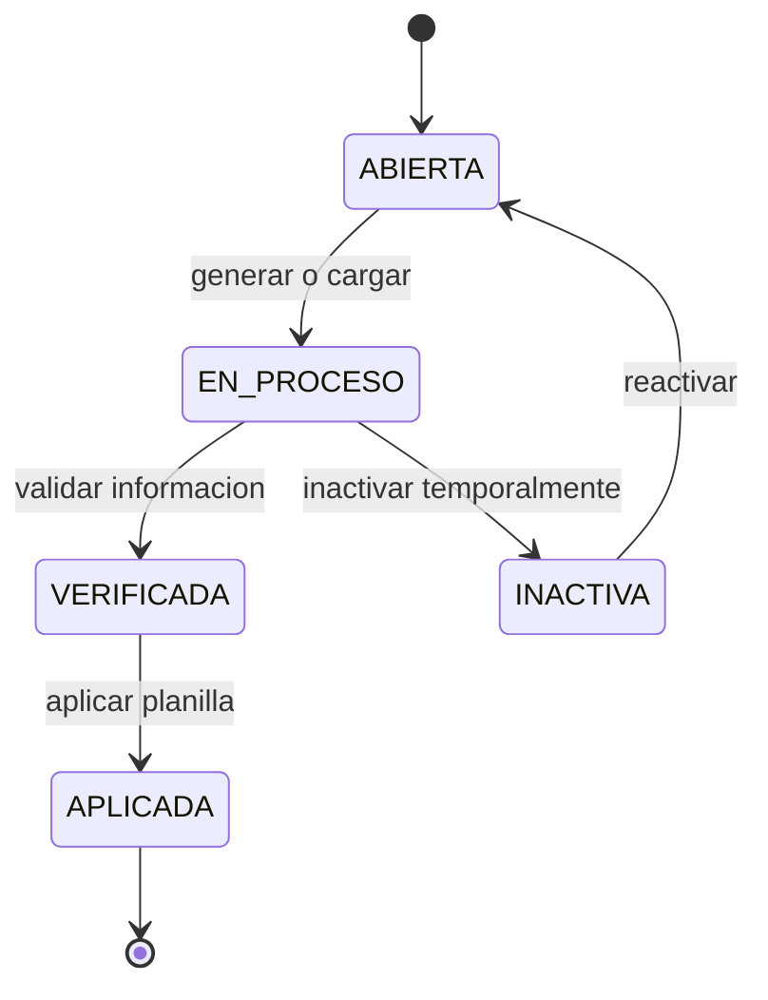
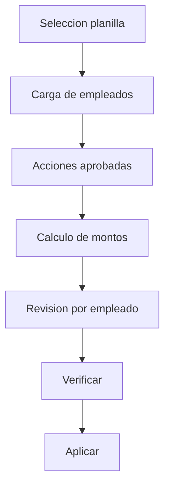

# 🛠️ Planilla y Nomina - Manual Operativo

## 🎯 Objetivo
Explicar el ciclo completo de una planilla: estados, orden de ejecucion y comportamiento ante casos especiales.

## 🔄 Ciclo de vida oficial de planilla
Estados operativos:
- ABIERTA
- EN_PROCESO
- VERIFICADA
- APLICADA
- INACTIVA

## 🎯 Orden recomendado de ejecucion
1. Seleccionar planilla procesable.
2. Cargar empleados elegibles.
3. Cargar acciones de personal aprobadas.
4. Calcular bruto, deducciones y neto.
5. Revisar tabla por empleado.
6. Verificar planilla.
7. Aplicar planilla.

## 🔄 Flujo operativo

## 🎯 Reglas criticas
- Planilla APLICADA es inmutable.
- Solo acciones aprobadas afectan calculo financiero.
- Inactivar planilla no elimina historial.

## 🎯 Que pasa si...
- Planilla inactiva con acciones pendientes: quedan en estado pendiente o invalidadas segun regla de compatibilidad.
- Traslado interempresa: se valida planilla destino compatible; si no hay, se bloquea traslado.
- Error detectado despues de aplicar: se corrige en planilla futura mediante accion de personal.

## 🎯 Como leer resultados
- Bruto: salario base + ingresos aplicables.
- Deducciones: retenciones y descuentos validos.
- Neto: bruto - deducciones.

