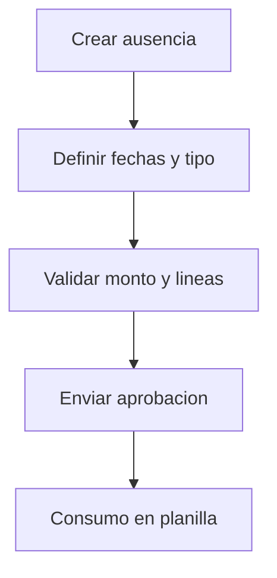

# 🛠️ Accion de Personal - Ausencias

## 🔄 Flujo
1. Seleccionar empresa y empleado.
2. Definir tipo de ausencia y fechas.
3. Validar lineas.
4. Enviar a aprobacion.
5. Consumir en planilla cuando corresponda.

## 🎯 Que pasa si...
- Linea incompleta: no permite guardar.
- Estado no aprobado: no impacta planilla.

