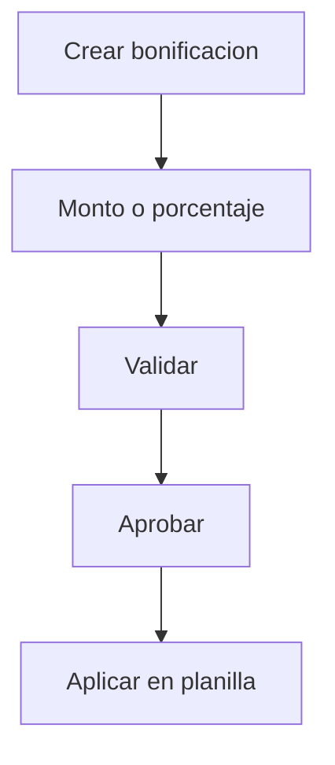

# Accion de Personal - Bonificaciones

## Flujo
1. Registrar bonificacion.
2. Definir monto o porcentaje.
3. Validar reglas.
4. Aprobar.
5. Aplicar en planilla.

```mermaid
flowchart TD
  A[Crear bonificacion] --> B[Monto o porcentaje]
  B --> C[Validar]
  C --> D[Aprobar]
  D --> E[Aplicar en planilla]
```
