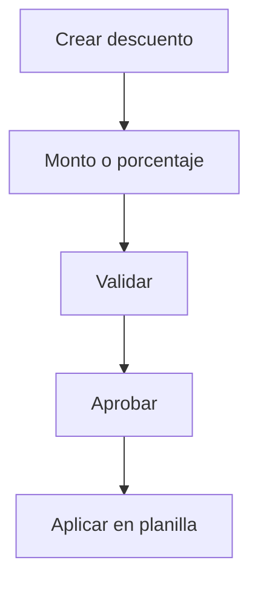

# 🛠️ Accion de Personal - Descuentos

## 🔄 Flujo
1. Registrar descuento.
2. Definir monto o porcentaje.
3. Validar.
4. Aprobar.
5. Aplicar en planilla.

```mermaid
flowchart TD
  A[Crear descuento] --> B[Monto o porcentaje]
  B --> C[Validar]
  C --> D[Aprobar]
  D --> E[Aplicar en planilla]
```

