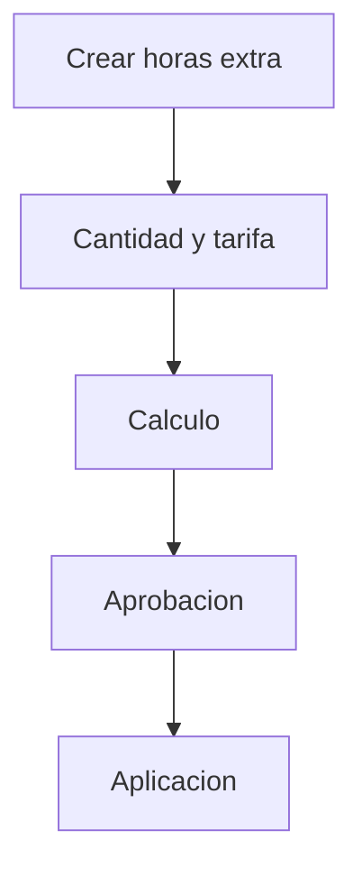

# 🛠️ Accion de Personal - Horas Extra

## 🔄 Flujo
1. Registrar horas extra.
2. Definir cantidad y tarifa.
3. Calcular monto.
4. Aprobar.
5. Aplicar en planilla.

```mermaid
flowchart TD
  A[Crear horas extra] --> B[Cantidad y tarifa]
  B --> C[Calculo]
  C --> D[Aprobacion]
  D --> E[Aplicacion]
```

