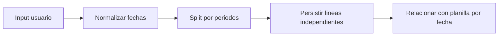

# Modelo por Periodo para Acciones

## Flujo de persistencia por periodo



## Fuentes Integradas (Preservacion Completa)

Regla de consolidacion aplicada:
- Cada fuente original asignada a este maestro se preserva completa debajo de su encabezado.
- Esto garantiza trazabilidad y evita perdida de informacion durante la limpieza.

### Fuente: docs/48-AccionesPersonal-ModeloPorPeriodo-Linea.md

```markdown
# 48 - Acciones de Personal: Split por Periodo al Guardar (Decision Vigente)

**Fecha:** 2026-03-01  
**Estado:** Implementado (backend + frontend)  
**Aplica a:** Ausencias, Licencias y Permisos, Incapacidades, Bonificaciones, Horas Extra, Retenciones y Descuentos

---

## 1. Decision oficial vigente

Para evitar aprobar/consumir periodos futuros por arrastre:

1. El usuario puede capturar varias lineas en un solo modal.
2. Al guardar, el backend agrupa lineas por `payrollId` (periodo).
3. Se crea **una accion header por cada periodo distinto**.
4. Si varias lineas son del mismo periodo, quedan dentro de la misma accion.

Con esto se mantiene el modelo actual por header, pero cada header ya nace aislado por periodo.

---

## 2. Impacto funcional

1. No se aprueban periodos futuros accidentalmente.
2. Botones actuales por accion (`Enviar`, `Aprobar`, `Invalidar`) siguen siendo validos.
3. Se evita refactor profundo de workflow por cuota como fase inmediata.
4. Trazabilidad de lote conservada con `group_id` comun.

---

## 3. Reglas operativas obligatorias

1. Creacion multi-periodo es **transaccional** (todo o nada).
2. Todas las acciones creadas en el mismo submit comparten `group_id`.
3. Respuesta de create devuelve:
   - `totalCreated`
   - `createdActionIds`
   - `groupId`
4. En edicion de una accion existente, solo se permite **un periodo**:
   - si payload trae lineas de periodos distintos, se rechaza.

---

## 4. Estado de implementacion

Implementado en:

1. API `PersonalActionsService` (create de 5 modulos con split por periodo).
2. API `update` de 5 modulos con guard de un solo periodo.
3. Frontend de 5 modulos mostrando mensaje de exito por lote:
   - "Se crearon N acciones ... (una por periodo)" cuando aplica.

Actualizacion 2026-03-01:

1. El patron tambien se aplica a Deducciones:
   - Retenciones
   - Descuentos
2. Se mantiene la misma regla:
   - create puede dividir por periodo,
   - edit de accion existente no puede mezclar periodos.

---

## 5. Alcance de datos y compatibilidad

1. No se requirio cambio destructivo de esquema.
2. Se reutiliza esquema actual (headers + lineas + cuotas).
3. No rompe permisos ni contratos criticos existentes.
4. `group_id` queda como hilo de trazabilidad del lote creado desde un modal.

---

## 6. Pruebas minimas de esta decision

1. Create con 2 periodos distintos -> `totalCreated = 2`.
2. Cada accion creada mantiene estado operativo normal.
3. Update con periodos mixtos -> `BadRequest`.
4. Build API y Frontend en verde.

---

## 7. Nota de arquitectura

La propuesta anterior "workflow totalmente por cuota/período" se deja como opcion futura.  
La decision vigente prioriza riesgo bajo y time-to-value: split por periodo al crear, manteniendo estabilidad audit-ready.


---


---


---

## 8. Selección de empresa en modales (UI)

Regla transversal para todos los módulos de Acciones de Personal:

1. En creación **no se preselecciona** empresa. El usuario debe elegirla.
2. La empresa válida es la **seleccionada dentro del modal**, no la del filtro externo de la tabla.
3. Al cambiar empresa en el modal se recargan catálogos: empleados, planillas y movimientos.
4. Cambios en filtros externos no deben resetear la empresa del modal.
5. En edición, la empresa se fija al `idEmpresa` del registro (solo lectura).

---

## 9. Regla tecnica de fechas y bitacora en modales (Retenciones y paridad)

1. Las fechas `YYYY-MM-DD` deben convertirse a fecha local en frontend usando:
   - `dayjs(new Date(year, month - 1, day))`
   - No usar parseo directo `dayjs('YYYY-MM-DD')` para evitar desfase por zona horaria.
2. En modo edicion, `fechaEfecto` de cada linea debe mapearse desde `line.fechaEfecto` del detalle, con fallback al header solo si la linea no trae valor.
3. En backend, persistencia de fechas de lineas debe usar `parseDateOnlyLocal(...)` y no `new Date('YYYY-MM-DD')`.
4. Bitacora de Retenciones debe incluir `lineasDetalle` en create/update para registrar cambios con formato `Linea N - Campo`.
5. El tab `Bitacora` no debe reiniciarse a `Informacion principal` por cambios transitorios de `Form.useWatch`; usar IDs normalizados (`selectedCompanyIdNum`, `selectedEmployeeIdNum`) y guardas en `onCompanyChange`.
```

