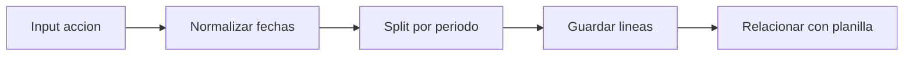

# Modelo por Periodo - Acciones de Personal

## Objetivo
Explicar como una accion se divide y persiste por periodo/linea.

## Flujo

## Regla
Cada linea debe ser completa y consistente con su fecha de efecto.
