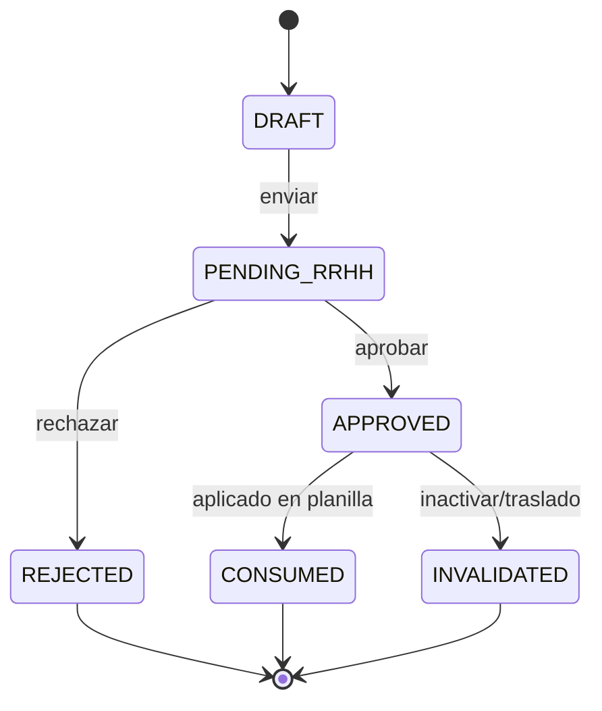
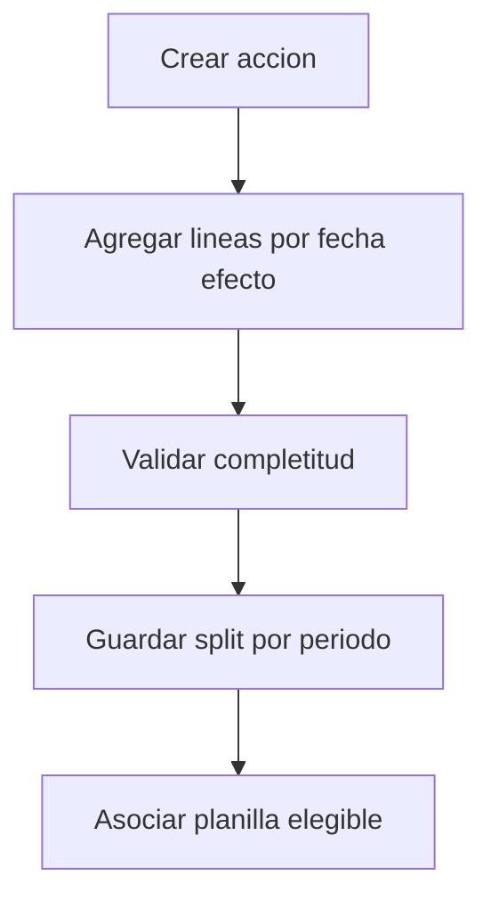

# Acciones de Personal - Indice Consolidado

Estado: vigente

Documentos maestros por accion:
- ACCION-AUSENCIAS.md
- ACCION-BONIFICACIONES.md
- ACCION-HORAS-EXTRA.md
- ACCION-DESCUENTOS.md
- ACCIONES-MODELO-POR-PERIODO.md

## Flujo transversal de acciones

## Flujo de lineas por periodo

