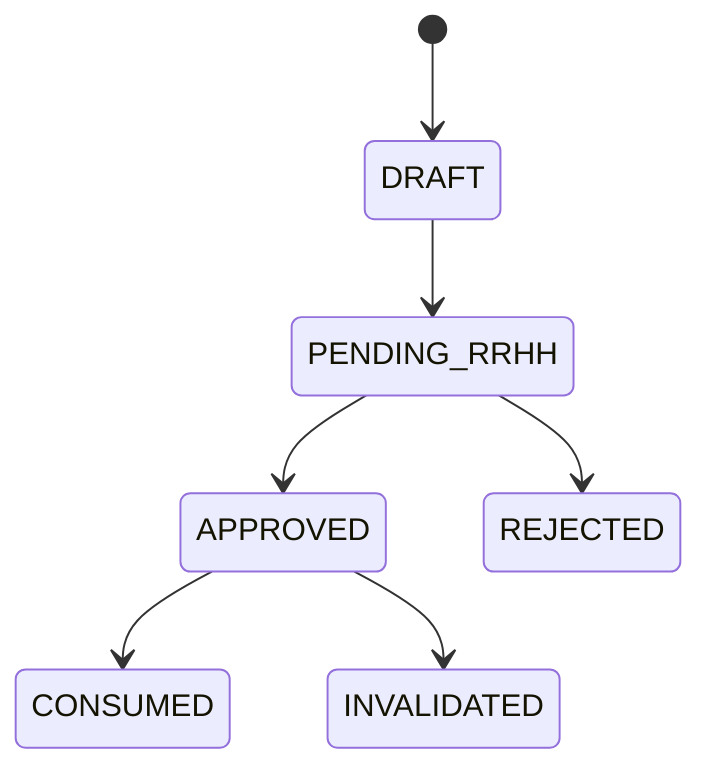

# Acciones de Personal - Indice Operativo

## Que son
Cambios de personal que impactan nomina y deben pasar por flujo de estado y aprobacion.

## Documentos por tipo de accion
- `ACCION-AUSENCIAS.md`
- `ACCION-BONIFICACIONES.md`
- `ACCION-HORAS-EXTRA.md`
- `ACCION-DESCUENTOS.md`
- `ACCIONES-MODELO-POR-PERIODO.md`

## Flujo transversal
Estados:
- DRAFT
- PENDING_RRHH
- APPROVED
- REJECTED
- CONSUMED
- INVALIDATED

## Regla general
Sin estado APPROVED no impacta planilla.
