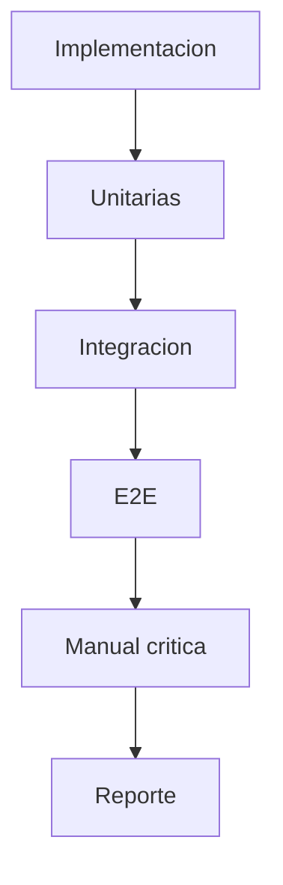

# Testing y QA - Manual de Validacion

## Objetivo
Asegurar que cada cambio sea valido funcional, tecnico y operativamente.

## Flujo de QA
1. Pruebas unitarias.
2. Pruebas de integracion.
3. Pruebas E2E.
4. Validacion manual de escenarios criticos.
5. Registro de evidencia y cierre.

## Reglas de salida
- No hay cierre sin evidencia.
- No hay evidencia sin escenarios de error.
