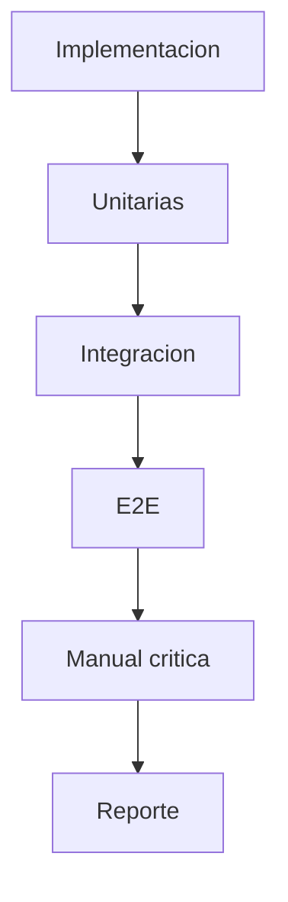

# 🛠️ Testing y QA - Manual de Validacion

## 🎯 Objetivo
Asegurar que cada cambio sea valido funcional, tecnico y operativamente.

## 🔄 Flujo de QA
1. Pruebas unitarias.
2. Pruebas de integracion.
3. Pruebas E2E.
4. Validacion manual de escenarios criticos.
5. Registro de evidencia y cierre.

## 🎯 Reglas de salida
- No hay cierre sin evidencia.
- No hay evidencia sin escenarios de error.

## ✅ Evidencia reciente (2026-03-16)
- `api`: `employee-sensitive-data.service.spec.ts` => `14/14` passing.
- `api` seguridad (`PEND-001`): rotacion controlada de llaves ejecutada en BD objetivo (`HRManagementDB_produccion`) con evidencia antes/durante/despues y rollback de contingencia validado.
- `api e2e`: `auth.e2e-spec.ts --testTimeout=30000` => `8/8` passing.
- `frontend`:
  - `PermissionGuard.test.tsx` => `8/8` passing.
  - `menu.selectors.test.ts` => `6/6` passing.

