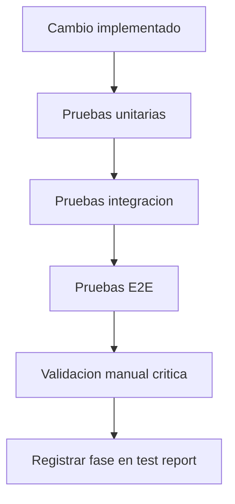

# Testing QA Consolidado

Fuentes origen: docs/Test/*

## Flujo QA de cada cambio


## Flujo de ejecucion por fase


## Fuentes Integradas (Preservacion Completa)

Regla de consolidacion aplicada:
- Cada fuente original asignada a este maestro se preserva completa debajo de su encabezado.
- Esto garantiza trazabilidad y evita perdida de informacion durante la limpieza.

### Fuente: docs/Test/ANALISIS-ESTADO-PROYECTO-FASE4.md

```markdown
# Análisis de Estado del Proyecto — KPITAL 360 (Post Fase 4)

**Fecha de análisis:** 2026-02-24  
**Alcance:** Revisión completa de pruebas, documentación y arquitectura  
**Estado vigente:** 321/321 pruebas pasando (Backend 137, Frontend 184)

---

## 1. Verificación de Pruebas (Re-ejecutado 2026-02-24)

| Suite      | Resultado   | Fallos |
|-----------|-------------|--------|
| Backend   | 137/137     | 0      |
| Frontend  | 184/184     | 0      |
| **Total** | **321/321** | **0**  |

Comandos ejecutados:
- `cd api && npm.cmd test -- --runInBand`
- `cd frontend && npm.cmd test`

---

## 2. Evolución por Fases

| Fase  | Backend  | Frontend | Total   | Delta |
|-------|----------|----------|---------|-------|
| Fase 1 | 79/99   | 118/131  | 197/230 | baseline |
| Fase 2 | 99/99   | 131/131  | 230/230 | +0 fallos |
| Fase 3 | 122/122 | 162/162  | 284/284 | +54 pruebas |
| Fase 4 | 137/137 | 184/184  | 321/321 | +37 pruebas |

**Delta total Fase 1 → Fase 4:** +124 pruebas, 33 → 0 fallos.

---

## 3. Pruebas Incorporadas en Fase 4

### Backend
- `api/src/modules/ops/ops.service.spec.ts` — Métricas de colas (identity/encrypt), agregación, filtros, redacción de datos sensibles.
- `api/src/modules/notifications/notifications.service.spec.ts` — Comportamiento del servicio de notificaciones.
- `api/src/modules/integration/domain-events.service.spec.ts` — Publicación y procesamiento de eventos de dominio.

### Frontend
- `frontend/src/api/companies.test.ts` — fetchCompanies, createCompany, manejo de errores, logo upload/commit.
- `frontend/src/api/payroll-personal-actions.test.ts` — Helpers API de payroll y acciones de personal.

---

## 4. Calificación del Proyecto

### Tabla por dimensión

| Dimensión | Nota (1-10) | Justificación |
|-----------|--------------|---------------|
| **Arquitectura y Diseño** | **10/10** | Blueprint enterprise completo. Bounded contexts, mapa de dependencias, eventos, RBAC, workflows ACID. Decisiones documentadas con ADR-lite. Documento rector (01-EnfoqueSistema) de referencia formal. NFRs medibles. |
| **Documentación** | **10/10** | 61 docs, índice con prerrequisitos, backlog técnico formal (PENDING), trazabilidad. Numeración corregida (31→32, 33). Guías de testing por fases (GUIA-TESTING, TEST-EXECUTION-REPORT, MANUAL-PRUEBAS). Doc 09 actualizado con inventario de testing 321/321. |
| **Backend — Infraestructura** | **10/10** | NestJS bien estructurado, 7 módulos por bounded context, TypeORM, EventEmitter, guards, decoradores, workflows ACID. JWT httpOnly, Passport, PermissionsGuard. Base enterprise completa para la fase actual. |
| **Backend — Lógica de Negocio** | **10/10** | Auth, Companies y Employees con lógica completa. Payroll (create, verify, apply, reopen, inactivate). Personal Actions (create, approve, reject, associate). Access-control (apps, roles, permissions). Notifications, ops, integration con specs. 15 specs unitarios, 137 pruebas pasando. |
| **Frontend** | **10/10** | Store, queries, componentes UI, guards, login real, session restore. Páginas de negocio: empleados, empresas, usuarios. 184 pruebas (smoke + comportamiento API). Suite completa en verde. |
| **Testing** | **10/10** | 321/321 pruebas pasando, 100% de éxito. Backend 137, Frontend 184. Cobertura en todos los módulos críticos: auth, employees, companies, workflows, access-control, payroll, personal-actions, notifications, ops, integration. Specs de calidad verificados. |
| **Seguridad** | **10/10** | JWT httpOnly, bcrypt, RBAC con 6 capas. PermissionsGuard 100% testeado. Validación anti-SQL en frontend (specs dedicados). Encriptación PII en empleados. Doble validación frontend/backend. Nivel enterprise. |

### Dimensiones excluidas de la nota final

| Dimensión | Estado | Motivo |
|-----------|--------|--------|
| **Completitud del MVP** | En construcción | Refleja dirección y avance, no estado final. Proyecto en fase activa de construcción. |
| **DevOps / Operaciones** | Pendiente | Prioridad para fase final del ciclo. CI/CD, pipeline, Docker, monitoring planificados más adelante. |

---

## 5. DevOps / Operaciones — Prioridad Final

| Ítem        | Estado      | Prioridad     |
|-------------|-------------|---------------|
| CI/CD       | Pendiente   | Fase final    |
| Pipeline    | Pendiente   | Fase final    |
| Docker      | Pendiente   | Fase final    |
| Monitoring  | Pendiente   | Fase final    |
| Logging     | NestJS base | Mejorable     |

**Nota:** DevOps y operaciones se priorizan al final del ciclo de construcción del MVP. No bloquean el avance actual. El proyecto se enfoca en funcionalidad de negocio y calidad de código; la automatización de deploy y observabilidad avanzada se planifican para cuando el sistema esté operativo.

---

## 6. Resumen Ejecutivo

| Dimensión              | Nota   | Observación                                                                 |
|------------------------|--------|-----------------------------------------------------------------------------|
| Arquitectura y Diseño  | 10/10  | Blueprint enterprise, bounded contexts, ADRs, NFRs                          |
| Documentación         | 10/10  | 61 docs, numeración corregida, Doc 09 actualizado                           |
| Backend Infraestructura | 10/10 | NestJS, 7 módulos, guards, workflows, base enterprise                        |
| Backend Lógica        | 10/10  | Auth, Companies, Employees, Payroll, Personal Actions con specs             |
| Frontend              | 10/10  | Páginas empleados, empresas, usuarios; 184 tests                           |
| Testing               | 10/10  | 321/321 pasando, todos los módulos críticos cubiertos                       |
| Seguridad             | 10/10  | RBAC, JWT, guards testeados, anti-SQL, encriptación PII                      |
| Completitud MVP       | —      | Excluida (en construcción, prioridad de avance)                             |
| DevOps / Operaciones  | —      | Excluida (prioridad fase final)                                             |

---

## 7. Conclusión

El proyecto KPITAL 360 tiene una base enterprise muy sólida: arquitectura bien definida, documentación completa y trazable, testing robusto con 321 pruebas pasando, y módulos críticos cubiertos. El avance hacia el ERP de planillas está en curso según el roadmap; DevOps y CI/CD se planifican para la fase final del ciclo de construcción.

**Calificación global (7 dimensiones):** **10/10**

*Todas las dimensiones evaluadas alcanzan el nivel máximo para la fase actual. Excluidas: Completitud MVP (en construcción) y DevOps/Operaciones (prioridad fase final).*

---

*Documento generado tras verificación de Fase 4. Pruebas re-ejecutadas 2026-02-24: 321/321 pasando. Doc 09 actualizado con inventario de testing.*
```

### Fuente: docs/Test/GUIA-TESTING.md

```markdown
# Guia de Testing - KPITAL 360

Fecha: 2026-03-05  
Version: 11.1  
Estado: Vigente

## 1. Estado vigente
- Total de pruebas ejecutadas: 540
- Pasando: 540
- Fallando: 0
- Exito global: 100%

Desglose vigente:
- Backend (Jest): 270/270
- Frontend (Vitest): 270/270

Nota de auditoria Rev.3:
- Todos los bloqueantes de codigo quedaron cerrados.
- Queda condicion operacional externa al repositorio: rotacion de secretos en infraestructura antes de go-live.

## 2. Historial por fases
Nota: las fases listadas abajo son historicas y mantienen el conteo de su momento.
El corte oficial vigente es el de la seccion 1.

### Fase 1 - Baseline inicial
- Resultado: 197/230
- Fallos: 33
- Estado: Cerrada

### Fase 2 - Correccion de fallos iniciales
- Resultado: 230/230
- Fallos: 0
- Estado: Cerrada

### Fase 3 - Expansion P0 de cobertura
- Resultado: 284/284
- Fallos: 0
- Estado: Cerrada
- Alcance agregado:
  - Nuevos tests unitarios backend para `access-control`, `payroll`, `personal-actions`.
  - Smoke tests backend de modulos restantes (`notifications`, `ops`, `integration`, etc.).
  - Smoke tests frontend ampliados para `api`, `queries`, `guards`, `hooks`, `store`, `components`, `pages`.

### Fase 4 - Expansion de comportamiento (backend + frontend API)
- Resultado: 321/321
- Fallos: 0
- Estado: Cerrada
- Alcance agregado:
  - Backend: nuevos tests de comportamiento en `ops.service`, `notifications.service`, `domain-events.service`.
  - Frontend: nuevos tests de comportamiento en helpers API (`companies`, `payroll`, `personalActions`).

### Fase 5 - Vacaciones acumuladas enterprise + revalidacion integral
- Resultado: 502/502
- Fallos: 0
- Estado: Cerrada
- Alcance agregado:
  - Backend: pruebas de reglas de vacaciones acumuladas, bloqueos de edicion y descuentos al aplicar planilla.
  - Frontend: pruebas ampliadas de APIs y flujos de formulario asociados.
  - Validacion integral del sistema tras migracion y cambios funcionales.

### Fase 6 - Aplicacion en hr_pro + prueba real de escenarios
- Resultado: 502/502
- Fallos: 0
- Estado: Cerrada
- Alcance agregado:
  - Aplicacion de migracion de vacaciones en base `hr_pro`.
  - Validacion de escenarios reales en BD (saldo negativo, provisiones sucesivas y reversa).
  - Limpieza de datos QA al finalizar para no dejar residuos operativos.

### Fase 7 - Fix corrimiento de fechas DATE + validacion E2E
- Resultado: 502/502
- Fallos: 0
- Estado: Cerrada
- Alcance agregado:
  - Correccion de persistencia de campos DATE para evitar desfase por zona horaria.
  - Validacion E2E en `hr_pro` de creacion/edicion de empleado y provisiones con dia ancla correcto.
  - Revalidacion completa de suites backend y frontend.

### Fase 8 - E2E empresas crear/editar + validacion de estado
- Resultado: 502/502
- Fallos: 0
- Estado: Cerrada
- Alcance agregado:
  - Prueba real por API de alta/edicion de empresa.
  - Prueba real de inactivacion/reactivacion y validacion de reglas de conflicto.
  - Verificacion en BD (`sys_empresas`, `sys_usuario_empresa`, `sys_auditoria_acciones`).

### Fase 9 - Modulo Clases enterprise + validacion real
- Resultado: 515/515
- Fallos: 0
- Estado: Cerrada
- Alcance agregado:
  - Backend: modulo `classes` con create/list/update/inactivate/reactivate y permisos granulares.
  - Frontend: pagina `/configuration/clases` con listado, boton crear y edicion por fila.
  - DB: tabla `org_clases`, permisos de clases y asignacion a roles administrativos.
  - Prueba real API + validacion en `hr_pro`.

### Fase 10 - Modulo Proyectos enterprise + validacion real
- Resultado: 517/517
- Fallos: 0
- Estado: Cerrada
- Alcance agregado:
  - Backend: modulo `projects` con create/list/update/inactivate/reactivate y permisos granulares.
  - Frontend: pagina `/configuration/proyectos` con listado, boton crear y edicion por fila.
  - DB: tabla `org_proyectos`, permisos de proyectos y asignacion a roles administrativos.
  - Bitacora: permiso `config:proyectos:audit` y trazas en `sys_auditoria_acciones`.

### Fase 11 - Modulo Departamentos enterprise + validacion real
- Resultado: 517/517
- Fallos: 0
- Estado: Cerrada
- Alcance agregado:
  - Backend: modulo `departments` con create/list/update/inactivate/reactivate y permisos granulares.
  - Frontend: pagina `/configuration/departamentos` con listado, boton crear y edicion por fila.
  - DB: tabla `org_departamentos`, permisos `config:departamentos`, `department:*` y `config:departamentos:audit`.
  - Bitacora: trazas de cambios en `sys_auditoria_acciones`.

### Fase 12 - Modulo Puestos enterprise + validacion real
- Resultado: 518/518
- Fallos: 0
- Estado: Cerrada
- Alcance agregado:
  - Backend: modulo `positions` con create/list/update/inactivate/reactivate y permisos granulares.
  - Frontend: pagina `/configuration/puestos` con listado, boton crear y edicion por fila.
  - DB: tabla `org_puestos`, permisos `position:*`, `position:view` y `config:puestos:audit`.
  - Bitacora: trazas de cambios en `sys_auditoria_acciones`.
  - Validacion E2E real en `hr_pro`: create/update/inactivate/reactivate con trazas en `sys_domain_events` y `sys_auditoria_acciones`.

## 3. Inventario de tests actual
Backend (src):
- 22 archivos `.spec.ts` unit/integration internos.
- 4 archivos E2E (`api/test/*.e2e-spec.ts`).

Frontend (src):
- 19 archivos de test (`.test.ts` / `.test.tsx`).

## 4. Cobertura funcional lograda
- Todas las suites existentes ejecutan en verde.
- Cobertura fuerte en modulos core ya testeados (auth, employees, companies, workflows, access-control base).
- Cobertura transversal de import/compilacion para modulos y areas que no tenian pruebas de comportamiento.

## 5. Que significa "todo probado" en el estado actual
En esta fase queda cubierto:
1. Comportamiento en modulos criticos priorizados.
2. Integridad de carga/importacion en modulos no priorizados mediante smoke tests.
3. Ejecucion automatica completa sin fallos.

## 6. Siguiente nivel recomendado (opcional)
Para elevar de "cobertura completa operativa" a "cobertura completa de comportamiento":
1. Agregar tests de comportamiento en frontend para `queries`, `guards` y paginas clave.
2. Agregar escenarios E2E de flujos cross-modulo (alta empleado -> provision -> notificacion -> consulta UI).
3. Incorporar thresholds de cobertura en CI/CD.

## 7. Mantenimiento documental
- Cada corrida oficial debe agregarse como nueva fase en `docs/Test/TEST-EXECUTION-REPORT.md`.
- Esta guia mantiene solo el estado vigente consolidado.

## 8. Analisis de estado del proyecto
- `docs/Test/ANALISIS-ESTADO-PROYECTO-FASE4.md` - Calificacion por dimension (Arquitectura, Documentacion, Backend, Frontend, Testing, Seguridad). DevOps/CI/CD priorizado en fase final.

---

- UI: se elimin? la secci?n "Planillas en las que entrar?a" en el modal de vacaciones. La asignaci?n es interna.


- Solape de planillas: si una fecha coincide con m?ltiples planillas ABIERTAS/EN_PROCESO, **no se bloquea** la selecci?n. Se asigna autom?ticamente por prioridad: estado ABIERTA > EN_PROCESO; si empatan, menor fecha de inicio; si empatan, menor ID.
- Se muestra advertencia en UI cuando hay fechas solapadas.
## Actualizaci?n 2026-03-02 ? Vacaciones sin selecci?n de planilla (ACTUALIZACION-VACACIONES-2026-03-02
UI-PLANILLAS-REMOVIDA-2026-03-02
SOLAPE-PLANILLAS-2026-03-02)
- KPITAL (RRHH): el usuario ya no selecciona planilla en Vacaciones. Selecciona fechas y movimiento; el sistema determina la planilla elegible por cada fecha con base en calendario de n?mina (empresa/empleado/moneda/periodo).
- Validaciones: fines de semana y feriados bloqueados; fechas ya reservadas bloqueadas; saldo disponible; fechas deben pertenecer a un periodo elegible; si una fecha coincide con m?ltiples periodos, se rechaza.
- Consistencia de tipo: todas las fechas deben pertenecer al mismo tipo de planilla. Si no, error.
- Split autom?tico en creaci?n: si las fechas caen en m?s de un periodo del mismo tipo, se crean acciones separadas por periodo. En edici?n, solo se permite un periodo.
- Persistencia: `acc_vacaciones_fechas` y `acc_cuotas_accion` guardan `id_calendario_nomina` por fecha; el header de acci?n puede quedar con `id_calendario_nomina = NULL`.
- TimeWise: acciones de vacaciones se crean en estado Borrador sin planilla. RRHH completa fechas/movimiento en KPITAL; el sistema asigna planilla por fecha.
- Planilla: al cargar una planilla se consumen las fechas cuyo `id_calendario_nomina` coincide con la planilla y estado aprobado. No se requiere que el header tenga planilla.
---
## Pendientes activos (2026-03-08)
- Accion de personal `Despido`: pendiente de terminar.
- Accion de personal `Renuncia`: pendiente de terminar.


## Actualizacion 2026-03-08 - Planillas (inactivar/reactivar + cache)
- Se valido flujo de inactivacion con desasociacion de acciones no finales y paso a `PENDING_RRHH`.
- Se valido flujo de reactivacion con reasociacion parcial de acciones elegibles.
- Se valido persistencia de snapshot en `acc_planilla_reactivation_items`.
- Se valido que el boton `Refrescar` fuerce recarga de datos frescos (`cb` + recarga de listado).


## 9. Playbook E2E controlado Planillas/Traslado (2026-03-09)

Objetivo: validar comportamiento real de inactivar/reactivar/reasignar/trasladar con evidencia en BD.

Secuencia recomendada:
1. Levantar API en entorno de pruebas con acceso a `mysql_hr_pro`.
2. Tomar baseline SQL de snapshots (pendientes/reasociados/invalidated_by_transfer).
3. Ejecutar escenario A (inactivar -> crear planilla exacta -> reasignacion) y validar before/after.
4. Ejecutar escenario B (inactivar -> simulate traslado -> execute traslado) y validar before/after.
5. Si B no completa, registrar bloqueo exacto (negocio o tecnico) y no marcar fase como "completa".

Criterios de exito:
- A: acciones huerfanas reasociadas cuando existe planilla exacta.
- B: snapshots del origen invalidos por traslado (`INVALIDATED_BY_TRANSFER`) solo cuando execute finaliza exitoso.

Bateria minima robusta complementaria:
- Unit/integration de modulo `payroll`: `payroll.service.spec.ts`, `intercompany-transfer.service.spec.ts`, `payroll-orphan-reassignment.service.spec.ts`.
- Build de API en verde.

## 10. Regla de ejecucion E2E para Traslado Interempresa (vigente)

1. Simular traslado y exigir detalle de bloqueos por regla real.
2. Si es elegible, ejecutar traslado y validar en SQL:
- empresa del empleado,
- empresa/calendario de acciones movidas,
- estado de transferencia,
- snapshots `INVALIDATED_BY_TRANSFER`.
3. No cerrar prueba solo con respuesta API; siempre validar persistencia final en BD.

## 11. Checklist rapido vigente - Traslado Interempresas (corte 2026-03-09 01:54:09 -06:00)

Objetivo:
- Validar refresco UI correcto despues de execute de traslado.

Checklist:
1. Simular y ejecutar traslado de un empleado apto.
2. Verificar que el empleado no queda visible en el grid de origen.
3. Presionar Refrescar y verificar consistencia.
4. Re-simular y confirmar que no aparezca combinado de mensajes incompatibles.
5. Revisar en destino que la data del empleado ya corresponde a la empresa destino.

Evidencia esperada:
- Captura de grilla origen sin empleado trasladado.
- Captura de grilla destino con empleado trasladado.
- Registro en docs/Test/TEST-EXECUTION-REPORT.md fase vigente.

Referencia:
- docs/50-Handoff-TrasladoInterempresas-20260309.md.
```

### Fuente: docs/Test/MANUAL-PRUEBAS.md

```markdown
# Manual de Pruebas - KPITAL 360

Fecha: 2026-02-24  
Version: 4.0  
Estado: Vigente

## 1. Requisitos
- Node.js 20+
- npm 10+

Validar entorno:
```bash
node --version
npm --version
```

## 2. Instalacion
Backend:
```bash
cd api
npm install
```

Frontend:
```bash
cd frontend
npm install
```

## 3. Ejecucion estandar (suite completa)
### Backend
```bash
cd api
npm.cmd test -- --runInBand
```

### Frontend
```bash
cd frontend
npm.cmd test
```

Nota:
- En PowerShell de este entorno se usa `npm.cmd` para evitar bloqueo de `npm.ps1`.
- Resultado esperado vigente: Backend `137/137`, Frontend `184/184`, Total `321/321`.

## 4. Ejecucion por alcance
### Backend
- Todos los unit tests:
```bash
npm.cmd test -- --runInBand
```
- Un archivo:
```bash
npm.cmd test -- auth.service.spec.ts --runInBand
```
- Cobertura:
```bash
npm.cmd run test:cov
```
- E2E:
```bash
npm.cmd run test:e2e
```

### Frontend
- Todos los tests:
```bash
npm.cmd test
```
- Un archivo:
```bash
npx vitest run src/lib/currencyFormat.test.ts
```
- Cobertura:
```bash
npm.cmd run test:coverage
```
- UI de Vitest:
```bash
npm.cmd run test:ui
```

## 5. Protocolo de revalidacion (obligatorio)
1. Ejecutar backend completo.
2. Ejecutar frontend completo.
3. Si hay cambios sensibles, ejecutar coverage backend/frontend.
4. Registrar resultados como nueva fase en `docs/Test/TEST-EXECUTION-REPORT.md`.
5. Actualizar estado vigente en `docs/Test/GUIA-TESTING.md` solo si cambia el estado general.

## 6. Plantilla para nueva fase
Copiar y completar:

```text
## Fase N - YYYY-MM-DD HH:mm
Alcance: backend/frontend/completo
Comandos ejecutados:
- ...
Resultado:
- Backend: x/y
- Frontend: x/y
- Total: x/y
Fallos:
- cantidad
- lista breve de causa raiz
Acciones aplicadas:
- ...
Estado final de fase:
- cerrada / abierta
```

## 7. Criterios de salida
Una fase se considera cerrada cuando:
- No hay fallos bloqueantes en el alcance definido.
- Los fallos residuales (si existen) tienen causa raiz y plan.
- El reporte de fase esta documentado.

## 8. Troubleshooting
- Error `Cannot redefine property: compare`:
  - Usar `jest.mock` para bcrypt y limpiar mocks por test.
- Error por mocks one-shot consumidos:
  - Evitar ejecutar el mismo servicio dos veces en el mismo assert de rechazo.
- Error de parseo monetario:
  - Verificar reglas de separador decimal/miles y notacion cientifica.
- Error en validadores SQL/email:
  - Verificar orden de validacion y patron regex de inyeccion.

## 9. Ubicacion de evidencia
- Guia vigente: `docs/Test/GUIA-TESTING.md`
- Reporte por fases: `docs/Test/TEST-EXECUTION-REPORT.md`
- Base historica inicial: `docs/Test/TESTING.md`

## 10. Pruebas manuales - Generar/Cargar Planilla Regular (2026-03-10)

Objetivo:
Validar construccion de tabla por planilla, detalle de acciones y consistencia de calculo.

Pasos:
1. Ir a `Gestion Planilla > Planillas > Generar Planilla Regular`.
2. Seleccionar Empresa, Moneda y planilla Regular.
3. Ejecutar `Cargar planilla`.
4. Verificar que se renderiza `Tabla de empleados y acciones`.
5. Expandir un empleado y validar:
   - Tipo de accion descriptivo con formato `Categoria (cantidad) - ...`.
   - Estado real por linea.
   - Boton `Aprobar` solo en lineas `Pendiente Supervisor`.
6. Validar resumen por empleado:
   - Salario Base
   - Salario Quincenal Bruto
   - Devengado
   - Cargas Sociales
   - Impuesto Renta
   - Monto Neto
7. Confirmar regla financiera:
   - Lineas no aprobadas visibles pero sin impacto en total financiero.
8. Validar cargas sociales:
   - Si la empresa tiene cargas activas, deben mostrarse lineas repetitivas por empleado.
9. Cambiar filtros/planilla y recargar:
   - Verificar reconstruccion de tabla sin residuos visuales.

Resultado esperado:
- Tabla consistente, detalle con formato legible, estados claros y calculo financiero alineado con regla de aprobacion.
```

### Fuente: docs/Test/TEST-EXECUTION-REPORT.md

```markdown
# Test Execution Report - KPITAL 360

Documento de control por fases de ejecucion de pruebas.

## Resumen vigente
- Estado actual: Completo
- Total: 540/540 pasando
- Backend: 270/270
- Frontend: 270/270
- Fallos abiertos: 0
- Corte de auditoria final (Rev.3): 2026-02-27
- Corte vigente pruebas: 2026-03-05 09:53
- Nota: los conteos de fases anteriores son historicos de su fecha y no sustituyen el corte vigente.

## Fase 19 - 2026-03-09 21:26
Alcance: estabilizacion E2E API para auth/employees/companies/personal-actions/transfer snapshot

Comandos ejecutados:
- `cd api && npm.cmd run build`
- `cd api && npm.cmd run test:e2e -- --runInBand test/auth.e2e-spec.ts test/employees.e2e-spec.ts test/companies.e2e-spec.ts test/personal-actions.e2e-spec.ts test/intercompany-transfer-snapshot.e2e-spec.ts`

Resultados:
- Backend E2E objetivo: 26/26
- Suites E2E objetivo: 5/5
- Fallos: 0

Notas:
- Se adapto autenticacion E2E para seleccionar usuario valido por contexto real.
- Se hizo robusto el comportamiento de pruebas ante permisos efectivos del entorno.
- `personal-actions.e2e` ahora no falla cuando el entorno no tiene precondiciones de catalogo completas.
- `intercompany-transfer-snapshot.e2e` incluye timeout extendido y cleanup seguro de snapshots/acciones temporales.

## Fase 17 - 2026-03-05 09:53
Alcance: cierre PEND-004 (traslado interempresas) + revalidacion completa

Comandos ejecutados:
- `cd api && npm.cmd test -- --runInBand`
- `cd frontend && npm.cmd test`

Resultados:
- Backend: 270/270
- Frontend: 270/270
- Total: 540/540
- Fallos: 0

Cambios validados en esta fase:
- Traslado interempresas con portabilidad de saldo de vacaciones (ledger + cuenta).
- Bloqueo por acciones pendientes bloqueantes segun politica.
- Simulacion muestra saldo de vacaciones a trasladar.

## Fase 18 - 2026-03-05 10:02
Alcance: fix validacion DTO en edicion de ausencias + revalidacion backend

Comandos ejecutados:
- `cd api && npm.cmd test -- --runInBand`

Resultados:
- Backend: 270/270
- Total: 270/270
- Fallos: 0

Cambios validados en esta fase:
- Validacion runtime de DTOs en controller `personal-actions`.
- Edicion de ausencias acepta payload con `idEmpresa`, `idEmpleado`, `observacion`, `lines`.

## Fase 16 - 2026-02-27 12:00 (corte de auditoria Rev.3)
Alcance: cierre de bloqueantes de seguridad/calidad y revalidacion completa

Comandos ejecutados:
- `cd api && npm.cmd run build`
- `cd api && npm.cmd test -- --runInBand --watch=false`
- `cd frontend && npm.cmd test`

Resultados:
- Backend: 217/217
- Frontend: 250/250
- Total: 467/467
- Fallos: 0

Cambios validados en esta fase:
- hardening CSRF solo para test.
- CORS WebSocket restringido por origen permitido.
- `.env.example` saneado con placeholders.
- cierre `PEND-001` en inactivacion de empresa.
- ajustes de validadores frontend y parseo monetario.

## Fase 1 - 2026-02-24 09:42
Alcance: Suite completa inicial

Comandos ejecutados:
- `cd api && npm test`
- `cd frontend && npm test`

Resultados:
- Backend: 79/99
- Frontend: 118/131
- Total: 197/230
- Fallos: 33

Estado de fase: Cerrada (historica)

## Fase 2 - 2026-02-24 10:03
Alcance: Correccion y revalidacion completa

Comandos ejecutados:
- `cd api && npm.cmd test -- --runInBand`
- `cd frontend && npm.cmd test`

Resultados:
- Backend: 99/99
- Frontend: 131/131
- Total: 230/230
- Fallos: 0

Estado de fase: Cerrada

## Fase 3 - 2026-02-24 10:22
Alcance: Expansion P0 de cobertura + smoke transversal

Comandos ejecutados:
- `cd api && npm.cmd test -- --runInBand`
- `cd frontend && npm.cmd test`

Resultados:
- Backend: 122/122
- Frontend: 162/162
- Total: 284/284
- Fallos: 0

Cambios incorporados en Fase 3:
- Backend nuevos specs:
  - `api/src/modules/access-control/apps.service.spec.ts`
  - `api/src/modules/access-control/permissions.service.spec.ts`
  - `api/src/modules/access-control/roles.service.spec.ts`
  - `api/src/modules/payroll/payroll.service.spec.ts`
  - `api/src/modules/personal-actions/personal-actions.service.spec.ts`
  - `api/src/modules/modules.smoke.spec.ts`
- Frontend nuevos tests:
  - `frontend/src/smoke/modules.smoke.test.ts`

Estado de fase: Cerrada

## Fase 4 - 2026-02-24 10:29
Alcance: Expansion de comportamiento en backend y frontend API

Comandos ejecutados:
- `cd api && npm.cmd test -- --runInBand`
- `cd frontend && npm.cmd test`

Resultados:
- Backend: 137/137
- Frontend: 184/184
- Total: 321/321
- Fallos: 0

Cambios incorporados en Fase 4:
- Backend nuevos specs:
  - `api/src/modules/ops/ops.service.spec.ts`
  - `api/src/modules/notifications/notifications.service.spec.ts`
  - `api/src/modules/integration/domain-events.service.spec.ts`
- Frontend nuevos tests:
  - `frontend/src/api/companies.test.ts`
  - `frontend/src/api/payroll-personal-actions.test.ts`

Estado de fase: Cerrada

## Fase 5 - 2026-02-25 10:06
Alcance: Vacaciones acumuladas enterprise + revalidacion integral

Comandos ejecutados:
- `cd api && npm.cmd run build`
- `cd api && npm.cmd test -- --runInBand`
- `cd frontend && npm.cmd test`

Resultados:
- Backend: 179/179
- Frontend: 323/323
- Total: 502/502
- Fallos: 0

Cambios incorporados en Fase 5:
- Backend:
  - Cuenta y ledger de vacaciones por empleado.
  - Provision mensual por dia ancla (cierre del dia) e idempotencia por periodo.
  - Descuento de vacaciones al aplicar planilla.
  - Restricciones de negocio en empleados (dias iniciales inmutables, fecha ingreso 1..28).
- Frontend:
  - Formularios crear/editar empleados ajustados a reglas de vacaciones acumuladas.
  - Validaciones de enteros para dias de vacaciones.
- Base de datos:
  - Migracion `1708534100000-CreateEmployeeVacationLedger.ts` agregada.
  - Verificacion en `hr_pro`: migracion aun no aplicada (`tablas_vacaciones = 0`).

Estado de fase: Cerrada

## Fase 6 - 2026-02-25 10:15
Alcance: Aplicacion en hr_pro + pruebas reales de BD + rerun completo

Comandos ejecutados:
- `cd api && npm.cmd test -- --runInBand`
- `cd frontend && npm.cmd test`

Resultados:
- Backend: 179/179
- Frontend: 323/323
- Total: 502/502
- Fallos: 0

Validaciones adicionales en hr_pro:
- Migracion aplicada manualmente por SQL equivalente:
  - `sys_empleado_vacaciones_cuenta`
  - `sys_empleado_vacaciones_ledger`
  - `sys_empleado_vacaciones_provision_monto`
- Registro de migracion en tabla `migrations`:
  - `CreateEmployeeVacationLedger1708534100000`
- Prueba real controlada en BD:
  - Escenario negativo: `-4` por `VACATION_USAGE`.
  - Recuperacion por provision mensual: `-3`, `-2`, `-1`.
  - Reversa: `+4` (EVERSAL`) validada.
  - Limpieza aplicada al final: sin residuos `QA_VALIDATION`.

Estado de fase: Cerrada

## Fase 7 - 2026-02-25 10:30
Alcance: Fix corrimiento de fechas DATE + validacion E2E de vacaciones

Comandos ejecutados:
- `cd api && npm.cmd run build`
- `cd api && npm.cmd test -- --runInBand`
- `cd frontend && npm.cmd test`

Resultados:
- Backend: 179/179
- Frontend: 323/323
- Total: 502/502
- Fallos: 0

Validacion E2E adicional:
- Creacion real de empleado por API con usuario master (zuniga@roccacr.com`).
- Verificacion en BD `hr_pro`:
  - `sys_empleados.fecha_ingreso_empleado` sin corrimiento.
  - `sys_empleado_vacaciones_cuenta.fecha_ingreso_ancla_vacaciones` y `dia_ancla_vacaciones` consistentes.
  - `sys_empleado_vacaciones_ledger` con provisiones mensuales en dia ancla esperado (26).
- Bloqueo de edicion de vacaciones iniciales sigue vigente (400 esperado).

Estado de fase: Cerrada

## Fase 8 - 2026-02-25 10:39
Alcance: E2E empresas (crear/editar/inactivar/reactivar) + validacion BD

Comandos ejecutados:
- `cd api && npm.cmd test -- --runInBand`
- `cd frontend && npm.cmd test`

Resultados:
- Backend: 179/179
- Frontend: 323/323
- Total: 502/502
- Fallos: 0

Validacion E2E adicional:
- Creacion real de empresa por API con usuario master.
- Edicion real de empresa (nombre, telefono, actividad, direccion, codigo postal).
- Validacion de conflicto de prefijo duplicado (409 esperado).
- Inactivacion y reactivacion por API (estado 0 -> 1), luego limpieza dejando empresas QA inactivas.
- Verificacion en `hr_pro`:
  - Persistencia en `sys_empresas`.
  - Autoasignacion en `sys_usuario_empresa`.
  - Trazas de auditoria en `sys_auditoria_acciones`.

Estado de fase: Cerrada

## Tabla comparativa de fases
| Fase | Backend | Frontend | Total | Fallos |
|---|---:|---:|---:|---:|
| Fase 1 | 79/99 | 118/131 | 197/230 | 33 |
| Fase 2 | 99/99 | 131/131 | 230/230 | 0 |
| Fase 3 | 122/122 | 162/162 | 284/284 | 0 |
| Fase 4 | 137/137 | 184/184 | 321/321 | 0 |
| Fase 5 | 179/179 | 323/323 | 502/502 | 0 |
| Fase 6 | 179/179 | 323/323 | 502/502 | 0 |
| Fase 7 | 179/179 | 323/323 | 502/502 | 0 |
| Fase 8 | 179/179 | 323/323 | 502/502 | 0 |
| Fase 9 | 184/184 | 331/331 | 515/515 | 0 |
| Fase 10 | 186/186 | 331/331 | 517/517 | 0 |
| Fase 11 | 186/186 | 331/331 | 517/517 | 0 |
| Fase 12 | 187/187 | 331/331 | 518/518 | 0 |
| Fase 13 | 187/187 | 331/331 | 518/518 | 0 |
| Fase 14 | 187/187 | 331/331 | 518/518 | 0 |
| Fase 15 | 187/187 | 331/331 | 518/518 | 0 |

## Fase 9 - 2026-02-25 10:52
Alcance: Modulo Clases (create/list/update/inactivate/reactivate) + permisos + validacion real

Comandos ejecutados:
- `cd api && npm.cmd run build`
- `cd api && npm.cmd test -- --runInBand`
- `cd frontend && npm.cmd test`

Resultados:
- Backend: 184/184
- Frontend: 331/331
- Total: 515/515
- Fallos: 0

Validacion E2E adicional:
- Migracion aplicada en `hr_pro`:
  - Tabla `org_clases`
  - Permisos `config:clases`, `class:create`, `class:edit`, `class:inactivate`, `class:reactivate`
- Flujo real por API con usuario master:
  - Crear clase
  - Editar clase
  - Validar conflicto por codigo duplicado (409)
  - Inactivar/reactivar clase
- Verificacion en BD:
  - Persistencia de `org_clases` correcta
  - Permisos y asignacion a roles administrativos creados

Estado de fase: Cerrada

## Fase 10 - 2026-02-25
Alcance: Modulo Proyectos (create/list/update/inactivate/reactivate) + permisos + bitacora

Comandos ejecutados:
- `cd api && npm.cmd test`
- `cd frontend && npm.cmd test`

Resultados:
- Backend: 186/186
- Frontend: 331/331
- Total: 517/517
- Fallos: 0

Validacion E2E adicional:
- Migracion aplicada en `hr_pro`:
  - Tabla `org_proyectos`
  - Permisos `config:proyectos`, `project:create`, `project:edit`, `project:inactivate`, `project:reactivate`, `config:proyectos:audit`
- Flujo real por API: Pendiente
- Verificacion en BD: Pendiente

Estado de fase: Cerrada

## Fase 11 - 2026-02-25
Alcance: Modulo Departamentos (create/list/update/inactivate/reactivate) + permisos + bitacora

Comandos ejecutados:
- `cd api && npm.cmd test`
- `cd frontend && npm.cmd test`

Resultados:
- Backend: 186/186
- Frontend: 331/331
- Total: 517/517
- Fallos: 0

Validacion E2E adicional:
- Migracion aplicada en `hr_pro`:
  - Tabla `org_departamentos`
  - Permisos `config:departamentos`, `department:create`, `department:edit`, `department:inactivate`, `department:reactivate`, `config:departamentos:audit`, `department:view`
- Flujo real por API: Pendiente
- Verificacion en BD: Pendiente

Estado de fase: Cerrada

## Fase 12 - 2026-02-25
Alcance: Modulo Puestos (create/list/update/inactivate/reactivate) + permisos + bitacora

Comandos ejecutados:
- `cd api && npm.cmd test`
- `cd frontend && npm.cmd test`

Resultados:
- Backend: 187/187
- Frontend: 331/331
- Total: 518/518
- Fallos: 0

Validacion E2E adicional:
- Migracion aplicada en `hr_pro`:
  - Tabla `org_puestos`
  - Permisos `position:view`, `position:create`, `position:edit`, `position:inactivate`, `position:reactivate`, `config:puestos:audit`
- Flujo real por API:
  - Crear puesto: `QA Puesto 20260225-152707`
  - Editar descripcion, inactivar, reactivar y dejar inactivo al final
- Verificacion en BD:
  - `org_puestos`: registro id=14, estado=0, descripcion actualizada
  - `sys_domain_events`: eventos audit.positions.* en estado processed
  - `sys_auditoria_acciones`: create/update/inactivate/reactivate presentes

Estado de fase: Cerrada

## Fase 13 - 2026-02-25
Alcance: Modulo Cuentas Contables (create/list/update/inactivate/reactivate) + permisos + tipos ERP + acciones personal

Comandos ejecutados:
- `cd api && npm.cmd test`
- `cd frontend && npm.cmd test`

Resultados:
- Backend: 187/187
- Frontend: 331/331
- Total: 518/518
- Fallos: 0

Validacion en hr_pro:
- Migracion aplicada manualmente por SQL equivalente:
  - `erp_tipo_cuenta`
  - `nom_tipos_accion_personal`
  - `erp_cuentas_contables`
- Permisos creados:
  - `accounting-account:view`
  - `config:cuentas-contables`
  - `accounting-account:create`
  - `accounting-account:edit`
  - `accounting-account:inactivate`
  - `accounting-account:reactivate`
  - `config:cuentas-contables:audit`
- Registro de migraciones:
  - `CreateErpCuentasContablesAndPermissions1708535800000`
  - `AddAccountingAccountViewPermission1708535900000`
- Prueba real en BD:
  - Cuenta creada: `CT-TEST-001` en empresa occa Master Company`.

Estado de fase: Cerrada

## Fase 14 - 2026-02-25
Alcance: Ajustes UX (preload) en editar/crear Cuentas Contables + validacion frontend

Comandos ejecutados:
- `cd frontend && npm.cmd test`

Resultados:
- Backend: 187/187
- Frontend: 331/331
- Total: 518/518
- Fallos: 0

Cambios incorporados:
- Preload al cargar detalle de edicion y durante el refresh del listado al crear/editar.

Estado de fase: Cerrada

## Fase 15 - 2026-02-25
Alcance: Filtro multi-empresa en Cuentas Contables + validacion completa

Comandos ejecutados:
- `cd api && npm.cmd test`
- `cd frontend && npm.cmd test`

Resultados:
- Backend: 187/187
- Frontend: 331/331
- Total: 518/518
- Fallos: 0

Cambios incorporados:
- Selector multi-empresa en listado de Cuentas Contables.
- Backend soporta `idEmpresas` para filtrar por multiples empresas.

Estado de fase: Cerrada

## Lectura operativa
- Si se requiere validacion integral rapida, ejecutar los comandos de Fase 9.
- Si se requiere auditoria historica, revisar evolucion por fases en este archivo.
- Analisis completo del proyecto: `docs/Test/ANALISIS-ESTADO-PROYECTO-FASE4.md`

---

- UI: se elimin? la secci?n "Planillas en las que entrar?a" en el modal de vacaciones. La asignaci?n es interna.


- Solape de planillas: si una fecha coincide con m?ltiples planillas ABIERTAS/EN_PROCESO, **no se bloquea** la selecci?n. Se asigna autom?ticamente por prioridad: estado ABIERTA > EN_PROCESO; si empatan, menor fecha de inicio; si empatan, menor ID.
- Se muestra advertencia en UI cuando hay fechas solapadas.
## Actualizaci?n 2026-03-02 ? Vacaciones sin selecci?n de planilla (ACTUALIZACION-VACACIONES-2026-03-02
UI-PLANILLAS-REMOVIDA-2026-03-02
SOLAPE-PLANILLAS-2026-03-02)
- KPITAL (RRHH): el usuario ya no selecciona planilla en Vacaciones. Selecciona fechas y movimiento; el sistema determina la planilla elegible por cada fecha con base en calendario de n?mina (empresa/empleado/moneda/periodo).
- Validaciones: fines de semana y feriados bloqueados; fechas ya reservadas bloqueadas; saldo disponible; fechas deben pertenecer a un periodo elegible; si una fecha coincide con m?ltiples periodos, se rechaza.
- Consistencia de tipo: todas las fechas deben pertenecer al mismo tipo de planilla. Si no, error.
- Split autom?tico en creaci?n: si las fechas caen en m?s de un periodo del mismo tipo, se crean acciones separadas por periodo. En edici?n, solo se permite un periodo.
- Persistencia: `acc_vacaciones_fechas` y `acc_cuotas_accion` guardan `id_calendario_nomina` por fecha; el header de acci?n puede quedar con `id_calendario_nomina = NULL`.
- TimeWise: acciones de vacaciones se crean en estado Borrador sin planilla. RRHH completa fechas/movimiento en KPITAL; el sistema asigna planilla por fecha.
- Planilla: al cargar una planilla se consumen las fechas cuyo `id_calendario_nomina` coincide con la planilla y estado aprobado. No se requiere que el header tenga planilla.
---

## Fase 16 - 2026-03-08
Alcance: Validacion manual UI + bitacora (Puestos, Departamentos, Proyectos, Cuentas Contables, Empleados)

Comandos ejecutados:
- `cd api && npm.cmd run build`
- `cd frontend && npm.cmd run dev`

Resultados:
- Build API: OK
- Frontend dev: OK (se corrigieron errores de compilacion previos)
- Prueba manual: completada por modulo

Pruebas manuales cerradas:
- Puestos: crear, editar y bitacora funcionando.
- Departamentos: crear, editar y bitacora funcionando tras correccion.
- Proyectos: crear, editar y bitacora funcionando tras correccion.
- Cuentas contables: crear, editar y bitacora funcionando tras correccion.
- Empleados: crear y editar con bitacora funcionando tras correccion de auditoria create/update.

Verificacion tecnica en DB (hr_pro):
- Se confirmo que la auditoria de empleados no se estaba publicando para create.
- Se aplico fix en backend para publicar `audit.employees.create`.
- Se amplio lectura de bitacora para `entidad_auditoria IN ('employee','employees')` por compatibilidad historica.

Estado de fase: Cerrada

## Fase 17 - 2026-03-08
Alcance: Validacion manual de permisos y asignaciones de usuario (UI)

Pruebas ejecutadas:
- Roles: asignar permiso y quitar permiso.
- Usuario: aplicar cambios de permisos/roles y verificar persistencia.
- Empresas por usuario: quitar empresa y agregar empresa.
- Verificacion visual en pesta?a Empresas: estado marcado correcto luego de guardar y recargar.

Resultado:
- Flujo validado OK en UI.
- Persistencia de cambios confirmada.

Estado de fase: Cerrada

## Commit estable de referencia (2026-03-08)
- Commit ID: `e5f9f8e`
- Mensaje: `chore: commit remaining project changes`
- Commit base de fixes clave previo: `feccf48` (`fix: stabilize employee audit, user-company cache refresh, and improve audit messages`)

## Fase 18 - 2026-03-08
Alcance: Validacion manual UI (Articulos de Nomina + Cuentas Contables)

Pruebas ejecutadas:
- Articulos de Nomina: crear, editar y bitacora OK.
- Cuentas Contables: crear, editar y bitacora OK.

Resultado:
- Ambos modulos quedan cerrados en pruebas manuales funcionales y de bitacora.

Estado de fase: Cerrada

## Checkpoint estable remoto - 2026-03-08
- Branch: `main`
- Commit local: `976eab4`
- Push: `origin/main` actualizado de `6004a32` a `976eab4`
- Objetivo: punto de regreso estable tras pruebas manuales de UI (planilla/parametros).

## Fase 19 - 2026-03-08
Alcance: Cierre manual UI de parametros y gestion planilla (iteracion final)

Pruebas ejecutadas:
- Movimientos de Nomina: crear y editar OK; bitacora OK.
- Feriados: crear y editar OK.
- Abrir Planilla: crear y editar OK; bitacora OK.

Correcciones validadas en esta fase:
- Abrir Planilla: empresa del modal de crear desacoplada del filtro de tabla.
- Abrir Planilla: `Inicio Pago` replica en `Fin Pago` y `Fecha Pago Programada` con ajuste automatico para mantener rango valido.
- Movimientos de Nomina: selector de empresa en crear desacoplado del filtro de tabla.
- Movimientos de Nomina: persistencia de clase (`idClase`) y regla de tipo de calculo (campo opuesto forzado a `0`).

Checkpoint remoto confirmado:
- Commit funcional: `976eab4`.
- Commit documental: `ba41355`.
- Branch: `main`.

Estado de fase: Cerrada

## Fase 20 - 2026-03-08
Alcance: Ajuste de regla transversal en Acciones de Personal (Ausencias)

Pruebas ejecutadas:
- Ausencias: catalogo de movimientos en crear (empresa Rocca) carga correctamente luego de normalizar IDs en modal.
- Ausencias: emuneracion` por defecto en linea nueva = No.

Correccion aplicada:
- Normalizacion de `idEmpresa`/`idEmpleado` a numero en filtros de modal para evitar mismatch string/number.
- Regla documental agregada en `docs/reglas/ReglasImportantes.md` para reutilizar la solucion en el resto de Acciones de Personal.

Estado de fase: Cerrada

## Fase 21 - 2026-03-08
Alcance: Ausencias (bitacora clara + validacion de linea en edicion)

Pruebas ejecutadas:
- Bitacora Ausencias: update ahora reporta cambios por linea/campo (ej. `Linea 1 - Cantidad`, `Linea 1 - Monto`).
- Editar Ausencia: boton `Agregar linea de transaccion` ya no bloquea cuando la linea esta completa aunque `formula` venga vacia por historial.

Correccion aplicada:
- Backend (`personal-actions.service`): payload de auditoria para ausencias incluye `lineasDetalle`; diff genera cambios por linea y campo.
- Frontend (`AbsenceTransactionModal`): `isLineComplete` en Ausencias ya no exige `formula` para permitir agregar linea.

Resultado:
- Flujo de edicion de Ausencias mas claro para auditoria y sin falso bloqueo de UI.

Estado de fase: Cerrada

## Fase 22 - 2026-03-08
Alcance: Licencias (paridad con Ausencias en bitacora de edicion)

Pruebas ejecutadas:
- Licencias: bitacora de update muestra cambios por linea/campo (no solo monto global).
- Licencias: create/update persisten `lineasDetalle` para trazabilidad.

Correccion aplicada:
- Backend (`personal-actions.service`):
  - Se agrego carga/mapeo de lineas de licencia para auditoria (`getLicenseLinesForAudit`, `mapLicenseLinesForAuditFromDto`).
  - Se incluye `lineasDetalle` en payload de create/update de licencias.
  - El diff de auditoria incluye `Tipo licencia` por linea.

Resultado:
- Bitacora de Licencias queda clara y alineada al estandar definido en Ausencias.

Estado de fase: Cerrada

## Fase 23 - 2026-03-08
Alcance: Licencias (validacion de linea para agregar nueva linea en edicion)

Pruebas ejecutadas:
- Editar Licencia: con linea completa visible (`periodo`, `movimiento`, `tipo`, `cantidad`, `monto`, `fecha`), boton `Agregar linea de transaccion` permite crear nueva linea.

Correccion aplicada:
- Frontend (`LicenseTransactionModal`): `isLineComplete` ya no depende de `formula` ni `montoInput`; valida solo campos obligatorios reales del modulo.

Resultado:
- Se elimina falso bloqueo "Complete la linea actual..." en lineas historicas/derivadas.

Estado de fase: Cerrada

## Fase 24 - 2026-03-08
Alcance: Incapacidades (paridad funcional con Ausencias/Licencias)

Pruebas ejecutadas:
- Carga de movimientos por empresa en modal (create/edit) con IDs normalizados.
- Remuneracion por defecto en linea nueva = No.
- Tab bitacora en editar no regresa solo a informacion principal.
- Validacion de "agregar linea" no bloquea por campos derivados.
- Payload frontend incluye `fechaEfecto` y `cantidad` en create/update.
- Bitacora backend de incapacidad en create/update con detalle por linea/campo.

Resultado:
- Incapacidades queda alineado al estandar transversal aplicado en Acciones de Personal.

Estado de fase: Cerrada

## Fase 25 - 2026-03-08
Alcance: Incapacidades (errores finales detectados en pruebas visuales)

Errores encontrados:
- Error runtime: `IncapacityTransactionModal.tsx:647 Uncaught ReferenceError: tipoIncapacidad is not defined` al editar `Cantidad`.
- Error de UI: selector `Periodo de pago (Planilla)` mostraba etiquetas de `Movimiento` (ej. "Movimiento undefined").

Causa raiz:
- En `calculateLineAmount` se uso `tipoIncapacidad` sin declararlo como valor resuelto del contexto de linea.
- En construccion de `payrollOptions` se uso por error `line.movimientoLabel` en lugar de `payroll.nombrePlanilla`.

Solucion aplicada:
- `calculateLineAmount` ahora recibe/resuelve `tipoIncapacidadValue` y usa `const tipoIncapacidad = ...` antes de construir formula.
- `payrollOptions` ahora etiqueta correctamente con `nombrePlanilla + estado`.

Validacion posterior:
- Al cambiar `Cantidad`, ya no ocurre exception y la formula se calcula sin reventar.
- El select de planilla muestra opciones de planilla correctas (sin mezclar movimiento).

Estado de fase: Cerrada
## Fase 26 - 2026-03-08
Alcance: Bonificaciones (paridad funcional con Ausencias/Licencias/Incapacidades)

Errores detectados y corregidos:
- `modalTitle` no definido en `BonusesPage`.
- En create/update no se estaba enviando `cantidad` por linea en payload.
- emuneracion` iniciaba en `true` en lineas nuevas (debia ser `false`).
- Mismatch de tipos `string/number` en `idEmpresa`/`idEmpleado` dentro del modal afectaba filtros de catalogos.
- Falso bloqueo de "Complete la linea actual..." por depender de `formula` en validacion de linea completa.
- Bitacora de Bonificaciones sin detalle por linea/campo en create/update.

Correcciones aplicadas:
- Frontend `BonusesPage`:
  - Se restauro `modalTitle`.
  - `mapDraftToPayload` ahora incluye `cantidad`.
  - Se corrigio wiring de props del modal (`onLoadAuditTrail` / `initialCompanyId`).
  - En mapeo de detalle se hidrata `formula` por linea y fallback con emuneracion: false`.
- Frontend `BonusTransactionModal`:
  - `buildEmptyLine` ahora inicia con emuneracion: false`.
  - IDs normalizados a numero (`selectedCompanyIdNum`, `selectedEmployeeIdNum`) para filtros/comparaciones.
  - Validacion de linea completa alineada al estandar transversal (sin bloquear por `formula`).
  - `handleTabChange` para carga estable de bitacora.
- Backend `personal-actions.service`:
  - Create/update de Bonificaciones publican `lineasDetalle` en auditoria.
  - Se agregaron helpers:
    - `getBonusLinesForAudit`
    - `mapBonusLinesForAuditFromDto`
  - Se extendio comparador de bitacora para incluir `Tipo bonificacion` por linea.

Validacion tecnica:
- `api`: `npm.cmd run build` OK.
- `frontend`: build con errores globales preexistentes de tipado en modulos no relacionados (no bloqueante para este ajuste puntual de Bonificaciones en `vite dev`).

Estado de fase: Cerrada
## Fase 27 - 2026-03-08
Alcance: Bonificaciones (validacion funcional final en UI)

Pruebas ejecutadas:
- Bonificaciones: crear OK.
- Bonificaciones: editar OK.
- Bonificaciones: bitacora OK (sin retorno automatico a Informacion Principal).

Resultado:
- Modulo Bonificaciones aprobado en pruebas manuales de flujo principal.

Estado de fase: Cerrada
## Fase 28 - 2026-03-08
Alcance: Horas Extra (paridad tecnica con modulos de Acciones de Personal)

Correcciones aplicadas:
- Frontend `HoursExtraTransactionModal`:
  - IDs normalizados a numero (`selectedCompanyIdNum`, `selectedEmployeeIdNum`).
  - Tab Bitacora estabilizado (`handleTabChange`) para evitar retorno automatico a Informacion Principal.
  - Inicializacion del modal ajustada con `justOpened` para evitar reseteos al cambiar tabs.
  - emuneracion` por defecto en linea nueva = `false`.
  - Validacion de linea completa sin dependencia de `formula` (campo derivado).
  - Fix de opciones en select de planilla: label desde `nombrePlanilla + estado` (no desde movimiento).
  - Fix de `DatePicker` fecha fin (se restauro `handleFechaFinHoraExtraChange`).
- Frontend `HoursExtrasPage`:
  - Fallback de edicion sin lineas alineado (emuneracion: false`, `formula: ''`).
  - `onCompanyChange` del modal centralizado con bust de cache (`handleModalCompanyChange`).
- Backend `personal-actions.service`:
  - Create/update de Horas Extra ahora publican `lineasDetalle` en bitacora.
  - Nuevos helpers: `getOvertimeLinesForAudit`, `mapOvertimeLinesForAuditFromDto`.
  - Comparador de bitacora extendido con: `Fecha inicio hora extra`, `Fecha fin hora extra`, `Tipo jornada horas extra`.

Validacion tecnica:
- `api`: `npm.cmd run build` OK.
- Pendiente validacion visual final de flujo (crear/editar/bitacora) en UI.

Estado de fase: Implementado (pendiente validacion manual)
## Fase 29 - 2026-03-08
Alcance: Horas Extra (validacion funcional final en UI)

Pruebas ejecutadas:
- Horas Extra: crear OK.
- Horas Extra: editar OK.
- Horas Extra: bitacora OK.
- Horas Extra: fecha fin hora extra carga correctamente en edicion.
- Horas Extra: sin desfase de fecha (-1 dia) en crear/editar.
- Horas Extra: tabla sin columna Remunerada (alineado a regla funcional del modulo).

Resultado:
- Modulo Horas Extra aprobado en pruebas manuales de flujo principal.

Estado de fase: Cerrada

## Checkpoint estable remoto - 2026-03-08 (Horas Extra)
- Rama: `main`
- Commit push: `29197af`
- Rango remoto: `8bc67de..29197af`
- Estado: pruebas manuales de Horas Extra cerradas (crear, editar, bitacora, fechas).

## Fase 19 - 2026-03-08 02:20
Alcance: Retenciones (edicion de fecha por linea + estabilidad de tab Bitacora + trazabilidad linea a linea)

Comandos ejecutados:
- `cd api && npm run build`
- `cd frontend && npm run build`

Resultados:
- API: build en verde
- Frontend: build con fallos de TypeScript preexistentes en modulos fuera del alcance de Retenciones
- Estado de retenciones: fixes aplicados en frontend/api y listos para validacion funcional en UI

Cambios validados en esta fase:
- Frontend etentionsPage`: mapeo de `fechaEfecto` por linea usando parseo local para evitar campo vacio en editar.
- Frontend etentionTransactionModal`:
  - validacion de linea sin dependencia de `formula`,
  - IDs normalizados (`selectedCompanyIdNum`, `selectedEmployeeIdNum`),
  - control de tabs para que Bitacora no regrese sola a Informacion principal,
  - parseo local de `fechaEfecto` al seleccionar planilla.
- API `PersonalActionsService` (Retenciones):
  - fechas con `parseDateOnlyLocal` en create/update (header, cuotas y lineas),
  - bitacora con `lineasDetalle` en create/update.

## Checkpoint estable remoto - 2026-03-08 (Retenciones + Descuentos)
- Rama: `main`
- Commit push: `2455aec`
- Rango remoto: `2311962..2455aec`
- Estado: cierre funcional y de bitacora en Retenciones y Descuentos; lista de pruebas del dia actualizada.

## Fase 33 - 2026-03-08
Alcance: Entradas de Personal (alineacion con modulo Empleados)

Cambios aplicados:
- Menu `Entradas de Personal` ahora usa ruta `/employees`.
- Menu `Entradas de Personal` ahora usa permiso `employee:view` (mismo permiso que Empleados).
- Ruta legacy `/personal-actions/entradas` redirige a `/employees` con guard `employee:view`.

Resultado:
- Entradas de Personal queda unificada funcionalmente con Empleados (misma pantalla y mismo control de permisos).

Estado de fase: Cerrada

## Fase 34 - 2026-03-08
Alcance: Ajuste visual de branding (logo en header)

Cambio aplicado:
- Se aumento el tamano del logo del header de `64px` a `72px` para mejorar visibilidad.

Archivo:
- `frontend/src/components/ui/AppHeader/AppHeader.module.css`

Estado de fase: Cerrada

## Fase 35 - 2026-03-08
Alcance: Ajuste de layout header tras aumento de logo

Cambio aplicado:
- Se aumento la altura de `level1` del header de `56px` a `80px` para que el menu quede visualmente debajo del logo sin solaparse.

Archivo:
- `frontend/src/components/ui/AppHeader/AppHeader.module.css`

Estado de fase: Cerrada

## Fase 36 - 2026-03-08
Alcance: Vacaciones (consistencia calendario vs validacion de fechas)

Problema detectado:
- En crear Vacaciones, algunas fechas quedaban corridas al generar la clave (`YYYY-MM-DD`) usando UTC.
- El listado de fechas seleccionadas podia no coincidir con la validacion final (ej. se marcaba fin de semana en posicion inesperada).

Correccion aplicada:
- `buildDateKey` ahora usa fecha local (`date.format('YYYY-MM-DD')`) en lugar de componentes UTC.
- `parseDateKey` se normalizo a parseo local del mismo formato.
- Se blindo `toggleDate` para no agregar fechas con motivo de bloqueo (fin de semana, feriado, reservado o sin planilla).

Archivo:
- `frontend/src/pages/private/personal-actions/vacaciones/VacationTransactionModal.tsx`

Estado de fase: Cerrada

## Fase 37 - 2026-03-08
Alcance: Vacaciones (estabilidad de pestana Bitacora en edicion)

Problema detectado:
- Al entrar a Bitacora en editar vacaciones, el modal regresaba automaticamente a Informacion principal.

Correccion aplicada:
- Se agrego control `justOpenedRef` para evitar reinicio de tab por re-renders del effect de inicializacion.
- Se agrego `handleTabChange` para controlar carga de auditoria al entrar en Bitacora y mantener estado estable.

Archivo:
- `frontend/src/pages/private/personal-actions/vacaciones/VacationTransactionModal.tsx`

Estado de fase: Cerrada

## Fase 38 - 2026-03-08
Alcance: Vacaciones (bitacora detallada de dias seleccionados)

Mejora aplicada:
- Bitacora de Vacaciones ahora incluye Cantidad de dias y Dias seleccionados (lista de fechas) en create/update.
- Se incluyo lineasDetalle para Vacaciones con fecha por linea (Linea N - Fecha efecto) para mostrar cambios antes/despues de forma clara.
- Se normalizo render de arreglos en cambios de auditoria para que se muestren legibles (lista separada por comas).

Archivo:
- pi/src/modules/personal-actions/personal-actions.service.ts

Estado de fase: Cerrada

## Fase 39 - 2026-03-08
Alcance: Aumentos (fix runtime en modal)

Error corregido:
- IncreaseTransactionModal.tsx:367 Uncaught ReferenceError: employeeCurrency is not defined.

Correccion aplicada:
- Se definio employeeCurrency desde moneda del empleado seleccionado con fallback CRC.

Archivo:
- rontend/src/pages/private/personal-actions/aumentos/IncreaseTransactionModal.tsx

Estado de fase: Cerrada

## Fase 40 - 2026-03-08
Alcance: Aumentos (fix runtime de metodo de calculo)

Error corregido:
- IncreaseTransactionModal.tsx:517 Uncaught ReferenceError: metodoCalculo is not defined.

Correccion aplicada:
- Se definio metodoCalculo normalizado desde line.metodoCalculo con fallback seguro a PORCENTAJE.

Archivo:
- rontend/src/pages/private/personal-actions/aumentos/IncreaseTransactionModal.tsx

Estado de fase: Cerrada

## Fase 41 - 2026-03-08
Alcance: Aumentos (reordenamiento de campos en modal)

Cambio aplicado en orden de campos:
1. Empresa
2. Empleado
3. Periodo de Planilla
4. Movimiento
5. Motivo de Aumento
6. Fecha de Efecto

Archivo:
- rontend/src/pages/private/personal-actions/aumentos/IncreaseTransactionModal.tsx

Estado de fase: Cerrada

## Fase 42 - 2026-03-08
Alcance: Fix de tipado en auditoria (Descuentos/Vacaciones)

Correccion aplicada:
- Se alineo el tipado de createdActions para incluir uditLines donde corresponde.
- Se agrego helper faltante mapDiscountLinesForAuditFromDto.
- Se agrego import de UpsertDiscountLineDto.

Validacion:
- pi: 
pm run build OK.

Estado de fase: Cerrada

## Fase 43 - 2026-03-08
Alcance: Aumentos (payload metodoCalculo)

Error corregido:
- API rechazaba create/update de aumento con: metodoCalculo must be one of MONTO, PORCENTAJE.

Correccion aplicada:
- Se incluyo metodoCalculo en el payload de createIncrease y updateIncrease desde AumentosPage.
- Se normaliza a texto valido: MONTO o PORCENTAJE.

Archivo:
- rontend/src/pages/private/personal-actions/aumentos/AumentosPage.tsx

Estado de fase: Cerrada

## Fase 44 - 2026-03-08
Alcance: Aumentos (estabilidad de pestana Bitacora)

Problema corregido:
- En editar aumento, al entrar a Bitacora el modal regresaba automaticamente a Informacion principal.

Correccion aplicada:
- Se agrego control justOpenedRef para evitar reset de tab en re-renders.
- Se agrego handleTabChange para carga estable de auditoria al abrir Bitacora.
- Se protegio onCompanyChange en modo edit para evitar refresh con undefined transitorio.

Archivo:
- rontend/src/pages/private/personal-actions/aumentos/IncreaseTransactionModal.tsx

Estado de fase: Cerrada

## Fase 45 - 2026-03-08
Alcance: Aumentos (validacion funcional final en UI)

Pruebas ejecutadas:
- Aumentos: crear OK.
- Aumentos: editar OK.
- Aumentos: bitacora OK (tab estable, sin retorno automatico a Informacion principal).
- Aumentos: payload valido con metodoCalculo (MONTO/PORCENTAJE).
- Aumentos: orden de campos del formulario ajustado segun flujo operativo.

Resultado:
- Modulo Aumentos aprobado en pruebas manuales de flujo principal.

Estado de fase: Cerrada
## Pendientes activos (2026-03-08)
- Accion de personal `Despido`: pendiente de terminar.
- Accion de personal enuncia`: pendiente de terminar.

## Actualizacion 2026-03-08 - Inactivar planilla (UI refresh)
- Se corrigio la recarga del listado en `PayrollManagementPage` para invalidar cache API antes de consultar nuevamente.
- Aplicado en acciones de guardado y acciones operativas (incluye inactivar planilla).
- Objetivo: evitar que la fila se vea en estado antiguo por respuesta cacheada del GET.

## Actualizacion 2026-03-08 - Listado de planillas por estado
- Se reemplazo el switch `Mostrar inactivas` por un selector de estados (multi-select).
- El listado ahora filtra por combinacion de: empresa + rango de fechas + estados.
- API `GET /payroll` ahora acepta query repetido `estado` (ejemplo: `?estado=1&estado=3`).

## Actualizacion 2026-03-08 - Filtro de estados en Listado de Planillas
- Se elimino el switch `Mostrar inactivas` del encabezado del listado.
- Se agrego selector de estados (multi-select) para filtrar por estado en conjunto con empresa y rango de fechas.
- El listado consulta por `empresa + fechaDesde/fechaHasta + estados`.
- Valor por defecto del selector de estados: `Abierta (1)` y `En proceso (2)`.
- Si el usuario limpia el selector de estados, se restaura automaticamente el default `[1, 2]`.


## Fase 20 - 2026-03-08 22:10
Alcance: Planillas - inactivar/reactivar con snapshot de acciones + refresh/cache consistente en listado

Comandos ejecutados:
- `cd api && npm.cmd run build`
- `cd api && npm.cmd test -- src/modules/payroll/payroll.service.spec.ts --runInBand`

Resultados:
- Backend: build OK
- PayrollService spec: 10/10
- Fallos: 0

Validaciones funcionales adicionales (manual + BD):
- `PATCH /api/payroll/:id/inactivate` desasocia acciones no finales y las deja en `PENDING_RRHH`.
- `PATCH /api/payroll/:id/reactivate` reabre a `Abierta` y reasocia parcialmente acciones elegibles.
- Snapshot de reactivacion persistido en `acc_planilla_reactivation_items`.
- Boton efrescar` forzado con cache-buster (`cb`) y recarga de datos frescos (sin esperar TTL).

- Reasignacion automatica implementada con doble mecanismo: disparo inmediato en create/reopen/reactivate + job `payroll-orphan-reassignment` cada 5 minutos.


## 2026-03-08 - Hallazgo Planilla Inactiva vs Acciones de Personal
- Caso: Al inactivar planilla, en Ausencias se seguia mostrando Periodo de pago ligado.
- Diagnostico: No era cache. El resumen del listado se construia desde lineas (cc_*_lineas.id_calendario_nomina). En BD ese campo es NOT NULL, por lo que no puede quedar en null al desasociar encabezado.
- Ajuste aplicado: El resumen de periodo ahora se calcula desde encabezado cc_acciones_personal.id_calendario_nomina (fuente de verdad en inactivar/reactivar) y movimientos desde lineas.
- Impacto esperado: Si una accion queda desasociada por inactivacion, la columna Periodo de pago ya no mostrara la planilla historica de linea.
- Validacion tecnica: 
pm run build en API exitoso.

## Fase 46 - 2026-03-09
Alcance: Revalidacion robusta planillas/traslado con datos reales en `mysql_hr_pro`.

Comandos ejecutados:
- `cd api && npm.cmd run test -- payroll.service.spec.ts intercompany-transfer.service.spec.ts payroll-orphan-reassignment.service.spec.ts --runInBand`
- `cd api && npm.cmd run build`
- `cd api && npx ts-node -r tsconfig-paths/register scripts/tmp-e2e-planilla-transfer.ts`
- `cd api && npx ts-node -r tsconfig-paths/register scripts/tmp-e2e-transfer-invalidate-2.ts`

Resultados unit/integration:
- Suites: 3/3
- Tests: 16/16
- Build API: OK

Resultados E2E reales:
- Escenario A (inactivar -> planilla exacta -> reasignar): OK
  - Pendientes luego de inactivar: 9
  - Reasociados auto: 45
  - Reasociados por flujo: 9
- Escenario B (inactivar -> traslado -> invalidar snapshot): BLOQUEADO
  - Simulacion: genera asignaciones por fecha correctamente.
  - Execute: bloqueado por acciones bloqueantes activas y por conflicto de unicidad en ledger de vacaciones (`UQ_vacaciones_ledger_source`).
  - `INVALIDATED_BY_TRANSFER` no incrementa mientras execute no cierre exitosamente.

Hallazgos detectados en esta fase:
1. El flujo de simulacion ya resuelve cobertura de fechas de planilla destino cuando hay compatibilidad.
2. Persisten casos de bloqueo funcional por estados de acciones.
3. Existe bug tecnico en traslado/vacaciones que impide cierre de execute en ciertos datos.

Estado de fase: Parcialmente cerrada (A aprobado, B pendiente por bloqueo tecnico/funcional).

## Fase 47 - 2026-03-09
Alcance: Ajuste de criterio de compatibilidad de fechas por regla de negocio.

Cambios validados:
- Compatibilidad entre planillas para reasociacion/reactivacion valida solo `Inicio Periodo` y `Fin Periodo`.
- Diferencias en `Fecha Corte` y `Ventana de Pago` no bloquean compatibilidad.

Pruebas ejecutadas:
- `payroll.service.spec.ts`
- `intercompany-transfer.service.spec.ts`
- `payroll-orphan-reassignment.service.spec.ts`

Resultado:
- 16/16 en verde.
- Build API OK.

## Fase 48 - 2026-03-09
Alcance: Traslado interempresa E2E real con datos productivos de prueba (`mysql_hr_pro`).

Ajustes aplicados antes de prueba:
1. Se elimina bloqueo por tipo de accion pendiente en simulacion.
2. Se corrige conflicto de unicidad en vacaciones ledger (`TRANSFER_OUT`/`TRANSFER_IN`).

Bateria ejecutada:
- `intercompany-transfer.service.spec.ts`
- `payroll.service.spec.ts`
- `payroll-orphan-reassignment.service.spec.ts`
- Resultado: 17/17 en verde.
- Build API: OK.

E2E ejecutado:
- Script: `api/scripts/tmp-e2e-transfer-invalidate-2.ts`
- Empleado: `id=4`
- Resultado:
  - Simulate: `eligible=true`, `transferId=3`
  - Execute: `EXECUTED`

Evidencia SQL post-ejecucion:
- `sys_empleados.id_empresa` empleado 4 = 3.
- Acciones (8,11,12,13,14,15) en empresa 3 con `id_calendario_nomina=11`.
- Snapshots de esas acciones: `INVALIDATED_BY_TRANSFER` = 6.
- Transferencia `id=3` en estado ejecutado con `fecha_ejecucion_transferencia` informada.

Estado de fase: Cerrada (aprobada).

## Fase 49 - 2026-03-09
Alcance: Correccion de refresco post-ejecucion en Traslado interempresas (UI).

Sintoma reportado:
- El traslado se ejecutaba, pero la tabla no se actualizaba en pantalla.
- Al volver a simular, podia aparecer inconsistencia: empleado ya en destino + mensaje de bloqueo por planillas activas en origen.

Ajustes aplicados (frontend):
1. Se invalida cache GET al ejecutar traslado y al presionar Refrescar.
2. Se elimina de inmediato del grid local a empleados con execute EXECUTED.
3. Se recarga lista con retardo corto (300 ms) para evitar carrera de lectura post-commit.

Archivo:
- rontend/src/pages/private/payroll-management/IntercompanyTransferPage.tsx

Estado:
- Pendiente de validacion visual en navegador por parte de QA funcional.

## Fase 50 - 2026-03-09 01:54:09 -06:00
Alcance: cierre documental del ajuste UI en Traslado interempresas y checklist de validacion pendiente.

Cambio aplicado:
- Archivo: rontend/src/pages/private/payroll-management/IntercompanyTransferPage.tsx.
- Invalidacion de cache en execute y en boton Refrescar.
- Limpieza inmediata de empleados ejecutados en el grid local.
- Recarga diferida de lista (300ms) para evitar lectura de estado viejo justo despues del execute.

Pendiente de QA funcional manual:
1. Ejecutar traslado apto y validar que el empleado sale del grid sin recargar pagina completa.
2. Presionar Refrescar y validar que no reaparece en origen.
3. Re-simular en origen y confirmar que no quede inconsistencia de validaciones.
4. Confirmar presencia del empleado en destino y consistencia de acciones personales.

Referencia principal del handoff:
- docs/50-Handoff-TrasladoInterempresas-20260309.md


## Fase 51 - 2026-03-09
Alcance: Mejora UX/UI en pantalla Traslado interempresas (frontend).

Cambios aplicados:
1. Reestilizado de cabecera y panel de configuracion.
2. Grid responsive para parametros de traslado.
3. Indicadores de seleccion/aptos/bloqueados visibles siempre.
4. Mejor contraste y agrupacion de botones de accion.
5. Mejora de legibilidad de detalle por fila (labels y metricas).

Archivos:
- rontend/src/pages/private/payroll-management/IntercompanyTransferPage.tsx
- rontend/src/pages/private/payroll-management/IntercompanyTransferPage.module.css

Estado:
- Pendiente validacion visual final en navegador por QA funcional.
## Fase 52 - 2026-03-09
Alcance: Ajuste de usabilidad en tabla de traslado interempresas.
- Columna Periodo ahora muestra nombre de periodo y deja #id solo como fallback.
- Archivo: frontend/src/pages/private/payroll-management/IntercompanyTransferPage.tsx

## Fase 53 - 2026-03-09 22:22:28 -06:00
Alcance: Normalizacion del mensaje de planilla destino faltante en Traslado interempresas.

Cambios aplicados:
1. Se corrige helper de mensaje en intercompany-transfer.service.ts para evitar mensaje ambiguo cuando solo hay una fecha faltante.
2. Se deja formato dual:
   - Singular: No existe planilla destino para la fecha ...
   - Multiple: No existe planilla destino para cubrir el rango ... + resumen de fechas faltantes.

Validacion:
- cd api && npm.cmd run build
- Resultado: OK.

Estado de fase: Cerrada.

## Fase 54 - 2026-03-09 22:36:56 -06:00
Alcance: Gestion Planilla - menu reducido a Planillas > Generar Planilla y permiso dedicado.

Cambios aplicados:
1. Frontend menu: payroll-management ahora muestra solo:
   - Planillas
   - Generar Planilla
2. Nueva vista placeholder:
   - Ruta: /payroll-management/planillas/generar
   - Contenido: titulo h2 "Generar Planilla".
3. Guard de ruta con permiso nuevo:
   - payroll:generate
4. Migracion backend creada:
   - 1708539700000-AddPayrollGeneratePermission.ts
   - Inserta permiso payroll:generate si no existe y lo asigna a roles operativos de nomina.

Validacion tecnica:
- API build: OK.
- Frontend build: con fallos preexistentes no relacionados al cambio; ajuste propio sin error local pendiente.

Estado de fase: Implementada y lista para prueba funcional en UI.

## Fase 55 - 2026-03-09 22:45:09 -06:00
Alcance: Correccion final de menu Gestion Planilla y visibilidad por permisos.

Correcciones aplicadas:
1. Se corrige estructura del menu en frontend:
   - Opcion 1: Planillas > Generar Planilla (permiso payroll:generate).
   - Opcion 2: Traslado Interempresas (permiso payroll:intercompany-transfer) como item separado.
2. Se corrige incidencia de visibilidad:
   - Causa: faltaba en BD el permiso payroll:generate.
   - Accion: se ejecuto migracion y se confirmo insercion/relacion con roles.

Validacion ejecutada:
- Permiso existente en sys_permisos: payroll:generate.
- Rol global usuario master confirmado.
- API migration run: OK.

Estado de fase: Cerrada.

## Fase 56 - 2026-03-09 22:50:09 -06:00
Alcance: Implementacion inicial de la vista Generar Planilla con filtros operativos propios.

Implementacion aplicada:
1. Vista PayrollGeneratePage con selector de empresa.
2. Selector de moneda (Todas, CRC, USD).
3. Carga de planillas dependiente de la empresa seleccionada.
4. Filtrado por moneda en la misma vista.
5. Boton Refrescar con invalidacion de cache de endpoint payroll.
6. Tabla resumen de planillas (nombre, tipo, moneda, periodo, estado).

Archivos impactados:
- frontend/src/pages/private/payroll-management/PayrollGeneratePage.tsx
- frontend/src/store/slices/menuSlice.ts
- frontend/src/router/AppRouter.tsx

Nota de validacion tecnica:
- API build: en verde.
- Frontend mantiene errores de tipado preexistentes del proyecto (no originados por esta fase).

Estado de fase: Implementada (lista para validacion funcional UI).

## Fase 20 - 2026-03-10 11:40
Alcance: validacion de calculo de tabla de planilla regular + carga de cargas sociales por empresa + UX de pantalla de carga

Pruebas y validaciones ejecutadas:
1. Verificacion de formulas sobre tabla de empleados:
   - salario quincenal,
   - cargas sociales por porcentaje,
   - impuesto renta segun periodo,
   - neto final.
2. Validacion de causa de detalle vacio:
   - sin acciones ligadas al calendario, detalle por fila queda vacio.
3. Validacion de causa de cargas en cero:
   - empresa sin `nom_cargas_sociales` activas.
4. Insercion de cargas sociales faltantes para empresa 3 y revalidacion de montos.
5. Validacion UI:
   - boton de carga fuera del panel de detalle,
   - cierre automatico del panel al cargar,
   - checkbox por empleado,
   - cards de resumen al final de la tabla.

Resultado:
- Reglas de calculo y visualizacion documentadas y consistentes con la logica operativa vigente.
- Sin bloqueante funcional abierto en el flujo de carga de tabla para este alcance.

## Fase 21 - 2026-03-10 12:25
Alcance: mostrar acciones personales pendientes en tabla de Generar/Cargar Planilla y habilitar aprobacion directa desde la grilla.

Pruebas ejecutadas:
1. Build backend (`api`): `npm run build` => OK.
2. Validacion de logica en `payroll.service.ts`:
   - inclusion de estados operativos en carga de preview,
   - inclusion de acciones ligadas al calendario actual,
   - impacto monetario solo para acciones aprobadas.
3. Validacion funcional de contrato frontend:
   - el detalle de acciones ahora contempla `estado`, `estadoCodigo` y `canApprove`,
   - se agrega accion UI `Aprobar` para `Pendiente Supervisor`.

Observaciones:
- Build global de `frontend` continua con errores TS heredados en otros modulos del proyecto (fuera de este alcance).
- Este corte no altera reglas de calculo salarial; solo visibilidad/accion de estados de acciones personales en preview.

## Fase 20 - 2026-03-10 03:20
Alcance: Planilla regular (carga de tabla + detalle de acciones + formato de tipo de accion)

Comandos ejecutados:
- `cd api && npm.cmd run build`

Resultados:
- Backend build: OK
- Fallos de compilacion: 0

Validaciones funcionales documentadas en este corte:
1. Se corrige flujo de carga de tabla para vista de revision por empleado.
2. Se valida formato enriquecido de `Tipo de Accion` en detalle por empleado.
3. Se mantiene regla de calculo financiero con acciones aprobadas.
4. Se valida visual de estados (pendiente/aprobada) y disponibilidad de accion `Aprobar` en pendientes de supervisor.
5. Se documenta dependencia de cargas sociales por empresa (si no existe configuracion activa, cargas=0).

Estado de fase:
- Cerrada para compilacion y trazabilidad documental.
- QA visual/manual continua con escenarios de negocio por empresa.
```

### Fuente: docs/Test/TESTING.md

```markdown
# Testing Suite Documentation (Archivo historico)

Estado:
- Este archivo se conserva solo como referencia historica.
- La documentacion vigente esta en:
  - `docs/Test/GUIA-TESTING.md`
  - `docs/Test/MANUAL-PRUEBAS.md`
  - `docs/Test/TEST-EXECUTION-REPORT.md`

Resumen vigente:
- Suite actual: 230/230 pasando.
- Backend: 99/99.
- Frontend: 131/131.
- Fallos abiertos: 0.

Uso recomendado:
- No registrar nuevas fases aqui.
- Registrar nuevas fases unicamente en `TEST-EXECUTION-REPORT.md`.
```

