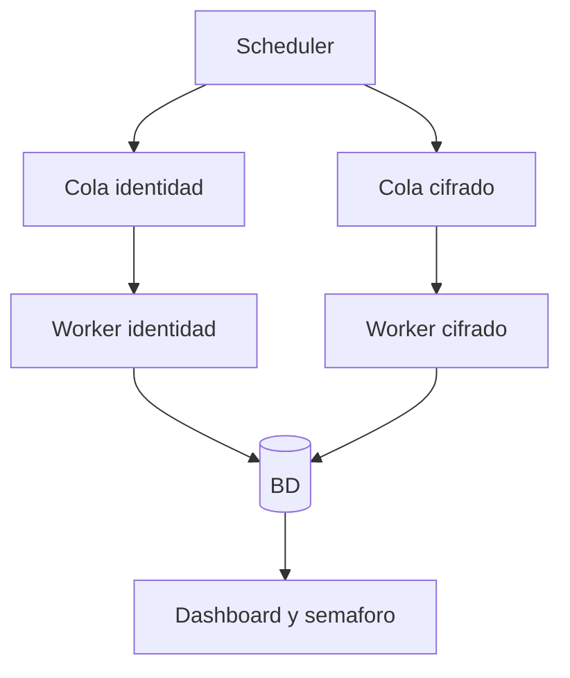

# Operacion y Automatizaciones

## Objetivo
Mostrar como funcionan workers, colas y monitoreo para mantener estabilidad operativa.

## Flujo general

## Semaforo operativo
- Verde: estable.
- Amarillo: revisar.
- Rojo: intervencion inmediata.

## Que pasa si...
- Job falla terminal: queda en failed y requiere accion controlada.
- Job no terminal: entra en reintento segun politica.
