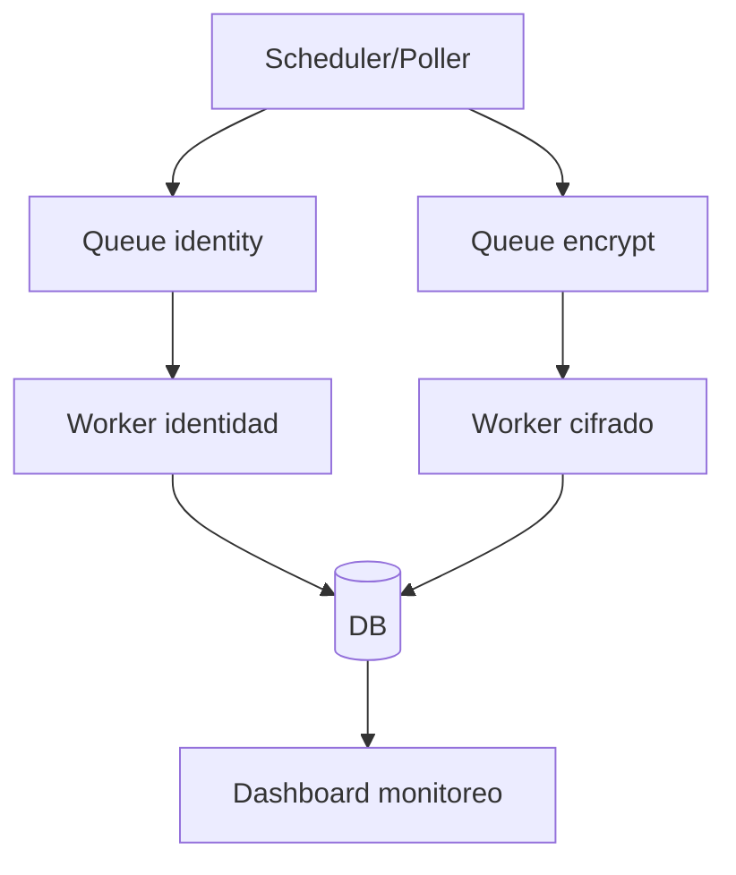
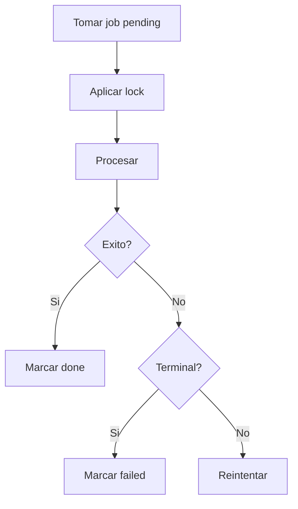

# Operacion Automatizaciones Consolidado

Fuentes origen: docs/automatizaciones/*

## Arquitectura de automatizacion


## Flujo de worker



## Fuentes Integradas (Preservacion Completa)

Regla de consolidacion aplicada:
- Cada fuente original asignada a este maestro se preserva completa debajo de su encabezado.
- Esto garantiza trazabilidad y evita perdida de informacion durante la limpieza.

### Fuente: docs/automatizaciones/01-vision-general.md

```markdown
# 01 - Vision General

## Proposito
El modulo de automatizaciones garantiza tres objetivos operativos:
1. Crear o validar la identidad digital del empleado activo.
2. Cifrar datos sensibles del empleado y provisiones relacionadas.
3. Mantener trazabilidad con colas asincronas, reintentos controlados y monitoreo operativo.

## Alcance
Incluye:
- Worker de identidad.
- Worker de cifrado.
- Colas `sys_empleado_identity_queue` y `sys_empleado_encrypt_queue`.
- API de operaciones (`/ops/queues/*`).
- Modulo UI de Monitoreo en la app.

No incluye:
- Payroll logic de negocio fuera de identidad/cifrado.
- Rotacion completa de llaves legacy (solo base preparada).

## Resultado esperado
Para empleado activo (`estado_empleado = 1`):
- `id_usuario` asociado.
- App TimeWise activa para el usuario.
- Rol por defecto `EMPLEADO_TIMEWISE` activo.
- Campos sensibles cifrados (`enc:v*`).
- `datos_encriptados_empleado = 1`.

## Trazabilidad
Puntos de control:
- Logs de workers por ciclo y por job.
- Estado por cola y por job.
- KPIs en modulo Monitoreo.
- Endpoints operativos para diagnostico y acciones controladas.
```

### Fuente: docs/automatizaciones/02-arquitectura.md

```markdown
# 02 - Arquitectura

## Modelo
Arquitectura asincrona basada en dos colas independientes:
1. Cola de Identidad (`sys_empleado_identity_queue`).
2. Cola de Cifrado (`sys_empleado_encrypt_queue`).

Cada cola tiene:
- Estados (`PENDING`, `PROCESSING`, `DONE`, `ERROR_*`).
- Lock (`locked_by_queue`, `locked_at_queue`).
- Reintentos (`attempts_queue`, `next_retry_at_queue`).
- Idempotencia (`dedupe_key` unico).

## Flujo alto nivel
1. Se crea/actualiza empleado.
2. Enqueue de identidad si aplica (`activo + sin usuario`).
3. Worker identidad procesa y vincula usuario/app/rol.
4. Enqueue de cifrado si aplica (`datos_encriptados = 0/null`).
5. Worker cifrado procesa y marca cifrado completo.

## Componentes tecnicos
Backend:
- `EmployeeDataAutomationWorkerService`
- `OpsService`
- `OpsController`

Frontend:
- `AutomationMonitoringPage`
- Cliente API `opsMonitoring.ts`

## Politica anti-starvation (correccion aplicada)
En ambos scans de enqueue:
- `ORDER BY e.id_empleado ASC`
- Exclusion de empleados ya encolados en estados activos (`PENDING`, `PROCESSING`).
- `INSERT IGNORE` + `dedupe_key` unico como segunda barrera.

Esto evita que `LIMIT` provoque starvation bajo carga alta.

## Polling y lotes actuales
- Intervalo de tick: 5 segundos.
- Batch process identity: 25 jobs por tick.
- Batch process encrypt: 50 jobs por tick.
- Batch scan enqueue: hasta 200 candidatos por ciclo por cola.

## Dise�o operativo de consulta para dashboard
- Vista operativa (default): solo `PENDING`, `PROCESSING`, `ERROR_*`.
- Vista historial: `DONE` con rango de fechas obligatorio (default ultimas 24h).
- Limite duro operativo: 200.
- Limite duro historial: 100.

## Dependencias operativas
- App activa `timewise`.
- Rol activo `EMPLEADO_TIMEWISE`.
- Permisos de monitoreo (`automation:monitor`) y operacion (`automation:admin`).
```

### Fuente: docs/automatizaciones/03-modelo-datos.md

```markdown
# 03 - Modelo de Datos

## Tablas de cola reales
La implementacion usa dos tablas fisicas (no una sola tabla con `tipo`):
- `sys_empleado_identity_queue`
- `sys_empleado_encrypt_queue`

## Campos principales (ambas colas)
- `id_identity_queue` / `id_encrypt_queue`: PK autoincremental.
- `id_empleado`: referencia al empleado.
- `dedupe_key`: clave de idempotencia unica.
- `estado_queue`: estado de procesamiento.
- `attempts_queue`: numero de intentos.
- `next_retry_at_queue`: proximo intento permitido.
- `locked_by_queue`: worker que tomo lock.
- `locked_at_queue`: fecha/hora de lock.
- `last_error_queue`: ultimo error redactado.
- `fecha_creacion_queue`: creacion.
- `fecha_modificacion_queue`: ultima modificacion.

## Estados soportados
- `PENDING`: en espera.
- `PROCESSING`: en ejecucion.
- `DONE`: finalizado correctamente.
- `ERROR_PERM`: error permanente.
- `ERROR_CONFIG`: error de configuracion.
- `ERROR_DUPLICATE`: conflicto de duplicado.
- `ERROR_FATAL`: error critico.

Estados terminales:
- `DONE`, `ERROR_PERM`, `ERROR_CONFIG`, `ERROR_DUPLICATE`, `ERROR_FATAL`.

## Idempotencia
Indices unicos:
- `UQ_employee_identity_queue_dedupe`
- `UQ_employee_encrypt_queue_dedupe`

Clave usada:
- Identidad: `identity:{id_empleado}`
- Cifrado: `encrypt:{id_empleado}`

## Indices operativos agregados (monitoreo rapido)
Identity:
- `IDX_identity_queue_operational (estado_queue, next_retry_at_queue, locked_at_queue, id_identity_queue)`
- `IDX_identity_queue_employee (id_empleado)`
- `IDX_identity_queue_stuck (estado_queue, locked_at_queue)`

Encrypt:
- `IDX_encrypt_queue_operational (estado_queue, next_retry_at_queue, locked_at_queue, id_encrypt_queue)`
- `IDX_encrypt_queue_employee (id_empleado)`
- `IDX_encrypt_queue_stuck (estado_queue, locked_at_queue)`

## Datos de empleado relacionados
Campos de control en `sys_empleados`:
- `id_usuario`
- `estado_empleado`
- `datos_encriptados_empleado`
- `version_encriptacion_empleado`
- `fecha_encriptacion_empleado`
- `email_hash_empleado`
- `cedula_hash_empleado`
```

### Fuente: docs/automatizaciones/04-worker.md

```markdown
# 04 - Worker

## Ciclo de ejecucion
Servicio: `EmployeeDataAutomationWorkerService`

Por tick:
1. Liberar locks vencidos (TTL 10 min).
2. Encolar candidatos de identidad.
3. Encolar candidatos de cifrado.
4. Procesar batch de identidad.
5. Procesar batch de cifrado.
6. Log de ciclo y backlog periodico.
7. Ejecutar purga de retencion (cada 6 horas).

## Seleccion de jobs
Criterio para tomar jobs en ambos workers:
- `estado = PENDING`
- `nextRetryAt IS NULL OR nextRetryAt <= NOW()`
- Orden por `fechaCreacion ASC`

## Locking
Al tomar job:
- `estado = PROCESSING`
- `lockedBy = workerId`
- `lockedAt = now`
- `attempts = attempts + 1`

## Finalizacion
Si completa:
- `estado = DONE`
- lock limpio
- `nextRetryAt = NULL`
- `lastError = NULL`

## Errores y reintentos
- Error terminal (`QueueTerminalError`): setea `ERROR_*` y no reintenta.
- Error no terminal:
  - Si intentos >= 5: `ERROR_FATAL`.
  - Si intentos < 5: vuelve a `PENDING` con backoff lineal (`attempts * 60s`).

## Recuperacion de huerfanos
Metodo `releaseStuckJobs`:
- Busca `PROCESSING` con `locked_at_queue < NOW() - 10 min`.
- Regresa a `PENDING` y limpia lock.

## Retencion automatica en worker
Ejecucion: cada 6 horas.

Politica aplicada:
- `DONE` older than 30 dias: se elimina.
- `ERROR_*` older than 90 dias: se elimina.
- `PROCESSING` older than 7 dias: se elimina por ruido operativo historico.

## Reglas internas worker identidad
- Si empleado no existe: `ERROR_FATAL`.
- Si empleado inactivo: `DONE` sin provisionar.
- Si ya tiene `id_usuario`: `DONE`.
- Valida existencia de app `timewise` y rol `EMPLEADO_TIMEWISE`.
- Politica de duplicado:
  - Reuse usuario existente solo si empresa coincide y no hay conflicto de cedula hash.
  - Si no coincide: `ERROR_DUPLICATE`.

## Reglas internas worker cifrado
- Cifra solo campos no cifrados (`enc:v*`).
- Marca `datos_encriptados_empleado = 1`.
- Genera hashes de cedula y email.
- Propaga cifrado a provisiones de aguinaldo.
- Evita reencriptar valores ya cifrados.
```

### Fuente: docs/automatizaciones/05-reglas-negocio.md

```markdown
# 05 - Reglas de Negocio

## Reglas obligatorias
1. Empleado activo debe tener identidad digital asociada.
2. Empleado activo debe terminar con datos sensibles cifrados.
3. Cifrado no debe depender de exponer plaintext en UI/API.
4. Errores terminales no se reintentan automaticamente.
5. Reintentos no terminales tienen limite configurable (actual: 5).

## Reglas de enqueue
Identidad:
- `estado_empleado = 1`
- `id_usuario IS NULL`
- Sin job activo en cola (`PENDING` o `PROCESSING`)

Cifrado:
- `datos_encriptados_empleado = 0 OR NULL`
- Sin job activo en cola (`PENDING` o `PROCESSING`)

## Politica de duplicado email (actual)
Comportamiento actual implementado:
- Si existe usuario con email, se intenta reutilizar.
- Solo se permite reuse seguro:
  - Misma empresa.
  - Sin conflicto de `cedula_hash` cuando ambos existen.
- Si falla condicion segura: `ERROR_DUPLICATE`.

## Dependencias de configuracion
Si falta app o rol requerido:
- Estado terminal `ERROR_CONFIG`.
- Sin loops de retry.
- Requiere correccion operativa.
```

### Fuente: docs/automatizaciones/06-monitoreo.md

```markdown
# 06 - Monitoreo

## Objetivo
Dar visibilidad operativa en tiempo real para colas, backlog, throughput y errores, sin exponer PII.

## Permisos
- `automation:monitor`: ver monitoreo.
- `automation:admin`: ejecutar acciones operativas.

Sin permiso:
- Menu no visible.
- Endpoints devuelven `403`.

## Endpoints
- `GET /ops/queues/summary`
- `GET /ops/queues/identity`
- `GET /ops/queues/encrypt`
- `GET /ops/queues/health-check`
- `POST /ops/queues/rescan`
- `POST /ops/queues/release-stuck`
- `POST /ops/queues/requeue/:id`

## Modo de uso del dashboard
### Operativo (default)
- Carga solo estados activos y de error (`PENDING`, `PROCESSING`, `ERROR_*`).
- Ordenado para diagnostico rapido.
- Limite maximo por consulta: 200.

### Historial
- Enfocado en `DONE`.
- Requiere filtro temporal (default ultimas 24h; soporta 7 y 30 dias).
- Limite maximo por consulta: 100.

## KPI y formulas
- `PENDING/PROCESSING/DONE/ERROR_*`: conteo por estado en cada cola.
- `activosSinUsuario`: empleados activos con `id_usuario IS NULL`.
- `activosNoCifrados`: empleados activos con `datos_encriptados_empleado = 0/null`.
- `plaintextDetected`: conteo de campos sensibles con valor no `enc:v%`.
- `oldestPendingAgeMinutes`: diferencia en minutos del `PENDING` mas antiguo (entre ambas colas).
- `throughputJobsPerMin5`: (`DONE_ultimos_5min_identity + DONE_ultimos_5min_encrypt`) / 5.
- `throughputJobsPerMin15`: (`DONE_ultimos_15min_identity + DONE_ultimos_15min_encrypt`) / 15.
- `errorsLast15m`: errores `ERROR_*` en los ultimos 15 minutos (ambas colas).
- `stuckProcessing`: total de jobs `PROCESSING` sin lock o lock vencido.

## UX implementada
- Pantalla 100% en espanol.
- Tooltips explicativos en tarjetas.
- Acordeon pedagogico `Que significa este monitoreo?`.
- Botones: `Actualizar ahora`, `Reanalizar ahora`, `Liberar procesos bloqueados`, `Reintentar`.
- Vista dual: `Operativo` / `Historial de procesados`.
- Semaforo de salud visible.

## Datos ocultos
- No se muestran datos sensibles de empleados.
- `last_error` redacta emails y numeros largos.
```

### Fuente: docs/automatizaciones/07-semaforo.md

```markdown
# 07 - Semaforo

## Definicion actual
El semaforo usa tres variables:
- `oldestPendingAgeMinutes`
- `errorsLast15m`
- `stuckProcessing`

## Reglas operativas vigentes
### Saludable (verde)
- `oldestPendingAgeMinutes <= 5`
- `errorsLast15m = 0`

### Requiere revision (amarillo)
- `oldestPendingAgeMinutes > 10` o
- `errorsLast15m > 3` o
- condiciones intermedias que no califican como verde

### Critico (rojo)
- `oldestPendingAgeMinutes > 30` o
- `stuckProcessing > 3`

## Interpretacion operativa
- Verde: flujo estable.
- Amarillo: degradacion o carga elevada, requiere seguimiento.
- Rojo: riesgo alto de cola atascada o falla operativa.

## Ajuste futuro
Los umbrales se pueden externalizar a configuracion para ajustar por ambiente/productividad.
```

### Fuente: docs/automatizaciones/08-pruebas.md

```markdown
# 08 - Pruebas

## Contexto
Se realizaron validaciones funcionales y de carga en entorno local con BD limpia por iteraciones, y con revision previa de codigo en workers, enqueue y monitoreo.

## Pruebas cubiertas
1. Flujo normal API/UI.
2. Insert manual SQL sin login.
3. Duplicado de email.
4. Error de configuracion (app/rol).
5. Permisos field-level.
6. Anti-loop de cifrado.
7. Recuperacion de lock.
8. Base para rotacion de clave.
9. Empleado inactivo sin login.
10. Stress test de 400 inserts.

## Hallazgos relevantes
- Correccion aplicada de starvation en enqueue con `ORDER BY` deterministico + exclusion de jobs activos.
- Idempotencia reforzada con `dedupe_key` unico + `INSERT IGNORE`.
- Politica de duplicado alineada a reuse seguro con guardas de empresa/cedula hash.
- Monitoreo operativo habilitado con endpoints y UI.

## Resultados operativos consolidados
- En carga normal: comportamiento estable, sin loops infinitos.
- En stress: backlog alto inicial con drenado progresivo.
- Throughput reportado en pruebas: pico aproximado de 44 jobs/min.
- Sin evidencia de crecimiento infinito de cola tras correccion.

## Criterios de cierre recomendados
- `activos_sin_usuario = 0`.
- `activos_no_cifrados = 0`.
- `plaintext_detected = 0`.
- Sin `PROCESSING` stuck.
- `PENDING` cercano a 0 o tendencia descendente sostenida.
```

### Fuente: docs/automatizaciones/09-operacion.md

```markdown
# 09 - Operacion y Mantenimiento

## Reiniciar workers
Los workers viven dentro de la API Nest:
1. Reiniciar proceso API (`npm run start:dev` o servicio productivo equivalente).
2. Verificar log de arranque: `Worker started id=... intervalMs=5000`.

## Revisar estado rapido SQL
```sql
SELECT estado_queue, COUNT(*) FROM sys_empleado_identity_queue GROUP BY estado_queue;
SELECT estado_queue, COUNT(*) FROM sys_empleado_encrypt_queue GROUP BY estado_queue;
SELECT COUNT(*) FROM sys_empleados WHERE estado_empleado = 1 AND id_usuario IS NULL;
SELECT COUNT(*) FROM sys_empleados WHERE estado_empleado = 1 AND (datos_encriptados_empleado = 0 OR datos_encriptados_empleado IS NULL);
```

## Liberar locks vencidos
Opcion UI (permiso admin): `Liberar procesos bloqueados`.

Opcion API:
- `POST /ops/queues/release-stuck`

## Reanalizar candidatos
Opcion UI: `Reanalizar ahora`.

Opcion API:
- `POST /ops/queues/rescan`

## Reintentar un job
Opcion UI: `Reintentar` por fila.

Opcion API:
- `POST /ops/queues/requeue/:id` body `{ "queue": "identity" | "encrypt" }`

## Politica de retencion productiva
Implementada (opcion simple enterprise):
- Mantener `DONE` por 30 dias.
- Mantener `ERROR_*` por 90 dias.
- Mantener `PROCESSING` historico maximo 7 dias.

Ejecucion automatica de purga:
- Cada 6 horas desde el worker.
- Resultado logueado en `Retention purge ...`.

## Diagnostico rapido por sintomas
Worker detenido:
- Throughput ~0
- `oldestPending` sube
- `PENDING` no drena

Alta carga:
- `PENDING` alto
- Throughput alto
- `oldestPending` estable o sube lento

Lock permanente:
- `PROCESSING` con `locked_at` viejo o null
- Resolver con `release-stuck`

## Incidente real documentado
Caso observado: menu `Monitoreo` no navegaba y no aparecia para algunos usuarios.
Causa compuesta:
1. Configuracion de menu/ruta sin navegacion directa.
2. Permisos `automation:monitor` / `automation:admin` no presentes en BD en ese entorno.

Correccion aplicada:
- Ruta directa `monitoring -> /monitoring/automation` + redirect `/monitoring`.
- Migracion y asignacion de permisos en BD.
- Re-login para refrescar contexto de permisos.
```

### Fuente: docs/automatizaciones/10-seguridad.md

```markdown
# 10 - Seguridad

## Principios
1. No exponer PII en monitoreo.
2. Acceso por permisos explicitos.
3. Acciones operativas separadas de visualizacion.
4. Redaccion de errores antes de presentar en UI.

## Controles implementados
- Permisos backend:
  - `automation:monitor` para lectura.
  - `automation:admin` para acciones.
- Guard de permisos en todos los endpoints `/ops/queues/*`.
- `redactError()` elimina correos y numeros largos en `last_error`.
- UI de monitoreo solo muestra IDs, estados y metricas agregadas.

## Cifrado y datos sensibles
- Campos sensibles se cifran con prefijo versionado `enc:v*`.
- Hash de identidad (`email_hash`, `cedula_hash`) para validaciones y dedupe.
- APIs de empleado respetan permiso `employee:view-sensitive` para exponer/ocultar sensibles.

## Auditoria operativa
Acciones manuales a auditar:
- `rescan`
- `release-stuck`
- `requeue`

Recomendacion:
- Registrar `usuario`, `fecha`, `accion`, `parametros`, `resultado` en tabla/evento de auditoria.
```

### Fuente: docs/automatizaciones/11-limpieza-operativa-db.md

```markdown
# 11 - Limpieza Operativa de Base de Datos

## Objetivo
Estandarizar el comando de "limpiar base" para pruebas, sin volver a especificar tablas cada vez.

Este runbook define:
- Que se conserva siempre.
- Que se limpia siempre.
- Orden seguro de limpieza.
- Script SQL oficial reutilizable.

## Politica oficial de limpieza
Cuando se solicite "limpiar base para pruebas":

### Conservar (NO borrar)
**Catálogos únicos:** Departamento, Puesto y Periodo de Pago son catálogos de referencia; **no se borran** en limpieza porque son únicos y son necesarios para empleados y nómina.

- `sys_apps`
- `sys_empresas`
- `sys_permisos`
- `sys_roles`
- `sys_rol_permiso`
- `org_departamentos`
- `org_puestos`
- `nom_periodos_pago`
- `migrations`

### Usuarios
- Mantener solo `sys_usuarios.id_usuario IN (1,2)`.
- Eliminar usuarios distintos a `1,2` y sus relaciones:
  - `sys_usuario_app`
  - `sys_usuario_empresa`
  - `sys_usuario_rol`
  - `sys_usuario_permiso`
  - `sys_usuario_permiso_global`
  - `sys_usuario_rol_exclusion`
  - `sys_usuario_rol_global`

### Limpiar (borrar datos operativos)
- `acc_cuotas_accion`
- `acc_acciones_personal`
- `sys_empleado_provision_aguinaldo`
- `sys_empleado_identity_queue`
- `sys_empleado_encrypt_queue`
- `sys_empleados`
- `nom_calendarios_nomina`
- `sys_notificacion_usuarios`
- `sys_notificaciones`
- `sys_domain_events`
- `sys_refresh_sessions`
- `sys_auditoria_acciones`

## Orden seguro de ejecucion
1. Borrar tablas hijas operativas (acciones/cuotas/provisiones/colas/notificaciones detalle).
2. Borrar tablas maestras operativas (`sys_empleados`, nomina, notificaciones, eventos, sesiones, auditoria).
3. Limpiar relaciones de usuarios (excepto IDs 1 y 2).
4. Borrar usuarios fuera de IDs 1 y 2.
5. Validar conteos finales.

## Script SQL oficial
```sql
-- 1) Operativo RRHH/colas
DELETE FROM acc_cuotas_accion;
DELETE FROM acc_acciones_personal;
DELETE FROM sys_empleado_provision_aguinaldo;
DELETE FROM sys_empleado_identity_queue;
DELETE FROM sys_empleado_encrypt_queue;
DELETE FROM sys_empleados;

-- 2) Nomina operativa (nom_periodos_pago NO se borra: catálogo único, ver "Conservar")
DELETE FROM nom_calendarios_nomina;

-- 3) Notificaciones, eventos, sesiones, auditoria
DELETE FROM sys_notificacion_usuarios;
DELETE FROM sys_notificaciones;
DELETE FROM sys_domain_events;
DELETE FROM sys_refresh_sessions;
DELETE FROM sys_auditoria_acciones;

-- 4) Relaciones de usuarios (solo conservar users 1 y 2)
DELETE FROM sys_usuario_permiso WHERE id_usuario NOT IN (1,2);
DELETE FROM sys_usuario_permiso_global WHERE id_usuario NOT IN (1,2);
DELETE FROM sys_usuario_rol_exclusion WHERE id_usuario NOT IN (1,2);
DELETE FROM sys_usuario_rol_global WHERE id_usuario NOT IN (1,2);
DELETE FROM sys_usuario_rol WHERE id_usuario NOT IN (1,2);
DELETE FROM sys_usuario_app WHERE id_usuario NOT IN (1,2);
DELETE FROM sys_usuario_empresa WHERE id_usuario NOT IN (1,2);

-- 5) Usuarios
DELETE FROM sys_usuarios WHERE id_usuario NOT IN (1,2);
```

## Validacion post-limpieza
```sql
SELECT id_usuario, email_usuario FROM sys_usuarios ORDER BY id_usuario;

SELECT COUNT(*) AS empleados FROM sys_empleados;
SELECT COUNT(*) AS identity_queue FROM sys_empleado_identity_queue;
SELECT COUNT(*) AS encrypt_queue FROM sys_empleado_encrypt_queue;
SELECT COUNT(*) AS provisiones FROM sys_empleado_provision_aguinaldo;
SELECT COUNT(*) AS periodos_pago FROM nom_periodos_pago;  -- debe conservarse (catálogo único)
SELECT COUNT(*) AS notificaciones FROM sys_notificaciones;
SELECT COUNT(*) AS sesiones FROM sys_refresh_sessions;
SELECT COUNT(*) AS auditoria FROM sys_auditoria_acciones;

SELECT COUNT(*) AS users_fuera_12 FROM sys_usuarios WHERE id_usuario NOT IN (1,2);
SELECT COUNT(*) AS usuario_app_fuera_12 FROM sys_usuario_app WHERE id_usuario NOT IN (1,2);
SELECT COUNT(*) AS usuario_empresa_fuera_12 FROM sys_usuario_empresa WHERE id_usuario NOT IN (1,2);
SELECT COUNT(*) AS usuario_rol_fuera_12 FROM sys_usuario_rol WHERE id_usuario NOT IN (1,2);

-- Catalogos que deben permanecer (departamento, puesto, periodo de pago: únicos, no se borran)
SELECT COUNT(*) AS apps FROM sys_apps;
SELECT COUNT(*) AS empresas FROM sys_empresas;
SELECT COUNT(*) AS permisos FROM sys_permisos;
SELECT COUNT(*) AS roles FROM sys_roles;
SELECT COUNT(*) AS rol_permiso FROM sys_rol_permiso;
SELECT COUNT(*) AS departamentos FROM org_departamentos;
SELECT COUNT(*) AS puestos FROM org_puestos;
SELECT COUNT(*) AS periodos_pago FROM nom_periodos_pago;
```

## Regla operativa para futuras solicitudes
Si el usuario pide "limpiar base" o "dejar limpio para pruebas", aplicar automaticamente este runbook, salvo que el usuario indique una excepcion explicita.
```

