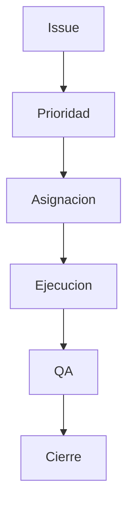

# 🛠️ Backlog y Pendientes

## 🎯 Objetivo
Priorizar trabajo pendiente sin perder visibilidad de riesgo.

## 🔄 Flujo de gestion
1. Registrar issue.
2. Clasificar prioridad (P0/P1/P2).
3. Asignar responsable.
4. Ejecutar.
5. Validar.
6. Cerrar.

## 📊 Tablero Vivo de Pendientes (Fuente Unica)
| ID | Modulo | Pendiente | Prioridad | Estado | Owner | Fecha objetivo | Bloqueo actual | Criterio de cierre |
|---|---|---|---|---|---|---|---|---|
| PEND-001 | Seguridad | Endurecer politicas de cifrado y rotacion | P0 | En curso | Arquitectura | 2026-03-20 | Definir ventana de despliegue | Prueba de rotacion + evidencia QA + doc actualizada |
| PEND-002 | Observabilidad | Estandar de logging estructurado por modulo | P1 | Pendiente | Backend Lead | 2026-03-25 | Catalogo de eventos incompleto | Dashboard/logs por modulo y runbook de consulta |
| PEND-003 | Plataforma | Pipeline CI/CD con quality gates | P1 | Pendiente | DevOps | 2026-03-28 | Falta baseline de checks | Pipeline activo con lint/test/build y politica de merge |
| PEND-004 | Rendimiento | Baseline performance en planilla masiva | P1 | En curso | Performance Owner | 2026-03-30 | Dataset de carga no cerrado | Reporte de tiempos p50/p95 + plan de optimizacion |
| PEND-005 | API | Catalogo de contratos y versionado funcional | P1 | En curso | API Owner | 2026-03-22 | Alinear endpoints legacy | Catalogo completo en 16-operacion + checklist de cambios |
| PEND-006 | QA | Suite regression end-to-end de flujos criticos | P0 | Pendiente | QA Lead | 2026-03-24 | Casos faltantes por traslado | Suite ejecutada y evidenciada en release candidate |
| PEND-007 | Seguridad | Revision de permisos sensibles por rol Master | P0 | Pendiente | Security Lead | 2026-03-21 | Validacion de excepciones globales | Matriz de permisos auditada y aprobada |
| PEND-008 | Operacion | Runbooks de incidente nivel 1 y 2 completos | P1 | En curso | Operaciones | 2026-03-26 | Falta validacion cruzada con soporte | Runbooks probados en simulacro |
| PEND-009 | Datos | Diccionario de datos con campos obligatorios por modulo | P2 | Pendiente | Data Steward | 2026-04-02 | Revisar modulos secundarios | Diccionario actualizado + versionado |
| PEND-010 | Producto | Capacitacion usuario final basada en walkthroughs | P2 | Pendiente | Product Ops | 2026-04-05 | Agenda de capacitacion | Sesion impartida + feedback documentado |
| PEND-011 | Planilla | Terminar vista `Distribucion de la planilla` (detalle funcional completo) | P1 | Pendiente | Frontend + Backend | 2026-03-31 | Vista actual aun en construccion (placeholder parcial) | Vista final con detalle completo + QA funcional + doc actualizada |

## 📊 Definicion de estado del tablero
- `Pendiente`: no iniciado.
- `En curso`: con trabajo activo y owner asignado.
- `Bloqueado`: depende de decision o entrega externa.
- `Listo para QA`: implementado, pendiente validacion.
- `Cerrado`: validado + documentado.

## 🎯 Regla
Todo pendiente debe tener estado, owner, fecha objetivo, bloqueo y criterio de salida.

## 🔗 Ver tambien
- [Pendientes tecnicos](../14-manual-tecnico/06-PENDIENTES-TECNICOS.md)
- [Gobierno de cambios docs](../15-enterprise-gobierno/03-GOBIERNO-CAMBIOS-DOCS.md)
