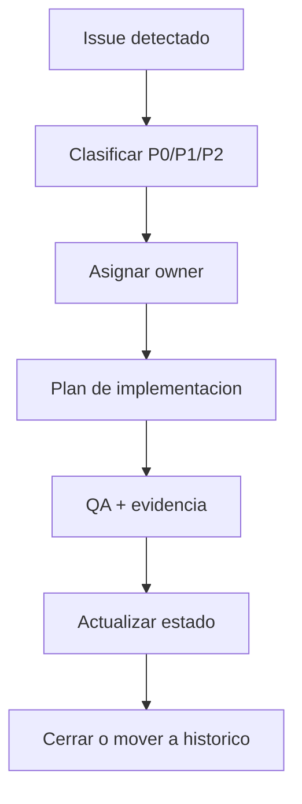
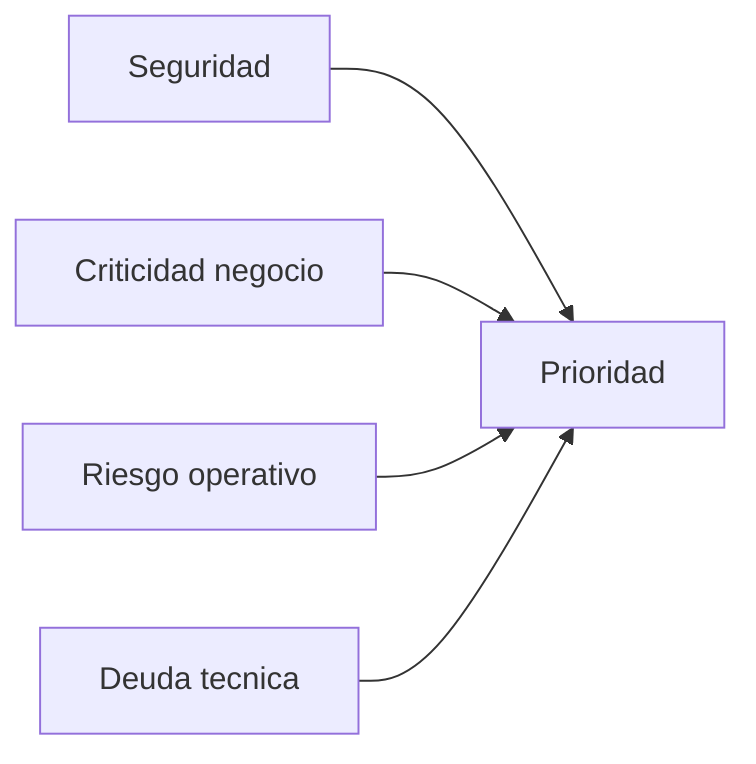

# Backlog Pendientes Consolidado

Fuentes origen: docs/PENDING/* + 28-PendientesAccion.md

## Flujo de gestion de pendientes


## Flujo de priorizacion tecnica



## Fuentes Integradas (Preservacion Completa)

Regla de consolidacion aplicada:
- Cada fuente original asignada a este maestro se preserva completa debajo de su encabezado.
- Esto garantiza trazabilidad y evita perdida de informacion durante la limpieza.

### Fuente: docs/28-PendientesAccion.md

```markdown
# 28 - Pendientes de Accion (Backlog Tecnico-Funcional)

**Ultima actualizacion:** 2026-03-01  
**Objetivo:** Registrar tareas pendientes que deben implementarse en futuras iteraciones.

---

- UI: se elimin? la secci?n "Planillas en las que entrar?a" en el modal de vacaciones. La asignaci?n es interna.


- Solape de planillas: si una fecha coincide con m?ltiples planillas ABIERTAS/EN_PROCESO, **no se bloquea** la selecci?n. Se asigna autom?ticamente por prioridad: estado ABIERTA > EN_PROCESO; si empatan, menor fecha de inicio; si empatan, menor ID.
- Se muestra advertencia en UI cuando hay fechas solapadas.

## PEND-001 - Bloqueo de inactivacion de empresa con planillas en estados no permitidos

### Estado

- Completado (2026-02-27)

### Prioridad

- Alta

### Contexto del problema

Actualmente se puede intentar inactivar una empresa sin validar si existen planillas activas o pendientes de accion. Esto puede dejar procesos de nomina inconsistentes y afectar control operativo.

### Regla de negocio solicitada

Al intentar inactivar una empresa:

1. Si existe al menos una planilla de esa empresa en estado activo o pendiente de accion, la empresa **no** se puede inactivar.
2. Si la planilla no ha pasado del primer estado del flujo, la empresa **no** se puede inactivar.
3. Solo se permite inactivar cuando todas las planillas vinculadas estan en estados finales permitidos para cierre.

### Definicion funcional inicial de estados

Pendiente de confirmacion por negocio:

1. Catalogo exacto de estados "bloqueantes".
2. Catalogo exacto de estados "finales permitidos".
3. Definicion formal de "primer estado" en el workflow de planillas.

### Alcance tecnico esperado

Backend (obligatorio):

1. Validar regla antes de ejecutar la inactivacion de empresa.
2. Retornar `409 Conflict` con mensaje funcional cuando exista bloqueo.
3. Registrar evento de auditoria cuando la operacion sea rechazada por regla de negocio.

Frontend:

1. Mostrar mensaje claro al usuario con la razon del bloqueo.
2. Evitar mensaje generico de error tecnico.

Base de datos:

1. Verificar indices en columnas usadas para validar planillas por empresa y estado.
2. Confirmar que la consulta de validacion no genere degradacion de rendimiento.

### Criterios de aceptacion

1. Dado una empresa con planillas bloqueantes, cuando se intenta inactivar, entonces el API responde `409` y no cambia estado de empresa. **Cumplido**
2. Dado una empresa sin planillas bloqueantes, cuando se intenta inactivar, entonces el API responde exito y la empresa queda inactiva. **Cumplido**
3. El frontend muestra el motivo funcional del bloqueo. **Cumplido**
4. Queda registro de auditoria del intento rechazado. **Cumplido**

### QA minimo requerido

API:

1. Happy path: empresa sin planillas bloqueantes.
2. Bloqueo por planilla activa.
3. Bloqueo por planilla pendiente de accion.
4. Bloqueo por planilla en primer estado.
5. Concurrencia: dos intentos de inactivacion simultaneos.

UI:

1. Mensaje correcto cuando recibe `409`.
2. Estado visual consistente tras rechazo (sin desincronizacion de lista).

### Riesgo si no se implementa

1. Inactivacion de empresas con procesos de nomina inconclusos.
2. Riesgo de datos inconsistentes y cierre operativo incorrecto.
3. Mayor carga de soporte por correcciones manuales.

### Cierre tecnico

- Implementado en backend con respuesta `409 Conflict` para inactivacion bloqueada.
- Cubierto con test unitario en `CompaniesService`.
- Integrado en frontend para mostrar mensaje funcional (sin error generico tecnico).

---

## PEND-002 - Bloqueo de inactivacin de empleado con acciones de personal realizadas

### Estado

- Pendiente

### Prioridad

- Alta

### Contexto del problema

Actualmente se puede inactivar un empleado sin validar si tiene acciones de personal (acciones de personal) ya realizadas o en curso. Inactivar en ese caso puede dejar historial inconsistente o procesos pendientes hurfanos.

### Regla de negocio solicitada

Al intentar inactivar un empleado:

1. Si el empleado tiene **acciones de personal** hechas (registros asociados que no permitan cierre o reversin limpia), **no** se debe permitir inactivar.
2. Definir con negocio qu acciones de personal son bloqueantes (ej. solicitudes de vacaciones aprobadas no gozadas, permisos pendientes, etc.).
3. Solo permitir inactivar cuando no existan acciones de personal bloqueantes o cuando estn en estado que permita inactivacin segn catlogo acordado.

### Alcance tcnico esperado

- Backend: validar existencia de acciones de personal bloqueantes antes de ejecutar inactivacin; retornar `409 Conflict` con mensaje claro si aplica.
- Frontend: mostrar mensaje funcional al usuario cuando el intento de inactivar sea rechazado.
- Documentar en este pendiente la definicin final de acciones de personal bloqueantes una vez acordada con negocio.

### Criterios de aceptacin (preliminar)

1. Dado un empleado con acciones de personal bloqueantes, al intentar inactivar, el API responde `409` y el empleado no cambia de estado.
2. Dado un empleado sin acciones de personal bloqueantes, la inactivacin se ejecuta con xito.
3. El frontend muestra el motivo del bloqueo cuando corresponda.

---

## Completado / Actualizado (sesion 2026-03-04)

1. **Bloqueo por empleado verificado en planilla**
   - Si el empleado esta verificado en una planilla, no se permite crear/editar acciones que apunten a esa planilla.
   - Para permitir cambios, primero se debe desmarcar la verificacion.

2. **Calculo legal en planilla**
   - Se calcula CCSS por empresa desde `nom_cargas_sociales`.
   - Se calcula impuesto de renta con tramos CR y creditos por hijo/conyuge (quincenal solo segunda quincena).

---

## Completado / Actualizado (sesin 2026-02-24)

### Mdulo Empleados  Edicin y UX

1. **EmployeeEditModal**
   - Modal de edicin alineado al de creacin: mismas pestaas y campos (Informacin Personal, Contacto, Laboral, Financiera, Autogestin, Histrico Laboral).
   - Carga de datos del empleado con `useEmployee`; formulario se rellena con `mapEmployeeToFormValues` e `initialValues` al abrir.
   - Actualizacin va `useUpdateEmployee`; payload solo incluye campos aceptados por el backend (`UpdateEmployeePayload`).
   - Campo **Fecha de ingreso** y **Cdigo de empleado** en solo lectura en edicin (backend no permite actualizarlos).
   - **Empresa** en edicin mostrada pero no editable (por diseo actual).

2. **Activar / Inactivar en el modal de edicin**
   - Switch Activo/Inactivo habilitado segn permisos `canInactivateEmployee` y `canReactivateEmployee`.
   - Al guardar solo cambio de estado: se llama `PATCH /employees/:id/inactivate` o `PATCH /employees/:id/reactivate` segn corresponda.

3. **Correccin de avisos en consola (Ant Design / rc)**
   - **Collapse (EmployeesListPage):** uso de `items` en lugar de `children` / `Collapse.Panel` para evitar deprecacin de rc-collapse.
   - **Modal (EmployeeEditModal):** `destroyOnClose` reemplazado por `destroyOnHidden`.
   - **Spin (EmployeeEditModal):** `tip` reemplazado por `description`.
   - **Form (EmployeeEditModal):** eliminado `initialValue` en `Form.Item` para campos ya definidos en `initialValues` del Form (`cantidadHijos`, `salarioBase`, `monedaSalario`, `vacacionesAcumuladas`, `cesantiaAcumulada`) para evitar el aviso de Field can not overwrite.

4. **Documentacin**
   - Este documento (28-PendientesAccion.md) actualizado con PEND-002 (regla de inactivacin de empleado con acciones de personal) y con la seccin Completado / Actualizado de esta sesin.

---

## Notas de gestion

1. Este documento es de backlog vivo; cada pendiente nuevo debe agregarse con ID incremental `PEND-XXX`.
2. Cuando una tarea pase a implementacion, referenciar PR, commit y fecha de cierre.

---

## PEND-003 - Implementacion Fase 1 Acciones de Personal + Planilla (compatibilidad incremental)

### Estado

- En progreso (Dia 1 ejecutado en `mysql_hr_pro`)

### Prioridad

- Alta

### Referencia funcional/tecnica

- Documento rector: `docs/42-AccionesPersonal-Planilla-Fase0Cerrada.md`.
- Blueprint base: `docs/40-BlueprintPlanillaV2Compatible.md`.

### Alcance (Fase 1)

1. Alter incremental de tabla de acciones existente (sin reemplazo).
2. Agregar `consumed_run_id`, `version_lock`, metadatos de invalidacion/expiracion/cancelacion.
3. Crear indice `idx_accion_consumed`.
4. Crear/ajustar tabla hija de ausencias (si no existe equivalente).
5. Seed permisos `hr_action:*` de fase 1.
6. Implementar blindaje anti-delete (servicio + trigger).

### Condiciones de entrada (obligatorias)

1. Confirmar PK real de `nom_calendarios_nomina` para FK `consumed_run_id`.
2. Confirmar mapping exacto de estados actuales de acciones.
3. Confirmar politica de prorrateo para solapes multi-periodo.

### Criterios de aceptacion

1. Migracion ejecuta sin `DROP` ni `RENAME`.
2. Endpoints legacy siguen operativos despues del `ALTER`.
3. FK de consumo y nuevos indices quedan creados.
4. No se puede eliminar fisicamente una accion en estado no permitido.
5. Permisos de fase 1 quedan sembrados y asignables por rol.

### Avance registrado (2026-02-27)

---

## PEND-004 - Traslado de empleados entre empresas con portabilidad de saldo de vacaciones

### Estado

- En progreso (backend base completo; saldo vacaciones pendiente)

### Prioridad

- Alta

### Contexto del problema

La operacion mueve empleados entre subsidiarias por decision del negocio y requieren mantener los dias disponibles de vacaciones al trasladar el empleado. El modelo actual liga vacaciones a empresa, por lo que el saldo no se porta automaticamente.

### Regla de negocio solicitada

Al trasladar un empleado de empresa origen a empresa destino:

1. El empleado cambia de empresa en su registro base.
2. El saldo de vacaciones disponible debe trasladarse a la nueva empresa (no se pierde).
3. La transferencia debe quedar auditada en el ledger con referencia trazable.
4. La provision futura de vacaciones debe quedar asociada a la empresa destino.
5. El saldo historico en empresa origen queda registrado y no se modifica luego del traslado.

### Politica acordada (2026-03-04)

1. **Bloqueo obligatorio** si no existen periodos/planillas en empresa destino.
2. Traslado **solo al inicio de periodo** (no se permite mitad de periodo).
3. **Acciones pendientes bloqueantes**: se definen por politica (ej. licencias/incapacidades/aumentos pendientes).
4. Acciones recurrentes de ley (CCSS/IVM) **no bloquean**.
5. **Politica de continuidad:** por defecto continuidad. Liquidacion solo aplica en escenarios de renuncia/despido.
5. Politica por estado (acordada):
   - **Se trasladan:** DRAFT, PENDING_SUPERVISOR, PENDING_RRHH, APPROVED.
   - **No se trasladan:** CONSUMED, INVALIDATED, CANCELLED, EXPIRED, REJECTED.
6. Si un rango cruza traslado: **recalcular por calendario destino** (solo futuros).
7. **Simulacion previa obligatoria** antes de ejecutar el traslado.
8. Auditoria: registrar traslado con origen/destino, fecha efectiva, usuario y resumen tecnico (acciones movidas/invalidas/recalculadas).

### Alcance tecnico esperado

Backend:

1. Nuevo flujo transaccional de traslado masivo de empleados entre empresas.
2. Lectura de saldo actual desde `sys_empleado_vacaciones_ledger` (ultimo `saldo_resultante_vacaciones`). **Pendiente**
3. En empresa origen: registrar ajuste negativo (tipo `ADJUSTMENT` o `REVERSAL`). **Pendiente**
4. En empresa destino: registrar ajuste positivo (tipo `ADJUSTMENT` o `INITIAL`). **Pendiente**
5. Ambos movimientos enlazados por `source_type_vacaciones = 'TRANSFER'` y `source_id_vacaciones` comun. **Pendiente**
6. Garantizar trazabilidad: saldo anterior y saldo posterior registrados en ledger. **Pendiente**

Frontend:

1. Vista dedicada para traslado masivo (empresa origen, empresa destino, seleccion de empleados).
2. Selector de **tipo de periodo de pago** (filtra empleados elegibles por periodo).
3. Opcion "Aplicar para todos los empleados": si esta activa, un solo destino; si no, select por empleado.
4. Validacion por empleado al seleccionar destino (check verde/rojo + motivos).
5. Simulacion previa obligatoria con resumen por empleado.
6. Opcion explicita de "trasladar saldo de vacaciones".
7. Mensajeria clara y resumen por empleado.

Auditoria:

1. Registrar evento de traslado en outbox.
2. Guardar metadatos de transferencia para trazabilidad.
3. Considerar tabla dedicada `sys_empleado_transferencias` (origen/destino/saldo/actor/fecha) para consulta operativa.

### Criterios de aceptacion

1. El empleado queda asignado a la empresa destino.
2. El saldo disponible de vacaciones se conserva (mismo total, nueva cuenta).
3. La transferencia queda registrada en ledger con referencia comun.

### Implementacion base completada (2026-03-04)

1. **API de simulacion y ejecucion** (permiso `payroll:intercompany-transfer`):
   - `POST /api/payroll/intercompany-transfer/simulate`
   - `POST /api/payroll/intercompany-transfer/execute`
2. **Entidad y tabla de auditoria** `sys_empleado_transferencias` creada y migrada.
3. **Reglas aplicadas**:
   - Bloqueo si no existe periodo destino o si fecha efectiva no es inicio de periodo.
   - Bloqueo si planilla origen en estados ABIERTA/EN_PROCESO/VERIFICADA para la fecha efectiva.
   - Solo se trasladan acciones en estados DRAFT/PENDING_SUPERVISOR/PENDING_RRHH/APPROVED.
   - Acciones CONSUMED/INVALIDATED/CANCELLED/EXPIRED/REJECTED no se trasladan.
   - Acciones por rango que cruzan fecha se **recalcula** en destino; si ya estaban asociadas a planilla, se bloquea.
4. **Ajuste de datos**:
   - `acc_acciones_personal` actualiza `id_empresa` y `id_calendario_nomina`.
   - Tablas de lineas actualizan `id_empresa` y `id_calendario_nomina` por fecha.
5. **Tests**: suite completa en verde (31/31), incluyendo intercompany transfer.

- Estructura incremental aplicada en `acc_acciones_personal`.
- Indices v2 aplicados.
- Trigger anti-delete activo.
- Permisos `hr_action:*` fase 1 sembrados y asignados por rol.
- Pendiente del PEND-003:
  - consolidacion final de estados en todos los flujos (incluyendo supervisor/rrhh cuando se habilite),
  - integracion snapshot/retro/recalculo (Fase 2/3).

Actualizacion Dia 2 (backend):

- Solape por interseccion implementado en consumo de planilla.
- Dominio de acciones ampliado a catalogo objetivo con compatibilidad legacy.
- Controlador de acciones migrado a permisos `hr_action:*`.
- Pruebas API en verde (`27/27`, `217/217`).

Actualizacion Dia 3 (snapshot/retro/recalculo):

- Snapshot enriquecido de inputs de planilla (campos de movimiento, unidades, montos base/final, retro).
- Flags de recalculo agregados en planilla (`requires_recalculation`, `last_snapshot_at`).
- Marca automatica de recalculo al aprobar acciones elegibles durante corrida en proceso.
- Migracion incremental aplicada en `mysql_hr_pro` y validada.
- Pruebas API se mantienen en verde (`27/27`, `217/217`).

---

## Completado / Actualizado (sesion 2026-03-01)

### Acciones de Personal - avance consolidado por modulo

1. Se cerraron modulos operativos con patron comun:
   - Ausencias
   - Licencias y Permisos
   - Incapacidades
   - Bonificaciones
   - Horas Extra
   - Retenciones
   - Descuentos
2. Se oficializo y aplico modelo de split por periodo al guardar:
   - lineas de periodos distintos crean acciones separadas,
   - lineas del mismo periodo permanecen en una sola accion.
3. Se documentaron cierres en docs de implementacion operativa:
   - `46` Bonificaciones
   - `47` Horas Extra
   - `49` Descuentos
4. Se estabilizo corrida de migraciones con `migration:run:safe` y baseline reconcile.
5. Pendiente vigente principal:
   - extender patron a acciones restantes no migradas en menu de Acciones de Personal.

---
## Actualizaci?n 2026-03-02 ? Vacaciones sin selecci?n de planilla (ACTUALIZACION-VACACIONES-2026-03-02
UI-PLANILLAS-REMOVIDA-2026-03-02
SOLAPE-PLANILLAS-2026-03-02)
- KPITAL (RRHH): el usuario ya no selecciona planilla en Vacaciones. Selecciona fechas y movimiento; el sistema determina la planilla elegible por cada fecha con base en calendario de n?mina (empresa/empleado/moneda/periodo).
- Validaciones: fines de semana y feriados bloqueados; fechas ya reservadas bloqueadas; saldo disponible; fechas deben pertenecer a un periodo elegible; si una fecha coincide con m?ltiples periodos, se rechaza.
- Consistencia de tipo: todas las fechas deben pertenecer al mismo tipo de planilla. Si no, error.
- Split autom?tico en creaci?n: si las fechas caen en m?s de un periodo del mismo tipo, se crean acciones separadas por periodo. En edici?n, solo se permite un periodo.
- Persistencia: `acc_vacaciones_fechas` y `acc_cuotas_accion` guardan `id_calendario_nomina` por fecha; el header de acci?n puede quedar con `id_calendario_nomina = NULL`.
- TimeWise: acciones de vacaciones se crean en estado Borrador sin planilla. RRHH completa fechas/movimiento en KPITAL; el sistema asigna planilla por fecha.
- Planilla: al cargar una planilla se consumen las fechas cuyo `id_calendario_nomina` coincide con la planilla y estado aprobado. No se requiere que el header tenga planilla.
---

## Pendiente operativo agregado - 2026-03-09 01:54:09 -06:00

Tema: Traslado interempresas - validacion funcional final de refresco UI.

Pendiente:
1. Ejecutar QA manual del flujo Simular -> Ejecutar traslado -> Refrescar.
2. Confirmar que el empleado ejecutado no permanece en grilla de origen por estado stale.
3. Confirmar consistencia en resimulacion posterior.

Referencia:
- docs/50-Handoff-TrasladoInterempresas-20260309.md
- docs/Test/TEST-EXECUTION-REPORT.md (Fase 50)

---

## Completado / Actualizado (sesion 2026-03-10)

### Bloque Planilla Regular - Cierre documental y operativo

1. **Cargar Planilla Regular (UI/operacion) - completado**
   - Flujo estabilizado para seleccionar planilla Regular y construir tabla de empleados/acciones.
   - Boton `Cargar planilla` definido como accion de previsualizacion operativa (no aplica/cierra planilla).

2. **Regla financiera documentada - completada**
   - Solo acciones en estado `APPROVED` impactan totales financieros (devengado/cargas/renta/neto).
   - Acciones pendientes se muestran para revision pero no alteran total financiero.

3. **Detalle de acciones con formato legado - completado**
   - `Tipo de Accion` enriquecido con formato:
     - `Categoria (cantidad) - Movimiento - Detalle`.
   - Incluye casos de Ausencias con `Justificada/No Justificada` y `Remunerada/No Remunerada` cuando aplique.

4. **Aprobacion desde tabla - completado**
   - Lineas en `Pendiente Supervisor` muestran accion `Aprobar`.
   - Lineas sin accion manual muestran `--`.

5. **Semaforo visual de estados - completado**
   - Pendientes en rojo.
   - Aprobadas y cargas sociales repetitivas en verde.

6. **Cargas sociales por empresa - regla consolidada**
   - Si la empresa no tiene `nom_cargas_sociales` activas, `Cargas Sociales = 0`.
   - Esto se considera dato/configuracion faltante, no bug de calculo.

7. **Documentacion transversal actualizada**
   - Se actualizaron docs 40, 50, reglas importantes, indice y bloque de testing/manual.

### Siguiente pendiente de continuidad

- Continuar con cierre funcional de planilla aplicada (fase posterior), manteniendo trazabilidad entre preview, verificacion y aplicacion final.
```

### Fuente: docs/PENDING/01-TESTING.md

```markdown
#  TESTING - Issues Pendientes

**Prioridad Global:** P0 (CRTICO)
**Esfuerzo Total:** 2-3 semanas
**Asignado a:** [Persona de testing confirmada]

---

## ISSUE-001: Configurar infraestructura de testing

**Prioridad:** P0
**Esfuerzo:** S (1 da)
**Etiquetas:** [testing] [infrastructure]

###  Descripcin
Aunque package.json tiene scripts de testing, falta configuracin completa de Jest y setup de base de datos de prueba.

###  Objetivo
- Jest configurado correctamente con TypeORM
- Base de datos in-memory o contenedor Docker para tests
- Coverage reports funcionando

###  Archivos Afectados
- `api/jest.config.js` (crear)
- `api/test/setup.ts` (crear)
- `api/test/teardown.ts` (crear)
- `api/.env.test` (crear)

###  Criterios de Aceptacin
- [ ] `npm run test` ejecuta sin errores
- [ ] `npm run test:cov` genera reporte de coverage
- [ ] BD de test se crea/destruye automticamente
- [ ] Setup carga fixtures bsicos (admin user, etc.)

###  Implementacin Sugerida

```typescript
// jest.config.js
module.exports = {
  moduleFileExtensions: ['js', 'json', 'ts'],
  rootDir: 'src',
  testRegex: '.*\\.spec\\.ts$',
  transform: {
    '^.+\\.(t|j)s$': 'ts-jest',
  },
  collectCoverageFrom: [
    '**/*.(t|j)s',
    '!**/*.entity.ts',
    '!**/*.dto.ts',
  ],
  coverageDirectory: '../coverage',
  testEnvironment: 'node',
  setupFilesAfterEnv: ['<rootDir>/../test/setup.ts'],
};

// test/setup.ts
import { DataSource } from 'typeorm';

let dataSource: DataSource;

beforeAll(async () => {
  dataSource = new DataSource({
    type: 'mysql',
    host: 'localhost',
    port: 3307, // diferente del prod
    username: 'test',
    password: 'test',
    database: 'kpital_test',
    entities: ['src/**/*.entity.ts'],
    synchronize: true,
  });
  await dataSource.initialize();
});

afterAll(async () => {
  await dataSource.destroy();
});
```

###  Cmo Verificar
```bash
npm run test
# Debe mostrar: "No tests found" (porque an no hay .spec.ts)
npm run test:cov
# Debe generar carpeta coverage/
```

---

## ISSUE-002: Tests unitarios - AuthService

**Prioridad:** P0
**Esfuerzo:** M (2-3 das)
**Etiquetas:** [testing] [auth] [unit]

###  Descripcin
AuthService es crtico (login, JWT, refresh tokens) pero sin tests. Riesgo alto de regresiones.

###  Objetivo
Cobertura 80%+ de AuthService con tests unitarios.

###  Archivos Afectados
- `api/src/modules/auth/auth.service.spec.ts` (crear)
- `api/src/modules/auth/auth.service.ts`

###  Criterios de Aceptacin
- [ ] Test: Login con credenciales vlidas retorna tokens
- [ ] Test: Login con credenciales invlidas lanza UnauthorizedException
- [ ] Test: 5 intentos fallidos bloquean cuenta
- [ ] Test: Refresh token rotation funciona correctamente
- [ ] Test: Refresh token viejo queda revocado despus de rotar
- [ ] Test: Refresh token con JTI invlido falla
- [ ] Test: buildSession retorna permisos correctos
- [ ] Test: resolvePermissions con DENY override funciona
- [ ] Test: Microsoft login bindea identidad si no existe
- [ ] Coverage: 80%+

###  Implementacin Sugerida

```typescript
// auth.service.spec.ts
import { Test, TestingModule } from '@nestjs/testing';
import { AuthService } from './auth.service';
import { UsersService } from './users.service';
import { JwtService } from '@nestjs/jwt';
import { UnauthorizedException } from '@nestjs/common';
import * as bcrypt from 'bcrypt';

describe('AuthService', () => {
  let service: AuthService;
  let usersService: UsersService;
  let jwtService: JwtService;

  beforeEach(async () => {
    const module: TestingModule = await Test.createTestingModule({
      providers: [
        AuthService,
        {
          provide: UsersService,
          useValue: {
            validateForLogin: jest.fn(),
            registerFailedAttempt: jest.fn(),
            registerSuccessfulLogin: jest.fn(),
          },
        },
        {
          provide: JwtService,
          useValue: {
            sign: jest.fn(() => 'mock-token'),
            verify: jest.fn(),
          },
        },
        // ...otros repositorios mockeados
      ],
    }).compile();

    service = module.get<AuthService>(AuthService);
    usersService = module.get<UsersService>(UsersService);
  });

  describe('login', () => {
    it('debe retornar tokens cuando credenciales son vlidas', async () => {
      const mockUser = {
        id: 1,
        email: 'test@example.com',
        passwordHash: await bcrypt.hash('password123', 12),
        nombre: 'Test',
        apellido: 'User',
      };

      jest.spyOn(usersService, 'validateForLogin').mockResolvedValue(mockUser as any);

      const result = await service.login('test@example.com', 'password123');

      expect(result).toHaveProperty('accessToken');
      expect(result).toHaveProperty('refreshToken');
      expect(result).toHaveProperty('csrfToken');
      expect(result).toHaveProperty('session');
    });

    it('debe lanzar UnauthorizedException cuando password es incorrecto', async () => {
      const mockUser = {
        id: 1,
        email: 'test@example.com',
        passwordHash: await bcrypt.hash('correct-password', 12),
      };

      jest.spyOn(usersService, 'validateForLogin').mockResolvedValue(mockUser as any);

      await expect(
        service.login('test@example.com', 'wrong-password')
      ).rejects.toThrow(UnauthorizedException);
    });

    // ...ms tests
  });
});
```

###  Cmo Verificar
```bash
npm run test -- auth.service.spec.ts
npm run test:cov -- auth.service.spec.ts
# Debe mostrar cobertura 80%+
```

---

## ISSUE-003: Tests unitarios - CompaniesService

**Prioridad:** P0
**Esfuerzo:** M (2-3 das)
**Etiquetas:** [testing] [companies] [unit]

###  Descripcin
CompaniesService tiene lgica de negocio crtica (soft delete, audit trail, logo management).

###  Objetivo
Cobertura 70%+ con tests unitarios.

###  Archivos Afectados
- `api/src/modules/companies/companies.service.spec.ts` (crear)

###  Criterios de Aceptacin
- [ ] Test: create() con cdula duplicada lanza ConflictException
- [ ] Test: create() asigna automticamente a usuarios MASTER
- [ ] Test: update() valida prefijo nico
- [ ] Test: inactivate() cambia estado a 0
- [ ] Test: inactivate() registra fechaInactivacion
- [ ] Test: inactivate() publica evento de auditora
- [ ] Test: commitTempLogo() mueve archivo de temp/ a uploads/
- [ ] Test: commitTempLogo() elimina logos antiguos
- [ ] Test: getAuditTrail() retorna cambios ordenados por fecha
- [ ] Coverage: 70%+

---

## ISSUE-004: Tests unitarios - EmployeesService

**Prioridad:** P0
**Esfuerzo:** M (2-3 das)
**Etiquetas:** [testing] [employees] [unit]

###  Descripcin
EmployeesService es core del sistema (33 columnas, workflow creation).

###  Objetivo
Cobertura 70%+ con tests unitarios.

###  Archivos Afectados
- `api/src/modules/employees/employees.service.spec.ts` (crear)

###  Criterios de Aceptacin
- [ ] Test: create() valida campos requeridos
- [ ] Test: create() valida email nico
- [ ] Test: create() valida cdula nica por empresa
- [ ] Test: update() permite modificar datos bsicos
- [ ] Test: inactivate() hace soft delete
- [ ] Test: findAll() filtra por empresa del usuario
- [ ] Test: findAll() no retorna inactivos por defecto
- [ ] Coverage: 70%+

---

## ISSUE-005: Tests unitarios - PayrollService

**Prioridad:** P0
**Esfuerzo:** M (2-3 das)
**Etiquetas:** [testing] [payroll] [unit]

###  Descripcin
PayrollService maneja estados crticos (Abierta  Verificada  Aplicada).

###  Objetivo
Cobertura 70%+ enfocado en transiciones de estado.

###  Archivos Afectados
- `api/src/modules/payroll/payroll.service.spec.ts` (crear)

###  Criterios de Aceptacin
- [ ] Test: create() valida planilla duplicada
- [ ] Test: verify() solo permite desde estado Abierta/EnProceso
- [ ] Test: apply() solo permite desde estado Verificada
- [ ] Test: apply() usa optimistic locking (versionLock)
- [ ] Test: apply() lanza ConflictException si version cambi
- [ ] Test: reopen() solo desde Verificada
- [ ] Test: inactivate() no permite si est Aplicada
- [ ] Test: eventos de dominio se emiten correctamente
- [ ] Coverage: 70%+

---

## ISSUE-006: Tests unitarios - PermissionsGuard

**Prioridad:** P0
**Esfuerzo:** S (1 da)
**Etiquetas:** [testing] [security] [unit]

###  Descripcin
PermissionsGuard es critical path de seguridad, debe estar 100% testeado.

###  Objetivo
Cobertura 100% de PermissionsGuard.

###  Archivos Afectados
- `api/src/common/guards/permissions.guard.spec.ts` (crear)

###  Criterios de Aceptacin
- [ ] Test: permite acceso con permiso vlido
- [ ] Test: bloquea acceso sin permiso
- [ ] Test: DENY override bloquea aunque rol tenga permiso
- [ ] Test: ALLOW override permite aunque rol no tenga
- [ ] Test: companyId en contexto se usa correctamente
- [ ] Test: appCode en contexto se usa correctamente
- [ ] Coverage: 100%

---

## ISSUE-007: Tests de integracin - EmployeeCreationWorkflow

**Prioridad:** P0
**Esfuerzo:** M (2 das)
**Etiquetas:** [testing] [integration] [workflow]

###  Descripcin
Workflow crtico que debe ser transaccional (ACID). Necesita tests de rollback.

###  Objetivo
Validar que rollback funciona si falla cualquier paso.

###  Archivos Afectados
- `api/src/workflows/employees/employee-creation.workflow.spec.ts` (crear)

###  Criterios de Aceptacin
- [ ] Test: crea usuario + empleado + asignaciones en una transaccin
- [ ] Test: rollback si falla creacin de usuario
- [ ] Test: rollback si falla creacin de empleado
- [ ] Test: rollback si falla asignacin de empresa
- [ ] Test: rollback si email ya existe
- [ ] Test: emite evento EmployeeCreated al finalizar
- [ ] Test: NO emite evento si falla

---

## ISSUE-008: Tests E2E - Auth flow completo

**Prioridad:** P1
**Esfuerzo:** M (2 das)
**Etiquetas:** [testing] [e2e] [auth]

###  Descripcin
Test end-to-end del flujo completo: login  refresh  logout.

###  Objetivo
Validar cookies httpOnly, CSRF tokens, y refresh rotation.

###  Archivos Afectados
- `api/test/auth.e2e-spec.ts` (crear)

###  Criterios de Aceptacin
- [ ] POST /api/auth/login retorna 200 con cookies httpOnly
- [ ] Cookie accessToken tiene SameSite correcto
- [ ] POST /api/auth/refresh rota tokens correctamente
- [ ] POST /api/auth/logout revoca refresh token
- [ ] GET /api/auth/me con token vlido retorna usuario
- [ ] GET /api/auth/me con token invlido retorna 401

###  Implementacin Sugerida

```typescript
// test/auth.e2e-spec.ts
import * as request from 'supertest';
import { INestApplication } from '@nestjs/common';

describe('Auth E2E', () => {
  let app: INestApplication;

  beforeAll(async () => {
    // Setup app
  });

  it('POST /api/auth/login should return tokens and cookies', async () => {
    const response = await request(app.getHttpServer())
      .post('/api/auth/login')
      .send({ email: 'admin@kpital.com', password: 'Test123!' })
      .expect(200);

    expect(response.headers['set-cookie']).toBeDefined();
    expect(response.headers['set-cookie'][0]).toContain('httpOnly');
    expect(response.body).toHaveProperty('session');
    expect(response.body.session.user.email).toBe('admin@kpital.com');
  });
});
```

---

## ISSUE-009: Tests E2E - Companies CRUD

**Prioridad:** P1
**Esfuerzo:** S (1 da)
**Etiquetas:** [testing] [e2e] [companies]

###  Criterios de Aceptacin
- [ ] POST /api/companies crea empresa
- [ ] GET /api/companies retorna solo empresas del usuario
- [ ] PUT /api/companies/:id actualiza
- [ ] DELETE /api/companies/:id hace soft delete
- [ ] POST /api/companies/:id/reactivate reactiva empresa

---

## ISSUE-010: Tests E2E - Permissions enforcement

**Prioridad:** P1
**Esfuerzo:** S (1 da)
**Etiquetas:** [testing] [e2e] [security]

###  Criterios de Aceptacin
- [ ] Usuario sin permiso employee:view  403 en GET /api/employees
- [ ] Usuario con permiso employee:view  200
- [ ] DENY override bloquea acceso
- [ ] Cambio de empresa actualiza permisos

---

## ISSUE-011: Setup de coverage reporting

**Prioridad:** P1
**Esfuerzo:** XS (medio da)
**Etiquetas:** [testing] [infrastructure]

###  Descripcin
Integrar coverage con CI/CD y generar reportes visuales.

###  Criterios de Aceptacin
- [ ] npm run test:cov genera reporte HTML
- [ ] Coverage sube a Codecov o SonarQube
- [ ] Badge de coverage en README.md
- [ ] CI falla si coverage < 60%

---

## ISSUE-012: Fixtures y factories para testing

**Prioridad:** P1
**Esfuerzo:** M (2 das)
**Etiquetas:** [testing] [infrastructure]

###  Descripcin
Crear factories para generar datos de prueba fcilmente.

###  Criterios de Aceptacin
- [ ] Factory para User
- [ ] Factory para Company
- [ ] Factory para Employee
- [ ] Factory para PayrollCalendar
- [ ] Fixtures precargados (admin user, test company)

###  Implementacin Sugerida

```typescript
// test/factories/user.factory.ts
import { User } from '../../src/modules/auth/entities/user.entity';
import * as bcrypt from 'bcrypt';

export const createUser = async (overrides?: Partial<User>): Promise<User> => {
  return {
    id: 1,
    email: 'test@example.com',
    passwordHash: await bcrypt.hash('password123', 12),
    nombre: 'Test',
    apellido: 'User',
    estado: 1,
    ...overrides,
  } as User;
};
```

---

##  Progreso Testing

- [ ] ISSUE-001: Infraestructura
- [ ] ISSUE-002: AuthService
- [ ] ISSUE-003: CompaniesService
- [ ] ISSUE-004: EmployeesService
- [ ] ISSUE-005: PayrollService
- [ ] ISSUE-006: PermissionsGuard
- [ ] ISSUE-007: EmployeeCreationWorkflow
- [ ] ISSUE-008: Auth E2E
- [ ] ISSUE-009: Companies E2E
- [ ] ISSUE-010: Permissions E2E
- [ ] ISSUE-011: Coverage reporting
- [ ] ISSUE-012: Fixtures y factories

**Total:** 0/12 completados (0%)
```

### Fuente: docs/PENDING/02-LOGGING.md

```markdown
#  LOGGING - Issues Pendientes

**Prioridad Global:** P0 (CRTICO)
**Esfuerzo Total:** 1 semana
**Asignado a:** [Sin asignar]

---

## ISSUE-013: Implementar Winston logger centralizado

**Prioridad:** P0
**Esfuerzo:** S (1 da)
**Etiquetas:** [logging] [infrastructure]

###  Descripcin
Actualmente Logger de NestJS se importa pero casi no se usa. Necesitamos Winston para logs estructurados.

###  Objetivo
Winston configurado con niveles, formatos JSON, y rotacin de archivos.

###  Archivos Afectados
- `api/src/common/logger/logger.module.ts` (crear)
- `api/src/common/logger/logger.config.ts` (crear)
- `api/src/app.module.ts` (modificar)
- `api/package.json` (aadir winston)

###  Criterios de Aceptacin
- [ ] Winston instalado: `npm install winston nest-winston`
- [ ] LoggerModule configurado como global
- [ ] Niveles: DEBUG, INFO, WARN, ERROR
- [ ] Formato JSON para archivos
- [ ] Formato colorizado para consola
- [ ] Rotacin diaria de archivos (logs/error.log, logs/combined.log)
- [ ] Logs antiguos se comprimen automticamente

###  Implementacin Sugerida

```typescript
// src/common/logger/logger.module.ts
import { Module, Global } from '@nestjs/common';
import { WinstonModule } from 'nest-winston';
import * as winston from 'winston';
import 'winston-daily-rotate-file';

const logFormat = winston.format.combine(
  winston.format.timestamp({ format: 'YYYY-MM-DD HH:mm:ss' }),
  winston.format.errors({ stack: true }),
  winston.format.splat(),
  winston.format.json(),
);

const consoleFormat = winston.format.combine(
  winston.format.colorize(),
  winston.format.timestamp({ format: 'HH:mm:ss' }),
  winston.format.printf(({ timestamp, level, message, context, ...meta }) => {
    const ctx = context ? `[${context}]` : '';
    const metaStr = Object.keys(meta).length ? JSON.stringify(meta) : '';
    return `${timestamp} ${level} ${ctx} ${message} ${metaStr}`;
  }),
);

@Global()
@Module({
  imports: [
    WinstonModule.forRoot({
      level: process.env.LOG_LEVEL || 'info',
      transports: [
        new winston.transports.Console({
          format: consoleFormat,
        }),
        new winston.transports.DailyRotateFile({
          dirname: 'logs',
          filename: 'error-%DATE%.log',
          datePattern: 'YYYY-MM-DD',
          level: 'error',
          format: logFormat,
          maxSize: '20m',
          maxFiles: '14d',
          zippedArchive: true,
        }),
        new winston.transports.DailyRotateFile({
          dirname: 'logs',
          filename: 'combined-%DATE%.log',
          datePattern: 'YYYY-MM-DD',
          format: logFormat,
          maxSize: '20m',
          maxFiles: '30d',
          zippedArchive: true,
        }),
      ],
    }),
  ],
  exports: [WinstonModule],
})
export class LoggerModule {}
```

###  Cmo Verificar
```bash
npm run start:dev
# Verificar que logs aparecen en consola coloreados
ls logs/
# Debe mostrar: combined-2026-02-24.log, error-2026-02-24.log
```

---

## ISSUE-014: Agregar logging a AuthService

**Prioridad:** P0
**Esfuerzo:** S (1 da)
**Etiquetas:** [logging] [auth]

###  Descripcin
AuthService actualmente solo tiene 1 log. Necesita logging completo para auditar intentos de login.

###  Archivos Afectados
- `api/src/modules/auth/auth.service.ts`

###  Criterios de Aceptacin
- [ ] Login exitoso: log INFO con userId, email, IP
- [ ] Login fallido: log WARN con email, razn, IP
- [ ] Cuenta bloqueada: log ERROR con userId, intentos
- [ ] Refresh token exitoso: log DEBUG con userId
- [ ] Refresh token fallido: log WARN con razn
- [ ] Microsoft login: log INFO con microsoftOid
- [ ] Cada log incluye correlationId (ISSUE-016)

###  Implementacin Sugerida

```typescript
// auth.service.ts
import { Inject, Logger } from '@nestjs/common';
import { WINSTON_MODULE_PROVIDER } from 'nest-winston';

export class AuthService {
  constructor(
    @Inject(WINSTON_MODULE_PROVIDER) private readonly logger: Logger,
    // ...otros
  ) {}

  async login(email: string, password: string, ip?: string): Promise<IssuedSession> {
    this.logger.info('Intento de login', { email, ip });

    try {
      const user = await this.usersService.validateForLogin(email);

      if (!user.passwordHash) {
        this.logger.warn('Login fallido: usuario sin password', { email, ip });
        throw new UnauthorizedException('Credenciales invalidas');
      }

      const valid = await bcrypt.compare(password, user.passwordHash);
      if (!valid) {
        this.logger.warn('Login fallido: password incorrecto', {
          email,
          ip,
          userId: user.id
        });
        await this.usersService.registerFailedAttempt(user.id);
        throw new UnauthorizedException('Credenciales invalidas');
      }

      this.logger.info('Login exitoso', {
        userId: user.id,
        email: user.email,
        ip
      });

      return this.issueSessionTokens(user, ip);
    } catch (error) {
      if (error instanceof UnauthorizedException) throw error;

      this.logger.error('Error inesperado en login', {
        email,
        ip,
        error: error.message,
        stack: error.stack,
      });
      throw error;
    }
  }
}
```

---

## ISSUE-015: Agregar logging a servicios crticos

**Prioridad:** P0
**Esfuerzo:** M (2-3 das)
**Etiquetas:** [logging] [backend]

###  Descripcin
Resto de servicios (Companies, Employees, Payroll, PersonalActions) necesitan logging.

###  Archivos Afectados
- `api/src/modules/companies/companies.service.ts`
- `api/src/modules/employees/employees.service.ts`
- `api/src/modules/payroll/payroll.service.ts`
- `api/src/modules/personal-actions/personal-actions.service.ts`

###  Criterios de Aceptacin

**CompaniesService:**
- [ ] create(): log INFO con companyId, nombre, userId
- [ ] update(): log INFO con cambios realizados
- [ ] inactivate(): log WARN con razn
- [ ] commitTempLogo(): log INFO con logoPath

**EmployeesService:**
- [ ] create(): log INFO con employeeId, nombre
- [ ] update(): log INFO con cambios
- [ ] inactivate(): log WARN con razn

**PayrollService:**
- [ ] create(): log INFO con payrollId, periodo
- [ ] verify(): log INFO con payrollId, userId
- [ ] apply(): log WARN con payrollId (crtico)
- [ ] reopen(): log ERROR con payrollId, motivo

**PersonalActionsService:**
- [ ] create(): log INFO con actionId, tipo
- [ ] approve(): log INFO con actionId, userId
- [ ] reject(): log WARN con actionId, motivo

---

## ISSUE-016: Implementar Correlation IDs

**Prioridad:** P0
**Esfuerzo:** S (1 da)
**Etiquetas:** [logging] [infrastructure]

###  Descripcin
Sin correlation IDs es imposible trazar requests a travs de mltiples servicios/funciones.

###  Objetivo
Todo request tiene un ID nico que se propaga a todos los logs.

###  Archivos Afectados
- `api/src/common/middleware/correlation-id.middleware.ts` (crear)
- `api/src/app.module.ts`
- `api/src/common/decorators/correlation-id.decorator.ts` (crear)

###  Criterios de Aceptacin
- [ ] Middleware genera UUID si no viene en header
- [ ] Header `x-correlation-id` se respeta si viene del cliente
- [ ] Response incluye header `x-correlation-id`
- [ ] Todos los logs incluyen correlationId
- [ ] Decorador `@CorrelationId()` para inyectar en controllers

###  Implementacin Sugerida

```typescript
// correlation-id.middleware.ts
import { Injectable, NestMiddleware } from '@nestjs/common';
import { Request, Response, NextFunction } from 'express';
import { randomUUID } from 'crypto';

@Injectable()
export class CorrelationIdMiddleware implements NestMiddleware {
  use(req: Request, res: Response, next: NextFunction) {
    const correlationId =
      (req.headers['x-correlation-id'] as string) || randomUUID();

    req['correlationId'] = correlationId;
    res.setHeader('x-correlation-id', correlationId);

    next();
  }
}

// app.module.ts
export class AppModule implements NestModule {
  configure(consumer: MiddlewareConsumer) {
    consumer
      .apply(CorrelationIdMiddleware)
      .forRoutes('*');
  }
}

// En servicios:
this.logger.info('Login exitoso', {
  userId: user.id,
  correlationId: req['correlationId'],
});
```

---

## ISSUE-017: HTTP Request logging middleware

**Prioridad:** P1
**Esfuerzo:** S (1 da)
**Etiquetas:** [logging] [middleware]

###  Descripcin
Loguear todos los HTTP requests automticamente (mtodo, ruta, status, duracin).

###  Criterios de Aceptacin
- [ ] Log en cada request: mtodo, ruta, IP, userId (si auth)
- [ ] Log en response: status code, duracin (ms)
- [ ] Excluir rutas de health checks (/health, /metrics)
- [ ] Formato: `GET /api/employees 200 45ms userId=5 ip=192.168.1.1`

###  Implementacin Sugerida

```typescript
// http-logger.middleware.ts
@Injectable()
export class HttpLoggerMiddleware implements NestMiddleware {
  constructor(
    @Inject(WINSTON_MODULE_PROVIDER) private readonly logger: Logger,
  ) {}

  use(req: Request, res: Response, next: NextFunction) {
    const { method, originalUrl, ip } = req;
    const userAgent = req.get('user-agent') || '';
    const correlationId = req['correlationId'];
    const startTime = Date.now();

    res.on('finish', () => {
      const { statusCode } = res;
      const duration = Date.now() - startTime;
      const userId = req['user']?.id || null;

      const logData = {
        method,
        url: originalUrl,
        statusCode,
        duration,
        ip,
        userId,
        correlationId,
        userAgent,
      };

      if (statusCode >= 500) {
        this.logger.error('HTTP Request', logData);
      } else if (statusCode >= 400) {
        this.logger.warn('HTTP Request', logData);
      } else {
        this.logger.info('HTTP Request', logData);
      }
    });

    next();
  }
}
```

---

## ISSUE-018: Error logging interceptor

**Prioridad:** P1
**Esfuerzo:** S (1 da)
**Etiquetas:** [logging] [errors]

###  Descripcin
Capturar y loguear todas las excepciones con stack traces completos.

###  Criterios de Aceptacin
- [ ] Interceptor global que captura todas las excepciones
- [ ] Log ERROR con stack trace completo
- [ ] Incluye contexto (controller, mtodo, userId)
- [ ] Sanitiza datos sensibles (passwords, tokens)

###  Implementacin Sugerida

```typescript
// error-logger.interceptor.ts
import { Injectable, NestInterceptor, ExecutionContext, CallHandler } from '@nestjs/common';
import { Observable, throwError } from 'rxjs';
import { catchError } from 'rxjs/operators';

@Injectable()
export class ErrorLoggerInterceptor implements NestInterceptor {
  constructor(
    @Inject(WINSTON_MODULE_PROVIDER) private readonly logger: Logger,
  ) {}

  intercept(context: ExecutionContext, next: CallHandler): Observable<any> {
    const req = context.switchToHttp().getRequest();
    const { method, url, body } = req;
    const userId = req.user?.id || null;
    const correlationId = req['correlationId'];

    return next.handle().pipe(
      catchError((error) => {
        const sanitizedBody = this.sanitize(body);

        this.logger.error('Exception caught', {
          message: error.message,
          stack: error.stack,
          method,
          url,
          userId,
          correlationId,
          body: sanitizedBody,
          statusCode: error.status || 500,
        });

        return throwError(() => error);
      }),
    );
  }

  private sanitize(obj: any): any {
    // Remover passwords, tokens, etc.
    const sensitive = ['password', 'token', 'secret', 'passwordHash'];
    // ...lgica de sanitizacin
    return obj;
  }
}
```

---

##  Progreso Logging

- [ ] ISSUE-013: Winston logger centralizado
- [ ] ISSUE-014: Logging en AuthService
- [ ] ISSUE-015: Logging en servicios crticos
- [ ] ISSUE-016: Correlation IDs
- [ ] ISSUE-017: HTTP Request logging
- [ ] ISSUE-018: Error logging interceptor

**Total:** 0/6 completados (0%)
```

### Fuente: docs/PENDING/03-MONITORING.md

```markdown
#  MONITORING - Issues Pendientes

**Prioridad Global:** P0 (CRTICO)
**Esfuerzo Total:** 1 semana
**Asignado a:** [Sin asignar]

---

## ISSUE-019: Setup Elasticsearch + Kibana (ELK Stack)

**Prioridad:** P0
**Esfuerzo:** M (2-3 das)
**Etiquetas:** [monitoring] [infrastructure] [elk]

###  Descripcin
Logs en archivos locales desaparecen y son difciles de buscar. Necesitamos ELK para centralizar.

###  Objetivo
Elasticsearch + Kibana funcionando con logs indexados en tiempo real.

###  Archivos Afectados
- `docker-compose.monitoring.yml` (crear)
- `api/src/common/logger/logger.config.ts` (modificar)
- `api/package.json` (aadir winston-elasticsearch)

###  Criterios de Aceptacin
- [ ] Docker compose con Elasticsearch + Kibana
- [ ] Winston transport a Elasticsearch configurado
- [ ] ndice `kpital-logs-*` se crea automticamente
- [ ] Kibana accesible en `http://localhost:5601`
- [ ] Logs se pueden buscar por correlationId, userId, level
- [ ] Retention policy: 30 das (logs antiguos se borran)

###  Implementacin Sugerida

```yaml
# docker-compose.monitoring.yml
version: '3.8'

services:
  elasticsearch:
    image: docker.elastic.co/elasticsearch/elasticsearch:8.11.0
    container_name: kpital-elasticsearch
    environment:
      - discovery.type=single-node
      - xpack.security.enabled=false
      - "ES_JAVA_OPTS=-Xms512m -Xmx512m"
    ports:
      - "9200:9200"
    volumes:
      - elasticsearch-data:/usr/share/elasticsearch/data
    networks:
      - kpital-monitoring

  kibana:
    image: docker.elastic.co/kibana/kibana:8.11.0
    container_name: kpital-kibana
    ports:
      - "5601:5601"
    environment:
      - ELASTICSEARCH_HOSTS=http://elasticsearch:9200
    depends_on:
      - elasticsearch
    networks:
      - kpital-monitoring

volumes:
  elasticsearch-data:
    driver: local

networks:
  kpital-monitoring:
    driver: bridge
```

```typescript
// logger.config.ts (aadir transport)
import { ElasticsearchTransport } from 'winston-elasticsearch';

const esTransport = new ElasticsearchTransport({
  level: 'info',
  clientOpts: {
    node: process.env.ELASTICSEARCH_URL || 'http://localhost:9200',
  },
  index: 'kpital-logs',
  indexPrefix: 'kpital-logs',
  indexSuffixPattern: 'YYYY.MM.DD',
  transformer: (logData) => {
    return {
      '@timestamp': logData.timestamp,
      severity: logData.level,
      message: logData.message,
      fields: logData.meta,
    };
  },
});

// Aadir a transports[]
transports: [
  // ...otros transports
  esTransport,
],
```

###  Cmo Verificar
```bash
docker-compose -f docker-compose.monitoring.yml up -d
# Esperar 30s
curl http://localhost:9200/_cat/indices?v
# Debe mostrar: kpital-logs-2026.02.24

# Abrir http://localhost:5601
# Ir a Discover  crear index pattern: kpital-logs-*
# Buscar logs por correlationId
```

---

## ISSUE-020: Implementar Prometheus metrics

**Prioridad:** P0
**Esfuerzo:** M (2 das)
**Etiquetas:** [monitoring] [prometheus] [metrics]

###  Descripcin
Sin mtricas no podemos saber request rate, latency, error rate (RED metrics).

###  Objetivo
Prometheus scrapeando mtricas de NestJS.

###  Archivos Afectados
- `api/src/modules/metrics/metrics.module.ts` (crear)
- `api/src/app.module.ts`
- `docker-compose.monitoring.yml` (aadir Prometheus)
- `prometheus.yml` (crear)
- `api/package.json` (aadir @willsoto/nestjs-prometheus)

###  Criterios de Aceptacin
- [ ] Endpoint `/metrics` expone mtricas en formato Prometheus
- [ ] Mtricas:
  - `http_requests_total` (counter por mtodo, ruta, status)
  - `http_request_duration_seconds` (histogram)
  - `http_requests_in_progress` (gauge)
  - `db_query_duration_seconds` (histogram)
  - `auth_login_attempts_total` (counter por success/failure)
- [ ] Prometheus scrapeando cada 15s
- [ ] Prometheus UI accesible en `http://localhost:9090`

###  Implementacin Sugerida

```typescript
// metrics.module.ts
import { Module } from '@nestjs/common';
import { PrometheusModule, makeCounterProvider, makeHistogramProvider } from '@willsoto/nestjs-prometheus';

@Module({
  imports: [
    PrometheusModule.register({
      path: '/metrics',
      defaultMetrics: {
        enabled: true,
      },
    }),
  ],
  providers: [
    makeCounterProvider({
      name: 'http_requests_total',
      help: 'Total number of HTTP requests',
      labelNames: ['method', 'route', 'status_code'],
    }),
    makeHistogramProvider({
      name: 'http_request_duration_seconds',
      help: 'HTTP request duration in seconds',
      labelNames: ['method', 'route'],
      buckets: [0.1, 0.5, 1, 2, 5, 10],
    }),
    makeCounterProvider({
      name: 'auth_login_attempts_total',
      help: 'Total login attempts',
      labelNames: ['result'], // success, failure, blocked
    }),
  ],
  exports: [PrometheusModule],
})
export class MetricsModule {}
```

```yaml
# prometheus.yml
global:
  scrape_interval: 15s

scrape_configs:
  - job_name: 'kpital-api'
    static_configs:
      - targets: ['host.docker.internal:3000']
    metrics_path: '/metrics'
```

```yaml
# Aadir a docker-compose.monitoring.yml
  prometheus:
    image: prom/prometheus:latest
    container_name: kpital-prometheus
    ports:
      - "9090:9090"
    volumes:
      - ./prometheus.yml:/etc/prometheus/prometheus.yml
      - prometheus-data:/prometheus
    command:
      - '--config.file=/etc/prometheus/prometheus.yml'
      - '--storage.tsdb.path=/prometheus'
    networks:
      - kpital-monitoring
```

###  Cmo Verificar
```bash
curl http://localhost:3000/metrics
# Debe retornar mtricas en formato Prometheus

# Abrir http://localhost:9090
# Query: rate(http_requests_total[5m])
# Debe mostrar grfica de request rate
```

---

## ISSUE-021: Crear Grafana dashboards

**Prioridad:** P0
**Esfuerzo:** M (2 das)
**Etiquetas:** [monitoring] [grafana] [dashboards]

###  Descripcin
Mtricas sin visualizacin son intiles. Necesitamos dashboards operativos.

###  Objetivo
3 dashboards bsicos: Overview, Auth, Database.

###  Archivos Afectados
- `docker-compose.monitoring.yml` (aadir Grafana)
- `grafana/dashboards/overview.json` (crear)
- `grafana/dashboards/auth.json` (crear)
- `grafana/dashboards/database.json` (crear)
- `grafana/provisioning/datasources/prometheus.yml` (crear)

###  Criterios de Aceptacin

**Dashboard 1: API Overview**
- [ ] Request rate (req/min)
- [ ] Error rate (%)
- [ ] P50/P95/P99 latency
- [ ] Status code distribution (2xx, 4xx, 5xx)
- [ ] Top 10 slowest endpoints

**Dashboard 2: Authentication**
- [ ] Login attempts (success vs failure)
- [ ] Active sessions
- [ ] Refresh token rotations
- [ ] Account lockouts
- [ ] Microsoft SSO usage

**Dashboard 3: Database**
- [ ] Query duration (avg, p95, p99)
- [ ] Connection pool usage
- [ ] Slow queries (>1s)
- [ ] Transaction errors

**Dashboard 4: Business Metrics**
- [ ] Empresas creadas (ltimas 24h)
- [ ] Empleados activos
- [ ] Planillas en estado Abierta/Verificada
- [ ] Acciones de personal pendientes

###  Implementacin Sugerida

```yaml
# Aadir a docker-compose.monitoring.yml
  grafana:
    image: grafana/grafana:latest
    container_name: kpital-grafana
    ports:
      - "3001:3000"
    environment:
      - GF_SECURITY_ADMIN_PASSWORD=admin
      - GF_USERS_ALLOW_SIGN_UP=false
    volumes:
      - ./grafana/provisioning:/etc/grafana/provisioning
      - ./grafana/dashboards:/var/lib/grafana/dashboards
      - grafana-data:/var/lib/grafana
    depends_on:
      - prometheus
    networks:
      - kpital-monitoring
```

```yaml
# grafana/provisioning/datasources/prometheus.yml
apiVersion: 1

datasources:
  - name: Prometheus
    type: prometheus
    access: proxy
    url: http://prometheus:9090
    isDefault: true
```

###  Cmo Verificar
```bash
# Abrir http://localhost:3001
# Login: admin / admin
# Ir a Dashboards  debe mostrar 4 dashboards
# Verificar que grficas muestran datos
```

---

## ISSUE-022: Configurar alertas bsicas

**Prioridad:** P1
**Esfuerzo:** S (1 da)
**Etiquetas:** [monitoring] [alerts]

###  Descripcin
Dashboards son reactivos. Necesitamos alertas proactivas.

###  Criterios de Aceptacin
- [ ] Alert: Error rate > 5% por 5 minutos
- [ ] Alert: P95 latency > 2 segundos
- [ ] Alert: Login failure rate > 50% por 5 minutos
- [ ] Alert: Database connection pool > 80%
- [ ] Notificaciones por email/Slack
- [ ] Documentar playbooks de respuesta

###  Implementacin Sugerida

```yaml
# prometheus/alerts.yml
groups:
  - name: kpital_alerts
    interval: 30s
    rules:
      - alert: HighErrorRate
        expr: rate(http_requests_total{status_code=~"5.."}[5m]) > 0.05
        for: 5m
        labels:
          severity: critical
        annotations:
          summary: "High error rate detected"
          description: "Error rate is {{ $value }} errors/sec"

      - alert: HighLatency
        expr: histogram_quantile(0.95, rate(http_request_duration_seconds_bucket[5m])) > 2
        for: 5m
        labels:
          severity: warning
        annotations:
          summary: "High latency detected"
          description: "P95 latency is {{ $value }}s"
```

---

## ISSUE-023: Health checks mejorados

**Prioridad:** P1
**Esfuerzo:** S (1 da)
**Etiquetas:** [monitoring] [health]

###  Descripcin
OpsController probablemente tiene health checks bsicos, necesitamos ms detalle.

###  Criterios de Aceptacin
- [ ] `/health` retorna status general (healthy/unhealthy)
- [ ] `/health/live` para liveness probe (Kubernetes)
- [ ] `/health/ready` para readiness probe
- [ ] Checks:
  - Database connection
  - Elasticsearch connection (opcional)
  - Redis connection (cuando se implemente)
  - Filesystem write (uploads/)
- [ ] Formato JSON con detalles por componente

###  Implementacin Sugerida

```typescript
// health.controller.ts
import { Controller, Get } from '@nestjs/common';
import { HealthCheck, HealthCheckService, TypeOrmHealthIndicator } from '@nestjs/terminus';

@Controller('health')
export class HealthController {
  constructor(
    private health: HealthCheckService,
    private db: TypeOrmHealthIndicator,
  ) {}

  @Get()
  @HealthCheck()
  check() {
    return this.health.check([
      () => this.db.pingCheck('database'),
      // ...otros checks
    ]);
  }

  @Get('live')
  @HealthCheck()
  live() {
    // Solo verifica que el proceso est corriendo
    return { status: 'ok' };
  }

  @Get('ready')
  @HealthCheck()
  ready() {
    // Verifica que puede servir requests
    return this.health.check([
      () => this.db.pingCheck('database'),
    ]);
  }
}
```

---

##  Progreso Monitoring

- [ ] ISSUE-019: ELK Stack
- [ ] ISSUE-020: Prometheus metrics
- [ ] ISSUE-021: Grafana dashboards
- [ ] ISSUE-022: Alertas bsicas
- [ ] ISSUE-023: Health checks mejorados

**Total:** 0/5 completados (0%)
```

### Fuente: docs/PENDING/04-CI-CD.md

```markdown
# 🚀 CI/CD - Issues Pendientes

**Prioridad Global:** P0 (CRÍTICO)
**Esfuerzo Total:** 1-2 semanas
**Asignado a:** [Sin asignar]

---

## ISSUE-024: Pipeline CI - Lint + Test + Build

**Prioridad:** P0
**Esfuerzo:** M (2-3 días)
**Etiquetas:** [ci-cd] [github-actions] [pipeline]

### 📝 Descripción
Sin CI pipeline, no hay validación automática de código. Riesgo de merge de código roto.

### 🎯 Objetivo
GitHub Actions ejecutando lint → test → build en cada push/PR.

### 📁 Archivos Afectados
- `.github/workflows/ci.yml` (crear)
- `api/package.json` (verificar scripts)
- `frontend/package.json` (verificar scripts)

### ✅ Criterios de Aceptación
- [ ] Pipeline corre en push a `main` y `develop`
- [ ] Pipeline corre en todos los PRs
- [ ] Jobs: lint, test, build (paralelos)
- [ ] Lint backend (ESLint + Prettier)
- [ ] Lint frontend (ESLint + Prettier)
- [ ] Tests unitarios backend (requiere MySQL en CI)
- [ ] Tests E2E backend
- [ ] Build backend (TypeScript compilation)
- [ ] Build frontend (Vite build)
- [ ] Coverage report sube a Codecov
- [ ] PR status check bloquea merge si falla CI

### 🔧 Implementación Sugerida

```yaml
# .github/workflows/ci.yml
name: CI Pipeline

on:
  push:
    branches: [main, develop]
  pull_request:
    branches: [main, develop]

env:
  NODE_VERSION: '18'

jobs:
  lint-backend:
    name: Lint Backend
    runs-on: ubuntu-latest
    steps:
      - uses: actions/checkout@v4

      - name: Setup Node.js
        uses: actions/setup-node@v4
        with:
          node-version: ${{ env.NODE_VERSION }}
          cache: 'npm'
          cache-dependency-path: api/package-lock.json

      - name: Install dependencies
        working-directory: ./api
        run: npm ci

      - name: Run ESLint
        working-directory: ./api
        run: npm run lint

      - name: Run Prettier check
        working-directory: ./api
        run: npm run format:check

  lint-frontend:
    name: Lint Frontend
    runs-on: ubuntu-latest
    steps:
      - uses: actions/checkout@v4

      - name: Setup Node.js
        uses: actions/setup-node@v4
        with:
          node-version: ${{ env.NODE_VERSION }}
          cache: 'npm'
          cache-dependency-path: frontend/package-lock.json

      - name: Install dependencies
        working-directory: ./frontend
        run: npm ci

      - name: Run ESLint
        working-directory: ./frontend
        run: npm run lint

  test-backend:
    name: Test Backend
    runs-on: ubuntu-latest

    services:
      mysql:
        image: mysql:8.0
        env:
          MYSQL_ROOT_PASSWORD: test_root_password
          MYSQL_DATABASE: kpital_test
          MYSQL_USER: test_user
          MYSQL_PASSWORD: test_password
        ports:
          - 3306:3306
        options: >-
          --health-cmd="mysqladmin ping"
          --health-interval=10s
          --health-timeout=5s
          --health-retries=5

    steps:
      - uses: actions/checkout@v4

      - name: Setup Node.js
        uses: actions/setup-node@v4
        with:
          node-version: ${{ env.NODE_VERSION }}
          cache: 'npm'
          cache-dependency-path: api/package-lock.json

      - name: Install dependencies
        working-directory: ./api
        run: npm ci

      - name: Run unit tests
        working-directory: ./api
        run: npm run test
        env:
          DB_HOST: localhost
          DB_PORT: 3306
          DB_USERNAME: test_user
          DB_PASSWORD: test_password
          DB_DATABASE: kpital_test
          JWT_SECRET: test-secret-key-for-ci

      - name: Run E2E tests
        working-directory: ./api
        run: npm run test:e2e
        env:
          DB_HOST: localhost
          DB_PORT: 3306
          DB_USERNAME: test_user
          DB_PASSWORD: test_password
          DB_DATABASE: kpital_test
          JWT_SECRET: test-secret-key-for-ci

      - name: Generate coverage report
        working-directory: ./api
        run: npm run test:cov

      - name: Upload coverage to Codecov
        uses: codecov/codecov-action@v3
        with:
          files: ./api/coverage/lcov.info
          flags: backend
          name: backend-coverage

  build-backend:
    name: Build Backend
    runs-on: ubuntu-latest
    needs: [lint-backend, test-backend]

    steps:
      - uses: actions/checkout@v4

      - name: Setup Node.js
        uses: actions/setup-node@v4
        with:
          node-version: ${{ env.NODE_VERSION }}
          cache: 'npm'
          cache-dependency-path: api/package-lock.json

      - name: Install dependencies
        working-directory: ./api
        run: npm ci

      - name: Build
        working-directory: ./api
        run: npm run build

      - name: Upload build artifacts
        uses: actions/upload-artifact@v3
        with:
          name: api-build
          path: api/dist
          retention-days: 7

  build-frontend:
    name: Build Frontend
    runs-on: ubuntu-latest
    needs: [lint-frontend]

    steps:
      - uses: actions/checkout@v4

      - name: Setup Node.js
        uses: actions/setup-node@v4
        with:
          node-version: ${{ env.NODE_VERSION }}
          cache: 'npm'
          cache-dependency-path: frontend/package-lock.json

      - name: Install dependencies
        working-directory: ./frontend
        run: npm ci

      - name: Build
        working-directory: ./frontend
        run: npm run build
        env:
          VITE_API_URL: https://api-staging.kpital360.com

      - name: Upload build artifacts
        uses: actions/upload-artifact@v3
        with:
          name: frontend-build
          path: frontend/dist
          retention-days: 7

  ci-success:
    name: CI Success
    runs-on: ubuntu-latest
    needs: [build-backend, build-frontend]
    steps:
      - run: echo "All CI checks passed!"
```

### 🧪 Cómo Verificar
```bash
# Crear PR de prueba
git checkout -b test-ci
git commit --allow-empty -m "test: CI pipeline"
git push origin test-ci

# Ir a GitHub → Actions → Verificar que pipeline corre
# Verificar que cada job pasa
```

---

## ISSUE-025: Pipeline CD - Deploy a Staging

**Prioridad:** P0
**Esfuerzo:** M (2-3 días)
**Etiquetas:** [ci-cd] [deployment] [staging]

### 📝 Descripción
Deployments manuales son lentos y propensos a error. Necesitamos CD automático.

### 🎯 Objetivo
Deploy automático a staging en cada merge a `develop`.

### 📁 Archivos Afectados
- `.github/workflows/deploy-staging.yml` (crear)
- `api/Dockerfile` (crear si no existe)
- `scripts/deploy-staging.sh` (crear)

### ✅ Criterios de Aceptación
- [ ] Corre solo en merge a `develop`
- [ ] Build de Docker image para backend
- [ ] Build de assets para frontend
- [ ] Push image a AWS ECR o Docker Hub
- [ ] Deploy a servidor staging (ECS/EC2/otro)
- [ ] Run migrations antes de deploy
- [ ] Smoke tests post-deploy
- [ ] Rollback automático si smoke tests fallan
- [ ] Notificación a Slack cuando deploy completa

### 🔧 Implementación Sugerida

```yaml
# .github/workflows/deploy-staging.yml
name: Deploy to Staging

on:
  push:
    branches: [develop]

env:
  AWS_REGION: us-east-1
  ECR_REGISTRY: ${{ secrets.AWS_ACCOUNT_ID }}.dkr.ecr.us-east-1.amazonaws.com
  ECR_REPOSITORY: kpital-api
  ECS_SERVICE: kpital-staging-api
  ECS_CLUSTER: kpital-staging
  CONTAINER_NAME: api

jobs:
  deploy:
    name: Deploy to Staging
    runs-on: ubuntu-latest
    environment: staging

    steps:
      - uses: actions/checkout@v4

      - name: Configure AWS credentials
        uses: aws-actions/configure-aws-credentials@v4
        with:
          aws-access-key-id: ${{ secrets.AWS_ACCESS_KEY_ID }}
          aws-secret-access-key: ${{ secrets.AWS_SECRET_ACCESS_KEY }}
          aws-region: ${{ env.AWS_REGION }}

      - name: Login to Amazon ECR
        id: login-ecr
        uses: aws-actions/amazon-ecr-login@v2

      - name: Build, tag, and push image to Amazon ECR
        id: build-image
        env:
          IMAGE_TAG: ${{ github.sha }}
        run: |
          cd api
          docker build -t $ECR_REGISTRY/$ECR_REPOSITORY:$IMAGE_TAG .
          docker tag $ECR_REGISTRY/$ECR_REPOSITORY:$IMAGE_TAG $ECR_REGISTRY/$ECR_REPOSITORY:staging
          docker push $ECR_REGISTRY/$ECR_REPOSITORY:$IMAGE_TAG
          docker push $ECR_REGISTRY/$ECR_REPOSITORY:staging
          echo "image=$ECR_REGISTRY/$ECR_REPOSITORY:$IMAGE_TAG" >> $GITHUB_OUTPUT

      - name: Run database migrations
        run: |
          # Ejecutar migrations en contenedor temporal
          aws ecs run-task \
            --cluster $ECS_CLUSTER \
            --task-definition kpital-migrations \
            --network-configuration "awsvpcConfiguration={subnets=[${{ secrets.STAGING_SUBNET }}],securityGroups=[${{ secrets.STAGING_SG }}]}" \
            --launch-type FARGATE

          # Esperar a que termine
          sleep 30

      - name: Deploy to Amazon ECS
        uses: aws-actions/amazon-ecs-deploy-task-definition@v1
        with:
          task-definition: task-definition-staging.json
          service: ${{ env.ECS_SERVICE }}
          cluster: ${{ env.ECS_CLUSTER }}
          wait-for-service-stability: true

      - name: Run smoke tests
        run: |
          sleep 30
          response=$(curl -f https://api-staging.kpital360.com/health || echo "FAILED")
          if [ "$response" == "FAILED" ]; then
            echo "Smoke tests failed!"
            exit 1
          fi

      - name: Notify Slack
        uses: 8398a7/action-slack@v3
        if: always()
        with:
          status: ${{ job.status }}
          text: 'Deploy to staging: ${{ job.status }}'
          webhook_url: ${{ secrets.SLACK_WEBHOOK }}
```

```dockerfile
# api/Dockerfile
FROM node:18-alpine AS builder

WORKDIR /app

COPY package*.json ./
RUN npm ci

COPY . .
RUN npm run build

FROM node:18-alpine AS runner

WORKDIR /app

COPY package*.json ./
RUN npm ci --only=production

COPY --from=builder /app/dist ./dist

EXPOSE 3000

CMD ["node", "dist/main.js"]
```

---

## ISSUE-026: Pipeline CD - Deploy a Production

**Prioridad:** P0
**Esfuerzo:** M (1-2 días)
**Etiquetas:** [ci-cd] [deployment] [production]

### 📝 Descripción
Deploy a producción necesita aprobación manual y estrategia de rollback.

### 🎯 Objetivo
Deploy a producción con aprobación y smoke tests.

### ✅ Criterios de Aceptación
- [ ] Corre solo en tags (ej: `v1.2.3`)
- [ ] Requiere aprobación manual (GitHub Environments)
- [ ] Blue-Green deployment (opcional) o rolling update
- [ ] Smoke tests post-deploy
- [ ] Rollback automático si falla
- [ ] Backup de BD antes de migrations
- [ ] Notificaciones a Slack/Email

### 🔧 Implementación Sugerida

```yaml
# .github/workflows/deploy-production.yml
name: Deploy to Production

on:
  release:
    types: [published]

jobs:
  deploy:
    name: Deploy to Production
    runs-on: ubuntu-latest
    environment:
      name: production
      url: https://api.kpital360.com

    steps:
      - uses: actions/checkout@v4

      # Similar a staging pero con:
      # - Image tag: ${{ github.ref_name }}
      # - ECS cluster: kpital-production
      # - Backup de BD primero
      # - Rollback automático si smoke tests fallan

      - name: Backup database
        run: |
          aws rds create-db-snapshot \
            --db-instance-identifier kpital-prod-db \
            --db-snapshot-identifier kpital-backup-$(date +%Y%m%d-%H%M%S)

      # ...resto de steps similares a staging
```

---

## ISSUE-027: Rollback strategy automatizada

**Prioridad:** P1
**Esfuerzo:** S (1 día)
**Etiquetas:** [ci-cd] [rollback]

### 📝 Descripción
Si deploy falla, necesitamos rollback rápido a versión anterior.

### ✅ Criterios de Aceptación
- [ ] Workflow manual: `.github/workflows/rollback.yml`
- [ ] Input: environment (staging/production)
- [ ] Input: version tag para rollback
- [ ] Actualiza ECS task definition a versión anterior
- [ ] Verifica health checks después de rollback
- [ ] Notifica a equipo

### 🔧 Implementación Sugerida

```yaml
# .github/workflows/rollback.yml
name: Rollback Deployment

on:
  workflow_dispatch:
    inputs:
      environment:
        description: 'Environment to rollback'
        required: true
        type: choice
        options:
          - staging
          - production
      version:
        description: 'Version tag to rollback to (e.g., v1.2.3)'
        required: true
        type: string

jobs:
  rollback:
    name: Rollback to ${{ inputs.version }}
    runs-on: ubuntu-latest
    environment: ${{ inputs.environment }}

    steps:
      - name: Configure AWS
        uses: aws-actions/configure-aws-credentials@v4
        with:
          aws-access-key-id: ${{ secrets.AWS_ACCESS_KEY_ID }}
          aws-secret-access-key: ${{ secrets.AWS_SECRET_ACCESS_KEY }}
          aws-region: us-east-1

      - name: Rollback ECS service
        run: |
          aws ecs update-service \
            --cluster kpital-${{ inputs.environment }} \
            --service kpital-api \
            --task-definition kpital-api:${{ inputs.version }} \
            --force-new-deployment

      - name: Wait for service stability
        run: |
          aws ecs wait services-stable \
            --cluster kpital-${{ inputs.environment }} \
            --services kpital-api

      - name: Verify health
        run: |
          curl -f https://api-${{ inputs.environment }}.kpital360.com/health
```

---

## ISSUE-028: Scripts de deployment locales

**Prioridad:** P1
**Esfuerzo:** S (1 día)
**Etiquetas:** [ci-cd] [scripts]

### 📝 Descripción
Para emergencias, necesitamos scripts para deploy manual.

### ✅ Criterios de Aceptación
- [ ] `scripts/deploy.sh` - Deploy manual a environment
- [ ] `scripts/rollback.sh` - Rollback manual
- [ ] `scripts/run-migrations.sh` - Solo migrations
- [ ] Documentación de uso en `docs/deployment.md`

---

## ISSUE-029: Environments y secrets management

**Prioridad:** P0
**Esfuerzo:** S (1 día)
**Etiquetas:** [ci-cd] [security]

### 📝 Descripción
Configurar GitHub Environments con secrets y approvers.

### ✅ Criterios de Aceptación
- [ ] Environment `staging` configurado
- [ ] Environment `production` configurado con approvers
- [ ] Secrets:
  - AWS_ACCESS_KEY_ID
  - AWS_SECRET_ACCESS_KEY
  - AWS_ACCOUNT_ID
  - STAGING_SUBNET, STAGING_SG
  - PRODUCTION_SUBNET, PRODUCTION_SG
  - SLACK_WEBHOOK
  - DATABASE_URL (por environment)
- [ ] Protection rules: solo `develop` → staging, solo tags → production

---

## ISSUE-030: Smoke tests suite

**Prioridad:** P1
**Esfuerzo:** S (1 día)
**Etiquetas:** [ci-cd] [testing]

### 📝 Descripción
Tests rápidos post-deploy para verificar que sistema funciona.

### ✅ Criterios de Aceptación
- [ ] Script: `scripts/smoke-tests.sh`
- [ ] Checks:
  - GET /health retorna 200
  - GET /api/auth/me con token válido retorna 200
  - POST /api/auth/login funciona
  - Base de datos accesible
  - Redis accesible (cuando se implemente)
- [ ] Timeout: máximo 2 minutos
- [ ] Exit code 0 si pasa, 1 si falla

### 🔧 Implementación Sugerida

```bash
#!/bin/bash
# scripts/smoke-tests.sh
set -e

API_URL=${1:-https://api-staging.kpital360.com}

echo "Running smoke tests against $API_URL"

# Test 1: Health check
echo -n "1. Health check... "
curl -f -s "$API_URL/health" > /dev/null
echo "✓"

# Test 2: Login
echo -n "2. Login... "
RESPONSE=$(curl -s -X POST "$API_URL/api/auth/login" \
  -H "Content-Type: application/json" \
  -d '{"email":"'$SMOKE_TEST_EMAIL'","password":"'$SMOKE_TEST_PASSWORD'"}')
TOKEN=$(echo $RESPONSE | jq -r '.accessToken')
if [ "$TOKEN" == "null" ]; then
  echo "✗ Failed to login"
  exit 1
fi
echo "✓"

# Test 3: Authenticated request
echo -n "3. Authenticated request... "
curl -f -s "$API_URL/api/auth/me" \
  -H "Authorization: Bearer $TOKEN" > /dev/null
echo "✓"

echo "All smoke tests passed! ✓"
```

---

## ISSUE-031: Deployment documentation

**Prioridad:** P1
**Esfuerzo:** XS (medio día)
**Etiquetas:** [ci-cd] [documentation]

### 📝 Descripción
Documentar proceso completo de deployment.

### ✅ Criterios de Aceptación
- [ ] `docs/deployment.md` con:
  - Arquitectura de deployment
  - Ambientes (dev, staging, production)
  - Proceso de CI/CD
  - Cómo hacer deploy manual
  - Cómo hacer rollback
  - Troubleshooting común
  - Runbook para emergencias

---

## 📊 Progreso CI/CD

- [ ] ISSUE-024: Pipeline CI
- [ ] ISSUE-025: Deploy Staging
- [ ] ISSUE-026: Deploy Production
- [ ] ISSUE-027: Rollback strategy
- [ ] ISSUE-028: Scripts locales
- [ ] ISSUE-029: Environments y secrets
- [ ] ISSUE-030: Smoke tests
- [ ] ISSUE-031: Documentation

**Total:** 0/8 completados (0%)
```

### Fuente: docs/PENDING/05-ENCRYPTION.md

```markdown
#  ENCRYPTION - Issues Pendientes

**Prioridad Global:** P0 (CRTICO - Compliance RGPD/CCPA)
**Esfuerzo Total:** 1 semana
**Asignado a:** [Sin asignar]

---

## ISSUE-032: Implementar EncryptionService completo

**Prioridad:** P0
**Esfuerzo:** M (2-3 das)
**Etiquetas:** [security] [encryption] [compliance]

###  Descripcin
Datos sensibles (salarios, cdulas, emails) se guardan en texto plano. Violacin de RGPD/CCPA.

**Riesgo Legal:** Multas de hasta 4% del revenue anual global.

###  Objetivo
Servicio de encriptacin AES-256-GCM funcionando end-to-end.

###  Archivos Afectados
- `api/src/common/services/encryption.service.ts` (crear/completar)
- `api/src/common/services/employee-sensitive-data.service.ts` (ya existe, verificar)
- `api/.env` (aadir ENCRYPTION_KEY)
- `api/src/config/encryption.config.ts` (crear)

###  Criterios de Aceptacin
- [ ] EncryptionService con mtodos encrypt/decrypt
- [ ] Algoritmo: AES-256-GCM (autenticado)
- [ ] Key management: AWS KMS o variable de entorno segura
- [ ] Key rotation strategy documentada
- [ ] Encrypt: retorna base64 con IV incluido
- [ ] Decrypt: valida MAC antes de decriptar
- [ ] Maneja errores de decriptacin (datos corruptos)
- [ ] Tests unitarios: 100% coverage

###  Implementacin Sugerida

```typescript
// src/common/services/encryption.service.ts
import { Injectable } from '@nestjs/common';
import { ConfigService } from '@nestjs/config';
import { createCipheriv, createDecipheriv, randomBytes, scryptSync } from 'crypto';

@Injectable()
export class EncryptionService {
  private readonly algorithm = 'aes-256-gcm';
  private readonly keyLength = 32; // 256 bits
  private readonly ivLength = 16;
  private readonly saltLength = 64;
  private readonly tagLength = 16;

  constructor(private readonly config: ConfigService) {}

  /**
   * Deriva una key a partir del master secret usando scrypt.
   * IMPORTANTE: El master secret debe estar en AWS Secrets Manager, no en .env
   */
  private deriveKey(salt: Buffer): Buffer {
    const masterSecret = this.config.getOrThrow<string>('ENCRYPTION_MASTER_SECRET');
    return scryptSync(masterSecret, salt, this.keyLength);
  }

  /**
   * Encripta un string usando AES-256-GCM.
   * Formato del output (base64):
   *   salt (64 bytes) + iv (16 bytes) + tag (16 bytes) + ciphertext
   */
  encrypt(plaintext: string): string {
    if (!plaintext) return plaintext;

    const salt = randomBytes(this.saltLength);
    const iv = randomBytes(this.ivLength);
    const key = this.deriveKey(salt);

    const cipher = createCipheriv(this.algorithm, key, iv);

    let encrypted = cipher.update(plaintext, 'utf8');
    encrypted = Buffer.concat([encrypted, cipher.final()]);

    const tag = cipher.getAuthTag();

    // Concatenar: salt + iv + tag + ciphertext
    const result = Buffer.concat([salt, iv, tag, encrypted]);

    return result.toString('base64');
  }

  /**
   * Decripta un string encriptado.
   * Lanza error si el tag de autenticacin no coincide (datos manipulados).
   */
  decrypt(encrypted: string): string {
    if (!encrypted) return encrypted;

    try {
      const buffer = Buffer.from(encrypted, 'base64');

      // Extraer componentes
      const salt = buffer.subarray(0, this.saltLength);
      const iv = buffer.subarray(this.saltLength, this.saltLength + this.ivLength);
      const tag = buffer.subarray(
        this.saltLength + this.ivLength,
        this.saltLength + this.ivLength + this.tagLength,
      );
      const ciphertext = buffer.subarray(this.saltLength + this.ivLength + this.tagLength);

      const key = this.deriveKey(salt);

      const decipher = createDecipheriv(this.algorithm, key, iv);
      decipher.setAuthTag(tag);

      let decrypted = decipher.update(ciphertext);
      decrypted = Buffer.concat([decrypted, decipher.final()]);

      return decrypted.toString('utf8');
    } catch (error) {
      throw new Error(`Decryption failed: ${error.message}`);
    }
  }

  /**
   * Encripta solo si el valor no est ya encriptado.
   * Detecta si es base64 vlido con longitud > 100 (aproximacin).
   */
  encryptIfPlaintext(value: string): string {
    if (!value) return value;

    // Si ya est encriptado (es base64 largo), no re-encriptar
    if (this.looksEncrypted(value)) {
      return value;
    }

    return this.encrypt(value);
  }

  /**
   * Heurstica simple: si es base64 vlido y largo, probablemente encriptado.
   */
  private looksEncrypted(value: string): boolean {
    if (value.length < 100) return false;
    const base64Regex = /^[A-Za-z0-9+/=]+$/;
    return base64Regex.test(value);
  }
}
```

```typescript
// encryption.config.ts
import { registerAs } from '@nestjs/config';

export default registerAs('encryption', () => ({
  masterSecret: process.env.ENCRYPTION_MASTER_SECRET,
  keyRotationDays: parseInt(process.env.ENCRYPTION_KEY_ROTATION_DAYS || '90', 10),
}));
```

###  Cmo Verificar

```typescript
// encryption.service.spec.ts
describe('EncryptionService', () => {
  it('debe encriptar y decriptar correctamente', () => {
    const plaintext = 'Salario: $5000';
    const encrypted = service.encrypt(plaintext);
    expect(encrypted).not.toBe(plaintext);
    expect(encrypted.length).toBeGreaterThan(100);

    const decrypted = service.decrypt(encrypted);
    expect(decrypted).toBe(plaintext);
  });

  it('debe lanzar error si datos estn corruptos', () => {
    const encrypted = service.encrypt('test');
    const corrupted = encrypted.slice(0, -5) + 'XXXXX';

    expect(() => service.decrypt(corrupted)).toThrow('Decryption failed');
  });

  it('debe usar salt diferente cada vez', () => {
    const plaintext = 'test';
    const enc1 = service.encrypt(plaintext);
    const enc2 = service.encrypt(plaintext);

    expect(enc1).not.toBe(enc2); // Diferente salt/IV
    expect(service.decrypt(enc1)).toBe(plaintext);
    expect(service.decrypt(enc2)).toBe(plaintext);
  });
});
```

---

## ISSUE-033: Migracin de datos legacy a formato encriptado

**Prioridad:** P0
**Esfuerzo:** M (2 das)
**Etiquetas:** [security] [encryption] [migration]

###  Descripcin
Datos existentes en BD estn en plaintext. Necesitamos migrarlos sin downtime.

###  Objetivo
Script de migracin que encripta datos sensibles de empleados existentes.

###  Archivos Afectados
- `api/src/database/migrations/XXXXXX-EncryptEmployeeSensitiveData.ts` (crear)
- `api/scripts/encrypt-legacy-data.ts` (crear)

###  Criterios de Aceptacin
- [ ] Migracin encripta campos:
  - salario_base_empleado
  - email_personal_empleado
  - telefono_personal_empleado
  - direccion_exacta_empleado
  - cedula_empleado
  - numero_cuenta_bancaria (si existe)
- [ ] Migracin es idempotente (puede correr mltiples veces)
- [ ] No encripta datos ya encriptados
- [ ] Usa transacciones (batch de 100 registros)
- [ ] Logging de progreso
- [ ] Backup de BD antes de correr
- [ ] Rollback plan documentado

###  Implementacin Sugerida

```typescript
// migrations/XXXXXX-EncryptEmployeeSensitiveData.ts
import { MigrationInterface, QueryRunner } from 'typeorm';

export class EncryptEmployeeSensitiveData1234567890 implements MigrationInterface {
  public async up(queryRunner: QueryRunner): Promise<void> {
    console.log('  IMPORTANTE: Esta migracin encripta datos sensibles.');
    console.log('  Asegrese de tener backup de BD antes de continuar.');

    // Usar script externo para la encriptacin
    throw new Error(
      'Esta migracin debe ejecutarse manualmente usando: npm run encrypt-legacy-data',
    );
  }

  public async down(queryRunner: QueryRunner): Promise<void> {
    throw new Error('Esta migracin no es reversible. Restaure desde backup.');
  }
}

// scripts/encrypt-legacy-data.ts
import { NestFactory } from '@nestjs/core';
import { AppModule } from '../src/app.module';
import { EncryptionService } from '../src/common/services/encryption.service';
import { Repository } from 'typeorm';
import { Employee } from '../src/modules/employees/entities/employee.entity';
import { InjectRepository } from '@nestjs/typeorm';

async function encryptLegacyData() {
  const app = await NestFactory.createApplicationContext(AppModule);
  const encryptionService = app.get(EncryptionService);
  const employeeRepo = app.get('EmployeeRepository') as Repository<Employee>;

  const employees = await employeeRepo.find();
  console.log(`Encontrados ${employees.length} empleados para encriptar`);

  let encrypted = 0;
  let skipped = 0;

  for (const employee of employees) {
    const needsEncryption =
      employee.salarioBase &&
      !encryptionService.looksEncrypted(employee.salarioBase.toString());

    if (needsEncryption) {
      employee.salarioBase = parseFloat(
        encryptionService.encrypt(employee.salarioBase.toString()),
      );
      employee.emailPersonal = encryptionService.encryptIfPlaintext(employee.emailPersonal);
      employee.telefonoPersonal = encryptionService.encryptIfPlaintext(employee.telefonoPersonal);
      employee.direccionExacta = encryptionService.encryptIfPlaintext(employee.direccionExacta);
      employee.cedula = encryptionService.encryptIfPlaintext(employee.cedula);

      await employeeRepo.save(employee);
      encrypted++;
      console.log(` Empleado ${employee.id} encriptado`);
    } else {
      skipped++;
    }
  }

  console.log(`\n Migracin completada:`);
  console.log(`  - Encriptados: ${encrypted}`);
  console.log(`  - Saltados: ${skipped}`);

  await app.close();
}

encryptLegacyData().catch(console.error);
```

###  Cmo Verificar

```bash
# 1. Backup de BD
mysqldump -u user -p kpital_db > backup_pre_encryption.sql

# 2. Ejecutar script
npm run encrypt-legacy-data

# 3. Verificar en BD
SELECT id_empleado, salario_base_empleado FROM sys_empleados LIMIT 5;
# Debe mostrar strings base64 largos

# 4. Verificar que app puede leer
curl http://localhost:3000/api/employees/1
# Debe retornar salario decriptado correctamente
```

---

## ISSUE-034: Integrar encriptacin en EmployeesService

**Prioridad:** P0
**Esfuerzo:** S (1 da)
**Etiquetas:** [security] [encryption] [backend]

###  Descripcin
EmployeesService debe encriptar al guardar y decriptar al leer automticamente.

###  Archivos Afectados
- `api/src/modules/employees/employees.service.ts`
- `api/src/modules/employees/entities/employee.entity.ts`

###  Criterios de Aceptacin
- [ ] create(): encripta campos sensibles antes de save
- [ ] update(): encripta campos modificados
- [ ] findOne/findAll(): decripta al retornar
- [ ] Usar TypeORM @AfterLoad y @BeforeInsert/Update hooks
- [ ] Tests unitarios con datos encriptados

###  Implementacin Sugerida

```typescript
// employee.entity.ts
import { AfterLoad, BeforeInsert, BeforeUpdate } from 'typeorm';

@Entity('sys_empleados')
export class Employee {
  @Column()
  salarioBase: string; // Guardado encriptado

  @Column()
  cedula: string; // Guardado encriptado

  // Campos temporales para versin decriptada
  private salarioBaseDecrypted?: number;
  private cedulaDecrypted?: string;

  @AfterLoad()
  async decrypt() {
    const encryptionService = /* inyectar de alguna forma */;
    this.salarioBaseDecrypted = parseFloat(encryptionService.decrypt(this.salarioBase));
    this.cedulaDecrypted = encryptionService.decrypt(this.cedula);
  }

  @BeforeInsert()
  @BeforeUpdate()
  async encrypt() {
    const encryptionService = /* inyectar */;
    if (this.salarioBaseDecrypted !== undefined) {
      this.salarioBase = encryptionService.encrypt(this.salarioBaseDecrypted.toString());
    }
    if (this.cedulaDecrypted !== undefined) {
      this.cedula = encryptionService.encrypt(this.cedulaDecrypted);
    }
  }
}

// Alternativa ms simple: hacerlo en el service
// employees.service.ts
async create(dto: CreateEmployeeDto): Promise<Employee> {
  const employee = this.repo.create(dto);

  // Encriptar antes de guardar
  employee.salarioBase = this.encryptionService.encrypt(dto.salarioBase.toString());
  employee.cedula = this.encryptionService.encrypt(dto.cedula);
  employee.emailPersonal = this.encryptionService.encrypt(dto.emailPersonal);

  const saved = await this.repo.save(employee);

  // Decriptar antes de retornar
  return this.decryptEmployee(saved);
}

private decryptEmployee(employee: Employee): Employee {
  return {
    ...employee,
    salarioBase: parseFloat(this.encryptionService.decrypt(employee.salarioBase)),
    cedula: this.encryptionService.decrypt(employee.cedula),
    emailPersonal: this.encryptionService.decrypt(employee.emailPersonal),
  };
}
```

---

## ISSUE-035: Key management con AWS Secrets Manager

**Prioridad:** P1
**Esfuerzo:** M (2 das)
**Etiquetas:** [security] [encryption] [aws]

###  Descripcin
ENCRYPTION_MASTER_SECRET no debe estar en .env. Necesitamos AWS Secrets Manager.

###  Criterios de Aceptacin
- [ ] Master key guardada en AWS Secrets Manager
- [ ] App carga key al iniciar (no en cada request)
- [ ] Key rotation automtica cada 90 das
- [ ] Documentar proceso de rotacin manual
- [ ] Fallback a .env solo para desarrollo local

###  Implementacin Sugerida

```typescript
// src/config/secrets.config.ts
import { SecretsManagerClient, GetSecretValueCommand } from '@aws-sdk/client-secrets-manager';

export async function loadEncryptionKey(): Promise<string> {
  if (process.env.NODE_ENV === 'development') {
    return process.env.ENCRYPTION_MASTER_SECRET || 'dev-key-not-secure';
  }

  const client = new SecretsManagerClient({ region: 'us-east-1' });

  try {
    const response = await client.send(
      new GetSecretValueCommand({
        SecretId: 'kpital/encryption/master-key',
      }),
    );

    return JSON.parse(response.SecretString).masterKey;
  } catch (error) {
    console.error('Failed to load encryption key from AWS Secrets Manager', error);
    throw error;
  }
}
```

---

##  Progreso Encryption

- [ ] ISSUE-032: EncryptionService completo
- [ ] ISSUE-033: Migracin datos legacy
- [ ] ISSUE-034: Integracin en EmployeesService
- [ ] ISSUE-035: AWS Secrets Manager

**Total:** 0/4 completados (0%)

---

##  ADVERTENCIA LEGAL

**Datos sin encriptar es una violacin de:**
- RGPD (Europa): Multas hasta 20M o 4% revenue anual
- CCPA (California): Multas hasta $7,500 por violacin
- Ley 8968 Costa Rica: Proteccin de datos personales

**Implementar ANTES de produccin es OBLIGATORIO.**
```

### Fuente: docs/PENDING/06-BACKEND-CRITICAL.md

```markdown
#  BACKEND CRITICAL - Issues Pendientes

**Prioridad Global:** P0-P1 (CRTICO/ALTO)
**Esfuerzo Total:** 1-2 semanas
**Asignado a:** [Sin asignar]

---

## ISSUE-036: PEND-001 - Validacin bloqueo de empresa con planillas activas

**Prioridad:** P0
**Esfuerzo:** S (1 da)
**Etiquetas:** [backend] [bug] [validation]

###  Descripcin
**BUG CRTICO:** CompaniesService.inactivate() permite inactivar empresa aunque tenga planillas activas, causando inconsistencia de datos.

**Impacto:** Datos hurfanos, reportes incorrectos, prdida de integridad referencial.

###  Archivos Afectados
- `api/src/modules/companies/companies.service.ts` (lnea 350-376)
- `api/src/modules/payroll/payroll.service.ts` (aadir helper)

###  Criterios de Aceptacin
- [ ] inactivate() valida que NO hay planillas en estados operativos
- [ ] Estados operativos: ABIERTA, EN_PROCESO, VERIFICADA
- [ ] Si hay planillas activas: lanza BadRequestException con detalle
- [ ] Mensaje de error: "No se puede inactivar: hay X planillas activas"
- [ ] Test unitario: intento de inactivar con planillas  400
- [ ] Test unitario: inactivar sin planillas  200

###  Implementacin Sugerida

```typescript
// companies.service.ts
import { PayrollCalendar, EstadoCalendarioNomina } from '../payroll/entities/payroll-calendar.entity';

export class CompaniesService {
  constructor(
    @InjectRepository(Company)
    private readonly repo: Repository<Company>,
    @InjectRepository(PayrollCalendar)
    private readonly payrollRepo: Repository<PayrollCalendar>,
    // ...otros
  ) {}

  async inactivate(id: number, userId: number): Promise<Company & { logoUrl: string; logoPath: string | null }> {
    await this.assertUserCompanyAccess(userId, id);

    const company = await this.repo.findOne({ where: { id } });
    if (!company) {
      throw new NotFoundException(`Empresa con ID ${id} no encontrada`);
    }

    //  VALIDACIN CRTICA: Verificar planillas activas
    const estadosOperativos = [
      EstadoCalendarioNomina.ABIERTA,
      EstadoCalendarioNomina.EN_PROCESO,
      EstadoCalendarioNomina.VERIFICADA,
    ];

    const planillasActivas = await this.payrollRepo.count({
      where: {
        idEmpresa: id,
        estado: In(estadosOperativos),
        esInactivo: 0,
      },
    });

    if (planillasActivas > 0) {
      throw new BadRequestException(
        `No se puede inactivar la empresa: hay ${planillasActivas} planilla(s) activa(s). ` +
        `Debe aplicar o inactivar las planillas primero.`
      );
    }

    //  VALIDACIN OPCIONAL: Verificar empleados activos
    const empleadosActivos = await this.repo.manager.query(
      `SELECT COUNT(*) as count FROM sys_empleados WHERE id_empresa = ? AND estado_empleado = 1`,
      [id],
    );

    if (empleadosActivos[0]?.count > 0) {
      throw new BadRequestException(
        `No se puede inactivar la empresa: hay ${empleadosActivos[0].count} empleado(s) activo(s). ` +
        `Debe inactivar los empleados primero.`
      );
    }

    const before = this.toAuditSnapshot(company);

    company.estado = 0;
    company.fechaInactivacion = new Date();
    company.modificadoPor = userId;
    const saved = await this.repo.save(company);

    this.auditOutbox.publish({
      modulo: 'companies',
      accion: 'inactivate',
      entidad: 'company',
      entidadId: saved.id,
      actorUserId: userId,
      companyContextId: saved.id,
      descripcion: `Empresa inactivada: ${saved.nombre}`,
      payloadBefore: before,
      payloadAfter: this.toAuditSnapshot(saved),
    });

    return this.mapCompanyWithLogo(saved);
  }
}
```

###  Cmo Verificar

```typescript
// companies.service.spec.ts
describe('CompaniesService - inactivate', () => {
  it('debe lanzar error si hay planillas activas', async () => {
    const company = await createCompany({ id: 1 });
    const payroll = await createPayroll({
      idEmpresa: 1,
      estado: EstadoCalendarioNomina.ABIERTA,
    });

    await expect(
      service.inactivate(1, userId),
    ).rejects.toThrow('No se puede inactivar la empresa: hay 1 planilla(s) activa(s)');
  });

  it('debe permitir inactivar si todas las planillas estn aplicadas', async () => {
    const company = await createCompany({ id: 1 });
    const payroll = await createPayroll({
      idEmpresa: 1,
      estado: EstadoCalendarioNomina.APLICADA,
    });

    const result = await service.inactivate(1, userId);
    expect(result.estado).toBe(0);
  });
});
```

---

## ISSUE-037: Reclculo automtico de acciones de personal

**Prioridad:** P0
**Esfuerzo:** M (3-5 das)
**Etiquetas:** [backend] [feature] [payroll]

###  Descripcin
**FEATURE FALTANTE:** Cuando se aprueba una accin de personal (aumento salarial, bono), la planilla abierta NO se recalcula automticamente.

**Documentado en:** Doc 10, Doc 30
**Estado actual:** Evento PERSONAL_ACTION.APPROVED se emite pero NO hay listeners.

###  Archivos Afectados
- `api/src/modules/payroll/listeners/payroll-recalculation.listener.ts` (crear)
- `api/src/modules/payroll/payroll.service.ts` (aadir mtodo recalculate)
- `api/src/modules/personal-actions/personal-actions.service.ts`

###  Criterios de Aceptacin
- [ ] @OnEvent listener para PERSONAL_ACTION.APPROVED
- [ ] Listener busca planilla abierta para el empleado/empresa
- [ ] Si existe planilla ABIERTA o EN_PROCESO: recalcula
- [ ] Reclculo actualiza montos pero NO cambia estado
- [ ] Si planilla est VERIFICADA/APLICADA: NO recalcula (inmutable)
- [ ] Logging de cada reclculo
- [ ] Tests unitarios: aprobar accin  reclculo automtico

###  Implementacin Sugerida

```typescript
// payroll/listeners/payroll-recalculation.listener.ts
import { Injectable, Logger } from '@nestjs/common';
import { OnEvent } from '@nestjs/event-emitter';
import { DOMAIN_EVENTS } from '../../../common/events/event-names';
import { PayrollService } from '../payroll.service';
import { InjectRepository } from '@nestjs/typeorm';
import { Repository, In } from 'typeorm';
import { PayrollCalendar, EstadoCalendarioNomina } from '../entities/payroll-calendar.entity';
import { Employee } from '../../employees/entities/employee.entity';

interface PersonalActionApprovedEvent {
  eventName: string;
  occurredAt: Date;
  payload: {
    actionId: string;
    employeeId: string;
    companyId: string;
  };
}

@Injectable()
export class PayrollRecalculationListener {
  private readonly logger = new Logger(PayrollRecalculationListener.name);

  constructor(
    @InjectRepository(PayrollCalendar)
    private readonly payrollRepo: Repository<PayrollCalendar>,
    @InjectRepository(Employee)
    private readonly employeeRepo: Repository<Employee>,
    private readonly payrollService: PayrollService,
  ) {}

  @OnEvent(DOMAIN_EVENTS.PERSONAL_ACTION.APPROVED)
  async handlePersonalActionApproved(event: PersonalActionApprovedEvent) {
    const { employeeId, companyId, actionId } = event.payload;

    this.logger.log(`Procesando reclculo por accin ${actionId} para empleado ${employeeId}`);

    // Buscar planillas abiertas de la empresa
    const openPayrolls = await this.payrollRepo.find({
      where: {
        idEmpresa: parseInt(companyId),
        estado: In([
          EstadoCalendarioNomina.ABIERTA,
          EstadoCalendarioNomina.EN_PROCESO,
        ]),
        esInactivo: 0,
      },
    });

    if (openPayrolls.length === 0) {
      this.logger.debug(`No hay planillas abiertas para empresa ${companyId}, skip reclculo`);
      return;
    }

    for (const payroll of openPayrolls) {
      try {
        await this.payrollService.recalculateForEmployee(payroll.id, parseInt(employeeId));

        this.logger.log(
          `Reclculo exitoso: planilla ${payroll.id}, empleado ${employeeId}, accin ${actionId}`
        );
      } catch (error) {
        this.logger.error(
          `Error recalculando planilla ${payroll.id} para empleado ${employeeId}`,
          error.stack,
        );
        // NO lanzar error, continuar con otras planillas
      }
    }
  }
}

// payroll.service.ts
export class PayrollService {
  async recalculateForEmployee(payrollId: number, employeeId: number): Promise<void> {
    const payroll = await this.findOne(payrollId);

    if (payroll.estado === EstadoCalendarioNomina.VERIFICADA ||
        payroll.estado === EstadoCalendarioNomina.APLICADA ||
        payroll.estado === EstadoCalendarioNomina.CONTABILIZADA) {
      throw new BadRequestException('No se puede recalcular una planilla verificada/aplicada');
    }

    // Obtener empleado con salario actualizado
    const employee = await this.repo.manager.findOne(Employee, {
      where: { id: employeeId },
    });

    if (!employee) {
      throw new NotFoundException(`Empleado ${employeeId} no encontrado`);
    }

    // TODO: Lgica de reclculo segn tipo de planilla
    // Por ahora, solo logging
    this.logger.log(`Recalculando empleado ${employeeId} en planilla ${payrollId}`);

    // Incrementar versionLock para optimistic locking
    payroll.versionLock += 1;
    await this.repo.save(payroll);
  }
}
```

---

## ISSUE-038: Implementar listeners de eventos de dominio

**Prioridad:** P1
**Esfuerzo:** M (2-3 das)
**Etiquetas:** [backend] [events] [architecture]

###  Descripcin
**FEATURE FALTANTE:** Eventos de dominio se emiten pero NO hay listeners implementados.

**Eventos emitidos sin listeners:**
- `PAYROLL.OPENED`
- `PAYROLL.VERIFIED`
- `PAYROLL.APPLIED`
- `PERSONAL_ACTION.CREATED`
- `EMPLOYEE.CREATED`

###  Criterios de Aceptacin
- [ ] Listener para PAYROLL.OPENED  enviar notificacin a RRHH
- [ ] Listener para PAYROLL.APPLIED  trigger contabilizacin (Fase 3)
- [ ] Listener para EMPLOYEE.CREATED  enviar email bienvenida
- [ ] Cada listener con logging
- [ ] Tests unitarios de cada listener

---

## ISSUE-039: Aplicacin de planilla sin enforcement de estados

**Prioridad:** P1
**Esfuerzo:** M (2-3 das)
**Etiquetas:** [backend] [bug] [payroll]

###  Descripcin
**BUG:** PayrollService.apply() tiene validacin de estado VERIFICADA, pero NO impide aplicar mltiples veces si se llama concurrentemente.

**Riesgo:** Planilla aplicada 2 veces = pagos duplicados.

###  Criterios de Aceptacin
- [ ] apply() usa optimistic locking (versionLock)  YA IMPLEMENTADO
- [ ] Aadir constraint UNIQUE en BD: (id_empresa, periodo, tipo, estado=APLICADA)
- [ ] Test: aplicar 2 veces concurrentemente  solo 1 xito
- [ ] Test: aplicar despus de aplicada  409 Conflict

###  Implementacin Sugerida

```typescript
// Migracin
export class AddUniqueConstraintPayroll implements MigrationInterface {
  public async up(queryRunner: QueryRunner): Promise<void> {
    await queryRunner.query(`
      CREATE UNIQUE INDEX idx_payroll_unique_applied
      ON nom_calendarios_nomina (
        id_empresa,
        fecha_inicio_periodo_nomina,
        fecha_fin_periodo_nomina,
        tipo_planilla_nomina
      )
      WHERE estado_calendario_nomina = 'Aplicada' AND es_inactivo_calendario_nomina = 1
    `);
  }
}
```

---

## ISSUE-040: Historial laboral incompleto (tablas faltantes)

**Prioridad:** P1
**Esfuerzo:** S (1-2 das)
**Etiquetas:** [backend] [database] [migration]

###  Descripcin
**FEATURE FALTANTE:** Docs mencionan tabla `sys_empleado_provision_aguinaldo` pero NO existe en migraciones.

**Documentado en:** Doc 23, Doc 30

###  Criterios de Aceptacin
- [ ] Migracin crea tabla `sys_empleado_provision_aguinaldo`
- [ ] Columnas:
  - id_provision
  - id_empleado (FK)
  - anio
  - meses_acumulados
  - monto_provision
  - fecha_calculo
  - estado
- [ ] Entity `EmployeeAguinaldoProvision`
- [ ] Endpoint GET /api/employees/:id/provisiones

---

## ISSUE-041: Colas de procesamiento no implementadas

**Prioridad:** P1
**Esfuerzo:** L (1 semana)
**Etiquetas:** [backend] [infrastructure] [queues]

###  Descripcin
**FEATURE FALTANTE:** Docs mencionan colas (identity sync, encryption) pero tablas NO existen y Redis no configurado.

**Documentado en:** Doc 01, Doc 04, automatizaciones/

###  Criterios de Aceptacin
- [ ] Redis instalado y configurado
- [ ] BullMQ integrado
- [ ] Colas:
  - `identity-sync-queue`
  - `employee-encryption-queue`
  - `payroll-calculation-queue`
- [ ] Worker processors para cada cola
- [ ] Dashboard de monitoreo: Bull Board
- [ ] Dead Letter Queue configurada
- [ ] Retry policy: exponential backoff

###  Implementacin Sugerida

```typescript
// queues.module.ts
import { BullModule } from '@nestjs/bull';

@Module({
  imports: [
    BullModule.forRoot({
      redis: {
        host: process.env.REDIS_HOST || 'localhost',
        port: parseInt(process.env.REDIS_PORT || '6379'),
      },
    }),
    BullModule.registerQueue(
      { name: 'identity-sync' },
      { name: 'employee-encryption' },
      { name: 'payroll-calculation' },
    ),
  ],
})
export class QueuesModule {}

// identity-sync.processor.ts
import { Process, Processor } from '@nestjs/bull';
import { Job } from 'bull';

@Processor('identity-sync')
export class IdentitySyncProcessor {
  @Process()
  async handleIdentitySync(job: Job) {
    const { userId, changes } = job.data;
    // Lgica de sincronizacin
  }
}
```

---

## ISSUE-042: Rate limiting no integrado

**Prioridad:** P1
**Esfuerzo:** S (1 da)
**Etiquetas:** [backend] [security]

###  Descripcin
**SECURITY GAP:** AuthRateLimitService existe pero NO se usa en AuthController.

**Riesgo:** Brute force attacks sin lmite.

###  Criterios de Aceptacin
- [ ] @UseGuards(ThrottlerGuard) en POST /auth/login
- [ ] Lmite: 5 intentos por minuto por IP
- [ ] Lmite: 10 intentos por hora por IP
- [ ] Response 429 Too Many Requests
- [ ] Header: Retry-After con segundos

###  Implementacin Sugerida

```typescript
// auth.controller.ts
import { ThrottlerGuard } from '@nestjs/throttler';

@Controller('auth')
export class AuthController {
  @Post('login')
  @UseGuards(ThrottlerGuard)
  @Throttle(5, 60) // 5 requests por 60 segundos
  async login(@Body() dto: LoginDto) {
    return this.authService.login(dto.email, dto.password);
  }
}

// app.module.ts
import { ThrottlerModule } from '@nestjs/throttler';

@Module({
  imports: [
    ThrottlerModule.forRoot({
      ttl: 60,
      limit: 5,
    }),
  ],
})
export class AppModule {}
```

---

## ISSUE-043: Respuestas HTTP inconsistentes

**Prioridad:** P2
**Esfuerzo:** M (2 das)
**Etiquetas:** [backend] [api] [consistency]

###  Descripcin
**INCONSISTENCY:** main.ts define formato `{ success, data, message, error }` pero controllers retornan solo entity.

###  Criterios de Aceptacin
- [ ] Interceptor global que envuelve todas las respuestas
- [ ] Formato estndar:
  ```json
  {
    "success": true,
    "data": { ... },
    "message": null,
    "error": null
  }
  ```
- [ ] Errores tambin en formato estndar
- [ ] Tests E2E verifican formato

---

##  Progreso Backend Critical

- [ ] ISSUE-036: PEND-001 validacin bloqueo empresa
- [ ] ISSUE-037: Reclculo automtico
- [ ] ISSUE-038: Listeners de eventos
- [ ] ISSUE-039: Enforcement estados planilla
- [ ] ISSUE-040: Historial laboral completo
- [ ] ISSUE-041: Colas de procesamiento
- [ ] ISSUE-042: Rate limiting
- [ ] ISSUE-043: Respuestas HTTP consistentes

**Total:** 0/8 completados (0%)
```

### Fuente: docs/PENDING/07-BACKEND-FEATURES.md

```markdown
#  BACKEND FEATURES - Issues Pendientes

**Prioridad Global:** P1 (ALTO)
**Esfuerzo Total:** 2-3 semanas
**Features documentadas no implementadas**

---

- UI: se elimin? la secci?n "Planillas en las que entrar?a" en el modal de vacaciones. La asignaci?n es interna.


- Solape de planillas: si una fecha coincide con m?ltiples planillas ABIERTAS/EN_PROCESO, **no se bloquea** la selecci?n. Se asigna autom?ticamente por prioridad: estado ABIERTA > EN_PROCESO; si empatan, menor fecha de inicio; si empatan, menor ID.
- Se muestra advertencia en UI cuando hay fechas solapadas.

## ISSUE-044: Movimiento masivo de empleados

**Prioridad:** P1 | **Esfuerzo:** M (3-5 das)
**Documentado en:** Doc 09

### Descripcin
Workflow `employee-moved.workflow.ts` existe como stub. Necesita implementacin completa.

### Criterios de Aceptacin
- [ ] Endpoint POST /api/employees/bulk-move
- [ ] Input: lista employeeIds + nuevoDepartamentoId
- [ ] Workflow transaccional (ACID)
- [ ] Registra histrico de movimientos
- [ ] Evento EmployeeMoved emitido
- [ ] Tests: rollback si falla 1 empleado

---

## ISSUE-045: Distribucin de costos de nmina

**Prioridad:** P1 | **Esfuerzo:** L (1-2 semanas)
**Documentado en:** Doc 21

### Descripcin
Planillas sin modelo de distribucin de costos por departamento/centro de costo.

### Criterios de Aceptacin
- [ ] Tabla: `nom_distribucion_costos`
- [ ] Endpoint GET /api/payroll/:id/cost-distribution
- [ ] Clculo automtico al aplicar planilla
- [ ] Exportar a CSV para contabilidad

---

## ISSUE-046: Integracin NetSuite (Fase 3)

**Prioridad:** P2 | **Esfuerzo:** XL (3-4 semanas)
**Documentado en:** Doc 19

### Descripcin
IntegrationModule es placeholder. Sincronizacin con NetSuite documentada pero no implementada.

### Criterios de Aceptacin
- [ ] Cliente OAuth 2.0 para NetSuite API
- [ ] Sync empleados  NetSuite employees
- [ ] Sync planillas aplicadas  NetSuite journal entries
- [ ] Webhook de NetSuite para cambios
- [ ] Retry logic con exponential backoff

---

## ISSUE-047: Provisiones automticas (aguinaldo, vacaciones)

**Prioridad:** P1 | **Esfuerzo:** L (1 semana)

### Criterios de Aceptacin
- [ ] Clculo mensual automtico de provisin aguinaldo
- [ ] Clculo acumulado de vacaciones
- [ ] Endpoint GET /api/employees/:id/provisiones
- [ ] Reportes de provisiones por empresa

---

## ISSUE-048: Workflow de aprobaciones multinivel

**Prioridad:** P1 | **Esfuerzo:** L (1 semana)

### Descripcin
Acciones de personal con aprobacin simple. Necesita multinivel (empleado  jefe  RRHH).

### Criterios de Aceptacin
- [ ] Tabla: `sys_workflow_aprobaciones`
- [ ] Estados: PENDIENTE  EN_REVISION  APROBADA  RECHAZADA
- [ ] Notificaciones a cada aprobador
- [ ] Escalation automtico si no responde en 48h

---

##  Progreso Backend Features

- [ ] ISSUE-044: Movimiento masivo empleados
- [ ] ISSUE-045: Distribucin de costos
- [ ] ISSUE-046: Integracin NetSuite
- [ ] ISSUE-047: Provisiones automticas
- [ ] ISSUE-048: Aprobaciones multinivel

**Total:** 0/5 completados (0%)

---
## Actualizaci?n 2026-03-02 ? Vacaciones sin selecci?n de planilla (ACTUALIZACION-VACACIONES-2026-03-02
UI-PLANILLAS-REMOVIDA-2026-03-02
SOLAPE-PLANILLAS-2026-03-02)
- KPITAL (RRHH): el usuario ya no selecciona planilla en Vacaciones. Selecciona fechas y movimiento; el sistema determina la planilla elegible por cada fecha con base en calendario de n?mina (empresa/empleado/moneda/periodo).
- Validaciones: fines de semana y feriados bloqueados; fechas ya reservadas bloqueadas; saldo disponible; fechas deben pertenecer a un periodo elegible; si una fecha coincide con m?ltiples periodos, se rechaza.
- Consistencia de tipo: todas las fechas deben pertenecer al mismo tipo de planilla. Si no, error.
- Split autom?tico en creaci?n: si las fechas caen en m?s de un periodo del mismo tipo, se crean acciones separadas por periodo. En edici?n, solo se permite un periodo.
- Persistencia: `acc_vacaciones_fechas` y `acc_cuotas_accion` guardan `id_calendario_nomina` por fecha; el header de acci?n puede quedar con `id_calendario_nomina = NULL`.
- TimeWise: acciones de vacaciones se crean en estado Borrador sin planilla. RRHH completa fechas/movimiento en KPITAL; el sistema asigna planilla por fecha.
- Planilla: al cargar una planilla se consumen las fechas cuyo `id_calendario_nomina` coincide con la planilla y estado aprobado. No se requiere que el header tenga planilla.
---
```

### Fuente: docs/PENDING/08-PERFORMANCE.md

```markdown
#  PERFORMANCE - Issues Pendientes

**Prioridad Global:** P1 (ALTO)
**Esfuerzo Total:** 1 semana

---

## ISSUE-049: Problema N+1 en EmployeesService

**Prioridad:** P1 | **Esfuerzo:** S (1 da)

### Descripcin
Carga de empleados hace mltiples queries para departamento, supervisor, puesto.

### Archivos Afectados
- `api/src/modules/employees/employees.service.ts`

### Criterios de Aceptacin
- [ ] findAll() usa eager loading o DataLoader
- [ ] Query nico con JOINs
- [ ] Tests de performance: 100 empleados < 200ms

### Implementacin

```typescript
// employees.service.ts
async findAll(userId: number, idEmpresa?: number): Promise<Employee[]> {
  const qb = this.repo.createQueryBuilder('e')
    .leftJoinAndSelect('e.departamento', 'dept')
    .leftJoinAndSelect('e.puesto', 'puesto')
    .leftJoinAndSelect('e.supervisor', 'sup')
    .where('1=1');

  // ...filtros

  return qb.getMany();
}
```

---

## ISSUE-050: Cach de permisos con Redis

**Prioridad:** P1 | **Esfuerzo:** M (2-3 das)

### Descripcin
PermissionsGuard consulta BD en cada request. Necesita cach.

### Criterios de Aceptacin
- [ ] Redis configurado
- [ ] Cache de permisos por (userId, companyId, appCode)
- [ ] TTL: 5 minutos
- [ ] Invalidar cache al cambiar permisos
- [ ] Reduccin latencia: 200ms  20ms

---

## ISSUE-051: ndices de BD faltantes

**Prioridad:** P1 | **Esfuerzo:** S (1 da)

### Descripcin
Queries lentos por falta de ndices.

### Criterios de Aceptacin
- [ ] ndice: sys_empleados(id_empresa, estado_empleado)
- [ ] ndice: nom_calendarios_nomina(id_empresa, estado_calendario_nomina)
- [ ] ndice: sys_auditoria_acciones(id_empresa_contexto_auditoria, fecha_creacion_auditoria)
- [ ] Analyze query plans antes/despus

---

## ISSUE-052: Connection pooling optimization

**Prioridad:** P1 | **Esfuerzo:** XS (medio da)

### Criterios de Aceptacin
- [ ] Pool size: min 5, max 20
- [ ] Idle timeout: 30s
- [ ] Acquire timeout: 10s
- [ ] Monitoreo pool usage en /metrics

---

## ISSUE-053: Paginacin en endpoints sin lmite

**Prioridad:** P1 | **Esfuerzo:** S (1 da)

### Descripcin
GET /api/employees retorna todos los empleados sin paginacin.

### Criterios de Aceptacin
- [ ] Query param: ?page=1&limit=50
- [ ] Default limit: 50
- [ ] Max limit: 500
- [ ] Response incluye: `{ data, total, page, pages }`

---

## ISSUE-054: Compression middleware

**Prioridad:** P2 | **Esfuerzo:** XS (1 hora)

### Criterios de Aceptacin
- [ ] Gzip compression para responses > 1KB
- [ ] Reduccin bandwidth: ~60%

---

##  Progreso Performance

- [ ] ISSUE-049: N+1 queries
- [ ] ISSUE-050: Cach Redis
- [ ] ISSUE-051: ndices BD
- [ ] ISSUE-052: Connection pooling
- [ ] ISSUE-053: Paginacin
- [ ] ISSUE-054: Compression

**Total:** 0/6 completados (0%)
```

### Fuente: docs/PENDING/09-API-DOCS.md

```markdown
# 📚 API DOCUMENTATION - Issues Pendientes

**Prioridad Global:** P1 (ALTO)
**Esfuerzo Total:** 3-5 días

---

## ISSUE-055: Generar OpenAPI/Swagger desde NestJS

**Prioridad:** P1 | **Esfuerzo:** M (2-3 días)

### Descripción
Sin documentación de API, frontend y terceros no saben cómo integrar.

### Archivos Afectados
- `api/src/main.ts`
- `api/src/**/*.controller.ts` (añadir decorators)

### Criterios de Aceptación
- [ ] Swagger UI en `/api/docs`
- [ ] Todos los endpoints documentados
- [ ] DTOs con @ApiProperty
- [ ] Ejemplos de requests/responses
- [ ] Códigos de error documentados
- [ ] Exportar swagger.json para Postman

### Implementación

```typescript
// main.ts
import { SwaggerModule, DocumentBuilder } from '@nestjs/swagger';

async function bootstrap() {
  const app = await NestFactory.create(AppModule);

  const config = new DocumentBuilder()
    .setTitle('KPITAL 360 API')
    .setDescription('ERP de Planillas Multiempresa')
    .setVersion('1.0')
    .addBearerAuth()
    .addCookieAuth('accessToken')
    .build();

  const document = SwaggerModule.createDocument(app, config);
  SwaggerModule.setup('api/docs', app, document);

  await app.listen(3000);
}

// auth.controller.ts
import { ApiTags, ApiOperation, ApiResponse, ApiBearerAuth } from '@nestjs/swagger';

@ApiTags('Authentication')
@Controller('auth')
export class AuthController {
  @Post('login')
  @ApiOperation({ summary: 'Login con email y password' })
  @ApiResponse({ status: 200, description: 'Login exitoso', type: SessionData })
  @ApiResponse({ status: 401, description: 'Credenciales inválidas' })
  @ApiResponse({ status: 429, description: 'Demasiados intentos' })
  async login(@Body() dto: LoginDto) {
    // ...
  }
}
```

---

## ISSUE-056: Documentar permisos requeridos por endpoint

**Prioridad:** P1 | **Esfuerzo:** S (1 día)

### Criterios de Aceptación
- [ ] Decorator custom @ApiRequiresPermission()
- [ ] Swagger muestra permisos en cada endpoint
- [ ] Ejemplo:
  ```typescript
  @ApiRequiresPermission('employee:create')
  @Post()
  create() {}
  ```

---

## ISSUE-057: Postman collection auto-generada

**Prioridad:** P2 | **Esfuerzo:** XS (medio día)

### Criterios de Aceptación
- [ ] Script: `npm run generate:postman`
- [ ] Genera collection desde swagger.json
- [ ] Variables de environment (dev, staging, prod)
- [ ] Commit collection en repo: `postman/KPITAL-360.postman_collection.json`

---

## 📊 Progreso API Docs

- [ ] ISSUE-055: OpenAPI/Swagger
- [ ] ISSUE-056: Documentar permisos
- [ ] ISSUE-057: Postman collection

**Total:** 0/3 completados (0%)
```

### Fuente: docs/PENDING/10-SECURITY.md

```markdown
# 🔒 SECURITY - Issues Pendientes

**Prioridad Global:** P1 (ALTO)
**Esfuerzo Total:** 1 semana

---

## ISSUE-058: Implementar CSRF token validation

**Prioridad:** P0 | **Esfuerzo:** S (1 día)

### Descripción
CsrfGuard existe pero no está integrado. Vulnerable a CSRF attacks.

### Archivos Afectados
- `api/src/common/guards/csrf.guard.ts` (verificar/completar)
- `api/src/app.module.ts`
- `frontend/src/api/*.ts` (añadir header)

### Criterios de Aceptación
- [ ] CsrfGuard global en app.module
- [ ] Login retorna csrfToken en cookie
- [ ] Requests POST/PUT/DELETE requieren header X-CSRF-Token
- [ ] Frontend envía token en cada request
- [ ] Test: request sin token → 403

---

## ISSUE-059: Helmet security headers

**Prioridad:** P1 | **Esfuerzo:** XS (1 hora)

### Criterios de Aceptación
- [ ] Helmet middleware instalado
- [ ] Headers:
  - Strict-Transport-Security
  - X-Content-Type-Options: nosniff
  - X-Frame-Options: DENY
  - Content-Security-Policy

### Implementación

```typescript
// main.ts
import helmet from 'helmet';

app.use(helmet({
  contentSecurityPolicy: {
    directives: {
      defaultSrc: ["'self'"],
      styleSrc: ["'self'", "'unsafe-inline'"],
      scriptSrc: ["'self'"],
      imgSrc: ["'self'", 'data:', 'https:'],
    },
  },
}));
```

---

## ISSUE-060: Secrets rotation policy

**Prioridad:** P1 | **Esfuerzo:** M (2 días)

### Descripción
JWT_SECRET, ENCRYPTION_MASTER_SECRET nunca rotan.

### Criterios de Aceptación
- [ ] Documentar proceso de rotación de secrets
- [ ] Script: `npm run rotate-jwt-secret`
- [ ] Script: `npm run rotate-encryption-key`
- [ ] Soporte dual keys durante transición (old + new)
- [ ] Runbook para emergencias

---

## ISSUE-061: Input sanitization mejorado

**Prioridad:** P1 | **Esfuerzo:** S (1 día)

### Descripción
Validación anti-SQL en frontend, pero backend confía en prepared statements solamente.

### Criterios de Aceptación
- [ ] Librería: class-validator + class-sanitizer
- [ ] Sanitizar HTML en strings
- [ ] Validar tipos estrictamente
- [ ] Blacklist de caracteres peligrosos

---

## ISSUE-062: Audit logging de acciones sensibles

**Prioridad:** P1 | **Esfuerzo:** M (2 días)

### Descripción
AuditOutbox funciona, pero falta loguear acciones de seguridad.

### Criterios de Aceptación
- [ ] Log en cada cambio de permisos
- [ ] Log en cada cambio de contraseña
- [ ] Log en login fallido (ya existe)
- [ ] Log en logout
- [ ] Reporte: GET /api/audit/security-events

---

## 📊 Progreso Security

- [ ] ISSUE-058: CSRF validation
- [ ] ISSUE-059: Helmet headers
- [ ] ISSUE-060: Secrets rotation
- [ ] ISSUE-061: Input sanitization
- [ ] ISSUE-062: Audit logging

**Total:** 0/5 completados (0%)
```

### Fuente: docs/PENDING/QUICK-START.md

```markdown
#  QUICK START - Cmo Usar Esta Carpeta

## Para Desarrolladores

### 1. Selecciona un issue

```bash
# Abre la carpeta PENDING y revisa los archivos por categora
# Ejemplo: Si eres backend dev, empieza con:
PENDING/06-BACKEND-CRITICAL.md
```

### 2. Lee el issue completo

Cada issue tiene:
-  **Descripcin:** Qu est mal y por qu
-  **Objetivo:** Qu debe lograrse
-  **Archivos afectados:** Dnde trabajar
-  **Criterios de aceptacin:** Checklist para completar
-  **Implementacin sugerida:** Cdigo de ejemplo
-  **Cmo verificar:** Tests para validar

### 3. Crea tu branch

```bash
git checkout develop
git pull origin develop
git checkout -b ISSUE-036-validacion-bloqueo-empresa
```

### 4. Implementa

Sigue los criterios de aceptacin y usa el cdigo sugerido como gua.

### 5. Marca como completado

```markdown
# En el archivo PENDING correspondiente
- [x] ISSUE-036: PEND-001 validacin bloqueo empresa
```

### 6. Crea PR

```bash
git add .
git commit -m "fix: implementar validacin PEND-001 bloqueo empresa (ISSUE-036)"
git push origin ISSUE-036-validacion-bloqueo-empresa

# Crear PR en GitHub apuntando a develop
```

---

## Para Project Managers

### 1. Trackea progreso

```bash
# Ver dashboard
cat PENDING/RESUMEN-EJECUTIVO.md

# Ver issues por categora
cat PENDING/01-TESTING.md
```

### 2. Asigna issues

Edita los archivos y aade:
```markdown
**Asignado a:** Juan Prez
**Fecha inicio:** 2026-02-24
**Fecha estimada fin:** 2026-02-27
```

### 3. Actualiza dashboard

Cada semana, actualiza `RESUMEN-EJECUTIVO.md` con progreso.

---

## Para Stakeholders

### Ver Estado del Proyecto

1. Abre `RESUMEN-EJECUTIVO.md`
2. Revisa tabla "Dashboard de Progreso Global"
3. Lee seccin "Riesgos y Mitigaciones"

### Preguntas Frecuentes

**Q: Cundo estar listo para produccin?**
A: Cuando todos los P0 (36 issues) estn completados. Estimado: 7-9 semanas.

**Q: Cul es el riesgo ms grande?**
A: Datos sin encriptar (ISSUE-032). Es violacin RGPD. **Debe resolverse antes de produccin.**

**Q: Qu se necesita para empezar?**
A: Asignar developers a issues P0 esta semana.

---

## Flujo de Trabajo Recomendado

```

 1. Seleccionar  
    Issue P0     

         
         v

 2. Crear Branch 
    ISSUE-XXX    

         
         v

 3. Implementar  
    + Tests      

         
         v

 4. Verificar    
    Criterios    

         
         v

 5. Crear PR     
     develop    

         
         v

 6. Code Review  

         
         v

 7. Merge        

         
         v

 8. CI ejecuta   
    Tests        

         
         v

 9. Deploy a     
    Staging      

         
         v

 10. Marcar      
     Completado  

```

---

## Priorizacin

### Orden de Ejecucin Sugerido

**Semana 1-2:**
1. ISSUE-001 (Testing infrastructure)
2. ISSUE-013 (Winston logger)
3. ISSUE-032 (EncryptionService)
4. ISSUE-036 (PEND-001)
5. ISSUE-024 (CI Pipeline)

**Semana 3-4:**
6. ISSUE-019 (ELK Stack)
7. ISSUE-020 (Prometheus)
8. ISSUE-025 (CD Staging)
9. ISSUE-037 (Reclculo automtico)

**Semana 5+:**
10. Resto de P0
11. Issues P1
12. Issues P2 (opcional)

---

## Comandos tiles

```bash
# Buscar issue por nmero
grep -r "ISSUE-036" PENDING/

# Ver todos los P0
grep -r "Prioridad: P0" PENDING/

# Contar issues completados
grep -r "\[x\]" PENDING/ | wc -l

# Ver issues sin asignar
grep -r "Sin asignar" PENDING/
```

---

## Contacto

**Dudas tcnicas:** [Tech Lead]
**Asignacin de issues:** [Project Manager]
**Priorizacin:** [Product Owner]

---

**Happy Coding! **
```

### Fuente: docs/PENDING/README.md

```markdown
# 📋 TAREAS PENDIENTES - KPITAL 360

> **Fecha de análisis:** 2026-02-24
> **Estado del proyecto:** MVP funcional (5.9/10) → Objetivo: Enterprise-ready (8.5/10)

## 📂 Estructura de Issues

Cada archivo contiene tareas específicas organizadas por área:

### 🔴 **CRÍTICOS (P0)** - Bloquean producción enterprise
- `01-TESTING.md` - Tests unitarios, integración y E2E
- `02-LOGGING.md` - Sistema de logging centralizado
- `03-MONITORING.md` - Métricas y dashboards operativos
- `04-CI-CD.md` - Pipeline de integración y deployment
- `05-ENCRYPTION.md` - Encriptación de datos sensibles (PII)
- `06-BACKEND-CRITICAL.md` - Bugs críticos y validaciones faltantes

### 🟡 **ALTOS (P1)** - Afectan funcionalidad
- `07-BACKEND-FEATURES.md` - Features documentadas no implementadas
- `08-PERFORMANCE.md` - Optimizaciones de queries y caching
- `09-API-DOCS.md` - Documentación OpenAPI/Swagger
- `10-SECURITY.md` - Rate limiting, CSRF, hardening

### 🟢 **MEDIOS (P2)** - Deuda técnica
- `11-CODE-QUALITY.md` - Refactoring y mejoras de código
- `12-FRONTEND-GAPS.md` - Componentes y páginas incompletas
- `13-DOCUMENTATION.md` - Actualización de docs técnicos

---

## 📊 Dashboard de Progreso

| Categoría | Total Issues | Completados | Progreso | Esfuerzo Total |
|-----------|--------------|-------------|----------|----------------|
| Testing | 12 | 0 | 0% | 2-3 semanas |
| Logging | 6 | 0 | 0% | 1 semana |
| Monitoring | 5 | 0 | 0% | 1 semana |
| CI/CD | 8 | 0 | 0% | 1-2 semanas |
| Encryption | 4 | 0 | 0% | 1 semana |
| Backend Critical | 8 | 0 | 0% | 1-2 semanas |
| Backend Features | 10 | 0 | 0% | 2-3 semanas |
| Performance | 6 | 0 | 0% | 1 semana |
| API Docs | 3 | 0 | 0% | 3-5 días |
| Security | 5 | 0 | 0% | 1 semana |
| Code Quality | 8 | 0 | 0% | 2 semanas |
| Frontend | 7 | 0 | 0% | 1-2 semanas |
| Documentation | 4 | 0 | 0% | 3-5 días |
| **TOTAL** | **86** | **0** | **0%** | **12-18 semanas** |

---

## 🎯 Formato de Issues

Cada issue sigue este formato estándar:

```markdown
## ISSUE-XXX: Título descriptivo

**Prioridad:** P0 | P1 | P2
**Esfuerzo:** XS (1h) | S (1d) | M (2-3d) | L (1w) | XL (2w+)
**Etiquetas:** [backend] [testing] [security] etc.

### 📝 Descripción
Qué está mal y por qué es importante.

### 🎯 Objetivo
Qué debe lograrse al completar este issue.

### 📁 Archivos Afectados
- `ruta/archivo1.ts`
- `ruta/archivo2.ts`

### ✅ Criterios de Aceptación
- [ ] Criterio 1
- [ ] Criterio 2
- [ ] Criterio 3

### 🔧 Implementación Sugerida
Código de ejemplo o pasos técnicos.

### 🧪 Cómo Verificar
Comandos o tests para validar que funciona.

### 📚 Referencias
- Documentación relacionada
- Issues dependientes
```

---

## 🚀 Cómo Usar Esta Carpeta

### Para Desarrolladores:

1. **Selecciona un issue** de tu prioridad/skill
2. **Crea un branch** del issue: `git checkout -b ISSUE-XXX-descripcion`
3. **Implementa** siguiendo los criterios de aceptación
4. **Verifica** con los pasos de testing
5. **Marca como completado** en este README
6. **Crea PR** para revisión

### Para Project Managers:

1. Revisa el dashboard de progreso
2. Asigna issues a desarrolladores según capacidad
3. Prioriza P0 → P1 → P2
4. Trackea en GitHub Projects o Jira

### Para Stakeholders:

- Usa este README para ver estado general
- Revisa archivos individuales para detalle técnico
- Esfuerzo total estimado: **12-18 semanas** con 2-3 devs

---

## 📌 Notas Importantes

- **Testing:** Otra persona ya está trabajando en esto (confirmado)
- **Logging/CI-CD:** No asignado, alta prioridad
- **Backend Critical:** Bloquea algunas funcionalidades de negocio
- **Encryption:** Riesgo legal (RGPD/CCPA), crítico para producción

---

## 🔄 Actualización de Progreso

Cuando completes un issue:

1. Marca el checkbox en el archivo específico
2. Actualiza la tabla de dashboard arriba
3. Commit: `git commit -m "chore: update PENDING progress - ISSUE-XXX completed"`

---

**Última actualización:** 2026-02-24
**Próxima revisión:** Semanal (lunes 9:00 AM)
```

### Fuente: docs/PENDING/RESUMEN-EJECUTIVO.md

```markdown
#  RESUMEN EJECUTIVO - KPITAL 360

> **Estado actual:** MVP funcional (5.9/10)
> **Objetivo:** Enterprise-ready (8.5/10)
> **Esfuerzo total:** 12-18 semanas con 2-3 desarrolladores

---

##  Dashboard de Progreso Global

### Por Prioridad

| Prioridad | Issues | Completados | % | Esfuerzo Total |
|-----------|--------|-------------|---|----------------|
| **P0 (CRTICO)** | 36 | 0 | 0% | 7-9 semanas |
| **P1 (ALTO)** | 20 | 0 | 0% | 4-6 semanas |
| **P2 (MEDIO)** | 6 | 0 | 0% | 1-3 semanas |
| **TOTAL** | **62** | **0** | **0%** | **12-18 semanas** |

### Por Categora

| Categora | Archivo | P0 | P1 | P2 | Total | Esfuerzo |
|-----------|---------|----|----|-------|-------|----------|
| Testing | 01-TESTING.md | 7 | 5 | 0 | 12 | 2-3w |
| Logging | 02-LOGGING.md | 4 | 2 | 0 | 6 | 1w |
| Monitoring | 03-MONITORING.md | 3 | 2 | 0 | 5 | 1w |
| CI/CD | 04-CI-CD.md | 5 | 3 | 0 | 8 | 1-2w |
| Encryption | 05-ENCRYPTION.md | 3 | 1 | 0 | 4 | 1w |
| Backend Critical | 06-BACKEND-CRITICAL.md | 5 | 2 | 1 | 8 | 1-2w |
| Backend Features | 07-BACKEND-FEATURES.md | 0 | 4 | 1 | 5 | 2-3w |
| Performance | 08-PERFORMANCE.md | 0 | 5 | 1 | 6 | 1w |
| API Docs | 09-API-DOCS.md | 0 | 2 | 1 | 3 | 3-5d |
| Security | 10-SECURITY.md | 1 | 4 | 0 | 5 | 1w |

---

##  Issues Crticos (P0) - Bloquean Produccin

### Top 5 Ms Urgentes

1. **ISSUE-001: Testing Infrastructure** (TESTING)
   - Sin tests = riesgo de regresiones
   - Esfuerzo: 1 da
   - **Asignado a:** Persona de testing 

2. **ISSUE-032: EncryptionService completo** (ENCRYPTION)
   - Datos PII en plaintext = violacin RGPD
   - Esfuerzo: 2-3 das
   - **Asignado a:** [Sin asignar] 

3. **ISSUE-013: Winston logger centralizado** (LOGGING)
   - Sin logs = imposible diagnosticar problemas
   - Esfuerzo: 1 da
   - **Asignado a:** [Sin asignar] 

4. **ISSUE-024: Pipeline CI** (CI/CD)
   - Sin CI = cdigo roto puede mergearse
   - Esfuerzo: 2-3 das
   - **Asignado a:** [Sin asignar] 

5. **ISSUE-036: PEND-001 validacin bloqueo empresa** (BACKEND)
   - Bug que causa inconsistencia de datos
   - Esfuerzo: 1 da
   - **Asignado a:** [Sin asignar] 

---

##  Roadmap Sugerido

### **Sprint 0 (Semanas 1-2): Fundamentos**
**Objetivo:** Establecer infraestructura bsica

- [ ] ISSUE-001: Testing infrastructure
- [ ] ISSUE-002 a ISSUE-005: Tests unitarios servicios core
- [ ] ISSUE-013: Winston logger
- [ ] ISSUE-016: Correlation IDs
- [ ] ISSUE-024: Pipeline CI bsico

**Output:** Tests funcionando + CI ejecutndose + Logs estructurados

---

### **Sprint 1 (Semanas 3-4): Seguridad y Compliance**
**Objetivo:** Resolver riesgos legales

- [ ] ISSUE-032: EncryptionService
- [ ] ISSUE-033: Migracin datos legacy encriptados
- [ ] ISSUE-034: Integracin encriptacin en Employees
- [ ] ISSUE-058: CSRF validation
- [ ] ISSUE-036: PEND-001 validacin empresa

**Output:** Datos encriptados + CSRF funcionando + Bug crtico resuelto

---

### **Sprint 2 (Semanas 5-6): Observabilidad**
**Objetivo:** Poder monitorear produccin

- [ ] ISSUE-019: ELK Stack
- [ ] ISSUE-020: Prometheus metrics
- [ ] ISSUE-021: Grafana dashboards
- [ ] ISSUE-025: Deploy staging CD
- [ ] ISSUE-026: Deploy production CD

**Output:** Dashboards operativos + CD automatizado

---

### **Sprint 3 (Semanas 7-9): Backend Crtico**
**Objetivo:** Completar features core

- [ ] ISSUE-037: Reclculo automtico payroll
- [ ] ISSUE-038: Listeners de eventos
- [ ] ISSUE-041: Colas de procesamiento (Redis + BullMQ)
- [ ] ISSUE-040: Historial laboral completo
- [ ] ISSUE-042: Rate limiting

**Output:** Features documentadas funcionando

---

### **Sprint 4 (Semanas 10-12): Performance y API**
**Objetivo:** Optimizar y documentar

- [ ] ISSUE-049: Resolver N+1 queries
- [ ] ISSUE-050: Cach Redis permisos
- [ ] ISSUE-051: ndices BD
- [ ] ISSUE-055: OpenAPI/Swagger
- [ ] ISSUE-053: Paginacin

**Output:** API 3x ms rpida + Docs completos

---

### **Sprint 5+ (Semanas 13-18): Features Avanzadas (Opcional)**
**Objetivo:** Completar Fase 2

- [ ] ISSUE-045: Distribucin de costos
- [ ] ISSUE-047: Provisiones automticas
- [ ] ISSUE-048: Aprobaciones multinivel
- [ ] ISSUE-046: Integracin NetSuite (si aplica)

**Output:** Sistema completo segn roadmap original

---

##  Mtricas de xito

### Objetivo al Finalizar Todos los P0

| Mtrica | Actual | Objetivo |
|---------|--------|----------|
| Test coverage | 0% | 60%+ |
| API latency P95 | ~500ms | <200ms |
| Error rate | Unknown | <1% |
| Deployment time | Manual (~2h) | Automtico (~10min) |
| MTTR (Mean Time to Recovery) | Unknown | <30min |
| Security score | 6/10 | 9/10 |
| Compliance (RGPD) |  Violacin |  Compliant |

---

##  Asignacin Recomendada

### Team Setup (3 personas)

**Developer 1 (Backend Senior):**
- Encryption (ISSUE-032 a 035)
- Backend Critical (ISSUE-036 a 043)
- Queues (ISSUE-041)

**Developer 2 (DevOps/Fullstack):**
- Logging (ISSUE-013 a 018)
- Monitoring (ISSUE-019 a 023)
- CI/CD (ISSUE-024 a 031)

**Developer 3 (QA/Testing) - CONFIRMADO**
- Testing infrastructure (ISSUE-001)
- Tests unitarios (ISSUE-002 a 012)
- Tests E2E (ISSUE-008 a 010)
- Coverage reporting (ISSUE-011)

---

##  Riesgos y Mitigaciones

| Riesgo | Probabilidad | Impacto | Mitigacin |
|--------|--------------|---------|------------|
| Datos sin encriptar en produccin | ALTA | CRTICO | **Bloquear deploy hasta ISSUE-032 completado** |
| Sin tests  regresiones | ALTA | ALTO | Testing en Sprint 0 (bloqueante) |
| Sin logging  outages largos | MEDIA | CRTICO | Logging en Sprint 0 |
| Deploy manual falla | MEDIA | ALTO | CI/CD en Sprint 1 |
| Performance degrada con escala | BAJA | MEDIO | Monitoreo temprano + Sprint 4 |

---

##  Prximos Pasos

### Esta Semana

1. **Asignar owners a issues P0** (prioridad mxima)
2. **Setup GitHub Projects** con estos issues
3. **Kickoff meeting** con equipo de desarrollo
4. **Decidir:** Bloquear produccin hasta P0 completados? (Recomendado: S)

### Prximo Mes

1. Completar Sprint 0 (fundamentos)
2. Completar Sprint 1 (seguridad)
3. Primera release con CI/CD funcionando

---

##  Estructura de Archivos PENDING

```
PENDING/
 README.md                     ndice principal
 RESUMEN-EJECUTIVO.md          Este archivo
 01-TESTING.md                 12 issues (P0: 7, P1: 5)
 02-LOGGING.md                 6 issues (P0: 4, P1: 2)
 03-MONITORING.md              5 issues (P0: 3, P1: 2)
 04-CI-CD.md                   8 issues (P0: 5, P1: 3)
 05-ENCRYPTION.md              4 issues (P0: 3, P1: 1)
 06-BACKEND-CRITICAL.md        8 issues (P0: 5, P1: 2, P2: 1)
 07-BACKEND-FEATURES.md        5 issues (P1: 4, P2: 1)
 08-PERFORMANCE.md             6 issues (P1: 5, P2: 1)
 09-API-DOCS.md                3 issues (P1: 2, P2: 1)
 10-SECURITY.md                5 issues (P0: 1, P1: 4)
```

---

##  Criterio de "Done"

Un issue est completado cuando:

- [ ] Cdigo implementado
- [ ] Tests unitarios pasando
- [ ] Code review aprobado
- [ ] Documentacin actualizada (si aplica)
- [ ] Merged a `develop`
- [ ] Checkbox marcado en archivo PENDING correspondiente
- [ ] Dashboard README.md actualizado

---

**ltima actualizacin:** 2026-02-24
**Prxima revisin:** Lunes 9:00 AM (semanal)
**Owner del tracking:** [Project Manager / Tech Lead]
```

