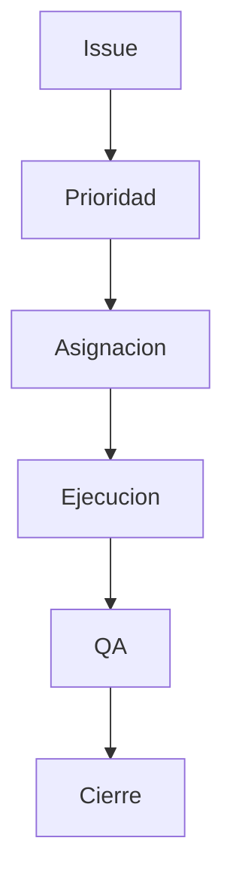

# 🛠️ Backlog y Pendientes

## 🎯 Objetivo
Priorizar trabajo pendiente sin perder visibilidad de riesgo.

## 🔄 Flujo de gestion
1. Registrar issue.
2. Clasificar prioridad (P0/P1/P2).
3. Asignar responsable.
4. Ejecutar.
5. Validar.
6. Cerrar.

## 🎯 Regla
Todo pendiente debe tener estado, owner y criterio de salida.

