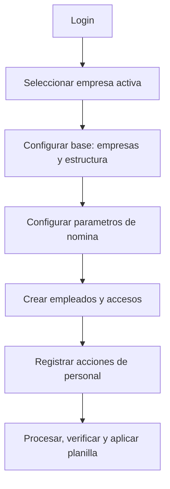

# Manual Maestro de Usuario - KPITAL 360

## Como usar esta guia
Este manual esta escrito para operar KPITAL 360 sin asumir conocimiento tecnico.
Lealo en este orden para configurar y luego operar planilla sin bloqueos.

1. [Mapa de menus y rutas](./07-MAPA-MENUS-Y-RUTAS.md)
2. [Empresas](./01-EMPRESAS.md)
3. [Configuracion organizacional](./09-CONFIG-ORGANIZACION.md)
4. [Cuentas contables](./04-CUENTAS-CONTABLES.md)
5. [Articulos de nomina](./03-ARTICULOS-NOMINA.md)
6. [Movimientos de nomina](./12-MOVIMIENTOS-NOMINA.md)
7. [Empleados](./02-EMPLEADOS.md)
8. [Usuarios, roles y permisos](./10-USUARIOS-ROLES-PERMISOS.md)
9. [Calendario de nomina y feriados](./11-CALENDARIO-NOMINA-Y-FERIADOS.md)
10. [Acciones de personal](./06-ACCIONES-PERSONAL-OPERATIVO.md)
11. [Planilla operativa](./05-PLANILLA-OPERATIVA.md)
12. [Traslado interempresa](./13-TRASLADO-INTEREMPRESA.md)
13. [Flujos criticos y escenarios](./08-FLUJOS-CRITICOS-Y-ESCENARIOS.md)

## Atajos rapidos
- Quiero crear una empresa: [Empresas](./01-EMPRESAS.md)
- Quiero crear un empleado y acceso digital: [Empleados](./02-EMPLEADOS.md)
- Quiero dar o quitar permisos: [Usuarios, roles y permisos](./10-USUARIOS-ROLES-PERMISOS.md)
- Quiero abrir, verificar y aplicar planilla: [Planilla operativa](./05-PLANILLA-OPERATIVA.md)

## Flujo de operacion completo

## Regla de oro de operacion
Si el sistema bloquea una accion, revise siempre en este orden:
1. Empresa activa correcta.
2. Permiso requerido para la accion.
3. Estado del registro (activo/inactivo o estado de flujo).
4. Reglas de negocio del modulo.

## Ver tambien
- [Indice principal de documentacion](../00-INDICE-CONSOLIDACION.md)
- [Manual tecnico](../14-manual-tecnico/00-STACK-Y-ARQUITECTURA.md)
