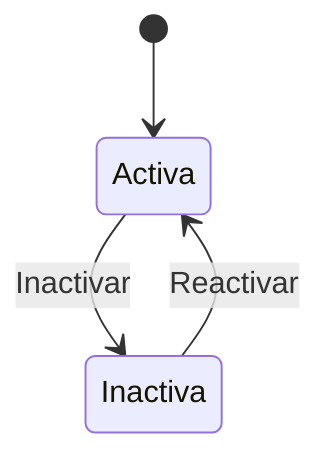

# Manual de Usuario - Empresas

## Para que sirve este modulo
Empresas define el contexto operativo del sistema. Sin empresa asignada, un usuario no puede operar procesos de esa empresa.

## Crear una empresa
1. Ir a `Configuracion > Empresas`.
2. Click en `Crear empresa`.
3. Completar campos.
4. Guardar.

## Campos y uso
| Campo | Para que sirve | Obligatorio |
|---|---|---|
| `nombre` | Nombre comercial visible en KPITAL | Si |
| `nombreLegal` | Razon social legal | Si |
| `cedula` | Identificador fiscal unico | Si |
| `actividadEconomica` | Clasificacion de actividad | No |
| `prefijo` | Prefijo unico usado como identificador corto | Si |
| `idExterno` | Referencia a sistema externo | No |
| `direccionExacta` | Ubicacion fisica | No |
| `telefono` | Contacto principal | No |
| `email` | Contacto administrativo | No |
| `codigoPostal` | Codigo postal de la empresa | No |

## Que pasa internamente cuando creo una empresa
- El sistema valida que no exista otra empresa con la misma `cedula` o el mismo `prefijo`.
- Si existe duplicado, bloquea con conflicto.
- Al crear una empresa nueva, el sistema autoasigna esa empresa a usuarios con rol `MASTER`.
- Se registra auditoria de creacion.

## Editar empresa
- Requiere permiso `company:edit`.
- Se pueden actualizar datos generales y logo.
- Si cambia `cedula` o `prefijo`, vuelve a validar unicidad.

## Inactivar empresa
- Requiere permiso `company:inactivate`.
- Si tiene planillas activas (Abierta, En Proceso o Verificada), el sistema bloquea la inactivacion y devuelve detalle de planillas bloqueantes.

## Reactivar empresa
- Requiere permiso `company:reactivate`.
- Cambia estado a activa y limpia fecha de inactivacion.

## Cargar logo
1. Subir imagen temporal.
2. Confirmar logo en la empresa.
3. El sistema guarda el archivo final por empresa.

## Flujo de estado

## Errores comunes y solucion
- Error por cedula duplicada: use una cedula no registrada.
- Error por prefijo duplicado: use prefijo unico.
- No deja inactivar: cierre o aplique planillas activas primero.

## Ver tambien
- [Configuracion organizacional](./09-CONFIG-ORGANIZACION.md)
- [Usuarios, roles y permisos](./10-USUARIOS-ROLES-PERMISOS.md)
- [Planilla operativa](./05-PLANILLA-OPERATIVA.md)
