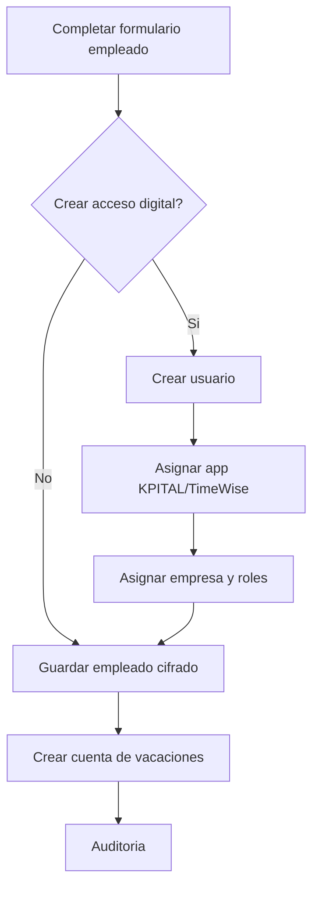

# 📘 Manual de Usuario - Empleados

## 🎯 Para que sirve este modulo
Empleados define la base de calculo de RRHH y planilla. Aqui se registra identidad laboral, condiciones de contrato y acceso digital opcional.

## 🎯 Crear empleado
1. Ir a `Empleados`.
2. Click en `Nuevo Empleado`.
3. Completar datos de identificacion, contrato y organizacion.
4. Si aplica, activar acceso a TimeWise o KPITAL.
5. Guardar.

## 📊 Campos principales y para que sirven
| 📊 Campo | Para que sirve | 📊 Obligatorio |
|---|---|---|
| `idEmpresa` | Empresa del empleado | Si |
| `codigo` | Codigo interno unico por empresa | Si |
| `cedula` | Identificacion personal | Si |
| `nombre`, `apellido1`, `apellido2` | Nombre legal del colaborador | Si (nombre y apellido1) |
| `email` | Contacto y base para acceso digital | Si |
| `idDepartamento`, `idPuesto`, `idSupervisor` | Ubicacion organizacional | Segun operacion |
| `fechaIngreso` | Fecha de ingreso laboral | Si |
| `tipoContrato`, `jornada`, `idPeriodoPago` | Condiciones laborales | Segun operacion |
| `salarioBase`, `monedaSalario` | Base de calculo de planilla | Recomendado |
| `numeroCcss`, `cuentaBanco` | Datos administrativos de pago | Segun operacion |
| `crearAccesoTimewise`, `idRolTimewise` | Crear usuario y rol TimeWise | Opcional |
| `crearAccesoKpital`, `idRolKpital` | Crear usuario y rol KPITAL | Opcional |
| `passwordInicial` | Password inicial del usuario digital | Requerido si crea acceso |

## 🎯 Reglas de validacion importantes
- `fechaIngreso` debe estar entre dia 1 y 28 y no puede ser futura.
- `codigo` no puede duplicarse en la misma empresa.
- `cedula` y `email` no pueden repetirse.
- Si activa acceso digital, debe definir rol y password segun el app.

## 🎯 Que pasa internamente cuando creo empleado
1. El sistema valida acceso del operador a la empresa seleccionada.
2. Valida duplicados de codigo, cedula y email.
3. Si se activa acceso digital:
   - Crea usuario en identidad.
   - Asigna app TimeWise y/o KPITAL.
   - Asigna empresa al usuario.
   - Asigna roles seleccionados.
4. Guarda empleado y cifra campos sensibles.
5. Genera huellas hash (cedula/email) para busqueda segura.
6. Crea cuenta de vacaciones y provisiones iniciales si aplica.
7. Registra auditoria.

## 🎯 Que datos quedan cifrados
Cedula, nombre, apellidos, telefono, direccion, email, salario base, numero CCSS, cuenta bancaria, vacaciones acumuladas y cesantia acumulada.

## 🎯 Editar empleado
- Requiere `employee:edit` y `employee:view-sensitive`.
- Solo rol `MASTER` puede cambiar `fechaIngreso`.
- Al actualizar, se vuelve a cifrar la informacion sensible.

## 🎯 Inactivar empleado
- Requiere `employee:inactivate`.
- Se bloquea si hay:
  - Planillas activas en su empresa.
  - Acciones de personal pendientes/aprobadas sin planilla asociada.

## 🎯 Reactivar o liquidar empleado
- `reactivar`: vuelve a estado activo.
- `liquidar`: marca salida, motivo y contexto de terminacion.

## 🔄 Flujo de creacion con acceso digital

## 🎯 Errores comunes y solucion
- `No tiene acceso a la empresa`: asigne empresa al usuario operador.
- `Cedula o email duplicado`: use dato unico.
- `No tiene permiso para asignar rol KPITAL/TimeWise`: otorgue permisos `employee:assign-kpital-role` o `employee:assign-timewise-role`.
- `No se puede inactivar`: cierre planillas o complete acciones pendientes.

## 🔗 Ver tambien
- [Usuarios, roles y permisos](./10-USUARIOS-ROLES-PERMISOS.md)
- [Acciones de personal](./06-ACCIONES-PERSONAL-OPERATIVO.md)
- [Planilla operativa](./05-PLANILLA-OPERATIVA.md)

