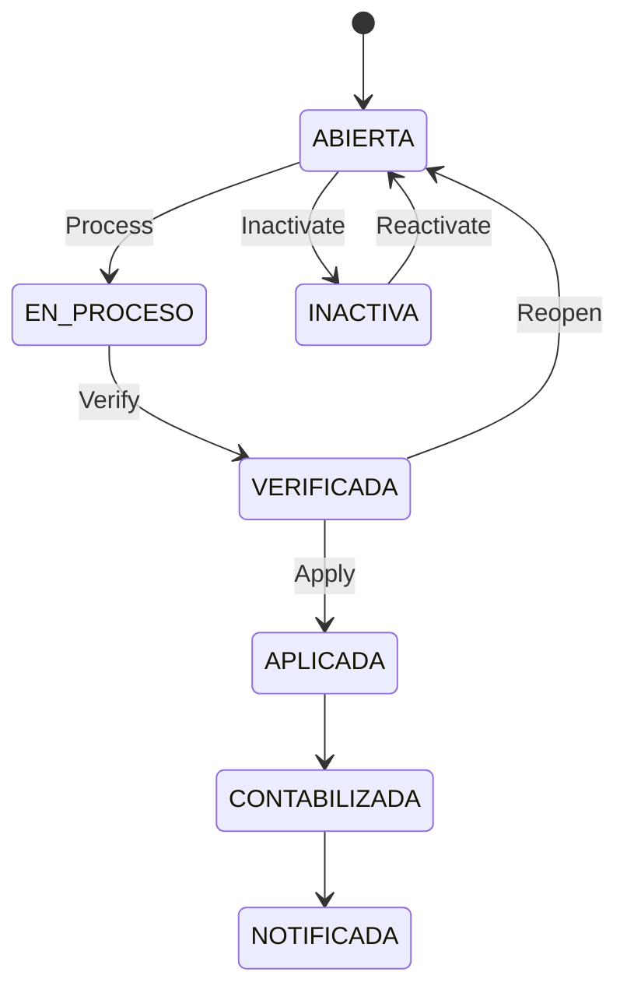

# Manual de Usuario - Planilla Operativa

## Objetivo
Explicar el ciclo real de planilla: creación, carga, verificación, aplicación, reapertura e inactivación.

## Estados de planilla
- `ABIERTA`
- `EN_PROCESO`
- `VERIFICADA`
- `APLICADA`
- `CONTABILIZADA`
- `NOTIFICADA`
- `INACTIVA`

## Ciclo principal

## Crear planilla
1. Ir a `Gestión Planilla > Generar`.
2. Completar empresa, periodo, tipo y fechas.
3. Guardar.

### Campos clave
| Campo | Para qué sirve |
|---|---|
| `idEmpresa` | Empresa de la planilla |
| `idPeriodoPago` | Periodicidad (quincenal, mensual, etc.) |
| `tipoPlanilla` | Regular, Aguinaldo, Liquidación, Extraordinaria |
| `periodoInicio`, `periodoFin` | Rango de trabajo |
| `fechaCorte` | Corte operativo |
| `fechaInicioPago`, `fechaFinPago` | Ventana de pago |
| `fechaPagoProgramada` | Fecha objetivo de pago |
| `moneda` | CRC/USD |

## Reglas que bloquean
- No permite crear duplicado del mismo slot (empresa + periodo + tipo + moneda).
- No permite verificar si no hay snapshot de empleados.
- No permite verificar si no hay resultados calculados.
- No permite editar si está en proceso, verificada, aplicada o inactiva.

## Flujo recomendado de cierre
1. `Crear` planilla.
2. `Process` para cargar tabla/snapshot.
3. Revisar detalle por empleado.
4. `Verify`.
5. `Apply`.

## Reapertura de planilla verificada
- Ruta: `Gestión Planilla > Planillas`.
- Si la planilla está en `VERIFICADA`, aparece acción **Reabrir**.
- `Reabrir` devuelve la planilla a `ABIERTA` para corregir selección de empleados y acciones.
- Regla: solo aplica para `VERIFICADA`; planillas `APLICADA/CONTABILIZADA` no se pueden reabrir.
### Paso a paso para reabrir
1. Ir a `Gestión Planilla > Planillas`.
2. Buscar una planilla con estado `VERIFICADA`.
3. Clic en `Reabrir`.
4. Confirmar en el diálogo de seguridad.
5. Validar que el estado cambie a `ABIERTA`.

### Qué pasa después de reabrir
- Se habilitan ajustes de empleados y acciones para corrección.
- Debe ejecutarse de nuevo: `Procesar → Verificar → Aplicar`.
- Si no se reprocesa, la planilla no debe aplicarse.

## Qué pasa al aplicar
- Se consolida resultado de nómina para el periodo.
- Se publican eventos de dominio.
- Se actualiza auditoría y control de versión.

## Agregar acciones de personal desde planilla
En el detalle expandido de cada empleado hay un selector **"Agregar acciones de personal"** con cuatro opciones. Al elegir una, aparece un formulario inline para capturar la acción sin salir de la planilla:

| Opción | Campos principales | Comportamiento |
|---|---|---|
| **Horas extras** | Movimiento, Tipo de jornada, Fechas inicio/fin, Cantidad, Monto | Permite varias líneas; cálculo automático según movimiento. |
| **Ausencias** | Movimiento, Tipo de ausencia, Cantidad, Monto, Remuneración, Fórmula | Mismo patrón; varias líneas; fórmula derivada del movimiento. |
| **Retenciones** | Movimiento, Cantidad, Monto, Fórmula | Monto fijo × cantidad o base × porcentaje. |
| **Deducciones** (Descuentos) | Movimiento, Cantidad, Monto, Fórmula | Mismo patrón que retenciones. |

Flujo: completar línea(s) → **Agregar Transacción** → la acción queda en estado pendiente → aprobar desde el detalle del empleado. También puede crearse desde el módulo Acción de Personal.

## Aprobación de acción personal dentro de planilla
Cuando aprueba una acción en la tabla de detalle del empleado:
1. El estado de la acción cambia de `Pendiente Supervisor` a `Aprobada`.
2. Se recarga la tabla de planilla.
3. Se actualiza automáticamente la fila principal del empleado:
   - `Salario Quincenal Bruto`
   - `Devengado`
   - `Cargas Sociales`
   - `Impuesto Renta`
   - `Monto Neto`
   - `Días`

Regla funcional:
- Si la acción aprobada ya estaba ligada a esa misma planilla, también debe impactar el recálculo del empleado.
- En la tabla se cargan acciones dentro del rango de fechas de la planilla (pendiente supervisor, pendiente RRHH y aprobada).

## Cómo se calcula cada campo (vista usuario)
| Campo | Regla funcional |
|---|---|
| `Salario Base` | Salario del empleado configurado en ficha de empleado. |
| `Días` | Días base del periodo (quincena/mes), ajustados por ingreso en el periodo, renuncia/despido y acciones aprobadas que restan días. |
| `Salario Quincenal Bruto` | Salario base del periodo recalculado con `Días` reales. |
| `Devengado` | `Salario Quincenal Bruto` + acciones aprobadas que suman ingreso (aumentos, bonificaciones, horas extra, incapacidades CCSS, licencias remuneradas, vacaciones recalculadas). |
| `Cargas Sociales` | Porcentajes de cargas sociales activos sobre el bruto/devengado del empleado. |
| `Impuesto Renta` | Tramos de renta + créditos fiscales. En quincenal solo se cobra en segunda quincena. |
| `Monto Neto` | `Devengado - Cargas Sociales - Impuesto Renta - (retenciones/descuentos aprobados)`. |

### Créditos fiscales en impuesto de renta
- Si tiene hijos: se aplica crédito por hijo.
- Si tiene cónyuge (casado/unión libre): se aplica crédito por cónyuge.
- Si no tiene hijos/cónyuge: no aplica esos créditos.

## Cómo leer el detalle de acciones (tabla expandida)
Vista simplificada:
- `Categoría`
- `Tipo de Acción`
- `Estado`
- `Acción`
- `Monto` (al final)

Regla operativa:
- El `Estado` indica si ya impacta cálculo (`Aprobada`) o sigue pendiente.
- El `Monto` se deja al final para lectura financiera rápida.

## Permisos
- Ver: `payroll:view`
- Crear: `payroll:create`
- Editar: `payroll:edit`
- Procesar: `payroll:process`
- Verificar: `payroll:verify`
- Aplicar: `payroll:apply`
- Reabrir: `payroll:reopen`
- Inactivar/Reactivar: `payroll:cancel`

## Ver también
- [Acciones de personal](./06-ACCIONES-PERSONAL-OPERATIVO.md)
- [Calendario y feriados](./11-CALENDARIO-NOMINA-Y-FERIADOS.md)
- [Traslado interempresa](./13-TRASLADO-INTEREMPRESA.md)

## Selección por Empleado (Checkbox) - Regla Operativa
- Marcado: el empleado se incluye en la planilla y queda verificado para esa planilla.
- Desmarcado: el empleado se excluye de la planilla (no entra en totales ni aplicación).
- Solo empleados marcados entran a Verify y Apply.
- Si no hay empleados marcados, Verify/Apply se bloquea.

## Control de Cambios Tardíos
- Si un empleado está marcado/verificado, no se permite crear ni aprobar nuevas acciones de personal en esa planilla.
- Si un empleado está marcado/verificado, tampoco se permite invalidar acciones en esa planilla.
- Si se necesita ajustar acciones, primero desmarcar al empleado en la tabla de planilla, luego ajustar y volver a marcar.

- Por defecto los empleados aparecen desmarcados: RRHH marca explícitamente quienes van en la planilla.
- La marca del checkbox es persistente: si sale y vuelve a entrar, el empleado permanece marcado o desmarcado según último guardado.
- Cuando un empleado está marcado para planilla, el selector 'Agregar acciones de personal' queda bloqueado y muestra el motivo en pantalla.

- Al guardar una acción desde la planilla, el formulario confirma guardado y el recálculo corre en segundo plano (sin bloquear toda la tabla).
- En el bloque 'Detalle de acciones de personal' aparece aviso: 'Guardando acción de personal y recalculando planilla en segundo plano...'.

## Operación no bloqueante (estipulado)
Reglas oficiales de uso en la tabla de planilla:

| Evento | Qué ve el usuario | Qué hace el sistema |
|---|---|---|
| Marcar/desmarcar empleado | El checkbox del empleado queda temporalmente bloqueado | Guarda en segundo plano solo ese empleado; la tabla completa sigue operativa |
| Guardar acción de personal inline | Mensaje: `Guardando acción de personal y recalculando planilla en segundo plano...` | Crea la acción y luego recalcula la tabla en background |
| Recálculo finalizado | Se refrescan montos del empleado y detalle de acciones | Actualiza bruto, devengado, deducciones, neto y días según estado aprobado |
| Error en guardado/recálculo | Notificación de error en pantalla | Mantiene datos anteriores y permite reintentar |

Reglas de experiencia:
- No se bloquea toda la tabla durante guardados puntuales.
- Se debe poder seguir navegando, expandiendo filas y revisando otros empleados.
- Si falla una operación, solo falla esa operación, no todo el flujo de planilla.
- Los totales de resumen (`Devengado`, `Cargas Sociales`, `Impuesto Renta`, `Monto Neto`) suman únicamente empleados marcados para planilla.
- Si el empleado ya está marcado y verificado, en el detalle de acciones se bloquean `Aprobar` e `Invalidar` para evitar cambios tardíos.
- En la tabla de empleados solo puede haber un detalle expandido a la vez (modo acordeón).
- El detalle se puede abrir/cerrar haciendo clic en cualquier parte de la fila del empleado (no solo en el icono + / -).

## Verificar planilla desde Tabla de empleados y acciones
En `Gestión Planilla > Cargar Planilla Regular`, al final de la tabla aparece el botón **Verificar planilla** cuando la planilla está en:
- `ABIERTA`
- `EN_PROCESO`

Reglas para habilitar el botón:
- Debe tener permiso `payroll:verify`.
- Debe existir al menos un empleado marcado para planilla.
- No deben existir empleados marcados con `requiere revalidación`.

Comportamiento:
- Si la planilla está `ABIERTA`, primero se procesa.
- Luego se ejecuta `verify` y pasa a `VERIFICADA`.
- Antes de ejecutar la verificación, el sistema muestra un diálogo de confirmación (`Sí, verificar` / `Cancelar`) para evitar cambios por error.
### Qué se guarda al verificar planilla
- Estado de planilla pasa a `VERIFICADA`.
- Se registra auditoría del cambio y versión (`versionLock`).
- Se mantiene la foto de cálculo (snapshot) para revisión.
- No se aplican pagos ni se consumen acciones en este paso.

### Acciones de personal pendientes al verificar
- Las acciones `Pendiente Supervisor` o `Pendiente RRHH` no se consumen.
- Solo acciones `Aprobadas` impactan los montos de cálculo.
- El cierre final de acciones ocurre al `Aplicar` planilla.

## Snapshot de planilla (vista usuario)
El sistema conserva una foto operativa con:
- Totales de planilla: bruto, deducciones, neto, devengado, cargas sociales, impuesto renta.
- Detalle por empleado: salario base, salario periodo, días/horas, deducciones y neto.
- Detalle de acciones por empleado que se muestran en la tabla expandida.

## Bloqueo de Verificar durante operaciones en curso
Regla operativa:
- El botón **Verificar planilla** se bloquea mientras exista cualquier operación pendiente en la tabla:
  - Marcado/desmarcado de empleados (checkbox en guardado).
  - Aprobación/invalidación de acciones de personal.
  - Guardado de acciones inline (horas extra, ausencias, retenciones, deducciones).
  - Carga/reproceso de planilla en curso.

Objetivo:
- Evitar verificar con datos intermedios o inconsistentes por operaciones concurrentes.

## Lista de planillas aplicadas (finalización de proceso)
- Ruta: `Gestión Planilla > Planillas > Lista de Planillas Aplicadas`.
- Esta vista solo muestra estados:
  - `VERIFICADA`
  - `APLICADA`
  - `ENVIADA NETSUITE`
- No muestra filtro de rango de fechas.
- Objetivo: revisar y cerrar corridas en etapa final.
- Al hacer clic sobre una fila del listado, el sistema navega a la vista `Distribución de la planilla`.
- Ruta de detalle: `/payroll-management/planillas/aplicadas/distribucion/:publicId`.
- Estado actual: **PENDIENTE DE TERMINAR**. La vista de distribución aún no tiene el detalle funcional completo esperado para operación final.
- Seguridad enterprise:
  - La URL usa `publicId` firmado (no consecutivo interno).
  - Si el token es inválido o no pertenece a empresa accesible por el usuario, el sistema rechaza acceso.

Permisos para ver esta vista (cualquiera de estos):
- `payroll:verify`
- `payroll:apply`
- `payroll:netsuite:send` (o alias legacy `payroll:send_netsuite`)
