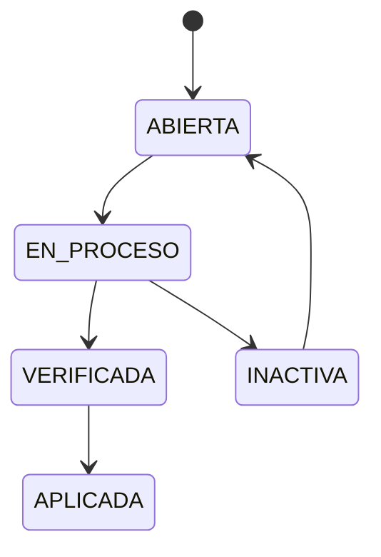

# Manual de Usuario - Planilla Operativa

## Estados de planilla
- ABIERTA
- EN_PROCESO
- VERIFICADA
- APLICADA
- INACTIVA

## Ciclo de vida

## Flujo recomendado
1. Seleccionar planilla.
2. Cargar datos.
3. Revisar por empleado.
4. Verificar.
5. Aplicar.

## Ver tambien
- Que alimenta planilla: [Acciones de personal](./06-ACCIONES-PERSONAL-OPERATIVO.md)
- Configuracion de conceptos: [Articulos de nomina](./03-ARTICULOS-NOMINA.md)
- Referencia tecnica completa: [Planilla y nomina tecnico](../08-planilla/PLANILLA-NOMINA-CONSOLIDADO.md)
