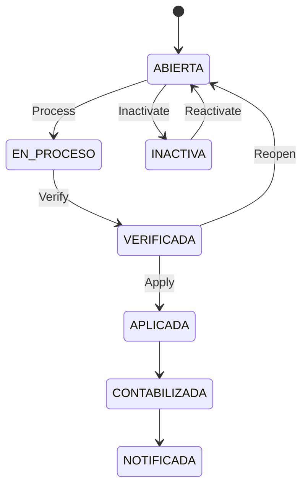

# 📘 Manual de Usuario - Planilla Operativa

## 🎯 Objetivo
Explicar el ciclo real de planilla: creacion, carga, verificacion, aplicacion, reapertura e inactivacion.

## 🔄 Estados de planilla
- `ABIERTA`
- `EN_PROCESO`
- `VERIFICADA`
- `APLICADA`
- `CONTABILIZADA`
- `NOTIFICADA`
- `INACTIVA`

## 🔄 Ciclo principal

## 🎯 Crear planilla
1. Ir a `Gestion Planilla > Generar`.
2. Completar empresa, periodo, tipo y fechas.
3. Guardar.

### 📊 Campos clave
| 📊 Campo | Para que sirve |
|---|---|
| `idEmpresa` | Empresa de la planilla |
| `idPeriodoPago` | Periodicidad (quincenal, mensual, etc.) |
| `tipoPlanilla` | Regular, Aguinaldo, Liquidacion, Extraordinaria |
| `periodoInicio`, `periodoFin` | Rango de trabajo |
| `fechaCorte` | Corte operativo |
| `fechaInicioPago`, `fechaFinPago` | Ventana de pago |
| `fechaPagoProgramada` | Fecha objetivo de pago |
| `moneda` | CRC/USD |

## 🎯 Reglas que bloquean
- No permite crear duplicado del mismo slot (empresa + periodo + tipo + moneda).
- No permite verificar si no hay snapshot de empleados.
- No permite verificar si no hay resultados calculados.
- No permite editar si esta en proceso, verificada, aplicada o inactiva.

## 🔄 Flujo recomendado de cierre
1. `Crear` planilla.
2. `Process` para cargar tabla/snapshot.
3. Revisar detalle por empleado.
4. `Verify`.
5. `Apply`.

## 🎯 Que pasa al aplicar
- Se consolida resultado de nomina para el periodo.
- Se publican eventos de dominio.
- Se actualiza auditoria y control de version.

## 🎯 Agregar acciones de personal desde planilla
En el detalle expandido de cada empleado hay un selector **"Agregar acciones de personal"** con cuatro opciones. Al elegir una, aparece un formulario inline para capturar la accion sin salir de la planilla:

| Opcion | Campos principales | Comportamiento |
|---|---|---|
| **Horas extras** | Movimiento, Tipo de jornada, Fechas inicio/fin, Cantidad, Monto | Permite varias lineas; calculo automatico segun movimiento. |
| **Ausencias** | Movimiento, Tipo de ausencia, Cantidad, Monto, Remuneracion, Formula | Mismo patron; varias lineas; formula derivada del movimiento. |
| **Retenciones** | Movimiento, Cantidad, Monto, Formula | Monto fijo × cantidad o base × porcentaje. |
| **Deducciones** (Descuentos) | Movimiento, Cantidad, Monto, Formula | Mismo patron que retenciones. |

Flujo: completar linea(s) → **Agregar Transaccion** → la accion queda en estado pendiente → aprobar desde el detalle del empleado. Tambien puede crearse desde el modulo Accion de Personal.

## 🔄 Aprobacion de accion personal dentro de planilla
Cuando aprueba una accion en la tabla de detalle del empleado:
1. El estado de la accion cambia de `Pendiente Supervisor` a `Aprobada`.
2. Se recarga la tabla de planilla.
3. Se actualiza automaticamente la fila principal del empleado:
   - `Salario Quincenal Bruto`
   - `Devengado`
   - `Cargas Sociales`
   - `Impuesto Renta`
   - `Monto Neto`
   - `Dias`

Regla funcional:
- Si la accion aprobada ya estaba ligada a esa misma planilla, tambien debe impactar el recalculo del empleado.
- En la tabla se cargan acciones dentro del rango de fechas de la planilla (pendiente supervisor, pendiente RRHH y aprobada).

## 🧮 Como se calcula cada campo (vista usuario)
| Campo | Regla funcional |
|---|---|
| `Salario Base` | Salario del empleado configurado en ficha de empleado. |
| `Dias` | Dias base del periodo (quincena/mes), ajustados por ingreso en el periodo, renuncia/despido y acciones aprobadas que restan dias. |
| `Salario Quincenal Bruto` | Salario base del periodo recalculado con `Dias` reales. |
| `Devengado` | `Salario Quincenal Bruto` + acciones aprobadas que suman ingreso (aumentos, bonificaciones, horas extra, incapacidades CCSS, licencias remuneradas, vacaciones recalculadas). |
| `Cargas Sociales` | Porcentajes de cargas sociales activos sobre el bruto/devengado del empleado. |
| `Impuesto Renta` | Tramos de renta + creditos fiscales. En quincenal solo se cobra en segunda quincena. |
| `Monto Neto` | `Devengado - Cargas Sociales - Impuesto Renta - (retenciones/descuentos aprobados)`. |

### 👨‍👩‍👧 Creditos fiscales en impuesto de renta
- Si tiene hijos: se aplica credito por hijo.
- Si tiene conyuge (casado/union libre): se aplica credito por conyuge.
- Si no tiene hijos/conyuge: no aplica esos creditos.

## 🧭 Como leer el detalle de acciones (tabla expandida)
Vista simplificada:
- `Categoria`
- `Tipo de Accion`
- `Estado`
- `Accion`
- `Monto` (al final)

Regla operativa:
- El `Estado` indica si ya impacta calculo (`Aprobada`) o sigue pendiente.
- El `Monto` se deja al final para lectura financiera rapida.

## 🎯 Permisos
- Ver: `payroll:view`
- Crear: `payroll:create`
- Editar/Reabrir: `payroll:edit`
- Procesar: `payroll:process`
- Verificar: `payroll:verify`
- Aplicar: `payroll:apply`
- Inactivar/Reactivar: `payroll:cancel`

## 🔗 Ver tambien
- [Acciones de personal](./06-ACCIONES-PERSONAL-OPERATIVO.md)
- [Calendario y feriados](./11-CALENDARIO-NOMINA-Y-FERIADOS.md)
- [Traslado interempresa](./13-TRASLADO-INTEREMPRESA.md)

## ? Seleccion por Empleado (Checkbox) - Regla Operativa
- Marcado: el empleado se incluye en la planilla y queda verificado para esa planilla.
- Desmarcado: el empleado se excluye de la planilla (no entra en totales ni aplicacion).
- Solo empleados marcados entran a Verify y Apply.
- Si no hay empleados marcados, Verify/Apply se bloquea.

## ?? Control de Cambios Tardios
- Si un empleado esta marcado/verificado, no se permite crear ni aprobar nuevas acciones de personal en esa planilla.
- Si se necesita ajustar acciones, primero desmarcar al empleado en la tabla de planilla, luego ajustar y volver a marcar.

- Por defecto los empleados aparecen desmarcados: RRHH marca explicitamente quienes van en la planilla.
- La marca del checkbox es persistente: si sale y vuelve a entrar, el empleado permanece marcado o desmarcado segun ultimo guardado.
- Cuando un empleado esta marcado para planilla, el selector 'Agregar acciones de personal' queda bloqueado y muestra el motivo en pantalla.

- Al guardar una accion desde la planilla, el formulario confirma guardado y el recalculo corre en segundo plano (sin bloquear toda la tabla).
- En el bloque 'Detalle de acciones de personal' aparece aviso: 'Guardando accion de personal y recalculando planilla en segundo plano...'.

## Operacion no bloqueante (estipulado)
Reglas oficiales de uso en la tabla de planilla:

| Evento | Que ve el usuario | Que hace el sistema |
|---|---|---|
| Marcar/desmarcar empleado | El checkbox del empleado queda temporalmente bloqueado | Guarda en segundo plano solo ese empleado; la tabla completa sigue operativa |
| Guardar accion de personal inline | Mensaje: `Guardando accion de personal y recalculando planilla en segundo plano...` | Crea la accion y luego recalcula la tabla en background |
| Recalculo finalizado | Se refrescan montos del empleado y detalle de acciones | Actualiza bruto, devengado, deducciones, neto y dias segun estado aprobado |
| Error en guardado/recalculo | Notificacion de error en pantalla | Mantiene datos anteriores y permite reintentar |

Reglas de experiencia:
- No se bloquea toda la tabla durante guardados puntuales.
- Se debe poder seguir navegando, expandiendo filas y revisando otros empleados.
- Si falla una operacion, solo falla esa operacion, no todo el flujo de planilla.
- Los totales de resumen (`Devengado`, `Cargas Sociales`, `Impuesto Renta`, `Monto Neto`) suman unicamente empleados marcados para planilla.
- Si el empleado ya esta marcado y verificado, en el detalle de acciones se bloquean `Aprobar` e `Invalidar` para evitar cambios tardios.
- En la tabla de empleados solo puede haber un detalle expandido a la vez (modo acordeon).
- El detalle se puede abrir/cerrar haciendo click en cualquier parte de la fila del empleado (no solo en el icono + / -).

