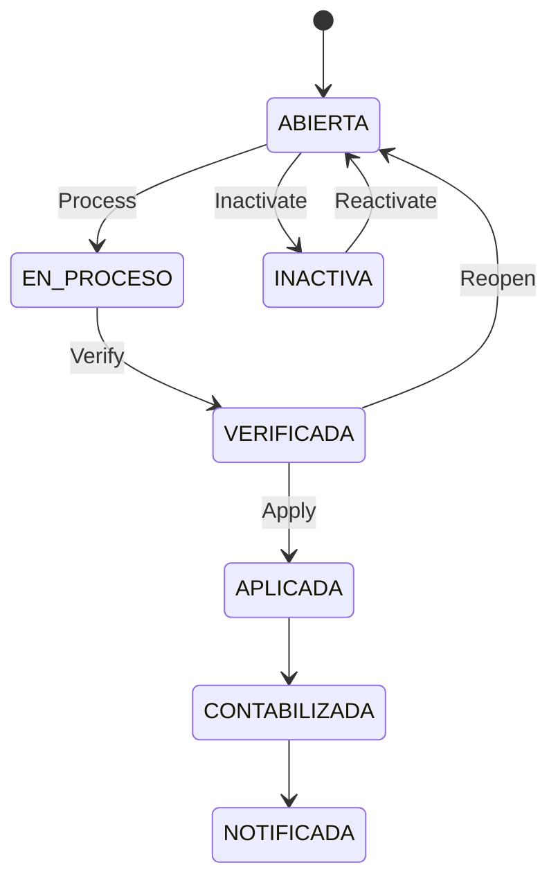

# Manual de Usuario - Planilla Operativa

## Objetivo
Explicar el ciclo real de planilla: creacion, carga, verificacion, aplicacion, reapertura e inactivacion.

## Estados de planilla
- `ABIERTA`
- `EN_PROCESO`
- `VERIFICADA`
- `APLICADA`
- `CONTABILIZADA`
- `NOTIFICADA`
- `INACTIVA`

## Ciclo principal

## Crear planilla
1. Ir a `Gestion Planilla > Generar`.
2. Completar empresa, periodo, tipo y fechas.
3. Guardar.

### Campos clave
| Campo | Para que sirve |
|---|---|
| `idEmpresa` | Empresa de la planilla |
| `idPeriodoPago` | Periodicidad (quincenal, mensual, etc.) |
| `tipoPlanilla` | Regular, Aguinaldo, Liquidacion, Extraordinaria |
| `periodoInicio`, `periodoFin` | Rango de trabajo |
| `fechaCorte` | Corte operativo |
| `fechaInicioPago`, `fechaFinPago` | Ventana de pago |
| `fechaPagoProgramada` | Fecha objetivo de pago |
| `moneda` | CRC/USD |

## Reglas que bloquean
- No permite crear duplicado del mismo slot (empresa + periodo + tipo + moneda).
- No permite verificar si no hay snapshot de empleados.
- No permite verificar si no hay resultados calculados.
- No permite editar si esta en proceso, verificada, aplicada o inactiva.

## Flujo recomendado de cierre
1. `Crear` planilla.
2. `Process` para cargar tabla/snapshot.
3. Revisar detalle por empleado.
4. `Verify`.
5. `Apply`.

## Que pasa al aplicar
- Se consolida resultado de nomina para el periodo.
- Se publican eventos de dominio.
- Se actualiza auditoria y control de version.

## Permisos
- Ver: `payroll:view`
- Crear: `payroll:create`
- Editar/Reabrir: `payroll:edit`
- Procesar: `payroll:process`
- Verificar: `payroll:verify`
- Aplicar: `payroll:apply`
- Inactivar/Reactivar: `payroll:cancel`

## Ver tambien
- [Acciones de personal](./06-ACCIONES-PERSONAL-OPERATIVO.md)
- [Calendario y feriados](./11-CALENDARIO-NOMINA-Y-FERIADOS.md)
- [Traslado interempresa](./13-TRASLADO-INTEREMPRESA.md)
