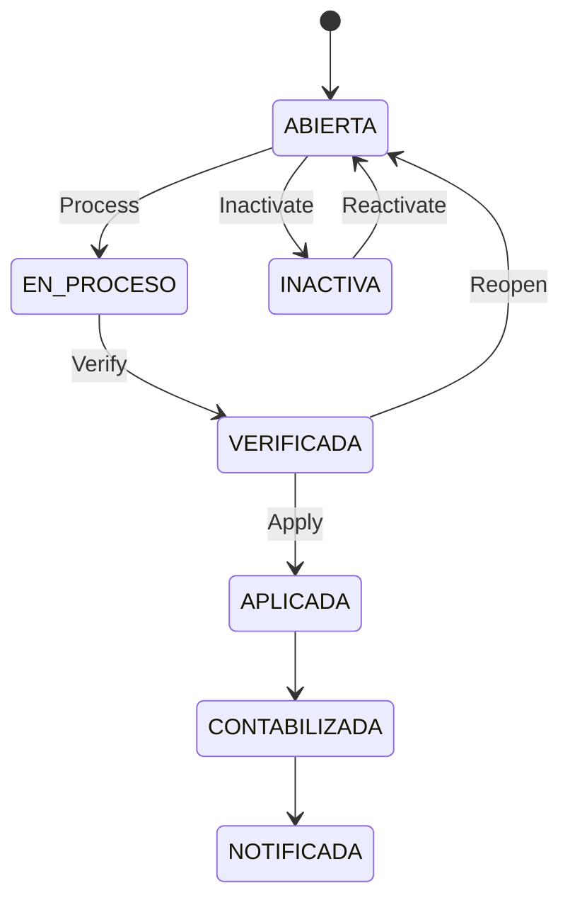

# 📘 Manual de Usuario - Planilla Operativa

## 🎯 Objetivo
Explicar el ciclo real de planilla: creacion, carga, verificacion, aplicacion, reapertura e inactivacion.

## 🔄 Estados de planilla
- `ABIERTA`
- `EN_PROCESO`
- `VERIFICADA`
- `APLICADA`
- `CONTABILIZADA`
- `NOTIFICADA`
- `INACTIVA`

## 🔄 Ciclo principal

## 🎯 Crear planilla
1. Ir a `Gestion Planilla > Generar`.
2. Completar empresa, periodo, tipo y fechas.
3. Guardar.

### 📊 Campos clave
| 📊 Campo | Para que sirve |
|---|---|
| `idEmpresa` | Empresa de la planilla |
| `idPeriodoPago` | Periodicidad (quincenal, mensual, etc.) |
| `tipoPlanilla` | Regular, Aguinaldo, Liquidacion, Extraordinaria |
| `periodoInicio`, `periodoFin` | Rango de trabajo |
| `fechaCorte` | Corte operativo |
| `fechaInicioPago`, `fechaFinPago` | Ventana de pago |
| `fechaPagoProgramada` | Fecha objetivo de pago |
| `moneda` | CRC/USD |

## 🎯 Reglas que bloquean
- No permite crear duplicado del mismo slot (empresa + periodo + tipo + moneda).
- No permite verificar si no hay snapshot de empleados.
- No permite verificar si no hay resultados calculados.
- No permite editar si esta en proceso, verificada, aplicada o inactiva.

## 🔄 Flujo recomendado de cierre
1. `Crear` planilla.
2. `Process` para cargar tabla/snapshot.
3. Revisar detalle por empleado.
4. `Verify`.
5. `Apply`.

## 🎯 Que pasa al aplicar
- Se consolida resultado de nomina para el periodo.
- Se publican eventos de dominio.
- Se actualiza auditoria y control de version.

## 🔄 Aprobacion de accion personal dentro de planilla
Cuando aprueba una accion en la tabla de detalle del empleado:
1. El estado de la accion cambia de `Pendiente Supervisor` a `Aprobada`.
2. Se recarga la tabla de planilla.
3. Se actualiza automaticamente la fila principal del empleado:
   - `Salario Quincenal Bruto`
   - `Devengado`
   - `Cargas Sociales`
   - `Impuesto Renta`
   - `Monto Neto`
   - `Dias`

Regla funcional:
- Si la accion aprobada ya estaba ligada a esa misma planilla, tambien debe impactar el recalculo del empleado.
- En la tabla se cargan acciones dentro del rango de fechas de la planilla (pendiente supervisor, pendiente RRHH y aprobada).

## 🧮 Como se calcula cada campo (vista usuario)
| Campo | Regla funcional |
|---|---|
| `Salario Base` | Salario del empleado configurado en ficha de empleado. |
| `Dias` | Dias base del periodo (quincena/mes), ajustados por ingreso en el periodo, renuncia/despido y acciones aprobadas que restan dias. |
| `Salario Quincenal Bruto` | Salario base del periodo recalculado con `Dias` reales. |
| `Devengado` | `Salario Quincenal Bruto` + acciones aprobadas que suman ingreso (aumentos, bonificaciones, horas extra, incapacidades CCSS, licencias remuneradas, vacaciones recalculadas). |
| `Cargas Sociales` | Porcentajes de cargas sociales activos sobre el bruto/devengado del empleado. |
| `Impuesto Renta` | Tramos de renta + creditos fiscales. En quincenal solo se cobra en segunda quincena. |
| `Monto Neto` | `Devengado - Cargas Sociales - Impuesto Renta - (retenciones/descuentos aprobados)`. |

### 👨‍👩‍👧 Creditos fiscales en impuesto de renta
- Si tiene hijos: se aplica credito por hijo.
- Si tiene conyuge (casado/union libre): se aplica credito por conyuge.
- Si no tiene hijos/conyuge: no aplica esos creditos.

## 🧭 Como leer el detalle de acciones (tabla expandida)
Nuevas columnas para lectura rapida:
- `Impacto`: `Suma`, `Resta`, `Solo dias` o `Mixto`.
- `Afecta dias`: indica si la accion cambia dias laborados.
- `Aplicada al calculo`: `Si` cuando ya impacta calculo (aprobada o calculo automatico), `No` si sigue pendiente.

Regla operativa:
- Una accion pendiente puede verse en la lista, pero no siempre modifica montos hasta ser aprobada.
- `Cargas Sociales` e `Impuesto Renta` son calculos automaticos del sistema y se muestran como aplicados.

## 🎯 Permisos
- Ver: `payroll:view`
- Crear: `payroll:create`
- Editar/Reabrir: `payroll:edit`
- Procesar: `payroll:process`
- Verificar: `payroll:verify`
- Aplicar: `payroll:apply`
- Inactivar/Reactivar: `payroll:cancel`

## 🔗 Ver tambien
- [Acciones de personal](./06-ACCIONES-PERSONAL-OPERATIVO.md)
- [Calendario y feriados](./11-CALENDARIO-NOMINA-Y-FERIADOS.md)
- [Traslado interempresa](./13-TRASLADO-INTEREMPRESA.md)

