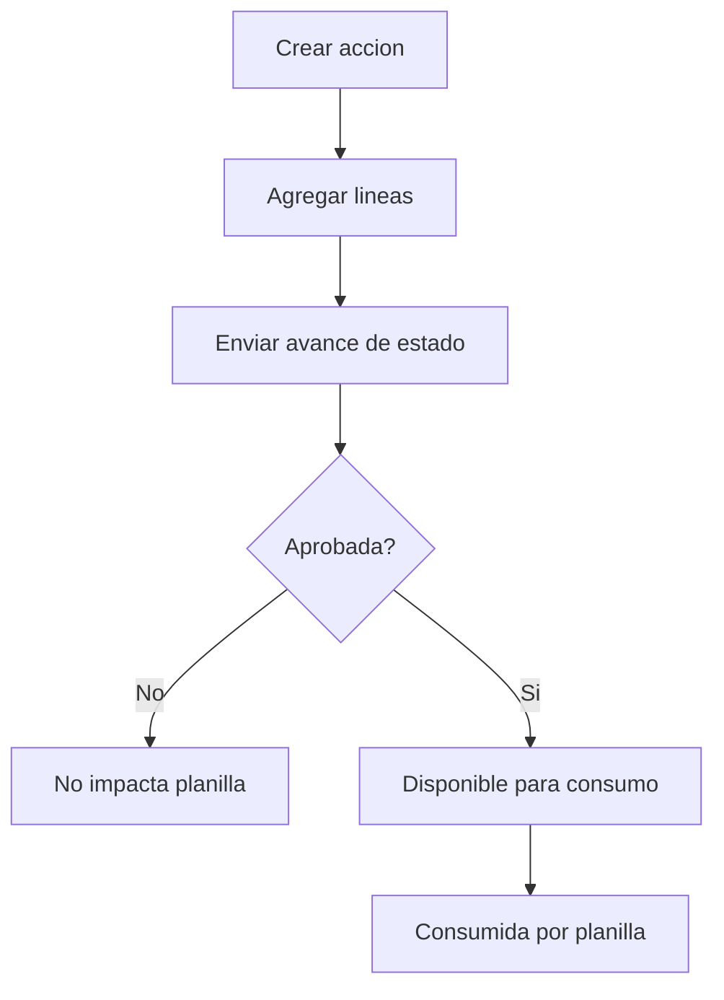

# 📘 Manual de Usuario - Acciones de Personal

## 🎯 Para que sirve este modulo
Permite registrar eventos de RRHH que impactan nomina por linea y por periodo.

## 🎯 Tipos operativos
- Ausencias
- Licencias
- Incapacidades
- Bonificaciones
- Horas extra
- Retenciones
- Descuentos
- Aumentos
- Vacaciones

## 🔄 Estados funcionales
- `DRAFT`
- `PENDING_SUPERVISOR`
- `PENDING_RRHH`
- `APPROVED`
- `REJECTED`
- `CONSUMED`
- `INVALIDATED`
- `CANCELLED`
- `EXPIRED`

## 🎯 Regla principal
Solo acciones aprobadas entran al consumo de planilla.

## 🔄 Flujo general

## 🎯 Operaciones disponibles
- Crear por tipo (`/personal-actions/{tipo}`). Ademas de las paginas dedicadas, Horas extras, Ausencias, Retenciones y Descuentos pueden crearse desde la pantalla de planilla (formularios inline en `Cargar Planilla Regular`). Ver [Planilla Operativa](./05-PLANILLA-OPERATIVA.md).
- Editar por tipo
- Avanzar estado (`advance`)
- Invalidar (`invalidate`)
- Ver auditoria

## 🎯 Permisos por tipo
Cada tipo tiene permisos propios `:view`, `:create`, `:edit` y control de avance/invalida por permiso.
Ejemplo: `hr-action-ausencias:view`, `hr-action-bonificaciones:create`.

## 🎯 Errores comunes y solucion
- No aparece planilla elegible: revise empresa, periodo y moneda del empleado.
- No deja avanzar estado: revise permiso del usuario para ese paso.
- No impacta planilla: revise que estado final sea `APPROVED`.

## 🔗 Ver tambien
- [Planilla operativa](./05-PLANILLA-OPERATIVA.md)
- [Movimientos de nomina](./12-MOVIMIENTOS-NOMINA.md)
- [Escenarios criticos](./08-FLUJOS-CRITICOS-Y-ESCENARIOS.md)

