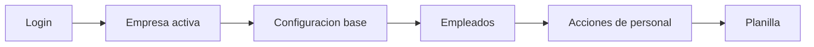

# 📘 Manual de Usuario - Mapa de Menus y Rutas

## 🎯 Objetivo
Ubicar rapido donde ejecutar cada proceso en el sistema.

## 🔗 Rutas principales
| Modulo | Ruta | Permiso minimo |
|---|---|---|
| Dashboard | `/dashboard` | Sesion iniciada |
| Empleados | `/employees` | `employee:view` |
| Empresas | `/configuration/empresas` | `company:view` |
| Usuarios | `/configuration/users` | `config:users` |
| Roles | `/configuration/roles` | `config:roles` |
| Permisos | `/configuration/permissions` | `config:permissions` |
| Departamentos | `/configuration/departamentos` | `department:view` |
| Puestos | `/configuration/puestos` | `position:view` |
| Clases | `/configuration/clases` | `class:view` |
| Proyectos | `/configuration/proyectos` | `project:view` |
| Cuentas contables | `/configuration/cuentas-contables` | `accounting-account:view` |
| Articulos nomina | `/payroll-params/articulos` | `payroll-article:view` |
| Movimientos nomina | `/payroll-params/movimientos` | `payroll-movement:view` |
| Calendario nomina | `/payroll-params/calendario/ver` | `payroll:calendar:view` |
| Feriados | `/payroll-params/calendario/feriados` | `payroll-holiday:view` |
| Listado dias de pago de planilla | `/payroll-params/calendario/dias-pago` | `payroll:view` |
| Listado de planillas (alias tecnico) | `/payroll-management/planillas/listado` | `payroll:view` |
| Planilla generar | `/payroll-management/planillas/generar` | `payroll:generate` |
| Lista de planillas aplicadas | `/payroll-management/planillas/aplicadas` | `payroll:verify` o `payroll:apply` o `payroll:netsuite:send` |
| Distribucion de la planilla (detalle) | `/payroll-management/planillas/aplicadas/distribucion/:publicId` | Mismos permisos de lista aplicada |
| Traslado interempresas | `/payroll-management/traslado-interempresas` | `payroll:intercompany-transfer` |
| Acciones de personal | `/personal-actions/*` | Permiso por tipo |

## 🔄 Flujo de navegacion recomendado

## 🎯 Si no ve un menu
1. Verifique empresa activa.
2. Verifique permiso en su rol.
3. Verifique que no tenga denegacion explicita (`deny`) en configuracion de usuario.

## 🔗 Ver tambien
- [Usuarios, roles y permisos](./10-USUARIOS-ROLES-PERMISOS.md)
- [Guia maestra](./00-GUIA-RAPIDA-USUARIO.md)

