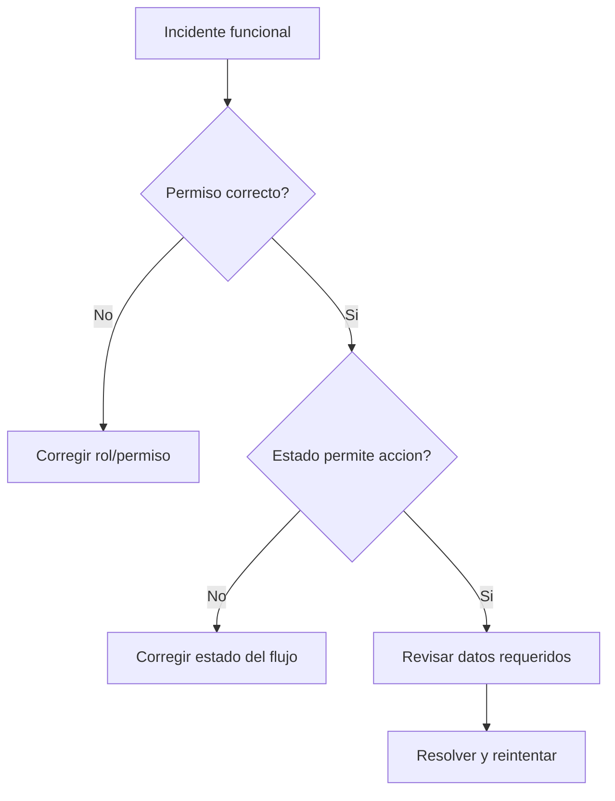

# 📘 Manual de Usuario - Flujos Criticos y Escenarios

## 🎯 Escenario 1 - Alta completa de empleado
1. Crear empresa (si no existe).
2. Configurar departamento/puesto.
3. Crear empleado.
4. Activar acceso digital (si aplica).
5. Validar acceso de usuario y visibilidad en modulos.

Resultado esperado:
- Empleado activo, visible en acciones y planilla.
- Si tiene acceso digital, puede ingresar segun permisos.

## 🎯 Escenario 2 - Bloqueo al inactivar empresa
Situacion:
- Se intenta inactivar empresa con planillas abiertas/en proceso/verificadas.

Comportamiento esperado:
- El sistema bloquea y muestra planillas bloqueantes.

Accion recomendada:
- Cerrar/aplicar planillas pendientes y volver a intentar.

## 🎯 Escenario 3 - Accion de personal no impacta planilla
Situacion:
- Accion creada pero no aparece en calculo.

Causa mas comun:
- Estado distinto de `APPROVED`.

Accion recomendada:
- Revisar flujo de aprobacion y estado actual.

## 🎯 Escenario 4 - Usuario con menu incompleto
Situacion:
- Usuario reporta que no ve modulo esperado.

Revision:
1. Empresa activa.
2. Rol en esa empresa/app.
3. Overrides ALLOW/DENY.
4. Denegaciones globales.

## 📊 Matriz de diagnostico rapido
| Sintoma | Causa probable | Donde revisar |
|---|---|---|
| 403 en API | Falta permiso efectivo | [Usuarios, roles y permisos](./10-USUARIOS-ROLES-PERMISOS.md) |
| No deja aplicar planilla | Estado no valido o datos incompletos | [Planilla operativa](./05-PLANILLA-OPERATIVA.md) |
| No deja inactivar empleado | Planillas o acciones pendientes | [Empleados](./02-EMPLEADOS.md) |
| Traslado bloqueado | No hay planilla destino compatible | [Traslado interempresa](./13-TRASLADO-INTEREMPRESA.md) |

## 🔄 Diagrama de control

## 🔄 Walkthrough 1 - Alta empresa + estructura + empleado con acceso digital
### Datos de ejemplo
- Empresa: `ACME CR S.A.`
- Prefijo: `ACME`
- Cedula juridica: `3-101-999999`
- Empleado: `EMP-0001`, `Ana Rojas`, email `ana.rojas@acme.cr`
- Apps de acceso: `KPITAL` y `TimeWise`

### Paso a paso
1. Crear empresa en `Configuracion > Empresas`.
2. Crear departamento `RRHH` y puesto `Analista RRHH`.
3. Crear empleado y activar switches de acceso digital.
4. Asignar rol KPITAL y rol TimeWise.
5. Guardar.

### Que hace el sistema internamente
- Valida duplicados (`prefijo`, `cedula`, `codigo`, `email`, `cedula empleado`).
- Cifra datos sensibles del empleado.
- Crea usuario de identidad y lo asigna a apps seleccionadas.
- Asigna empresa y roles al usuario.
- Crea cuenta de vacaciones del empleado.

### Resultado esperado
- Empleado activo y visible.
- Usuario puede login y ver menus segun permiso.

## 🔄 Walkthrough 2 - Accion de personal aprobada y consumo en planilla
### Datos de ejemplo
- Empleado: `EMP-0001`
- Tipo accion: `Bonificacion`
- Monto: `50000 CRC`
- Planilla objetivo: `Regular Marzo 2026`

### Paso a paso
1. Crear bonificacion en `Acciones de personal > Bonificaciones`.
2. Completar linea con planilla elegible.
3. Avanzar flujo hasta estado `APPROVED`.
4. Ir a planilla y ejecutar `Process`.
5. Revisar tabla y verificar inclusion de la accion.
6. Ejecutar `Verify` y `Apply`.

### Que valida el sistema
- Permiso por tipo de accion.
- Estado de accion antes de consumo.
- Compatibilidad empresa/periodo/moneda con planilla.

### Resultado esperado
- La accion aparece en snapshot/input de planilla.
- Planilla llega a estado `APLICADA`.

## 🔄 Walkthrough 3 - Inactivacion de empresa con manejo de bloqueo
### Datos de ejemplo
- Empresa: `ACME CR S.A.`
- Planilla bloqueante: `Planilla regular #145`

### Paso a paso
1. Intentar inactivar empresa.
2. Revisar mensaje de bloqueo y lista de planillas activas.
3. Ir a `Gestion planilla` y cerrar/aplicar planillas pendientes.
4. Reintentar inactivar empresa.

### Comportamiento esperado
- Primer intento: bloqueado con detalle de planillas.
- Segundo intento (sin planillas activas): inactivacion exitosa.

### Resultado esperado
- Empresa en estado inactivo con trazabilidad de auditoria.

## 🔗 Ver tambien
- [Empleados](./02-EMPLEADOS.md)
- [Acciones de personal](./06-ACCIONES-PERSONAL-OPERATIVO.md)
- [Planilla operativa](./05-PLANILLA-OPERATIVA.md)
- [Usuarios, roles y permisos](./10-USUARIOS-ROLES-PERMISOS.md)
