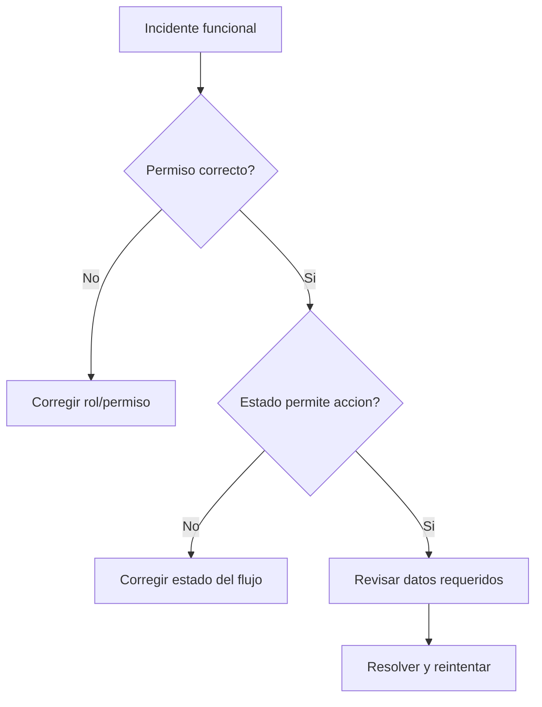

# Manual de Usuario - Flujos Criticos y Escenarios

## Escenario 1 - Alta completa de empleado
1. Crear empresa (si no existe).
2. Configurar departamento/puesto.
3. Crear empleado.
4. Activar acceso digital (si aplica).
5. Validar acceso de usuario y visibilidad en modulos.

Resultado esperado:
- Empleado activo, visible en acciones y planilla.
- Si tiene acceso digital, puede ingresar segun permisos.

## Escenario 2 - Bloqueo al inactivar empresa
Situacion:
- Se intenta inactivar empresa con planillas abiertas/en proceso/verificadas.

Comportamiento esperado:
- El sistema bloquea y muestra planillas bloqueantes.

Accion recomendada:
- Cerrar/aplicar planillas pendientes y volver a intentar.

## Escenario 3 - Accion de personal no impacta planilla
Situacion:
- Accion creada pero no aparece en calculo.

Causa mas comun:
- Estado distinto de `APPROVED`.

Accion recomendada:
- Revisar flujo de aprobacion y estado actual.

## Escenario 4 - Usuario con menu incompleto
Situacion:
- Usuario reporta que no ve modulo esperado.

Revision:
1. Empresa activa.
2. Rol en esa empresa/app.
3. Overrides ALLOW/DENY.
4. Denegaciones globales.

## Matriz de diagnostico rapido
| Sintoma | Causa probable | Donde revisar |
|---|---|---|
| 403 en API | Falta permiso efectivo | [Usuarios, roles y permisos](./10-USUARIOS-ROLES-PERMISOS.md) |
| No deja aplicar planilla | Estado no valido o datos incompletos | [Planilla operativa](./05-PLANILLA-OPERATIVA.md) |
| No deja inactivar empleado | Planillas o acciones pendientes | [Empleados](./02-EMPLEADOS.md) |
| Traslado bloqueado | No hay planilla destino compatible | [Traslado interempresa](./13-TRASLADO-INTEREMPRESA.md) |

## Diagrama de control

