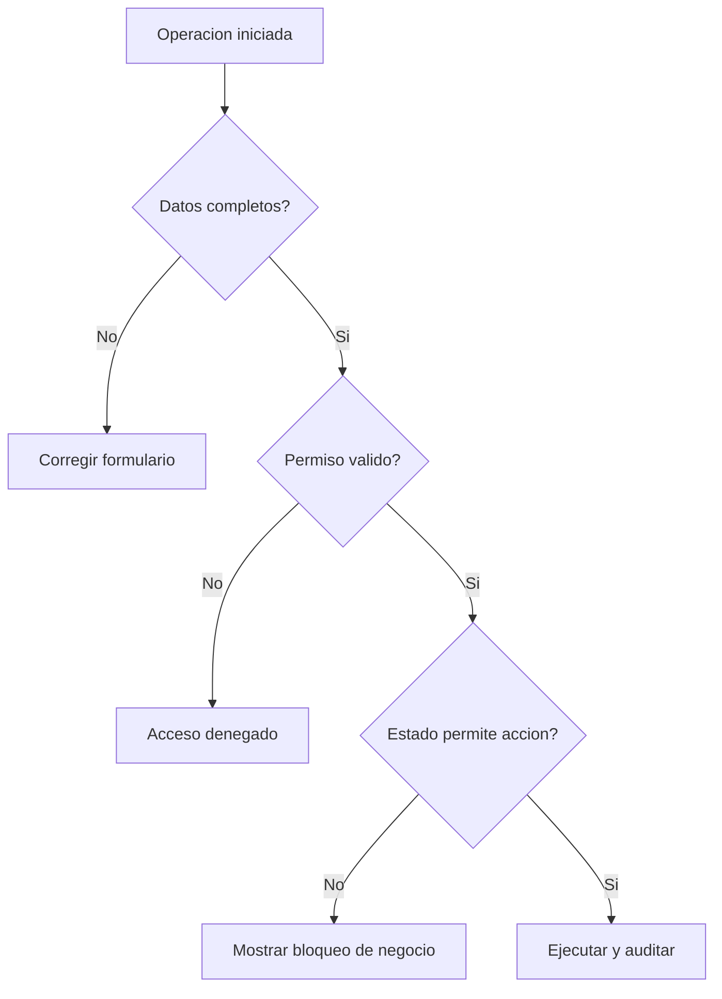

# Manual de Usuario - Flujos Criticos y Escenarios

## Objetivo
Explicar escenarios clave de negocio y que hace el sistema en cada caso.

## Escenario 1 - Crear empleado y prepararlo para planilla
1. Crear empleado.
2. Verificar empresa/departamento/puesto/salario.
3. Confirmar estado Activo.
4. Validar que quede visible para procesos de planilla.

Resultado esperado:
- Empleado listo para acciones de personal y nomina.

## Escenario 2 - Aplicar una accion de personal
1. Crear accion.
2. Completar lineas.
3. Enviar a aprobacion.
4. Aprobar.
5. Consumir en planilla.

Resultado esperado:
- La accion solo impacta planilla si esta APPROVED.

## Escenario 3 - Cierre de planilla
1. Planilla en ABIERTA.
2. Cargar datos y revisar.
3. Verificar.
4. Aplicar.

Resultado esperado:
- Planilla queda APLICADA y no se modifica.

## Que pasa si...
| Situacion | Comportamiento esperado |
|---|---|
| Falta campo obligatorio en formulario | No permite guardar y muestra validacion |
| Accion no aprobada | No se incluye en calculo de planilla |
| Planilla ya aplicada | No permite modificaciones |
| Traslado interempresa sin planilla compatible | Bloquea traslado y muestra motivo |
| Intento de inactivar empresa con bloqueos | Rechaza operacion e indica causa |

## Diagrama de control operativo

## Ver tambien
- [Empleados](./02-EMPLEADOS.md)
- [Acciones de personal](./06-ACCIONES-PERSONAL-OPERATIVO.md)
- [Planilla operativa](./05-PLANILLA-OPERATIVA.md)
