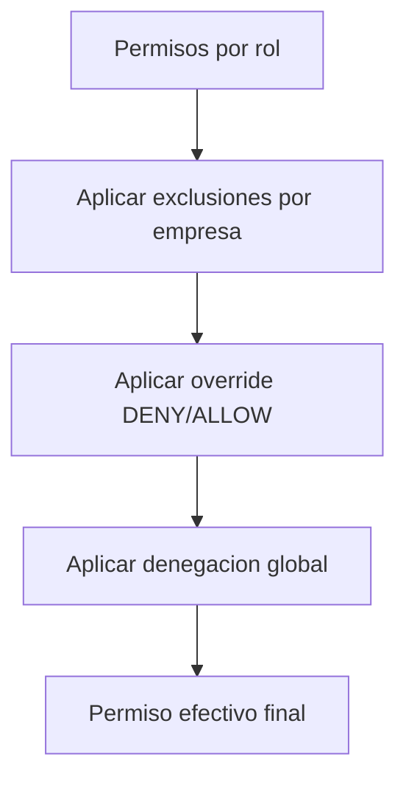

# Manual de Usuario - Usuarios, Roles y Permisos

## Objetivo
Administrar quien puede entrar, en que empresa puede operar y que acciones puede ejecutar.

## Conceptos clave
- Usuario: identidad de acceso.
- Empresa asignada: contexto de operacion.
- Rol: paquete de permisos.
- Permiso: accion atomica.
- Override ALLOW/DENY: excepcion puntual.
- Denegacion global: bloqueo de permiso en todas las empresas de un app.

## Flujo recomendado para dar acceso completo
1. Crear usuario en `Configuracion > Usuarios`.
2. Asignar empresas.
3. Asignar roles por app y contexto.
4. Configurar exclusiones u overrides solo si es necesario.
5. Validar con cambio de empresa y menu visible.

## CRUD de usuarios
Campos de alta:
- `email` (obligatorio)
- `username` (opcional)
- `password` (opcional segun politica)
- `nombre`, `apellido` (obligatorio)
- `telefono`, `avatarUrl` (opcional)

Operaciones:
- Crear, editar, inactivar, reactivar, bloquear.

Permiso base:
- `config:users`

## Gestion de roles
- Crear rol
- Editar metadata del rol
- Reemplazar permisos de un rol
- Activar/Inactivar rol

Permiso base:
- `config:roles`

## Gestion de permisos
- Crear permiso
- Editar permiso
- Inactivar/Reactivar permiso

Permiso base:
- `config:permissions`

## Asignaciones por usuario
- Empresas: `config:users:assign-companies`
- Roles por empresa/app: `config:users:assign-roles`
- Denegaciones globales: `config:users:deny-permissions`
- Overrides por contexto: `config:permissions`

## Regla de prioridad de autorizacion

## Que pasa si quito permiso o empresa
- Al quitar empresa: usuario pierde acceso a ese contexto.
- Al quitar rol: pierde permisos que venian de ese rol.
- Al aplicar DENY: aunque el rol lo otorgue, queda bloqueado.

## Diagnostico rapido
- Menu no aparece: revise permiso efectivo en empresa y app activas.
- Usuario ve menu pero API responde 403: revise denegaciones globales y overrides.
- Cambio no se refleja: refrescar sesion o cambiar de empresa/app.

## Ver tambien
- [Mapa de menus](./07-MAPA-MENUS-Y-RUTAS.md)
- [Seguridad tecnico](../14-manual-tecnico/02-SEGURIDAD-PERMISOS.md)
- [Matriz canonica de permisos](../16-enterprise-operacion/01-MATRIZ-PERMISOS-CANONICA.md)
