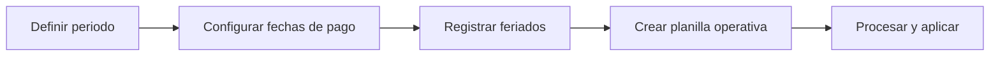

# 📘 Manual de Usuario - Calendario de Nomina y Feriados

## 🎯 Calendario de nomina
Ruta: `Parametros de Planilla > Calendario`

### 🎯 Crear calendario/planilla base
Complete:
- `idEmpresa`
- `idPeriodoPago`
- `tipoPlanilla`
- `periodoInicio`, `periodoFin`
- `fechaCorte`
- `fechaInicioPago`, `fechaFinPago`
- `fechaPagoProgramada`
- `moneda`

### 🎯 Validaciones de fecha
- Inicio periodo <= fin periodo.
- Fecha corte dentro del periodo.
- Inicio pago <= fin pago.
- Fecha pago programada dentro de ventana de pago.
- Fecha pago programada no menor que fecha corte.

## 🎯 Feriados
Ruta: `Parametros de Planilla > Calendario > Feriados`

Campos:
- `nombre`
- `tipo` (`OBLIGATORIO_PAGO_DOBLE`, `OBLIGATORIO_PAGO_SIMPLE`, `MOVIBLE`, `NO_OBLIGATORIO`)
- `fechaInicio`
- `fechaFin`
- `descripcion` (opcional)

## 🎯 Permisos
- Calendario planilla: `payroll:calendar:view`, `payroll:create`, `payroll:edit`
- Feriados: `payroll-holiday:view`, `payroll-holiday:create`, `payroll-holiday:edit`, `payroll-holiday:delete`

## 🔄 Flujo recomendado

## 🔗 Ver tambien
- [Planilla operativa](./05-PLANILLA-OPERATIVA.md)
- [Movimientos de nomina](./12-MOVIMIENTOS-NOMINA.md)

