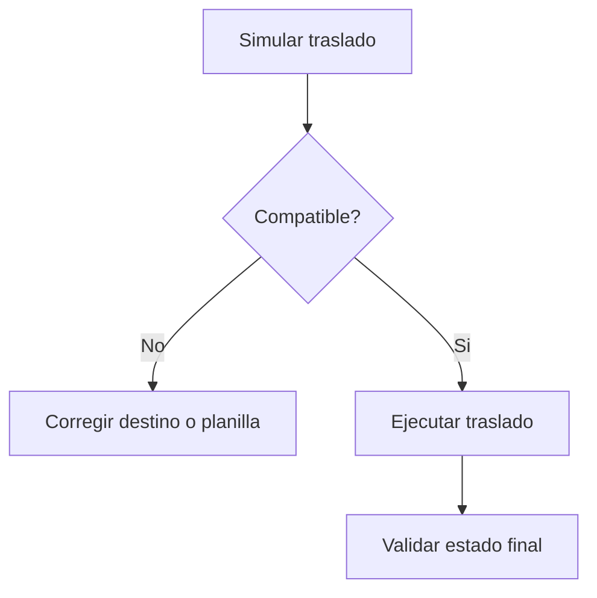

# 📘 Manual de Usuario - Traslado Interempresa

## 🎯 Para que sirve
Mover un empleado entre empresas manteniendo control de impacto en planilla y acciones asociadas.

## 🔄 Flujo operativo
1. Ir a `Gestion Planilla > Traslado interempresas`.
2. Ejecutar `Simular` traslado.
3. Revisar bloqueos y advertencias.
4. Ejecutar traslado real si la simulacion es valida.
5. Verificar acciones reasociadas o invalidadas.

## 🎯 Endpoints funcionales
- Simulacion: `POST /payroll/intercompany-transfer/simulate`
- Ejecucion: `POST /payroll/intercompany-transfer/execute`

Permiso requerido:
- `payroll:intercompany-transfer`

## 🎯 Que valida la simulacion
- Empresa origen y destino.
- Compatibilidad de planilla destino.
- Impacto sobre acciones pendientes/consumo.

## 🎯 Que pasa si bloquea
- Si no existe planilla destino compatible, no permite ejecutar.
- Si hay conflictos de estado, devuelve razones para corregir antes de reintentar.

## 🔄 Flujo de decision

## 🔗 Ver tambien
- [Planilla operativa](./05-PLANILLA-OPERATIVA.md)
- [Escenarios criticos](./08-FLUJOS-CRITICOS-Y-ESCENARIOS.md)

