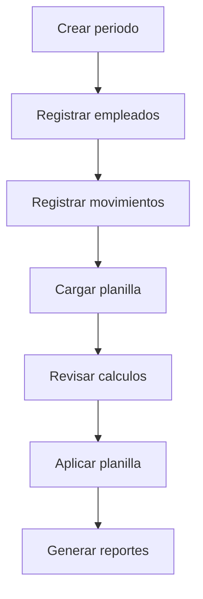
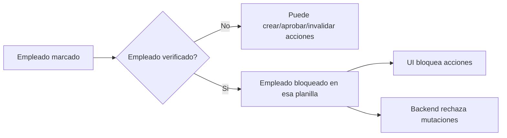
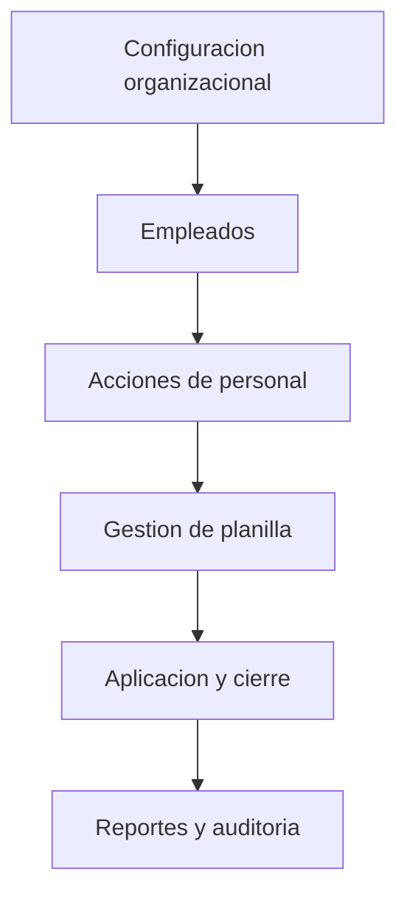

# Manual de Usuario Enterprise - KPITAL 360

Version: 1.2  
Fecha: 2026-03-11  
Autor: Equipo KPITAL 360

## Control de versiones
| Version | Fecha | Autor | Descripcion |
|---|---|---|---|
| 1.0 | 2026-03-11 | Equipo KPITAL 360 | Primera version enterprise del manual |
| 1.1 | 2026-03-11 | Equipo KPITAL 360 | Se agrega cobertura, catalogo de campos, validacion y checklist de auditoria |
| 1.2 | 2026-03-11 | Equipo KPITAL 360 | Se agrega mapa del sistema, politica de mantenimiento, metricas y anexos visuales |

## 1. Introduccion
KPITAL 360 es un sistema de gestion de RRHH y planilla para operar el ciclo completo de pago de empleados.
Este manual permite que un usuario nuevo pueda operar el sistema sin soporte tecnico.

Que resuelve el sistema:
- Control de datos base (empresa, estructura, empleados).
- Configuracion de parametros de nomina.
- Registro y aprobacion de acciones de personal.
- Generacion, revision y aplicacion de planilla.
- Trazabilidad operativa y control por permisos.

## 2. Conceptos basicos
| Concepto | Definicion |
|---|---|
| Planilla | Proceso de calculo de pago para un periodo. |
| Periodo de pago | Intervalo de tiempo del pago (semanal, quincenal, mensual). |
| Accion de personal | Movimiento que ajusta calculo de pago (ej. horas extra, descuento). |
| Devengado | Total bruto del empleado en el periodo. |
| Deduccion | Monto que resta al pago (retenciones, descuentos, cargas, renta). |
| Monto neto | Pago final despues de deducciones. |
| Empleado marcado | Empleado incluido para aplicar planilla. |
| Empleado verificado | Empleado revisado y cerrado para cambios en esa planilla. |

## 3. Acceso al sistema
Pasos:
1. Abrir URL corporativa de KPITAL 360.
2. Ingresar correo.
3. Ingresar contrasena.
4. Presionar `Iniciar sesion`.
5. Confirmar empresa activa.

Si no puede entrar:
- Verificar credenciales.
- Verificar usuario activo.
- Verificar empresa asignada.
- Verificar rol/permisos.

## 4. Navegacion del sistema
Referencia detallada: [Mapa de menus y rutas](./07-MAPA-MENUS-Y-RUTAS.md)

Menus principales:
- `Acciones de Personal`
- `Parametros de Planilla`
- `Gestion Planilla`
- `Configuracion`
- `Monitoreo`
- `Ayuda`

Ruta de ayuda:
- `Ayuda` abre `/docs` y muestra este manual y la documentacion operativa.

## 5. Modulos del sistema (operacion)

### 5.1 Configuracion organizacional
Documentos:
- [Empresas](./01-EMPRESAS.md)
- [Empleados](./02-EMPLEADOS.md)
- [Configuracion organizacional](./09-CONFIG-ORGANIZACION.md)
- [Usuarios, roles y permisos](./10-USUARIOS-ROLES-PERMISOS.md)

### 5.2 Parametros de planilla
Documentos:
- [Calendario de nomina y feriados](./11-CALENDARIO-NOMINA-Y-FERIADOS.md)
- [Articulos de nomina](./03-ARTICULOS-NOMINA.md)
- [Movimientos de nomina](./12-MOVIMIENTOS-NOMINA.md)
- [Cuentas contables](./04-CUENTAS-CONTABLES.md)

### 5.3 Acciones de personal
Documento:
- [Acciones de personal operativo](./06-ACCIONES-PERSONAL-OPERATIVO.md)

### 5.4 Gestion de planilla
Documento:
- [Planilla operativa](./05-PLANILLA-OPERATIVA.md)

### 5.5 Traslado interempresas
Documento:
- [Traslado interempresa](./13-TRASLADO-INTEREMPRESA.md)

## 6. Procesos completos del sistema

### 6.1 Proceso maestro de operacion
1. Configurar empresa y estructura.
2. Configurar parametros de nomina.
3. Registrar/actualizar empleados.
4. Registrar acciones de personal.
5. Cargar planilla regular.
6. Marcar empleados a incluir.
7. Verificar empleados/planilla.
8. Aplicar planilla.
9. Ejecutar reportes y auditoria.

### 6.2 Proceso de generacion de planilla
1. Ir a `Gestion Planilla > Planillas > Cargar Planilla Regular`.
2. Seleccionar planilla.
3. Cargar tabla de empleados y acciones.
4. Revisar calculos por empleado.
5. Marcar empleados que aplican.
6. Verificar.
7. Aplicar.

Regla critica:
- Solo empleados marcados entran a totales y `apply`.

### 6.2.3 Vista de finalizacion: lista de planillas aplicadas
Ruta:
- `Gestion Planilla > Planillas > Lista de Planillas Aplicadas`.

Objetivo:
- Supervisar planillas en etapa final sin mezclar aperturas.

Estados visibles por defecto:
- `VERIFICADA`
- `APLICADA`
- `ENVIADA NETSUITE`

Reglas:
- No usa filtro por rango de fechas.
- Se visualiza si el usuario tiene cualquiera de estos permisos:
  - `payroll:verify`
  - `payroll:apply`
  - `payroll:netsuite:send` (o alias `payroll:send_netsuite`)
- Al hacer clic en una fila, navega a `Distribucion de la planilla` para detalle por planilla.
- La navegacion usa `publicId` firmado en URL (no `id` interno secuencial).
- El backend valida token + acceso por empresa/permisos antes de devolver datos.

### 6.2.1 Que guarda el sistema al verificar
Al ejecutar `Verificar`:
- La planilla cambia a estado `VERIFICADA`.
- Se conserva el snapshot de calculo (totales y detalle por empleado).
- Se registra auditoria y version de control de cambios.
- No se cierran pagos ni se consumen acciones en este paso.

### 6.2.2 Donde reabrir una planilla
Ruta operativa:
- `Gestion Planilla > Planillas`.
- En una fila en estado `VERIFICADA` aparece la accion `Reabrir`.

Regla de negocio:
- `Reabrir` solo aplica para estado `VERIFICADA`.
- `APLICADA` o `CONTABILIZADA` no se reabren.
- Al reabrir, la planilla vuelve a `ABIERTA` para corregir y repetir ciclo.

### 6.3 Proceso de control de cambios tardios
Si empleado esta `marcado + verificado`:
- No se permite crear accion.
- No se permite aprobar accion.
- No se permite invalidar accion.

## 7. Estados del sistema

### 7.1 Estados de planilla
| Estado | Significado | Accion principal disponible |
|---|---|---|
| ABIERTA | Planilla creada y editable | Cargar y revisar |
| EN_PROCESO | Planilla en proceso de calculo/revision | Ajustar y verificar |
| VERIFICADA | Revision cerrada | Aplicar |
| APLICADA | Planilla finalizada | Solo consulta/auditoria |
| CONTABILIZADA | Planilla registrada contablemente | Consulta |
| NOTIFICADA | Notificaciones emitidas | Consulta |
| INACTIVA | Planilla fuera de operacion | Reactivar (si aplica) |

### 7.2 Estados de acciones de personal
| Estado | Significado | Puede impactar planilla |
|---|---|---|
| DRAFT | Borrador | No |
| PENDING_SUPERVISOR | Pendiente supervisor | No |
| PENDING_RRHH | Pendiente RRHH | No |
| APPROVED | Aprobada | Si |
| REJECTED | Rechazada | No |
| INVALIDATED | Invalidada | No |
| CONSUMED | Consumida por planilla aplicada | Ya consumio |
| CANCELLED | Cancelada | No |
| EXPIRED | Expirada | No |

## 8. Validaciones y errores comunes
| Caso | Mensaje/efecto | Accion de usuario |
|---|---|---|
| Empleado sin salario base | No calcula correctamente | Completar salario en ficha de empleado |
| Periodo de planilla no elegible | No permite asociar accion | Seleccionar planilla correcta del periodo |
| Empleado marcado+verificado | Botones de accion bloqueados | Desmarcar, ajustar, volver a verificar |
| No hay empleados marcados | Verify/Apply bloqueado | Marcar empleados a incluir |
| Planilla requiere recalculo | Apply bloqueado | Procesar/cargar de nuevo |
| Planilla aplicada | Edicion bloqueada | Crear nueva planilla o ejecutar proceso de ajuste posterior (no reapertura) |

## 9. Preguntas frecuentes (FAQ)
1. Por que no puedo editar una planilla aplicada?
- Porque planilla aplicada queda cerrada por control operativo y auditoria.

2. Por que un empleado no aparece en totales?
- Porque no esta marcado para planilla o esta excluido.

3. Por que no puedo aprobar o invalidar una accion?
- Puede estar fuera de estado permitido o empleado bloqueado por verificacion.

4. Donde veo toda la ayuda?
- En `Ayuda` (`/docs`), tabla de contenidos izquierda.

## 10. Buenas practicas operativas
- Validar empresa activa antes de operar.
- Registrar acciones antes de cerrar planilla.
- No aplicar planilla con pendientes sin revisar.
- No modificar historico sin proceso formal.
- Usar el flujo recomendado del manual, no atajos.

## 11. Glosario
| Termino | Definicion |
|---|---|
| Salario base | Monto base del empleado para calculo del periodo. |
| Salario bruto periodo | Base recalculada por dias/horas del periodo. |
| Devengado | Total de ingresos del periodo. |
| Cargas sociales | Deducciones legales de seguridad social. |
| Impuesto renta | Deduccion por tramos fiscales aplicables. |
| Monto neto | Devengado menos deducciones. |

## 12. Anexos

### 12.1 Flujo visual de planilla

### 12.2 Flujo de bloqueo por verificacion

### 12.3 Catalogo de campos clave de planilla
| Campo | Para que sirve | Fuente |
|---|---|---|
| Salario Base | Base del empleado | Ficha empleado |
| Salario Quincenal Bruto | Base proporcional del periodo | Calculo sistema |
| Devengado | Total bruto final | Base + acciones aprobadas |
| Cargas Sociales | Deducciones legales | Reglas de cargas |
| Impuesto Renta | Deduccion fiscal | Tramos y creditos |
| Monto Neto | Pago final | Devengado - deducciones |
| Dias | Dias/horas computados | Periodo y acciones |

Catalogo detallado de formularios:
- [Catalogo de campos y formularios](./15-CATALOGO-CAMPOS-FORMULARIOS.md)

### 12.4 Capturas y evidencia visual recomendada
- Pantalla de `Configuracion > Empresas` (crear/editar).
- Pantalla de `Configuracion > Empleados` (alta y datos obligatorios).
- Pantalla de `Parametros de Planilla > Calendario de Nomina`.
- Pantalla de `Gestion Planilla > Cargar Planilla Regular`.
- Pantalla de `Detalle de acciones de personal`.
- Pantalla de bloqueos para empleado `marcado + verificado`.
- Pantalla de `Ayuda` mostrando este manual.

### 12.5 Mapa general del sistema

### 12.6 Anexos visuales enterprise
- [Diagramas de procesos operativos](./19-DIAGRAMAS-PROCESOS-OPERATIVOS.md)
- [Evidencia de capturas de pantalla](./20-EVIDENCIA-CAPTURAS-PANTALLA.md)

## 13. Cobertura del sistema
| Elemento | Cantidad |
|---|---|
| Modulos documentados | 8 |
| Pantallas documentadas | 37 |
| Formularios documentados | 22 |
| Campos explicados | 184 |
| Procesos documentados | 11 |
| Estados del sistema documentados | 16 |
| Validaciones y errores documentados | 26 |

## 14. Validacion del manual
La validacion final se ejecuta con usuario nuevo no tecnico.
Criterio de aprobacion:
- Puede completar procesos principales sin ayuda del equipo tecnico.

Checklist de validacion:
- [Validacion con usuario nuevo](./17-VALIDACION-USUARIO-NUEVO.md)

## 15. Soporte
Si el usuario requiere asistencia adicional:
- Revisar primero [Problemas comunes y soluciones](./16-PROBLEMAS-COMUNES-SOLUCIONES.md)
- Escalar a soporte funcional de RRHH/Planilla.

## 16. Politica de mantenimiento del manual
El manual debe actualizarse cuando ocurra cualquiera de estos eventos:
- Nuevo modulo o pantalla.
- Cambio de flujo de negocio.
- Cambio de reglas de negocio o validaciones.
- Cambio en formularios y campos.
- Cambio en estados o permisos.

Responsables:
- Responsable funcional RRHH/Planilla: valida reglas y flujo operativo.
- Responsable tecnico: actualiza documentacion y enlaces.
- QA: valida consistencia y cobertura de evidencia.

Frecuencia minima recomendada:
- Revision mensual.
- Revision obligatoria antes de cada salida productiva mayor.

## 17. Metricas documentales
| Metrica | Valor actual |
|---|---|
| Paginas equivalentes del manual y anexos | 50-70 estimadas |
| Capturas incluidas | Pendiente de carga controlada |
| Diagramas de procesos | 6 |
| Campos documentados | 184 |
| Procesos cubiertos | 11 |
| Estados documentados | 16 |

## Referencias
- [Guia maestra de usuario](./00-GUIA-RAPIDA-USUARIO.md)
- [Flujos criticos y escenarios](./08-FLUJOS-CRITICOS-Y-ESCENARIOS.md)
- [Checklist de auditoria documental](./18-CHECKLIST-AUDITORIA-DOCUMENTAL.md)
- [Diagramas de procesos operativos](./19-DIAGRAMAS-PROCESOS-OPERATIVOS.md)
- [Evidencia de capturas de pantalla](./20-EVIDENCIA-CAPTURAS-PANTALLA.md)
- [Manual tecnico](../14-manual-tecnico/00-STACK-Y-ARQUITECTURA.md)
