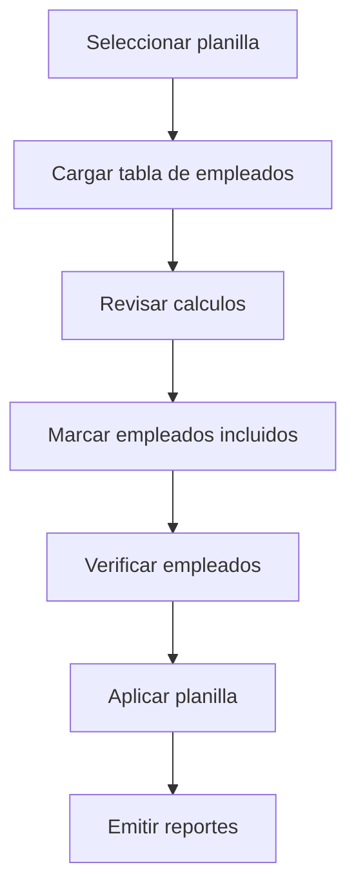
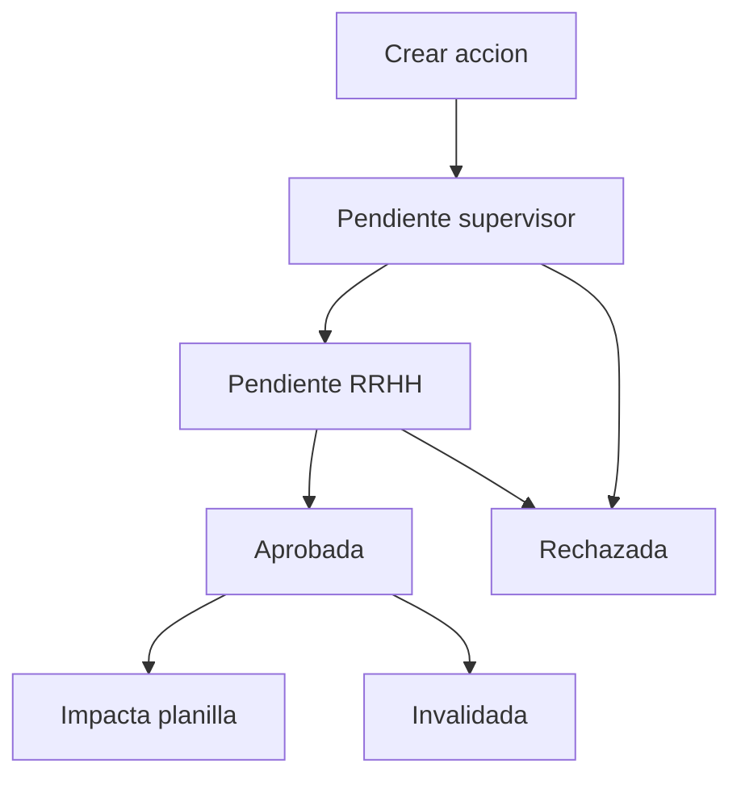
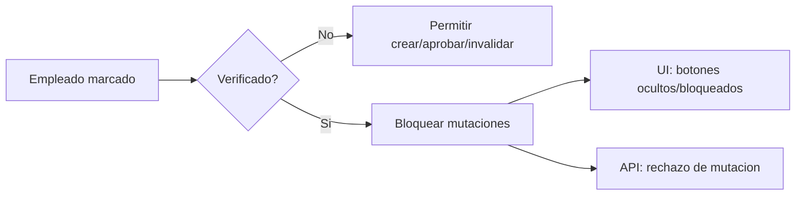
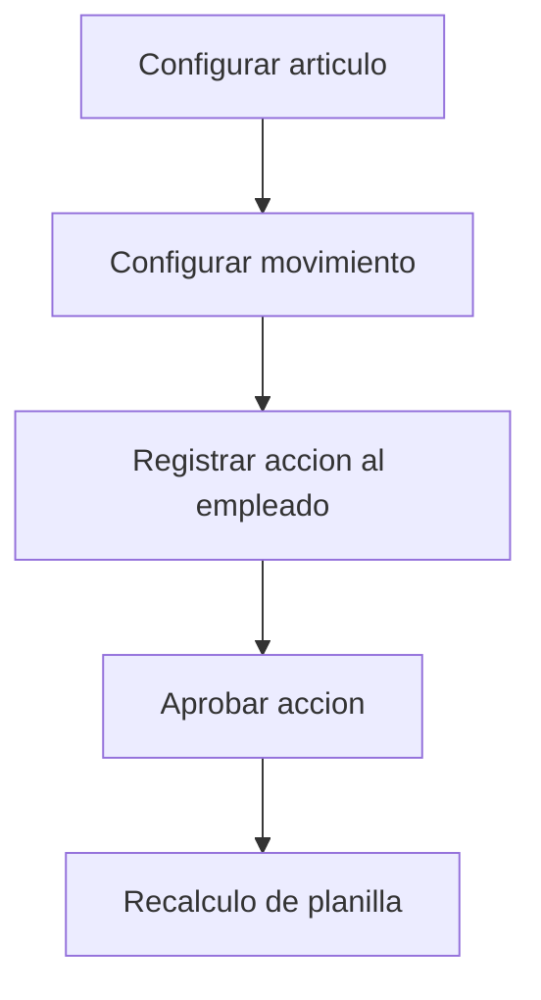
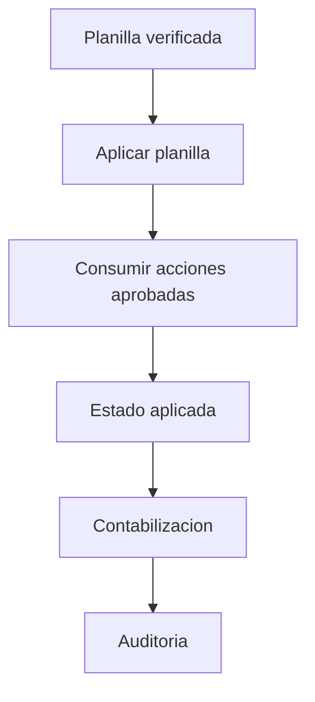
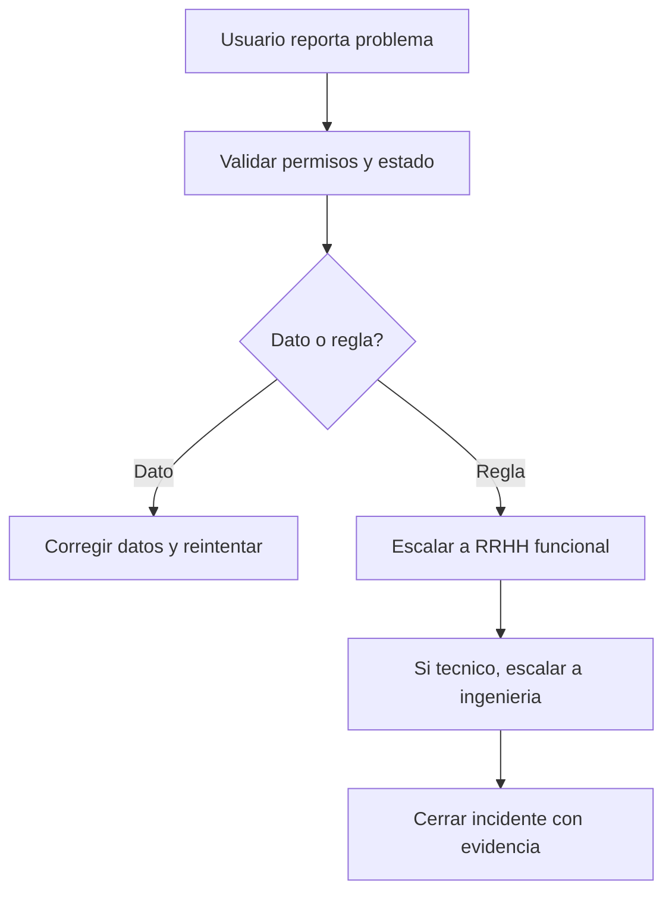
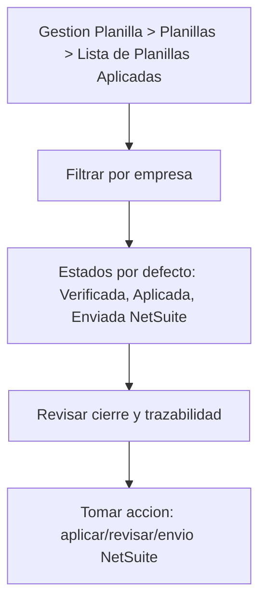

# Diagramas de Procesos Operativos - KPITAL 360

Version: 1.0  
Fecha: 2026-03-11

## 1. Flujo de generacion de planilla

## 2. Flujo de acciones de personal

## 3. Flujo de bloqueo por verificacion

## 4. Flujo de movimientos salariales

## 5. Flujo de aplicacion y cierre

## 6. Flujo de soporte e incidentes funcionales

## 7. Flujo de vista de planillas aplicadas

## Referencias
- [Manual de Usuario Enterprise](./14-MANUAL-USUARIO-ENTERPRISE-KPITAL360.md)
- [Checklist de auditoria documental](./18-CHECKLIST-AUDITORIA-DOCUMENTAL.md)
