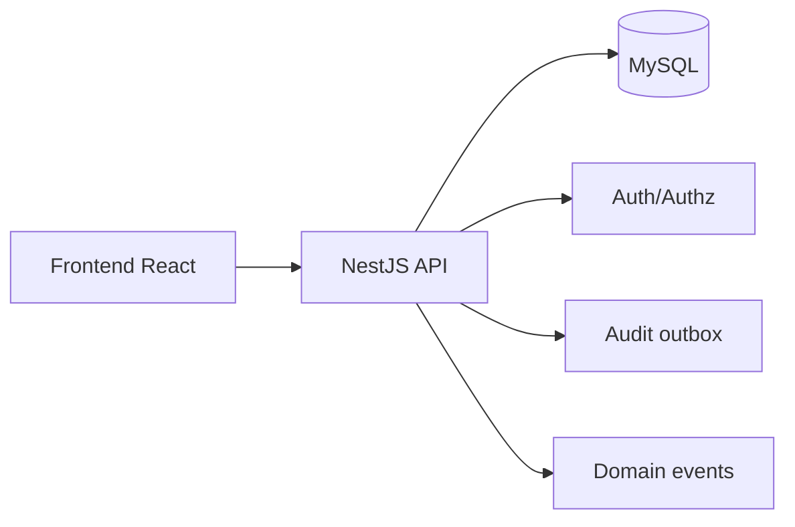

# 🛠️ Manual Tecnico - Stack y Arquitectura

## 🎯 Stack base
- Frontend: React + Vite + TypeScript + Ant Design
- Estado FE: Redux Toolkit + TanStack Query
- Backend: NestJS + TypeORM
- Base de datos: MySQL
- Seguridad: JWT + cookies httpOnly + CSRF token + control de permisos por app/empresa

## 🎯 Arquitectura funcional

## 🔄 Flujo de autenticacion y autorizacion
1. Login (`/auth/login` o Microsoft).
2. API emite access token + refresh token + csrf.
3. FE consulta `/auth/me` para sesion y permisos.
4. FE cambia contexto con `/auth/switch-company`.
5. Backend resuelve permisos efectivos por usuario+empresa+app.

## 🔗 Rutas de este manual tecnico
1. [Reglas tecnicas](./01-REGLAS-TECNICAS.md)
2. [Seguridad y permisos](./02-SEGURIDAD-PERMISOS.md)
3. [Datos y BD](./03-DATOS-Y-BD.md)
4. [API y contratos](./04-API-CONTRATOS.md)
5. [QA y testing](./05-QA-Y-TESTING.md)
6. [Pendientes tecnicos](./06-PENDIENTES-TECNICOS.md)
7. [Operacion por modulo](./07-OPERACION-POR-MODULO.md)
8. [Matriz CRUD por modulo](./08-MATRIZ-CRUD-POR-MODULO.md)
9. [Manejo de incidentes](./09-MANEJO-INCIDENTES-FUNCIONALES.md)
10. [Herramientas y estandares](./10-HERRAMIENTAS-Y-ESTANDARES.md)

